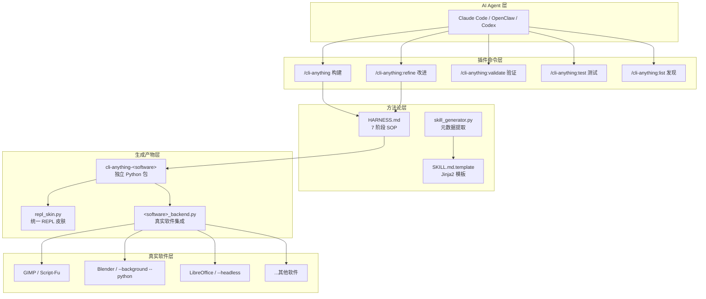
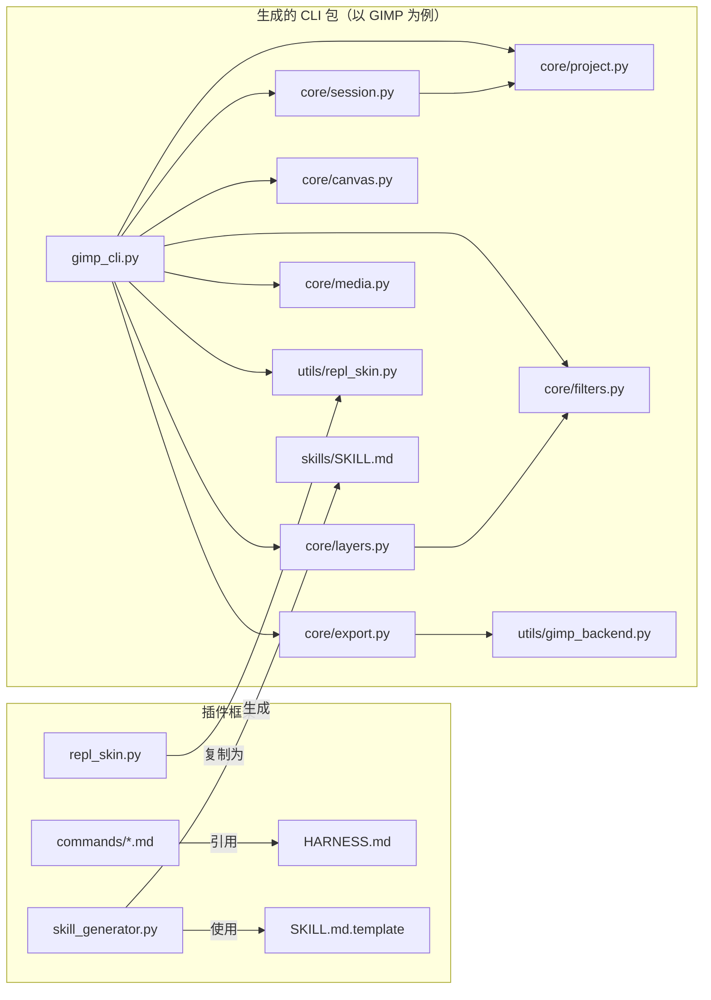
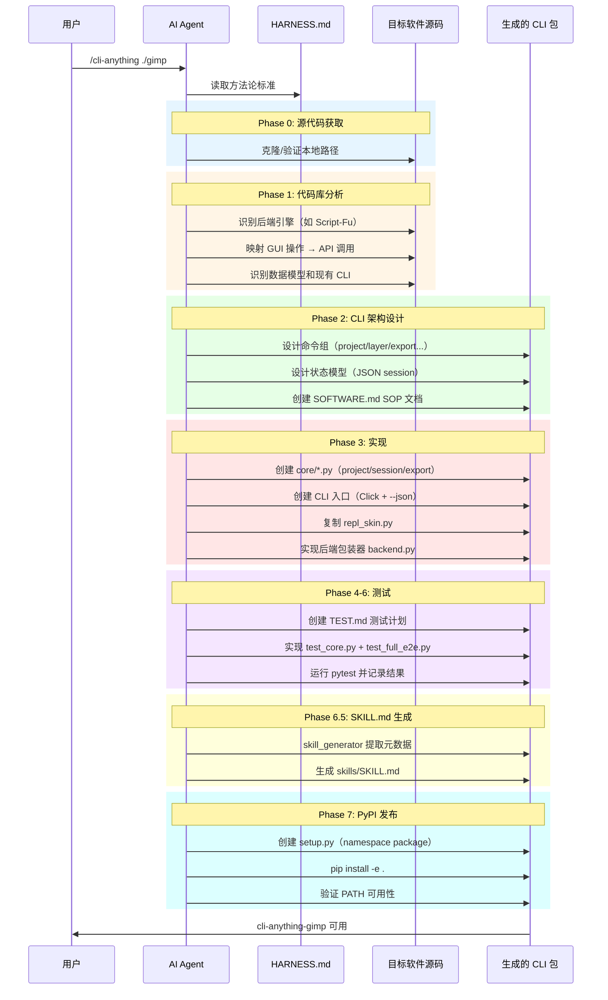
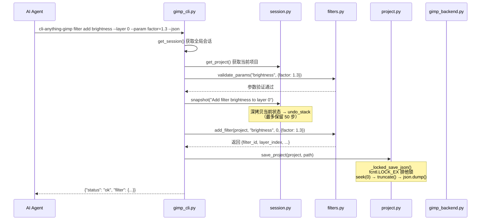

# CLI-Anything 源码学习笔记

> 仓库地址：[CLI-Anything](https://github.com/HKUDS/CLI-Anything)
> 学习日期：2026-03-22

---

> **以下为 AI 源码分析**
>
> ### 一句话概括
>
> CLI-Anything 是一个系统化框架，通过 7 阶段方法论将任意 GUI 应用程序自动转换为 AI Agent 可操作的有状态命令行接口。
>
> ### 要点速览
>
> | 核心模块 | 职责 | 关键文件 |
> |---------|------|---------|
> | cli-anything-plugin | 核心插件框架，定义 7 阶段构建方法论 | `HARNESS.md`, `commands/*.md`, `skill_generator.py` |
> | repl_skin | 统一 REPL 终端界面和品牌化皮肤 | `repl_skin.py` |
> | 各软件 harness | 具体 GUI 应用的 CLI 实现（GIMP、Blender 等 17 个） | `<software>/agent-harness/` |
> | 跨平台适配 | 支持 Claude Code、OpenClaw、Codex 等 AI 平台 | `openclaw-skill/`, `codex-skill/`, `opencode-commands/` |
> | CLI-Hub | 社区 CLI 注册中心和发现平台 | `registry.json`, `docs/hub/index.html` |

---

## 项目简介

CLI-Anything 解决了一个关键问题：**当今软件为人类设计，但未来的用户将是 AI Agent**。GUI 应用（如 GIMP、Blender、LibreOffice）无法被 AI 直接操作，因为它们依赖鼠标、键盘和显示器。CLI-Anything 提供了一套标准化的方法论和工具链，让 AI 编程助手（如 Claude Code）能够自动分析任意 GUI 应用的源码，生成功能完整、有状态、支持 JSON 输出的命令行接口，从而让 AI Agent 能够像人类一样操控这些软件。项目已为 17 个应用生成了 CLI，累计通过 1,839 个测试。

## 技术栈

| 类别 | 技术 |
|------|------|
| 语言 | Python 3.10+ |
| 框架 | Click (CLI 框架), prompt-toolkit (REPL 交互) |
| 构建工具 | setup.py + PEP 420 namespace packages |
| 依赖管理 | pip, setuptools (`find_namespace_packages`) |
| 测试框架 | pytest + pytest-cov |

## 目录结构

```
CLI-Anything/
├── cli-anything-plugin/          # 核心插件框架（方法论 + 工具）
│   ├── .claude-plugin/           #   Claude Code 插件元数据
│   │   └── plugin.json
│   ├── commands/                 #   5 个 slash 命令定义
│   │   ├── cli-anything.md       #     主命令：7 阶段构建
│   │   ├── refine.md             #     增量改进
│   │   ├── test.md               #     测试运行
│   │   ├── validate.md           #     52 项标准验证
│   │   └── list.md               #     已装/已生成 CLI 发现
│   ├── templates/                #   Jinja2 模板
│   │   └── SKILL.md.template     #     SKILL.md 生成模板
│   ├── HARNESS.md                #   核心方法论文档（最关键）
│   ├── skill_generator.py        #   SKILL.md 自动生成器
│   └── repl_skin.py              #   统一 REPL 皮肤
│
├── gimp/                         # GIMP 图像编辑 CLI
│   └── agent-harness/
│       ├── GIMP.md               #   软件特定 SOP
│       ├── setup.py              #   PyPI 包配置
│       └── cli_anything/gimp/    #   CLI 实现
│           ├── gimp_cli.py       #     Click CLI 入口（9 个命令组）
│           ├── core/             #     核心模块（project/session/layers/filters/canvas/export）
│           ├── utils/            #     工具（repl_skin + gimp_backend）
│           ├── skills/           #     AI 可发现的 SKILL.md
│           └── tests/            #     单元 + E2E 测试
│
├── blender/                      # Blender 3D 建模 CLI
├── inkscape/                     # Inkscape 矢量图形 CLI
├── audacity/                     # Audacity 音频编辑 CLI
├── libreoffice/                  # LibreOffice 文档处理 CLI
├── kdenlive/                     # Kdenlive 视频编辑 CLI
├── shotcut/                      # Shotcut 视频编辑 CLI
├── obs-studio/                   # OBS Studio 直播推流 CLI
├── comfyui/                      # ComfyUI AI 图像生成 CLI
├── anygen/                       # AnyGen 云 API CLI（非本地 GUI）
├── drawio/                       # Draw.io 绘图 CLI
├── zoom/                         # Zoom 会议管理 CLI
├── ollama/                       # Ollama 本地 LLM CLI
├── mubu/                         # 幕布知识管理 CLI
├── notebooklm/                   # NotebookLM CLI
├── novita/                       # Novita AI API CLI
├── mermaid/                      # Mermaid 图表 CLI
├── adguardhome/                  # AdGuardHome 网络管理 CLI
│
├── openclaw-skill/               # OpenClaw 平台适配
├── codex-skill/                  # Codex 平台适配
├── opencode-commands/            # OpenCode 平台适配
├── qoder-plugin/                 # Qodercli 平台适配
│
├── registry.json                 # CLI-Hub 注册表（所有 CLI 索引）
├── docs/hub/index.html           # CLI-Hub 网页前端
└── skill_generation/             # SKILL 生成测试
```

## 架构设计

### 整体架构

CLI-Anything 采用**方法论驱动的代码生成**架构。核心不是一个运行时框架，而是一套标准化的 SOP（Standard Operating Procedure），由 AI Agent 执行。HARNESS.md 定义了将任意 GUI 应用转换为 CLI 的 7 阶段流程，生成的每个 CLI 都是独立的 Python 包，通过 PEP 420 namespace package 共存于 `cli_anything` 命名空间下。



### 核心模块

#### 1. HARNESS.md — 核心方法论

**职责**：定义 GUI 到 CLI 的完整转换标准，是所有命令和所有平台适配共同遵循的"宪法"。

**关键文件**：`cli-anything-plugin/HARNESS.md`

**核心内容**：
- **Phase 1-2**：代码库分析 + CLI 架构设计（识别后端引擎、映射 GUI 操作、规划命令组）
- **Phase 3**：实现标准（Click 框架、`--json` 输出、会话状态、REPL 模式、文件锁保存）
- **Phase 4-6**：测试 4 层策略（单元 → 项目文件验证 → 真实后端 → CLI 子进程）
- **Phase 6.5**：SKILL.md 自动生成（AI Agent 可发现性）
- **Phase 7**：PyPI 发布（PEP 420 namespace package）

**4 条金律**：
1. 使用真实软件后端，不要重新实现
2. 正确处理渲染间隙（The Rendering Gap）
3. 注意过滤器翻译陷阱（参数空间差异、去重、排序）
4. 时间码精度（使用 `round()` 而非 `int()`）

#### 2. cli-anything-plugin — 插件命令系统

**职责**：将方法论封装为 Claude Code 可执行的 slash 命令。

**关键文件**：
- `commands/cli-anything.md` — 主构建命令，触发完整 7 阶段流程
- `commands/refine.md` — 增量改进命令，差距分析 + 优先级排序
- `commands/validate.md` — 52 项标准验证检查
- `commands/list.md` — 已安装/已生成 CLI 发现

**与其他模块的关系**：所有命令引用 HARNESS.md 作为实现标准。

#### 3. skill_generator.py — SKILL.md 生成器

**职责**：从已实现的 CLI harness 中自动提取元数据，生成 AI 可发现的技能描述文件。

**关键文件**：`cli-anything-plugin/skill_generator.py`

**核心类和函数**：
- `SkillMetadata` / `CommandGroup` / `CommandInfo` / `Example` — 数据类
- `extract_cli_metadata(harness_path)` — 从 harness 目录提取元数据
- `extract_commands_from_cli(cli_path)` — 使用正则解析 Click 装饰器提取命令
- `generate_skill_md(metadata)` — 使用 Jinja2 模板生成 SKILL.md
- `generate_skill_md_simple(metadata)` — 无 Jinja2 依赖的回退实现

#### 4. repl_skin.py — 统一 REPL 皮肤

**职责**：为所有生成的 CLI 提供一致的交互式终端界面和品牌化体验。

**关键文件**：`cli-anything-plugin/repl_skin.py`（被复制到每个 harness 的 `utils/` 下）

**核心类 `ReplSkin`**：
- `print_banner()` — 品牌化启动横幅，自动检测 `skills/SKILL.md` 并显示路径
- `prompt(project_name, modified)` — 构建提示符 `◆ gimp [myproject*] ❯`
- `create_prompt_session()` — prompt-toolkit 集成，带历史记录和自动建议
- `success()` / `error()` / `warning()` / `info()` — 统一消息格式
- `table()` — 带 box-drawing 字符的格式化表格
- `progress()` — 进度条

**品牌颜色系统**：每个软件有独特的 ANSI 颜色（GIMP 暖橙、Blender 深橙、Inkscape 亮蓝等）。

#### 5. 各 `<software>/agent-harness/` — 具体 CLI 实现

**职责**：每个目录是一个独立的 Python 包，实现了特定 GUI 应用的完整 CLI。

以 GIMP harness 为例的标准结构：
- `gimp_cli.py` — Click CLI 入口，包含 9 个命令组（project / layer / canvas / filter / media / export / draw / session / repl）
- `core/project.py` — 项目 CRUD + 15 个预定义配置（hd1080p、a4_300dpi、instagram_post 等）
- `core/session.py` — 会话管理 + undo/redo 栈（最大 50 步）+ 文件锁保存
- `core/layers.py` — 图层 CRUD + 16 种混合模式 + 纯 Python 图像维度读取（支持 6 种格式）
- `core/filters.py` — 38 个滤镜注册表 + 参数验证
- `core/canvas.py` — 画布操作（resize / scale / crop / mode / dpi）
- `core/export.py` — 导出预设 + 双渲染后端（GIMP Script-Fu 优先，Pillow 回退）
- `utils/gimp_backend.py` — GIMP 批处理后端包装器（`find_gimp()` / `batch_script_fu()` / `render_project()`）

### 模块依赖关系



## 核心流程

### 流程一：7 阶段 CLI 构建流程

这是 CLI-Anything 最核心的流程——当 AI Agent 执行 `/cli-anything <software-path>` 命令时的完整构建链。



### 流程二：CLI 命令执行流程（以滤镜添加为例）

展示生成的 CLI 运行时的内部调用链。



## 关键设计亮点

### 1. PEP 420 Namespace Package 实现多包共存

**解决的问题**：17 个独立的 CLI 包（`cli-anything-gimp`、`cli-anything-blender` 等）需要共存于同一个 `cli_anything` 命名空间下，且可以独立安装/卸载。

**实现方式**：`cli_anything/` 目录不放 `__init__.py`（声明为 namespace package），每个子包 `cli_anything/<software>/` 才有 `__init__.py`。`setup.py` 使用 `find_namespace_packages(include=["cli_anything.*"])`。

**为什么这样设计**：传统的 regular package 要求顶层 `__init__.py`，多个包安装时会互相覆盖。PEP 420 允许多个发行版贡献到同一命名空间而无冲突，完美适配 CLI-Anything 的"一软件一包"架构。

### 2. 原子文件锁会话保存（`_locked_save_json`）

**解决的问题**：并发写入会话 JSON 文件可能导致数据损坏（如 REPL 中快速连续操作）。

**实现方式**（`core/session.py`）：
- 以 `"r+"` 模式打开文件（不截断），获取 `fcntl.LOCK_EX` 排他锁后再 `seek(0)` + `truncate()` + `json.dump()`
- 如果文件不存在则以 `"w"` 模式创建
- Windows/不支持的文件系统优雅降级（跳过锁）

**为什么这样设计**：常见的 `open("w") + json.dump()` 在打开时就截断文件，此时还未获得锁，另一个进程可能读到空文件。先开 `"r+"` 再在锁内截断，保证了原子性。

### 3. 双渲染后端策略（Real Backend + Fallback）

**解决的问题**：CLI 生成的项目文件需要通过真实软件渲染，但真实软件可能未安装。

**实现方式**（以 GIMP 为例，`core/export.py` + `utils/gimp_backend.py`）：
- **优先路径**：调用真实 GIMP 的 Script-Fu 批处理接口（`gimp -i -b '(script-fu ...)'`），由 GIMP 引擎执行完整渲染
- **回退路径**：使用 Pillow 进行 Python 端渲染（支持 16 种混合模式的 numpy 计算）

**为什么这样设计**：HARNESS.md 的第一条金律就是"使用真实软件，不要重新实现"。真实后端保证了输出的专业品质和完整性（如 GIMP 的高级滤镜），而 Pillow 回退让 CLI 在开发和测试环境中也能工作。

### 4. 4 层测试策略保证端到端可靠性

**解决的问题**：生成的 CLI 必须真正可用，不能只是"看起来能跑"。

**实现方式**（`tests/test_core.py` + `tests/test_full_e2e.py`）：
- **第 1 层**：纯单元测试，synthetic data，零外部依赖
- **第 2 层**：项目文件结构验证（XML/JSON/ZIP 格式正确性）
- **第 3 层**：调用真实软件后端，验证输出文件（magic bytes、文件大小、内容）
- **第 4 层**：`TestCLISubprocess` 通过子进程测试已安装的 CLI 命令，使用 `_resolve_cli()` 自动发现

**为什么这样设计**：第 1-2 层保证核心逻辑正确，第 3 层验证真实集成，第 4 层模拟 AI Agent 的实际使用方式。`_resolve_cli()` 在开发时回退到 `python -m`，在 CI 中可通过 `CLI_ANYTHING_FORCE_INSTALLED=1` 强制要求已安装命令。

### 5. SKILL.md 自动生成实现 AI 可发现性

**解决的问题**：生成的 CLI 需要被 AI Agent 自动发现和理解，而不是靠人工编写文档。

**实现方式**（`skill_generator.py` + `templates/SKILL.md.template`）：
- 使用正则表达式解析 Click 装饰器，提取命令组、命令名、描述
- 从 `README.md` 提取介绍和系统依赖，从 `setup.py` 提取版本号
- 使用 Jinja2 模板渲染 YAML frontmatter + Markdown body
- 生成到 `skills/SKILL.md`，`ReplSkin.print_banner()` 自动检测并在启动时显示绝对路径

**为什么这样设计**：AI Agent 通过读取 SKILL.md 的 YAML frontmatter 判断何时使用这个 CLI，通过 Markdown body 了解具体命令和示例。完全自动化的生成流程保证文档与代码始终同步。
