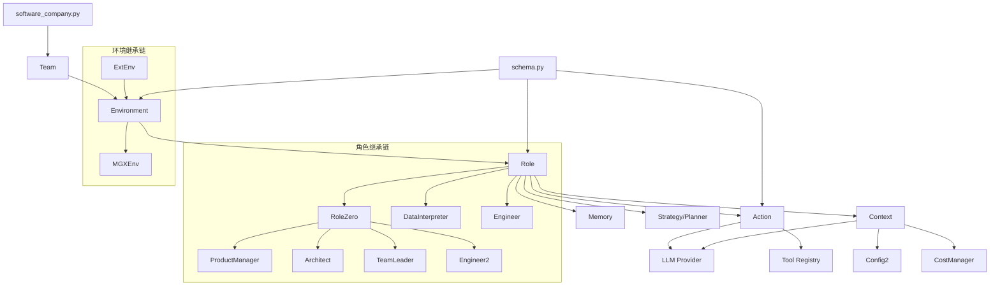
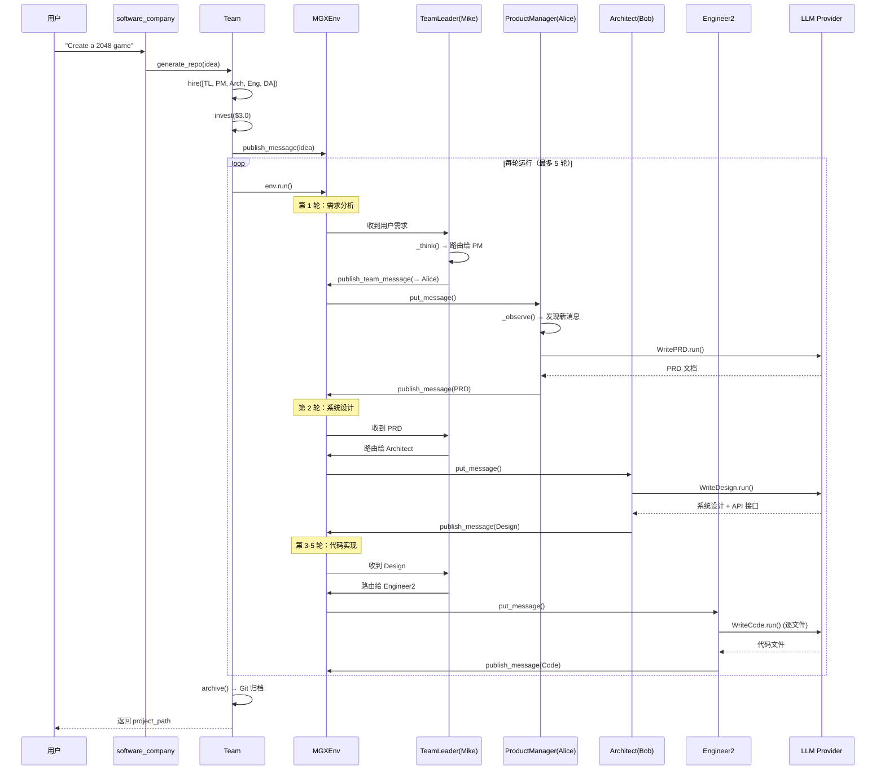
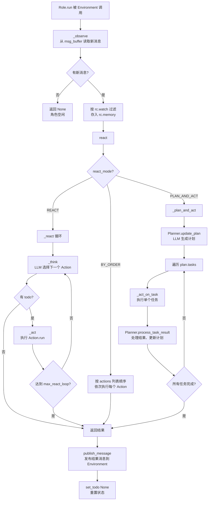

# MetaGPT 源码学习笔记

> 仓库地址：[MetaGPT](https://github.com/FoundationAgents/MetaGPT)
> 学习日期：2026-03-22

---

> **以下为 AI 源码分析**
>
> ### 一句话概括
>
> MetaGPT 是一个多智能体协作框架，通过模拟软件公司的 SOP（标准操作流程），让多个 LLM Agent 扮演产品经理、架构师、工程师等角色，协同完成从需求到代码的软件开发全流程。
>
> ### 要点速览
>
> | 核心模块 | 职责 | 关键文件 |
> |---------|------|---------|
> | Role 系统 | Agent 角色定义与生命周期管理 | `metagpt/roles/role.py` |
> | Action 系统 | 角色可执行的原子操作 | `metagpt/actions/action.py` |
> | Environment | 多 Agent 通信与消息路由 | `metagpt/environment/base_env.py` |
> | Team | 团队组装与运行编排 | `metagpt/team.py` |
> | Provider | 多 LLM 后端统一接入 | `metagpt/provider/` |
> | Memory | Agent 记忆与消息存储 | `metagpt/memory/memory.py` |
> | Strategy | 规划与决策策略 | `metagpt/strategy/planner.py` |
> | Tools | 工具注册与调用框架 | `metagpt/tools/tool_registry.py` |

---

## 项目简介

MetaGPT 是由 DeepWisdom 开发的多智能体框架（Multi-Agent Framework），核心理念是 **`Code = SOP(Team)`**——将软件公司的标准操作流程（SOP）编码化，并应用于由 LLM 组成的智能体团队。用户只需输入一行需求描述（如 "Create a 2048 game"），MetaGPT 便会自动生成用户故事、竞品分析、需求文档、系统设计、API 接口、代码实现等全套交付物。项目已在 ICLR 2024 发表论文，并衍生出商业化产品 MGX (MetaGPT X)。

## 技术栈

| 类别 | 技术 |
|------|------|
| 语言 | Python 3.9 ~ 3.11 |
| 框架 | Pydantic v2（数据模型）、Typer（CLI）、asyncio（异步编排） |
| 构建工具 | setuptools、Dockerfile |
| 依赖管理 | pip / requirements.txt / setup.py extras_require |
| 测试框架 | pytest、pytest-asyncio、pytest-mock |

## 目录结构

```
metagpt/
├── actions/                # Action 定义：各角色执行的原子操作
│   ├── action.py           #   Action 基类
│   ├── action_node.py      #   结构化输出的 ActionNode
│   ├── write_prd.py        #   编写 PRD 文档
│   ├── design_api.py       #   系统设计与 API 设计
│   ├── write_code.py       #   代码生成
│   ├── write_code_review.py#   代码审查
│   ├── di/                 #   Data Interpreter 相关 Action
│   └── ...
├── roles/                  # Role 定义：各 Agent 角色
│   ├── role.py             #   Role 基类（observe → think → act 循环）
│   ├── product_manager.py  #   产品经理（Alice）
│   ├── architect.py        #   架构师（Bob）
│   ├── engineer.py         #   工程师（Alex）
│   ├── qa_engineer.py      #   QA 工程师（Edward）
│   ├── di/                 #   动态智能体（RoleZero、TeamLeader、DataInterpreter）
│   │   ├── role_zero.py    #     动态思考与工具调用的基础角色
│   │   ├── team_leader.py  #     团队领导者，负责消息路由与任务分配
│   │   ├── data_interpreter.py # 数据分析解释器
│   │   └── engineer2.py    #     新版工程师
│   └── ...
├── environment/            # Environment：Agent 通信环境
│   ├── base_env.py         #   环境基类（消息发布/订阅、角色管理）
│   ├── mgx/                #   MGX 环境（TeamLeader 路由模式）
│   └── ...
├── provider/               # LLM Provider：多模型后端适配
│   ├── base_llm.py         #   LLM 抽象基类
│   ├── openai_api.py       #   OpenAI 适配
│   ├── anthropic_api.py    #   Anthropic Claude 适配
│   ├── google_gemini_api.py#   Google Gemini 适配
│   └── ...
├── memory/                 # Memory：消息记忆系统
│   ├── memory.py           #   基础记忆（按 cause_by 索引）
│   ├── longterm_memory.py  #   长期记忆
│   └── role_zero_memory.py #   RoleZero 长期记忆
├── strategy/               # Strategy：规划与决策
│   ├── planner.py          #   任务规划器
│   ├── tot.py              #   Tree of Thought
│   └── ...
├── tools/                  # Tools：工具注册与搜索引擎
│   ├── tool_registry.py    #   工具注册中心
│   ├── tool_recommend.py   #   BM25 工具推荐
│   └── libs/               #   内置工具（Browser、Editor、Terminal）
├── ext/                    # Extensions：扩展应用
│   ├── aflow/              #   AFlow 自动 Agent 工作流生成
│   ├── spo/                #   SPO 自优化框架
│   ├── sela/               #   SELA 实验运行
│   └── ...
├── rag/                    # RAG：检索增强生成
│   ├── engines/            #   检索引擎（Simple、FLARE）
│   ├── retrievers/         #   检索器（BM25、FAISS、Chroma、ES）
│   └── factories/          #   工厂模式创建检索组件
├── configs/                # Config：配置模型定义
├── schema.py               # 核心数据结构（Message、Document 等）
├── context.py              # 全局上下文（Config、LLM、CostManager）
├── team.py                 # Team：团队编排入口
├── software_company.py     # CLI 入口 & generate_repo API
└── const.py                # 全局常量
```

## 架构设计

### 整体架构

MetaGPT 采用 **"模拟软件公司"** 的架构设计，将软件开发流程抽象为多个角色（Role）在共享环境（Environment）中通过消息（Message）协作的过程。核心设计遵循 **发布-订阅（Pub/Sub）** 通信模式，每个 Role 只关注自己订阅的 Action 类型所产生的消息。

整体分为四层：

1. **入口层**：`software_company.py` 提供 CLI 和 API 两种接入方式
2. **编排层**：`Team` 管理角色雇佣、预算控制、运行轮次
3. **环境层**：`Environment` / `MGXEnv` 负责消息路由和角色生命周期
4. **执行层**：`Role` 执行 observe → think → act 循环，调用 `Action` 完成具体任务

```mermaid
graph TD
    User[用户需求] --> SC[software_company.py<br/>CLI 入口]
    SC --> Team[Team<br/>团队编排]
    Team --> Env[Environment<br/>消息路由环境]

    Env --> PM[ProductManager<br/>Alice - 产品经理]
    Env --> Arch[Architect<br/>Bob - 架构师]
    Env --> Eng[Engineer2<br/>工程师]
    Env --> TL[TeamLeader<br/>Mike - 团队领导]
    Env --> DA[DataAnalyst<br/>数据分析师]

    PM -->|WritePRD| PRD[PRD 文档]
    Arch -->|WriteDesign| Design[系统设计]
    Eng -->|WriteCode| Code[代码实现]
    TL -->|路由消息| Env

    PRD -->|触发| Arch
    Design -->|触发| Eng

    subgraph LLM Provider
        OpenAI[OpenAI API]
        Claude[Anthropic Claude]
        Gemini[Google Gemini]
        Ollama[Ollama 本地模型]
    end

    PM -.->|调用| LLM Provider
    Arch -.->|调用| LLM Provider
    Eng -.->|调用| LLM Provider
```

### 核心模块

#### 1. Role 系统（`metagpt/roles/role.py`）

**职责**：定义 Agent 的核心行为循环，是所有角色的基类。

**核心类**：
- `Role`：Agent 基类，实现 observe → think → act 反应循环
- `RoleContext`：运行时上下文，保存 env、memory、msg_buffer、当前状态
- `RoleReactMode`：三种反应模式——`REACT`（动态选择 Action）、`BY_ORDER`（按序执行）、`PLAN_AND_ACT`（先规划后执行）

**关键方法**：
- `run()`：入口方法，调用 `_observe()` → `react()`，最后 `publish_message()`
- `_observe()`：从消息缓冲区读取新消息，按订阅的 Action 类型过滤
- `_think()`：根据 react_mode 选择下一个要执行的 Action
- `_act()`：执行当前 todo Action，产生 Message 结果
- `_watch()`：订阅感兴趣的 Action 类型
- `set_env()`：绑定到 Environment

#### 2. Action 系统（`metagpt/actions/action.py`）

**职责**：定义角色可执行的原子操作单元。

**核心类**：
- `Action`：操作基类，提供 `run()` 抽象方法和 `_aask()` LLM 调用封装
- `ActionNode`：结构化输出节点，支持 JSON schema 约束的 LLM 输出

**关键实现**：
- `WritePRD`（`write_prd.py`）：根据需求生成产品需求文档
- `WriteDesign`（`design_api.py`）：根据 PRD 生成系统设计和 API 接口
- `WriteCode`（`write_code.py`）：根据设计文档和任务生成代码
- `WriteCodeReview`（`write_code_review.py`）：代码审查
- `RunCommand`（`actions/di/run_command.py`）：RoleZero 的通用命令执行

#### 3. Environment（`metagpt/environment/base_env.py`）

**职责**：承载多个 Role，提供消息发布/订阅机制。

**核心类**：
- `ExtEnv`：外部环境抽象（支持 Gymnasium 接口）
- `Environment`：标准环境，管理 roles 字典和 member_addrs 路由表
- `MGXEnv`（`environment/mgx/mgx_env.py`）：MGX 增强环境，所有消息经 TeamLeader 路由

**关键方法**：
- `add_roles()`：注册角色，调用 `role.set_env(self)` 建立双向引用
- `publish_message()`：根据 `member_addrs` 路由表将消息分发到目标角色的 `msg_buffer`
- `run()`：并发执行所有非空闲角色的 `run()` 方法

#### 4. Team（`metagpt/team.py`）

**职责**：团队级编排，控制预算和运行轮次。

**关键方法**：
- `hire()`：雇佣角色并添加到环境
- `invest()`：设置预算上限
- `run()`：循环执行 `env.run()`，每轮检查预算，直到所有角色空闲或轮次耗尽
- `serialize()` / `deserialize()`：支持项目恢复

#### 5. Provider 系统（`metagpt/provider/`）

**职责**：统一 LLM API 调用接口，支持多种模型后端。

**核心类**：
- `BaseLLM`：抽象基类，定义 `aask()`、`acompletion()` 等标准接口
- `OpenAILLM`、`AnthropicLLM`、`GoogleGeminiLLM`、`OllamaLLM` 等具体实现
- `LLMProviderRegistry`：工厂注册表，根据 `LLMType` 创建对应 LLM 实例

#### 6. RoleZero 体系（`metagpt/roles/di/role_zero.py`）

**职责**：新一代动态智能体基类，支持工具调用、动态规划、长期记忆。

**核心特性**：
- 动态 `_think()` 循环，由 LLM 实时决定下一步操作
- `tool_execution_map`：工具名到函数的映射表
- `tool_recommender`：BM25 工具推荐器，按上下文推荐最相关工具
- 内置 `Editor`、`Browser` 基础工具
- `Planner` 集成：支持动态任务规划和跟踪

### 模块依赖关系



## 核心流程

### 流程一：软件需求到代码生成（Software Company SOP）

这是 MetaGPT 最核心的业务流程，模拟完整的软件开发生命周期。



**关键逻辑说明**：

1. **消息驱动**：整个流程由 Message 驱动，每个 Role 通过 `_watch()` 订阅感兴趣的 Action 类型
2. **TeamLeader 路由**：在 MGXEnv 模式下，所有消息先经过 TeamLeader 决定路由目标
3. **预算控制**：每次 LLM 调用会计入 `CostManager`，超出 `max_budget` 抛出 `NoMoneyException`
4. **空闲检测**：当所有 Role 的 `is_idle` 为 True 时，Team 提前结束运行

### 流程二：Role 的 Observe-Think-Act 反应循环

这是每个 Agent 的核心执行逻辑，定义在 `Role.run()` 中。



**关键逻辑说明**：

1. **消息过滤**：`_observe()` 通过 `cause_by in rc.watch` 判断消息是否属于角色关注的范围
2. **状态机选择**：`_think()` 在 REACT 模式下使用 LLM 动态选择 Action，返回 -1 表示终止
3. **记忆管理**：每次 `_act()` 产生的 Message 都存入 `rc.memory`，供后续 `_think()` 参考
4. **消息发布**：如果消息目标包含自己（`MESSAGE_ROUTE_TO_SELF`），则放入自己的 `msg_buffer`；否则通过 `env.publish_message()` 广播

## 关键设计亮点

### 1. SOP 编码化：用消息订阅实现流程控制

**解决的问题**：如何让多个 Agent 按照预定义的流程有序协作，而不是混乱地互相通信。

**实现方式**：每个 Role 通过 `_watch([ActionType])` 声明自己关注哪些 Action 产生的消息。例如 Architect 订阅 `WritePRD`，当 ProductManager 完成 PRD 后，Architect 自动被触发。这种 Pub/Sub 模式将流程控制编码为声明式的订阅关系，而非命令式的调用链。

**关键文件**：`metagpt/roles/role.py` 的 `_watch()` 和 `_observe()` 方法

**设计优势**：解耦了角色间的直接依赖，新增角色只需声明订阅即可融入流程。

### 2. 双轨架构：固定 SOP + 动态 RoleZero

**解决的问题**：固定 SOP 流程适合标准化任务，但缺乏灵活性；完全动态的 Agent 又难以保证质量。

**实现方式**：`RoleZero`（`metagpt/roles/di/role_zero.py`）引入了动态思考循环，配合 `tool_execution_map` 和 `BM25ToolRecommender`，让 Agent 可以根据上下文动态选择工具和行动。同时通过 `use_fixed_sop` 标志支持回退到固定流程。`TeamLeader` 作为 MGXEnv 的中枢，动态决定消息路由目标。

**关键文件**：`metagpt/roles/di/role_zero.py`、`metagpt/roles/di/team_leader.py`

**设计优势**：兼顾了确定性和灵活性，适配不同复杂度的任务。

### 3. 成本控制：CostManager 预算机制

**解决的问题**：多 Agent 协作会产生大量 LLM 调用，需要防止费用失控。

**实现方式**：`Context` 持有全局 `CostManager`，通过 `Team.invest()` 设置预算上限。每次 LLM 调用后 Provider 自动累加 `total_cost`，`Team._check_balance()` 在每轮运行前检查余额，超出时抛出 `NoMoneyException` 优雅停止。

**关键文件**：`metagpt/utils/cost_manager.py`、`metagpt/team.py`

**设计优势**：实现了分布式调用的集中式成本控制。

### 4. Pydantic v2 全面建模：类型安全的序列化/反序列化

**解决的问题**：多 Agent 系统涉及大量数据传递和状态持久化，需要保证数据一致性。

**实现方式**：所有核心类（`Role`、`Action`、`Message`、`Environment`、`Team`）均继承自 `pydantic.BaseModel`，通过 `model_dump()` / `model_validate()` 实现序列化。`SerializationMixin` 提供统一的 JSON 文件读写接口，支持项目中断恢复（`Team.deserialize()`）。

**关键文件**：`metagpt/schema.py`（`SerializationMixin`）、`metagpt/team.py`

**设计优势**：类型安全、自动校验、支持复杂嵌套结构的序列化。

### 5. 插件化 LLM Provider 注册机制

**解决的问题**：需要支持 OpenAI、Anthropic、Google Gemini、Ollama 等多种 LLM 后端，且要方便扩展。

**实现方式**：`LLMProviderRegistry`（`metagpt/provider/llm_provider_registry.py`）使用注册表模式，每个 Provider 通过 `LLMType` 枚举注册。`create_llm_instance(config)` 根据配置中的 `api_type` 自动选择对应实现。Action 可通过 `llm_name_or_type` 字段指定使用不同的模型。

**关键文件**：`metagpt/provider/llm_provider_registry.py`、`metagpt/configs/llm_config.py`

**设计优势**：开闭原则——新增 LLM 后端只需实现 `BaseLLM` 接口并注册，无需修改现有代码。
