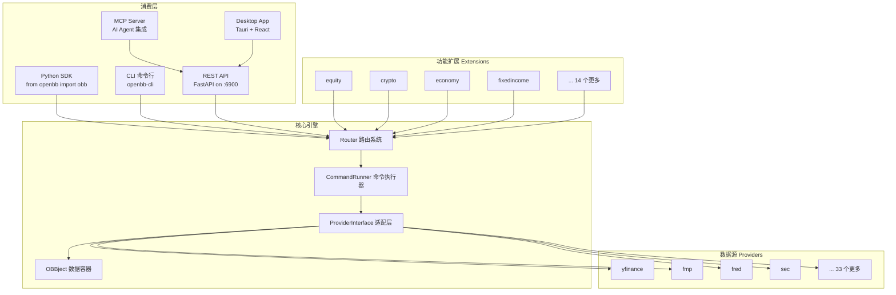
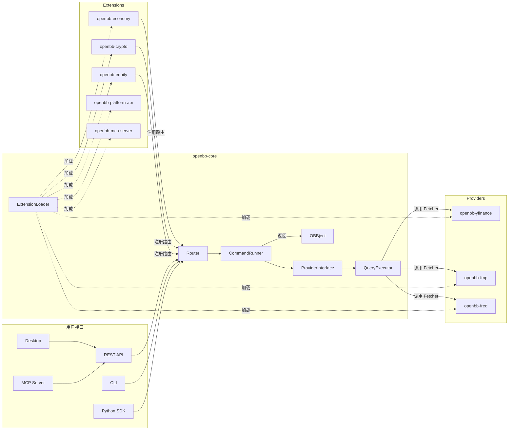
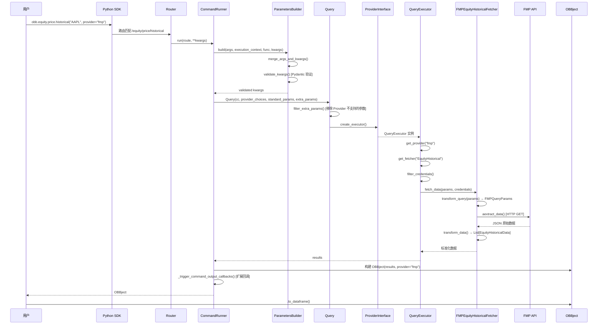
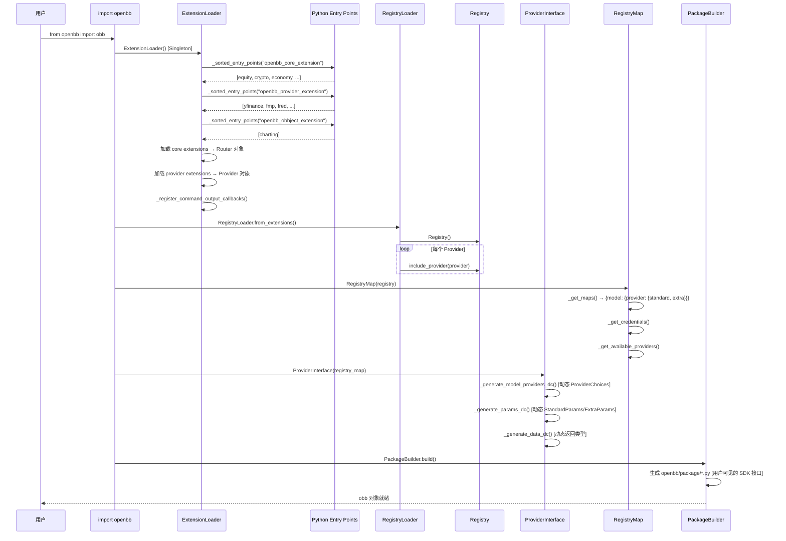

# OpenBB 源码学习笔记

> 仓库地址：[OpenBB](https://github.com/OpenBB-finance/OpenBB)
> 学习日期：2026-03-22

---

> **以下为 AI 源码分析**
>
> ### 一句话概括
>
> OpenBB 是一个开源金融数据平台（Open Data Platform），通过插件化架构统一对接 30+ 数据源，提供 Python SDK、CLI、REST API、MCP Server 和桌面应用等多种消费方式。
>
> ### 要点速览
>
> | 核心模块 | 职责 | 关键文件 |
> |---------|------|---------|
> | **Core** | 基础框架：路由、命令执行、Provider 系统、OBBject 数据容器 | `openbb_platform/core/openbb_core/` |
> | **Extensions** | 按业务域划分的功能模块（equity, crypto, economy 等 18 个） | `openbb_platform/extensions/` |
> | **Providers** | 数据源适配器（yfinance, fmp, fred 等 37 个） | `openbb_platform/providers/` |
> | **Platform API** | FastAPI REST 服务，暴露所有命令为 HTTP 端点 | `openbb_platform/extensions/platform_api/` |
> | **MCP Server** | Model Context Protocol 支持，将平台能力暴露给 AI Agent | `openbb_platform/extensions/mcp_server/` |
> | **CLI** | 交互式命令行界面，动态生成菜单和命令 | `cli/openbb_cli/` |
> | **Desktop** | Tauri (Rust + React) 桌面应用，管理 Python 环境和后端服务 | `desktop/` |

---

## 项目简介

OpenBB（Open Data Platform）是一个面向金融数据工程师的开源工具集，核心目标是 **"connect once, consume everywhere"**——将各种公开、授权和私有数据源统一集成到一个标准化接口中，再通过多种下游通道消费：Python 环境供量化研究、REST API 供应用集成、MCP Server 供 AI Agent 调用、OpenBB Workspace 供分析师可视化分析。

项目采用高度模块化的 Monorepo 架构，核心框架仅提供路由、命令执行和数据标准化能力，所有业务逻辑和数据源接入都通过 Plugin 机制（Python entry points）实现热插拔，用户可通过 `pip install openbb[all]` 一键安装全部组件，也可按需选装。

## 技术栈

| 类别 | 技术 |
|------|------|
| 语言 | Python 3.10+, TypeScript, Rust |
| 框架 | FastAPI (REST API), Tauri v2 (Desktop), React 18 + TanStack Router (前端) |
| 构建工具 | Poetry (Python), Vite (前端), Cargo (Rust), Nox (CI 测试) |
| 依赖管理 | Poetry + pyproject.toml (Python Monorepo), npm (前端) |
| 测试框架 | pytest (Python), Vitest (前端) |
| 数据验证 | Pydantic v2 |
| 代码质量 | Ruff, Black, Mypy, Pylint, Codespell, pre-commit |
| 容器化 | Docker (开发 + 生产两套镜像) |

## 目录结构

```
OpenBB/
├── openbb_platform/                  # 核心 Monorepo（Python 平台）
│   ├── pyproject.toml                # 主包声明（openbb v4.7.1）
│   ├── dev_install.py                # 本地开发安装脚本（editable mode）
│   ├── core/                         # 核心包 openbb-core v1.6.4
│   │   ├── openbb_core/
│   │   │   ├── app/                  # 应用核心：路由、命令执行、Provider 接口
│   │   │   ├── api/                  # REST API 层（FastAPI）
│   │   │   └── provider/             # Provider 系统：Fetcher 基类、标准模型、注册表
│   │   └── openbb/                   # 用户入口包（动态生成）
│   ├── extensions/                   # 功能扩展（18 个）
│   │   ├── equity/                   # 股票市场数据
│   │   ├── crypto/                   # 加密货币
│   │   ├── economy/                  # 宏观经济
│   │   ├── platform_api/             # FastAPI 服务 + Widget 配置
│   │   ├── mcp_server/               # MCP 协议支持
│   │   └── ...                       # derivatives, etf, fixedincome 等
│   ├── providers/                    # 数据源提供者（37 个）
│   │   ├── yfinance/                 # Yahoo Finance（免费）
│   │   ├── fmp/                      # Financial Modeling Prep
│   │   ├── fred/                     # 美联储经济数据
│   │   ├── sec/                      # 美国证监会
│   │   └── ...                       # intrinio, benzinga, tiingo 等
│   └── obbject_extensions/           # OBBject 对象扩展
│       └── charting/                 # 图表可视化扩展
├── cli/                              # CLI 命令行工具
│   └── openbb_cli/
│       ├── cli.py                    # 入口文件
│       ├── session.py                # 单例 Session 管理
│       ├── controllers/              # 控制器层（动态生成菜单）
│       └── argparse_translator/      # 函数签名 → argparse 转换器
├── desktop/                          # Tauri 桌面应用
│   ├── src/                          # React 前端
│   └── src-tauri/                    # Rust 后端
├── build/                            # 构建和发布
│   ├── pypi/                         # PyPI 发布脚本
│   └── docker/                       # Docker 镜像配置
├── cookiecutter/                     # 新 Extension/Provider 生成模板
├── assets/extensions/                # 扩展注册元数据（自动生成）
└── examples/                         # Jupyter Notebook 示例
```

## 架构设计

### 整体架构

OpenBB 采用 **分层 + 插件化** 的架构设计。最底层是 Provider 系统，负责对接各种外部数据源；中间层是 Core 引擎，提供路由、命令执行和数据标准化；最上层是多种消费接口（Python SDK、CLI、REST API、MCP Server、Desktop）。

所有 Extension 和 Provider 通过 Python entry points 机制实现 **零侵入式插拔**——安装一个 pip 包即可自动注册新的数据源或功能模块，无需修改任何核心代码。



### 核心模块

#### 1. Core 引擎 (`openbb_platform/core/openbb_core/`)

核心引擎是整个平台的骨架，提供路由注册、命令执行、Provider 管理和数据标准化四大能力。

**核心文件：**

| 文件 | 关键类/函数 | 职责 |
|------|-----------|------|
| `app/router.py` | `Router`, `SignatureInspector`, `CommandMap` | 路由定义和命令注册，通过 `@router.command()` 装饰器将函数转为 API 端点 |
| `app/command_runner.py` | `CommandRunner`, `StaticCommandRunner`, `ParametersBuilder` | 命令执行引擎，处理参数构建、验证和异步执行 |
| `app/provider_interface.py` | `ProviderInterface` (Singleton) | Provider 适配层，动态生成 ProviderChoices、StandardParams、ExtraParams 数据类 |
| `app/query.py` | `Query` | 查询编排，过滤 Provider 不支持的参数并委托 QueryExecutor |
| `app/extension_loader.py` | `ExtensionLoader` (Singleton) | 通过 entry points 自动发现和加载三类扩展 |
| `app/model/obbject.py` | `OBBject[T]` | 核心数据容器，支持 `to_dataframe()` 等转换 |
| `provider/abstract/fetcher.py` | `Fetcher[Q, R]` | Fetcher 基类，定义 TET（Transform-Extract-Transform）管道 |
| `provider/abstract/provider.py` | `Provider` | Provider 注册模型，持有 `fetcher_dict` 映射 |
| `provider/registry.py` | `Registry`, `RegistryLoader` | Provider 注册表，从 entry points 加载 |
| `provider/query_executor.py` | `QueryExecutor` | 查询执行器，协调 Provider 和 Fetcher |
| `api/rest_api.py` | FastAPI `app` | REST API 应用入口 |

#### 2. Extensions (`openbb_platform/extensions/`)

Extensions 按金融业务域划分功能模块，每个 Extension 定义一组路由命令，指向 Standard Model 名称（如 `EquityHistorical`），不关心数据来自哪个 Provider。

**典型 Extension 结构（以 equity 为例）：**
- `equity_router.py` — 主路由，包含子路由（price, fundamental, discovery 等）
- `price/price_router.py` — 定义 `historical()`, `quote()`, `nbbo()` 等命令
- `fundamental/fundamental_router.py` — 定义 `balance()`, `cash()`, `income()` 等命令

**命令定义模式：**
```python
@router.command(model="EquityHistorical")
async def historical(
    cc: CommandContext,
    provider_choices: ProviderChoices,
    standard_params: StandardParams,
    extra_params: ExtraParams,
) -> OBBject:
    return await OBBject.from_query(Query(**locals()))
```

#### 3. Providers (`openbb_platform/providers/`)

每个 Provider 实现一个或多个 Fetcher，将外部 API 数据转换为标准模型。Provider 通过 `fetcher_dict` 声明支持哪些 Standard Model。

**典型 Provider 注册（以 fmp 为例）：**
```python
fmp_provider = Provider(
    name="fmp",
    website="https://financialmodelingprep.com",
    credentials=["api_key"],
    fetcher_dict={
        "EquityHistorical": FMPEquityHistoricalFetcher,
        "EquityQuote": FMPEquityQuoteFetcher,
        # ... 70+ fetchers
    },
)
```

**Fetcher 实现三步走（TET 管道）：**
1. `transform_query()` — 将标准参数转为 Provider 特定查询
2. `aextract_data()` — 异步调用外部 API 获取原始数据
3. `transform_data()` — 将原始数据转为标准数据模型

#### 4. Standard Models (`openbb_core/provider/standard_models/`)

180+ 个标准数据模型定义了各类金融数据的统一 Schema。每个模型包含 `QueryParams`（查询参数）和 `Data`（返回数据）两部分，Provider 特定模型通过继承标准模型并添加 `__alias_dict__` 实现字段映射。

#### 5. Platform API (`extensions/platform_api/`)

将所有 Router 命令暴露为 FastAPI HTTP 端点，同时提供 `/widgets.json`、`/apps.json`、`/agents.json` 等配置端点供 OpenBB Workspace 消费。通过 `openbb-api` 命令启动 Uvicorn 服务（默认 `127.0.0.1:6900`）。

#### 6. MCP Server (`extensions/mcp_server/`)

基于 FastMCP 将 OpenBB 平台能力暴露为 MCP 工具，支持：
- 按类别（equity/price, economy 等）组织工具
- 运行时动态激活/停用工具（`activate_tools()`）
- 工具发现（`available_categories()`, `available_tools()`）
- 自定义 Prompts 和 Skills

#### 7. CLI (`cli/openbb_cli/`)

交互式命令行界面，核心设计是 **动态命令生成**：
- `ArgparseTranslator` 通过反射将 Python 函数签名自动转为 argparse 命令
- `PlatformController` 从 OpenBB Platform 对象动态生成菜单和子命令
- `Session` 单例管理全局状态（配置、样式、OBBject 注册表）
- 支持脚本录制和回放、日期关键字替换

#### 8. Desktop (`desktop/`)

Tauri v2 跨平台桌面应用，用于管理 Python 环境、后端服务和 API 密钥：
- **前端**：React 18 + TanStack Router（文件路由）+ Tailwind CSS
- **后端**：Rust Tauri handlers（environments, backends, startup, jupyter, credentials）
- **通信**：Tauri IPC 命令模式（`#[tauri::command]` + `invoke()`）

### 模块依赖关系



## 核心流程

### 流程一：数据查询执行（`obb.equity.price.historical("AAPL")`）

这是平台最核心的业务流程——从用户发起查询到返回标准化数据的完整链路。



**关键步骤说明：**

1. **路由匹配**：`Router.command()` 装饰器在启动时将函数注册为 API 端点，`CommandMap` 维护路径到函数的映射
2. **参数构建**：`ParametersBuilder` 通过 Pydantic 动态创建验证模型，确保类型安全
3. **Provider 选择**：`ProviderInterface`（单例）持有所有 Provider 的参数映射，`SignatureInspector` 在启动时将具体的 ProviderChoices 注入函数签名
4. **TET 管道**：`transform_query` → `aextract_data` → `transform_data` 是每个 Fetcher 的标准流程
5. **扩展回调**：命令执行完成后，触发所有已注册的 OBBject Extension（如 charting）的回调

### 流程二：Extension 和 Provider 的自动发现与加载

这是平台插件化架构的核心——如何在启动时自动发现和注册所有已安装的扩展。



**关键步骤说明：**

1. **Entry Points 发现**：Python 的 `importlib.metadata.entry_points()` 扫描所有已安装包的 `pyproject.toml` 中声明的 plugin
2. **三类扩展**：`openbb_core_extension`（路由）、`openbb_provider_extension`（数据源）、`openbb_obbject_extension`（对象扩展）
3. **Registry 构建**：遍历所有 Provider，建立 `{model_name: {provider_name: Fetcher}}` 的映射关系
4. **动态类型生成**：`ProviderInterface` 使用 `make_dataclass` / `create_model` 动态生成参数类，确保 IDE 自动补全和类型检查
5. **SDK 代码生成**：`PackageBuilder` 根据已注册的路由和 Provider 信息，生成 `openbb/package/` 下的 Python 文件，提供用户友好的 SDK 接口

## 关键设计亮点

### 1. Entry Points 插件系统——零侵入式扩展

**解决的问题：** 如何让第三方开发者在不修改核心代码的情况下添加新数据源或功能模块。

**实现方式：** 每个 Extension/Provider 在 `pyproject.toml` 中声明 entry point：

```toml
# providers/yfinance/pyproject.toml
[tool.poetry.plugins."openbb_provider_extension"]
yfinance = "openbb_yfinance:yfinance_provider"
```

`ExtensionLoader`（`openbb_core/app/extension_loader.py`）在启动时通过 `importlib.metadata.entry_points()` 自动发现所有已安装的扩展，无需任何配置文件或注册代码。

**设计优势：** `pip install openbb-yfinance` 即自动完成注册，`pip uninstall` 即自动移除。完全解耦，开发者只需遵循 Fetcher 接口规范。

### 2. TET 管道（Transform-Extract-Transform）——标准化数据提取

**解决的问题：** 37 个数据源的 API 格式各不相同，如何统一为标准 Schema。

**实现方式：** `Fetcher[Q, R]`（`openbb_core/provider/abstract/fetcher.py`）定义了三步模板方法：

1. `transform_query(params)` — 将标准查询参数转换为 Provider 特定格式
2. `aextract_data(query, credentials)` — 异步调用外部 API
3. `transform_data(query, data)` — 将原始数据映射到标准 Pydantic 模型

Provider 数据模型通过继承 Standard Model 并定义 `__alias_dict__` 实现字段映射，如 YFinance 将 `longName` 映射为标准的 `name` 字段。

**设计优势：** 模板方法模式确保所有 Provider 遵循相同流程；标准模型 + alias 机制让字段映射简洁直观；策略模式让同一命令可由多个 Provider 实现。

### 3. 动态类型生成——运行时类型安全

**解决的问题：** Provider 的参数和返回类型在启动前未知（取决于安装了哪些扩展），如何在运行时仍保持类型安全。

**实现方式：** `ProviderInterface`（`openbb_core/app/provider_interface.py`）在启动时：
- 扫描所有 Provider 的 `fetcher_dict`，提取每个 model 支持的 Provider 列表
- 使用 `make_dataclass` 动态生成 `ProviderChoices`（`Literal["fmp", "yfinance", ...]`）
- 动态生成 `StandardParams`（所有 Provider 的公共参数）和 `ExtraParams`（Provider 特有参数）
- `SignatureInspector.complete()` 将这些动态类型注入到 Router 命令的函数签名中

**设计优势：** FastAPI 根据注入的类型自动生成 OpenAPI 文档和参数验证；Python SDK 通过 `PackageBuilder` 生成带类型注解的代码，支持 IDE 自动补全。

### 4. 多消费层架构——一次集成多处消费

**解决的问题：** 同一套数据和逻辑需要通过 Python SDK、CLI、REST API、MCP Server、Desktop 等多种方式消费。

**实现方式：**
- **Core 层**只关心命令注册和执行，不关心调用方式
- **Python SDK**：`PackageBuilder` 生成 `obb.equity.price.historical()` 风格的链式调用接口
- **REST API**：`platform_api` extension 将所有 Router 命令映射为 FastAPI 端点
- **MCP Server**：`mcp_server` extension 将 REST 端点转为 MCP 工具，支持动态发现和激活
- **CLI**：`ArgparseTranslator` 通过反射将函数签名转为 argparse 命令

**设计优势：** 新增一个 Router 命令，所有消费层自动获得支持，无需逐个适配。

### 5. Cookiecutter 模板——标准化扩展开发

**解决的问题：** 如何降低第三方开发者创建新 Extension/Provider 的门槛。

**实现方式：** `cookiecutter/` 目录提供项目生成模板，运行 `openbb-cookiecutter` 即可生成标准的包结构，包括：
- `pyproject.toml`（含 entry points 声明）
- Fetcher 骨架代码（继承标准模型）
- 测试文件
- 支持四种 plugin 类型（core_extension, charting_extension, provider_extension, obbject_extension）

**设计优势：** 约定优于配置，新开发者只需 `pip install openbb-cookiecutter && openbb-cookiecutter` 即可开始开发，显著降低贡献门槛。
