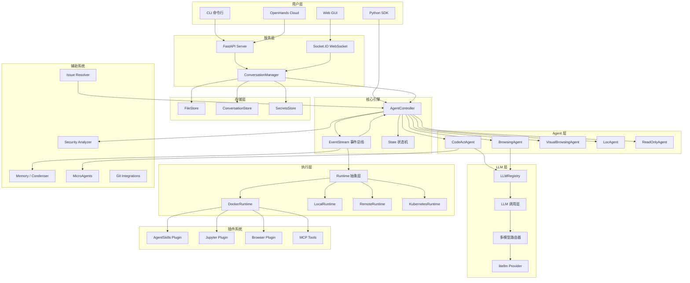
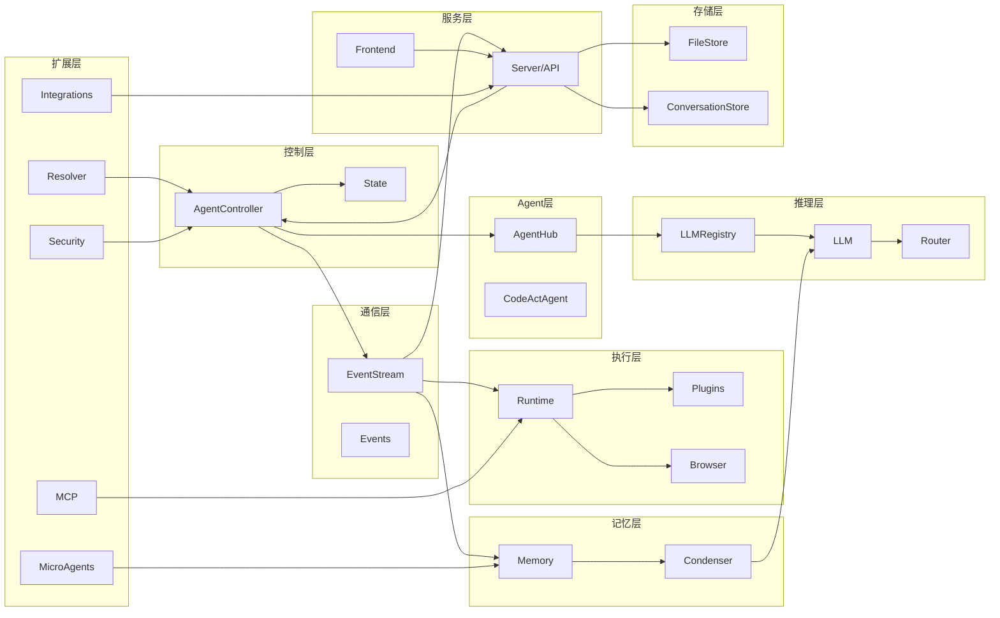
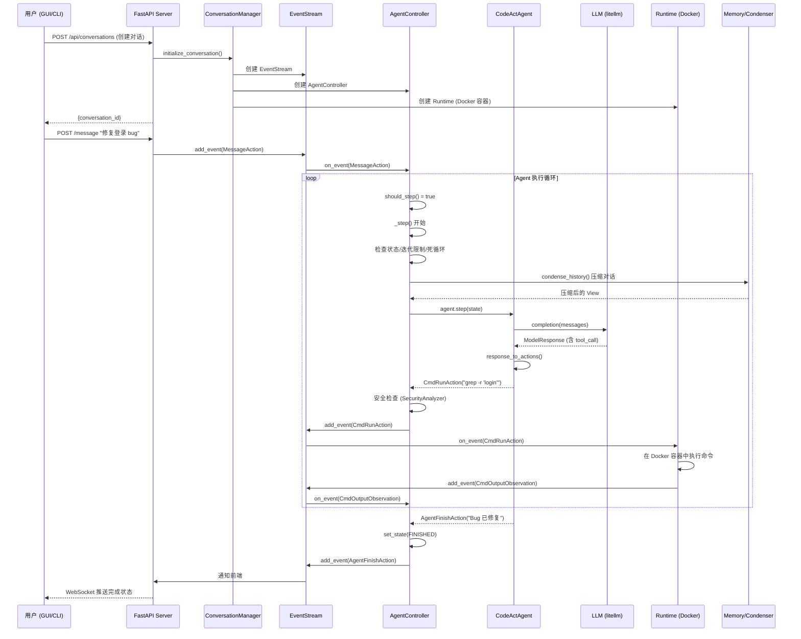
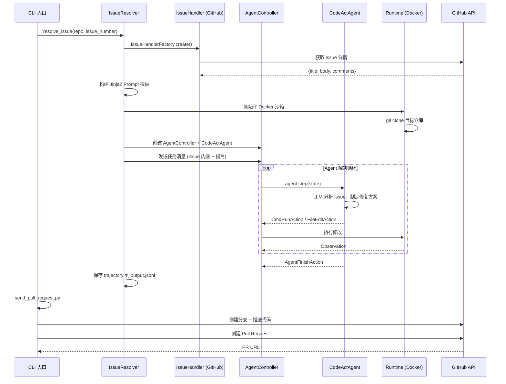

# OpenHands 源码学习笔记

> 仓库地址：[OpenHands](https://github.com/OpenHands/OpenHands)
> 学习日期：2026-03-22

---

> **以下为 AI 源码分析**
>
> ### 一句话概括
>
> OpenHands 是一个 AI 驱动的软件开发平台，通过 Agent 自主执行代码编写、调试、浏览网页等操作，实现从 issue 到 pull request 的全自动化开发流程。
>
> ### 要点速览
>
> | 核心模块 | 职责 | 关键文件 |
> |---------|------|---------|
> | AgentHub | 多种 AI Agent 实现（CodeAct、Browsing、ReadOnly 等） | `openhands/agenthub/` |
> | Controller | Agent 执行循环、状态机管理、多 Agent 委托 | `openhands/controller/agent_controller.py` |
> | Runtime | 沙箱执行环境（Docker/Local/Remote/K8s） | `openhands/runtime/` |
> | LLM | 多 Provider LLM 调用、路由、重试 | `openhands/llm/` |
> | Events | 事件驱动架构，Action/Observation 双向通信 | `openhands/events/` |
> | Memory | 对话历史压缩（Condenser）和知识检索 | `openhands/memory/` |
> | Server | FastAPI Web 服务，V0/V1 双栈架构 | `openhands/server/` + `openhands/app_server/` |
> | Frontend | React 19 单页应用，实时对话界面 | `frontend/` |
> | Resolver | 自动化 Issue/PR 解决工作流 | `openhands/resolver/` |
> | Integrations | 多平台 Git 集成（GitHub/GitLab/Bitbucket 等） | `openhands/integrations/` |

---

## 项目简介

OpenHands（原 OpenDevin）是一个开源的 AI 软件开发平台，核心理念是让 AI Agent 像人类开发者一样自主编写代码、执行命令、浏览网页和调试问题。它提供 SDK、CLI、本地 GUI 和云服务四种使用方式，支持 Claude、GPT、Gemini 等主流 LLM。在 SWE-Bench 基准测试中达到 77.6% 的解决率，是目前最强大的开源 AI 编码代理之一。项目采用 MIT 协议（企业版除外），拥有活跃的开源社区。

## 技术栈

| 类别 | 技术 |
|------|------|
| 语言 | Python 3.12+（后端）、TypeScript（前端） |
| 框架 | FastAPI + Socket.IO（后端）、React 19 + React Router 7（前端） |
| 构建工具 | Poetry / UV（Python）、Vite（前端）、Docker、Makefile |
| 依赖管理 | Poetry / pyproject.toml（后端）、npm / package.json（前端） |
| 测试框架 | pytest（后端）、Vitest（前端） |
| LLM 集成 | litellm（统一多 Provider 调用） |
| 状态管理 | Zustand + TanStack React Query（前端） |
| UI 组件库 | HeroUI + Tailwind CSS（前端） |
| 实时通信 | Socket.IO / WebSocket |
| 容器化 | Docker / Kubernetes |

## 目录结构

```
OpenHands/
├── openhands/                    # Python 后端核心包
│   ├── agenthub/                 # Agent 实现集合
│   │   ├── codeact_agent/        #   CodeAct Agent（主力 Agent）
│   │   ├── browsing_agent/       #   网页浏览 Agent
│   │   ├── visualbrowsing_agent/ #   视觉浏览 Agent
│   │   ├── loc_agent/            #   代码定位 Agent
│   │   ├── readonly_agent/       #   只读分析 Agent
│   │   └── dummy_agent/          #   测试用 Agent
│   ├── controller/               # Agent 控制器与状态管理
│   │   ├── agent_controller.py   #   核心执行循环
│   │   ├── agent.py              #   Agent 抽象基类
│   │   └── state/                #   State 对象与追踪
│   ├── core/                     # 核心配置与 Schema
│   │   ├── config/               #   配置体系（OpenHandsConfig, LLMConfig 等）
│   │   └── schema/               #   ActionType, AgentState 枚举定义
│   ├── events/                   # 事件系统
│   │   ├── action/               #   Action 类型定义（20+ 种）
│   │   ├── observation/          #   Observation 类型定义（15+ 种）
│   │   ├── serialization/        #   事件序列化/反序列化
│   │   └── stream.py             #   EventStream 事件总线
│   ├── runtime/                  # 执行环境抽象
│   │   ├── impl/                 #   具体实现（Docker/Local/Remote/K8s）
│   │   ├── browser/              #   浏览器环境（Playwright）
│   │   ├── plugins/              #   插件系统（AgentSkills/Jupyter/VSCode）
│   │   └── mcp/                  #   MCP Runtime 集成
│   ├── llm/                      # LLM 调用层
│   │   ├── llm.py                #   核心 LLM 类（基于 litellm）
│   │   ├── async_llm.py          #   异步 LLM 调用
│   │   ├── llm_registry.py       #   LLM 实例池管理
│   │   └── router/               #   多模型路由（规则/多模态）
│   ├── memory/                   # 记忆与压缩
│   │   ├── memory.py             #   Memory 主类
│   │   └── condenser/            #   对话压缩器（9 种实现 + Pipeline）
│   ├── server/                   # Web 服务（V0 Legacy）
│   │   ├── app.py                #   FastAPI 应用定义
│   │   ├── routes/               #   API 路由
│   │   └── session/              #   会话管理
│   ├── app_server/               # Web 服务（V1 现代化）
│   │   ├── app_conversation/     #   对话服务
│   │   ├── sandbox/              #   远程沙箱服务
│   │   └── event/                #   事件存储服务
│   ├── resolver/                 # Issue/PR 自动解决器
│   ├── integrations/             # 多平台 Git 集成
│   ├── security/                 # 安全分析器
│   ├── storage/                  # 存储抽象层（Local/S3/GCS）
│   ├── mcp/                      # Model Context Protocol 客户端
│   ├── microagent/               # 微代理系统
│   └── linter/                   # 代码检查
├── frontend/                     # React 前端应用
│   ├── src/
│   │   ├── api/                  #   API 服务层（26 个子服务）
│   │   ├── stores/               #   Zustand 状态存储（18 个）
│   │   ├── hooks/                #   React Hooks（120+）
│   │   ├── components/           #   UI 组件（32 个模块）
│   │   ├── routes/               #   页面路由
│   │   └── types/                #   TypeScript 类型定义
│   └── package.json
├── enterprise/                   # 企业版功能（需商业许可）
│   ├── integrations/             #   Slack/Jira/Linear 集成
│   ├── server/                   #   企业级服务（RBAC、多用户）
│   └── migrations/               #   数据库迁移
├── containers/                   # Docker 构建文件
│   ├── app/                      #   应用镜像
│   ├── runtime/                  #   Runtime 镜像
│   └── dev/                      #   开发镜像
├── docker-compose.yml            # 容器编排
├── Makefile                      # 构建脚本
└── pyproject.toml                # Python 项目配置
```

## 架构设计

### 整体架构

OpenHands 采用**事件驱动 + 多层抽象**的架构设计。核心思想是将 AI Agent 的思考（LLM 推理）和行动（代码执行、浏览器操作）通过统一的 EventStream 解耦，实现灵活的 Agent 编排和 Runtime 扩展。



### 核心模块

#### 1. AgentController — 执行引擎

**职责**：Agent 执行循环的核心调度器，管理 Agent 状态机、事件处理和多 Agent 委托。

**核心文件**：
- `openhands/controller/agent_controller.py` — 主控制器（~1000 行）
- `openhands/controller/agent.py` — Agent 抽象基类
- `openhands/controller/state/state.py` — State 状态对象

**关键类与方法**：

```python
class AgentController:
    agent: Agent                    # 受控的 Agent 实例
    state: State                    # 代理状态
    event_stream: EventStream       # 事件总线
    delegate: AgentController       # 子代理控制器（多 Agent 委托）
    _stuck_detector: StuckDetector  # 死循环检测器

    async def _step()               # 核心执行步骤
    def on_event(event)             # 事件回调
    async def start_delegate()      # 启动子代理
    def set_agent_state_to()        # 状态转移
```

**状态机**：

```
LOADING → RUNNING ↔ AWAITING_USER_INPUT
              ↓         ↓
     RATE_LIMITED   AWAITING_USER_CONFIRMATION
              ↓         ├→ USER_CONFIRMED → RUNNING
           ERROR        └→ USER_REJECTED → AWAITING_USER_INPUT
              ↓
RUNNING → FINISHED / REJECTED
```

**与其他模块的关系**：AgentController 是系统的中枢，订阅 EventStream 接收事件，调度 Agent 生成 Action，通过 EventStream 将 Action 传递给 Runtime 执行，接收 Observation 后触发下一轮循环。

#### 2. AgentHub — Agent 实现集合

**职责**：提供多种类型的 AI Agent 实现，每种 Agent 针对不同任务场景。

**核心文件**：
- `openhands/agenthub/codeact_agent/codeact_agent.py` — 主力 Agent
- `openhands/agenthub/browsing_agent/browsing_agent.py` — 网页浏览
- `openhands/agenthub/readonly_agent/readonly_agent.py` — 只读分析

**Agent 继承体系**：

```
Agent (ABC 基类)
├── CodeActAgent        — 代码执行（bash/python/编辑/浏览器）
│   ├── LocAgent        — 代码定位专用
│   └── ReadOnlyAgent   — 只读浏览分析
├── BrowsingAgent       — 网页交互（accessibility tree）
├── VisualBrowsingAgent — 视觉浏览（screenshot + SOM）
└── DummyAgent          — 测试用（确定性行为）
```

**CodeActAgent 核心工具集**：

| 工具 | 功能 |
|------|------|
| CmdRunTool | 执行 bash 命令 |
| IPythonTool | 执行 Python 代码 |
| BrowserTool | 浏览器交互 |
| FileEditorTool | 文件编辑（str_replace） |
| ThinkTool | Agent 思考（不执行） |
| FinishTool | 完成任务 |
| TaskTrackerTool | 任务跟踪（计划模式） |

**与其他模块的关系**：Agent 由 AgentController 调度，通过 `step(state)` 方法生成 Action。Agent 调用 LLMRegistry 获取 LLM 进行推理，使用 ConversationMemory 管理对话上下文。

#### 3. EventStream — 事件总线

**职责**：系统的消息中枢，基于 Pub/Sub 模式实现组件间解耦通信。

**核心文件**：
- `openhands/events/stream.py` — EventStream 事件总线
- `openhands/events/event.py` — Event 基类
- `openhands/events/event_store.py` — 事件持久化

**关键接口**：

```python
class EventStream:
    def subscribe(subscriber_id, callback)    # 订阅事件
    def add_event(event, source)              # 发布事件
    # 每个订阅者有独立的 ThreadPoolExecutor，异步处理
```

**订阅者列表**：AGENT_CONTROLLER、RUNTIME、MEMORY、SERVER、RESOLVER

**与其他模块的关系**：EventStream 连接了 AgentController、Runtime、Memory、Server 等所有核心组件，是整个系统的神经中枢。

#### 4. Runtime — 执行环境

**职责**：提供隔离的代码执行沙箱，支持多种部署模式。

**核心文件**：
- `openhands/runtime/base.py` — Runtime 抽象基类
- `openhands/runtime/impl/docker/docker_runtime.py` — Docker 实现
- `openhands/runtime/impl/local/local_runtime.py` — 本地实现

**Runtime 类型**：

| 类型 | 说明 |
|------|------|
| DockerRuntime | 容器化隔离执行（生产推荐） |
| LocalRuntime | 本地直接执行（开发调试） |
| RemoteRuntime | 远程服务器执行 |
| KubernetesRuntime | K8s 集群执行 |
| CLIRuntime | 命令行模式 |

**插件系统**：AgentSkills（文件/仓库操作函数库）、Jupyter（IPython 执行）、VSCode（IDE 集成）

**与其他模块的关系**：Runtime 订阅 EventStream 接收 Action，执行后生成 Observation 回写到 EventStream。Runtime 管理 Plugin 的生命周期。

#### 5. LLM — 模型调用层

**职责**：统一的多 Provider LLM 调用接口，支持路由、重试和成本追踪。

**核心文件**：
- `openhands/llm/llm.py` — 核心 LLM 类
- `openhands/llm/llm_registry.py` — LLM 实例池
- `openhands/llm/router/` — 多模型路由器

**调用链**：

```
Agent.step() → LLMRegistry.get_llm() → LLM/RouterLLM
  → RetryMixin（指数退避重试）
  → litellm.completion()（多 Provider 统一接口）
  → Metrics 成本记录
```

**路由机制**：RouterLLM 基类支持动态选择 LLM，MultimodalRouter 根据消息内容（是否含图片）和 token 数量自动路由到合适的模型。

**与其他模块的关系**：通过 LLMRegistry 为不同 Agent 和服务提供 LLM 实例。支持为每个 Agent 配置不同的 LLM。

#### 6. Memory / Condenser — 记忆管理

**职责**：管理对话历史，在 LLM 上下文窗口有限时自动压缩历史。

**核心文件**：
- `openhands/memory/memory.py` — Memory 主类（事件监听 + 微代理检索）
- `openhands/memory/condenser/` — 9 种压缩器实现 + Pipeline

**Condenser 类型**：

| 压缩器 | 策略 |
|--------|------|
| NoOpCondenser | 不压缩 |
| RecentEventsCondenser | 保留头尾 N 个事件 |
| ConversationWindowCondenser | 滑动窗口 |
| ObservationMaskingCondenser | 隐藏观察细节 |
| LLMSummarizingCondenser | LLM 生成摘要 |
| LLMAttentionCondenser | LLM 选择关键事件 |
| StructuredSummaryCondenser | 结构化摘要 |
| AmortizedForgettingCondenser | 增量遗忘 |
| BrowserOutputCondenser | 清理浏览器输出 |
| CondenserPipeline | 多压缩器串联 |

**与其他模块的关系**：Memory 订阅 EventStream 处理 RecallAction（知识检索），Condenser 被 Agent 在每次 step() 时调用来压缩对话历史。

#### 7. Storage — 存储抽象层

**职责**：统一的持久化接口，支持多种存储后端。

**核心文件**：
- `openhands/storage/files.py` — FileStore 抽象
- `openhands/storage/conversation/` — 会话元数据存储
- `openhands/storage/secrets/` — 密钥管理

**存储层次**：

```
ConversationStore → 会话元数据（File/SQL）
FileStore         → 文件 IO（Local/S3/GCS/InMemory）
SecretsStore      → 密钥管理（加密存储）
SettingsStore     → 用户设置
```

### 模块依赖关系



## 核心流程

### 流程一：用户任务执行（从消息到代码执行）

这是 OpenHands 最核心的业务流程——用户发送一条任务消息，Agent 自主循环执行直到完成。



**关键逻辑说明**：

1. **对话初始化**：Server 创建 EventStream、AgentController、Runtime 三件套，Runtime 启动 Docker 容器作为执行沙箱
2. **消息触发**：用户消息作为 MessageAction 加入 EventStream，触发 AgentController 的 `should_step()` 判断
3. **Agent 推理**：每轮循环先通过 Condenser 压缩历史，再调用 LLM 生成 Action
4. **安全检查**：高风险 Action（如 `rm -rf`）会触发 SecurityAnalyzer 评估，可能暂停等待用户确认
5. **执行与反馈**：Action 通过 EventStream 传递给 Runtime 执行，Observation 回传触发下一轮
6. **异常处理**：Context Window 超出自动触发 Condensation，死循环检测（StuckDetector）自动恢复

### 流程二：Issue 自动解决（Resolver 工作流）

Resolver 是 OpenHands 的杀手级功能——自动解决 GitHub Issue 并创建 Pull Request。



**关键逻辑说明**：

1. **Issue 获取**：通过 IssueHandlerFactory 根据平台（GitHub/GitLab/Bitbucket）创建对应的 Handler
2. **Prompt 构建**：使用 Jinja2 模板将 Issue 信息、仓库指令、测试要求组合成结构化 Prompt
3. **沙箱准备**：在 Docker 容器中 clone 目标仓库，建立隔离的开发环境
4. **自主解决**：Agent 自主循环——阅读代码、理解问题、编写修复、运行测试
5. **结果输出**：完整的执行轨迹（trajectory）保存为 JSONL，支持回放和审计
6. **PR 创建**：支持 branch（仅推送分支）、draft（草稿 PR）、ready（就绪 PR）三种模式

## 关键设计亮点

### 1. EventStream 发布-订阅模式实现全局解耦

**解决的问题**：Agent 推理、代码执行、UI 更新、记忆管理等模块需要协同工作，但直接耦合会导致系统僵化。

**实现方式**：EventStream 作为中央消息总线，所有组件通过订阅/发布 Event 通信。每个订阅者拥有独立的 `ThreadPoolExecutor` 异步处理事件，互不阻塞。事件持久化到文件系统（`conversations/{sid}/events/{id}.json`），支持会话恢复和轨迹回放。

**关键代码**：`openhands/events/stream.py` — EventStream 类，`openhands/events/event_store.py` — EventStore 持久化。

**为什么这样设计**：Event Sourcing 模式天然支持审计追踪（每个 Agent 动作可回溯）、会话恢复（从事件重建状态）和多组件扩展（新增订阅者无需修改现有代码）。

### 2. Condenser 管道化对话压缩

**解决的问题**：长时间 Agent 执行会积累大量事件历史，超出 LLM 上下文窗口，导致调用失败或成本激增。

**实现方式**：提供 9 种 Condenser 实现和 CondenserPipeline 串联机制。最精妙的是 `LLMSummarizingCondenser`——将历史分为"保留头部 + 要遗忘的中间 + 保留尾部"三段，用 LLM 对中间部分生成结构化摘要（包含 USER_CONTEXT、TASK_TRACKING、CODE_STATE 等维度），然后将摘要作为 `AgentCondensationObservation` 插入头部之后。

**关键代码**：`openhands/memory/condenser/` — 全部压缩器实现，`openhands/memory/condenser/impl/pipeline.py` — Pipeline 串联。

**为什么这样设计**：不同场景需要不同的压缩策略（简单任务用滑动窗口，复杂任务用 LLM 摘要），Pipeline 机制允许组合使用（先清理浏览器输出 → 再隐藏观察细节 → 最后 LLM 摘要），实现了灵活且可配置的记忆管理。

### 3. 多 Agent 委托机制（Delegation）

**解决的问题**：复杂任务可能需要不同能力的 Agent 协作，如代码 Agent 遇到网页操作任务时需要浏览 Agent 介入。

**实现方式**：AgentController 支持 parent/delegate 关系链。当 CodeActAgent 发出 `AgentDelegateAction` 时，Controller 创建子 AgentController 和子 Agent，子代理共享全局 Metrics（成本追踪）但拥有隔离的本地 State。子代理完成后，结果通过 `AgentDelegateObservation` 回传给父代理。

**关键代码**：`openhands/controller/agent_controller.py` L735-861 — `start_delegate()` 和 `end_delegate()` 方法。

**为什么这样设计**：每种 Agent 专注于一个领域（代码、浏览、分析），通过委托而非单一全能 Agent 的方式，保持了各 Agent 的简洁性和可维护性，同时支持灵活的多 Agent 协作。

### 4. Runtime 抽象层 + 插件系统

**解决的问题**：Agent 需要在安全隔离的环境中执行代码，同时支持多种部署场景（开发者笔记本、云服务器、K8s 集群）。

**实现方式**：Runtime 抽象基类定义统一接口（`run_action()`, `connect()`, `close()`），5 种具体实现覆盖不同场景。插件系统通过 `PluginRequirement` 声明式注册——Agent 在类定义中声明需要的 Plugin（如 `sandbox_plugins = [JupyterRequirement(), AgentSkillsRequirement()]`），Runtime 自动加载并初始化。

**关键代码**：`openhands/runtime/base.py` — Runtime 基类，`openhands/runtime/__init__.py` — 工厂注册表，`openhands/runtime/plugins/` — 插件系统。

**为什么这样设计**：策略模式 + 工厂模式使得新增 Runtime 类型只需实现接口并注册，不影响现有代码。声明式插件避免了 Agent 需要关心执行环境细节。

### 5. 多平台 Git 集成的 Mixin 组合设计

**解决的问题**：支持 GitHub、GitLab、Bitbucket、Azure DevOps 等多个 Git 平台，每个平台 API 不同但功能类似。

**实现方式**：采用 Mixin 组合模式——每个平台的 Service 由多个 Mixin 组合而成（如 `GitHubService = GitHubBranchesMixin + GitHubPRsMixin + GitHubReposMixin + BaseGitService`）。抽象层定义 `GitService` Protocol 接口，`ProviderType` 枚举驱动工厂选择。

**关键代码**：`openhands/integrations/service_types.py` — 抽象接口，`openhands/integrations/provider.py` — Provider 主类。

**为什么这样设计**：Mixin 模式允许按功能维度（分支/PR/仓库）独立开发和测试，添加新平台只需编写对应 Mixin 组合。Protocol 接口确保所有平台实现一致的方法签名，上层代码无需关心具体平台。
