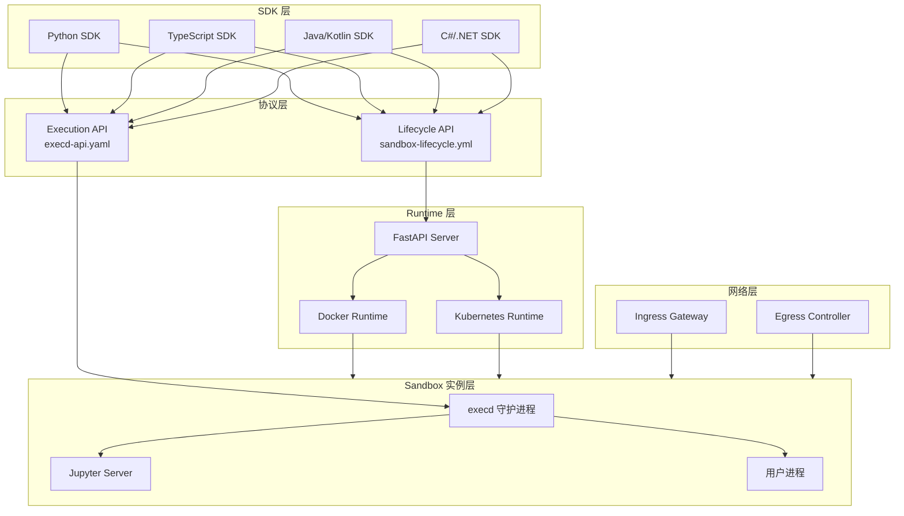
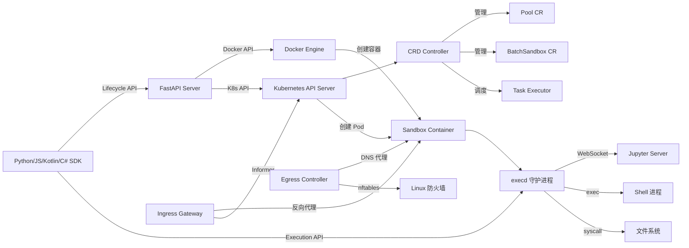
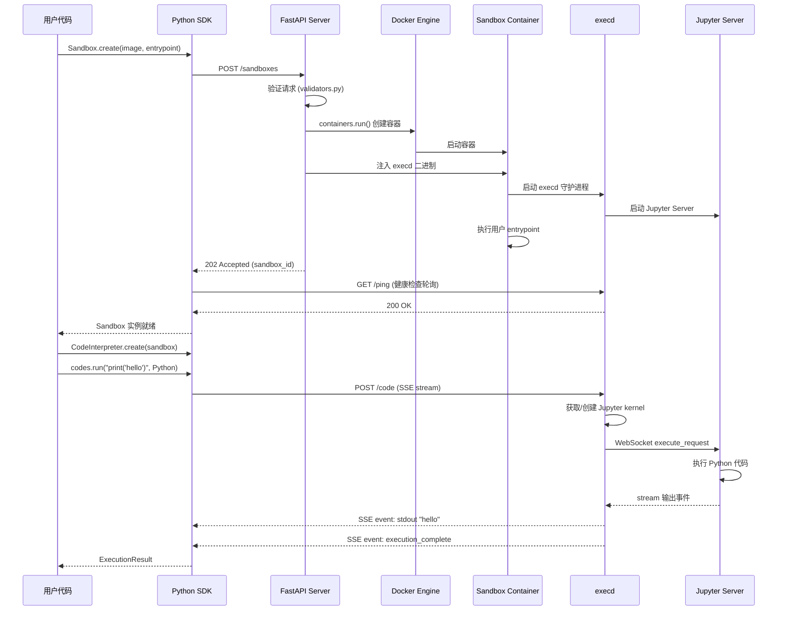
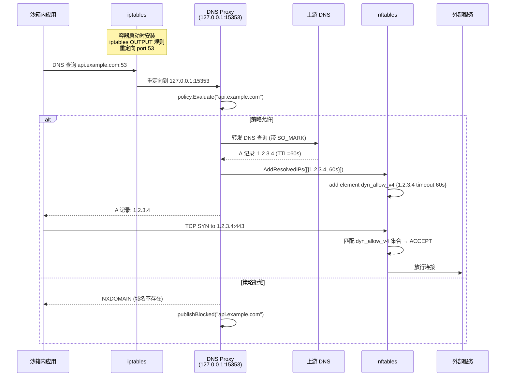

# OpenSandbox 源码学习笔记

> 仓库地址：[OpenSandbox](https://github.com/alibaba/OpenSandbox)
> 学习日期：2026-03-22

---

> **以下为 AI 源码分析**
>
> ### 一句话概括
>
> OpenSandbox 是阿里巴巴开源的通用 AI 沙箱平台，通过多语言 SDK、标准化 API 协议和 Docker/Kubernetes 运行时，为 AI 应用提供安全隔离的代码执行、文件管理和命令运行环境。
>
> ### 要点速览
>
> | 核心模块 | 职责 | 关键文件/目录 |
> |---------|------|-------------|
> | **Server** | FastAPI 生命周期管理服务，创建/销毁/暂停/恢复沙箱 | `server/src/main.py`, `server/src/services/` |
> | **execd** | 沙箱内执行守护进程，提供代码执行、命令运行、文件操作 API | `components/execd/main.go`, `pkg/runtime/` |
> | **Ingress** | HTTP/WebSocket 反向代理网关，路由外部请求到沙箱实例 | `components/ingress/main.go`, `pkg/proxy/` |
> | **Egress** | DNS 代理 + nftables 防火墙，控制沙箱出站网络策略 | `components/egress/main.go`, `pkg/dnsproxy/` |
> | **Python SDK** | 异步客户端 SDK，封装沙箱生命周期和执行操作 | `sdks/sandbox/python/`, `sdks/code-interpreter/python/` |
> | **Kubernetes** | CRD Controller + Task Executor，支持大规模沙箱调度 | `kubernetes/internal/controller/`, `kubernetes/apis/` |

---

## 项目简介

OpenSandbox 是一个面向 AI 应用场景的通用沙箱平台。它解决的核心问题是：AI Agent 生成的代码需要在安全隔离的环境中执行，同时支持文件操作、命令运行、多语言代码解释等能力。项目采用 Protocol-First 设计理念，通过 OpenAPI 规范定义两套核心协议（Sandbox Lifecycle API 和 Sandbox Execution API），使得 SDK、Server、Runtime 三层可独立演进。支持 Docker 单机部署和 Kubernetes 集群调度两种运行模式，适用于 Coding Agent、GUI Agent、代码执行沙箱、RL 训练等多种场景。

## 技术栈

| 类别 | 技术 |
|------|------|
| 语言 | Python 3.10+, Go 1.24+, TypeScript, Java/Kotlin, C#/.NET |
| 框架 | FastAPI (Server), Gin (execd), controller-runtime (K8s) |
| 构建工具 | hatchling/hatch-vcs (Python), Go Modules (Go), pnpm (JS) |
| 依赖管理 | uv/pip (Python), go mod (Go), pnpm (JS), Gradle (Java) |
| 测试框架 | pytest + pytest-asyncio (Python), Go testing (Go), vitest (JS) |

## 目录结构

```
OpenSandbox/
├── server/                    # 沙箱生命周期管理服务 (Python FastAPI)
│   └── src/
│       ├── main.py            # 应用入口，中间件注册，路由加载
│       ├── cli.py             # CLI 启动入口，配置初始化
│       ├── config.py          # TOML 配置加载与 Pydantic 验证
│       ├── api/               # HTTP 路由和请求/响应模型
│       │   ├── lifecycle.py   # 9 个 RESTful 端点
│       │   └── schema.py      # Pydantic 数据模型
│       ├── services/          # 核心业务逻辑
│       │   ├── sandbox_service.py  # 抽象服务接口
│       │   ├── docker.py      # Docker 运行时实现 (2206 行)
│       │   ├── k8s/           # Kubernetes 运行时实现
│       │   ├── validators.py  # 请求验证器
│       │   └── helpers.py     # 通用辅助函数
│       └── middleware/        # 认证和请求追踪中间件
│
├── components/
│   ├── execd/                 # 沙箱内执行守护进程 (Go)
│   │   ├── main.go            # 入口，初始化 Gin 引擎
│   │   └── pkg/
│   │       ├── web/           # HTTP 路由和控制器
│   │       │   ├── router.go  # 路由表定义
│   │       │   └── controller/  # 代码执行、命令、文件系统控制器
│   │       └── runtime/       # 执行引擎
│   │           ├── ctrl.go    # Controller 调度器
│   │           ├── jupyter.go # Jupyter kernel 集成
│   │           ├── command.go # Shell 命令执行
│   │           └── bash_session.go  # Bash 会话管理
│   │
│   ├── ingress/               # 入站流量代理 (Go)
│   │   ├── main.go            # K8s Informer 初始化
│   │   └── pkg/
│   │       ├── proxy/         # HTTP/WebSocket 反向代理
│   │       └── sandbox/       # Provider 工厂 (BatchSandbox/AgentSandbox)
│   │
│   └── egress/                # 出站网络控制 (Go)
│       ├── main.go            # DNS 代理 + nftables 初始化
│       ├── policy_server.go   # HTTP API 动态策略管理
│       └── pkg/
│           ├── dnsproxy/      # DNS 代理和策略评估
│           ├── nftables/      # nftables 规则管理
│           └── iptables/      # DNS 重定向规则
│
├── sdks/                      # 多语言 SDK
│   ├── sandbox/               # 基础 Sandbox SDK
│   │   ├── python/            # Python 异步 SDK
│   │   ├── javascript/        # TypeScript SDK
│   │   ├── kotlin/            # Java/Kotlin SDK
│   │   └── csharp/            # C#/.NET SDK
│   └── code-interpreter/      # Code Interpreter SDK
│       ├── python/            # Python Code Interpreter
│       └── ...
│
├── kubernetes/                # Kubernetes 部署层
│   ├── cmd/                   # 程序入口
│   │   ├── controller/        # CRD Controller 入口
│   │   └── task-executor/     # Task Executor 入口
│   ├── apis/                  # CRD 类型定义
│   │   └── sandbox/v1alpha1/  # Pool, BatchSandbox 类型
│   ├── internal/              # 内部实现
│   │   ├── controller/        # Reconciler 和调度策略
│   │   ├── scheduler/         # 任务调度器
│   │   └── task-executor/     # 任务执行引擎
│   └── charts/                # Helm Chart
│
├── specs/                     # OpenAPI 协议定义
│   ├── sandbox-lifecycle.yml  # 沙箱生命周期 API
│   └── execd-api.yaml         # 沙箱执行 API
│
├── sandboxes/                 # 预构建沙箱镜像
│   └── code-interpreter/      # Code Interpreter 运行时
│
└── examples/                  # 示例和集成
    ├── claude-code/           # Claude Code 集成
    ├── chrome/                # 浏览器自动化
    ├── desktop/               # 远程桌面
    └── rl-training/           # RL 训练
```

## 架构设计

### 整体架构

OpenSandbox 采用四层分层架构，通过 OpenAPI 规范解耦各层：

1. **SDK 层**：面向开发者的多语言客户端库，封装 HTTP 调用细节
2. **Specs 层**：两套 OpenAPI 规范定义协议边界——Lifecycle API 管理沙箱生命周期，Execution API 管理沙箱内操作
3. **Runtime 层**：FastAPI Server 实现 Lifecycle API，支持 Docker 和 Kubernetes 两种运行时后端
4. **Sandbox 实例层**：运行中的容器，内置 execd 守护进程实现 Execution API



### 核心模块

#### 1. Server — 沙箱生命周期管理

**职责**：接收 SDK 请求，管理沙箱的创建、查询、暂停、恢复、删除等全生命周期操作。

**核心文件**：
- `server/src/main.py` — FastAPI 应用初始化、中间件注册、生命周期管理
- `server/src/config.py` — TOML 配置加载，Pydantic 模型验证（`AppConfig`）
- `server/src/api/lifecycle.py` — 9 个 RESTful 路由端点
- `server/src/api/schema.py` — 请求/响应 Pydantic 模型
- `server/src/services/sandbox_service.py` — `SandboxService` 抽象基类
- `server/src/services/docker.py` — `DockerSandboxService`，Docker 运行时实现
- `server/src/services/k8s/kubernetes_service.py` — `KubernetesSandboxService`

**关键接口**：
- `SandboxService`(ABC)：定义 `create_sandbox()`, `list_sandboxes()`, `get_sandbox()`, `delete_sandbox()`, `pause_sandbox()`, `resume_sandbox()`, `renew_expiration()`, `get_endpoint()`
- `AuthMiddleware`：API Key 认证，豁免 `/health`, `/docs` 和代理路径
- `RequestIdMiddleware`：分布式追踪，注入 `X-Request-ID`

**与其他模块的关系**：Server 是整个系统的控制平面，SDK 通过 Lifecycle API 与之交互；Server 调用 Docker API 或 Kubernetes API 创建容器；创建容器时注入 execd 二进制文件。

#### 2. execd — 沙箱内执行守护进程

**职责**：作为 sidecar 注入沙箱容器，提供代码执行（Jupyter）、命令运行、文件操作的 HTTP API。

**核心文件**：
- `components/execd/main.go` — 入口，初始化 Gin 引擎和 runtime Controller
- `components/execd/pkg/web/router.go` — 6 大路由组（files, directories, code, session, command, metrics）
- `components/execd/pkg/runtime/ctrl.go` — `Controller` 调度器，管理 Jupyter kernel、命令进程、Bash 会话
- `components/execd/pkg/runtime/jupyter.go` — Jupyter kernel 集成，通过 WebSocket 与 Jupyter Server 通信
- `components/execd/pkg/runtime/command.go` — Shell 命令执行，支持前台/后台模式
- `components/execd/pkg/web/controller/codeinterpreting.go` — 代码执行控制器，SSE 流式输出

**关键数据结构**：
- `Controller`：核心调度器，维护 `jupyterClientMap`、`commandClientMap`、`bashSessionClientMap` 三个并发安全 Map
- `ExecuteResultHook`：6 个回调函数（`OnExecuteInit`, `OnExecuteResult`, `OnExecuteStdout`, `OnExecuteStderr`, `OnExecuteError`, `OnExecuteComplete`），将执行结果解耦到 HTTP 层
- `ServerStreamEvent`：SSE 事件模型，支持 init/status/stdout/stderr/result/error/complete 等事件类型

**支持语言**：Python, Java, JavaScript, TypeScript, Go, Bash（通过 Jupyter kernel），SQL（直接数据库连接），Shell Command（系统调用）

#### 3. Ingress — 入站流量网关

**职责**：作为反向代理，将外部 HTTP/WebSocket 请求路由到目标沙箱实例的指定端口。

**核心文件**：
- `components/ingress/main.go` — K8s Informer 初始化，创建 Provider 和 Proxy
- `components/ingress/pkg/proxy/proxy.go` — `Proxy.ServeHTTP()` 主处理逻辑
- `components/ingress/pkg/proxy/host.go` — 两种路由模式：Header 模式（`X-Sandbox-Ingress` 头）和 URI 模式（路径前缀）
- `components/ingress/pkg/proxy/websocket.go` — WebSocket 双向代理
- `components/ingress/pkg/sandbox/provider.go` — `Provider` 接口，`GetEndpoint()` 从 K8s Informer 缓存获取沙箱 IP

**关键设计**：
- Header 模式域名格式：`<sandbox-id>-<port>.<domain>`
- URI 模式路径格式：`/<sandbox-id>/<sandbox-port>/<path>`
- 支持 `BatchSandboxProvider` 和 `AgentSandboxProvider` 两种 K8s 资源后端

#### 4. Egress — 出站网络控制

**职责**：通过 DNS 代理和 nftables 防火墙规则，控制沙箱的出站网络访问策略。

**核心文件**：
- `components/egress/main.go` — 初始化 DNS 代理、iptables 重定向、nftables 规则
- `components/egress/pkg/dnsproxy/proxy.go` — DNS 代理，`serveDNS()` 拦截 DNS 查询并执行策略评估
- `components/egress/pkg/dnsproxy/policy.go` — `NetworkPolicy.Evaluate()` 策略评估，支持通配符域名匹配
- `components/egress/pkg/nftables/manager.go` — nftables 规则管理，支持静态规则和动态 IP 学习
- `components/egress/policy_server.go` — HTTP API（GET/POST/PATCH `/policy`），支持运行时动态更新策略

**工作机制**：
1. iptables 将容器内所有 DNS 查询（端口 53）重定向到本地 DNS 代理（127.0.0.1:15353）
2. DNS 代理根据策略评估域名，拒绝的返回 NXDOMAIN，允许的转发到上游 DNS
3. DNS 解析成功后，将 IP 地址动态添加到 nftables 允许集合（带 TTL 超时）
4. nftables 基于 IP 集合控制实际网络连接

#### 5. Python SDK

**职责**：为 Python 开发者提供异步客户端，封装沙箱创建、代码执行、文件管理等操作。

**核心文件**：
- `sdks/sandbox/python/src/opensandbox/sandbox.py` — `Sandbox` 类，主入口
- `sdks/sandbox/python/src/opensandbox/adapters/factory.py` — `AdapterFactory` 工厂，创建各服务适配器
- `sdks/sandbox/python/src/opensandbox/services/` — `Commands`, `Filesystem`, `Metrics`, `Egress` 等 Protocol 接口
- `sdks/code-interpreter/python/src/code_interpreter/code_interpreter.py` — `CodeInterpreter` 类
- `sdks/code-interpreter/python/src/code_interpreter/services/code.py` — `Codes` 服务，多语言代码执行

**关键方法**：
- `Sandbox.create()` — 异步创建沙箱，初始化各服务适配器，健康检查等待就绪
- `Sandbox.connect()` — 连接到已存在的沙箱
- `CodeInterpreter.create(sandbox)` — 基于 Sandbox 实例创建代码解释器
- `Codes.run(code, language, context)` — 执行代码，支持流式事件处理

#### 6. Kubernetes Controller

**职责**：管理 Pool 和 BatchSandbox 两种 CRD 资源，支持沙箱池化预热、批量创建和任务调度。

**核心文件**：
- `kubernetes/apis/sandbox/v1alpha1/pool_types.go` — Pool CRD 定义（缓冲区管理）
- `kubernetes/apis/sandbox/v1alpha1/batchsandbox_types.go` — BatchSandbox CRD 定义（批量沙箱 + 任务）
- `kubernetes/internal/controller/pool_controller.go` — `PoolReconciler` 协调器
- `kubernetes/internal/controller/batchsandbox_controller.go` — `BatchSandboxReconciler` 协调器
- `kubernetes/internal/scheduler/` — `TaskScheduler` 接口和默认调度实现
- `kubernetes/internal/task-executor/manager/task_manager.go` — `TaskManager` 任务生命周期管理
- `kubernetes/internal/task-executor/runtime/` — `ProcessExecutor`, `ContainerExecutor` 执行引擎

### 模块依赖关系



## 核心流程

### 流程一：沙箱创建与代码执行

这是最核心的端到端流程，展示从 SDK 创建沙箱到执行代码并获取结果的完整链路。



**关键步骤说明**：

1. **请求验证**（`server/src/services/validators.py`）：检查 entrypoint 格式、metadata 标签合法性、volume 路径安全性、timeout 范围
2. **容器创建**（`server/src/services/docker.py::create_sandbox()`）：计算过期时间，构造 Docker labels，设置资源限制（CPU/Memory），挂载 execd 二进制和启动脚本
3. **execd 注入**：从 execd 容器镜像提取二进制，通过 volume mount 注入目标容器，修改 entrypoint 为 `/opt/opensandbox/start.sh`
4. **代码执行**（`components/execd/pkg/runtime/jupyter.go::runJupyterCode()`）：获取 kernel 互斥锁，通过 WebSocket 发送 `execute_request`，监听结果通道并通过 `ExecuteResultHook` 回调转发为 SSE 事件

### 流程二：出站网络策略控制

展示 Egress 组件如何通过 DNS 代理和 nftables 实现细粒度的网络访问控制。



**关键步骤说明**：

1. **DNS 重定向**（`components/egress/pkg/iptables/redirect.go::SetupRedirect()`）：安装 `iptables -t nat -A OUTPUT -p udp --dport 53 -j REDIRECT --to-port 15353` 规则，拦截所有 DNS 查询
2. **策略评估**（`components/egress/pkg/dnsproxy/policy.go::Evaluate()`）：遍历 `NetworkPolicy.Egress` 规则列表，支持精确匹配和通配符匹配（`*.example.com`），未匹配则使用 `DefaultAction`
3. **动态 IP 学习**（`components/egress/pkg/nftables/manager.go::AddResolvedIPs()`）：DNS 解析成功后，提取 A/AAAA 记录的 IP 和 TTL，通过 nft 脚本动态添加到允许集合，TTL 限制在 60s~300s 范围内
4. **SO_MARK 绕过**（`components/egress/pkg/dnsproxy/proxy_linux.go::dialerWithMark()`）：DNS 代理自身的上游查询通过 `unix.SO_MARK` 标记，iptables 对标记流量添加 RETURN 规则避免循环重定向

## 关键设计亮点

### 1. Protocol-First 设计——OpenAPI 驱动的解耦架构

**解决的问题**：多语言 SDK、Server、Runtime 需要保持 API 兼容性，同时允许独立演进。

**具体实现**：
- `specs/sandbox-lifecycle.yml` 定义生命周期 API（创建、删除、暂停等 8 个端点）
- `specs/execd-api.yaml` 定义执行 API（代码执行、文件操作、命令运行等 20+ 个端点）
- SDK 层根据 Specs 生成客户端代码，Server 层实现 Specs 定义的接口

**设计原因**：协议先行确保了各组件的契约一致性，使得新增语言 SDK 或替换运行时后端都不影响其他组件。Python SDK、TypeScript SDK、Java SDK 等都遵循相同的 API 契约。

### 2. execd Sidecar 注入——零侵入的沙箱能力增强

**解决的问题**：需要在任意用户镜像内提供统一的代码执行和文件操作能力，但不能要求用户修改镜像。

**具体实现**（`server/src/services/docker.py`）：
1. 从 execd 镜像提取 Go 二进制文件到临时目录
2. 通过 Docker volume mount 将二进制和启动脚本注入容器的 `/opt/opensandbox/`
3. 重写容器 entrypoint 为启动脚本，脚本依次启动 Jupyter Server → execd daemon → 用户原始 entrypoint
4. execd 监听 44772 端口提供 HTTP API

**设计原因**：这种 sidecar 注入模式对用户代码完全透明，支持任意基础镜像（Ubuntu、Python、Node 等），无需构建特定镜像。同时 Go 静态编译的 execd 二进制无需额外依赖，适配性极强。

### 3. DNS 代理 + 动态 nftables——基于域名的精细网络控制

**解决的问题**：传统 IP 防火墙无法基于域名控制访问，而 AI 沙箱需要限制"只能访问 api.openai.com 不能访问其他网站"这样的域名级策略。

**具体实现**（`components/egress/`）：
1. iptables 重定向所有 DNS 流量到本地代理
2. DNS 代理根据 `NetworkPolicy` 评估域名，拒绝的返回 NXDOMAIN
3. 允许的域名在 DNS 解析后，将结果 IP 动态添加到 nftables 允许集合（`dyn_allow_v4/v6`），带 TTL 超时自动过期
4. 额外阻止 DNS-over-TLS（端口 853）和 DNS-over-HTTPS（端口 443）绕过路径

**设计原因**：纯 IP 防火墙无法处理域名策略（CDN 等场景 IP 经常变化），而 DNS 代理可以在域名解析阶段就进行拦截。动态 IP 学习机制确保已允许域名的 TCP/UDP 连接也能正常通过，TTL 机制避免规则无限膨胀。

### 4. Kubernetes CRD + 池化调度——高性能大规模沙箱管理

**解决的问题**：Kubernetes 原生 Pod 创建延迟高（镜像拉取、调度等），无法满足 AI 场景"毫秒级获取沙箱"的需求。

**具体实现**（`kubernetes/`）：
- **Pool CRD**（`apis/sandbox/v1alpha1/pool_types.go`）：定义热缓冲区（`BufferMin`/`BufferMax`），预先创建并保持一定数量的空闲 Pod
- **BatchSandbox CRD**（`batchsandbox_types.go`）：支持从 Pool 分配（`PoolRef` 字段）或直接创建，支持 `ShardPatches` 分片补丁实现差异化配置
- **PoolReconciler**（`internal/controller/pool_controller.go`）：持续协调缓冲区大小，当可用 Pod 低于 `BufferMin` 时自动补充
- **TaskScheduler**（`internal/scheduler/`）：将任务分配到已就绪的 Pod，通过 Task Executor HTTP API 下发

**设计原因**：池化预热模式将沙箱创建延迟从"秒级"降低到"毫秒级"（直接从 Pool 分配已就绪的 Pod）。BatchSandbox 的 ShardPatches 机制允许在同一批次内对不同 Pod 注入差异化配置，适合 RL 训练等需要大批量异构沙箱的场景。

### 5. 异步回调驱动的流式输出——execd 的 Hook 模式

**解决的问题**：代码执行是长时间运行的操作，需要实时向客户端推送 stdout/stderr/结果，而不是等执行完才返回。

**具体实现**（`components/execd/pkg/runtime/`）：
- `ExecuteResultHook` 结构体定义 6 个回调函数，每个回调对应一种事件类型
- `runJupyterCode()` 监听 Jupyter kernel 返回的消息通道，根据消息类型调用对应的 hook
- 控制器层（`pkg/web/controller/codeinterpreting.go`）在 hook 中将数据序列化为 `ServerStreamEvent` 并通过 SSE 推送
- `chunkWriter` 使用 `sync.Mutex` 保证多 goroutine 并发写入 HTTP response 的线程安全
- 每 3 秒发送 ping 事件保持 SSE 连接活跃

**设计原因**：Hook 模式将执行引擎与 HTTP 传输层完全解耦。同一个 `ExecuteResultHook` 可以适配 SSE、WebSocket、日志文件等不同输出方式，而执行引擎代码无需修改。这种设计在支持多种客户端协议时尤为重要。
