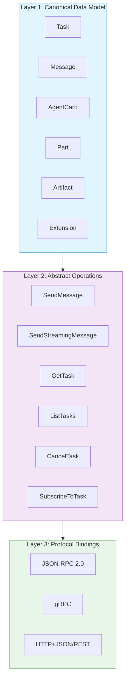
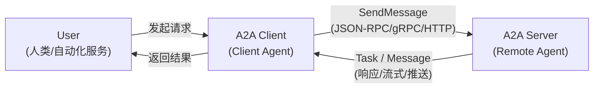
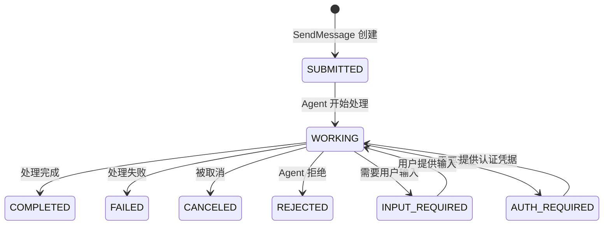
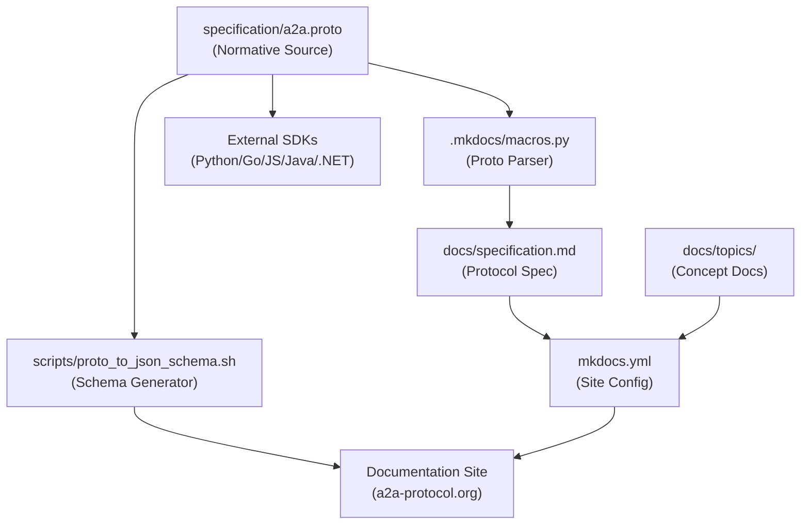
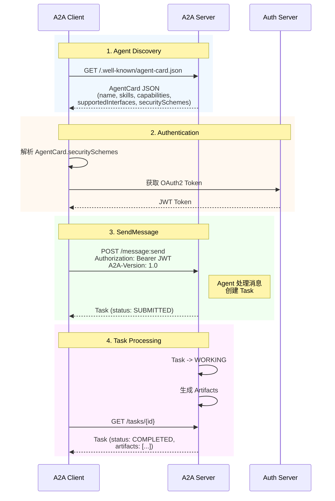
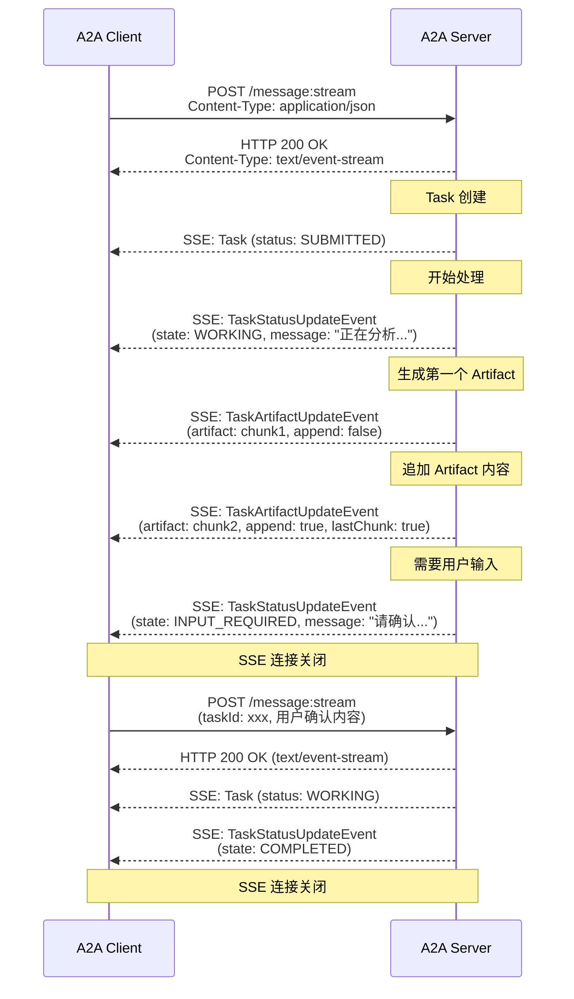

# A2A 源码学习笔记

> 仓库地址：[A2A](https://github.com/a2aproject/A2A)
> 学习日期：2026-03-22

---

> **以下为 AI 源码分析**
>
> ### 一句话概括
>
> A2A（Agent2Agent）是一个开放协议标准，定义了不同 AI Agent 之间安全通信和协作的通用语言，使跨框架、跨厂商的 Agent 能够互相发现、协商和协作完成复杂任务。
>
> ### 要点速览
>
> | 核心模块 | 职责 | 关键文件 |
> |---------|------|---------|
> | Protocol Specification | 协议规范定义，包含数据模型、操作语义、协议绑定 | `specification/a2a.proto`, `docs/specification.md` |
> | Agent Discovery | Agent 发现机制，通过 Agent Card 描述能力和端点 | `docs/topics/agent-discovery.md` |
> | Task Lifecycle | Task 生命周期管理，定义状态机和交互模式 | `docs/topics/life-of-a-task.md` |
> | Streaming & Async | SSE 流式传输和 Push Notification 异步机制 | `docs/topics/streaming-and-async.md` |
> | Extensions | 协议扩展机制，支持自定义功能和数据结构 | `docs/topics/extensions.md` |
> | SDK & Tooling | 多语言 SDK 和文档构建工具链 | `docs/sdk/`, `.mkdocs/macros.py`, `scripts/` |

---

## 项目简介

A2A（Agent2Agent）Protocol 是由 Google 贡献、隶属 Linux Foundation 的开放标准协议。它解决了 AI 生态中一个关键挑战：**让不同框架、不同厂商构建的 AI Agent 能够作为独立的智能体（而非工具）进行通信和协作**。与 MCP（Model Context Protocol）聚焦于 Agent 与工具/资源的连接不同，A2A 专注于 Agent 与 Agent 之间的对等协作——Agent 无需暴露内部状态、记忆或工具，仅通过声明的能力和交换的上下文即可完成任务委派、进度追踪和结果交付。

## 技术栈

| 类别 | 技术 |
|------|------|
| 语言 | Protocol Buffers (proto3)、Python、Markdown |
| 框架 | MkDocs Material（文档站点） |
| 构建工具 | `protoc` + `protoc-gen-jsonschema`（Schema 生成）、`buf`（Proto 管理）、`mkdocs`（文档构建） |
| 依赖管理 | `requirements-docs.txt`（Python 文档依赖）、`buf.yaml`/`buf.lock`（Proto 依赖） |
| 测试框架 | Super Linter（代码规范检查）、Lychee（链接检查）、Conventional Commits（提交规范） |

## 目录结构

```
A2A/
├── specification/           # 协议规范核心 - Proto 定义（权威数据源）
│   ├── a2a.proto           #   唯一规范性 Proto 文件，定义所有数据结构和 RPC 服务
│   ├── buf.yaml            #   Buf 配置（Proto 管理工具）
│   └── json/               #   JSON Schema（构建时生成，非 normative）
├── docs/                    # 协议文档 - MkDocs 站点源文件
│   ├── specification.md    #   完整协议规范文档
│   ├── topics/             #   主题文档
│   │   ├── what-is-a2a.md  #     A2A 概述和设计原则
│   │   ├── key-concepts.md #     核心概念解释
│   │   ├── life-of-a-task.md #   Task 生命周期
│   │   ├── agent-discovery.md #  Agent 发现机制
│   │   ├── streaming-and-async.md # 流式和异步操作
│   │   ├── enterprise-ready.md #  企业级特性
│   │   ├── extensions.md   #     扩展机制
│   │   └── a2a-and-mcp.md  #     A2A 与 MCP 对比
│   ├── sdk/                #   SDK 参考文档
│   ├── tutorials/          #   教程（Python 快速上手）
│   └── whats-new-v1.md     #   v1.0 迁移指南
├── scripts/                 # 构建和维护脚本
│   ├── proto_to_json_schema.sh # Proto -> JSON Schema 转换
│   ├── build_docs.sh       #   文档构建脚本
│   └── lint.sh             #   代码规范检查
├── .mkdocs/                 # MkDocs 自定义配置
│   ├── macros.py           #   自定义宏（Proto -> Markdown 表格渲染）
│   └── overrides/          #   主题覆盖
├── adrs/                    # 架构决策记录
│   └── adr-001-protojson-serialization.md # ProtoJSON 序列化决策
├── mkdocs.yml               # MkDocs 站点配置
└── .github/                 # CI/CD 工作流
    └── workflows/           #   自动化检查（linter、链接、拼写、文档发布）
```

## 架构设计

### 整体架构

A2A 协议采用 **三层架构** 设计，将数据模型、抽象操作和协议绑定解耦，确保跨绑定的语义一致性：

- **Layer 1 - Canonical Data Model**：使用 Protocol Buffers 定义与协议无关的核心数据结构（Task、Message、AgentCard、Part、Artifact 等）
- **Layer 2 - Abstract Operations**：描述 Agent 必须支持的基本操作（SendMessage、GetTask、CancelTask 等），独立于具体协议
- **Layer 3 - Protocol Bindings**：将抽象操作映射到具体协议实现（JSON-RPC、gRPC、HTTP+JSON/REST）



协议的核心交互模型围绕三个角色展开：



### 核心模块

#### 1. Protocol Data Model（协议数据模型）

**职责**：定义协议中所有数据结构的权威表示。

**核心文件**：`specification/a2a.proto`

**关键数据结构**：

| 数据结构 | 说明 |
|---------|------|
| `A2AService` | gRPC 服务定义，包含 `SendMessage`、`GetTask`、`CancelTask` 等 12 个 RPC 方法 |
| `Task` | 协议核心工作单元，包含 `id`、`contextId`、`status`、`artifacts`、`history` |
| `TaskState` | Task 状态枚举：`SUBMITTED` → `WORKING` → `COMPLETED`/`FAILED`/`CANCELED`/`REJECTED`，中间可进入 `INPUT_REQUIRED`/`AUTH_REQUIRED` |
| `Message` | 通信单元，包含 `role`（USER/AGENT）、`parts`（内容部分）、`referenceTaskIds` |
| `Part` | 内容容器，使用 `oneof` 支持 `text`/`raw`/`url`/`data` 四种类型 |
| `Artifact` | Task 输出物（文档/图片/结构化数据），由多个 `Part` 组成 |
| `AgentCard` | Agent 的"数字名片"，描述身份、能力、技能、安全方案 |
| `AgentInterface` | 声明 Agent 支持的通信接口（URL、协议绑定、协议版本） |

**设计特点**：
- **Proto-first**：`a2a.proto` 是唯一的 normative source，JSON Schema 和 SDK 类型都从它生成
- **OneOf 多态**：`Part` 使用 `oneof content` 代替 `kind` 判别器，实现类型安全的内容多态
- **扩展性**：所有核心数据结构都包含 `metadata` 字段（`google.protobuf.Struct`）和 `extensions` 数组

#### 2. Agent Discovery（Agent 发现）

**职责**：让 Client Agent 能够发现、理解和连接 Remote Agent。

**核心文件**：`docs/topics/agent-discovery.md`, `specification/a2a.proto`（`AgentCard` 消息）

**发现策略**：
- **Well-Known URI**：公开 Agent 在 `/.well-known/agent-card.json` 发布 Agent Card（遵循 RFC 8615）
- **Curated Registries**：企业环境通过中心化注册表查询和管理 Agent Card
- **Direct Configuration**：开发阶段通过硬编码配置直接连接

**Agent Card 结构**：
- `name`/`description`/`provider` — Agent 身份信息
- `supportedInterfaces[]` — 支持的通信接口列表（v1.0 重构：合并了原 `url` + `preferredTransport`）
- `capabilities` — 可选能力声明（streaming、pushNotifications、extendedAgentCard）
- `skills[]` — Agent 技能列表（id、name、description、tags、inputModes、outputModes）
- `securitySchemes` / `securityRequirements` — 安全方案声明（API Key、HTTP Auth、OAuth2、OIDC、mTLS）
- `signatures[]` — JWS 签名（RFC 7515），支持 Agent Card 完整性验证

#### 3. Task Lifecycle（Task 生命周期）

**职责**：管理 Agent 间协作的有状态工作单元。

**核心文件**：`docs/topics/life-of-a-task.md`, `specification/a2a.proto`（`Task`/`TaskState`/`TaskStatus`）

**状态机**：



**核心概念**：
- **contextId**：逻辑分组标识符，关联多个 Task 和 Message，支持跨任务的会话上下文
- **Task Immutability**：终态 Task 不可重启，后续交互创建新 Task（保证可追溯性）
- **Agent Response 二元性**：Agent 可返回 `Message`（无状态即时响应）或 `Task`（有状态长时处理）
- **Parallel Follow-ups**：同一 contextId 下可创建并行任务（如：订机票 → 并行订酒店 + 订活动）

#### 4. Streaming & Async（流式与异步）

**职责**：支持长时间运行任务的实时更新和断连场景。

**核心文件**：`docs/topics/streaming-and-async.md`

**三种更新机制**：
- **Polling**（GetTask 轮询）：简单实现，适合低频更新
- **SSE Streaming**（SendStreamingMessage / SubscribeToTask）：实时事件推送，通过 `TaskStatusUpdateEvent` 和 `TaskArtifactUpdateEvent` 传递状态和产物更新
- **Push Notifications**（WebHook）：Agent 主动 POST 到 Client 注册的 webhook URL，适合长达数小时/天的任务

#### 5. Extensions（扩展机制）

**职责**：在不修改核心协议的前提下扩展 A2A 功能。

**核心文件**：`docs/topics/extensions.md`

**扩展类型**：
- **Data-only Extensions**：在 Agent Card 中添加结构化数据（如 GDPR 合规信息）
- **Profile Extensions**：叠加请求/响应的额外约束（如要求所有 Part 使用特定 Schema）
- **Method Extensions**：添加全新的 RPC 方法（如 `tasks/search`）
- **State Machine Extensions**：添加新的 Task 状态或转换

**激活流程**：Client 通过 `A2A-Extensions` HTTP Header 请求激活 → Agent 检查支持情况 → 响应中回显已激活的扩展 URI

#### 6. Documentation Toolchain（文档工具链）

**职责**：从 Proto 定义自动生成文档站点和 Schema。

**核心文件**：`.mkdocs/macros.py`, `scripts/proto_to_json_schema.sh`, `mkdocs.yml`

**工作流**：
- `macros.py` — 自定义 MkDocs 宏，解析 `a2a.proto` 并将 Message/Enum/Service 渲染为 Markdown 表格（`proto_to_table()`、`proto_enum_to_table()`）
- `proto_to_json_schema.sh` — 使用 `protoc` + `protoc-gen-jsonschema` 将 Proto 转换为 JSON Schema bundle
- `build_docs.sh` — 编排完整的文档构建流程
- `mkdocs.yml` — 配置 Material 主题、导航结构、插件（search、macros、redirects、mike 版本管理）

### 模块依赖关系



## 核心流程

### 流程一：A2A 请求生命周期（Agent Discovery → SendMessage → Task 完成）

这是 A2A 协议最核心的端到端流程，展示了从 Agent 发现到任务完成的完整交互链：



**关键逻辑说明**：

1. **Agent Discovery**：Client 通过 Well-Known URI 获取 Agent Card，了解 Agent 的能力、技能和安全要求
2. **Authentication**：根据 Agent Card 中声明的 `securitySchemes`，通过外部 OAuth/OIDC 流程获取凭据
3. **SendMessage**：Client 发送带有 `Message` 的请求，Agent 决定返回 `Task`（长时处理）或直接 `Message`（即时响应）
4. **Task Tracking**：Client 通过 Polling（GetTask）、Streaming（SubscribeToTask）或 Push Notification 获取任务更新

### 流程二：SSE 流式交互（SendStreamingMessage）

展示流式场景下的实时事件推送流程：



**关键逻辑说明**：

1. **Stream 建立**：Client 调用 `SendStreamingMessage`，Server 返回 `text/event-stream` 响应
2. **事件类型**：流中传递三种对象 — `Task`（初始状态）、`TaskStatusUpdateEvent`（状态变更）、`TaskArtifactUpdateEvent`（产物更新）
3. **增量传输**：Artifact 可通过 `append: true` + `lastChunk: true` 实现分块流式传输
4. **多轮交互**：当 Task 进入 `INPUT_REQUIRED` 状态时 stream 关闭，Client 提供输入后重新建立 stream
5. **重新订阅**：如果连接中断，Client 可通过 `SubscribeToTask` 重新连接到进行中的 Task

## 关键设计亮点

### 1. Proto-first 规范驱动设计

**解决的问题**：多语言 SDK、多协议绑定（JSON-RPC / gRPC / HTTP+JSON）之间的数据结构一致性。

**实现方式**：`specification/a2a.proto` 是唯一的 normative source（规范性数据源）。所有 JSON Schema、SDK 类型、文档表格都从它生成——`proto_to_json_schema.sh` 生成 JSON Schema，`.mkdocs/macros.py` 的 `proto_to_table()` 宏解析 Proto AST 生成文档表格。

**设计理由**：将规范集中在一个 Proto 文件中，消除了手动维护多份数据定义的同步问题（specification drift）。ADR-001 记录了采用 ProtoJSON 序列化的决策，虽然引入了 `SCREAMING_SNAKE_CASE` 枚举的 breaking change，但换来了跨实现的严格互操作性保证。

### 2. Opaque Execution（不透明执行）原则

**解决的问题**：在 Agent 协作中保护各方的内部实现、知识产权和安全性。

**实现方式**：A2A 协议在设计上将 Remote Agent 视为黑盒——Client 只能通过 Agent Card 了解能力声明，通过 Task/Message/Artifact 交换信息。协议中 **没有** 任何机制暴露 Agent 的内部记忆、推理链、工具列表或 prompt。

**设计理由**：这是 A2A 与"将 Agent 包装为 MCP Tool"的根本区别。Tool 暴露了输入输出的精确 Schema，而 A2A 的 Agent 保留了自主性——它可以拒绝任务（REJECTED）、请求更多信息（INPUT_REQUIRED）、甚至在处理过程中改变策略，这些对 Client 来说都是透明但不可控的。

### 3. Task vs Message 二元响应模型

**解决的问题**：同时支持简单即时交互和复杂长时任务，不强制所有交互都走重量级的 Task 流程。

**实现方式**：`SendMessage` 的响应是 `oneof { Task task = 1; Message message = 2; }`。Agent 可以选择返回无状态的 `Message`（快速问答、能力协商）或有状态的 `Task`（需要追踪的工作单元）。Task 一旦创建就有完整的生命周期管理（状态机、Artifact、History），而 Message 是轻量的一次性通信。

**设计理由**：避免了"one size fits all"的设计陷阱。文档中定义了三类 Agent 模式：Message-only Agent（简单包装 LLM）、Task-generating Agent（所有响应都创建 Task）、Hybrid Agent（先用 Message 协商再创建 Task）。

### 4. 三层协议绑定解耦

**解决的问题**：让同一份协议规范能够适用于不同的通信协议（JSON-RPC、gRPC、REST），且保证语义等价。

**实现方式**：规范将数据模型（Layer 1）、抽象操作（Layer 2）、协议绑定（Layer 3）严格分层。`a2a.proto` 使用 `google.api.http` annotation 同时定义了 gRPC RPC 和 HTTP REST 路由（如 `post: "/message:send"`），JSON-RPC 绑定则通过文档映射。`AgentCard.supportedInterfaces[]` 允许单个 Agent 同时暴露多个绑定。

**设计理由**：v1.0 中从 AgentCard 顶层 `url` + `preferredTransport` 重构为 `supportedInterfaces[]` 数组，每个 interface 独立指定 `protocolBinding` 和 `protocolVersion`，使 Agent 可以同时支持多个协议版本和绑定方式，支持渐进式迁移。

### 5. Extension Governance 生态治理体系

**解决的问题**：如何在不分裂核心标准的前提下支持领域特定的功能扩展和生态创新。

**实现方式**：扩展通过 URI 标识，在 Agent Card 的 `capabilities.extensions[]` 中声明。Client 通过 `A2A-Extensions` HTTP Header 激活扩展。扩展分为两级治理：Experimental Extension（`experimental-ext-*` 仓库，需 Maintainer 赞助）和 Official Extension（`ext-*` 仓库，需 TSC 投票通过）。定义了完整的 Proposal → Experimental → Official → Core 的晋升路径。

**设计理由**：借鉴了 W3C/IETF 的标准化治理经验，通过分级治理平衡了创新速度和标准稳定性。限制扩展不能修改核心数据结构定义或添加枚举值（只能使用 `metadata` 字段），防止核心类型验证被破坏。
