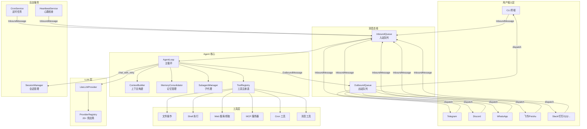
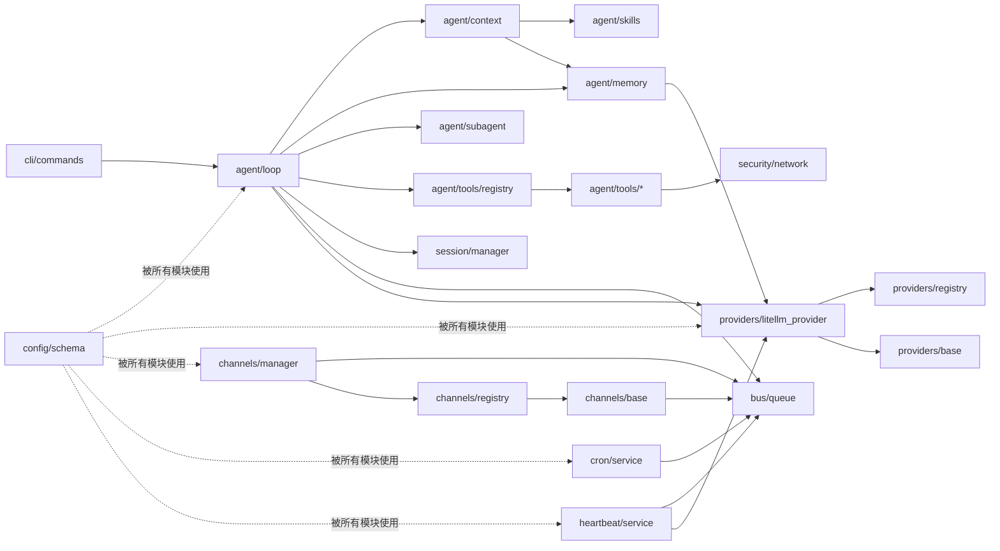
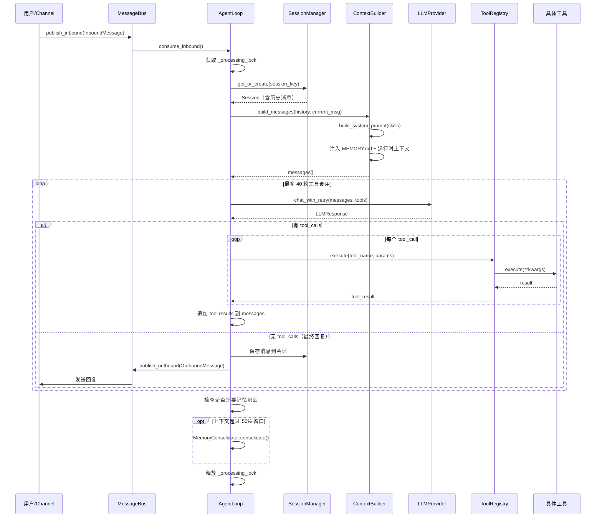
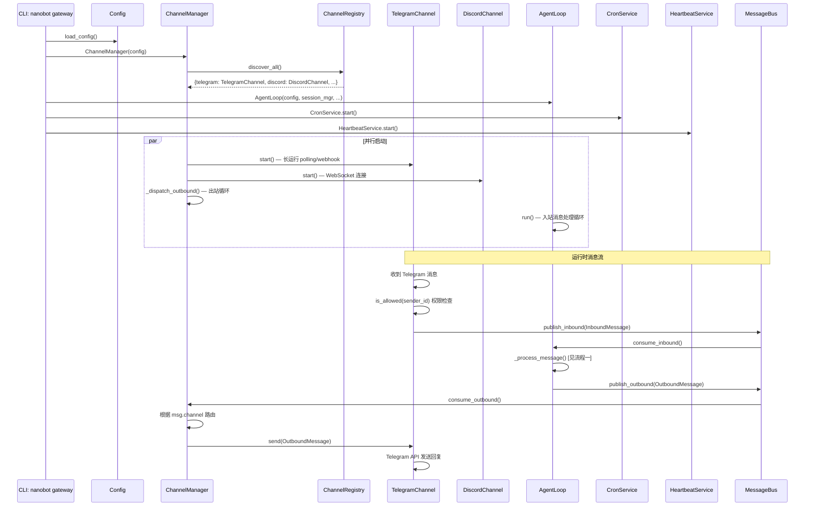

# nanobot 源码学习笔记

> 仓库地址：[nanobot](https://github.com/HKUDS/nanobot)
> 学习日期：2026-03-22

---

> **以下为 AI 源码分析**
>
> ### 一句话概括
>
> nanobot 是一个超轻量级个人 AI 助手框架，以极少代码实现了完整的 Agent Loop、多 LLM Provider 接入、多聊天平台对接、工具调用、定时任务和记忆管理能力。
>
> ### 要点速览
>
> | 核心模块 | 职责 | 关键文件 |
> |---------|------|---------|
> | `agent/` | Agent 主循环、上下文构建、记忆、子代理、技能 | `loop.py`, `context.py`, `memory.py` |
> | `providers/` | LLM 多供应商抽象（20+ 供应商） | `base.py`, `registry.py`, `litellm_provider.py` |
> | `channels/` | 多聊天平台适配（12+ 平台） | `base.py`, `manager.py`, `telegram.py` |
> | `bus/` | 异步消息总线，解耦 Channel 与 Agent | `events.py`, `queue.py` |
> | `session/` | 会话管理，JSONL 持久化 | `manager.py` |
> | `config/` | Pydantic 配置系统 | `schema.py`, `loader.py` |
> | `cron/` | 定时/周期任务调度 | `service.py`, `types.py` |
> | `cli/` | Typer CLI 入口 | `commands.py` |

---

## 项目简介

nanobot 是 [OpenClaw](https://github.com/openclaw/openclaw) 的超轻量级复刻，目标是用 **99% 更少的代码** 实现核心 AI Agent 功能。项目面向个人用户，提供一个可部署在 CLI 或多聊天平台（Telegram、Discord、WhatsApp、飞书、钉钉等）上的 AI 助手。其核心价值在于：代码简洁可读、易于二次开发和研究、启动快资源占用低、一键部署即用。

## 技术栈

| 类别 | 技术 |
|------|------|
| 语言 | Python ≥ 3.11 |
| 框架 | Typer (CLI) + asyncio (异步核心) |
| 构建工具 | Hatchling / Docker |
| 依赖管理 | pip / uv / pyproject.toml |
| 测试框架 | pytest + pytest-asyncio |
| LLM 集成 | LiteLLM（多供应商统一接口） |
| 数据验证 | Pydantic v2 |
| 终端 UI | prompt_toolkit + Rich |
| 日志 | Loguru |
| 网络 | httpx / websockets |

## 目录结构

```
nanobot/
├── __main__.py              # 程序入口，指向 cli.commands.app
├── cli/
│   ├── commands.py          # CLI 命令定义（agent/gateway/onboard/status）
│   ├── onboard_wizard.py    # 交互式配置向导
│   └── model_info.py        # 模型信息查询
├── agent/
│   ├── loop.py              # ★ Agent 主循环（消息→LLM→工具→响应）
│   ├── context.py           # 上下文构建器（系统提示+历史+技能）
│   ├── memory.py            # 两层记忆系统（长期MEMORY + 短期HISTORY）
│   ├── subagent.py          # 子代理管理（后台异步任务）
│   ├── skills.py            # 技能加载器（内置+workspace+插件）
│   └── tools/
│       ├── base.py          # Tool 抽象基类（OpenAI function calling 格式）
│       ├── registry.py      # 工具注册表
│       ├── read_file.py     # 文件读取工具
│       ├── write_file.py    # 文件写入工具
│       ├── edit_file.py     # 文件编辑工具（diff-based）
│       ├── list_dir.py      # 目录列表
│       ├── exec.py          # Shell 命令执行
│       ├── web_search.py    # 网络搜索（Brave/Tavily/DuckDuckGo）
│       ├── web_fetch.py     # URL 内容抓取（SSRF 防护）
│       ├── message.py       # 跨频道消息发送
│       ├── spawn.py         # 子代理生成
│       ├── cron.py          # 定时任务工具
│       └── mcp.py           # MCP 协议集成
├── providers/
│   ├── base.py              # LLMProvider 抽象基类
│   ├── registry.py          # Provider 注册表（20+ 供应商元数据）
│   ├── litellm_provider.py  # ★ LiteLLM 统一供应商实现
│   ├── custom_provider.py   # 自定义 OpenAI 兼容端点
│   ├── azure_openai_provider.py  # Azure OpenAI
│   ├── openai_codex_provider.py  # OpenAI Codex (OAuth)
│   └── transcription.py     # 音频转录（Groq Whisper）
├── channels/
│   ├── base.py              # BaseChannel 抽象基类
│   ├── manager.py           # 频道管理器（初始化+出站分发）
│   ├── registry.py          # 频道发现（内置+插件）
│   ├── telegram.py          # Telegram 适配器
│   ├── discord.py           # Discord 适配器
│   ├── whatsapp.py          # WhatsApp 适配器
│   ├── feishu.py            # 飞书适配器
│   ├── slack.py             # Slack 适配器
│   ├── dingtalk.py          # 钉钉适配器
│   ├── qq.py                # QQ 适配器
│   ├── email.py             # 邮件适配器
│   ├── wecom.py             # 企业微信适配器
│   ├── matrix.py            # Matrix 适配器
│   └── mochat.py            # MoChat 适配器
├── bus/
│   ├── events.py            # 事件定义（InboundMessage / OutboundMessage）
│   └── queue.py             # 异步消息队列
├── session/
│   └── manager.py           # 会话管理（内存缓存+JSONL持久化）
├── config/
│   ├── schema.py            # Pydantic 配置 Schema
│   ├── loader.py            # 配置加载/保存/迁移
│   └── paths.py             # 路径常量
├── cron/
│   ├── service.py           # 定时任务调度服务
│   └── types.py             # Cron 计划类型定义
├── heartbeat/
│   └── service.py           # 心跳服务（定期唤醒 Agent）
├── security/
│   └── network.py           # SSRF 防护（IP 黑名单）
├── utils/
│   ├── helpers.py           # 通用工具函数
│   └── evaluator.py         # 表达式求值
├── templates/               # 系统提示模板（SOUL.md, TOOLS.md 等）
└── skills/                  # 内置技能（memory, cron, weather 等）
bridge/                      # WhatsApp 桥接（Node.js/TypeScript）
```

## 架构设计

### 整体架构

nanobot 采用 **异步事件驱动** 架构，核心思路是：多个 Channel（聊天平台）通过 MessageBus 与唯一的 AgentLoop 解耦通信。AgentLoop 负责处理消息，通过 LLMProvider 调用大模型，并执行工具调用。整个系统支持 CLI 模式（直接交互）和 Gateway 模式（多频道同时运行）。



### 核心模块

#### 1. AgentLoop（`agent/loop.py`）

Agent 的心脏，实现完整的消息处理循环：

- **职责**：接收消息 → 构建上下文 → 调用 LLM → 执行工具 → 返回响应
- **核心接口**：
  - `run()` — 主事件循环，从 MessageBus 持续消费入站消息
  - `_process_message(msg)` — 处理单条消息的完整 Agent Turn
  - `process_direct(content)` — CLI 模式直接调用
- **关键设计**：使用 `_processing_lock` 全局锁序列化 LLM 调用，防止竞态条件
- **工具循环**：单次对话最多执行 40 轮工具调用（`max_iterations=40`）

#### 2. ContextBuilder（`agent/context.py`）

为每次 LLM 调用组装完整上下文：

- **系统提示组成**：身份信息 → Bootstrap 模板（SOUL.md / TOOLS.md / USER.md / AGENTS.md）→ 长期记忆 → 始终激活的技能 → 技能摘要
- **消息构建**：系统提示 + 历史消息 + 运行时上下文（时间/频道/chat_id）+ 当前消息
- **多模态支持**：图像自动 Base64 编码嵌入

#### 3. Memory System（`agent/memory.py`）

两层记忆设计：

| 层 | 存储 | 用途 |
|---|------|------|
| MEMORY.md | 长期记忆 | 关键事实、决策、用户偏好 |
| HISTORY.md | 短期历史 | 带时间戳的对话日志 |

- **MemoryConsolidator** 在上下文超过窗口 50% 时触发，使用虚拟 `save_memory` 工具强制 LLM 输出结构化的记忆更新
- **容错**：LLM 摘要失败 3 次后降级为原始存档

#### 4. Provider System（`providers/`）

- **ProviderRegistry** 集中定义 20+ 供应商元数据（关键字匹配、API Key 前缀检测、LiteLLM 前缀等）
- **LiteLLMProvider** 是主要实现，通过 LiteLLM 统一多供应商 API
- **支持的供应商**：Anthropic、OpenAI、DeepSeek、Groq、OpenRouter、Azure、VolcEngine、Moonshot、MiniMax、ZhipuAI、DashScope、vLLM、Ollama 等
- **Prompt Caching**：在系统消息和倒数第二条消息注入 `ephemeral` 缓存标记
- **重试机制**：指数退避（1s→2s→4s），检测 429/5xx/timeout 等瞬时错误

#### 5. Channel System（`channels/`）

- **BaseChannel** 定义统一接口：`start()` / `stop()` / `send()` / `is_allowed()`
- **ChannelManager** 自动发现并管理所有频道，负责出站消息的路由分发
- **ChannelRegistry** 支持两种发现方式：`pkgutil` 扫描内置模块 + `entry_points` 加载插件
- **音频转录**：集成 Groq Whisper 实现音频消息自动转文字

#### 6. Session Manager（`session/manager.py`）

- **JSONL 存储**：每行一条消息，仅追加不修改（LLM 缓存友好）
- **`_find_legal_start()`**：确保返回消息在工具调用边界对齐，防止孤立的 tool result
- **缓存**：内存中缓存活跃会话，减少磁盘 I/O

#### 7. MessageBus（`bus/`）

- 基于 `asyncio.Queue` 的双向消息总线
- **InboundQueue**：Channel → AgentLoop（入站）
- **OutboundQueue**：AgentLoop → ChannelManager → Channel（出站）
- 解耦设计使得频道和 Agent 可以独立运行、并发处理

### 模块依赖关系



## 核心流程

### 流程一：消息处理主循环（Agent Turn）

这是 nanobot 最核心的流程——从用户发出消息到获得 AI 回复的完整链路。



**关键细节**：
1. `_processing_lock` 确保同一时刻只处理一条消息
2. ContextBuilder 会加载系统提示模板（SOUL.md 等）+ 长期记忆 + 匹配的技能
3. LLM 调用带重试机制（指数退避），支持 Prompt Caching
4. 工具调用结果以 `tool` role 消息追加到上下文，形成多轮交互
5. 消息处理完成后，检查是否需要触发记忆巩固（超过上下文窗口 50%）

### 流程二：Gateway 多频道启动与消息路由

Gateway 模式下，nanobot 同时运行多个聊天平台频道，统一处理消息。



**关键细节**：
1. **频道自动发现**：通过 `pkgutil` 扫描内置频道 + `entry_points` 加载插件
2. **权限控制**：每个频道配置 `allowFrom` 列表，仅允许授权用户
3. **出站路由**：ChannelManager 根据 `OutboundMessage.channel` 字段分发到对应频道
4. **进度流式**：支持 `send_progress`（流式文本）和 `send_tool_hints`（工具调用提示）

## 关键设计亮点

### 1. 虚拟工具调用模式（Virtual Tool Calls）

**问题**：需要 LLM 输出结构化数据（如记忆摘要、心跳决策），但直接解析自由文本不可靠。

**方案**：定义虚拟工具（如 `save_memory`、`heartbeat`），通过 `tool_choice: {"type": "function", "function": {"name": "save_memory"}}` 强制 LLM 以工具调用格式返回结构化结果。

**实现文件**：`agent/memory.py`（MemoryConsolidator）、`heartbeat/service.py`

**优势**：利用 LLM 原生的 function calling 能力，比正则/JSON 解析更鲁棒，且与 Agent 工具体系统一。

### 2. 仅追加会话日志 + 智能巩固（Append-Only + Consolidation）

**问题**：对话历史不断增长，但 LLM 上下文窗口有限；同时需要保持 LLM Prompt Cache 命中率。

**方案**：
- 会话消息**仅追加不修改**（`session/manager.py`），保证 LLM 前缀缓存有效
- 当上下文超过窗口 50% 时，MemoryConsolidator 将旧消息摘要到 MEMORY.md，并从上下文中移除
- `pick_consolidation_boundary()` 确保在 user-turn 边界切割，不破坏工具调用对

**优势**：既保证了无限对话，又最大化了 Prompt Cache 效率。

### 3. Provider 中央注册表模式（`providers/registry.py`）

**问题**：支持 20+ LLM 供应商，每个有不同的 API Key 格式、模型前缀、能力特性。

**方案**：`ProviderSpec` 数据类集中定义所有供应商元数据（关键字匹配规则、环境变量名、LiteLLM 前缀、是否网关、Key 前缀检测等），所有供应商逻辑统一由 `_resolve_model()` 分发。

**实现**：一个 `PROVIDERS` 列表 + 一个 `LiteLLMProvider` 类覆盖全部场景，新增供应商只需添加一条 `ProviderSpec` 配置。

**优势**：避免了 20+ 个 Provider 子类的爆炸，将差异降维到数据层。

### 4. 异步消息总线解耦（`bus/queue.py`）

**问题**：多个聊天平台和 Agent 核心需要并发运行，且平台 SDK 各自有不同的事件循环模式。

**方案**：使用 `asyncio.Queue` 实现双向 MessageBus（InboundQueue + OutboundQueue），Channel 和 AgentLoop 通过消息通信，完全解耦。

**优势**：
- Channel 可独立启停，不影响 Agent
- 支持多消息并发入站
- CronService 和 HeartbeatService 也通过同一 Bus 注入消息，统一处理流程

### 5. 渐进式技能加载（`agent/skills.py`）

**问题**：技能数量可能很多，全部放入系统提示会浪费 Token。

**方案**：
- `always: true` 标记的技能始终加载到系统提示
- 其余技能仅以 XML 摘要形式呈现（名称 + 描述）
- LLM 首先看到摘要，决定激活哪些技能后，通过 `load_skill(name)` 动态加载完整内容
- 支持 `requires` 字段检查前置条件（CLI 工具可用性、环境变量）

**实现文件**：`agent/skills.py` 的 `build_skills_summary()` 和 `load_skills_for_context()`

**优势**：Token 高效利用，技能数量可扩展，同时保持 LLM 对全部技能的感知。
