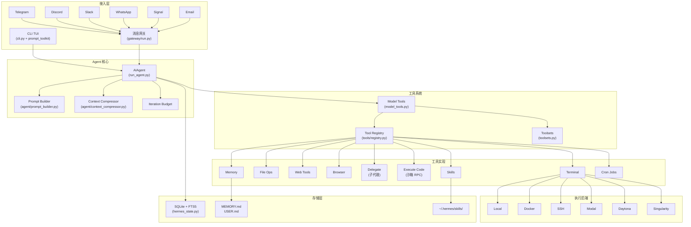
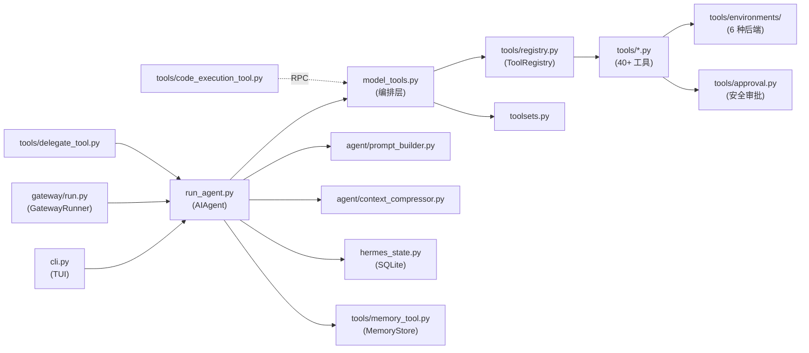
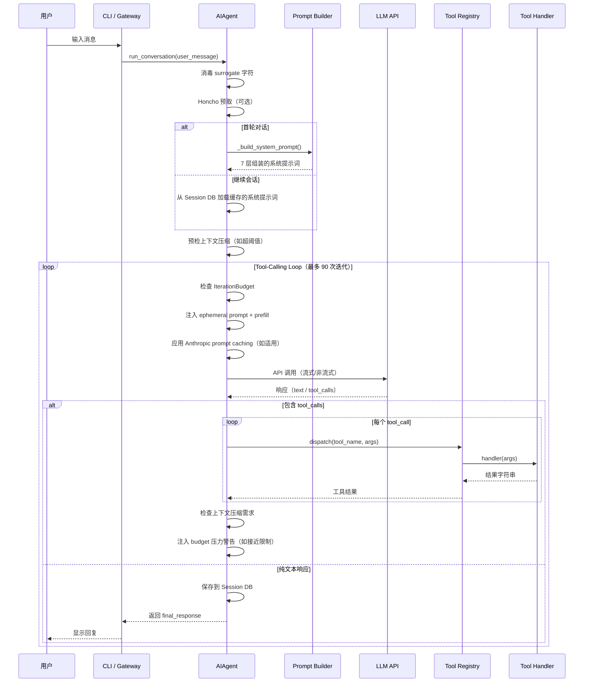
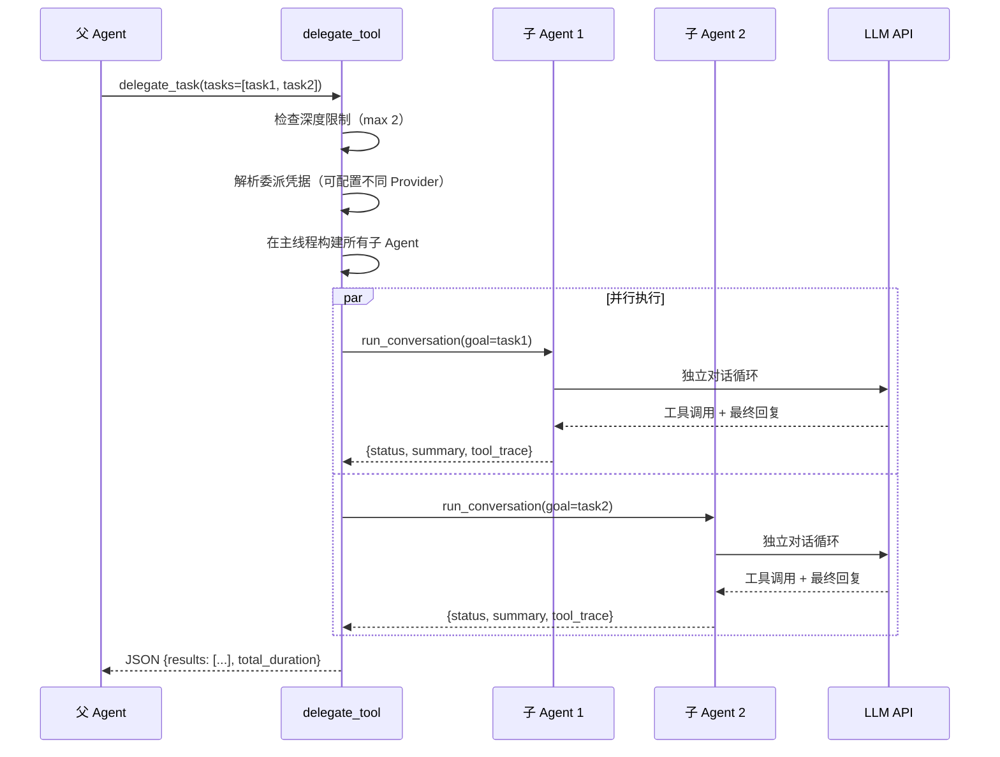

# hermes-agent 源码学习笔记

> 仓库地址：[hermes-agent](https://github.com/NousResearch/hermes-agent)
> 学习日期：2026-03-29

---

> **以下为 AI 源码分析**
>
> ### 一句话概括
>
> Nous Research 开发的自我进化 AI Agent 框架，具有闭环学习、多平台接入、子代理委派和可插拔工具系统，可在本地/云端/容器等多种环境中运行。
>
> ### 要点速览
>
> | 核心模块 | 职责 | 关键文件 |
> |---------|------|----------|
> | Agent 核心 | 对话循环、工具调用、上下文管理 | `run_agent.py`, `agent/` |
> | 工具系统 | 40+ 工具的注册、调度与分组 | `tools/registry.py`, `model_tools.py`, `toolsets.py` |
> | CLI 交互 | 终端 TUI、命令分发、配置管理 | `cli.py`, `hermes_cli/main.py` |
> | 消息网关 | 多平台适配（Telegram/Discord/Slack 等） | `gateway/run.py`, `gateway/platforms/` |
> | 技能系统 | 程序化记忆、自主创建与改进技能 | `tools/skills_tool.py`, `skills/` |
> | 持久记忆 | 跨会话记忆、用户画像 | `tools/memory_tool.py` |
> | 会话存储 | SQLite + FTS5 全文检索 | `hermes_state.py` |
> | 子代理 | 隔离上下文的并行任务委派 | `tools/delegate_tool.py` |
> | 上下文压缩 | 智能摘要式上下文窗口管理 | `agent/context_compressor.py` |
> | 定时调度 | 自然语言定时任务 + 多平台投递 | `cron/`, `tools/cronjob_tools.py` |

---

## 项目简介

Hermes Agent 是 Nous Research 推出的开源自我进化 AI Agent。它与通用 Agent 框架的核心区别在于其**闭环学习能力**：Agent 能从经验中自主创建技能（Skills），在使用过程中自我改进，并通过持久记忆（Memory）和会话搜索（Session Search）在跨会话间保持上下文连续性。支持通过 Telegram/Discord/Slack/WhatsApp/Signal/Email 等 10+ 平台与用户交互，并可部署在本地、Docker、SSH、Modal（Serverless）、Daytona、Singularity 等多种终端后端上。其目标是成为一个不绑定笔记本电脑、随时随地可交互的个人 AI 助手。

## 技术栈

| 类别 | 技术 |
|------|------|
| 语言 | Python 3.11+ |
| 框架 | OpenAI SDK（兼容协议）+ Anthropic SDK + prompt_toolkit（TUI） |
| 构建工具 | setuptools, Nix (可选) |
| 依赖管理 | uv / pip, pyproject.toml |
| 测试框架 | pytest + pytest-asyncio + pytest-xdist |

## 目录结构

```
hermes-agent/
├── run_agent.py              # AIAgent 类 — 核心对话循环、工具调度、会话持久化
├── cli.py                    # HermesCLI 类 — 交互式 TUI（prompt_toolkit）
├── model_tools.py            # 工具编排层 — 发现、过滤、分发工具调用
├── toolsets.py               # 工具集定义 — 分组、组合、平台预设
├── hermes_state.py           # SQLite 会话数据库 + FTS5 全文搜索
├── hermes_constants.py       # 全局常量（HERMES_HOME 等）
├── batch_runner.py           # 并行 batch 处理（轨迹生成）
│
├── agent/                    # Agent 内部模块
│   ├── prompt_builder.py     #   系统提示词组装（身份/技能/上下文/记忆）
│   ├── context_compressor.py #   上下文自动压缩（结构化摘要）
│   ├── auxiliary_client.py   #   辅助 LLM 客户端（摘要/视觉）
│   ├── model_metadata.py     #   模型上下文长度、Token 估算
│   ├── display.py            #   KawaiiSpinner、工具进度格式化
│   ├── trajectory.py         #   轨迹保存辅助
│   └── anthropic_adapter.py  #   Anthropic Messages API 适配器
│
├── hermes_cli/               # CLI 命令实现
│   ├── main.py               #   入口点、参数解析、命令分发
│   ├── config.py             #   配置管理、迁移、环境变量定义
│   ├── setup.py              #   交互式安装向导
│   ├── auth.py               #   Provider 解析、OAuth、Nous Portal
│   ├── commands.py           #   斜杠命令注册表
│   └── skin_engine.py        #   皮肤/主题引擎
│
├── tools/                    # 工具实现（自注册模式）
│   ├── registry.py           #   中央工具注册表（Schema/Handler/分发）
│   ├── terminal_tool.py      #   终端编排（sudo/环境生命周期/后端切换）
│   ├── file_operations.py    #   read_file/write_file/search/patch
│   ├── web_tools.py          #   web_search/web_extract
│   ├── delegate_tool.py      #   子代理生成与并行任务执行
│   ├── code_execution_tool.py#   沙箱 Python + RPC 工具调用
│   ├── memory_tool.py        #   持久记忆（MEMORY.md + USER.md）
│   ├── skills_tool.py        #   技能搜索/加载/管理
│   ├── browser_tool.py       #   浏览器自动化（Browserbase）
│   ├── approval.py           #   危险命令检测 + 审批流
│   └── environments/         #   终端执行后端
│       ├── base.py           #     BaseEnvironment ABC
│       ├── local.py          #     本地执行
│       ├── docker.py         #     Docker 容器
│       ├── ssh.py            #     SSH 远程
│       ├── modal.py          #     Modal Serverless
│       ├── daytona.py        #     Daytona 持久化
│       └── singularity.py    #     Singularity 容器
│
├── gateway/                  # 消息网关
│   ├── run.py                #   GatewayRunner — 平台生命周期/消息路由/Cron
│   ├── config.py             #   平台配置解析
│   ├── session.py            #   会话存储/上下文/重置策略
│   └── platforms/            #   平台适配器
│       ├── telegram.py       #     Telegram Bot
│       ├── discord_adapter.py#     Discord Bot
│       ├── slack.py          #     Slack Bot
│       └── whatsapp.py       #     WhatsApp Bridge（Node.js Baileys）
│
├── skills/                   # 内置技能（安装时复制到 ~/.hermes/skills/）
├── optional-skills/          # 官方可选技能
├── environments/             # RL 训练环境（Atropos 集成）
├── cron/                     # 定时调度器
├── honcho_integration/       # Honcho AI 记忆集成
├── tests/                    # 测试套件
└── website/                  # 文档站（hermes-agent.nousresearch.com）
```

## 架构设计

### 整体架构

Hermes Agent 采用**分层插件化架构**，核心设计理念是"一个 Agent 核心 + 可插拔的一切"：

- **接入层**：CLI TUI 和消息网关（Gateway）作为两个独立入口，统一路由到同一个 Agent 核心
- **Agent 核心**：`AIAgent` 类封装了完整的对话循环、工具调度、上下文管理和会话持久化
- **工具层**：自注册式工具系统，每个工具文件在导入时自动注册到中央 Registry
- **执行层**：6 种终端后端（Local/Docker/SSH/Modal/Daytona/Singularity）通过统一的 `BaseEnvironment` 抽象切换
- **存储层**：SQLite WAL 模式数据库 + FTS5 全文检索，支持并发读写
- **学习层**：Skills（程序化记忆）+ Memory（事实记忆）+ Session Search（跨会话回忆）+ Honcho（用户建模）构成闭环学习系统



### 核心模块

#### 1. AIAgent（对话核心）

**文件**：`run_agent.py`（约 6000+ 行，项目最大的单文件）

**职责**：封装完整的 Agent 对话循环，包括 LLM 调用、工具执行、上下文压缩、中断处理。

**关键类与方法**：
- `AIAgent.__init__()` — 初始化 LLM 客户端、工具集、压缩器、记忆系统、Honcho 集成
- `AIAgent.run_conversation()` — 单轮对话入口，组装消息、触发 agent loop、持久化会话
- `AIAgent._build_system_prompt()` — 七层系统提示词组装（身份→用户系统提示→记忆→技能→上下文文件→时间→平台提示）
- `AIAgent._interruptible_api_call()` — 带中断支持的 LLM API 调用（流式/非流式）
- `IterationBudget` — 线程安全的迭代预算计数器，父代理和子代理各自独立

**API 模式支持**：
- `chat_completions` — OpenAI Chat Completions API（默认，通过 OpenRouter）
- `codex_responses` — OpenAI Codex Responses API
- `anthropic_messages` — Anthropic Messages API（原生/第三方兼容端点）

#### 2. Tool Registry（工具注册表）

**文件**：`tools/registry.py`

**职责**：中央单例注册表，收集所有工具的 Schema、Handler 和元数据。

**关键类**：
- `ToolEntry` — 单个工具的元数据（name/toolset/schema/handler/check_fn/is_async）
- `ToolRegistry` — 单例注册表
  - `register()` — 模块导入时由工具文件调用
  - `get_definitions()` — 返回 OpenAI 格式的工具 Schema（仅通过 `check_fn` 的工具）
  - `dispatch()` — 执行工具 Handler，自动桥接 async→sync

**设计模式**：自注册（Self-Registration）—— 每个工具文件在模块级别调用 `registry.register()`，无需中央维护列表。

#### 3. Model Tools（工具编排层）

**文件**：`model_tools.py`

**职责**：Registry 之上的薄编排层，负责工具发现（通过 `importlib` 导入所有工具模块触发注册）、Toolset 过滤、MCP 工具发现和 async 桥接。

**关键函数**：
- `_discover_tools()` — 导入所有工具模块触发注册
- `get_tool_definitions()` — 根据 enabled/disabled toolsets 过滤工具 Schema
- `handle_function_call()` — 主调度器，路由工具调用到 Registry
- `_run_async()` — sync→async 桥接，处理 CLI/Gateway/Worker 三种线程上下文

#### 4. Toolsets（工具集系统）

**文件**：`toolsets.py`

**职责**：工具分组与组合，支持递归解析（工具集可包含其他工具集）。

**关键概念**：
- 基础工具集：`web`, `terminal`, `file`, `browser`, `skills`, `memory` 等
- 平台预设：`hermes-cli`, `hermes-telegram`, `hermes-discord` 等共享 `_HERMES_CORE_TOOLS`（40+ 工具）
- 组合工具集：`debugging` = `terminal` + `web` + `file`

#### 5. Context Compressor（上下文压缩器）

**文件**：`agent/context_compressor.py`

**职责**：在对话接近模型上下文窗口限制时，自动压缩中间轮次为结构化摘要。

**算法**：
1. **工具输出修剪**（无 LLM 调用）— 替换旧工具结果为占位符
2. **保护头部消息**（系统提示 + 首轮交换）
3. **Token 预算保护尾部**（最近约 20K tokens 的上下文）
4. **结构化 LLM 摘要**（Goal/Progress/Decisions/Files/Next Steps 模板）
5. **迭代更新**（后续压缩增量更新已有摘要，而非重新生成）
6. **Tool Call 配对修复**（`_sanitize_tool_pairs` 清理孤立的 tool_call/result 对）

#### 6. Gateway（消息网关）

**文件**：`gateway/run.py`, `gateway/platforms/`

**职责**：统一管理所有消息平台的生命周期，路由消息到 Agent 核心。

**关键类**：
- `GatewayRunner` — 主控制器，管理平台适配器的启动/停止/消息路由
- `BasePlatformAdapter` — 平台适配器抽象基类
- `SessionStore` — 平台会话管理、上下文提示构建

**支持平台**：Telegram, Discord, Slack, WhatsApp, Signal, Email, Home Assistant, Mattermost, Matrix, DingTalk, SMS

#### 7. Delegate Tool（子代理系统）

**文件**：`tools/delegate_tool.py`

**职责**：生成隔离上下文的子 Agent 实例，支持单任务和批量并行模式。

**设计要点**：
- 子代理获得**全新对话**（无父代理历史）
- 独立的 `task_id`（独立终端会话）
- 受限工具集（不能递归委派、不能使用 `clarify`/`memory`/`send_message`/`execute_code`）
- 深度限制：最大 2 层（父→子→拒绝孙代理）
- 最大并发 3 个子代理
- 父代理仅看到委派调用和结果摘要，子代理的中间步骤不进入父上下文

### 模块依赖关系



## 核心流程

### 流程一：用户消息处理（Tool-Calling Loop）

这是 Hermes Agent 最核心的流程——从用户输入到最终回复的完整调用链。



**关键细节**：
1. **系统提示词缓存**：首轮构建后缓存，后续轮次复用以最大化 Anthropic 前缀缓存命中率
2. **迭代预算**：默认 90 次，接近 70% 时注入"开始收尾"提示，90% 时注入"立即回复"警告
3. **并行工具执行**：同一批次的安全工具（`read_file`、`web_search` 等）可并行执行，最多 8 线程
4. **上下文压缩**：每次 API 返回后检查 Token 使用量，超过阈值时触发结构化摘要压缩

### 流程二：子代理委派（Delegate Task）

Agent 将复杂子任务委派给隔离的子代理，实现"零上下文成本"的并行工作。



**关键设计**：
- 子代理在主线程构建（线程安全），在 `ThreadPoolExecutor` 中运行
- 保存/恢复 `_last_resolved_tool_names` 全局状态，防止子代理构建污染父代理的工具集
- 子代理支持中断传播——父代理中断时级联到所有活跃子代理
- 进度回调：CLI 模式显示树形视图，Gateway 模式批量推送

## 关键设计亮点

### 1. 自注册工具系统（Self-Registering Tools）

**解决的问题**：40+ 工具需要统一管理 Schema、Handler 和可用性检查，避免中央维护巨型列表。

**实现方式**：每个工具文件在模块级别调用 `registry.register()`，`model_tools._discover_tools()` 通过 `importlib.import_module()` 触发所有注册。

```
tools/registry.py  ← 无工具文件依赖（循环导入安全）
     ↑
tools/*.py          ← 模块级别 register() 调用
     ↑
model_tools.py      ← importlib 触发发现
```

**为什么这样设计**：解耦工具注册与编排，新增工具只需创建文件 + 在 `_modules` 列表添加一行。工具可选依赖（如 `fal_client`）失败时不影响其他工具加载。

### 2. 结构化上下文压缩（Structured Context Compaction）

**解决的问题**：长对话超出模型上下文窗口，需要在不丢失关键信息的前提下压缩。

**实现方式**（`agent/context_compressor.py`）：
- 两阶段压缩：先无 LLM 修剪旧工具输出，再用 LLM 生成结构化摘要
- 迭代更新：后续压缩增量更新已有摘要（Goal/Progress/Decisions/Files/Next Steps），而非从头生成
- Token 预算动态调整：摘要 Token 预算按压缩内容量的 20% 比例计算，上限为模型上下文的 5%
- Tool Call 配对修复：压缩后自动清理孤立的 `tool_call_id`/`tool_result` 对

**为什么这样设计**：相比简单的消息截断，结构化摘要保留了决策上下文和工作进度，避免 Agent 重复已完成的工作。迭代更新而非重新摘要，使跨多次压缩的信息不被逐步稀释。

### 3. Ephemeral Injection 模式（瞬态注入）

**解决的问题**：系统提示词需要在 API 调用时注入动态内容（ephemeral prompt、prefill messages、Honcho 回忆），但不能破坏前缀缓存或污染会话持久化。

**实现方式**：
- `ephemeral_system_prompt` —— 仅在 API 调用时附加，不存入数据库/轨迹
- `prefill_messages` —— API 调用时注入的 few-shot 示例，不存入消息列表
- `_honcho_turn_context` —— 当前轮次的 Honcho 回忆注入用户消息，不持久化

**为什么这样设计**：Anthropic 的前缀缓存（Prompt Caching）对系统提示词的稳定性非常敏感。将动态内容隔离为瞬态注入，保证系统提示词在整个会话中稳定不变，从而最大化缓存命中率，降低约 75% 的输入成本。

### 4. 安全多层防护

**解决的问题**：Agent 拥有终端访问权限，需要防止命令注入、Prompt 注入和数据泄露。

**实现方式**（分布在多个文件中）：
- **危险命令检测**（`tools/approval.py`）—— 正则模式匹配 + 用户审批流（once/session/always/deny）
- **上下文文件扫描**（`agent/prompt_builder.py`）—— 检测 AGENTS.md 等中的 prompt injection 模式和隐藏 Unicode 字符
- **记忆内容扫描**（`tools/memory_tool.py`）—— 写入 MEMORY.md/USER.md 前检测注入/外泄模式
- **写入拒绝列表** —— 保护 `~/.ssh/authorized_keys`、`/etc/shadow` 等路径，使用 `os.path.realpath()` 防止符号链接绕过
- **代码执行沙箱**（`tools/code_execution_tool.py`）—— 子进程中剥离 API Key 环境变量
- **Docker 容器加固** —— 所有 capabilities 被 drop，禁止特权提升，PID 限制

**为什么这样设计**：Defense-in-depth（纵深防御），每一层各自独立生效，不依赖上层防护的完美性。

### 5. 程序化工具调用（Programmatic Tool Calling / PTC）

**解决的问题**：多步骤工具链（如"搜索 5 个 URL → 提取内容 → 汇总"）会消耗大量 LLM 推理轮次和上下文。

**实现方式**（`tools/code_execution_tool.py`）：
- LLM 生成一段 Python 脚本，脚本通过 `hermes_tools` 模块调用工具
- 父进程创建 Unix Domain Socket + RPC 监听线程
- 子进程运行脚本，工具调用通过 UDS 回传父进程执行
- 仅脚本的 `stdout` 返回给 LLM，中间工具结果不进入上下文窗口

**为什么这样设计**：将 N 次 LLM 推理压缩为 1 次，中间步骤的上下文成本为零。相比子代理（delegate_task），PTC 更适合机械化的多步操作（无推理需求），而子代理适合需要独立推理的复杂任务。
