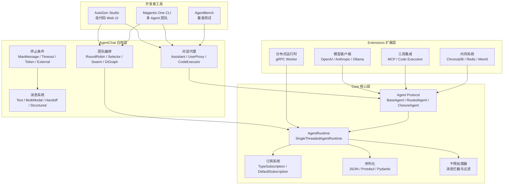
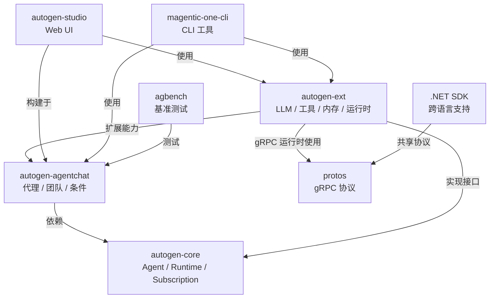
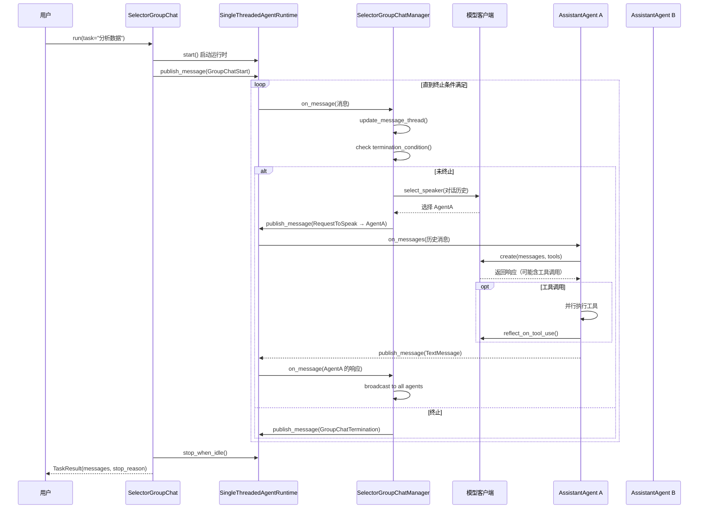
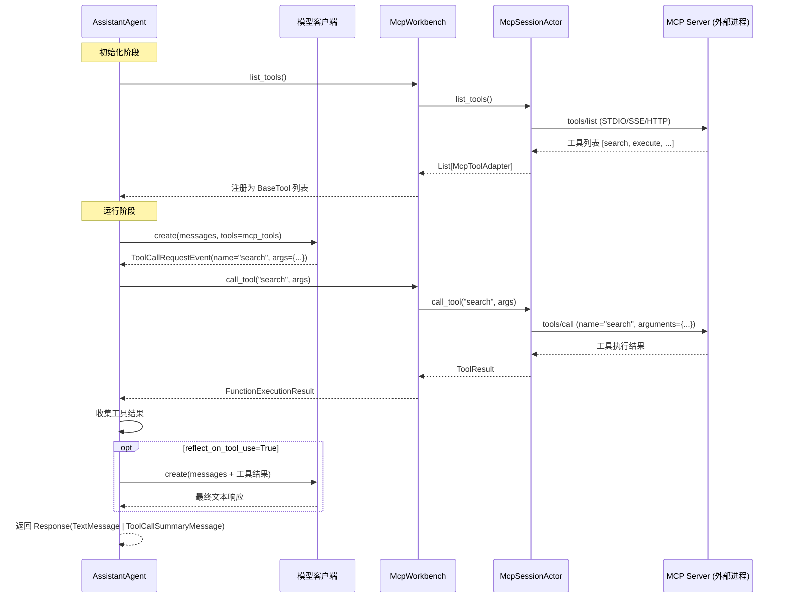

# AutoGen 源码学习笔记

> 仓库地址：[AutoGen](https://github.com/microsoft/autogen)
> 学习日期：2026-03-22

---

> **以下为 AI 源码分析**
>
> ### 一句话概括
>
> AutoGen 是微软开源的多 Agent AI 应用框架，基于 Actor 模型实现消息驱动的代理系统，支持从单 Agent 对话到复杂多 Agent 协作编排的全场景覆盖。
>
> ### 要点速览
>
> | 核心模块 | 职责 | 关键文件 |
> |---------|------|---------|
> | autogen-core | Agent 基础设施：消息传递、运行时、订阅系统 | `_base_agent.py`, `_single_threaded_agent_runtime.py` |
> | autogen-agentchat | 高层 Agent API：对话代理、团队编排、终止条件 | `agents/`, `teams/`, `conditions/` |
> | autogen-ext | 扩展生态：LLM 客户端、代码执行、MCP 工具、内存 | `models/`, `tools/mcp/`, `code_executors/` |
> | autogen-studio | 低代码 Web UI：可视化构建和测试多 Agent 工作流 | `web/app.py`, `teammanager/` |
> | magentic-one-cli | 多 Agent 团队 CLI：Web 浏览 + 文件处理 + 代码执行 | `_m1.py` |
> | agbench | 基准测试：Docker 隔离环境中评估 Agent 性能 | `run_cmd.py`, `cli.py` |

---

## 项目简介

AutoGen 是微软开发的多 Agent AI 应用开发框架，旨在让开发者轻松创建能够自主行动或与人类协作的 AI 代理系统。项目采用分层架构设计：底层 Core API 提供灵活的 Actor 模型消息传递和事件驱动机制；中层 AgentChat API 提供开箱即用的代理类型和团队编排模式（轮询、智能选择、Swarm、有向图等）；上层 Extensions API 通过插件化集成主流 LLM（OpenAI / Anthropic / Ollama 等）、代码执行器（本地 / Docker / Jupyter）、MCP 工具协议和向量内存系统。此外还提供 AutoGen Studio 低代码 Web UI 和 Magentic-One 多 Agent 团队等开发者工具，形成完整的 AI Agent 开发生态。

## 技术栈

| 类别 | 技术 |
|------|------|
| 语言 | Python 3.10+, C# (.NET SDK), Protobuf |
| 框架 | asyncio (异步核心), FastAPI (Studio 后端), Gatsby (Studio 前端) |
| 构建工具 | hatchling (Python 打包), uv (workspace 管理), dotnet (C#) |
| 依赖管理 | uv workspace (monorepo), NuGet (.NET) |
| 测试框架 | pytest, pytest-asyncio, pytest-xdist |
| 代码质量 | ruff (lint/format), pyright + mypy (类型检查) |
| 序列化 | Protobuf, Pydantic, JSON |
| 可观测性 | OpenTelemetry |

## 目录结构

```
autogen/
├── python/                          # Python 生态（主体）
│   ├── pyproject.toml               #   workspace 根配置，poe 任务定义
│   ├── packages/
│   │   ├── autogen-core/            #   核心层：Agent 模型、运行时、消息系统
│   │   ├── autogen-agentchat/       #   应用层：对话代理、团队编排、终止条件
│   │   ├── autogen-ext/             #   扩展层：LLM/工具/内存/运行时扩展
│   │   ├── autogen-studio/          #   工具层：低代码 Web UI 应用
│   │   ├── magentic-one-cli/        #   应用层：多 Agent 团队 CLI
│   │   ├── agbench/                 #   测试层：Agent 基准测试框架
│   │   ├── autogen-test-utils/      #   测试工具包
│   │   ├── pyautogen/               #   v0.2 兼容包（已弃用）
│   │   └── component-schema-gen/    #   组件 JSON Schema 生成
│   ├── samples/                     #   示例代码集合
│   └── docs/                        #   Sphinx 文档源码
├── dotnet/                          # .NET SDK
│   ├── src/                         #   Microsoft.AutoGen.* 核心包
│   ├── test/                        #   测试套件
│   └── samples/                     #   .NET 示例
├── protos/                          # gRPC 协议定义
│   ├── agent_worker.proto           #   Agent 通信协议
│   └── cloudevent.proto             #   CloudEvents 事件格式
└── docs/                            # 跨语言文档和设计文档
    └── design/                      #   架构设计文档（编程模型、Topics、协议等）
```

## 架构设计

### 整体架构

AutoGen 采用**分层架构 + Actor 模型**的设计思路。底层 Core 层定义了 Agent、Runtime、Subscription 三大核心抽象，通过消息驱动实现代理间通信；中层 AgentChat 在 Core 之上封装了开箱即用的代理类型和团队编排策略；顶层 Extensions 通过可插拔方式集成外部 LLM、工具和存储服务。整个系统围绕 **Protocol-based** 设计展开，便于扩展和测试。



### 核心模块

#### 1. autogen-core — Agent 基础设施

**职责**：定义 Agent 生命周期、消息传递、运行时和订阅系统的核心抽象。

**核心文件**：
- `src/autogen_core/_agent.py` — `Agent` Protocol 接口定义
- `src/autogen_core/_base_agent.py` — `BaseAgent` 抽象基类实现
- `src/autogen_core/_routed_agent.py` — `RoutedAgent` 基于类型的消息路由代理
- `src/autogen_core/_closure_agent.py` — `ClosureAgent` 闭包式轻量代理
- `src/autogen_core/_single_threaded_agent_runtime.py` — 单线程异步运行时
- `src/autogen_core/_agent_runtime.py` — `AgentRuntime` Protocol 接口
- `src/autogen_core/_subscription.py` — `Subscription` Protocol
- `src/autogen_core/_type_subscription.py` — 类型订阅实现
- `src/autogen_core/_intervention.py` — 消息干预处理器
- `src/autogen_core/_component_config.py` — 组件配置系统
- `src/autogen_core/tools/` — 工具定义（`BaseTool`、`FunctionTool`、`Workbench`）
- `src/autogen_core/models/` — 模型客户端接口（`ChatCompletionClient`）

**关键接口**：

| 接口/类 | 职责 |
|---------|------|
| `Agent` Protocol | 定义代理核心方法：`on_message()`, `save_state()`, `load_state()`, `close()` |
| `BaseAgent` | 自动处理 ID 绑定和运行时关联，提供 `send_message()` / `publish_message()` 便利方法 |
| `RoutedAgent` | 通过 `@message_handler` / `@event` / `@rpc` 装饰器实现基于类型的消息路由 |
| `ClosureAgent` | 使用闭包函数定义代理行为，无需定义类 |
| `AgentRuntime` Protocol | 运行时核心接口：消息发送/发布、工厂注册、订阅管理 |
| `SingleThreadedAgentRuntime` | FIFO 消息队列 + 异步任务分发的单线程运行时 |
| `Subscription` Protocol | 订阅匹配：`is_match(topic)` + `map_to_agent(topic)` |
| `InterventionHandler` | 消息拦截：`on_send()`, `on_publish()`, `on_response()` |

**与其他模块的关系**：被 AgentChat 和 Extensions 依赖，是整个框架的基石。

---

#### 2. autogen-agentchat — 对话代理与团队编排

**职责**：在 Core 之上构建高层 API，提供开箱即用的代理类型、多 Agent 团队编排策略和终止条件。

**核心文件**：
- `src/autogen_agentchat/agents/_assistant_agent.py` — `AssistantAgent` AI 助手代理
- `src/autogen_agentchat/agents/_user_proxy_agent.py` — `UserProxyAgent` 人类代理
- `src/autogen_agentchat/agents/_code_executor_agent.py` — `CodeExecutorAgent` 代码执行代理
- `src/autogen_agentchat/agents/_society_of_mind_agent.py` — `SocietyOfMindAgent` 思想社会代理
- `src/autogen_agentchat/teams/_group_chat/_base_group_chat.py` — 团队基类
- `src/autogen_agentchat/teams/_group_chat/_round_robin_group_chat.py` — 轮询编排
- `src/autogen_agentchat/teams/_group_chat/_selector_group_chat.py` — LLM 智能选择编排
- `src/autogen_agentchat/teams/_group_chat/_swarm_group_chat.py` — Swarm 手动编排
- `src/autogen_agentchat/teams/_group_chat/_graph/` — 有向图 DAG 编排
- `src/autogen_agentchat/teams/_group_chat/_magentic_one/` — MagenticOne 高级编排
- `src/autogen_agentchat/conditions/_terminations.py` — 全部终止条件实现
- `src/autogen_agentchat/messages.py` — 消息类型定义
- `src/autogen_agentchat/tools/_agent.py` — `AgentTool` 代理即工具
- `src/autogen_agentchat/ui/_console.py` — 控制台 UI 渲染

**关键类型**：

| 代理类型 | 能力 |
|---------|------|
| `AssistantAgent` | LLM 驱动，支持工具调用、Handoff 切换、结构化输出、流式响应 |
| `UserProxyAgent` | 代表人类用户，支持自定义输入函数 |
| `CodeExecutorAgent` | 提取代码块并执行，支持多语言 |
| `SocietyOfMindAgent` | 将内部团队包装为单一代理 |
| `MessageFilterAgent` | 过滤特定消息类型 |

| 团队类型 | 编排策略 |
|---------|---------|
| `RoundRobinGroupChat` | 参与者按顺序轮流发言 |
| `SelectorGroupChat` | LLM 智能选择下一个发言者 |
| `SwarmGroupChat` | 通过 `HandoffMessage` 显式控制流转 |
| `DiGraphGroupChat` | 基于有向图的 DAG 工作流 |
| `MagenticOneGroupChat` | 自适应任务分配与进度跟踪 |

| 终止条件 | 触发机制 |
|---------|---------|
| `MaxMessageTermination` | 达到最大消息数 |
| `TextMentionTermination` | 消息中包含特定文本 |
| `TokenUsageTermination` | 超过 Token 使用限制 |
| `TimeoutTermination` | 超时 |
| `HandoffTermination` | 收到特定目标的 Handoff |
| `ExternalTermination` | 外部调用 `set()` |
| `FunctionCallTermination` | 特定函数执行后 |

**与其他模块的关系**：依赖 Core 的 Agent/Runtime/Subscription；被 Studio 和 Magentic-One 使用。

---

#### 3. autogen-ext — 扩展生态

**职责**：提供可插拔的外部集成，包括 LLM 客户端、代码执行器、MCP 工具、内存系统和分布式运行时。

**核心子模块**：

| 子模块 | 关键类 | 说明 |
|--------|--------|------|
| `models/openai/` | `OpenAIChatCompletionClient` | OpenAI / Azure OpenAI 模型集成，支持工具调用和流式 |
| `models/anthropic/` | `AnthropicChatCompletionClient` | Claude 模型集成，支持 Extended Thinking |
| `models/ollama/` | `OllamaChatCompletionClient` | 本地 LLM 推理 |
| `tools/mcp/` | `McpWorkbench`, `McpToolAdapter` | MCP 协议完整支持（STDIO/SSE/HTTP） |
| `tools/code_execution/` | `PythonCodeExecutionTool` | 代码执行工具封装 |
| `code_executors/local/` | `LocalCommandLineCodeExecutor` | 本地代码执行 |
| `code_executors/docker/` | `DockerCommandLineCodeExecutor` | Docker 隔离执行 |
| `code_executors/jupyter/` | `JupyterCodeExecutor` | Jupyter 有状态执行 |
| `memory/chromadb/` | `ChromaDBVectorMemory` | ChromaDB 向量内存 |
| `memory/redis/` | `RedisMemory` | Redis 向量搜索 |
| `memory/mem0/` | `Mem0Memory` | Mem0 智能内存 |
| `runtimes/grpc/` | `WorkerRuntime`, `WorkerRuntimeHost` | gRPC 分布式运行时 |
| `agents/web_surfer/` | `MultimodalWebSurfer` | Playwright 网页浏览代理 |
| `agents/file_surfer/` | `FileSurfer` | 文件浏览代理 |
| `cache_store/` | `RedisStore`, `DiskCacheStore` | 缓存后端 |

**与其他模块的关系**：实现 Core 定义的 Protocol 接口；为 AgentChat 代理提供具体能力。

---

#### 4. autogen-studio — 低代码 Web UI

**职责**：可视化构建、测试和运行多 Agent 工作流，无需编写代码。

**技术架构**：FastAPI (后端) + Gatsby + TailwindCSS (前端) + SQLModel (ORM) + WebSocket (实时通信)

**核心组件**：
- `web/app.py` — FastAPI 应用入口，生命周期管理
- `database/db_manager.py` — SQLModel 数据持久化（Team / Session / Run / Message）
- `teammanager/teammanager.py` — 团队执行引擎，加载 JSON 配置并运行
- `web/routes/` — REST API 端点（sessions / runs / teams / ws / gallery）
- `mcp/client.py` — MCP 工具集成客户端
- `lite/studio.py` — 轻量级原型模式

**CLI 命令**：`autogenstudio ui` / `autogenstudio serve` / `autogenstudio lite`

---

#### 5. Magentic-One — 多 Agent 团队

**职责**：预构建的多 Agent 团队，由 Orchestrator 协调 WebSurfer / FileSurfer / Coder / ComputerTerminal 协作完成复杂任务。

**Agent 组成**：

| Agent | 角色 |
|-------|------|
| Orchestrator | 高层规划、任务分解、进度跟踪（Task Ledger + Progress Ledger） |
| WebSurfer | Playwright 驱动的网页浏览和交互 |
| FileSurfer | 本地文件浏览和 Markdown 转换 |
| Coder | 代码编写和分析 |
| ComputerTerminal | Shell 命令执行和库安装 |

### 模块依赖关系



## 核心流程

### 流程一：Agent 消息处理与团队编排

以 `SelectorGroupChat` 为例，展示多 Agent 团队从接收任务到完成的完整流程。



**关键步骤说明**：
1. **任务启动**：用户调用 `team.run(task)`，团队创建 `SingleThreadedAgentRuntime` 并发布 `GroupChatStart` 消息
2. **发言者选择**：`SelectorGroupChatManager` 调用 LLM 分析对话历史，智能选择最合适的下一个发言者
3. **代理执行**：被选中的 Agent 接收历史消息，调用 LLM 生成响应，可能触发工具调用
4. **消息广播**：Agent 的响应通过 Runtime 的发布-订阅系统广播给所有参与者
5. **终止检查**：每轮结束后检查终止条件（消息数 / 文本匹配 / 超时等），满足则结束
6. **结果返回**：收集所有消息和停止原因，封装为 `TaskResult` 返回

---

### 流程二：MCP 工具集成与调用

展示 `AssistantAgent` 通过 MCP (Model Context Protocol) 调用外部工具的完整流程。



**关键步骤说明**：
1. **工具发现**：`McpWorkbench` 通过 MCP 协议从外部 Server 获取可用工具列表，每个工具转换为 `McpToolAdapter`（实现 `BaseTool` 接口）
2. **LLM 决策**：Agent 将 MCP 工具列表作为 `tools` 参数传递给 LLM，LLM 根据上下文决定是否调用工具
3. **工具执行**：通过 `McpWorkbench` → `McpSessionActor` → MCP Server 的链路执行工具调用
4. **结果反思**：若 `reflect_on_tool_use=True`，Agent 将工具结果发回 LLM 进行二次推理，生成更完善的最终响应
5. **连接方式**：支持 STDIO（本地进程）、SSE（HTTP Server-Sent Events）、Streamable HTTP 三种 MCP 连接模式

## 关键设计亮点

### 1. Actor 模型 + 发布-订阅的消息架构

**解决的问题**：多 Agent 系统中代理间通信的复杂性和耦合度。

**实现方式**：Core 层采用 Actor 模型，每个 Agent 是独立的计算单元，通过 `AgentRuntime` 的消息队列进行异步通信。结合 `TopicId`（type + source）和 `Subscription` 的发布-订阅机制，实现 Agent 之间的解耦。

- **直接消息**：`send_message()` → RPC 风格，等待响应
- **广播消息**：`publish_message()` → 通过 `SubscriptionManager` 路由到匹配的 Agent
- **订阅映射**：`TypeSubscription` 将 `TopicId("order.created", "order_123")` 映射到 `AgentId("handler", "order_123")`

**为什么这样设计**：Actor 模型天然支持隔离和并发，发布-订阅实现 Agent 间松耦合，便于从单线程开发无缝迁移到 gRPC 分布式部署。

> 关键文件：`autogen-core/src/autogen_core/_single_threaded_agent_runtime.py`、`_type_subscription.py`

---

### 2. Protocol-based 的扩展设计

**解决的问题**：框架需要支持大量不同实现（LLM 客户端、执行器、内存等），同时保持接口一致性和可测试性。

**实现方式**：核心抽象全部使用 `@runtime_checkable` 的 Python `Protocol` 定义，而非传统的抽象基类继承。例如 `Agent`、`AgentRuntime`、`Subscription`、`ChatCompletionClient` 都是 Protocol。

```python
@runtime_checkable
class Agent(Protocol):
    async def on_message(self, message: Any, ctx: MessageContext) -> Any: ...
    async def save_state(self) -> Mapping[str, Any]: ...
```

**为什么这样设计**：Protocol 支持鸭子类型和结构化子类型，不强制继承关系，使得第三方扩展可以独立实现接口而无需依赖框架基类。同时 `@runtime_checkable` 支持运行时类型检查，兼顾灵活性和安全性。

> 关键文件：`autogen-core/src/autogen_core/_agent.py`、`_agent_runtime.py`、`_subscription.py`

---

### 3. 组件配置系统（Component Config）

**解决的问题**：Agent 系统需要序列化/反序列化复杂的组件图（包括代理、工具、模型客户端等），支持声明式配置和动态加载。

**实现方式**：通过 `ComponentModel`（provider + config + version）标准化组件描述，配合 `ComponentFromConfig` / `ComponentToConfig` 协议实现双向转换。

```python
class ComponentModel(BaseModel):
    provider: str          # "autogen_ext.models.openai.OpenAIChatCompletionClient"
    component_type: str    # "model"
    config: dict[str, Any] # 具体配置
    version: int | None
```

**为什么这样设计**：AutoGen Studio 需要将用户在 UI 中构建的多 Agent 工作流序列化为 JSON 存储到数据库，运行时再反序列化重建完整的组件图。统一的 ComponentModel 格式使得任何可配置组件都能参与序列化，实现"配置即代码"。

> 关键文件：`autogen-core/src/autogen_core/_component_config.py`

---

### 4. 灵活的团队编排策略

**解决的问题**：不同场景需要不同的多 Agent 协作模式，没有一种通用的最优编排方式。

**实现方式**：通过 `BaseGroupChatManager` 抽象 `select_speaker()` 方法，各团队类型实现不同的选择策略：

| 策略 | 机制 | 适用场景 |
|------|------|---------|
| `RoundRobin` | 固定顺序轮询 | 流水线式任务 |
| `Selector` | LLM 分析对话历史选择 | 需要智能路由的对话 |
| `Swarm` | Agent 通过 HandoffMessage 显式传递 | 明确的工作流 |
| `DiGraph` | 有向图拓扑执行 | 复杂依赖关系 |
| `MagenticOne` | Orchestrator 自适应规划 | 开放性复杂任务 |

终止条件支持 `&`（AND）和 `|`（OR）组合，如 `MaxMessage(10) | TextMention("DONE")`。

**为什么这样设计**：将"谁说话"的决策从代理逻辑中抽离，形成可替换的策略层。开发者可以用相同的 Agent 集合搭配不同的编排策略，极大提高了灵活性和复用性。

> 关键文件：`autogen-agentchat/src/autogen_agentchat/teams/_group_chat/`

---

### 5. 消息干预系统（Intervention Handler）

**解决的问题**：需要在不修改 Agent 代码的情况下，对消息进行拦截、审计、修改或丢弃。

**实现方式**：`InterventionHandler` Protocol 定义了三个拦截点——`on_send()`（发送前）、`on_publish()`（发布前）、`on_response()`（响应前）。处理器返回修改后的消息或 `DropMessage` 标记来丢弃消息。

```python
class LoggingHandler(DefaultInterventionHandler):
    async def on_send(self, message, *, message_context, recipient):
        logger.info(f"Intercepted: {type(message).__name__} → {recipient}")
        return message  # 放行，或 return DropMessage 丢弃
```

**为什么这样设计**：这是 AOP（面向切面编程）在 Agent 系统中的应用。无需修改任何 Agent 代码即可实现日志记录、安全审计、消息过滤、速率限制等横切关注点，遵循开闭原则。

> 关键文件：`autogen-core/src/autogen_core/_intervention.py`
