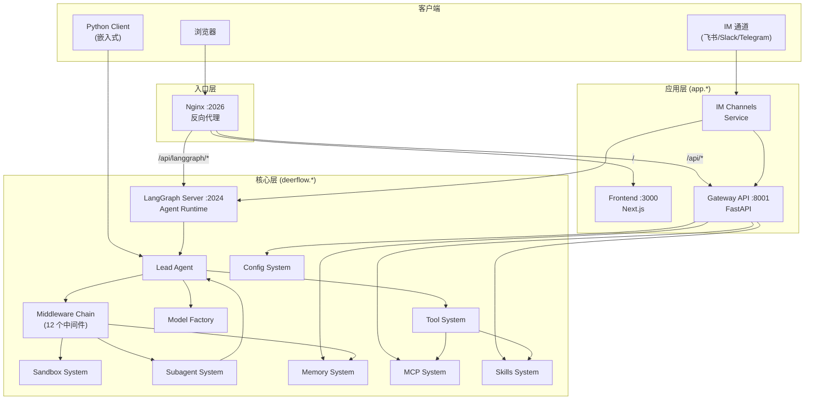
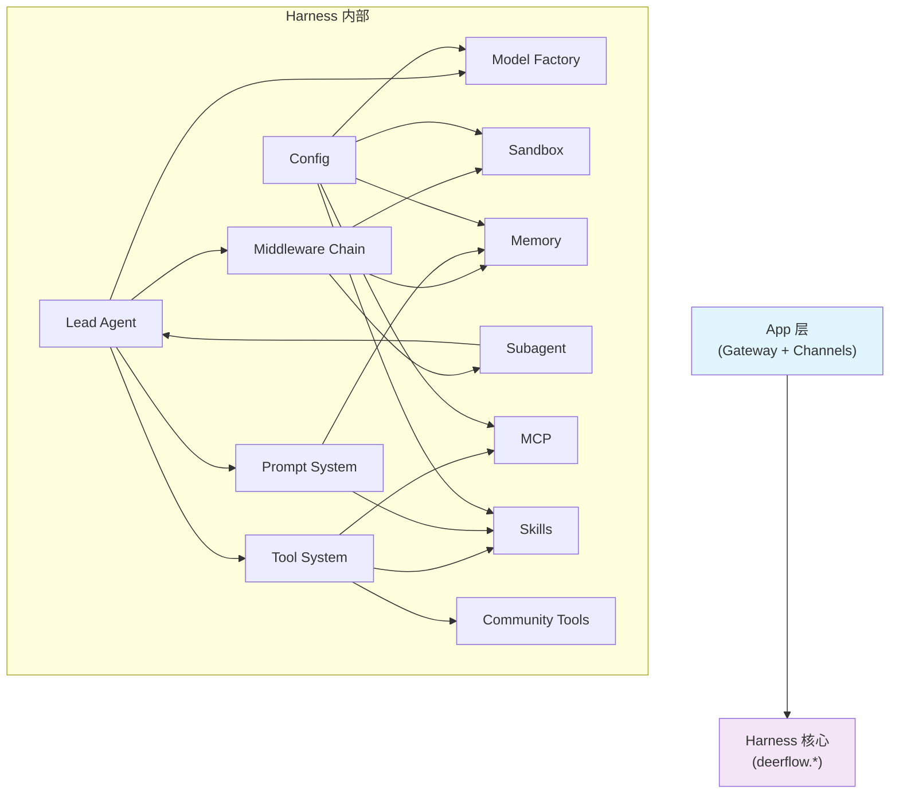
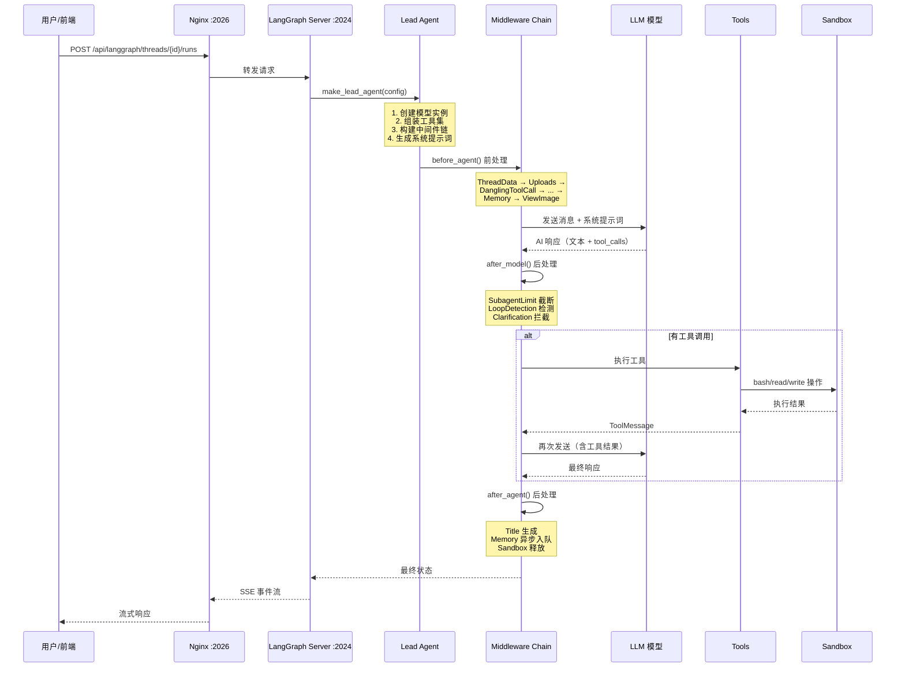
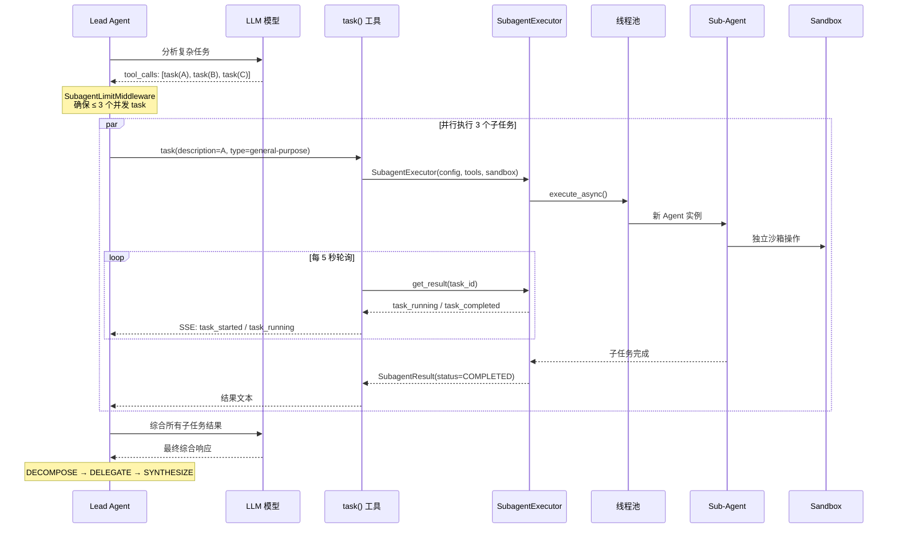

# deer-flow 源码学习笔记

> 仓库地址：[deer-flow](https://github.com/bytedance/deer-flow)
> 学习日期：2026-03-22

---

> **以下为 AI 源码分析**
>
> ### 一句话概括
>
> DeerFlow 是字节跳动开源的基于 LangGraph 的超级 Agent 编排框架，通过 Sub-Agent 委派、沙箱执行、长期记忆和可扩展 Skill 系统，让 AI Agent 能真正"做事"。
>
> ### 要点速览
>
> | 模块 | 职责 | 关键文件 |
> |------|------|---------|
> | Lead Agent | Agent 主入口，模型选择、工具装配、中间件编排 | `agents/lead_agent/agent.py` |
> | Middleware Chain | 12 个中间件按顺序处理请求/响应生命周期 | `agents/middlewares/` |
> | Sandbox | 隔离执行环境，虚拟路径映射 | `sandbox/tools.py`, `sandbox/local/` |
> | Subagent | 子 Agent 后台委派和并发控制 | `subagents/executor.py` |
> | Memory | 分层长期记忆，去抖动异步更新 | `agents/memory/` |
> | MCP | 多服务器工具集成，OAuth 支持 | `mcp/` |
> | Skills | 插件化技能加载，Markdown 定义 | `skills/` |
> | Gateway API | REST API 层（FastAPI） | `app/gateway/` |
> | Frontend | Next.js Web 界面 | `frontend/src/` |
> | IM Channels | 飞书/Slack/Telegram 集成 | `app/channels/` |

---

## 项目简介

DeerFlow（**D**eep **E**xploration and **E**fficient **R**esearch **Flow**）是字节跳动开源的 AI 超级 Agent 编排平台。它从 v1 的 Deep Research 框架完全重写为 v2，定位不再是一个简单的研究工具，而是一个**超级 Agent 运行时**——内置文件系统、记忆、技能、沙箱执行环境，并支持规划和生成子 Agent 来处理复杂的多步骤任务。

核心价值：将 LLM 从"聊天机器人"升级为"拥有完整执行环境的 Agent"，让 AI 不仅能思考，还能通过沙箱执行代码、管理文件、调用外部工具来完成实际工作。

## 技术栈

| 类别 | 技术 |
|------|------|
| 语言 | Python 3.12+, TypeScript |
| 框架 | LangGraph + LangChain（后端），Next.js 16（前端） |
| 构建工具 | Makefile, Docker Compose |
| 依赖管理 | uv（Python），pnpm（Node.js） |
| 测试框架 | pytest（后端），ESLint + TypeScript（前端） |
| API 框架 | FastAPI（Gateway），LangGraph Server（Agent） |
| UI 组件库 | Radix UI + Tailwind CSS 4 + shadcn/ui |
| 反向代理 | Nginx |

## 目录结构

```
deer-flow/
├── Makefile                      # 统一命令入口（dev, install, check, stop）
├── config.example.yaml           # 主配置模板（模型、工具、沙箱、记忆等）
├── extensions_config.example.json # MCP 服务器 + Skills 配置模板
├── backend/                      # 后端应用
│   ├── packages/harness/         # deerflow-harness 核心包
│   │   └── deerflow/
│   │       ├── agents/           # Agent 系统
│   │       │   ├── lead_agent/   #   Lead Agent 工厂 + 系统提示词
│   │       │   ├── middlewares/  #   12 个中间件组件
│   │       │   └── memory/       #   长期记忆（updater, queue, prompt）
│   │       ├── sandbox/          # 沙箱执行系统
│   │       │   ├── local/        #   本地沙箱实现
│   │       │   └── tools.py      #   bash/ls/read/write/str_replace 工具
│   │       ├── subagents/        # 子 Agent 委派系统
│   │       │   ├── executor.py   #   后台执行引擎（双线程池）
│   │       │   ├── registry.py   #   Agent 注册表
│   │       │   └── builtins/     #   内置 Agent（general-purpose, bash）
│   │       ├── tools/            # 工具组装（get_available_tools）
│   │       ├── mcp/              # MCP 多服务器集成 + OAuth
│   │       ├── skills/           # 技能发现、加载、解析
│   │       ├── models/           # 模型工厂（动态加载 LangChain 模型）
│   │       ├── config/           # 配置系统（YAML + JSON）
│   │       ├── community/        # 社区工具（Tavily, Jina, Firecrawl 等）
│   │       ├── reflection/       # 动态模块加载
│   │       └── client.py         # 嵌入式 Python 客户端
│   ├── app/                      # 应用层
│   │   ├── gateway/              #   FastAPI Gateway API（8001 端口）
│   │   │   └── routers/          #     7 个路由模块
│   │   └── channels/             #   IM 通道集成（飞书/Slack/Telegram）
│   ├── tests/                    # 测试套件（40+ 测试文件）
│   └── docs/                     # 后端文档
├── frontend/                     # Next.js 前端
│   └── src/
│       ├── app/                  #   App Router 路由
│       ├── core/                 #   核心业务逻辑（agents, memory, mcp 等）
│       ├── components/           #   React 组件（100+ 组件）
│       ├── hooks/                #   自定义 Hooks
│       └── lib/                  #   工具函数
├── skills/                       # Agent 技能目录
│   ├── public/                   #   内置技能（research, report, slide 等）
│   └── custom/                   #   自定义技能（gitignored）
├── docker/                       # Docker 相关
│   ├── docker-compose.yaml       #   生产环境编排
│   ├── docker-compose-dev.yaml   #   开发环境编排
│   └── nginx/                    #   Nginx 反向代理配置
└── scripts/                      # 辅助脚本
```

## 架构设计

### 整体架构

DeerFlow 采用**三层架构 + 反向代理统一入口**的设计：

- **Nginx**（端口 2026）作为统一入口，路由分发请求
- **Frontend**（端口 3000）提供 Web UI
- **Gateway API**（端口 8001）提供 REST API（模型管理、技能管理、记忆、文件上传等）
- **LangGraph Server**（端口 2024）运行 Agent 工作流

后端内部严格分为两层：
- **Harness**（`deerflow.*`）：可发布的 Agent 框架包，包含所有核心逻辑
- **App**（`app.*`）：应用层代码，包含 Gateway API 和 IM 通道

依赖方向：App → Harness（单向，由 `test_harness_boundary.py` 在 CI 中强制保障）。



### 核心模块

#### 1. Lead Agent（Agent 主入口）

**职责**：创建和配置主 Agent 实例，组装模型、工具、中间件和系统提示词。

**核心文件**：
- `agents/lead_agent/agent.py` — `make_lead_agent(config)` 工厂函数
- `agents/lead_agent/prompt.py` — `apply_prompt_template()` 系统提示词生成

**关键流程**：
1. 从 `RunnableConfig.configurable` 提取运行时参数（model_name, thinking_enabled, subagent_enabled 等）
2. `create_chat_model()` 创建 LLM 实例
3. `get_available_tools()` 组装工具集（配置工具 + 内置工具 + MCP 工具）
4. `_build_middlewares()` 构建 12 个中间件链
5. `apply_prompt_template()` 生成系统提示词（注入技能、记忆、子 Agent 指导）

#### 2. Middleware Chain（中间件链）

**职责**：以责任链模式处理 Agent 请求/响应的各个关注点。

**执行顺序**（严格有序）：

| # | 中间件 | 职责 | 可选 |
|---|--------|------|------|
| 1 | ThreadDataMiddleware | 创建线程工作目录 | 否 |
| 2 | UploadsMiddleware | 注入上传文件信息 | 否 |
| 3 | DanglingToolCallMiddleware | 补充中断的 ToolMessage | 否 |
| 4 | ToolErrorHandlingMiddleware | 工具异常处理 | 否 |
| 5 | SummarizationMiddleware | 上下文压缩（接近 token 限制时） | 是 |
| 6 | TodoMiddleware | 任务列表跟踪（计划模式） | 是 |
| 7 | TitleMiddleware | 自动生成对话标题 | 否 |
| 8 | MemoryMiddleware | 异步更新长期记忆 | 否 |
| 9 | ViewImageMiddleware | 注入图像 Base64 数据（视觉模型） | 是 |
| 10 | DeferredToolFilterMiddleware | 延迟工具过滤（tool_search 模式） | 是 |
| 11 | SubagentLimitMiddleware | 截断超限 task 调用 | 是 |
| 12 | LoopDetectionMiddleware | 检测重复工具调用循环 | 否 |
| 13 | ClarificationMiddleware | 拦截澄清请求并中断（**必须最后**） | 否 |

#### 3. Sandbox System（沙箱系统）

**职责**：提供隔离的代码执行环境和文件系统。

**核心文件**：
- `sandbox/sandbox.py` — `Sandbox` 抽象接口（execute_command, read_file, write_file, list_dir）
- `sandbox/local/local_sandbox.py` — `LocalSandbox` 本地实现
- `sandbox/local/local_sandbox_provider.py` — `LocalSandboxProvider` 单例 Provider
- `sandbox/tools.py` — 沙箱工具（bash, ls, read_file, write_file, str_replace）+ 虚拟路径系统

**虚拟路径映射**（Agent 看到的 vs 实际路径）：
```
/mnt/user-data/workspace  →  backend/.deer-flow/threads/{thread_id}/user-data/workspace/
/mnt/user-data/uploads    →  backend/.deer-flow/threads/{thread_id}/user-data/uploads/
/mnt/user-data/outputs    →  backend/.deer-flow/threads/{thread_id}/user-data/outputs/
/mnt/skills               →  deer-flow/skills/
```

**安全机制**：`validate_local_tool_path()` 限制路径范围，`validate_local_bash_command_paths()` 检查命令中的路径，防止路径遍历攻击。

#### 4. Subagent System（子 Agent 系统）

**职责**：将复杂任务分解为子任务，委派给专门的子 Agent 并行执行。

**核心文件**：
- `subagents/executor.py` — `SubagentExecutor` 后台执行引擎
- `subagents/registry.py` — Agent 注册表
- `subagents/builtins/general_purpose.py` — 通用 Agent（所有工具，50 回合，15 分钟超时）
- `subagents/builtins/bash_agent.py` — Bash 专用 Agent

**并发控制**：
- 双线程池：Scheduler（3 workers）+ Execution（3 workers）
- `MAX_CONCURRENT_SUBAGENTS = 3`，由 SubagentLimitMiddleware 在模型响应层截断
- 每个子任务 15 分钟超时

**执行流程**：`task()` 工具 → SubagentExecutor → 后台线程 → 每 5 秒轮询 → SSE 事件推送 → 结果综合

#### 5. Memory System（记忆系统）

**职责**：跨会话持久化用户上下文、历史和事实。

**核心文件**：
- `agents/memory/updater.py` — 记忆读写，原子性文件操作
- `agents/memory/queue.py` — 去抖动更新队列（30 秒默认延迟）
- `agents/memory/prompt.py` — 记忆更新和注入的提示模板

**分层存储结构**：
```json
{
  "user": {
    "workContext": "当前工作角色和项目",
    "personalContext": "语言偏好和沟通风格",
    "topOfMind": "当前关注的多个焦点"
  },
  "history": {
    "recentMonths": "最近 1-3 个月的活动",
    "earlierContext": "3-12 个月前的模式",
    "longTermBackground": "长期背景信息"
  },
  "facts": [
    {"id": "...", "content": "...", "category": "preference|knowledge|context|behavior|goal", "confidence": 0.9}
  ]
}
```

**工作流**：MemoryMiddleware 过滤消息 → 队列去抖动（30s）→ LLM 提取事实和上下文 → 原子写入 → 下次对话注入系统提示词

#### 6. MCP System（MCP 集成）

**职责**：集成外部 MCP 服务器提供的工具。

**核心文件**：
- `mcp/client.py` — MCP 客户端构建
- `mcp/tools.py` — 工具加载（基于 `langchain-mcp-adapters`）
- `mcp/oauth.py` — OAuth 令牌管理（client_credentials, refresh_token）

**特性**：支持 stdio/SSE/HTTP 三种传输，OAuth 自动令牌刷新，配置文件热加载。

#### 7. Skills System（技能系统）

**职责**：插件化技能管理，让 Agent 按需加载能力。

**核心文件**：
- `skills/loader.py` — 技能发现和加载
- `skills/parser.py` — SKILL.md 解析（YAML frontmatter + Markdown 内容）
- `skills/types.py` — Skill 数据模型

**设计**：技能是 Markdown 文件定义的工作流，渐进式加载（只在任务需要时注入），减少上下文窗口占用。

#### 8. Gateway API

**职责**：为前端和外部客户端提供 REST API。

**路由模块**：

| 路由 | 端点前缀 | 功能 |
|------|---------|------|
| Models | `/api/models` | 列出和查询模型 |
| MCP | `/api/mcp` | 获取/更新 MCP 配置 |
| Skills | `/api/skills` | 技能 CRUD + .skill 安装 |
| Memory | `/api/memory` | 记忆数据查询和重载 |
| Agents | `/api/agents` | 自定义 Agent CRUD + 用户档案 |
| Uploads | `/api/threads/{id}/uploads` | 文件上传（自动转换 PDF/PPT/Excel/Word） |
| Artifacts | `/api/threads/{id}/artifacts` | 工件文件服务 |
| Suggestions | `/api/threads/{id}/suggestions` | 后续问题建议生成 |

#### 9. IM Channels（IM 通道）

**职责**：将 DeerFlow 接入飞书、Slack、Telegram 等消息平台。

**架构**：Channel 抽象基类 → MessageBus 消息总线 → ChannelManager 分发 → LangGraph Server 处理

**消息流**：外部平台 → Channel 监听 → InboundMessage → MessageBus → ChannelManager → LangGraph → OutboundMessage → Channel 回复

### 模块依赖关系



## 核心流程

### 流程一：用户消息处理流程

这是 DeerFlow 最核心的请求处理链路，展示了从用户消息到 Agent 响应的完整流程。



### 流程二：子 Agent 委派流程

当 Lead Agent 遇到复杂任务时，会分解为子任务并委派给 Subagent 并行执行。



## 关键设计亮点

### 1. Harness / App 分层与依赖防火墙

**解决的问题**：防止应用层代码和核心框架代码的循环依赖，使核心包可独立发布。

**实现方式**：
- Harness（`deerflow.*`）是可发布的 Python 包，包含所有 Agent 核心逻辑
- App（`app.*`）是不发布的应用代码，包含 Gateway API 和 IM 通道
- `tests/test_harness_boundary.py` 在 CI 中扫描所有 Harness 文件，确保没有 `from app.*` 导入

**为什么这样设计**：允许 `deerflow-harness` 作为独立库嵌入其他应用（通过 `DeerFlowClient`），而不需要引入 FastAPI 或 IM 平台的依赖。

### 2. 12 层中间件责任链

**解决的问题**：Agent 生命周期中涉及 10+ 个横切关注点（上下文管理、记忆、安全、标题生成等），需要解耦和可组合。

**实现方式**：
- 每个中间件实现 `before_agent()`、`after_model()`、`after_agent()` 等钩子
- `_build_middlewares()` 根据运行时配置动态组装中间件链
- 执行顺序严格：基础中间件在前，ClarificationMiddleware 必须最后（因为它会中断执行流）
- 可选中间件通过 feature flag 控制（plan_mode, subagent_enabled, tool_search 等）

**为什么这样设计**：单一 Agent 函数无法干净地处理上传、记忆、标题、循环检测等不同关注点。中间件模式让每个关注点独立演进，且可按需组合。

### 3. 虚拟路径系统的安全隔离

**解决的问题**：Agent 需要读写文件，但不能暴露宿主机的真实文件路径，也不能访问权限之外的文件。

**实现方式**（`sandbox/tools.py`）：
- Agent 只看到虚拟路径（`/mnt/user-data/workspace/`、`/mnt/skills/`）
- `replace_virtual_path()` 将虚拟路径转为实际路径
- `mask_local_paths_in_output()` 将命令输出中的实际路径替换回虚拟路径
- `validate_local_tool_path()` 严格限制访问范围：只允许 `/mnt/user-data/*` 写入和 `/mnt/skills/*` 只读
- `validate_local_bash_command_paths()` 检查 bash 命令中引用的路径

**为什么这样设计**：无论使用本地沙箱还是 Docker 沙箱，Agent 看到的路径一致。同时通过多层验证防止路径遍历（`..`）攻击。

### 4. 记忆系统的去抖动批处理

**解决的问题**：每次对话都触发 LLM 提取记忆太昂贵，且频繁的文件 I/O 影响性能。

**实现方式**（`agents/memory/`）：
- `MemoryMiddleware` 过滤消息（只保留用户 + 最终 AI 消息，去掉中间 ToolMessage）
- `MemoryUpdateQueue` 使用 `threading.Timer` 实现可配置的去抖动（默认 30 秒）
- 同一线程的多次更新被替换（保留最新），多个线程的更新被批处理
- 写入使用临时文件 + 原子替换（`os.rename`），避免写入中途崩溃导致数据损坏
- 事实去重：写入前进行 whitespace-normalized 比较，跳过重复内容

**为什么这样设计**：将"每次对话立即更新"转变为"收集一段时间后批量处理"，显著降低 LLM 调用次数和文件 I/O 频率，同时保证数据安全。

### 5. 子 Agent 的双线程池 + 流式轮询

**解决的问题**：子 Agent 执行时间可能很长（几分钟），Lead Agent 不能阻塞等待，需要并行执行和实时状态反馈。

**实现方式**（`subagents/executor.py` + `tools/builtins/task_tool.py`）：
- Scheduler 线程池（3 workers）负责任务调度
- Execution 线程池（3 workers）负责实际执行
- `execute_async()` 在后台线程中运行子 Agent
- `task_tool()` 每 5 秒通过 `get_stream_writer()` 发送 SSE 事件（`task_started`, `task_running`, `task_completed`）
- `SubagentLimitMiddleware` 在模型响应层直接截断超过 `MAX_CONCURRENT_SUBAGENTS` 的 task 调用
- 每个子 Agent 有独立的上下文和工具集，不能嵌套委派（`disallowed_tools = ["task"]`）

**为什么这样设计**：双线程池分离调度和执行，避免调度线程被长时间运行的 Agent 阻塞。流式轮询让前端实时看到子任务进度，而不是等待所有子任务完成后才收到响应。
