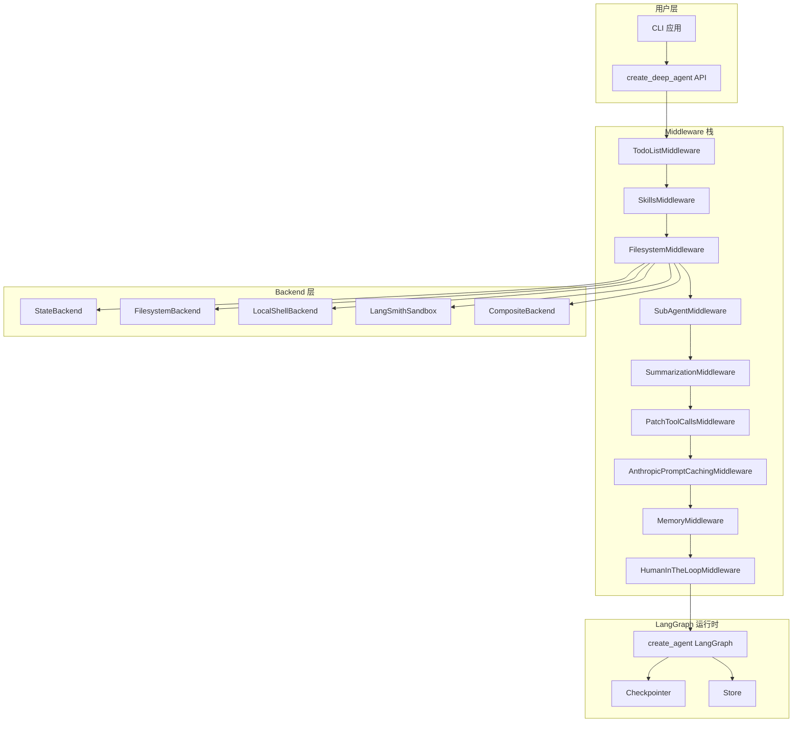
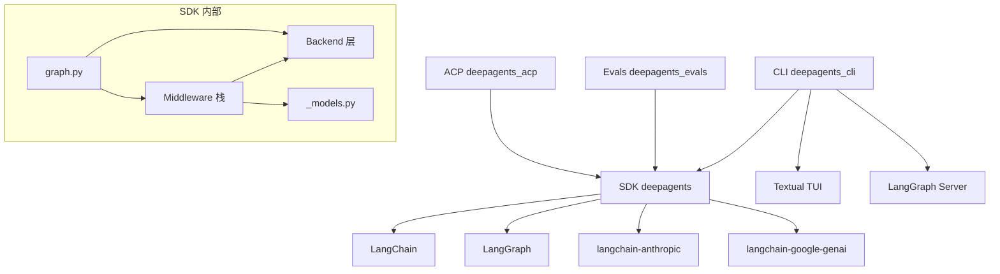
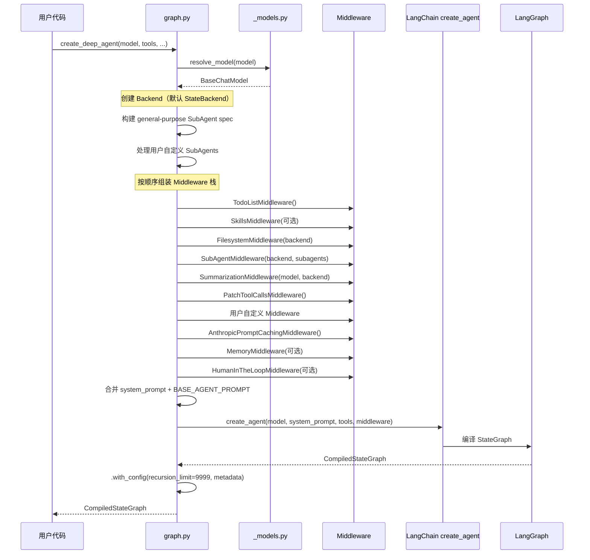
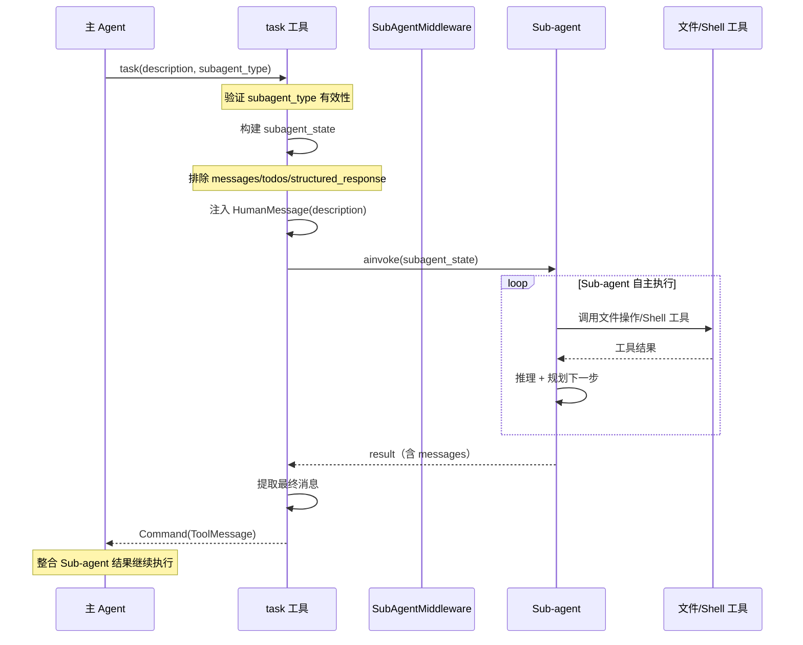

# deepagents 源码学习笔记

> 仓库地址：[deepagents](https://github.com/langchain-ai/deepagents)
> 学习日期：2026-04-05

---

> **以下为 AI 源码分析**
>
> ### 一句话概括
>
> Deep Agents 是 LangChain 团队推出的"开箱即用"的 Agent 框架（Harness），基于 LangGraph 构建，内置 Planning、文件系统、Shell 执行、Sub-agent 派生和自动 Context 管理等能力，让开发者一行代码即可创建功能完备的 AI Agent。
>
> ### 要点速览
>
> | 核心模块 | 职责 | 关键文件 |
> |----------|------|----------|
> | SDK (`libs/deepagents`) | 核心 Agent 创建与 Middleware 栈 | `graph.py`, `middleware/`, `backends/` |
> | CLI (`libs/cli`) | 终端交互式 Agent 应用 | `main.py`, `app.py`, `agent.py` |
> | Backends | 可插拔的文件存储和 Shell 执行层 | `backends/protocol.py`, `state.py`, `filesystem.py` |
> | Middleware | Agent 行为扩展的中间件链 | `subagents.py`, `filesystem.py`, `summarization.py` |
> | ACP (`libs/acp`) | Agent Context Protocol 支持 | `libs/acp/` |
> | Evals (`libs/evals`) | 评估套件与 Harbor 集成 | `libs/evals/` |

---

## 项目简介

Deep Agents 是一个 **Agent Harness**（Agent 运行框架），核心理念是 **"batteries-included"**——提供一个开箱即用、功能完备的通用 Agent，而非要求开发者自行组装 prompt、tools 和 context 管理。它由 LangChain 团队开发，灵感来自 Claude Code，目标是让这种通用 Agent 能力更加开放和可定制。

项目的核心价值：
- **零配置启动**：`create_deep_agent()` 一行代码即可获得具备 Planning、文件操作、Shell 执行、Sub-agent 派生能力的完整 Agent
- **高度可定制**：支持替换 Model、添加 Tools、自定义 Middleware、配置 Sub-agents
- **LangGraph 原生**：返回编译后的 LangGraph Graph，天然支持 streaming、checkpointing、持久化
- **多 LLM 提供商**：通过 `provider:model` 格式支持 Anthropic、OpenAI、Google、Ollama 等 20+ 模型提供商
- **100% 开源**：MIT 许可证

## 技术栈

| 类别 | 技术 |
|------|------|
| 语言 | Python 3.11+ |
| 框架 | LangChain + LangGraph |
| 构建工具 | setuptools / hatchling |
| 依赖管理 | uv |
| 测试框架 | pytest |
| Lint / Format | ruff |
| 类型检查 | ty |
| CLI UI | Textual + Rich |

## 目录结构

```
deepagents/
├── libs/
│   ├── deepagents/                # 核心 SDK 包
│   │   ├── deepagents/
│   │   │   ├── graph.py           # create_deep_agent() 入口
│   │   │   ├── _models.py         # Model 解析与适配
│   │   │   ├── backends/          # 可插拔存储/执行后端
│   │   │   │   ├── protocol.py    # BackendProtocol 抽象定义
│   │   │   │   ├── state.py       # StateBackend（LangGraph 状态存储）
│   │   │   │   ├── filesystem.py  # FilesystemBackend（真实文件系统）
│   │   │   │   ├── local_shell.py # LocalShellBackend（本地命令执行）
│   │   │   │   ├── langsmith.py   # LangSmith 沙箱集成
│   │   │   │   ├── composite.py   # 组合后端
│   │   │   │   └── store.py       # LangGraph Store 后端
│   │   │   └── middleware/        # Agent 中间件
│   │   │       ├── filesystem.py  # 文件操作工具注入
│   │   │       ├── subagents.py   # Sub-agent 派生（task 工具）
│   │   │       ├── async_subagents.py  # 异步远程 Sub-agent
│   │   │       ├── summarization.py    # 上下文自动摘要
│   │   │       ├── memory.py      # AGENTS.md 记忆加载
│   │   │       ├── skills.py      # Skill 渐进式加载
│   │   │       └── patch_tool_calls.py # Tool Call 修补
│   │   └── pyproject.toml
│   ├── cli/                       # CLI 终端应用
│   │   ├── deepagents_cli/
│   │   │   ├── main.py            # CLI 入口与参数解析
│   │   │   ├── app.py             # Textual TUI 应用主体
│   │   │   ├── agent.py           # Agent 创建与配置
│   │   │   ├── config.py          # 设置管理
│   │   │   ├── widgets/           # UI 组件
│   │   │   ├── skills/            # Skill 管理
│   │   │   └── integrations/      # 沙箱集成
│   │   └── pyproject.toml
│   ├── acp/                       # Agent Context Protocol
│   ├── evals/                     # 评估与基准测试
│   └── partners/                  # 第三方集成（Daytona, Modal 等）
├── examples/                      # 示例项目
├── AGENTS.md                      # 开发指南
└── README.md
```

## 架构设计

### 整体架构

Deep Agents 采用 **分层 + Middleware 链式组合** 的架构模式。核心思想是：通过一个标准化的 Middleware 栈逐步为 LangGraph Agent 注入功能（Planning、文件操作、Sub-agent、Context 管理等），同时通过抽象的 Backend 接口实现存储和执行层的可插拔。



### 核心模块

#### 1. Graph 模块 — Agent 构建入口

**职责**：组装 Middleware 栈、配置 Model、创建编译后的 LangGraph Graph

**核心文件**：`libs/deepagents/deepagents/graph.py`

**关键函数**：
- `create_deep_agent()` — 项目的核心 API，接收 model、tools、middleware、subagents 等参数，按固定顺序组装 Middleware 栈，最终调用 LangChain 的 `create_agent()` 创建编译后的 LangGraph StateGraph
- `get_default_model()` — 返回默认的 `ChatAnthropic(model_name="claude-sonnet-4-6")`

**Middleware 栈顺序**（从内到外）：
1. `TodoListMiddleware` — 任务规划（write_todos 工具）
2. `SkillsMiddleware` — Skill 渐进式加载（可选）
3. `FilesystemMiddleware` — 文件操作工具（ls、read_file、write_file、edit_file、glob、grep）
4. `SubAgentMiddleware` — Sub-agent 派生（task 工具）
5. `SummarizationMiddleware` — 对话自动摘要/压缩
6. `PatchToolCallsMiddleware` — Tool Call 修补
7. 用户自定义 Middleware
8. `AnthropicPromptCachingMiddleware` — Anthropic Prompt 缓存
9. `MemoryMiddleware` — AGENTS.md 记忆（可选）
10. `HumanInTheLoopMiddleware` — 人工审批（可选）

#### 2. Backend 模块 — 可插拔存储/执行层

**职责**：提供统一的文件操作（ls、read、write、edit、grep、glob）和命令执行（execute）接口

**核心文件**：
- `backends/protocol.py` — 定义 `BackendProtocol` 和 `SandboxBackendProtocol` 抽象基类
- `backends/state.py` — `StateBackend`，将文件存储在 LangGraph 状态中（短暂存储）
- `backends/filesystem.py` — `FilesystemBackend`，操作真实文件系统
- `backends/local_shell.py` — `LocalShellBackend`，本地 Shell 命令执行
- `backends/composite.py` — `CompositeBackend`，组合多个后端

**关键接口**：
- `BackendProtocol` — 定义 `ls()`、`read()`、`write()`、`edit()`、`grep()`、`glob()` 以及对应的 async 版本
- `SandboxBackendProtocol` — 继承 `BackendProtocol`，额外提供 `execute()` 用于 Shell 命令执行
- 每个操作返回结构化的 Result 对象（`ReadResult`、`WriteResult`、`EditResult` 等）

#### 3. Middleware 模块 — Agent 行为扩展

**职责**：通过中间件模式为 Agent 注入工具和修改系统提示

**核心 Middleware**：

| Middleware | 注入的工具 | 系统提示修改 |
|-----------|-----------|-------------|
| `FilesystemMiddleware` | ls, read_file, write_file, edit_file, glob, grep, execute | 文件操作指引 |
| `SubAgentMiddleware` | task | Sub-agent 使用说明 |
| `SummarizationMiddleware` | compact_conversation | 上下文压缩策略 |
| `SkillsMiddleware` | 无（读取 SKILL.md） | 可用 Skill 列表 |
| `MemoryMiddleware` | 无（读取 AGENTS.md） | Agent 记忆内容 |
| `PatchToolCallsMiddleware` | 无 | 修补不合规的 Tool Call |

**Middleware 模式**：每个 Middleware 实现 `AgentMiddleware` 接口，可以：
- `before_agent()` — Agent 执行前加载状态（如 Skills、Memory）
- `wrap_model_call()` — 包装 LLM 调用，修改系统提示
- 注入 `tools` — 通过 `self.tools` 列表为 Agent 添加工具

#### 4. Sub-agent 系统

**职责**：支持主 Agent 派生隔离的子 Agent 来处理复杂任务

**三种 Sub-agent 类型**：
- `SubAgent` — 声明式同步 Sub-agent，由 `create_deep_agent` 自动编译
- `CompiledSubAgent` — 预编译的 Runnable Sub-agent
- `AsyncSubAgent` — 连接远程 Agent Protocol 服务器的异步 Sub-agent

**核心机制**：
- 通过 `task` 工具触发，主 Agent 指定 `subagent_type` 和 `description`
- 每个 Sub-agent 拥有独立的 Context 窗口，只返回最终结果给主 Agent
- 默认自动添加 `general-purpose` Sub-agent（继承主 Agent 的所有工具和 Middleware）
- 支持并行调用多个 Sub-agent

#### 5. CLI 应用

**职责**：提供终端交互式 Agent 体验（类似 Claude Code / Cursor）

**核心文件**：
- `main.py` — CLI 入口，参数解析，启动 Textual 或 headless 模式
- `app.py` — Textual TUI 应用主体，处理消息收发、slash 命令、流式渲染
- `agent.py` — Agent 创建，配置 `CompositeBackend`（FilesystemBackend + LocalShellBackend）
- `config.py` — 配置管理（`~/.deepagents/config.toml`）
- `widgets/` — UI 组件（消息展示、工具审批、模型选择等）

**CLI 架构特点**：
- Client-Server 架构：使用 LangGraph Server（InMem）管理 Agent 运行
- 延迟导入：主入口只导入最小依赖，重型包（LangGraph、LangChain）延迟加载以保证启动速度
- Slash 命令系统：通过 `command_registry.py` 管理命令元数据，`app.py` 处理命令逻辑

### 模块依赖关系



## 核心流程

### 流程一：Agent 创建与初始化

从 `create_deep_agent()` 调用到可运行 Agent 的完整构建过程。



### 流程二：Sub-agent 任务派发

主 Agent 通过 `task` 工具将独立任务委托给隔离的 Sub-agent 执行。



## 关键设计亮点

### 1. Middleware 栈式组合架构

**解决的问题**：如何在不修改核心 Agent 逻辑的前提下，灵活扩展 Agent 的工具和行为

**实现方式**：
- 每个功能（文件操作、Sub-agent、摘要等）封装为独立的 `AgentMiddleware`
- Middleware 可注入工具（`self.tools`）、修改系统提示（`wrap_model_call`）、加载状态（`before_agent`）
- `create_deep_agent()` 按固定顺序组装栈，用户可以在指定位置插入自定义 Middleware

**为什么这样设计**：避免了"上帝类"反模式，每个 Middleware 职责单一、可独立测试和复用。Middleware 顺序精心设计：例如 `AnthropicPromptCachingMiddleware` 放在 `MemoryMiddleware` 之前，确保 Memory 更新不会使 Prompt 缓存前缀失效。

### 2. Backend 抽象与可插拔存储

**解决的问题**：同一套 Agent 逻辑需要在不同环境运行——测试用内存存储、开发用本地文件系统、生产用远程沙箱

**实现方式**（`backends/protocol.py`）：
- `BackendProtocol` 定义统一的文件操作接口（ls / read / write / edit / grep / glob）
- `SandboxBackendProtocol` 扩展命令执行能力
- `StateBackend` — 存储在 LangGraph state 中，通过 `CONFIG_KEY_READ` / `CONFIG_KEY_SEND` 实现
- `FilesystemBackend` — 操作真实文件系统
- `CompositeBackend` — 组合多个 Backend（CLI 用 FilesystemBackend + LocalShellBackend）

**为什么这样设计**：使 SDK 和 CLI 可以使用完全不同的 Backend 而不改变上层逻辑。SDK 默认 `StateBackend`（无需文件系统），CLI 使用 `CompositeBackend`（真实文件+Shell）。

### 3. Sub-agent 隔离 Context 窗口

**解决的问题**：复杂多步骤任务会快速消耗 LLM 的 Context 窗口，且中间步骤的详细信息会干扰主 Agent 的判断

**实现方式**（`middleware/subagents.py`）：
- Sub-agent 通过 `task` 工具启动，获得全新的 messages 列表（仅含任务描述）
- 通过 `_EXCLUDED_STATE_KEYS` 过滤，Sub-agent 不继承主 Agent 的 messages / todos
- Sub-agent 执行完毕后，仅返回最终消息文本作为 `ToolMessage`
- 支持多个 Sub-agent 并行执行（LLM 在同一 turn 中多次调用 task 工具）

**为什么这样设计**：这是 Claude Code 的核心设计之一 — 通过隔离 Context 窗口，Sub-agent 可以进行深度研究和推理而不污染主线程，主 Agent 只需处理精炼后的结果。

### 4. 自动 Context 摘要与会话压缩

**解决的问题**：长对话会超出 LLM 的 Context 窗口限制

**实现方式**（`middleware/summarization.py`）：
- `SummarizationMiddleware` — 当 token 使用超过可配置阈值时，自动将旧消息摘要为精炼的摘要
- 被摘要的完整消息历史存储到 Backend（`/conversation_history/{thread_id}.md`）以便回溯
- 支持 `compact_conversation` 工具让 Agent 手动触发压缩
- 配置灵活：`trigger=("fraction", 0.85)` 表示使用 85% 容量时触发，`keep=("fraction", 0.10)` 表示保留 10% 的近期消息

**为什么这样设计**：与简单截断不同，LLM 生成的摘要保留了关键上下文信息。同时将完整历史持久化到文件，确保信息不会永久丢失。

### 5. Skills 渐进式加载机制

**解决的问题**：Agent 可能有大量可用 Skills，如果全部加载到系统提示会浪费 Context 窗口

**实现方式**（`middleware/skills.py`）：
- 启动时仅加载 Skill 的元数据（name + description），注入系统提示的 Skill 列表
- Agent 根据任务需要，主动读取 `SKILL.md` 获取完整指令（Progressive Disclosure）
- 支持多层 Source（base → user → project），后者覆盖前者（last one wins）
- Skill 格式遵循 [Agent Skills Specification](https://agentskills.io/specification)

**为什么这样设计**：受 Claude Code 的 skill 系统启发，渐进式加载避免了 Context 浪费，同时保持了 Agent 的能力可发现性。多层 Source 设计让 Skill 可以在不同层级（全局 → 用户 → 项目）进行覆盖和定制。
