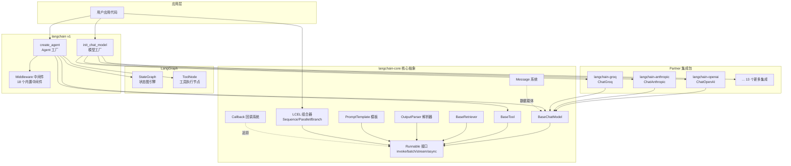
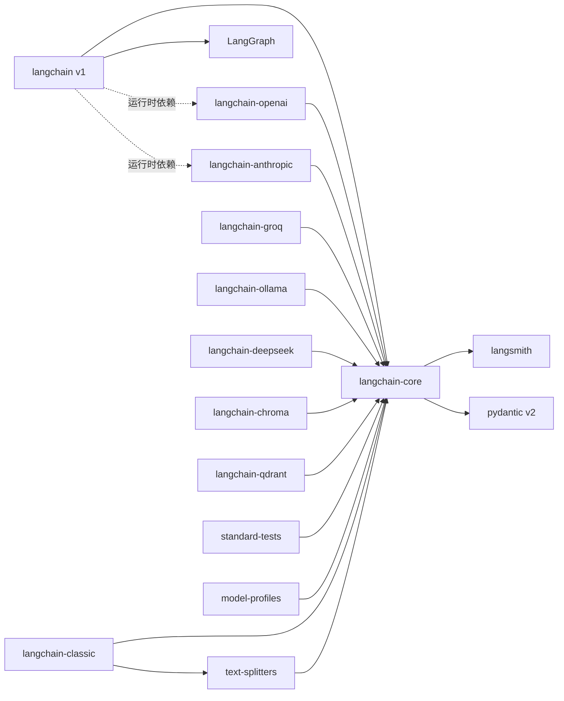
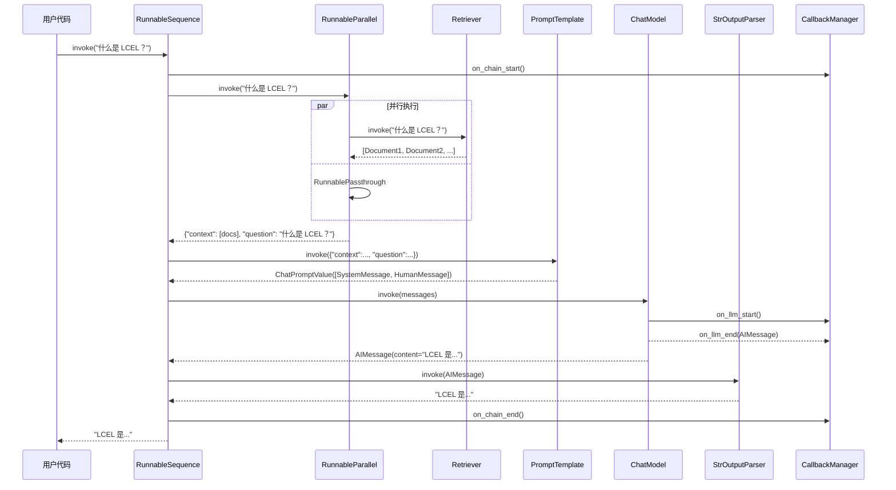
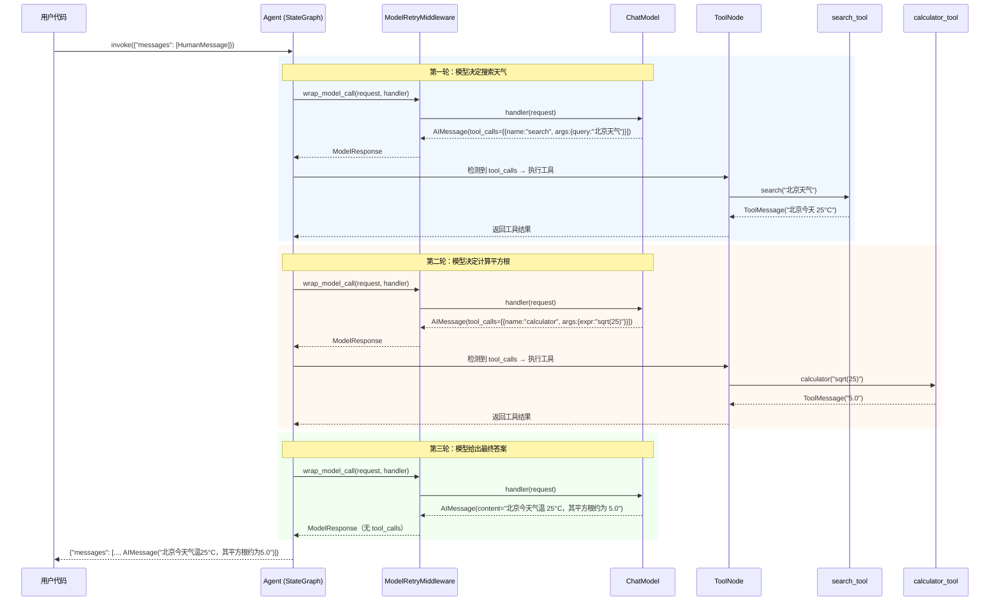

# langchain 源码学习笔记

> 仓库地址：[langchain](https://github.com/langchain-ai/langchain)
> 学习日期：2026-03-22

---

> **以下为 AI 源码分析**
>
> ### 一句话概括
>
> LangChain 是一个用于构建 LLM Agent 和 AI 应用的 Python 框架，通过统一的 Runnable 接口和 LCEL（LangChain Expression Language）实现模型、工具、提示词等组件的声明式组合与编排。
>
> ### 要点速览
>
> | 核心模块 | 职责 | 关键文件 |
> |---------|------|---------|
> | `langchain-core` | 定义所有抽象接口（Runnable、BaseChatModel、BaseTool 等）和 LCEL | `libs/core/langchain_core/` |
> | `langchain`（v1） | 基于 LangGraph 的 Agent 系统 + 中间件 + `init_chat_model` 统一入口 | `libs/langchain_v1/langchain/` |
> | `langchain-classic` | 传统 Chain/Agent 实现（兼容旧版本） | `libs/langchain/langchain_classic/` |
> | Partners（16 个） | 各 LLM 提供商集成（OpenAI、Anthropic、Groq 等） | `libs/partners/` |
> | `text-splitters` | 多策略文本分割器 | `libs/text-splitters/` |
> | `standard-tests` | 集成测试标准化套件 | `libs/standard-tests/` |
> | `model-profiles` | 模型能力档案（token 限制、功能支持等） | `libs/model-profiles/` |

---

## 项目简介

LangChain 是一个面向 LLM 应用开发的 **Agent 工程平台**。它的核心价值在于：通过一套统一的抽象接口（Runnable），让开发者能够以声明式的方式组合 LLM 模型、工具、提示词模板、输出解析器等组件，快速构建从简单的 LLM 调用到复杂的多步骤 Agent 工作流的各种 AI 应用。项目采用 monorepo 结构，核心包 `langchain-core` 仅定义抽象、不包含任何第三方集成，各模型提供商通过独立的 partner 包实现适配，最新的 v1 版本深度集成了 LangGraph 以实现基于图的 Agent 编排。

## 技术栈

| 类别 | 技术 |
|------|------|
| 语言 | Python 3.10+ |
| 框架 | Pydantic v2（数据验证）、LangGraph（Agent 编排） |
| 构建工具 | Hatchling |
| 依赖管理 | uv / pip |
| 测试框架 | pytest（+ pytest-asyncio, pytest-xdist, syrupy） |

## 目录结构

```
langchain/
├── libs/                              # 所有包的 monorepo 根目录
│   ├── core/                          # langchain-core：核心抽象层
│   │   └── langchain_core/
│   │       ├── runnables/             #   LCEL 核心：Runnable 基类及组合器
│   │       ├── language_models/       #   语言模型基类（BaseChatModel, BaseLLM）
│   │       ├── messages/              #   消息类型系统（AI/Human/System/Tool Message）
│   │       ├── callbacks/             #   回调/追踪系统
│   │       ├── tools/                 #   工具基类（BaseTool）
│   │       ├── output_parsers/        #   输出解析器
│   │       ├── prompts/               #   提示词模板
│   │       ├── load/                  #   序列化/反序列化
│   │       ├── retrievers.py          #   检索器基类
│   │       ├── documents/             #   Document 数据结构
│   │       ├── embeddings/            #   Embedding 基类
│   │       └── tracers/               #   LangSmith 追踪集成
│   │
│   ├── langchain_v1/                  # langchain v1：最新 Agent 框架
│   │   └── langchain/
│   │       ├── chat_models/           #   init_chat_model 工厂（27 个提供商）
│   │       ├── agents/                #   Agent 系统核心
│   │       │   ├── factory.py         #     create_agent 图构建
│   │       │   ├── structured_output.py #   结构化输出策略
│   │       │   └── middleware/        #     18 个内置中间件
│   │       ├── tools/                 #   工具节点（基于 LangGraph）
│   │       └── embeddings/            #   init_embeddings 工厂
│   │
│   ├── langchain/                     # langchain-classic：传统 Chain 实现
│   │   └── langchain_classic/
│   │
│   ├── partners/                      # 16 个 LLM 提供商集成包
│   │   ├── openai/                    #   ChatOpenAI, OpenAIEmbeddings
│   │   ├── anthropic/                 #   ChatAnthropic
│   │   ├── groq/                      #   ChatGroq
│   │   ├── mistralai/                 #   ChatMistralAI
│   │   ├── ollama/                    #   ChatOllama
│   │   ├── deepseek/                  #   ChatDeepSeek
│   │   ├── huggingface/               #   ChatHuggingFace
│   │   ├── fireworks/                 #   ChatFireworks
│   │   ├── xai/                       #   ChatXAI
│   │   ├── perplexity/                #   ChatPerplexity
│   │   ├── openrouter/                #   ChatOpenRouter
│   │   ├── chroma/                    #   Chroma 向量数据库
│   │   ├── qdrant/                    #   Qdrant 向量数据库
│   │   ├── exa/                       #   Exa 搜索
│   │   └── nomic/                     #   Nomic Embeddings
│   │
│   ├── text-splitters/                # 文本分割器
│   │   └── langchain_text_splitters/
│   │
│   ├── standard-tests/                # 集成测试标准套件
│   └── model-profiles/                # 模型能力档案
│
├── CLAUDE.md / AGENTS.md              # AI 编码辅助配置
└── .github/                           # CI/CD 工作流
```

## 架构设计

### 整体架构

LangChain 采用**分层解耦**的架构设计。最底层是 `langchain-core`，定义了所有抽象接口但不包含任何具体实现；中间层是各 partner 集成包，实现具体的模型/工具适配；最上层是 `langchain` v1，基于 LangGraph 提供 Agent 编排能力。整个架构的核心是 **Runnable 接口**——所有组件（模型、工具、解析器、提示词模板）都实现这个统一接口，通过 `|` 和 `{}` 操作符进行声明式组合。



### 核心模块

#### 1. Runnable 体系（LCEL 核心）

**职责**：定义统一的组件执行接口和声明式组合语法

**核心文件**：
- `libs/core/langchain_core/runnables/base.py`（6261 行）— Runnable 基类、RunnableSequence、RunnableParallel、RunnableLambda
- `libs/core/langchain_core/runnables/config.py` — RunnableConfig 运行时配置
- `libs/core/langchain_core/runnables/branch.py` — RunnableBranch 条件分支
- `libs/core/langchain_core/runnables/fallbacks.py` — RunnableWithFallbacks 容错
- `libs/core/langchain_core/runnables/passthrough.py` — RunnablePassthrough/Assign/Pick

**关键接口**：

```python
class Runnable(ABC, Generic[Input, Output]):
    def invoke(input, config) -> Output          # 同步单次执行
    async def ainvoke(input, config) -> Output   # 异步单次执行
    def batch(inputs, config) -> list[Output]    # 批处理
    def stream(input, config) -> Iterator[Output] # 流式输出
    async def astream(input, config) -> AsyncIterator[Output]

    def __or__(other) -> RunnableSequence        # | 管道操作符
    def with_retry() -> RunnableRetry             # 添加重试
    def with_fallbacks() -> RunnableWithFallbacks # 添加容错
```

**组合器**：
- `RunnableSequence`：通过 `|` 创建，顺序执行，前一个输出作为后一个输入
- `RunnableParallel`：通过 `{}` 创建，并发执行多个 Runnable，返回 dict
- `RunnableLambda`：将普通 Python 函数包装为 Runnable
- `RunnableBranch`：根据条件选择不同的执行路径

#### 2. 语言模型基类

**职责**：定义 LLM 和 Chat Model 的标准接口

**核心文件**：
- `libs/core/langchain_core/language_models/base.py` — `BaseLanguageModel`
- `libs/core/langchain_core/language_models/chat_models.py` — `BaseChatModel`
- `libs/core/langchain_core/language_models/llms.py` — `BaseLLM`

**关键类**：

```python
class BaseLanguageModel(RunnableSerializable, ABC):
    # Input: PromptValue | str | Sequence[Message]
    # Output: AIMessage | str
    cache, verbose, callbacks, tags, metadata

class BaseChatModel(BaseLanguageModel, ABC):
    def _generate(messages, stop, **kwargs) -> ChatResult  # 子类必须实现
    def _stream(messages, stop, **kwargs) -> Iterator       # 可选流式实现
    def bind_tools(tools) -> Runnable                       # 绑定工具
    def with_structured_output(schema) -> Runnable          # 结构化输出
```

#### 3. 消息系统

**职责**：定义 LLM 对话中各类消息的数据结构

**核心文件**：
- `libs/core/langchain_core/messages/base.py` — `BaseMessage`
- `libs/core/langchain_core/messages/ai.py` — `AIMessage`、`AIMessageChunk`
- `libs/core/langchain_core/messages/human.py` — `HumanMessage`
- `libs/core/langchain_core/messages/system.py` — `SystemMessage`
- `libs/core/langchain_core/messages/tool.py` — `ToolMessage`、`ToolCall`
- `libs/core/langchain_core/messages/content.py` — 多模态内容块定义

**消息类型层级**：

```
BaseMessage
├── AIMessage          # 模型输出（含 tool_calls、usage_metadata）
├── HumanMessage       # 用户输入
├── SystemMessage      # 系统提示
├── ToolMessage        # 工具调用结果
├── ChatMessage        # 通用消息（带 role 字段）
└── RemoveMessage      # 消息删除指令
```

`content` 字段支持多模态：`str` 或 `list[TextBlock | ImageBlock | AudioBlock | ...]`

#### 4. Agent 系统（v1）

**职责**：基于 LangGraph 构建可组合的 Agent 工作流

**核心文件**：
- `libs/langchain_v1/langchain/agents/factory.py`（1858 行）— `create_agent` 工厂
- `libs/langchain_v1/langchain/agents/structured_output.py` — 结构化输出策略
- `libs/langchain_v1/langchain/agents/middleware/types.py` — 中间件基类

**关键函数和类**：

```python
def create_agent(
    model, tools, system_prompt, middleware, response_format,
    checkpointer, store, ...
) -> CompiledStateGraph
```

Agent 本质是一个 LangGraph `StateGraph`，核心循环：
1. `model` 节点：调用 LLM
2. 条件边：检查是否有 `tool_calls`
3. `tools` 节点：并行执行工具调用
4. 返回步骤 1，直到模型不再请求工具

**18 个内置中间件**：ModelRetry、ToolCallLimit、HumanInTheLoop、PII、Summarization、ShellTool 等

#### 5. 回调系统

**职责**：为 LLM 调用、Chain 执行、工具调用等提供可观测性

**核心文件**：
- `libs/core/langchain_core/callbacks/base.py` — `BaseCallbackHandler`
- `libs/core/langchain_core/callbacks/manager.py` — `CallbackManager`/`AsyncCallbackManager`

**回调事件**：`on_llm_start/end/error`、`on_chain_start/end`、`on_tool_start/end`、`on_retriever_start/end`、`on_llm_new_token`（流式）

#### 6. Partner 集成

**职责**：为各 LLM 提供商实现 langchain-core 定义的接口

**标准化结构**（以 OpenAI 为例）：

```
langchain_openai/
├── chat_models/base.py    # ChatOpenAI(BaseChatModel) 实现 _generate/_stream
├── embeddings/base.py     # OpenAIEmbeddings 实现
├── middleware/             # 中间件（如 moderation）
└── data/_profiles.py      # 模型能力档案
```

**统一入口**：`init_chat_model("openai:gpt-4o")` 自动推断提供商并初始化

### 模块依赖关系



## 核心流程

### 流程一：LCEL Chain 执行流程

以一个典型的 RAG（检索增强生成）Chain 为例：

```python
chain = (
    {"context": retriever, "question": RunnablePassthrough()}
    | prompt_template
    | chat_model
    | StrOutputParser()
)
result = chain.invoke("什么是 LCEL？")
```



**流程说明**：
1. `RunnableSequence.invoke()` 被调用，触发 `on_chain_start` 回调
2. 第一步执行 `RunnableParallel`：并发执行 Retriever（检索相关文档）和 Passthrough（透传原始问题）
3. 结果合并为 dict：`{"context": [docs], "question": "..."}`
4. `PromptTemplate` 将 dict 格式化为消息列表
5. `ChatModel` 调用 LLM API 生成回复，期间触发 `on_llm_start/end` 回调
6. `StrOutputParser` 从 AIMessage 中提取文本内容
7. 最终返回纯文本结果

### 流程二：Agent 执行循环（v1）

```python
agent = create_agent(
    model="anthropic:claude-sonnet-4-20250514",
    tools=[search_tool, calculator_tool],
    middleware=[ModelRetryMiddleware(max_retries=2)],
)
result = agent.invoke({"messages": [HumanMessage("北京今天的天气温度的平方根是多少？")]})
```



**流程说明**：
1. `create_agent` 构建一个 LangGraph StateGraph，包含 `model` 和 `tools` 两个核心节点
2. 每次模型调用都经过中间件链（本例中 `ModelRetryMiddleware` 包裹调用）
3. 模型返回 `tool_calls` 时，条件边将执行路由到 `tools` 节点
4. `ToolNode` 并行执行所有工具调用，结果作为 `ToolMessage` 追加到状态
5. 循环回到 `model` 节点，模型看到工具结果后决定下一步
6. 当模型不再返回 `tool_calls` 时，条件边路由到 END，循环结束

## 关键设计亮点

### 1. Runnable 统一接口 + LCEL 声明式组合

**解决的问题**：LLM 应用中各组件（模型、工具、解析器、检索器）接口不统一，组合困难。

**实现方式**：所有组件继承 `Runnable[Input, Output]`，实现 `invoke/batch/stream/async` 四组方法。通过 Python 的 `__or__` 操作符重载，实现 `|` 管道语法创建 `RunnableSequence`，dict 字面量自动转为 `RunnableParallel`。

```python
# 声明式定义，一目了然
chain = prompt | model | parser
parallel = {"a": chain_a, "b": chain_b}
```

**为什么这样设计**：借鉴 Unix 管道哲学，让组件像乐高积木一样自由拼接。统一接口意味着任何组件都可以插入链的任何位置，且自动获得批处理、流式、异步能力。

**关键文件**：`libs/core/langchain_core/runnables/base.py`

### 2. 核心抽象与实现完全分离的 Monorepo

**解决的问题**：避免核心包依赖膨胀，让用户按需安装。

**实现方式**：`langchain-core` 仅包含抽象基类（`BaseChatModel`、`BaseTool`、`BaseRetriever` 等），不包含任何第三方 SDK 依赖。每个 LLM 提供商作为独立的 partner 包（如 `langchain-openai`），实现核心接口并管理自己的依赖。

**为什么这样设计**：用户只需安装核心包 + 实际使用的提供商包，避免装一个框架就引入几十个 SDK 的依赖地狱。同时各 partner 包可以独立版本迭代，不会因为一个提供商的 API 变更导致整个框架发版。

**关键文件**：`libs/core/pyproject.toml`（仅 8 个轻量依赖）、`libs/partners/*/pyproject.toml`

### 3. 基于 LangGraph 的中间件 Agent 架构（v1）

**解决的问题**：传统 ReAct Agent 缺乏细粒度控制（重试、限流、人工审批、上下文管理等）。

**实现方式**：Agent 本质是一个 LangGraph `StateGraph`，中间件通过 8 个生命周期钩子（`before_agent`、`before_model`、`wrap_model_call`、`after_model`、`wrap_tool_call`、`after_agent` 等）拦截执行流。中间件采用洋葱模型组合：`outer(middle(inner(base_handler)))`。

```python
agent = create_agent(
    model="openai:gpt-4o",
    tools=[...],
    middleware=[
        ModelRetryMiddleware(max_retries=2),
        ToolCallLimitMiddleware(max_calls=10),
        HumanInTheLoopMiddleware(),
    ],
)
```

**为什么这样设计**：中间件模式让横切关注点（重试、限流、审计）与业务逻辑解耦，用户可以像堆积木一样自由组合 18 个内置中间件，也能自定义中间件扩展。

**关键文件**：`libs/langchain_v1/langchain/agents/factory.py`、`libs/langchain_v1/langchain/agents/middleware/types.py`

### 4. 自适应结构化输出策略

**解决的问题**：不同 LLM 提供商对结构化输出的支持方式不同（有的支持原生 JSON Schema，有的只能通过 tool calling 模拟）。

**实现方式**：`AutoStrategy` 在运行时检查模型的 `model_profile`，如果模型原生支持结构化输出（如 OpenAI 的 `response_format`），使用 `ProviderStrategy`；否则降级到 `ToolStrategy`（通过定义一个虚拟工具来约束输出格式）。

```python
agent = create_agent(
    model="openai:gpt-4o",
    response_format=MySchema,  # 自动选择最优策略
)
```

**为什么这样设计**：对用户透明——只需声明期望的输出格式，框架自动选择当前模型支持的最优实现方式，模型切换时无需修改代码。

**关键文件**：`libs/langchain_v1/langchain/agents/structured_output.py`

### 5. 多模态消息内容块系统

**解决的问题**：现代 LLM 支持文本、图片、音频、视频、文件等多种输入，需要统一的消息表示。

**实现方式**：`BaseMessage.content` 字段支持两种类型：简单 `str` 或 `list[ContentBlock]`。ContentBlock 是一个类型联合，包含 `TextContentBlock`、`ImageContentBlock`、`AudioContentBlock`、`VideoContentBlock`、`ReasoningContentBlock` 等。同时通过 `block_translators/` 子目录实现不同提供商格式之间的自动转换（OpenAI 格式、Anthropic 格式、Google 格式等）。

**为什么这样设计**：统一的多模态消息表示让用户代码与具体提供商解耦——同一条消息可以无缝发送给不同的模型，框架自动处理格式转换。

**关键文件**：`libs/core/langchain_core/messages/content.py`、`libs/core/langchain_core/messages/block_translators/`
