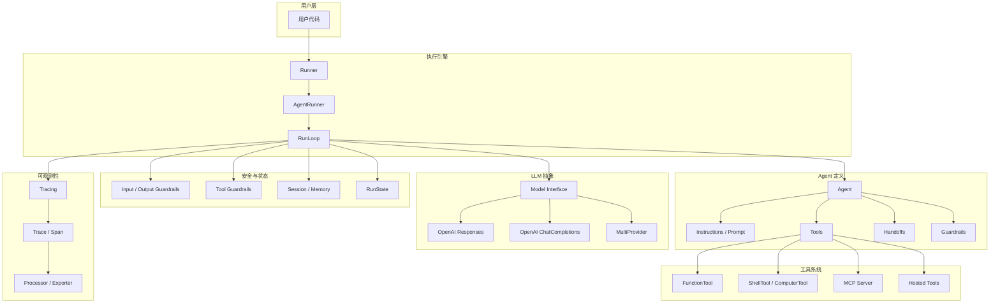
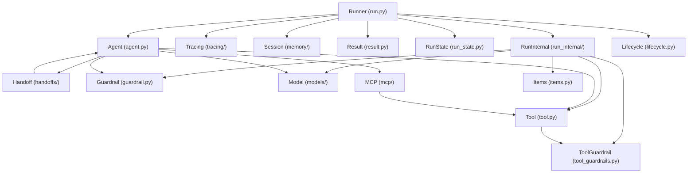
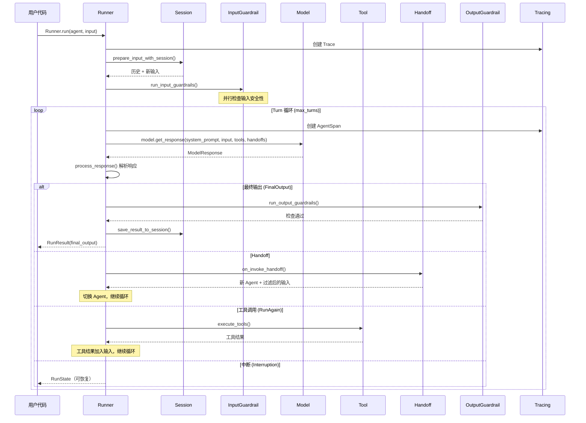
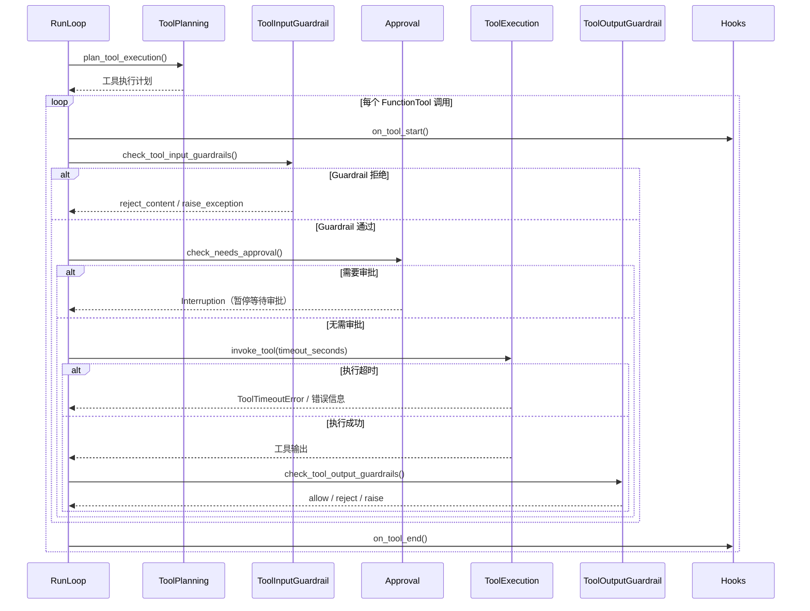

# openai-agents-python 源码学习笔记

> 仓库地址：[openai-agents-python](https://github.com/openai/openai-agents-python)
> 学习日期：2026-03-22

---

> **以下为 AI 源码分析**
>
> ### 一句话概括
>
> OpenAI 官方轻量级多 Agent 编排 SDK，基于异步 Python 实现 Agent 定义、工具调用、Handoff 委派、Guardrail 安全检查和 Tracing 可观测性的完整工作流。
>
> ### 要点速览
>
> | 核心模块 | 职责 | 关键文件 |
> |---------|------|---------|
> | Agent | 定义 Agent 的指令、工具、Handoff、Guardrail | `agent.py` |
> | Runner | Agent 执行循环引擎（同步/异步/流式） | `run.py`, `run_internal/run_loop.py` |
> | Tool | 多种工具类型抽象（函数/Shell/MCP/Hosted） | `tool.py` |
> | Handoff | Agent 间任务委派机制 | `handoffs/__init__.py` |
> | Guardrail | 输入/输出安全检查 | `guardrail.py`, `tool_guardrails.py` |
> | Model | LLM 提供商抽象层 | `models/interface.py` |
> | Tracing | Trace/Span 可观测性 | `tracing/` |
> | Session | 会话历史持久化 | `memory/session.py` |
> | MCP | Model Context Protocol 集成 | `mcp/server.py` |

---

## 项目简介

OpenAI Agents SDK 是 OpenAI 官方发布的 Python 多 Agent 工作流框架（v0.12.5）。它允许开发者通过声明式 API 定义 Agent（含 instructions、tools、guardrails、handoffs），并通过 `Runner` 执行引擎驱动 Agent 的 turn-based 循环。SDK 提供商无关（provider-agnostic），同时支持 OpenAI Responses API、Chat Completions API 以及通过 LiteLLM 对接 100+ LLM。核心价值在于将 Agent 编排中的工具调用、Agent 委派、安全检查、状态恢复、可观测性等关键能力统一封装为简洁的 Python API。

## 技术栈

| 类别 | 技术 |
|------|------|
| 语言 | Python 3.10+ |
| 框架 | 异步原生（asyncio），Pydantic 数据校验 |
| 构建工具 | Hatchling (PEP 517) |
| 依赖管理 | uv (workspace mode) |
| 测试框架 | pytest + pytest-asyncio + pytest-xdist |

## 目录结构

```
src/agents/
├── __init__.py              # 公开 API 导出（~500 行，导出所有核心类型）
├── agent.py                 # Agent / AgentBase 定义（instructions, tools, handoffs, guardrails）
├── run.py                   # Runner 类（run/run_sync/run_streamed）+ AgentRunner 引擎
├── run_config.py            # RunConfig 运行配置
├── run_context.py           # RunContextWrapper 上下文包装
├── run_state.py             # RunState 可序列化执行状态（中断恢复）
├── result.py                # RunResult / RunResultStreaming 执行结果
├── tool.py                  # Tool 类型层次（FunctionTool, ShellTool, ComputerTool 等）
├── tool_context.py          # ToolContext 工具执行上下文
├── guardrail.py             # InputGuardrail / OutputGuardrail
├── tool_guardrails.py       # ToolInputGuardrail / ToolOutputGuardrail
├── lifecycle.py             # RunHooks / AgentHooks 生命周期回调
├── items.py                 # RunItem 类型（MessageOutputItem, ToolCallItem 等）
├── model_settings.py        # ModelSettings（temperature, top_p 等）
├── prompts.py               # Prompt / DynamicPromptFunction
├── exceptions.py            # 异常层次结构
├── function_schema.py       # 函数签名 → JSON Schema 自动转换
├── strict_schema.py         # Strict JSON Schema 转换
├── stream_events.py         # 流式事件类型定义
├── retry.py                 # 重试策略（RetryPolicy, BackoffSettings）
├── usage.py                 # Token 用量统计
│
├── run_internal/            # Runner 内部实现
│   ├── run_loop.py          # 单 turn 执行循环
│   ├── run_steps.py         # NextStep 类型（FinalOutput/Handoff/RunAgain/Interruption）
│   ├── turn_resolution.py   # Turn 结果解析
│   ├── turn_preparation.py  # Turn 准备（system prompt, tools）
│   ├── tool_actions.py      # 工具执行编排
│   ├── tool_execution.py    # 工具具体执行
│   ├── tool_planning.py     # 工具执行计划
│   ├── streaming.py         # 流式响应处理
│   ├── guardrails.py        # Guardrail 运行逻辑
│   ├── approvals.py         # Tool approval 处理
│   ├── session_persistence.py # Session 持久化
│   └── tool_use_tracker.py  # 工具使用追踪
│
├── models/                  # LLM 提供商抽象
│   ├── interface.py         # Model / ModelProvider 抽象接口
│   ├── openai_responses.py  # OpenAI Responses API 实现
│   ├── openai_chatcompletions.py # Chat Completions API 实现
│   ├── openai_provider.py   # OpenAI 提供商
│   ├── multi_provider.py    # 多提供商路由
│   └── chatcmpl_converter.py # Chat Completions 格式转换
│
├── handoffs/                # Agent 委派
│   ├── __init__.py          # Handoff 类定义 + handoff() 工厂函数
│   └── history.py           # 对话历史处理
│
├── mcp/                     # Model Context Protocol 集成
│   ├── server.py            # MCPServer 抽象 + 多种传输实现
│   ├── manager.py           # MCPServerManager 生命周期管理
│   └── util.py              # MCP 工具转换工具
│
├── memory/                  # Session 会话管理
│   ├── session.py           # Session Protocol 定义
│   ├── sqlite_session.py    # SQLite 本地存储实现
│   ├── openai_conversations_session.py # OpenAI 托管对话
│   └── openai_responses_compaction_session.py # 支持历史压缩
│
├── tracing/                 # 可观测性系统
│   ├── traces.py            # Trace 实现（TraceImpl, NoOpTrace）
│   ├── spans.py             # Span 实现
│   ├── span_data.py         # Span 数据类型
│   ├── processors.py        # TracingProcessor + Exporter
│   ├── provider.py          # TracingProvider
│   └── context.py           # Trace 上下文管理
│
├── realtime/                # Realtime Voice Agent
├── voice/                   # Voice Pipeline
├── extensions/              # 扩展（可视化、HandoffPrompt 等）
└── util/                    # 通用工具
```

## 架构设计

### 整体架构

OpenAI Agents SDK 采用 **Turn-Based Agent Loop** 架构。`Runner` 作为核心调度器，驱动 Agent 的执行循环：每个 turn 中调用 LLM、解析响应、执行工具或 Handoff，直到产生最终输出或达到最大 turn 数。整个系统由六大模块组成：Agent 定义层、执行引擎层、工具系统、安全检查层、会话管理层和可观测性层。



### 核心模块

#### 1. Agent 模块

**职责**：定义 Agent 的完整配置，包括指令、模型、工具集、Handoff 列表、Guardrail 和输出类型。

**核心文件**：`agent.py`

**关键类**：
- `AgentBase` — 基类，提供 `name`, `tools`, `mcp_servers`, `mcp_config` 等通用属性，以及 `get_all_tools()` 方法聚合所有工具
- `Agent(AgentBase)` — 完整 Agent 定义，新增 `instructions`, `prompt`, `handoffs`, `model`, `model_settings`, `input_guardrails`, `output_guardrails`, `output_type`, `hooks`, `tool_use_behavior` 等字段
- `ToolsToFinalOutputResult` — 控制工具输出是否作为最终结果
- `StopAtTools` — 指定触发停止的工具名列表

**与其他模块的关系**：
- `Runner` 读取 Agent 配置驱动执行
- `tool.py` 定义 Agent 可用的工具类型
- `guardrail.py` 定义 Agent 的安全检查
- `handoffs/` 定义 Agent 间委派逻辑

#### 2. Runner 执行引擎

**职责**：驱动 Agent 的 turn-based 执行循环，管理 LLM 调用、工具执行、Handoff 切换、Guardrail 检查和状态恢复。

**核心文件**：`run.py`, `run_internal/run_loop.py`, `run_internal/run_steps.py`

**关键类/函数**：
- `Runner` — 公开 API，提供 `run()` (异步), `run_sync()` (同步), `run_streamed()` (流式) 三种执行模式
- `AgentRunner` — 内部实现引擎，支持 `_run_impl()` 和 `_run_streamed_impl()` 以及 `_run_resumed_impl()` 状态恢复
- `run_single_turn()` — 单 turn 执行：调用模型 → 处理响应 → 返回 NextStep
- `NextStepFinalOutput` / `NextStepHandoff` / `NextStepRunAgain` / `NextStepInterruption` — 四种 turn 结果类型

**与其他模块的关系**：
- 调用 `Model.get_response()` 获取 LLM 响应
- 调用 `run_input_guardrails()` / `run_output_guardrails()` 进行安全检查
- 通过 `run_internal/tool_actions.py` 执行工具
- 通过 `session_persistence.py` 管理会话持久化
- 通过 `tracing/` 记录执行轨迹

#### 3. Tool 系统

**职责**：提供多种工具类型的统一抽象，支持函数工具、Shell 工具、Computer 工具、MCP 工具和 OpenAI Hosted 工具。

**核心文件**：`tool.py`, `tool_context.py`, `function_schema.py`

**关键类**：
- `Tool` (Protocol) — 工具统一接口
- `FunctionTool` — 函数工具，包含 `name`, `description`, `params_json_schema`, `on_invoke_tool`, `is_enabled`, `needs_approval`, `timeout_seconds`, `tool_input_guardrails`, `tool_output_guardrails`
- `ShellTool` / `LocalShellTool` — Shell 命令执行
- `ComputerTool` — 计算机控制（屏幕、鼠标、键盘）
- `WebSearchTool` / `FileSearchTool` / `CodeInterpreterTool` / `ImageGenerationTool` — OpenAI Hosted 工具
- `HostedMCPTool` — 托管 MCP 工具
- `ApplyPatchTool` — 代码补丁应用
- `function_tool` — 装饰器，将普通函数转为 `FunctionTool`
- `ToolContext` — 工具执行上下文（含 `RunContextWrapper` 和 usage 信息）

**与其他模块的关系**：
- `Agent` 持有工具列表
- `Runner` 在 turn 中执行工具
- `function_schema.py` 将 Python 函数签名自动转换为 JSON Schema
- `tool_guardrails.py` 在工具执行前后进行检查

#### 4. Handoff 模块

**职责**：实现 Agent 间任务委派，Handoff 以工具形式暴露给 LLM，触发时切换当前执行的 Agent。

**核心文件**：`handoffs/__init__.py`, `handoffs/history.py`

**关键类**：
- `Handoff` — Handoff 定义，包含 `tool_name`, `tool_description`, `input_json_schema`, `on_invoke_handoff`, `agent_name`, `input_filter`, `nest_handoff_history`
- `HandoffInputData` — 传递给下一个 Agent 的输入数据
- `handoff()` — 工厂函数，便捷创建 Handoff
- `HandoffInputFilter` — 过滤下一个 Agent 接收的输入

**与其他模块的关系**：
- `Agent.handoffs` 列表中配置 Handoff
- `Runner` 在检测到 Handoff 时切换 Agent
- 使用 weak reference 避免 Agent 循环引用

#### 5. Guardrail 系统

**职责**：在 Agent 执行前后和工具调用前后进行安全检查，支持 tripwire（触发即中止）和 reject（拒绝但继续）两种行为。

**核心文件**：`guardrail.py`, `tool_guardrails.py`

**关键类**：
- `InputGuardrail` — 输入 Guardrail，在 LLM 调用前或并行执行
- `OutputGuardrail` — 输出 Guardrail，检查最终输出
- `ToolInputGuardrail` — 工具输入 Guardrail
- `ToolOutputGuardrail` — 工具输出 Guardrail
- `GuardrailFunctionOutput` — Guardrail 结果（含 `tripwire_triggered` 标记）
- `ToolGuardrailFunctionOutput` — 工具 Guardrail 结果（支持 allow/reject_content/raise_exception 三种行为）

**与其他模块的关系**：
- `Agent.input_guardrails` / `Agent.output_guardrails` 配置 Agent 级别检查
- `FunctionTool.tool_input_guardrails` / `tool_output_guardrails` 配置工具级别检查
- `Runner` 在执行循环中调用 Guardrail

#### 6. Model 抽象层

**职责**：统一不同 LLM 提供商的调用接口，支持 OpenAI Responses API、Chat Completions API 和多提供商路由。

**核心文件**：`models/interface.py`, `models/openai_responses.py`, `models/openai_chatcompletions.py`, `models/multi_provider.py`

**关键类**：
- `Model` (ABC) — LLM 调用抽象接口，定义 `get_response()` 和 `stream_response()`
- `ModelProvider` (ABC) — 模型提供商接口，定义 `get_model()`
- `OpenAIResponsesModel` — OpenAI Responses API 实现
- `OpenAIChatCompletionsModel` — Chat Completions API 实现
- `OpenAIProvider` — OpenAI 提供商实现
- `MultiProvider` — 多提供商路由（根据模型名称前缀分发）
- `ModelTracing` — 追踪级别枚举（DISABLED / ENABLED / ENABLED_WITHOUT_DATA）

**与其他模块的关系**：
- `Runner` 通过 `Model.get_response()` 调用 LLM
- `Agent.model` 可指定模型名称或 Model 实例
- `RunConfig.model_provider` 配置全局模型提供商

#### 7. Tracing 系统

**职责**：提供完整的执行轨迹追踪，基于 Trace/Span 模型记录 Agent 运行、LLM 调用、工具执行等事件。

**核心文件**：`tracing/traces.py`, `tracing/spans.py`, `tracing/span_data.py`, `tracing/processors.py`

**关键类**：
- `Trace` (ABC) — 端到端工作流追踪
- `Span` (ABC) — 单个操作 Span
- `SpanData` 类型：`AgentSpanData`, `GenerationSpanData`, `FunctionSpanData`, `HandoffSpanData`, `GuardrailSpanData` 等
- `TracingProcessor` (ABC) — 追踪数据处理器接口
- `BackendSpanExporter` — 将 Span 导出到 OpenAI Tracing API
- `TracingProvider` — 追踪提供商，管理 Processor 和全局配置

**与其他模块的关系**：
- `Runner` 在每个 turn 自动创建 Trace 和 Span
- `Model` 调用时创建 `GenerationSpanData`
- 工具执行时创建 `FunctionSpanData`
- Handoff 时创建 `HandoffSpanData`

#### 8. Session/Memory 模块

**职责**：管理 Agent 对话历史的持久化和恢复，支持多种存储后端。

**核心文件**：`memory/session.py`, `memory/sqlite_session.py`, `memory/openai_conversations_session.py`

**关键类**：
- `Session` (Protocol) — 会话接口，定义 `get_items()`, `add_items()`, `pop_item()`, `clear_session()`
- `SQLiteSession` — 基于 SQLite 的本地会话存储
- `OpenAIConversationsSession` — OpenAI 托管对话会话
- `OpenAIResponsesCompactionSession` — 支持历史压缩的会话
- `SessionSettings` — 会话配置（历史限制等）

**与其他模块的关系**：
- `Runner.run()` 接受 `session` 参数
- 执行前从 Session 读取历史，执行后保存新 items
- 支持 Responses API 的 compaction 机制减少上下文大小

### 模块依赖关系



## 核心流程

### 流程一：Agent 执行循环（Runner.run）

这是 SDK 最核心的流程，描述一次完整的 Agent 运行从输入到输出的完整链路。



**关键逻辑说明**：

1. **输入准备**：`prepare_input_with_session()` 合并 Session 中的历史记录与新输入
2. **Input Guardrail**：只在首个 Agent 运行时执行，支持并行（默认）或串行模式
3. **Turn 循环**：每个 turn 包含一次 LLM 调用和可能的工具执行
4. **响应解析**：`process_response()` 分析 LLM 输出，判断是 final output、handoff、tool call 还是中断
5. **Handoff 切换**：通过 `input_filter` 控制传递给新 Agent 的上下文
6. **中断恢复**：Tool approval 需要时返回 `RunState`，用户审批后可通过 `Runner.run(input=run_state)` 恢复执行

### 流程二：工具执行与 Guardrail 检查

描述工具调用的完整生命周期，包括 Guardrail 检查、审批和超时处理。



**关键逻辑说明**：

1. **工具计划**：`plan_tool_execution()` 分类工具调用（FunctionTool / ComputerAction / ShellCall 等）
2. **Input Guardrail**：在工具执行前检查输入参数，三种行为：`allow`（通过）、`reject_content`（拒绝并发消息给 LLM）、`raise_exception`（抛出异常中止）
3. **审批机制**：`needs_approval` 为 `True` 或回调返回 `True` 时，执行暂停，返回 `ToolApprovalItem`
4. **超时处理**：`timeout_seconds` 配置后，两种模式：`on_timeout="raise_error"` 抛出 `ToolTimeoutError`，`on_timeout="use_tool_error_function"` 将超时信息作为工具输出
5. **Output Guardrail**：工具执行后检查输出，同样支持三种行为

## 关键设计亮点

### 1. Turn-Based 执行循环与状态恢复

**解决的问题**：Agent 执行中可能需要人工审批（Human-in-the-Loop），必须能暂停和恢复执行。

**实现方式**：`RunState`（`run_state.py`）序列化完整执行状态，包括当前 Agent、已生成 items、tool use tracker 快照和当前 turn 数。当 Tool approval 中断时，`Runner` 返回 `RunState` 而非 `RunResult`。用户审批后，将 `RunState` 作为 input 传回 `Runner.run()` 即可无缝恢复。

**为什么这样设计**：将中断恢复内化到执行引擎中，用户代码无需手动管理复杂的中间状态，只需关注审批逻辑。

### 2. Handoff 以工具形式暴露

**解决的问题**：多 Agent 协作中，如何让 LLM 自主决定何时委派给其他 Agent。

**实现方式**：`Handoff`（`handoffs/__init__.py`）将目标 Agent 包装为 `FunctionTool`，暴露给 LLM 的工具列表中。LLM 根据 `tool_description` 自主判断何时调用 Handoff。`input_filter` 允许精细控制传递的上下文，`nest_handoff_history` 可将历史对话包裹为嵌套消息。使用 `weakref` 引用 Agent 避免循环引用导致的内存泄漏。

**为什么这样设计**：利用 LLM 的工具调用能力，不需要额外的路由逻辑，Agent 切换自然融入对话流中。

### 3. 多层 Guardrail 体系

**解决的问题**：Agent 应用需要在多个层面进行安全检查——全局输入/输出、工具级输入/输出。

**实现方式**：四类 Guardrail 分别挂载在不同阶段。`InputGuardrail` 支持 `run_in_parallel=True` 与 LLM 调用并行执行（减少延迟）。`ToolGuardrailFunctionOutput` 提供三种行为模式（allow/reject_content/raise_exception），`reject_content` 不中止执行而是将拒绝消息发回 LLM，让 LLM 自行调整。

**为什么这样设计**：不同安全检查有不同的时效要求和处理策略，分层设计让每层可独立配置和组合。并行 Input Guardrail 避免了串行检查带来的额外延迟。

### 4. Provider-Agnostic 的 Model 抽象

**解决的问题**：用户可能需要使用不同的 LLM 提供商（OpenAI、Anthropic、本地模型等），SDK 不应绑定单一提供商。

**实现方式**：`Model`（`models/interface.py`）定义纯抽象接口，`ModelProvider` 提供按名称查找模型的能力。`MultiProvider`（`models/multi_provider.py`）支持根据模型名称前缀路由到不同提供商。可选集成 LiteLLM 支持 100+ LLM。`OpenAIResponsesModel` 和 `OpenAIChatCompletionsModel` 分别适配 OpenAI 的两种 API。

**为什么这样设计**：抽象层使 SDK 核心逻辑与具体 LLM 实现解耦。用户切换提供商只需更改 `model_provider` 配置，无需修改 Agent 定义和业务逻辑。

### 5. function_tool 装饰器与自动 Schema 生成

**解决的问题**：手动编写工具的 JSON Schema 繁琐且易出错。

**实现方式**：`@function_tool` 装饰器（`tool.py`）利用 `function_schema.py` 自动将 Python 函数签名（含类型注解和 docstring）转换为 strict JSON Schema。支持 Pydantic BaseModel、dataclass、TypedDict 等复杂类型。`strict_schema.py` 确保生成的 Schema 符合 OpenAI 的 strict mode 要求（`additionalProperties: false` 等）。

**为什么这样设计**：极大降低工具定义的门槛，开发者只需编写普通 Python 函数，SDK 自动处理 Schema 生成和参数解析，减少样板代码和人为错误。
