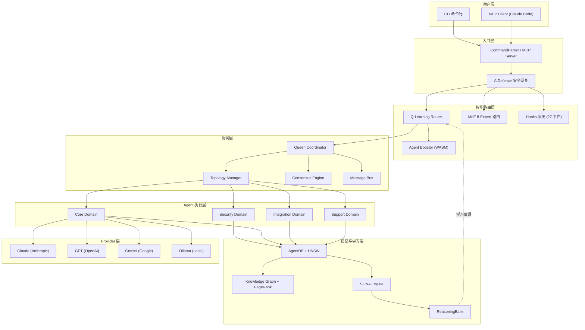
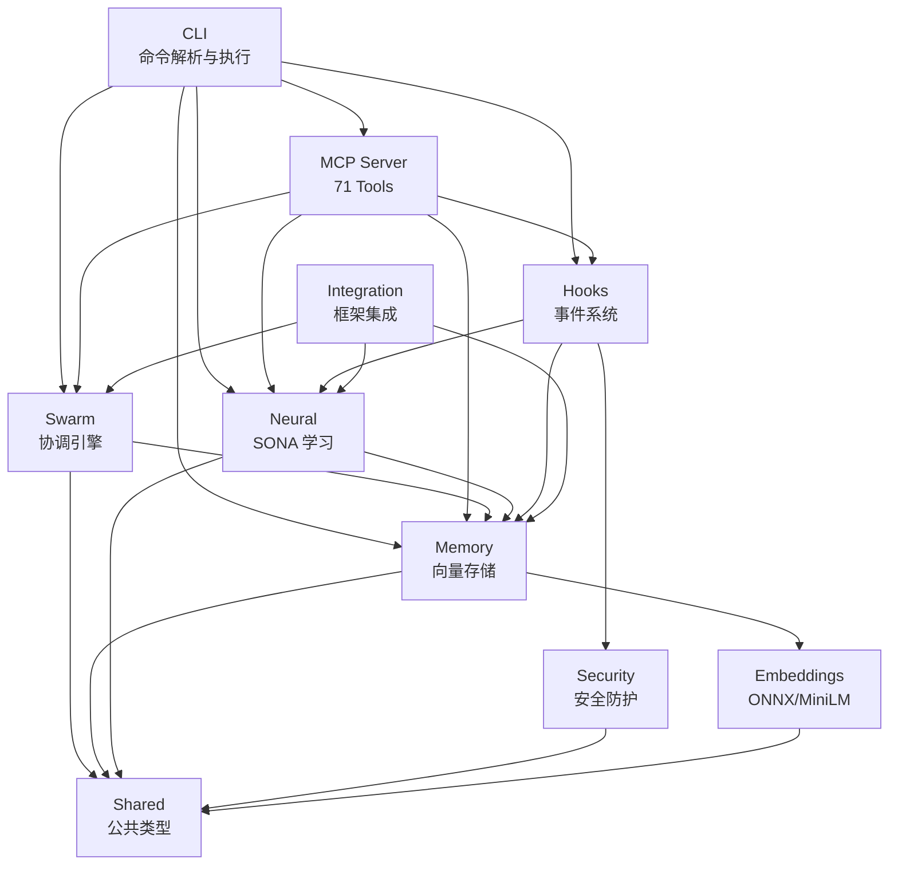
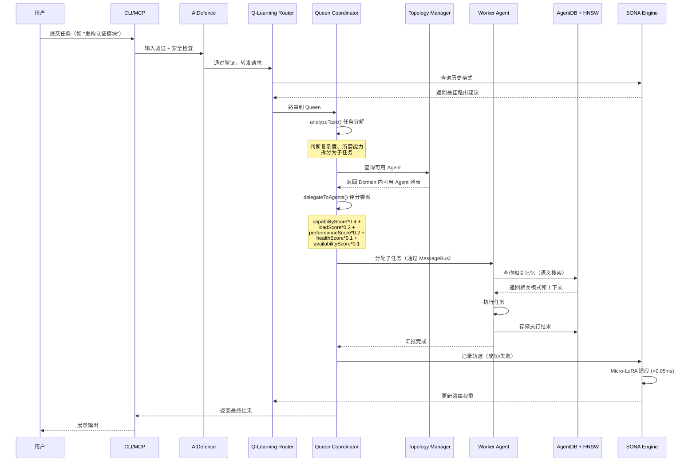
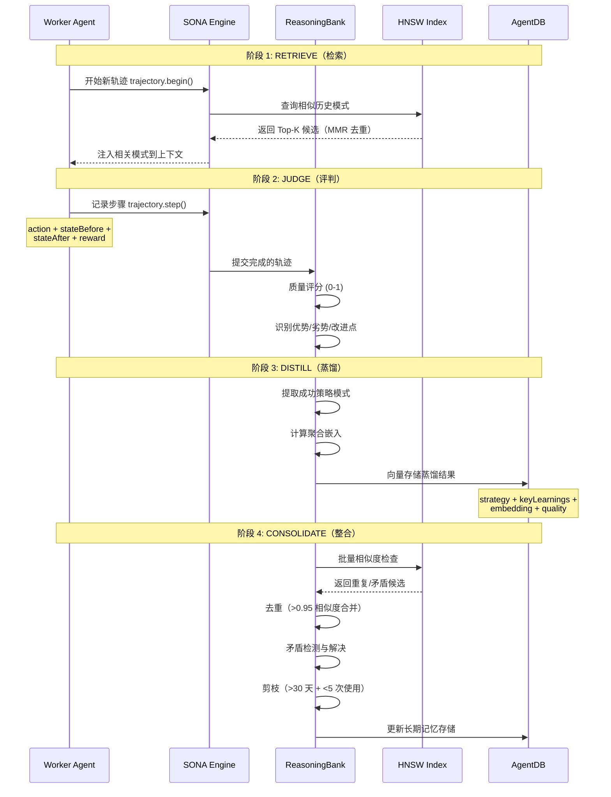

# ruflo 源码学习笔记

> 仓库地址：[ruflo](https://github.com/ruvnet/ruflo)
> 学习日期：2026-04-05

---

> **以下为 AI 源码分析**
>
> ### 一句话概括
>
> Ruflo 是一个基于 Claude Code 的企业级多 Agent AI 编排平台，通过 Swarm 协调、自学习 SONA 引擎和 MCP 协议集成，实现 100+ 专用 Agent 的协同工作与智能路由。
>
> ### 要点速览
>
> | 核心模块 | 职责 | 关键文件 |
> |---------|------|---------|
> | CLI | 命令行入口，41 个命令，双模式（CLI/MCP） | `v3/@claude-flow/cli/` |
> | Swarm | 多 Agent 协调，共识算法，拓扑管理 | `v3/@claude-flow/swarm/` |
> | Memory | AgentDB 向量存储，HNSW 索引，知识图谱 | `v3/@claude-flow/memory/` |
> | Neural | SONA 自学习，ReasoningBank 模式存储 | `v3/@claude-flow/neural/` |
> | MCP | 71 个 MCP Tools，JSON-RPC 2.0 协议 | `v3/mcp/` |
> | Security | 5 个 CVE 修复，输入验证，路径安全 | `v3/@claude-flow/security/` |
> | Hooks | 事件驱动钩子，Claude Code 桥接 | `v3/@claude-flow/hooks/` |
> | Integration | agentic-flow 集成，多模型路由 | `v3/@claude-flow/integration/` |

---

## 项目简介

Ruflo（原名 Claude Flow）是一个面向 Claude Code 的多 Agent AI 编排框架，旨在将单一的 Claude Code 会话转化为一个可协调 100+ 专用 Agent 的强大开发平台。它解决了以下核心问题：

1. **Agent 隔离问题**：原生 Claude Code 中 Agent 各自为战、无共享记忆，Ruflo 提供基于 AgentDB + HNSW 向量索引的持久化共享记忆层
2. **协调复杂度**：多 Agent 任务需要手动拆解分配，Ruflo 通过 Queen-Worker 分层架构 + 3 种共识算法（Raft/BFT/Gossip）自动协调
3. **学习与适应**：传统 Agent 行为固化，Ruflo 的 SONA 引擎实现 <0.05ms 自适应学习和智能路由
4. **成本优化**：通过 Agent Booster（WASM）跳过简单任务的 LLM 调用，Token Optimizer 降低 30-50% API 开销

项目采用 MIT 协议开源，npm 包名为 `claude-flow`，当前版本 v3.5.51。

## 技术栈

| 类别 | 技术 |
|------|------|
| 语言 | TypeScript (Node.js 20+) |
| 框架 | 自研框架 + agentic-flow@alpha |
| 构建工具 | tsc (TypeScript Compiler) / SWC |
| 依赖管理 | npm / pnpm / bun |
| 测试框架 | Vitest (V3) / Jest (V2) |
| 协议 | MCP (Model Context Protocol) / JSON-RPC 2.0 |
| 向量引擎 | HNSW (自实现) / AgentDB / RuVector (Rust WASM) |
| 安全 | bcrypt / Zod / HMAC |

## 目录结构

```
ruflo/
├── bin/                          # CLI 入口，代理到 v3 CLI
│   └── cli.js                    # 统一入口，转发到 v3/@claude-flow/cli
├── v3/                           # V3 主架构（模块化 DDD）
│   ├── @claude-flow/             # 核心模块包（22 个子模块）
│   │   ├── cli/                  # 命令行工具（41 命令，107K 行）
│   │   ├── swarm/                # Swarm 协调引擎（8.7K 行）
│   │   ├── memory/               # 内存与向量存储（19K 行）
│   │   ├── neural/               # SONA 自学习系统
│   │   ├── security/             # 安全模块（CVE 修复）
│   │   ├── hooks/                # 事件钩子系统
│   │   ├── integration/          # agentic-flow 集成层
│   │   ├── shared/               # 共享类型与工具
│   │   ├── performance/          # 性能基准
│   │   ├── embeddings/           # 向量嵌入（ONNX/MiniLM）
│   │   ├── guidance/             # 制导控制平面
│   │   └── ...                   # 其他模块
│   ├── mcp/                      # MCP Server（71 个 Tools）
│   ├── src/                      # V3 DDD 领域模型
│   ├── plugins/                  # 插件生态（16 个领域插件）
│   └── implementation/           # 领域实现层
├── v2/                           # V2 遗留代码（550+ 文件，280K 行）
│   ├── src/                      # 单体架构源码
│   └── bin/                      # V2 CLI 工具
├── agents/                       # Agent 定义（YAML 配置）
├── .agents/                      # 130+ Skills 定义
├── scripts/                      # 安装与工具脚本
├── tests/                        # 集成测试
└── plugin/                       # Claude Code 插件配置
```

## 架构设计

### 整体架构

Ruflo 采用**分层事件驱动架构**，请求从用户层流经路由层、协调层、Agent 执行层，最终到达 LLM Provider 层。系统内嵌一条**学习反馈回路**（SONA + ReasoningBank），使路由决策随使用不断优化。



### 核心模块

#### 1. CLI 模块 (`v3/@claude-flow/cli/`)

**职责**：命令行解析、MCP Server 代理、输出格式化

**核心文件**：
- `bin/cli.js` — 双模式入口（CLI / MCP stdio 服务器）
- `src/index.ts` — CLI 主类，配置加载与命令执行
- `src/commands/index.ts` — 命令注册表（20 同步 + 40+ 懒加载）
- `src/parser.ts` — 3 层命令解析器，支持子命令嵌套
- `src/mcp-client.ts` — MCP 工具注册与调用

**关键接口**：
- `Command` — 命令定义（name, action, subcommands, options）
- `CommandContext` — 执行上下文（args, flags, config, cwd）
- `CommandParser` — 参数解析，支持类型强制与验证

**命令分类**：
- **Primary**：`init`, `start`, `status`, `task`, `session`, `agent`, `swarm`, `memory`, `mcp`, `hooks`
- **Advanced**：`neural`, `security`, `performance`, `embeddings`, `hive-mind`, `ruvector`, `autopilot`
- **Utility**：`config`, `doctor`, `daemon`, `migrate`, `workflow`

#### 2. Swarm 协调模块 (`v3/@claude-flow/swarm/`)

**职责**：多 Agent 协调、共识达成、拓扑管理、任务分配

**核心文件**：
- `src/unified-coordinator.ts` (1844 行) — 统一协调引擎
- `src/queen-coordinator.ts` (2025 行) — Hive Mind 智能
- `src/topology-manager.ts` (656 行) — 4 种拓扑管理
- `src/message-bus.ts` (607 行) — 高性能消息队列

**关键类**：
- `UnifiedSwarmCoordinator` — 核心协调器，管理 Agent 注册、任务分配、消息路由
- `QueenCoordinator` — 顶层决策者，负责任务分解、Agent 评分与委派
- `TopologyManager` — 拓扑管理，O(1) 节点查询，支持 Leader 选举
- `MessageBus` — 循环缓冲区实现的消息队列，支持 ACK 确认

**15-Agent 分域架构**：
- Queen (#1)：全局协调
- Security Domain (#2-4)：安全审计
- Core Domain (#5-9)：核心开发
- Integration Domain (#10-12)：集成架构
- Support Domain (#13-15)：测试与部署

#### 3. Memory 模块 (`v3/@claude-flow/memory/`)

**职责**：向量存储与搜索、知识图谱、缓存管理、Agent 记忆隔离

**核心文件**：
- `src/hnsw-index.ts` (1014 行) — HNSW 向量索引
- `src/agentdb-backend.ts` (1030 行) — AgentDB 集成后端
- `src/cache-manager.ts` (517 行) — LRU 双层缓存
- `src/memory-graph.ts` (393 行) — 知识图谱 + PageRank
- `src/types.ts` (753 行) — 完整类型定义

**关键接口**：
- `MemoryEntry` — 内存条目（content, embedding, type, namespace, accessLevel）
- `IMemoryBackend` — 后端接口（store, get, query, search, bulkInsert）
- `HNSWIndex` — HNSW 图索引，支持余弦/欧氏/点积距离
- `MemoryGraph` — PageRank 排序 + Label Propagation 社区检测

**性能目标**：HNSW 搜索 150x-12,500x 加速（<1ms/100K 向量）

#### 4. Neural / SONA 模块 (`v3/@claude-flow/neural/`)

**职责**：自适应学习、模式存储与蒸馏、强化学习路由

**核心文件**：
- `src/sona-integration.ts` — SONA 学习引擎集成
- `src/reasoning-bank.ts` (1280 行) — 4 阶段学习管道
- `src/modes/` — 5 种学习模式（real-time, balanced, research, edge, batch）
- `src/algorithms/` — 7 种 RL 算法实现

**SONA 学习管道**：轨迹记录 → Micro-LoRA 适应 (<0.05ms) → 模式匹配 → 强制学习

**ReasoningBank 4 阶段**：
1. **RETRIEVE** — HNSW 向量检索 + MMR 多样性
2. **JUDGE** — 轨迹质量评分
3. **DISTILL** — 成功策略提取与嵌入
4. **CONSOLIDATE** — 去重、矛盾检测、剪枝

#### 5. MCP 模块 (`v3/mcp/`)

**职责**：MCP 协议服务端、71 个 Tool 注册与执行

**核心文件**：
- `server.ts` (20K 行) — MCP Server 实现
- `tool-registry.ts` (14K 行) — 工具注册表（O(1) 查找）
- `session-manager.ts` — 会话管理（最大 100 会话）
- `connection-pool.ts` — 连接池（max 10, min 2）
- `tools/` — 71 个 MCP Tool 实现

**Tool 分类**（71 个）：Agent (4), Memory (3), Task (8), SONA (14), Hooks (9), Config (3), System (4), Session (3), Worker (8), Federation (8), Swarm (4) 等

#### 6. Security 模块 (`v3/@claude-flow/security/`)

**职责**：安全防护、输入验证、凭证管理

**核心组件**：
- `PasswordHasher` — bcrypt 12 轮哈希（修复弱 SHA-256）
- `PathValidator` — 路径遍历防护（含 URL 编码/双编码检测）
- `SafeExecutor` — 命令白名单执行（无 shell，execFile）
- `InputValidator` — Zod Schema 验证
- `CredentialGenerator` — 密码学安全随机生成

#### 7. Hooks 模块 (`v3/@claude-flow/hooks/`)

**职责**：事件生命周期钩子、Claude Code 桥接、模式学习

**核心组件**：
- `HookRegistry` — 钩子注册表（优先级排序）
- `HookExecutor` — 执行引擎（超时处理、错误隔离）
- `OfficialHooksBridge` — V3 事件 ↔ Claude Code 官方 Hook 映射
- `DaemonManager` — 后台守护进程（指标收集、模式学习）

**Hook 优先级**：Critical (1000) → High (100) → Normal (50) → Low (10) → Background (1)

#### 8. Integration 模块 (`v3/@claude-flow/integration/`)

**职责**：agentic-flow 框架集成、多模型路由、Worker 池管理

**核心组件**：
- `AgenticFlowBridge` — 初始化 SONA + FlashAttention + AgentDB
- `AgenticFlowAgent` — 统一 Agent 基类适配器（ADR-001）
- `MultiModelRouter` — 多 Provider 路由与故障转移
- `TokenOptimizer` — 上下文压缩与成本估算
- `FeatureFlagManager` — 功能切换（minimal/standard/full）

### 模块依赖关系



## 核心流程

### 流程一：任务提交与 Agent 协调

用户通过 CLI 或 MCP 提交任务后，系统经过安全检查、智能路由、Queen 分解、Agent 执行的完整流程：



**关键逻辑说明**：

1. **安全网关**：所有输入经过 PathValidator、InputValidator 验证，阻止注入攻击
2. **智能路由**：Q-Learning Router 基于历史模式选择最佳 Agent 组合（89% 准确率）
3. **Queen 分解**：`analyzeTask()` 将复杂任务拆解为带依赖关系的子任务
4. **Agent 评分**：5 维加权评分系统确保任务分配到最合适的 Agent
5. **学习闭环**：每次执行结果写入 SONA，Micro-LoRA 实时更新路由策略

### 流程二：SONA 自学习管道（ReasoningBank 4 阶段）



**关键逻辑说明**：

1. **RETRIEVE**：通过 HNSW 索引 150x-12,500x 加速检索，MMR（lambda=0.7）平衡相关性与多样性
2. **JUDGE**：对完整轨迹（steps[], rewards[]）进行质量评估，生成 verdict
3. **DISTILL**：将高质量轨迹蒸馏为可复用 Pattern（strategy + keyLearnings + embedding）
4. **CONSOLIDATE**：定期清理模式库，合并相似模式，检测和解决矛盾记忆

## 关键设计亮点

### 1. 双模式 CLI 入口 + MCP-First 设计（ADR-005）

**解决的问题**：如何同时支持交互式 CLI 和 Claude Code 原生集成

**实现方式**：`bin/cli.js` 通过检测 stdin 是否为管道模式自动切换：管道模式启动 JSON-RPC 2.0 MCP Server，非管道模式启动交互式 CLI。所有业务逻辑统一实现为 71 个 MCP Tool，CLI 命令仅为薄包装器。

**设计理由**：MCP-First 确保一致性 — 无论用户通过 CLI 还是 Claude Code 调用，底层执行逻辑完全一致，避免了两套代码的维护负担。

### 2. HNSW + 二叉堆的高性能向量搜索

**解决的问题**：Agent 共享记忆需要毫秒级语义检索（100K+ 向量规模）

**实现方式**（`v3/@claude-flow/memory/src/hnsw-index.ts`）：
- 自实现 HNSW 图索引，分层导航从高层稀疏路由到底层精确搜索
- `BinaryMinHeap` / `BinaryMaxHeap` 替代 `Array.sort()`（3-5x 加速）
- 向量预规范化存储，余弦距离仅需点积运算（~2x 加速）
- 支持二进制量化（32x 压缩）、标量量化、乘积量化

**设计理由**：纯 TypeScript 实现避免原生依赖，同时通过算法优化达到 150x-12,500x 的搜索加速，在不依赖外部向量数据库的前提下实现高性能语义检索。

### 3. Queen-Worker 分域协调 + 多共识算法

**解决的问题**：100+ Agent 协同工作时的目标漂移和决策冲突

**实现方式**（`v3/@claude-flow/swarm/src/queen-coordinator.ts`）：
- 15-Agent 分为 4 个 Domain（Security/Core/Integration/Support），每个 Domain 有 Lead
- Queen 通过 5 维加权评分（capability 0.4 + load 0.2 + performance 0.2 + health 0.1 + availability 0.1）分配任务
- 3 种共识算法按场景选择：Raft（强一致 + 低延迟）、BFT（不可信环境 f<n/3）、Gossip（大规模最终一致）

**设计理由**：分层 + 分域设计将 O(n^2) 的全连接协调降为 O(n) 的层级汇报，配合 Anti-Drift 策略（短周期检查点 + 层级审查）防止 Agent 偏离目标。

### 4. SONA Micro-LoRA 实时适应

**解决的问题**：Agent 路由策略需要从每次执行中快速学习，但传统神经网络训练太慢

**实现方式**（`v3/@claude-flow/neural/src/sona-integration.ts`）：
- Micro-LoRA（rank-1/rank-2）低秩适应，仅更新极少参数
- EWC++（Elastic Weight Consolidation）防止灾难性遗忘
- 5 种学习模式切换：real-time（<0.5ms, rank-1）到 research（高精度, rank-16）
- SIMD 风格的 4 元素循环展开优化向量运算

**设计理由**：<0.05ms 的适应延迟使得每次 Agent 执行完成后都能即时更新路由策略，而 EWC++ 确保新学到的模式不会覆盖已验证的历史知识。

### 5. V2→V3 架构演进：从单体到模块化 DDD

**解决的问题**：V2 的 280K 行单体代码难以维护、测试和扩展

**实现方式**：
- V3 采用 DDD（Domain-Driven Design）+ 洋葱架构，划分为 8 个独立领域模块
- 每个模块有独立的 `package.json`、类型系统和测试套件
- 通过 `v3/index.ts` 统一导出，支持 tree-shaking
- 基于 10 个 ADR（Architecture Decision Records）指导架构决策

**设计理由**：模块化使得各模块可独立开发、测试、发布，同时通过 ADR 文档化每个架构决策的背景和权衡，确保团队对设计意图的共识。V3 目标是在 <5,000 行代码中实现 V2 的核心功能（V2 为 15,000+ 行核心代码）。
