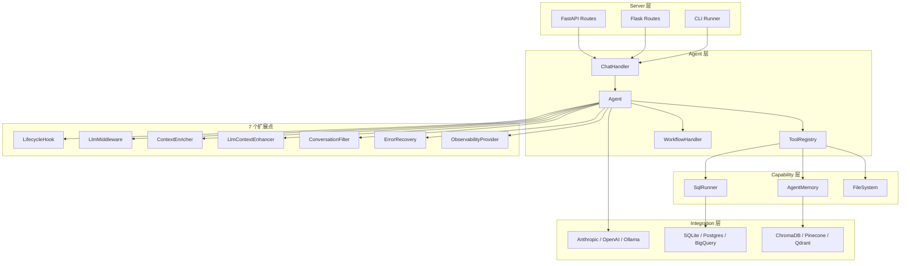
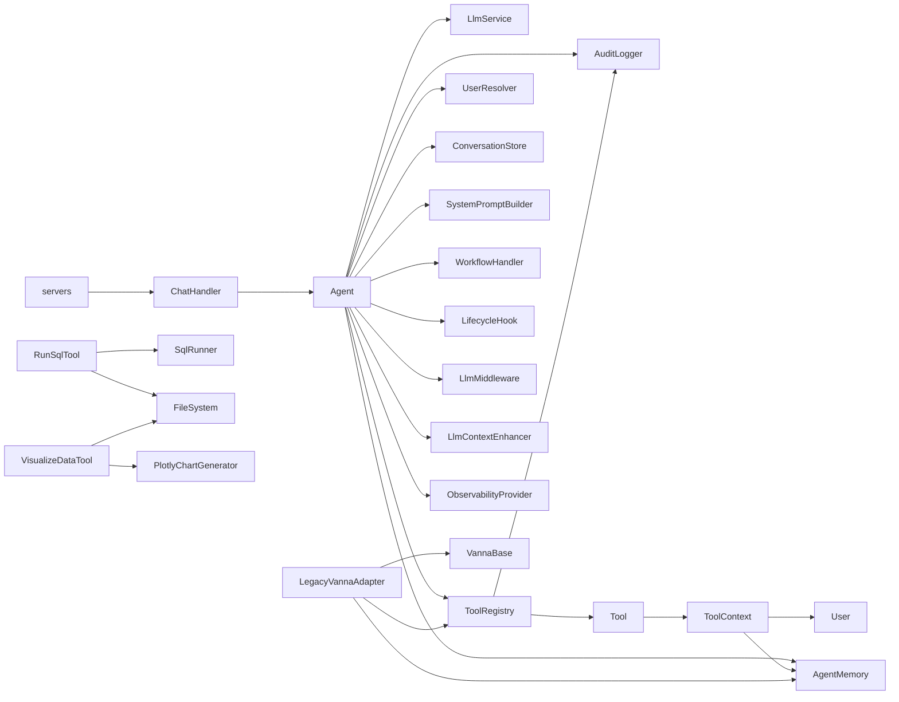
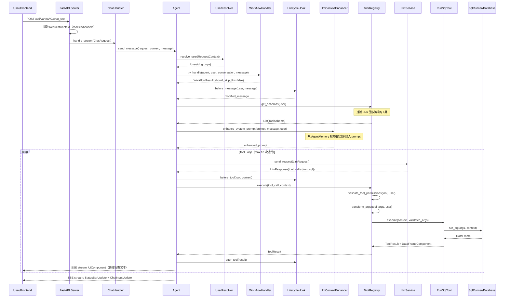
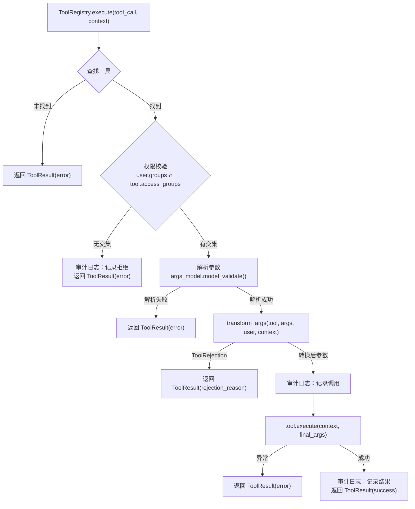

# vanna 源码学习笔记

> 仓库地址：[vanna](https://github.com/vanna-ai/vanna)
> 学习日期：2026-03-22

---

> **以下为 AI 源码分析**
>
> ### 一句话概括
>
> Vanna 是一个 User-Aware 的 LLM Agent 框架，将自然语言转换为 SQL 查询并流式返回表格、图表等富 UI 组件，同时内置企业级安全（行级权限、审计日志、速率限制）。
>
> ### 要点速览
>
> | 核心模块 | 职责 | 关键文件 |
> |---------|------|---------|
> | Agent | 编排 LLM 调用与 Tool 执行的主循环 | `core/agent/agent.py` |
> | Tool & Registry | 定义工具抽象和基于分组的权限控制 | `core/tool/base.py`, `core/registry.py` |
> | LLM Service | 统一的 LLM 提供商接口（Anthropic / OpenAI / Ollama 等） | `core/llm/base.py` |
> | User & Resolver | 用户身份模型与请求认证解析 | `core/user/models.py`, `core/user/resolver.py` |
> | SQL Runner | 数据库查询执行的抽象接口 | `capabilities/sql_runner/base.py` |
> | Agent Memory | 工具使用模式的持久化记忆 | `capabilities/agent_memory/base.py` |
> | Components | 富/简 UI 组件体系（表格、图表、状态卡片等） | `components/`, `core/components.py` |
> | Servers | FastAPI / Flask / CLI 服务端适配 | `servers/fastapi/routes.py` |
> | Legacy Adapter | 0.x 到 2.0 的兼容桥接层 | `legacy/adapter.py` |

---

## 项目简介

Vanna 2.0 是一个面向企业的 **Text-to-SQL Agent 框架**。用户用自然语言提问，Vanna 通过 LLM 生成 SQL、执行查询、可视化结果，并以流式 SSE/WebSocket 方式将表格、图表、摘要等富组件推送到前端 `<vanna-chat>` Web Component。其核心差异化在于 **User-Aware**：用户身份从 HTTP 请求解析后贯穿 system prompt → tool 权限校验 → SQL 行级安全 → UI 特性可见性 → 审计日志，实现端到端的多租户安全。框架通过 7 个扩展点（Lifecycle Hooks、LLM Middlewares、Error Recovery、Context Enrichers、LLM Context Enhancers、Conversation Filters、Observability Provider）实现高度可定制。

## 技术栈

| 类别 | 技术 |
|------|------|
| 语言 | Python 3.9+（目标 3.11） |
| 框架 | FastAPI / Flask（可选） |
| 构建工具 | Flit（flit_core） |
| 依赖管理 | pip + pyproject.toml（extras 机制） |
| 测试框架 | pytest + pytest-asyncio + tox |

## 目录结构

```
src/vanna/
├── __init__.py                  # 包入口，导出所有公共 API
├── core/                        # 🏗️ 核心框架层：接口定义 + 默认实现
│   ├── agent/                   #   Agent 主类与配置
│   │   ├── agent.py             #     Agent 编排主循环
│   │   └── config.py            #     AgentConfig / UiFeatures / AuditConfig
│   ├── tool/                    #   Tool 抽象基类与数据模型
│   ├── llm/                     #   LlmService 抽象与请求/响应模型
│   ├── user/                    #   User 模型、UserResolver、RequestContext
│   ├── registry.py              #   ToolRegistry：工具注册、权限校验、执行
│   ├── components.py            #   UiComponent 基类
│   ├── lifecycle/               #   LifecycleHook 接口
│   ├── middleware/               #   LlmMiddleware 接口
│   ├── workflow/                #   WorkflowHandler 接口与默认实现
│   ├── enhancer/                #   LlmContextEnhancer 接口
│   ├── enricher/                #   ToolContextEnricher 接口
│   ├── observability/           #   ObservabilityProvider 接口
│   ├── audit/                   #   AuditLogger 接口
│   ├── recovery/                #   ErrorRecoveryStrategy 接口
│   ├── filter/                  #   ConversationFilter 接口
│   ├── storage/                 #   ConversationStore 接口
│   ├── evaluation/              #   评估框架（Evaluator / TestCase / Runner）
│   └── system_prompt/           #   SystemPromptBuilder 接口与默认实现
├── capabilities/                # 🔌 能力层：可插拔的功能抽象
│   ├── sql_runner/              #   SqlRunner 接口
│   ├── agent_memory/            #   AgentMemory 接口
│   └── file_system/             #   FileSystem 接口
├── tools/                       # 🧰 内置工具实现
│   ├── run_sql.py               #   RunSqlTool（SQL 执行）
│   ├── visualize_data.py        #   VisualizeDataTool（数据可视化）
│   ├── agent_memory.py          #   记忆搜索/保存工具
│   ├── file_system.py           #   文件操作工具集
│   └── python.py                #   Python 脚本执行工具
├── components/                  # 🎨 UI 组件体系
│   ├── rich/                    #   富组件（Card / DataFrame / Chart / StatusCard...）
│   └── simple/                  #   简单组件（Text / Image / Link）
├── integrations/                # 🔗 第三方集成（按提供商分目录）
│   ├── anthropic/               #   Anthropic LLM 实现
│   ├── openai/                  #   OpenAI LLM 实现
│   ├── ollama/                  #   Ollama LLM 实现
│   ├── sqlite/                  #   SQLite SqlRunner
│   ├── postgres/                #   PostgreSQL SqlRunner
│   ├── chromadb/                #   ChromaDB AgentMemory
│   ├── local/                   #   本地内存实现（存储/审计/文件系统）
│   └── ...                      #   BigQuery / Snowflake / DuckDB / MySQL 等
├── servers/                     # 🌐 服务端适配层
│   ├── base/                    #   ChatHandler（框架无关核心逻辑）
│   ├── fastapi/                 #   FastAPI 路由注册
│   ├── flask/                   #   Flask 路由注册
│   └── cli/                     #   CLI 启动器
├── legacy/                      # 🔄 0.x 版本兼容层
│   ├── adapter.py               #   LegacyVannaAdapter
│   └── base/base.py             #   VannaBase（旧版核心基类）
└── web_components/              # 🌐 前端 Web Component 相关
```

## 架构设计

### 整体架构

Vanna 2.0 采用 **分层 + 插件化** 的架构设计。自上而下分为 4 层：

1. **Server 层**：FastAPI / Flask 路由，处理 HTTP 请求，提取 `RequestContext`，转发给 `ChatHandler`
2. **Agent 层**：核心编排器，协调 User 解析 → Lifecycle Hooks → LLM 调用 → Tool 执行 → UI 组件生成
3. **Capability 层**：可插拔的能力抽象（SqlRunner / AgentMemory / FileSystem），通过依赖注入组合
4. **Integration 层**：具体的第三方实现（Anthropic / OpenAI / PostgreSQL / ChromaDB 等）

7 个扩展点贯穿 Agent 层，形成一条完整的请求处理管线：



### 核心模块

#### 1. Agent（编排核心）

- **职责**：接收用户消息，协调所有组件完成一次完整的请求处理
- **核心文件**：`core/agent/agent.py`、`core/agent/config.py`
- **关键类**：`Agent`
- **核心方法**：
  - `send_message()` — 公共入口，包含错误处理
  - `_send_message()` — 内部实现，包含完整的处理管线
  - `_build_llm_request()` — 构建 LLM 请求
  - `_send_llm_request()` / `_handle_streaming_response()` — LLM 交互
- **关系**：Agent 持有所有其他模块的引用，是整个系统的中心节点

#### 2. Tool & ToolRegistry（工具体系）

- **职责**：定义工具抽象、管理工具注册、执行权限校验和参数转换
- **核心文件**：`core/tool/base.py`、`core/registry.py`
- **关键接口**：
  - `Tool[T]` — 泛型工具基类，定义 `name` / `description` / `access_groups` / `get_args_schema()` / `execute()`
  - `ToolRegistry` — 工具注册中心，核心方法：`register_local_tool()` / `get_schemas(user)` / `execute(tool_call, context)` / `transform_args()`
- **设计亮点**：`access_groups` 实现基于组的权限控制，`transform_args()` 支持行级安全

#### 3. LLM Service（LLM 服务层）

- **职责**：提供统一的 LLM 通信接口，屏蔽提供商差异
- **核心文件**：`core/llm/base.py`、`core/llm/models.py`
- **关键接口**：`LlmService`，定义 `send_request()` / `stream_request()` / `validate_tools()`
- **实现**：Anthropic（`integrations/anthropic/llm.py`）、OpenAI、Ollama、Azure OpenAI、Google Gemini 等

#### 4. User & Resolver（用户身份系统）

- **职责**：定义用户模型，从 HTTP 请求上下文中解析用户身份
- **核心文件**：`core/user/models.py`、`core/user/resolver.py`、`core/user/request_context.py`
- **关键类**：
  - `User` — Pydantic 模型，含 `id` / `email` / `group_memberships`
  - `UserResolver` — 抽象类，`resolve_user(RequestContext) -> User`
  - `RequestContext` — 封装 cookies / headers / query_params
- **关系**：User 对象贯穿整条链路（system prompt → tool schema 过滤 → tool 执行 → UI 特性可见性 → 审计）

#### 5. Components（UI 组件体系）

- **职责**：定义流式传输给前端的 UI 组件
- **核心文件**：`core/components.py`、`components/rich/`、`components/simple/`
- **设计**：每个 `UiComponent` 同时包含 `rich_component`（高级渲染）和 `simple_component`（降级渲染），实现优雅降级
- **主要组件**：`DataFrameComponent` / `ChartComponent` / `StatusCardComponent` / `CardComponent` / `RichTextComponent` / `NotificationComponent` 等

#### 6. Servers（服务端适配层）

- **职责**：将 Agent 暴露为 HTTP 服务
- **核心文件**：`servers/base/chat_handler.py`、`servers/fastapi/routes.py`、`servers/flask/routes.py`
- **关键类**：`ChatHandler`（框架无关的核心逻辑）
- **API 端点**：
  - `POST /api/vanna/v2/chat_sse` — SSE 流式端点
  - `WS /api/vanna/v2/chat_websocket` — WebSocket 实时端点
  - `POST /api/vanna/v2/chat_poll` — 轮询端点
  - `GET /` — Web UI 页面

### 模块依赖关系



## 核心流程

### 流程一：用户消息处理（Agent Tool Loop）

这是 Vanna 最核心的流程，展示了从用户提问到获得 SQL 查询结果的完整链路。



**关键逻辑说明**：

1. **用户解析**：`UserResolver` 从 HTTP 请求中提取用户身份（JWT / Cookie），生成 `User` 对象
2. **Workflow 短路**：`WorkflowHandler` 先尝试处理内置命令（`/help`、`/status`、`/memories`），命中则跳过 LLM
3. **权限过滤**：`ToolRegistry.get_schemas(user)` 只返回用户 `group_memberships` 有权访问的工具 schema
4. **上下文增强**：`LlmContextEnhancer` 从 AgentMemory 检索相似历史问答，注入 system prompt
5. **Tool Loop**：LLM 返回 `tool_use` 指令 → 权限校验 → 参数转换（可注入 RLS） → 执行 → 结果反馈 → 再次调用 LLM，循环直到 LLM 不再调用工具
6. **流式输出**：每步通过 `yield UiComponent` 以 SSE 流推送给前端

### 流程二：工具权限校验与参数转换

展示 `ToolRegistry.execute()` 内部的安全校验链路，这是 Vanna 企业安全的核心。



**关键设计**：

1. **基于组的权限**：`Tool.access_groups` 定义允许的用户组，`ToolRegistry` 检查用户组与工具组的交集
2. **参数转换钩子**：`transform_args()` 是行级安全的入口点 —— 子类可重写此方法，根据用户权限修改 SQL（如自动添加 `WHERE tenant_id = ?`）
3. **全链路审计**：权限检查、工具调用、执行结果三个阶段都有审计日志，由 `AuditConfig` 控制开关

## 关键设计亮点

### 1. User-Aware 贯穿全链路

- **解决的问题**：多租户环境下，不同用户看到的数据和功能应有差异
- **实现方式**：`User` 对象从 `UserResolver` 解析后，作为参数传递给 `SystemPromptBuilder` → `ToolRegistry.get_schemas()` → `ToolContext` → `transform_args()` → `UiFeatures.can_user_access_feature()`
- **关键文件**：`core/user/resolver.py`、`core/registry.py`、`core/agent/config.py`
- **设计优势**：身份信息不靠全局状态传递，而是显式注入每个调用点，避免权限泄漏

### 2. 双轨 UI 组件（Rich + Simple 降级）

- **解决的问题**：前端能力不一（Web Component vs 纯文本终端），需要优雅降级
- **实现方式**：`UiComponent` 同时包含 `rich_component`（`RichComponent` 子类）和 `simple_component`（`SimpleComponent` 子类），前端根据能力选择渲染方式
- **关键文件**：`core/components.py`、`core/rich_component.py`、`core/simple_component.py`
- **设计优势**：工具开发者一次定义，多端适配

### 3. 7 个扩展点的管线式架构

- **解决的问题**：不同企业客户有差异化的安全、监控、缓存需求
- **实现方式**：Agent 构造函数接受 7 种可选扩展列表，在处理管线的不同阶段依次调用：
  - `LifecycleHook`：消息前后、工具执行前后
  - `LlmMiddleware`：LLM 请求/响应拦截
  - `ToolContextEnricher`：工具上下文扩充
  - `LlmContextEnhancer`：system prompt 增强
  - `ConversationFilter`：对话历史过滤
  - `ErrorRecoveryStrategy`：错误恢复
  - `ObservabilityProvider`：遥测数据收集
- **关键文件**：`core/lifecycle/base.py`、`core/middleware/base.py`、`core/enhancer/base.py`、`core/observability/base.py`
- **设计优势**：开放-封闭原则的典型实践，核心流程不变，行为通过插件定制

### 4. ToolRegistry.transform_args() 实现行级安全

- **解决的问题**：SQL 查询需要按用户权限自动过滤数据，而不是依赖 LLM "记住"添加 WHERE 条件
- **实现方式**：`ToolRegistry.transform_args()` 默认为 NoOp，子类重写后可在 SQL 执行前修改参数。这个拦截点在参数验证之后、工具执行之前，返回 `ToolRejection` 可直接拒绝操作
- **关键文件**：`core/registry.py:113-142`
- **设计优势**：安全逻辑集中在 Registry 层而非分散在每个 Tool 中，且对 LLM 透明

### 5. Legacy Adapter 实现平滑迁移

- **解决的问题**：Vanna 0.x 用户已有大量基于 `VannaBase` 的代码，2.0 完全重写后需要兼容
- **实现方式**：`LegacyVannaAdapter` 同时继承 `ToolRegistry` 和 `AgentMemory`，自动将 `VannaBase` 的方法包装为 Tool 注册到 Registry 中，`LegacySqlRunner` 将旧的同步 `run_sql()` 方法适配为新的 async 接口
- **关键文件**：`legacy/adapter.py`
- **设计优势**：用户可以"先包装后迁移"，渐进式升级到新架构
