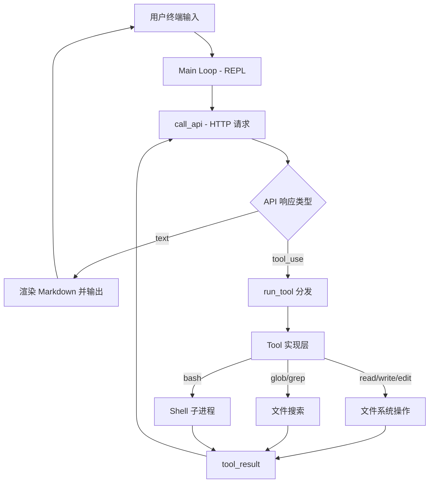
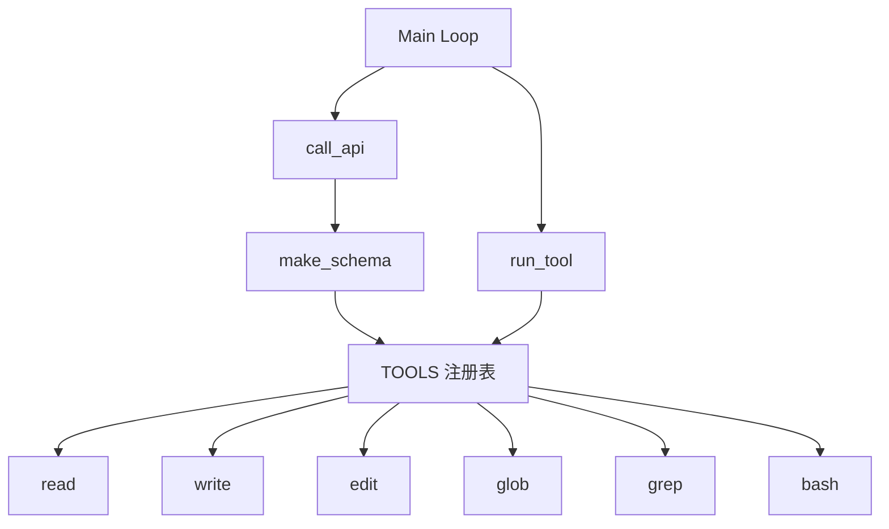
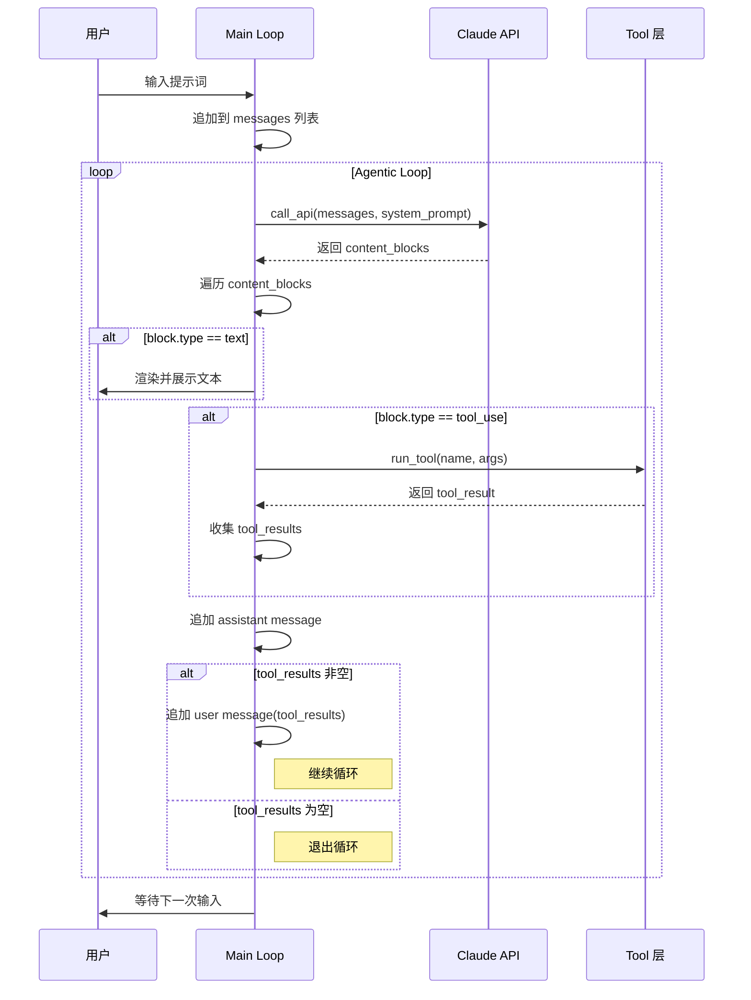
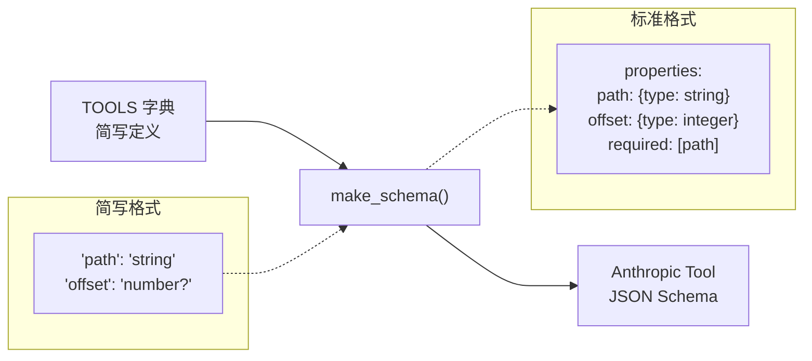

# nanocode 源码学习笔记

> 仓库地址：[nanocode](https://github.com/1rgs/nanocode)
> 学习日期：2026-03-30

---

> **以下为 AI 源码分析**
>
> ### 一句话概括
>
> 一个约 270 行的单文件 Python 脚本，零外部依赖实现了 Claude Code 的核心功能——带工具调用的 Agentic Loop。
>
> ### 要点速览
>
> | 核心模块 | 职责 | 关键代码位置 |
> |---------|------|-------------|
> | Tool 实现层 | 6 个工具函数：read/write/edit/glob/grep/bash | `nanocode.py:24-97` |
> | Tool 注册表 | 集中管理工具元数据（描述、Schema、函数引用） | `nanocode.py:102-133` |
> | Schema 生成器 | 将注册表转换为 Anthropic API tool schema 格式 | `nanocode.py:143-167` |
> | API 调用层 | 封装 HTTP 请求，支持 Anthropic 直连和 OpenRouter | `nanocode.py:170-189` |
> | 主循环（REPL + Agentic Loop） | 用户交互 + 自动工具调用循环 | `nanocode.py:200-271` |

---

## 项目简介

nanocode 是一个极简的 Claude Code 替代品，用单个 Python 文件实现了完整的 AI 编程助手核心功能。它通过 Anthropic Messages API（或 OpenRouter）与 Claude 模型交互，支持 6 种工具（read、write、edit、glob、grep、bash），在终端中实现了带彩色输出的 REPL 界面。项目的核心价值在于用最少的代码展示了 Agentic Coding 系统的本质——**"LLM + Tool Use + Loop"**。

## 技术栈

| 类别 | 技术 |
|------|------|
| 语言 | Python 3 |
| 框架 | 无（纯标准库） |
| 构建工具 | 无（直接运行 `python nanocode.py`） |
| 依赖管理 | 无外部依赖（仅使用 `json`, `os`, `re`, `subprocess`, `urllib.request`, `glob`） |
| 测试框架 | 无 |

## 目录结构

```
nanocode/
├── nanocode.py      # 唯一源码文件，包含全部逻辑（~270 行）
├── README.md        # 项目说明文档
├── screenshot.png   # 终端运行截图
└── (无其他文件)
```

## 架构设计

### 整体架构

nanocode 采用极简的**单文件分层架构**，自底向上分为四层：工具实现层、工具注册表、API 通信层、主控制循环。设计哲学是"能用标准库就不引入依赖，能用一个文件就不拆分模块"。

整体数据流为：用户输入 → 主循环调用 API → API 返回 tool_use → 执行工具 → 将结果送回 API → 重复直到返回纯文本 → 展示给用户。



### 核心模块

#### 1. Tool 实现层（`nanocode.py:24-97`）

**职责**：实现 6 个文件操作和系统命令工具。

**关键函数**：

- `read(args)` — 读取文件内容，支持 `offset` 和 `limit` 分页，输出带行号格式 `行号| 内容`
- `write(args)` — 将 `content` 写入指定 `path`
- `edit(args)` — 在文件中查找 `old` 字符串并替换为 `new`，默认要求唯一匹配，`all=true` 时全量替换
- `glob(args)` — 按 glob 模式搜索文件，按修改时间倒序排列
- `grep(args)` — 按正则搜索文件内容，返回最多 50 条匹配结果，格式为 `文件:行号:内容`
- `bash(args)` — 执行 Shell 命令，实时逐行输出，30 秒超时自动 kill

**与其他模块的关系**：被 `run_tool()` 分发调用，不直接依赖其他模块。

#### 2. Tool 注册表（`nanocode.py:102-133`）

**职责**：集中注册所有工具的元数据，是连接工具实现和 API Schema 的桥梁。

**核心数据结构**：

```python
TOOLS = {
    "tool_name": (description, {param_name: type_string}, function_ref),
    ...
}
```

每个工具注册为一个三元组：`(描述字符串, 参数Schema字典, 函数引用)`。类型字符串支持 `"string"`, `"number"`, `"boolean"`，末尾加 `?` 表示可选参数。

**关键函数**：
- `run_tool(name, args)` — 从 `TOOLS` 字典查找并执行工具函数，统一捕获异常
- `make_schema()` — 遍历 `TOOLS`，将简写 Schema 转换为 Anthropic API 要求的 JSON Schema 格式

#### 3. API 通信层（`nanocode.py:170-189`）

**职责**：封装与 LLM API 的 HTTP 通信。

**关键函数**：`call_api(messages, system_prompt)`

- 使用标准库 `urllib.request` 发送 POST 请求（零依赖设计的关键）
- 通过环境变量 `OPENROUTER_API_KEY` 自动切换 Anthropic 直连或 OpenRouter 代理
- 请求体包含 `model`、`max_tokens`、`system`、`messages`、`tools` 五个字段
- 认证方式：Anthropic 使用 `x-api-key` header，OpenRouter 使用 `Authorization: Bearer` header

#### 4. 主控制循环（`nanocode.py:200-271`）

**职责**：实现 REPL 交互界面和 Agentic Loop 核心逻辑。

**关键流程**：

- **外层循环**（`while True`）：读取用户输入，处理命令（`/c` 清空历史、`/q` 退出）
- **内层循环**（Agentic Loop）：持续调用 API，处理 `tool_use` 响应并执行工具，直到 API 返回纯文本（无 `tool_results`）时退出

### 模块依赖关系



## 核心流程

### 流程一：Agentic Loop（工具调用循环）

这是 nanocode 最核心的流程，展示了 AI Agent 的基本运行机制。



**关键逻辑说明**：

1. 用户输入被追加到 `messages` 列表作为 `user` 角色消息
2. 调用 API 后，遍历返回的 `content_blocks`：`text` 类型直接输出，`tool_use` 类型执行工具并收集结果
3. 无论是否有工具调用，都将 `assistant` 消息追加到历史（`nanocode.py:256`）
4. **退出条件**：如果本轮没有产生任何 `tool_results`，说明 LLM 已完成推理，退出内层循环
5. 如果有 `tool_results`，将其作为 `user` 消息追加，触发下一轮 API 调用

### 流程二：Tool Schema 生成与注册

展示工具如何从简写定义转换为 API 标准格式。



**关键逻辑说明**：

1. 工具注册使用极简语法：`"param": "type?"` 中 `?` 后缀表示可选（`nanocode.py:149`）
2. `make_schema()` 遍历 `TOOLS` 字典，将 `"number"` 映射为 JSON Schema 的 `"integer"`（`nanocode.py:151`）
3. 无 `?` 后缀的参数自动加入 `required` 列表
4. 输出格式完全符合 Anthropic Messages API 的 `tools` 参数规范

## 关键设计亮点

### 1. 零依赖的极致简约

**解决的问题**：大多数 AI 编程工具依赖重量级 SDK（如 `anthropic` Python 包），增加了安装和维护成本。

**实现方式**：使用 `urllib.request` 直接构造 HTTP 请求（`nanocode.py:171-188`），手动组装 JSON body 和 headers，避免引入任何第三方库。整个项目只 import 了 6 个标准库模块。

**设计理由**：对于一个只需要调用 REST API 的场景，HTTP 客户端库完全多余。`urllib.request` 虽然 API 不如 `requests` 优雅，但对于单一 endpoint 的 POST 请求完全够用。

### 2. 声明式工具注册表（Registry Pattern）

**解决的问题**：新增工具时需要在多处修改代码（实现函数、Schema 定义、分发逻辑），容易遗漏。

**实现方式**：`TOOLS` 字典将描述、Schema、函数引用三者绑定在一起（`nanocode.py:102-133`），`run_tool()` 和 `make_schema()` 都从同一个注册表读取，新增工具只需写一个函数 + 在字典中加一行。

**设计理由**：单点注册消除了代码分散导致的不一致风险，也让工具的添加/删除变得极为简单。

### 3. 极简 Schema DSL

**解决的问题**：Anthropic API 要求的 JSON Schema 格式冗长，手写容易出错。

**实现方式**：自定义了一套极简类型表示法——`"string"`, `"number?"`, `"boolean?"`（`nanocode.py:106`），通过 `make_schema()` 函数自动转换为标准 JSON Schema。用约 25 行代码完成了一个微型 DSL 解析器。

**设计理由**：与其让每个工具都写完整的 JSON Schema，不如抽象出最小的类型表示，在保持可读性的同时大幅减少样板代码。

### 4. Agentic Loop 的最小实现

**解决的问题**：如何让 LLM 自主完成多步任务（读文件 → 分析 → 修改 → 验证）？

**实现方式**：内层 `while True` 循环（`nanocode.py:222-260`）是整个 Agent 的核心——每轮将工具执行结果作为新的 `user` 消息送回 API，让 LLM 决定下一步操作，直到 LLM 不再调用工具为止。仅用约 40 行代码实现了完整的 Agentic Loop。

**设计理由**：Agentic Loop 本质上就是一个"调用 → 判断 → 再调用"的循环。nanocode 证明了这个核心机制不需要复杂框架，一个简单的 `while True` + 条件退出就足够了。

### 5. bash 工具的实时流式输出

**解决的问题**：Shell 命令可能运行时间较长，用户需要实时看到输出而非等待命令结束。

**实现方式**：使用 `subprocess.Popen` 逐行读取 stdout（`nanocode.py:79-97`），每读到一行立即 `print` 到终端并 `flush`，同时收集到 `output_lines` 中作为 tool_result 返回给 LLM。设置 30 秒超时保护，防止无限等待。

**设计理由**：对于 `npm install` 或 `make` 这类长时间运行的命令，实时输出能显著提升用户体验。将 stdout 和 stderr 合并（`stderr=subprocess.STDOUT`）简化了流处理逻辑。
