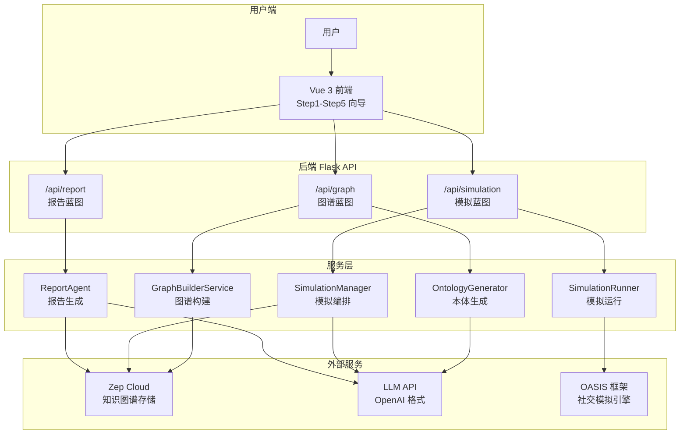
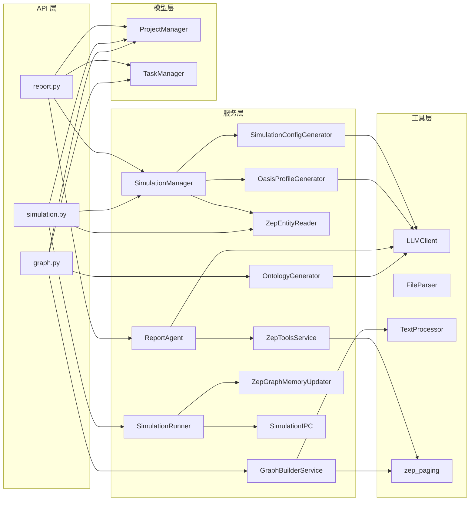
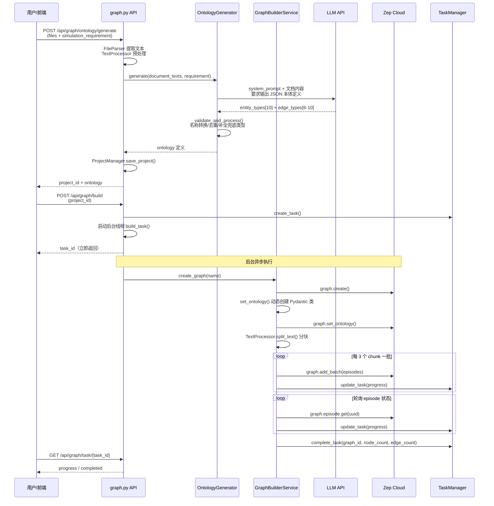
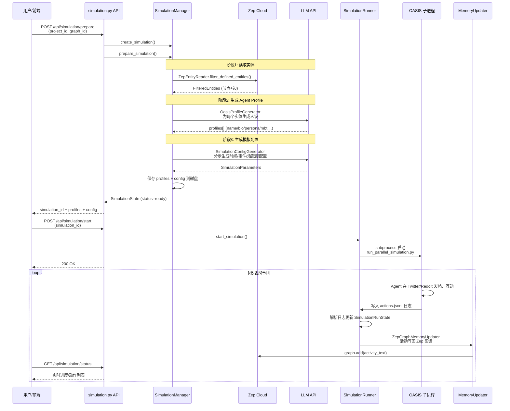

# MiroFish 源码学习笔记

> 仓库地址：[MiroFish](https://github.com/666ghj/MiroFish)
> 学习日期：2026-04-05

---

> **以下为 AI 源码分析**
>
> ### 一句话概括
>
> MiroFish 是一个基于多 Agent 群体智能的预测引擎，通过构建知识图谱、生成 Agent 人设、在 Twitter/Reddit 双平台上并行模拟社交互动，最终由 ReportAgent 自动生成预测报告。
>
> ### 要点速览
>
> | 核心模块 | 职责 | 关键文件 |
> |---------|------|---------|
> | OntologyGenerator | 分析上传文档，LLM 生成实体/关系本体定义 | `services/ontology_generator.py` |
> | GraphBuilderService | 调用 Zep API 构建 Standalone Graph 知识图谱 | `services/graph_builder.py` |
> | SimulationManager | 从图谱读取实体、生成 OASIS Agent Profile、准备模拟配置 | `services/simulation_manager.py` |
> | SimulationRunner | 启动 OASIS 子进程运行 Twitter/Reddit 双平台并行模拟 | `services/simulation_runner.py` |
> | ReportAgent | ReACT 模式调用 Zep 检索工具，分章节生成预测报告 | `services/report_agent.py` |
> | 前端 Step1-Step5 | Vue 3 分步向导 UI，覆盖图谱构建到深度交互的完整流程 | `frontend/src/components/Step*.vue` |

---

## 项目简介

MiroFish 是一款下一代 AI 预测引擎，基于多 Agent 群体智能技术。用户只需上传种子材料（数据分析报告、新闻稿、小说等）并用自然语言描述预测需求，系统即可自动完成以下流程：提取实体与关系构建知识图谱 -> 为每个实体生成独立人设的智能 Agent -> 在模拟的 Twitter/Reddit 双平台上让 Agent 自由互动 -> 最终由 ReportAgent 汇总模拟数据生成详细预测报告。其核心价值在于"在数字沙盘中预演未来"，通过群体涌现效应突破传统预测的局限。项目由盛大集团战略支持与孵化，模拟引擎底层基于 CAMEL-AI 团队的 OASIS 框架。

## 技术栈

| 类别 | 技术 |
|------|------|
| 语言 | Python 3.11+, JavaScript (ES Module) |
| 框架 | Flask 3.0 (后端), Vue 3.5 + Vite 7 (前端) |
| 构建工具 | Vite (前端), Docker + docker-compose (部署) |
| 依赖管理 | uv (Python), npm (Node.js) |
| 测试框架 | pytest + pytest-asyncio |
| 核心外部服务 | Zep Cloud (知识图谱存储/检索), OpenAI SDK 格式 LLM API |
| 模拟引擎 | camel-oasis 0.2.5 + camel-ai 0.2.78 (OASIS 框架) |
| 可视化 | D3.js 7 (知识图谱可视化) |
| 国际化 | vue-i18n 11 (中英双语) |

## 目录结构

```
MiroFish/
├── backend/                    # Python 后端 (Flask)
│   ├── run.py                  # 启动入口，验证配置 → create_app → Flask.run
│   ├── app/
│   │   ├── __init__.py         # Flask 应用工厂，注册蓝图、CORS、清理钩子
│   │   ├── config.py           # 集中配置管理（LLM/Zep/OASIS 参数）
│   │   ├── api/                # REST API 路由层
│   │   │   ├── graph.py        # /api/graph/* — 本体生成、图谱构建、任务查询
│   │   │   ├── simulation.py   # /api/simulation/* — 实体读取、模拟准备/运行/监控
│   │   │   └── report.py       # /api/report/* — 报告生成、对话、日志、下载
│   │   ├── services/           # 核心业务逻辑层
│   │   │   ├── ontology_generator.py      # LLM 驱动的本体（实体/关系类型）生成
│   │   │   ├── graph_builder.py           # Zep Standalone Graph 图谱构建
│   │   │   ├── text_processor.py          # 文本预处理与分块
│   │   │   ├── zep_entity_reader.py       # 从 Zep 图谱读取并过滤实体节点
│   │   │   ├── oasis_profile_generator.py # 将图谱实体转为 OASIS Agent Profile
│   │   │   ├── simulation_config_generator.py # LLM 智能生成模拟参数（时间/活跃度/事件）
│   │   │   ├── simulation_manager.py      # 模拟全流程编排（准备阶段）
│   │   │   ├── simulation_runner.py       # OASIS 子进程启动、监控、IPC 通信
│   │   │   ├── simulation_ipc.py          # 基于文件系统的进程间通信（命令/响应）
│   │   │   ├── zep_graph_memory_updater.py# 将模拟活动实时写回 Zep 图谱
│   │   │   ├── report_agent.py            # ReACT 报告生成 Agent
│   │   │   └── zep_tools.py              # Zep 检索工具封装（InsightForge/Panorama/Quick）
│   │   ├── models/             # 数据模型层
│   │   │   ├── project.py      # Project 模型 + ProjectManager（文件系统持久化）
│   │   │   └── task.py         # Task 模型 + TaskManager（内存单例，线程安全）
│   │   └── utils/              # 工具层
│   │       ├── llm_client.py   # OpenAI SDK 格式统一 LLM 调用封装
│   │       ├── file_parser.py  # PDF/MD/TXT 文件解析
│   │       ├── logger.py       # 日志配置
│   │       ├── locale.py       # 国际化语言工具
│   │       ├── retry.py        # 重试机制
│   │       └── zep_paging.py   # Zep API 分页查询封装
│   └── scripts/                # OASIS 模拟运行脚本
│       ├── run_twitter_simulation.py   # Twitter 平台模拟脚本
│       ├── run_reddit_simulation.py    # Reddit 平台模拟脚本
│       └── run_parallel_simulation.py  # 双平台并行模拟脚本
├── frontend/                   # Vue 3 前端
│   └── src/
│       ├── api/                # API 调用层（axios 封装）
│       ├── components/         # 分步组件
│       │   ├── Step1GraphBuild.vue     # 步骤1：上传文件 → 生成本体 → 构建图谱
│       │   ├── Step2EnvSetup.vue       # 步骤2：实体过滤 → Profile 生成 → 配置生成
│       │   ├── Step3Simulation.vue     # 步骤3：模拟运行实时监控
│       │   ├── Step4Report.vue         # 步骤4：报告生成与阅读
│       │   ├── Step5Interaction.vue    # 步骤5：与 Agent 深度对话
│       │   └── GraphPanel.vue          # D3.js 知识图谱可视化面板
│       ├── views/              # 页面视图
│       └── router/             # Vue Router 路由配置
├── locales/                    # 国际化资源（zh.json / en.json）
├── .env.example                # 环境变量模板
├── Dockerfile                  # Docker 构建（Python 3.11 + Node.js）
├── docker-compose.yml          # 单容器部署配置
└── package.json                # 根级 npm scripts（dev/setup/build）
```

## 架构设计

### 整体架构

MiroFish 采用经典的前后端分离架构，后端是一个 Flask REST API 服务，前端是 Vue 3 SPA。后端内部采用三层架构：API 路由层 → 服务层 → 模型/工具层。核心的创新在于围绕 **Zep Cloud 知识图谱** 构建了一条完整的"文档 → 图谱 → Agent → 模拟 → 报告"的数据流水线，并通过 **OASIS 框架** 作为模拟引擎实现多 Agent 社交平台模拟。



### 核心模块

#### 1. OntologyGenerator（本体生成器）

- **职责**：分析用户上传的文档内容和模拟需求，调用 LLM 自动生成适合社交媒体舆论模拟的实体类型（如 Student、Professor、MediaOutlet）和关系类型（如 WORKS_FOR、REPORTS_ON）
- **核心文件**：`backend/app/services/ontology_generator.py`
- **关键设计**：
  - 精心设计的 system prompt 约束 LLM 输出 10 个实体类型（8 个具体 + 2 个兜底 Person/Organization）
  - 自动将名称转为 PascalCase / UPPER_SNAKE_CASE 以满足 Zep API 要求
  - `_validate_and_process()` 方法做后处理：去重、补全兜底类型、截断超限

#### 2. GraphBuilderService（图谱构建服务）

- **职责**：使用 Zep Cloud API 创建 Standalone Graph，设置本体结构，将文档文本分块后批量写入图谱
- **核心文件**：`backend/app/services/graph_builder.py`
- **关键设计**：
  - 动态创建 Pydantic 实体类（`type()` 元编程）以满足 Zep SDK 的类型化本体接口
  - `add_text_batches()` 分批发送、`_wait_for_episodes()` 轮询 episode 处理状态
  - 通过 `progress_callback` 链式回传进度到任务管理器再到前端

#### 3. SimulationManager（模拟管理器）

- **职责**：全流程编排模拟准备阶段：从 Zep 图谱读取实体 → 调用 LLM 为每个实体生成 OASIS Agent Profile（人设、性格、立场）→ LLM 智能生成模拟参数（时长、活跃度、事件）→ 输出配置文件
- **核心文件**：`backend/app/services/simulation_manager.py`, `oasis_profile_generator.py`, `simulation_config_generator.py`
- **关键设计**：
  - 支持并行生成 Agent Profile（`parallel_count` 参数），实时保存中间结果
  - `SimulationConfigGenerator` 采用分步生成策略（时间 → 事件 → Agent → 平台），避免 LLM 单次生成过长内容
  - 模拟配置包含中国作息时间模型（`CHINA_TIMEZONE_CONFIG`），模拟真实的用户活跃规律

#### 4. SimulationRunner（模拟运行器）

- **职责**：以 `subprocess` 方式启动 OASIS 模拟脚本，实时解析 `actions.jsonl` 日志获取 Agent 动作，通过 IPC 支持 Agent 采访功能
- **核心文件**：`backend/app/services/simulation_runner.py`, `simulation_ipc.py`
- **关键设计**：
  - 通过文件系统 IPC（`commands/` + `responses/` 目录）实现 Flask 与模拟子进程的双向通信
  - `ZepGraphMemoryUpdater` 将模拟中的 Agent 活动（发帖、点赞、评论）实时写回 Zep 图谱，形成记忆闭环
  - `SimulationRunState` 数据类追踪 Twitter/Reddit 双平台的独立轮次和状态

#### 5. ReportAgent（报告生成 Agent）

- **职责**：采用 ReACT（Reasoning + Acting）模式，先规划报告大纲，然后分章节调用 Zep 检索工具收集信息，多轮思考与反思后生成最终报告，并支持后续对话交互
- **核心文件**：`backend/app/services/report_agent.py`, `zep_tools.py`
- **关键设计**：
  - 三级检索工具体系：InsightForge（深度混合检索）、PanoramaSearch（广度全貌搜索）、QuickSearch（快速检索）
  - 分章节生成 + 实时输出，前端可轮询 `/sections` 接口获取已完成章节
  - `ReportLogger` 记录每一步操作的详细 JSONL 日志，支持前端实时展示 Agent 执行过程

#### 6. 前端分步向导

- **职责**：Vue 3 实现的五步向导 UI，覆盖从文件上传到深度交互的完整用户流程
- **核心文件**：`frontend/src/components/Step1GraphBuild.vue` - `Step5Interaction.vue`
- **关键设计**：
  - 轮询机制跟踪后端异步任务进度（图谱构建、模拟运行、报告生成）
  - `GraphPanel.vue` 使用 D3.js 力导向图实现知识图谱交互式可视化
  - `HistoryDatabase.vue` 提供项目历史管理功能

### 模块依赖关系



## 核心流程

### 流程一：文档到知识图谱（Graph Building）

这是 MiroFish 的数据基础构建流程，将用户上传的文档转化为结构化知识图谱。



**关键步骤说明**：
1. 用户上传文件时，后端先用 `FileParser` 解析 PDF/MD/TXT，再用 `TextProcessor` 预处理文本
2. `OntologyGenerator` 使用精心设计的 prompt 让 LLM 输出 JSON 格式的本体定义，包含实体类型（如 Student、Professor）和关系类型（如 WORKS_FOR）
3. 图谱构建是异步任务：`GraphBuilderService` 使用 `type()` 元编程动态创建 Pydantic 模型类来满足 Zep SDK 的类型化接口
4. 文本按 500 字分块、50 字重叠，每 3 块一批发送给 Zep，然后轮询每个 episode 的 `processed` 状态
5. 前端通过轮询 `/task/{task_id}` 获取实时进度

### 流程二：模拟准备与运行（Simulation）

这是 MiroFish 的核心模拟流程，将知识图谱中的实体转化为有独立人设的 Agent，在双平台上并行模拟社交互动。



**关键步骤说明**：
1. **实体过滤**：`ZepEntityReader` 从图谱读取所有节点，筛选出有自定义 Label（非默认 "Entity"）的节点，并丰富其关联边信息
2. **Profile 生成**：`OasisProfileGenerator` 为每个实体调用 LLM 生成详细人设（姓名、bio、persona、MBTI、立场等），支持并行生成加速
3. **配置生成**：`SimulationConfigGenerator` 采用分步策略让 LLM 生成时间配置（基于中国作息时间模型）、事件配置、每个 Agent 的活跃度配置
4. **模拟运行**：`SimulationRunner` 通过 `subprocess` 启动 OASIS 模拟脚本，实时解析 `actions.jsonl` 获取 Agent 动作
5. **记忆闭环**：`ZepGraphMemoryUpdater` 将模拟中的 Agent 活动（发帖、点赞、评论）转为自然语言描述写回 Zep 图谱，使报告生成阶段可以检索到模拟数据

## 关键设计亮点

### 1. Zep Cloud 知识图谱作为全流程数据中枢

**解决的问题**：多阶段流水线（文档 → 图谱 → 模拟 → 报告）之间需要统一的数据存储和检索能力。

**实现方式**：所有阶段共享同一个 Zep Graph。文档分析阶段写入实体和关系；模拟阶段读取实体生成 Agent，同时将模拟活动实时写回图谱（`zep_graph_memory_updater.py`）；报告阶段通过 `ZepToolsService` 的三级检索工具（InsightForge / Panorama / QuickSearch）从图谱中检索信息。这样报告 Agent 既能访问原始文档知识，也能获取模拟产生的新数据。

**为什么这样设计**：Zep Cloud 提供了 GraphRAG 能力，原生支持实体/关系/事实的结构化存储和语义检索，避免了自建向量数据库和图数据库的复杂性。graph.add() 接口接受自然语言文本就能自动提取实体关系，极大简化了模拟数据回写的工程量。

### 2. 动态 Pydantic 类型元编程满足 Zep 本体接口

**解决的问题**：Zep SDK 的 `graph.set_ontology()` 要求传入 Pydantic 类型化的 EntityModel / EdgeModel 子类，但实体类型是 LLM 动态生成的，无法预先定义 Python 类。

**实现方式**：`GraphBuilderService.set_ontology()` 使用 Python `type()` 内建函数动态创建 Pydantic 模型类（`graph_builder.py:226-247`）。从 LLM 输出的 JSON 本体定义中提取类名、属性名和描述，动态构造 `__annotations__`、`Field(description=..., default=None)` 属性和 `__doc__`，然后以 `type(name, (EntityModel,), attrs)` 创建类。

**为什么这样设计**：本体结构完全由用户上传的文档内容决定，不同项目会有不同的实体类型。动态创建类避免了代码生成 → 导入的复杂流程，在运行时一步到位。同时通过 `_to_pascal_case()` 和 `safe_attr_name()` 确保名称符合 Zep API 约束。

### 3. 基于文件系统的进程间通信（IPC）

**解决的问题**：OASIS 模拟运行在独立子进程中，Flask 主进程需要在模拟运行期间向 Agent 发送采访命令并获取回复，但 OASIS 框架不暴露直接的 Agent 调用接口。

**实现方式**：`simulation_ipc.py` 实现了一个基于文件系统的命令/响应 IPC 协议。Flask 端（`SimulationIPCClient`）将命令 JSON 写入 `commands/` 目录；OASIS 脚本端（`SimulationIPCServer`）轮询该目录、执行命令（如 INTERVIEW / BATCH_INTERVIEW）、将结果 JSON 写入 `responses/` 目录；Flask 端再轮询响应目录获取结果。

**为什么这样设计**：文件系统 IPC 是最简单且跨平台的进程间通信方式，不需要引入消息队列或 socket 服务。由于采访操作频率不高（用户手动触发），文件轮询的性能完全满足需求。同时支持 Windows 和 Unix 平台。

### 4. LLM 分步生成策略避免输出截断

**解决的问题**：模拟配置包含大量参数（时间配置、每个 Agent 的活跃度、事件列表、平台配置），一次性让 LLM 生成全部内容容易超出输出 token 限制导致 JSON 截断。

**实现方式**：`SimulationConfigGenerator`（`simulation_config_generator.py`）将配置生成拆分为四步：① 生成时间配置 → ② 生成事件配置 → ③ 分批生成 Agent 活跃度配置 → ④ 生成平台配置。每步独立调用 LLM，控制单次输出长度。对于 Agent 配置，还支持按批次（默认每批 5 个）生成，确保即使有数十个 Agent 也不会截断。

**为什么这样设计**：LLM 输出 token 限制是工程中的常见瓶颈。分步生成不仅规避截断风险，还提高了每步输出的质量（LLM 在较短上下文中推理更准确），并允许前端逐步展示生成进度。

### 5. ReACT + 分章节 + 实时流式输出的报告生成

**解决的问题**：预测报告需要深度分析模拟数据，单次 LLM 调用无法生成高质量长文档，且用户需要等待很长时间才能看到结果。

**实现方式**：`ReportAgent`（`report_agent.py`）采用三阶段设计：① **规划阶段**：LLM 规划报告大纲和每章需要检索的关键问题；② **生成阶段**：逐章节执行 ReACT 循环——思考需要什么信息 → 调用 Zep 检索工具（InsightForge/Panorama/QuickSearch）→ 观察结果 → 反思信息是否充分 → 最终生成章节内容；③ **交互阶段**：生成完成后，用户可继续对话，Agent 在对话中自主调用检索工具回答问题。每个章节生成后立即保存为独立文件（`section_01.md` 等），前端通过轮询 `/sections` 接口实现实时展示。

**为什么这样设计**：ReACT 模式让 Agent 能够根据已检索到的信息自主决定是否需要更多数据，而非盲目生成。分章节输出大幅缩短用户感知到的等待时间。`ReportLogger` 记录的 JSONL 日志让整个思考和检索过程对用户透明可见，增强信任感。
