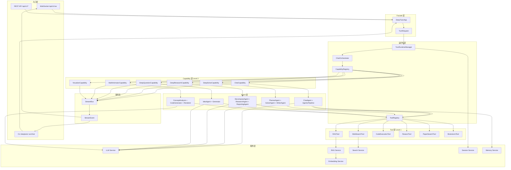
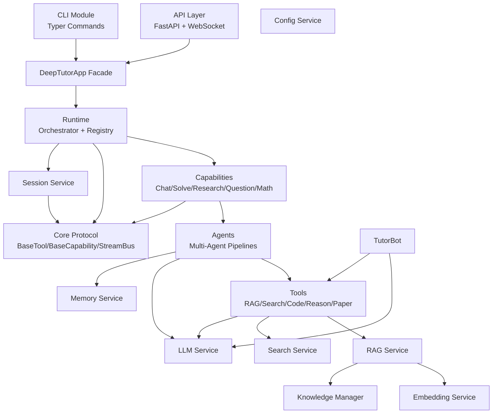
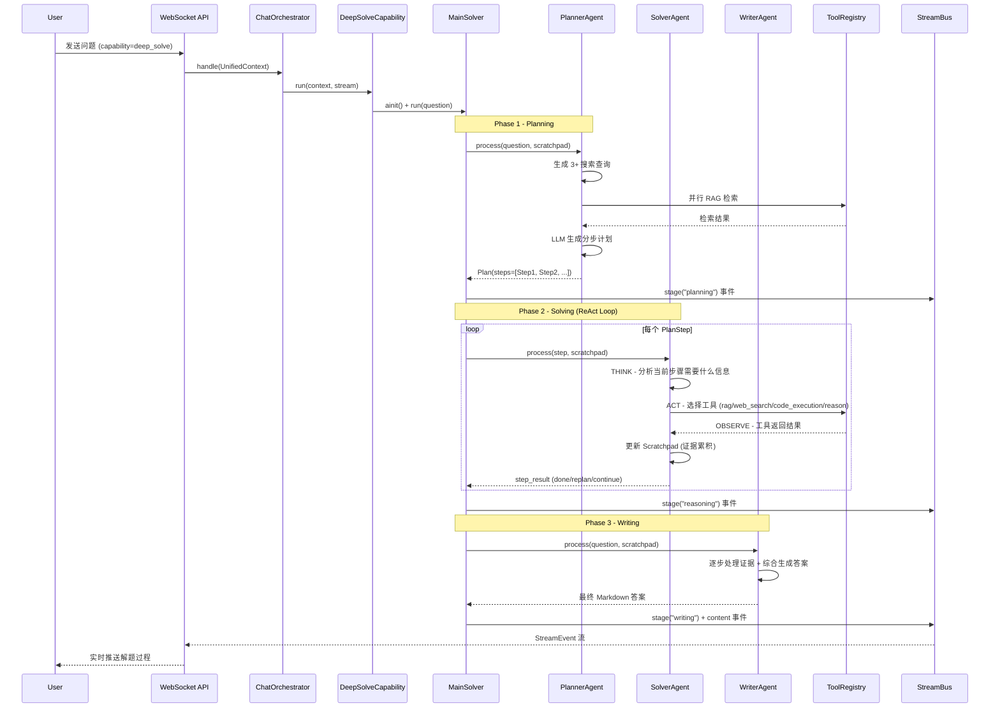
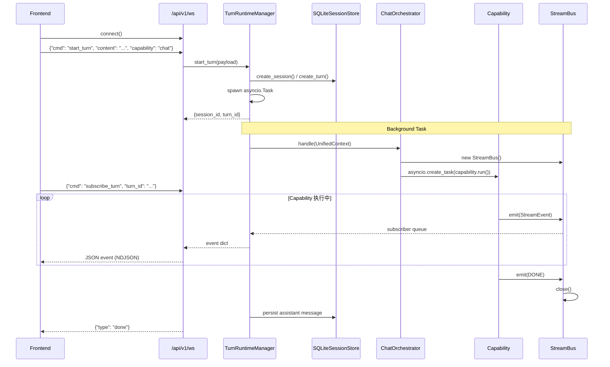

# DeepTutor 源码学习笔记

> 仓库地址：[DeepTutor](https://github.com/HKUDS/DeepTutor)
> 学习日期：2026/04/14

---

> **以下为 AI 源码分析**
>
> ### 一句话概括
>
> DeepTutor 是一个 Agent-Native 的个性化 AI 教学平台，采用两层插件架构（Tools + Capabilities），通过多 Agent 协作实现对话、深度解题、研究报告、测验生成、数学动画等教育功能。
>
> ### 要点速览
>
> | 核心模块 | 职责 | 关键文件 |
> |---------|------|---------|
> | Core Protocol | 定义 Tool/Capability 抽象协议与事件流 | `deeptutor/core/` |
> | Runtime | Capability/Tool 注册与请求编排 | `deeptutor/runtime/` |
> | Agents | 多 Agent 管道（Solve/Research/Question/Chat 等） | `deeptutor/agents/` |
> | Capabilities | 将 Agent 管道封装为标准 Capability 入口 | `deeptutor/capabilities/` |
> | Services | LLM/Embedding/RAG/Search/Session 等基础设施 | `deeptutor/services/` |
> | TutorBot | 自治 Agent 循环，支持多渠道、技能学习、定时任务 | `deeptutor/tutorbot/` |
> | API | FastAPI + WebSocket 实时通信 | `deeptutor/api/` |
> | CLI | Typer 命令行，支持单次执行与交互式 REPL | `deeptutor_cli/` |
> | Web | Next.js 16 + React 19 前端 | `web/` |

---

## 项目简介

DeepTutor 是由香港大学数据智能实验室（HKUDS）开发的开源 AI 教学平台。它以 **Agent-Native** 的理念重新设计，将传统聊天机器人升级为具备自主工具使用、多 Agent 协作和持久记忆能力的智能教学系统。核心价值在于：五种模式（Chat、Deep Solve、Quiz、Deep Research、Math Animator）共享统一上下文，用户可在同一对话线程中自由切换；TutorBot 系统提供独立工作空间、个性化人格和定时主动学习提醒；完整的知识库管理和 RAG 能力让上传的文档真正参与到每一次对话中。

## 技术栈

| 类别 | 技术 |
|------|------|
| 语言 | Python 3.11+, TypeScript 5 |
| 后端框架 | FastAPI + Uvicorn (WebSocket 实时通信) |
| 前端框架 | Next.js 16 + React 19, Tailwind CSS 3 |
| LLM 集成 | OpenAI SDK, Anthropic SDK（支持 30+ Provider） |
| RAG 引擎 | LlamaIndex |
| 数据库 | SQLite (aiosqlite 异步) |
| CLI 框架 | Typer + Rich + prompt_toolkit |
| 依赖管理 | pip (setuptools) + npm |
| 测试框架 | pytest (后端) + Playwright (前端 E2E) |
| 部署 | Docker (多阶段构建) + Supervisor |
| 数学动画 | Manim (Mathematical Animation Engine) |
| 可视化 | Chart.js, Mermaid, Cytoscape |

## 目录结构

```
DeepTutor/
├── deeptutor/                  # 后端核心包
│   ├── core/                   # 协议层：Capability/Tool 抽象、StreamBus 事件流
│   ├── runtime/                # 运行时：Orchestrator 编排、Registry 注册中心
│   │   ├── registry/           #   Capability 和 Tool 注册表
│   │   └── bootstrap/          #   内置 Capability 类路径映射
│   ├── agents/                 # Agent 层：各能力的多 Agent 管道实现
│   │   ├── base_agent.py       #   统一 Agent 基类（LLM/Prompt/Config 管理）
│   │   ├── chat/               #   Chat Agent + Agentic Pipeline
│   │   ├── solve/              #   Deep Solve（Plan → ReAct → Write 三阶段）
│   │   ├── research/           #   Deep Research（Decompose → Research → Report）
│   │   ├── question/           #   Quiz Generation（Ideation → Generation）
│   │   ├── math_animator/      #   Math Animator（Analysis → Design → CodeGen → Render）
│   │   ├── guide/              #   Guided Learning（Design → Interactive Pages）
│   │   ├── co_writer/          #   Co-Writer（AI 辅助 Markdown 编辑）
│   │   └── visualize/          #   Visualize（Chart.js/SVG 渲染管道）
│   ├── capabilities/           # Capability 封装层：将 Agent 管道适配为标准接口
│   ├── tools/                  # Tool 实现：RAG、Web Search、Code Execution 等
│   │   └── builtin/            #   7 个内置 Tool 的统一注册
│   ├── services/               # 服务层：跨模块共享的基础设施
│   │   ├── llm/                #   多 Provider LLM 抽象（Factory + Registry + Retry）
│   │   ├── embedding/          #   Embedding 客户端（多适配器）
│   │   ├── rag/                #   RAG 管道（LlamaIndex Pipeline）
│   │   ├── search/             #   Web Search（10+ Provider）
│   │   ├── session/            #   Session 管理 + Turn Runtime
│   │   ├── memory/             #   持久记忆（Summary + Profile 双文件）
│   │   ├── config/             #   配置加载（YAML + 环境变量）
│   │   └── notebook/           #   笔记本服务
│   ├── tutorbot/               # TutorBot 自治 Agent
│   │   ├── agent/              #   Agent Loop + Context + Skills + SubAgent
│   │   ├── channels/           #   多渠道适配（Telegram/Discord/Slack/飞书等）
│   │   ├── heartbeat/          #   Heartbeat 定时主动提醒
│   │   └── providers/          #   LLM Provider 适配
│   ├── api/                    # FastAPI 应用
│   │   ├── main.py             #   应用入口 + 生命周期管理
│   │   └── routers/            #   17 个 API Router（含 WebSocket）
│   ├── app/                    # Facade 层
│   │   └── facade.py           #   DeepTutorApp 统一外观接口
│   ├── knowledge/              # 知识库管理
│   ├── config/                 # 全局配置 Schema
│   └── logging/                # 日志系统
├── deeptutor_cli/              # CLI 入口（Typer 子命令）
│   ├── main.py                 #   主命令注册
│   ├── chat.py                 #   交互式 REPL
│   ├── kb.py                   #   知识库管理命令
│   └── bot.py                  #   TutorBot 管理命令
├── web/                        # Next.js 前端
│   ├── app/                    #   App Router 页面
│   ├── components/             #   React 组件（chat/quiz/research/notebook 等）
│   ├── context/                #   全局状态（UnifiedChatContext）
│   ├── lib/                    #   工具函数 + API 客户端
│   └── hooks/                  #   自定义 React Hooks
├── tests/                      # 测试套件
├── scripts/                    # 运维脚本（start_tour/migrate 等）
└── Dockerfile                  # 多阶段 Docker 构建
```

## 架构设计

### 整体架构

DeepTutor 采用 **两层插件模型**（Two-Layer Plugin Model）架构：

- **Level 1 — Tools**：原子操作单元（RAG 检索、Web 搜索、代码执行、深度推理等），每个 Tool 实现 `BaseTool` 协议，提供 OpenAI Function Calling 格式的 Schema
- **Level 2 — Capabilities**：多步骤 Agent 管道（Chat、Deep Solve、Deep Research 等），每个 Capability 实现 `BaseCapability` 协议，编排多个 Agent 和 Tool 完成复杂任务

所有请求通过统一的 `UnifiedContext` 流转，经 `ChatOrchestrator` 路由到目标 Capability，执行结果通过 `StreamBus` 异步事件总线推送给消费者（WebSocket / CLI / JSON）。



### 核心模块

#### 1. Core Protocol（协议层）

**职责**：定义整个系统的抽象契约，是所有模块的基石。

**核心文件**：
- `deeptutor/core/capability_protocol.py` — `BaseCapability` 抽象基类 + `CapabilityManifest` 元数据
- `deeptutor/core/tool_protocol.py` — `BaseTool` 抽象基类 + `ToolDefinition` / `ToolResult` / `ToolParameter`
- `deeptutor/core/context.py` — `UnifiedContext` 统一请求信封
- `deeptutor/core/stream.py` — `StreamEvent` + `StreamEventType` 事件定义
- `deeptutor/core/stream_bus.py` — `StreamBus` Fan-out 异步事件总线

**关键接口**：
- `BaseCapability.run(context, stream)` — Capability 执行入口
- `BaseTool.execute(**kwargs) -> ToolResult` — Tool 执行入口
- `BaseTool.get_definition() -> ToolDefinition` — 返回 OpenAI Function Calling Schema
- `StreamBus.emit(event)` / `StreamBus.subscribe()` — 事件发布/订阅

#### 2. Runtime（运行时层）

**职责**：管理 Capability 和 Tool 的注册、查找，以及请求到 Capability 的路由编排。

**核心文件**：
- `deeptutor/runtime/orchestrator.py` — `ChatOrchestrator`，将 `UnifiedContext` 路由到目标 Capability 并管理 StreamBus 生命周期
- `deeptutor/runtime/registry/capability_registry.py` — `CapabilityRegistry`，全局 Capability 注册表（懒加载内置 + 插件发现）
- `deeptutor/runtime/registry/tool_registry.py` — `ToolRegistry`，全局 Tool 注册表（别名解析 + Prompt Hints 组装）

**关键设计**：
- `ChatOrchestrator.handle(context)` 是整个系统的核心路由方法：创建 StreamBus → 查找 Capability → 启动异步 Task → 以 AsyncIterator 方式 yield 事件
- `ToolRegistry` 支持别名解析（如 `rag_search` → `rag`），实现向后兼容

#### 3. Agents（Agent 层）

**职责**：实现各 Capability 的具体多 Agent 管道逻辑。

**核心文件**：
- `deeptutor/agents/base_agent.py` — `BaseAgent` 统一基类，封装 LLM 调用、Prompt 管理、配置加载、Token 追踪、Trace 回调
- `deeptutor/agents/solve/main_solver.py` — `MainSolver`，Deep Solve 的主编排器
- `deeptutor/agents/research/research_pipeline.py` — `ResearchPipeline`，Deep Research 的主编排器
- `deeptutor/agents/chat/agentic_pipeline.py` — `AgenticChatPipeline`，Chat 的 Agentic 管道

**与其他模块的关系**：Agent 层是 Capability 层的实现细节，通过 `BaseAgent` 消费 Services 层的 LLM/Prompt 服务，通过 `ToolRegistry` 调用 Tool 层。

#### 4. Services（服务层）

**职责**：提供跨模块共享的基础设施（LLM、Embedding、RAG、搜索、Session、Memory 等）。

**核心文件**：
- `deeptutor/services/llm/factory.py` — LLM 工厂函数 `complete()` / `stream()`，自动路由到 Cloud/Local/SDK Provider
- `deeptutor/services/llm/providers/` — OpenAI / Anthropic 等 Provider 实现
- `deeptutor/services/rag/service.py` — `RAGService`，封装 LlamaIndex 的知识库初始化和检索
- `deeptutor/services/session/turn_runtime.py` — `TurnRuntimeManager`，Turn 级后台执行 + 事件多路复用
- `deeptutor/services/session/sqlite_store.py` — `SQLiteSessionStore`，会话和 Turn 持久化
- `deeptutor/services/memory/service.py` — `MemoryService`，双文件记忆系统（Summary + Profile）

**关键设计**：采用 Singleton 工厂模式（如 `get_llm_client()`、`get_embedding_client()`），结合懒加载避免启动时导入重量级 SDK。

#### 5. TutorBot（自治 Agent 系统）

**职责**：基于 nanobot 引擎的独立 Agent 实例，拥有独立工作空间、记忆、人格和技能。

**核心文件**：
- `deeptutor/tutorbot/agent/loop.py` — `AgentLoop` 核心消息循环（最多 40 轮迭代，并行执行最多 8 个 Tool）
- `deeptutor/tutorbot/agent/context.py` — `ContextBuilder` 系统提示构建
- `deeptutor/tutorbot/agent/skills.py` — Skill 文件发现与加载
- `deeptutor/tutorbot/heartbeat/service.py` — `HeartbeatService` 定时主动提醒
- `deeptutor/tutorbot/channels/` — 多渠道适配（Telegram/Discord/Slack/飞书/钉钉/WeChat Work 等）

### 模块依赖关系



## 核心流程

### 流程一：Deep Solve 多 Agent 解题流程

Deep Solve 是 DeepTutor 最复杂的 Capability，采用 **Plan → ReAct → Write** 三阶段多 Agent 管道。用户提出问题后，系统自动分解为多步计划，每步通过 ReAct 循环（Think → Act → Observe）调用工具收集证据，最终由 Writer Agent 综合生成完整答案。



**关键设计**：
1. **Scratchpad 共享记忆**：`deeptutor/agents/solve/memory/scratchpad.py` 中的 `Scratchpad` 类累积计划、每步的 Thought → Action → Observation，让后续 Agent 能看到完整推理链
2. **Replan 机制**：SolverAgent 在 ReAct 循环中如发现计划不合理，可触发 `replan` 动作，由 PlannerAgent 重新规划
3. **Trace Bridge**：Capability 层通过 `_trace_bridge()` 回调将 Agent 内部 trace 事件（LLM 调用、工具调用）翻译为标准 `StreamEvent`，推送到 `StreamBus`

### 流程二：Unified WebSocket Turn 执行流程

这是所有 Capability 共享的请求执行基础设施。前端通过单一 WebSocket 端点统一处理所有模式的请求和实时事件推送。



**关键设计**：
1. **Turn 后台执行**：每个 Turn 在独立的 `asyncio.Task` 中运行，前端可随时 subscribe/unsubscribe，支持断线重连后从指定 `after_seq` 恢复
2. **StreamBus Fan-out**：多个消费者（WebSocket、CLI、日志记录器）可同时订阅同一个 StreamBus，互不干扰
3. **事件持久化**：`TurnRuntimeManager` 在 Turn 完成后将最终 assistant 消息持久化到 `SQLiteSessionStore`，支持会话恢复

## 关键设计亮点

### 1. 两层插件模型（Tools + Capabilities）

**解决的问题**：教育场景需要灵活组合原子工具（搜索、代码执行）和复杂工作流（多 Agent 解题），如何设计一个既能独立扩展工具又能独立扩展工作流的架构？

**实现方式**：
- **Level 1 Tools**（`deeptutor/core/tool_protocol.py`）：每个 Tool 实现 `BaseTool`，提供 `ToolDefinition`（OpenAI Function Calling Schema）和 `execute()` 方法，通过 `ToolRegistry` 统一管理
- **Level 2 Capabilities**（`deeptutor/core/capability_protocol.py`）：每个 Capability 实现 `BaseCapability`，提供 `CapabilityManifest`（名称、阶段、使用的 Tool 列表）和 `run(context, stream)` 方法
- Tool 和 Capability 完全解耦：任何 Capability 可以自由组合任意 Tool，用户也可在运行时选择启用哪些 Tool

**设计理由**：这种分层设计让新增一个 Tool（如论文搜索）不需要修改任何 Capability 代码，新增一个 Capability（如 Visualize）也不需要新建 Tool。工具是可组合的积木，工作流是积木的编排方式。

### 2. StreamBus Fan-out 事件总线

**解决的问题**：多 Agent 管道的中间过程（计划、推理、工具调用）需要实时推送给前端显示，同时 CLI 和 JSON 日志也需要消费同样的事件流，如何避免耦合？

**实现方式**（`deeptutor/core/stream_bus.py`）：
- `StreamBus` 使用 `asyncio.Queue` 实现 Fan-out 发布/订阅模式
- 每个消费者调用 `subscribe()` 获得独立的 `AsyncIterator`，先回放历史事件再监听新事件
- `close()` 发送 `None` 哨兵通知所有订阅者流结束
- 提供便捷方法：`stage()`（上下文管理器）、`content()`、`thinking()`、`tool_call()` 等

**设计理由**：Agent 内部只需关心「发出事件」，无需知道谁在消费。WebSocket 推送、CLI 渲染、JSON 日志记录完全解耦，新增消费者零修改。

### 3. BaseAgent 统一基类 + Trace 回调链

**解决的问题**：系统有 20+ 个 Agent（Planner、Solver、Writer、Decompose、Research、Reporting...），如何避免 LLM 配置、Prompt 加载、Token 追踪等公共逻辑在每个 Agent 中重复？

**实现方式**（`deeptutor/agents/base_agent.py`）：
- `BaseAgent` 封装：LLM Config 加载（多优先级链：agent_config → llm_config → env）、PromptManager 初始化（按 module/agent/language 加载 YAML）、LLMStats Token 追踪、Trace 回调注册
- 每个 LLM 调用通过 `_emit_trace_event()` 发出结构化 trace 元数据（包含 call_id、phase、label、call_kind）
- Capability 层通过 `set_trace_callback()` 注册回调，将 Agent trace 翻译为 StreamBus 事件

**设计理由**：Template Method 模式让子类只需实现 `process()` 业务逻辑，公共基础设施由基类统一提供。Trace 回调链实现了 Agent 内部推理过程的完整可观测性，而不需要 Agent 知道 StreamBus 的存在。

### 4. TurnRuntimeManager 后台执行 + 多路复用

**解决的问题**：AI 生成可能耗时数十秒甚至数分钟（Deep Research 涉及多轮并行搜索），前端 WebSocket 连接不稳定，如何支持断线重连和多客户端同时观看？

**实现方式**（`deeptutor/services/session/turn_runtime.py`）：
- 每个 Turn 在独立 `asyncio.Task` 中后台执行，`start_turn()` 立即返回 `(session, turn)` 元数据
- `subscribe_turn(turn_id, after_seq)` 支持从指定序列号恢复订阅，客户端断线重连后不丢失事件
- 多个 subscriber 可同时订阅同一个 Turn（教师和学生同时观看解题过程）
- Turn 完成后最终消息持久化到 SQLite，支持历史回放

**设计理由**：将「执行」与「观察」解耦。前端无需维持长连接才能获取结果，断线重连后通过 `after_seq` 参数精确续传。这也为未来的多用户协作奠定基础。

### 5. 多 Provider LLM 抽象（Factory + Capability Matrix）

**解决的问题**：支持 30+ LLM Provider（OpenAI、Anthropic、DeepSeek、Ollama、vLLM 等），每个 Provider 的 API 格式、能力（是否支持 vision/tools/streaming）、限制各不相同。

**实现方式**：
- `deeptutor/services/llm/factory.py` — 统一工厂函数 `complete()` / `stream()`，根据 binding 和 URL 自动路由到 Cloud/Local/SDK Provider
- `deeptutor/services/llm/capabilities.py` — Capability Matrix 集中管理每个 Provider 的能力标记（`supports_vision()`、`supports_tools()`、`supports_response_format()`）
- `deeptutor/services/llm/traffic_control.py` — Token Bucket 限流 + Semaphore 并发控制
- `deeptutor/services/llm/providers/base_provider.py` — Circuit Breaker 熔断 + 指数退避重试

**设计理由**：Agent 代码只调用 `await complete(prompt, ...)` 或 `async for chunk in stream(prompt, ...)`，完全不感知底层 Provider。Capability Matrix 让系统能根据模型能力动态调整行为（如对不支持 tools 的模型降级为 prompt-based 工具调用），而不是硬编码 if-else 分支。
