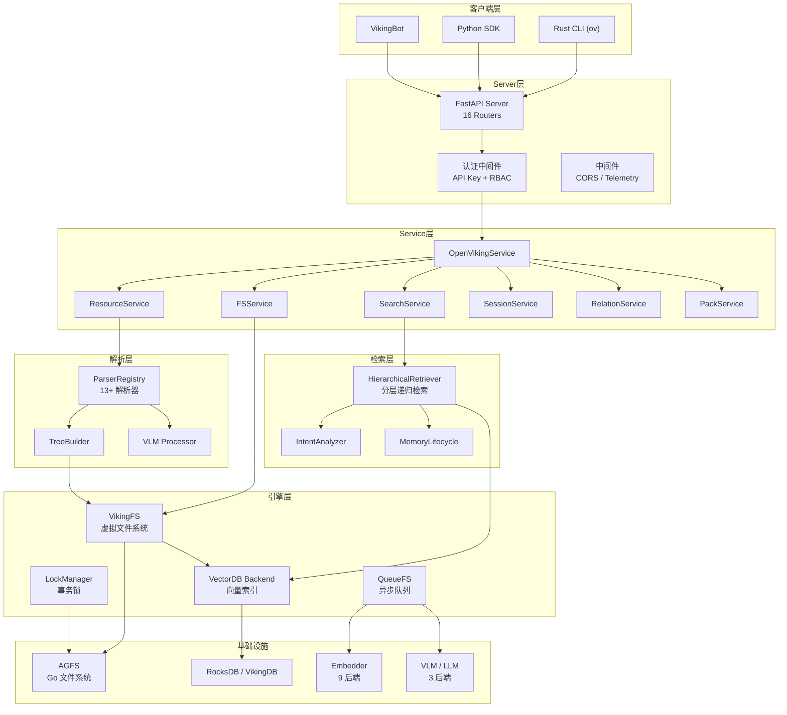
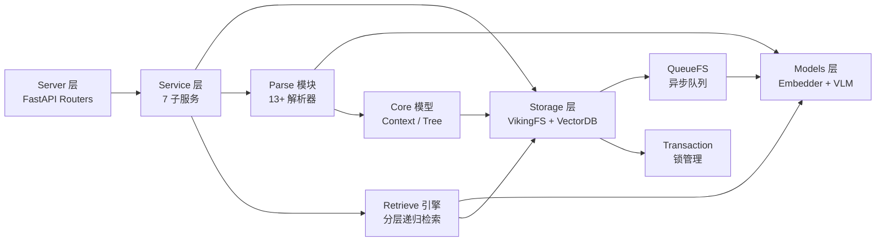
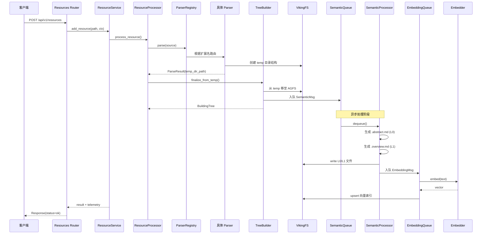
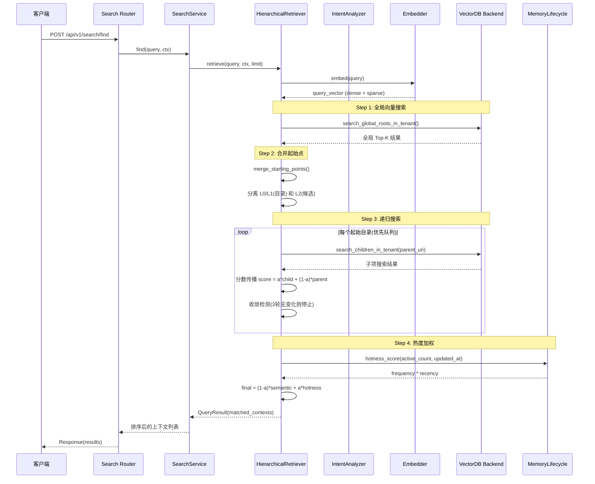

# OpenViking 源码学习笔记

> 仓库地址：[OpenViking](https://github.com/volcengine/OpenViking)
> 学习日期：2026-03-22

---

> **以下为 AI 源码分析**
>
> ### 一句话概括
>
> OpenViking 是字节跳动开源的 AI Agent 上下文数据库，采用文件系统范式统一管理 Agent 的记忆、资源和技能，通过三层上下文（L0/L1/L2）和分层递归检索实现高效、可观测的上下文管理。
>
> ### 要点速览
>
> | 核心模块 | 职责 | 关键文件 |
> |---------|------|---------|
> | Server 层 | FastAPI HTTP 服务，16 个 Router，多租户认证 | `openviking/server/app.py`, `routers/` |
> | Service 层 | 7 个子服务协调业务逻辑 | `openviking/service/core.py` |
> | Storage 层 | VikingFS 虚拟文件系统 + 向量索引后端 | `openviking/storage/viking_fs.py` |
> | Parse 模块 | 13+ 格式解析器，统一资源导入 | `openviking/parse/registry.py` |
> | Retrieve 引擎 | 分层递归检索 + 意图分析 | `openviking/retrieve/hierarchical_retriever.py` |
> | Models 层 | Embedding（9 后端）+ VLM（3 后端）封装 | `openviking/models/` |
> | Rust CLI | 高性能命令行客户端 | `crates/ov_cli/` |
> | VikingBot | AI Agent 框架，多渠道集成 | `bot/vikingbot/` |

---

## 项目简介

OpenViking 是字节跳动火山引擎团队开源的 **Context Database（上下文数据库）**，专为 AI Agent 设计。它解决了 Agent 开发中上下文碎片化、检索效果差、Token 消耗高、上下文不可观测等核心痛点。

项目创新性地采用 **文件系统范式** 替代传统 RAG 的扁平向量存储，将记忆（memories）、资源（resources）和技能（skills）统一组织在 `viking://` 虚拟文件系统下。开发者可以像管理本地文件一样管理 Agent 的"大脑"，通过 `ls`、`find`、`grep` 等熟悉的命令精确操作上下文。

## 技术栈

| 类别 | 技术 |
|------|------|
| 语言 | Python 3.10+、Rust、Go、C++ |
| 框架 | FastAPI（Server）、Typer（CLI）、Pydantic（数据模型） |
| 构建工具 | setuptools + CMake + Cargo + Go build |
| 依赖管理 | uv / pip（Python）、Cargo（Rust） |
| 测试框架 | pytest + pytest-asyncio + pytest-cov |
| 向量数据库 | RocksDB（本地）、VikingDB（火山引擎）、HTTP 适配器 |
| LLM 集成 | OpenAI、Volcengine Doubao、LiteLLM（统一多后端） |

## 目录结构

```
OpenViking/
├── openviking/                    # Python 主包 - 核心业务逻辑
│   ├── server/                    # FastAPI HTTP 服务层
│   │   ├── app.py                 #   应用创建与生命周期管理
│   │   ├── bootstrap.py           #   服务器启动入口
│   │   ├── routers/               #   16 个 API 路由模块
│   │   ├── auth.py                #   认证中间件（API Key + 角色）
│   │   └── api_keys.py            #   多租户 API Key 管理
│   ├── service/                   # 业务服务层（7 个子服务）
│   │   ├── core.py                #   OpenVikingService 主入口
│   │   ├── fs_service.py          #   文件系统操作
│   │   ├── resource_service.py    #   资源添加与管理
│   │   ├── search_service.py      #   语义搜索
│   │   ├── session_service.py     #   会话管理与记忆提取
│   │   └── task_tracker.py        #   后台任务追踪
│   ├── storage/                   # 存储引擎层
│   │   ├── viking_fs.py           #   VikingFS 虚拟文件系统
│   │   ├── viking_vector_index_backend.py  # 向量索引后端
│   │   ├── vikingdb_manager.py    #   向量数据库管理器
│   │   ├── vectordb_adapters/     #   多后端适配器（local/http/volcengine）
│   │   ├── queuefs/              #   异步队列系统（Embedding/Semantic）
│   │   └── transaction/          #   事务与锁管理
│   ├── parse/                     # 解析模块
│   │   ├── registry.py            #   解析器注册表（自动路由）
│   │   ├── tree_builder.py        #   树构建器（v5.0 架构）
│   │   ├── parsers/               #   13+ 格式解析器
│   │   └── vlm.py                 #   VLM 多模态处理
│   ├── retrieve/                  # 检索引擎
│   │   ├── hierarchical_retriever.py  # 分层递归检索
│   │   ├── intent_analyzer.py     #   意图分析器
│   │   └── memory_lifecycle.py    #   记忆热度计分
│   ├── core/                      # 核心数据模型
│   │   ├── context.py             #   Context 统一上下文模型
│   │   ├── directories.py         #   预设目录结构定义
│   │   └── building_tree.py       #   树构建容器
│   ├── models/                    # LLM/Embedding 模型封装
│   │   ├── embedder/              #   9 种 Embedding 后端
│   │   └── vlm/                   #   3 种 VLM 后端
│   ├── utils/                     # 工具模块
│   │   ├── resource_processor.py  #   资源处理协调器
│   │   ├── skill_processor.py     #   技能处理器
│   │   └── summarizer.py          #   摘要生成器
│   └── prompts/                   # Prompt 模板管理
├── crates/ov_cli/                 # Rust CLI 客户端
│   └── src/                       #   高性能命令行工具
├── bot/vikingbot/                 # VikingBot AI Agent 框架
│   ├── agent/                     #   智能体实现
│   ├── channels/                  #   多渠道集成
│   └── bus/                       #   事件总线
├── third_party/agfs/              # AGFS 分布式文件系统（Go 实现）
├── src/                           # C++ 扩展（向量引擎）
├── examples/                      # 示例代码
└── docs/                          # 文档
```

## 架构设计

### 整体架构

OpenViking 采用 **分层架构**，从上到下分为：CLI/API 层 → Server 层 → Service 层 → 存储引擎层。核心设计理念是将所有上下文统一到 `viking://` 虚拟文件系统中，通过 L0/L1/L2 三级上下文按需加载，配合分层递归检索实现高效的上下文管理。



### 核心模块

#### 1. Server 层 (`openviking/server/`)

**职责**：提供 HTTP API 服务，处理认证、路由分发、异常处理和 Telemetry。

**核心文件**：
- `app.py` — `create_app()` 创建 FastAPI 应用，管理生命周期（startup/shutdown）
- `bootstrap.py` — 解析命令行参数，启动 uvicorn 服务器
- `auth.py` — `resolve_identity()` 认证链：提取 API Key → 解析身份 → 构建 `RequestContext`
- `api_keys.py` — `APIKeyManager` 多租户 API Key 管理，Argon2id 哈希
- `routers/` — 16 个路由模块覆盖所有 API

**关键 API Endpoints**：

| Router | 主要接口 | 功能 |
|--------|---------|------|
| `system` | `GET /health`, `GET /api/v1/system/status` | 健康检查、系统状态 |
| `resources` | `POST /api/v1/resources` | 添加资源（文件/URL/目录） |
| `filesystem` | `GET /api/v1/fs/ls`, `GET /api/v1/fs/tree` | 文件系统操作 |
| `content` | `GET /api/v1/content/read`, `POST /api/v1/content/reindex` | 内容读取与索引 |
| `search` | `POST /api/v1/search/find`, `POST /api/v1/search/grep` | 语义搜索与模式匹配 |
| `sessions` | `POST /api/v1/sessions`, `POST .../commit` | 会话管理与记忆提取 |
| `admin` | `POST /api/v1/admin/accounts` | 多租户账户管理 |

#### 2. Service 层 (`openviking/service/`)

**职责**：协调业务逻辑，管理基础设施生命周期，组合 7 个子服务。

**核心类 `OpenVikingService`**（`core.py`）初始化流程：
1. 加载配置 → 初始化存储基础设施（AGFS、VectorDB、QueueManager、LockManager）
2. 初始化 Embedder → 创建 7 个子服务实例
3. `initialize()` 启动 VikingFS、QueueManager workers、WatchScheduler
4. 注入 ResourceProcessor、SkillProcessor、SessionCompressor 到子服务

**子服务职责**：
- `FSService` — 代理 VikingFS 的 ls/tree/stat/mkdir/rm/mv/read/grep/glob 操作
- `ResourceService` — 协调资源添加、Watch 机制、索引构建
- `SearchService` — `find()`（纯语义搜索）和 `search()`（会话增强搜索）
- `SessionService` — 会话 CRUD、消息追加、异步 commit 与记忆提取
- `RelationService` — 资源间关系的 link/unlink
- `PackService` — .ovpack 格式的 export/import
- `DebugService` — 健康检查

#### 3. Storage 层 (`openviking/storage/`)

**职责**：提供虚拟文件系统抽象和向量索引后端。

**VikingFS**（`viking_fs.py`）— 核心虚拟文件系统：
- URI 规范化处理（`viking://` 协议）
- 代理 AGFS 的文件操作（read/write/mkdir/rm/mv）
- L0/L1 上下文读取（`.abstract.md` / `.overview.md`）
- 关系管理（`.relations.json`）
- 删除/移动时自动同步向量索引

**VikingVectorIndexBackend**（`viking_vector_index_backend.py`）— 向量存储：
- 租户隔离：`_SingleAccountBackend` 强制 `account_id` 过滤
- 共享 Adapter 设计：所有租户共享同一 RocksDB 实例，避免锁竞争
- 支持 Dense + Sparse 混合向量搜索
- 活跃度追踪：`increment_active_count()` 更新访问计数

**QueueFS**（`queuefs/`）— 异步队列系统：
- `EmbeddingQueue` — 异步 Embedding 处理
- `SemanticQueue` — 语义处理（LLM 调用生成 L0/L1）
- `SemanticDAG` — DAG 依赖管理，确保处理顺序

**事务管理**（`transaction/`）：
- `LockManager` — 支持 point/subtree/move 三种路径锁
- `LockContext` — 上下文管理器，确保原子操作
- Redo Log — 故障恢复机制

#### 4. Parse 模块 (`openviking/parse/`)

**职责**：将 13+ 种格式的文件统一解析为树结构。

**三阶段处理架构（v5.0）**：
1. **Phase 1**：Parser 创建 temp 目录结构（不调用 LLM）
2. **Phase 2**：TreeBuilder 从 temp 移至 AGFS，入队 SemanticQueue
3. **Phase 3**：SemanticProcessor 异步生成 L0/L1，向量化

**ParserRegistry**（`registry.py`）— 自动路由：
- 根据文件扩展名自动选择解析器
- 支持自定义解析器注册（Protocol/Callback/Direct）

**内置解析器**：Markdown、PDF（dual strategy: local/MinerU）、HTML、Word、Excel、PowerPoint、EPUB、Code Repository（Git/ZIP）、Directory、Image、Audio、Video

#### 5. Retrieve 引擎 (`openviking/retrieve/`)

**职责**：实现高效的分层递归检索。

**HierarchicalRetriever**（`hierarchical_retriever.py`）核心算法：
1. **全局向量搜索** — 在 L0/L1/L2 中查找相关根目录
2. **起始点合并** — 全局搜索结果 + 根目录 URI，按分数排序
3. **递归搜索** — 从起始点向下遍历子目录，分数传播：`score = α × child + (1-α) × parent`
4. **热度加权** — `hotness = frequency × recency`，混合得分：`(1-α) × semantic + α × hotness`

### 模块依赖关系



## 核心流程

### 流程一：资源添加（Add Resource）

这是 OpenViking 最核心的写入流程，涵盖了从用户输入到上下文索引的完整链路。



**关键步骤说明**：
1. **路由分发**：`ParserRegistry` 根据文件扩展名或 URL 类型自动选择解析器
2. **三阶段处理**：Parser 只负责结构化（Phase 1），TreeBuilder 负责持久化（Phase 2），SemanticProcessor 负责语义理解（Phase 3）
3. **异步解耦**：L0/L1 生成和向量化通过 QueueFS 异步执行，不阻塞主请求
4. **Wait 模式**：`wait=True` 时同步等待所有异步处理完成

### 流程二：语义搜索（Hierarchical Retrieve）

分层递归检索是 OpenViking 的核心创新，实现了"锁定高分目录，逐层精炼内容"的检索策略。



**关键算法参数**：
- `SCORE_PROPAGATION_ALPHA = 0.5` — 子目录分数传播权重
- `MAX_CONVERGENCE_ROUNDS = 3` — 最大收敛轮数
- `HOTNESS_ALPHA = 0.2` — 热度权重占比
- `GLOBAL_SEARCH_TOPK = 5` — 全局搜索返回数量
- 热度衰减半衰期：7 天

## 关键设计亮点

### 1. 文件系统范式的上下文管理

**解决的问题**：传统 RAG 将上下文存储为扁平的向量切片，缺乏层次结构和全局视图，导致检索效果差且难以管理。

**实现方式**：通过 `viking://` 虚拟文件系统协议（`openviking/storage/viking_fs.py`），将所有上下文映射为目录和文件。资源、记忆、技能分别对应 `viking://resources/`、`viking://user/memories/`、`viking://agent/skills/` 三个命名空间。每个上下文节点都有唯一 URI，支持 `ls`、`find`、`grep`、`tree` 等标准文件操作。

**为什么这样设计**：文件系统是开发者最熟悉的信息组织方式，天然支持层次化浏览和精确定位。将上下文映射为文件系统操作，让 Agent 可以像开发者一样确定性地操作信息，而非完全依赖模糊的语义匹配。

### 2. L0/L1/L2 三层上下文按需加载

**解决的问题**：将大量上下文一次性塞入 prompt 不仅昂贵，还容易超出模型窗口或引入噪声。

**实现方式**：资源写入时，`SemanticProcessor`（通过 `openviking/storage/queuefs/`）异步生成三层内容：
- **L0（Abstract）**：一句话摘要（≤256 字符），存储为 `.abstract.md`，用于快速筛选
- **L1（Overview）**：核心信息概览（≤4000 字符），存储为 `.overview.md`，用于 Agent 规划决策
- **L2（Detail）**：完整原始内容，仅在 Agent 深入阅读时加载

**为什么这样设计**：模拟人类阅读习惯——先看标题（L0），再看摘要（L1），确认相关后才阅读全文（L2）。实验数据显示，集成 OpenViking 后 input token 成本降低 83%-96%。

### 3. 分层递归检索策略

**解决的问题**：单一向量检索难以处理复杂查询意图，平坦检索缺乏上下文的全局理解。

**实现方式**：`HierarchicalRetriever`（`openviking/retrieve/hierarchical_retriever.py`）实现了"锁定高分目录，逐层精炼"的递归策略：先全局向量搜索定位到相关目录，再在目录内进行二次检索，如有子目录则递归深入。分数通过 `α × child + (1-α) × parent` 在父子节点间传播，结合 `hotness_score`（频率 × 时间衰减）进行最终排序。

**为什么这样设计**：利用目录层次结构作为天然的语义分组，先粗后细地缩小搜索范围。收敛检测机制（3 轮无变化停止）避免不必要的深层递归，平衡检索质量与延迟。

### 4. 多格式统一解析的三阶段架构

**解决的问题**：Agent 需要处理多种格式（PDF、代码仓、网页、Office 文档等），解析逻辑与语义处理耦合会导致系统复杂度爆炸。

**实现方式**：`ParserRegistry`（`openviking/parse/registry.py`）采用注册表模式管理 13+ 解析器，通过三阶段流水线解耦处理过程：
- **Phase 1**（Parser）：纯结构化解析，创建 temp 目录，不调用 LLM
- **Phase 2**（TreeBuilder）：从 temp 移至持久存储，入队语义处理
- **Phase 3**（SemanticProcessor）：异步生成 L0/L1、向量化

**为什么这样设计**：将 LLM 调用延迟到 Phase 3 并异步化，使资源添加可以快速返回。解析器只关注格式转换，语义处理统一由 SemanticQueue 调度，降低各模块间耦合。

### 5. 多租户隔离与安全设计

**解决的问题**：企业级场景需要租户间数据隔离和细粒度的访问控制。

**实现方式**：
- **认证链**（`openviking/server/auth.py`）：`resolve_identity()` → `get_request_context()` → `RequestContext` 流传至所有 Service 和 Storage 操作
- **API Key 管理**（`openviking/server/api_keys.py`）：两级存储（全局账户 + 每账户用户），Argon2id 哈希，前缀索引加速查找
- **向量隔离**（`openviking/storage/viking_vector_index_backend.py`）：`_SingleAccountBackend` 在每次查询时强制注入 `account_id` 过滤条件
- **安全验证**：未设置 `root_api_key` 时强制绑定 localhost，防止暴露未认证 API

**为什么这样设计**：通过 `RequestContext` 在请求全链路流转 tenant 信息，无需在每个业务逻辑中手动处理隔离。向量层的 Proxy 模式（`VikingDBManagerProxy`）对上层透明，既保证安全又保持 API 简洁。
