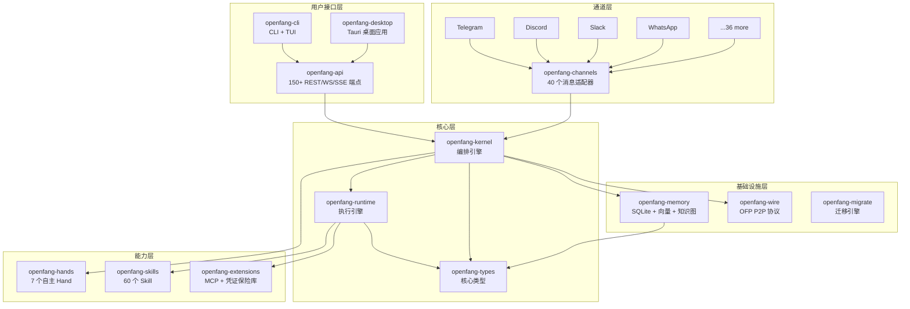
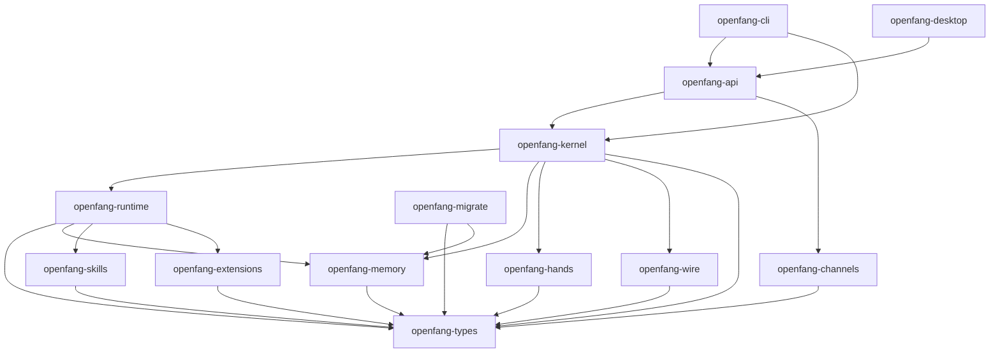
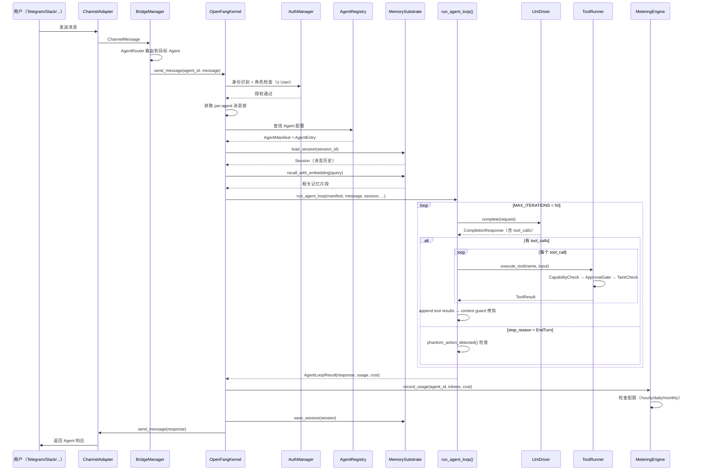
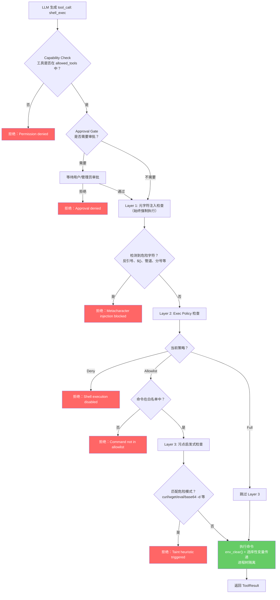

# OpenFang 源码学习笔记

> 仓库地址：[OpenFang](https://github.com/RightNow-AI/openfang)
> 学习日期：2026-03-22

---

> **以下为 AI 源码分析**
>
> ### 一句话概括
>
> OpenFang 是一个用 Rust 编写的开源 Agent Operating System，通过 14 个模块化 crate 实现了自主 Agent 编排、40 个消息通道适配器、16 层纵深安全体系和 WASM 沙箱隔离执行。
>
> ### 要点速览
>
> | 核心模块 | 职责 | 关键文件 |
> |---------|------|---------|
> | openfang-kernel | Agent 编排、工作流引擎、RBAC、调度、预算追踪 | `crates/openfang-kernel/src/kernel.rs` |
> | openfang-runtime | Agent 循环、LLM 驱动、53 个内置工具、WASM 沙箱 | `crates/openfang-runtime/src/agent_loop.rs` |
> | openfang-api | 150+ REST/WS/SSE 端点、Dashboard SPA、OpenAI 兼容 API | `crates/openfang-api/src/server.rs` |
> | openfang-channels | 40 个消息平台适配器、路由、速率限制 | `crates/openfang-channels/src/types.rs` |
> | openfang-memory | SQLite 持久化、向量嵌入、知识图谱、Session 管理 | `crates/openfang-memory/src/substrate.rs` |
> | openfang-types | 核心类型、污点追踪、Ed25519 签名、Model Catalog | `crates/openfang-types/src/agent.rs` |
> | openfang-hands | 7 个自主 Hand 包、HAND.toml 解析、生命周期管理 | `crates/openfang-hands/src/lib.rs` |
> | openfang-skills | 60 个 Skill、Prompt 注入扫描、FangHub 市场 | `crates/openfang-skills/src/verify.rs` |
> | openfang-extensions | 25 个 MCP 模板、AES-256-GCM 凭证保险库、OAuth2 PKCE | `crates/openfang-extensions/src/vault.rs` |
> | openfang-wire | OFP P2P 协议、HMAC-SHA256 双向认证 | `crates/openfang-wire/src/peer.rs` |
> | openfang-cli | CLI + TUI 仪表板、Daemon 管理、MCP Server 模式 | `crates/openfang-cli/src/main.rs` |
> | openfang-desktop | Tauri 2.0 桌面应用、系统托盘、全局快捷键 | `crates/openfang-desktop/src/lib.rs` |
> | openfang-migrate | OpenClaw/LangChain/AutoGPT 迁移引擎 | `crates/openfang-migrate/src/lib.rs` |
> | xtask | 构建自动化 | `xtask/src/main.rs` |

---

## 项目简介

OpenFang 是一个开源的 **Agent Operating System**（Agent 操作系统），不同于传统的聊天机器人框架或 LLM 封装库，它是一个从底层用 Rust 构建的完整运行时系统。核心理念是让 AI Agent 不再等待用户输入，而是以 **自主模式（Autonomous）** 7x24 运行——按计划执行任务、构建知识图谱、监控目标、生成线索，并将结果推送到用户的 Dashboard 或消息通道（Telegram、Slack、WhatsApp 等 40 个平台）。

整个系统编译为 **单一 ~32MB 二进制文件**，包含 137K+ 行代码、14 个 crate、1767+ 个测试，零 clippy 警告。v0.3.30 版本处于 pre-1.0 阶段，架构已趋稳定。

## 技术栈

| 类别 | 技术 |
|------|------|
| 语言 | Rust 1.75+（edition 2021） |
| 框架 | Axum 0.8（HTTP）、Tokio（异步运行时）、Tauri 2.0（桌面） |
| 构建工具 | Cargo workspace（14 crate）、xtask 构建自动化 |
| 依赖管理 | Cargo.toml workspace dependencies |
| 测试框架 | `cargo test`（1767+ 测试）、`tempfile`、`tokio-test` |
| 数据库 | SQLite（rusqlite 0.31，bundled，WAL 模式） |
| 沙箱 | Wasmtime 41（WASM 双重计量沙箱） |
| 加密 | AES-256-GCM、Ed25519（dalek）、Argon2、SHA-256、HMAC-SHA256 |

## 目录结构

```
openfang/
├── Cargo.toml                    # Workspace 根配置，声明 14 个 crate 成员
├── agents/                       # 30+ 预设 Agent 模板
│   ├── assistant/agent.toml      #   通用助手
│   ├── coder/agent.toml          #   编程 Agent
│   ├── researcher/agent.toml     #   研究 Agent
│   └── ...                       #   analyst, debugger, ops 等
├── crates/
│   ├── openfang-kernel/          # 内核：编排、工作流、RBAC、调度、预算
│   │   └── src/
│   │       ├── kernel.rs         #   OpenFangKernel 主结构体
│   │       ├── registry.rs       #   AgentRegistry（ID/名称/标签索引）
│   │       ├── scheduler.rs      #   ResourceQuota 执行
│   │       ├── auth.rs           #   RBAC 用户角色
│   │       ├── workflow.rs       #   多步骤工作流引擎
│   │       ├── metering.rs       #   LLM 成本追踪
│   │       └── ...
│   ├── openfang-runtime/         # 运行时：Agent 循环、LLM 驱动、工具、沙箱
│   │   └── src/
│   │       ├── agent_loop.rs     #   核心 Agent 执行循环
│   │       ├── llm_driver.rs     #   LlmDriver trait
│   │       ├── drivers/          #   Anthropic/OpenAI/Gemini/Copilot 等
│   │       ├── tool_runner.rs    #   53 个内置工具执行器
│   │       ├── sandbox.rs        #   WASM 沙箱
│   │       ├── mcp.rs            #   MCP 客户端
│   │       ├── a2a.rs            #   Agent-to-Agent 协议
│   │       └── ...
│   ├── openfang-api/             # HTTP API：150+ 端点、Dashboard、OpenAI 兼容
│   │   └── src/
│   │       ├── server.rs         #   Daemon 引导、路由注册
│   │       ├── routes.rs         #   REST 路由处理器
│   │       ├── ws.rs             #   WebSocket 实时聊天
│   │       ├── openai_compat.rs  #   /v1/chat/completions 兼容层
│   │       └── rate_limiter.rs   #   GCRA 速率限制
│   ├── openfang-channels/        # 40 个消息通道适配器
│   │   └── src/
│   │       ├── types.rs          #   ChannelAdapter trait
│   │       ├── telegram.rs       #   Telegram Bot API
│   │       ├── discord.rs        #   Discord Gateway
│   │       ├── slack.rs          #   Slack Events API
│   │       └── ...               #   WhatsApp, Signal, Matrix 等 36 个
│   ├── openfang-memory/          # 持久化：SQLite KV、语义搜索、知识图谱
│   ├── openfang-types/           # 核心类型：Agent、Message、Taint、签名
│   ├── openfang-hands/           # 7 个自主 Hand 包（Clip、Lead、Researcher 等）
│   ├── openfang-skills/          # 60 个 Skill、Prompt 注入扫描
│   ├── openfang-extensions/      # MCP 模板、凭证保险库、OAuth2
│   ├── openfang-wire/            # OFP P2P 协议
│   ├── openfang-cli/             # CLI + TUI + MCP Server
│   ├── openfang-desktop/         # Tauri 2.0 桌面应用
│   └── openfang-migrate/         # 迁移引擎
├── docs/                         # 架构文档、API 参考、部署指南
├── sdk/                          # Python / JavaScript SDK
├── packages/whatsapp-gateway/    # WhatsApp Web QR 网关（Node.js）
├── scripts/                      # 安装脚本、Docker
└── xtask/                        # 构建自动化任务
```

## 架构设计

### 整体架构

OpenFang 采用 **分层内核架构（Layered Kernel Architecture）**，核心思想是将 Agent 编排（Kernel）、执行引擎（Runtime）、外部接口（API/Channels）和持久化（Memory）解耦为独立 crate，通过 trait 抽象（如 `KernelHandle`、`LlmDriver`、`ChannelAdapter`）实现模块间的松耦合。

关键设计原则：
- **单二进制部署**：所有 crate 编译为一个 ~32MB 可执行文件
- **Capability-Based Security**：每个 Agent 声明所需能力，内核在执行前强制校验
- **Trait Object 解耦**：Runtime 通过 `KernelHandle` trait 调用内核功能，避免循环依赖
- **Async-First**：全栈 Tokio 异步，CPU 密集型（WASM）通过 `spawn_blocking` 卸载



### 核心模块

#### 1. openfang-kernel — 编排引擎

**职责**：Agent 生命周期管理、工作流编排、RBAC 认证、资源调度、预算追踪、事件总线

**核心文件**：
- `kernel.rs` — `OpenFangKernel` 主结构体，组装所有子系统
- `registry.rs` — `AgentRegistry`：ID/名称/标签三级索引，Agent 状态机（Created → Running → Suspended → Terminated/Crashed）
- `scheduler.rs` — `AgentScheduler`：每小时滑动窗口 token 配额，per-agent 资源限制
- `auth.rs` — `AuthManager`：四级角色（Viewer → User → Admin → Owner），channel binding 将平台身份映射到 OpenFang 用户
- `capabilities.rs` — `CapabilityManager`：deny-by-default，通配符匹配（`memory_read:self.*`）
- `workflow.rs` — `WorkflowEngine`：支持 Sequential、FanOut、Collect、Conditional、Loop 五种执行模式
- `metering.rs` — `MeteringEngine`：SQLite 持久化成本追踪，按小时/日/月配额，27 个 LLM 提供商定价表
- `event_bus.rs` — `EventBus`：broadcast pub/sub，1000 条历史环形缓冲区，支持定向/广播/正则匹配路由

**关键接口**：
- `OpenFangKernel` 实现 `KernelHandle` trait（定义在 openfang-runtime），解耦内核与运行时
- Per-agent 消息锁 `DashMap<AgentId, Arc<Mutex<()>>>` 序列化同一 Agent 的 LLM 调用

#### 2. openfang-runtime — 执行引擎

**职责**：Agent 循环执行、多 LLM 驱动、工具执行、WASM 沙箱、MCP/A2A 协议

**核心文件**：
- `agent_loop.rs` — `run_agent_loop()` 是 Agent 执行的核心入口。流程：记忆召回 → 构建 system prompt → LLM 调用 → 工具执行循环（MAX_ITERATIONS=50）→ 幻觉动作检测 → context guard 修剪 → 保存 Session
- `llm_driver.rs` — `LlmDriver` trait（`complete()` + `stream()`），3 个原生驱动路由到 27 个提供商
- `drivers/` — `anthropic.rs`（Claude 系列）、`openai.rs`（GPT 系列）、`gemini.rs`（Gemini）、`copilot.rs`（GitHub Copilot OAuth）、`fallback.rs`（链式回退）
- `tool_runner.rs` — 53 个内置工具：文件读写、web 获取、shell 执行（三层安全）、Agent 间通信、内存操作、浏览器自动化、媒体处理
- `sandbox.rs` — `WasmSandbox`：Wasmtime 引擎，fuel 计量 + epoch 中断双重机制，Guest/Host ABI 定义
- `context_budget.rs` — 两层 context 预算：per-result 30% 上限 + 全局 75% headroom guard

**关键设计**：
- 幻觉动作检测 `phantom_action_detected()` 捕获 LLM 声称执行了操作但实际未发起 tool call 的情况
- 上下文溢出恢复 `recover_from_overflow()` 自动压缩历史中最旧的 tool result

#### 3. openfang-api — HTTP API 服务器

**职责**：REST/WS/SSE 端点、Dashboard SPA、OpenAI 兼容 API、中间件栈

**核心文件**：
- `server.rs` — `build_router()` 注册 150+ 路由，`run_daemon()` 启动全生命周期（内核初始化 → 后台 Agent → 热重载 → 优雅关闭）
- `routes.rs` — `AppState` 共享状态（持有 `Arc<OpenFangKernel>`），所有路由处理器
- `openai_compat.rs` — `/v1/chat/completions` 端点，Agent 名称映射为 model 字段
- `ws.rs` — WebSocket 实时聊天，每 IP 5 并发、30 分钟空闲超时
- `rate_limiter.rs` — GCRA 算法，500 token/分钟/IP，不同操作权重不同（生成 Agent=50，发消息=30）
- `middleware.rs` — Bearer token / Session cookie 认证、安全头（CSP/HSTS/X-Frame-Options）

#### 4. openfang-channels — 消息通道适配器

**职责**：统一的多平台消息收发、Agent 路由、速率限制、格式转换

**核心文件**：
- `types.rs` — `ChannelAdapter` trait（`start()` + `send_message()` + `send_media()` + `shutdown()`）
- `router.rs` — `AgentRouter`：5 级路由优先级（绑定 > 直接路由 > 用户默认 > 频道默认 > 系统默认）
- `bridge.rs` — `BridgeManager`：启动/停止适配器，`ChannelRateLimiter` per-user 令牌桶
- `formatter.rs` — 平台特定 Markdown 转换（Telegram HTML、Slack mrkdwn、纯文本）
- `telegram.rs` — 示例：Zeroizing token、4096 字符分割、HTML 标签白名单、Forum 主题支持

#### 5. openfang-memory — 持久化基底

**职责**：三层存储（结构化 KV + 语义搜索 + 知识图谱）、Session 管理、记忆衰减

**核心文件**：
- `substrate.rs` — `MemorySubstrate`：统一入口，组装 StructuredStore + SemanticStore + KnowledgeStore + SessionStore + ConsolidationEngine + UsageStore
- `session.rs` — 消息历史存储为 msgpack BLOB
- `semantic.rs` — 向量嵌入余弦相似度召回，回退到 LIKE 文本匹配
- `consolidation.rs` — 7 天未访问记忆自动衰减置信度（最低 0.1，不完全遗忘）

### 模块依赖关系



## 核心流程

### 流程一：用户消息 → Agent 响应（端到端执行流程）

这是 OpenFang 最核心的业务流程，展示了一条消息从通道接收到 Agent 响应返回的完整调用链。



**关键逻辑说明**：
1. **Per-agent 消息锁**：同一 Agent 的 LLM 调用被序列化，防止并发写入导致 Session 损坏
2. **Context Guard**：每次迭代后检查 context 占用，超过 75% headroom 时自动压缩最旧的 tool result
3. **Phantom Action 检测**：在最终响应中检测 LLM 声称"已发送/已执行"但实际未发起 tool call 的幻觉行为
4. **成本追踪**：每次 LLM 调用后实时计算成本（基于 27 个提供商的定价表），超配额时拒绝后续请求

### 流程二：工具执行安全栈（Shell 命令的三层防护）

展示 `shell_exec` 工具从 LLM 生成到最终执行的完整安全检查链。



**三层防护说明**：
1. **Layer 1（元字符检查）**：始终强制，阻止反引号 `` ` ``、`$()`、`${}`、管道 `|&`、链式 `&&`/`||`/`;`、重定向 `<`/`>` 和换行符
2. **Layer 2（Exec Policy）**：Agent 级别策略——Deny（禁止所有命令）、Allowlist（仅允许白名单命令）、Full（无限制，用于 Browser Hand 等需要 curl 的场景）
3. **Layer 3（污点启发式）**：非 Full 模式下检测 `curl`、`wget`、`| sh`、`base64 -d`、`eval` 等数据泄漏/代码注入模式

## 关键设计亮点

### 1. KernelHandle Trait：打破循环依赖的桥接模式

**解决的问题**：`openfang-kernel` 依赖 `openfang-runtime`（启动 Agent 循环），而 `openfang-runtime` 的工具执行（如 `agent_spawn`、`agent_send`）又需要回调内核，形成循环依赖。

**实现方式**：在 `openfang-runtime/src/kernel_handle.rs` 中定义 `KernelHandle` trait，包含 `spawn_agent()`、`send_to_agent()`、`memory_store()`、`request_approval()` 等 20+ 个异步方法。`OpenFangKernel` 在 `openfang-kernel` 中实现该 trait，运行时通过 `Option<Arc<dyn KernelHandle>>` 接收内核引用。

**为什么这样设计**：Rust 的 crate 依赖图必须是 DAG，trait object 是解决循环依赖的标准模式。同时 `Option` 包装允许无内核的独立测试（tool_runner 单元测试无需启动完整内核）。

### 2. 信息流污点追踪：编译时安全的数据流控制

**解决的问题**：LLM Agent 可能被 prompt injection 操纵，将 API 密钥通过 `web_fetch` 泄露，或将外部恶意数据注入 `shell_exec`。

**实现方式**：`openfang-types/src/taint.rs` 定义 5 种污点标签（ExternalNetwork、UserInput、Pii、Secret、UntrustedAgent），`TaintedValue` 结构体携带标签集合。每个 sink（shell_exec、net_fetch、agent_message）声明 blocked_labels，执行前调用 `check_sink()` 验证。标签通过 `merge_taint()` 在数据流中传播，仅可通过显式 `declassify()` 移除。

**为什么这样设计**：参考了经典的信息流控制（IFC）理论。与运行时检查（如 regex 匹配）不同，污点追踪从源头（source）到汇点（sink）完整跟踪数据流，即使经过多次字符串拼接也能捕获违规。

### 3. WASM 双重计量沙箱：Fuel + Epoch 的资源限制

**解决的问题**：第三方 Skill（WASM 模块）可能包含恶意代码——无限循环消耗 CPU、分配大量内存、尝试访问文件系统或网络。

**实现方式**：`openfang-runtime/src/sandbox.rs` 中的 `WasmSandbox` 使用 Wasmtime 引擎，配合两种独立的资源限制机制：
- **Fuel 计量**：每条 WASM 指令消耗 fuel，fuel 耗尽时 trap。精确控制 CPU 预算。
- **Epoch 中断**：独立看门狗线程定期推进 epoch，超时时强制中断。防止单条指令耗时过长（如大内存分配）。
- **能力门控**：Host ABI（`host_call`）在 dispatch 前检查 `SandboxConfig.capabilities`，deny-by-default。

**为什么这样设计**：Fuel 提供细粒度的指令级计量，但无法限制单条"合法"指令的挂起时间；Epoch 提供粗粒度的挂钟超时，但无法精确计量 CPU 消耗。双重机制互补，覆盖所有资源滥用场景。

### 4. Merkle 哈希链审计日志：不可篡改的操作记录

**解决的问题**：自主 Agent 在无人监督下执行操作，需要可审计、不可否认的操作记录。传统日志可被后期修改。

**实现方式**：`openfang-runtime/src/audit.rs` 中的 `AuditLog`，每条 `AuditEntry` 包含序列号、时间戳、Agent ID、动作类型、详情和 `prev_hash`。每条记录的 `hash = SHA256(seq|timestamp|agent_id|action|detail|outcome|prev_hash)`，形成链式结构。启动时 `verify_integrity()` 遍历全链验证。持久化到 SQLite 的 `audit_entries` 表。

**为什么这样设计**：借鉴区块链的 Merkle 链思想，任何单条记录的篡改会导致后续所有哈希不匹配，提供 O(n) 的完整性验证。比完整的区块链（共识机制、分布式）轻量得多，适合单机审计场景。

### 5. Agent Router 五级优先路由：灵活的消息分发

**解决的问题**：40 个通道平台的消息需要路由到正确的 Agent——同一用户在不同通道可能使用不同 Agent，同一通道的不同用户可能绑定不同 Agent，还需要支持默认回退。

**实现方式**：`openfang-channels/src/router.rs` 中的 `AgentRouter` 实现 5 级优先级路由：
1. **条件绑定**（AgentBinding）：最具体的规则优先匹配
2. **直接路由**（channel_type + platform_user_id → agent_id）：按用户 + 通道精确匹配
3. **用户默认**（platform_user_id → agent_id）：用户级别跨通道默认
4. **频道默认**（channel_type → agent_id）：通道级别默认
5. **系统默认**：全局回退 Agent

**为什么这样设计**：多级路由表平衡了灵活性和性能。条件绑定支持复杂规则（如"来自 #support 频道的消息路由到 customer-support Agent"），而直接路由和默认路由提供快速的 O(1) 查找。DashMap 实现无锁并发读写。
