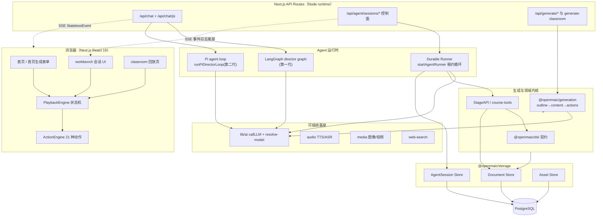
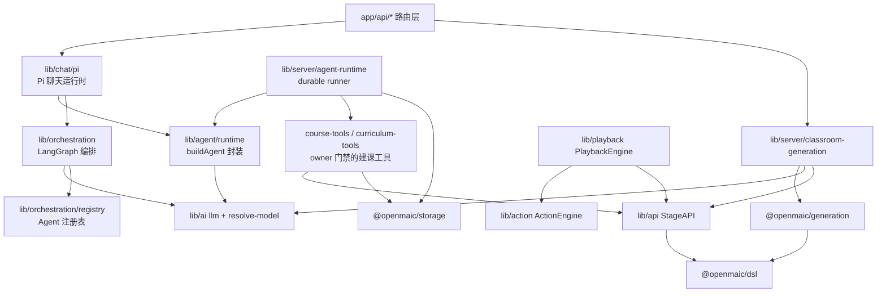
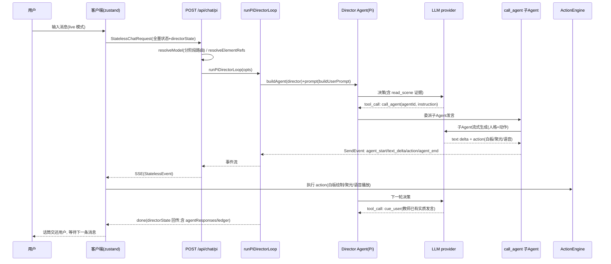
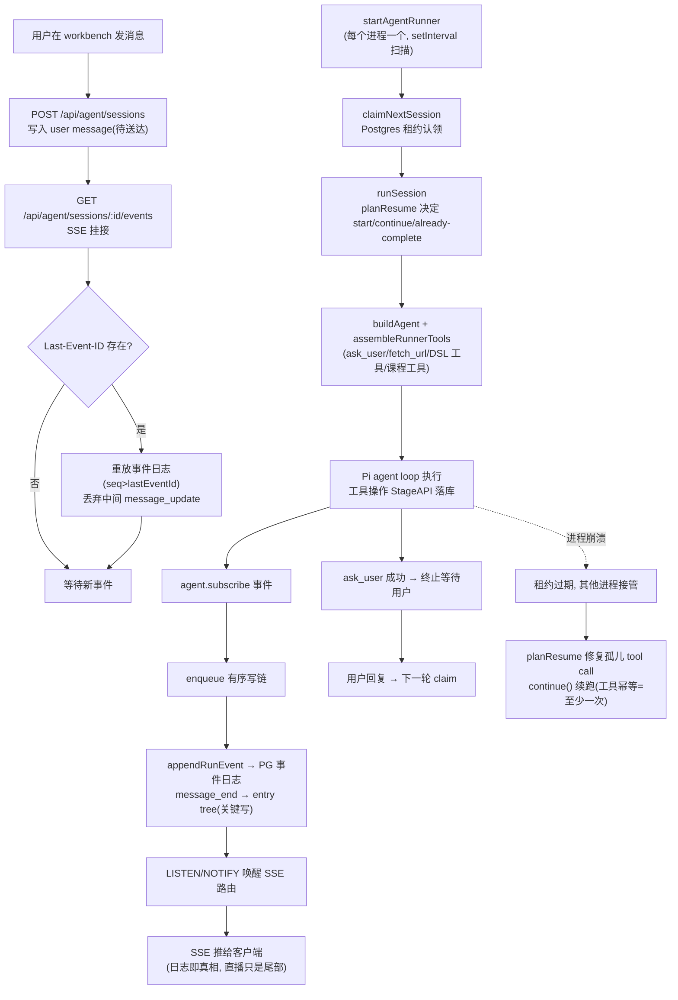

# OpenMAIC 源码学习笔记

> 仓库地址：[OpenMAIC](https://github.com/THU-MAIC/OpenMAIC)
> 学习日期：2026-10-01（基于 main 分支 8f7d51e，v1.1.1，约 2700 个 TS 文件 / 26.8 万行）

---

> **以下为 AI 源码分析**
>
> ### 一句话概括
>
> OpenMAIC（Open Multi-Agent Interactive Classroom）是清华 MAIC 团队开源的多 Agent 互动课堂平台：输入一个话题或一份文档，AI 自动生成含幻灯片、测验、互动模拟与 PBL 的完整课程，再由 AI 老师 / AI 同学在课堂里实时讲课、讨论、画白板。
>
> ### 要点速览
>
> | 核心模块 | 职责 | 关键文件 |
> |---------|------|---------|
> | 课堂聊天编排 | 多 Agent 讨论的两代运行时（LangGraph / Pi） | `lib/orchestration/director-graph.ts`、`lib/chat/pi/director-loop.ts` |
> | Durable Agent Runtime | Postgres 租约协调的持久化建课会话 | `lib/server/agent-runtime/runner.ts`、`resume.ts` |
> | 课程生成管线 | 大纲 → 场景内容/动作 两段式生成 | `packages/@openmaic/generation/src/`、`lib/server/classroom-generation.ts` |
> | Action 引擎 | 统一执行 21 种课堂动作（白板/聚光/语音…） | `lib/action/engine.ts` |
> | Playback 引擎 | 课堂回放状态机（idle→playing→live） | `lib/playback/engine.ts` |
> | 持久化抽象 | 可插拔 Document/Asset/Session 存储 | `packages/@openmaic/storage/src/` |
> | 课程数据契约 | 版本化的 slide/scene DSL 与校验器 | `packages/@openmaic/dsl/src/` |
> | 渲染服务 | 独立容器渲染不受信 HTML → MP4 | `render-service/` |

---

## 项目简介

OpenMAIC 解决的是"把任何主题变成一堂可交互的课"这一问题。它有三条主链路：**一键生成**（classic generator，话题/PDF → 完整课堂）、**Agent Workbench**（v1.0 起的 Pro 工作台，与一个 agent 对话式地规划、搭建、修订整门课程，会话服务端持久化、可取消/恢复/转向）、**课堂互动**（AI 老师与 AI 同学在回放中实时多 Agent 讨论）。产品层面"provider 中立"：LLM、TTS/ASR、图像/视频、搜索、存储后端全部可插拔，自带 OpenClaw/Codex 等 workbench 的 SKILL 集成。相关论文发表于 JCST'26（*From MOOC to MAIC*）。

## 技术栈

| 类别 | 技术 |
|------|------|
| 语言 | TypeScript 5（Node >= 22.19） |
| 框架 | Next.js 16（App Router）+ React 19 |
| Agent 框架 | @langchain/langgraph 1.1、@earendil-works/pi-agent-core 0.78（pin 死版本）、Vercel AI SDK v6（`ai` + `@ai-sdk/*`） |
| 构建/包管理 | pnpm 10 workspace（8 个 `@openmaic/*` 子包）、tsc + rollup 构建子包 |
| 测试 | Vitest（单测）+ Playwright（e2e）+ eval 目录（`eval:pbl-v2-planner` 等四个评测 runner） |
| 数据 | PostgreSQL 16（`pg`，课程与会话的唯一真源）、Dexie/IndexedDB（浏览器端遗留路径） |
| 前端关键库 | Tailwind 4、ProseMirror（编辑器内核）、Zustand（状态）、shadcn/ui、KaTeX/temml（公式）、ECharts |
| 部署 | Vercel / Docker / docker-compose（`docker-compose.db.yml` 起本地 PG） |

## 目录结构

```
OpenMAIC/
├── app/                        # Next.js App Router
│   ├── api/                    #   30+ 路由组：agent(会话控制面) / generate(场景生成) /
│   │                           #   generate-classroom(异步任务) / chat(课堂讨论 SSE) /
│   │                           #   pbl / persistence / export-video / web-search …
│   ├── classroom/[id]/         #   课堂回放页
│   ├── workspace/              #   Pro workbench 页面
│   └── page.tsx                #   首页（一键生成入口）
├── lib/                        # 核心业务逻辑（50+ 子目录）
│   ├── orchestration/          #   LangGraph director graph（第一代聊天编排）
│   ├── chat/pi/                #   Pi agent loop 聊天运行时（v1.1 默认）
│   ├── agent/runtime/          #   对 pi Agent 的统一封装 buildAgent()
│   ├── server/agent-runtime/   #   durable 会话 runner（租约、恢复、工具集）
│   ├── server/                 #   60+ 服务端模块（resolve-model、classroom-generation、ssrf-guard…）
│   ├── playback/  action/      #   客户端回放状态机 / 动作执行引擎
│   ├── ai/  audio/  media/     #   LLM / TTS-ASR / 图像视频 provider 抽象
│   ├── persistence/  store/    #   持久化接线 / Zustand stores
│   └── types/ prompts/ pbl/ …  #   类型、提示词资产、PBL v2 任务内核
├── components/                 # React UI（slide-renderer、workbench、whiteboard、scene-renderers…）
├── packages/                   # pnpm workspace 子包
│   ├── @openmaic/{dsl,renderer,editor,importer,generation,storage}
│   ├── pptxgenjs/  mathml2omml/ # vendored 定制版
│   └── docs/                   #   独立文档子应用（自带 lockfile，不进 workspace）
├── render-service/             # MP4 导出渲染服务（Chromium+FFmpeg，独立容器）
├── skills/openmaic/            # 对外发布的 SKILL.md（OpenClaw 等工作台集成）
├── e2e/  tests/  eval/         # 端到端 / 单测 / 评测
└── instrumentation.ts          # 进程级启动入口（runner、notify-bus、fail-fast 校验）
```

## 架构设计

### 整体架构

整体是**单进程 Next.js 应用 + PostgreSQL 真源 + 独立 render-service** 的形态。关键决策有三条：

1. **三条 Agent 链路共用同一套基座**：课堂讨论（`/api/chat`）、workbench 建课（`/api/agent/*`）、一键生成（`/api/generate-classroom`）都汇聚到 `lib/ai/llm.ts` 的 `callLLM/streamLLM`（走 Vercel AI SDK，支持 OpenAI/Anthropic/Azure/Bedrock/Google 等 12 家 provider），以及 `lib/server/resolve-model.ts` 的**分阶段模型路由**（`MODEL_ROUTES`，如 `scene-content:slide` 可单独路由到便宜模型）。
2. **服务端与客户端的边界是一条事件协议**：`StatelessEvent`（`agent_start / text_delta / action / agent_end / cue_user / done`）。服务端只产生事件；**动作的执行全在客户端**——`ActionEngine` 消费 `action` 事件操作白板/聚光灯/语音，因此"在线直播"与"离线回放"共享同一条执行路径。
3. **连接与执行解耦**：workbench 的 agent 会话由后台 runner 以**租约**方式执行，HTTP SSE 只是 Postgres 事件日志的尾部读取（`Last-Event-ID` 重放），客户端断线不影响执行，任何进程都能接管崩溃会话。



### 核心模块

#### 1. 课堂聊天编排 — `lib/orchestration/`（第一代）

- `director-graph.ts:484` `createOrchestrationGraph()`：LangGraph `StateGraph`，拓扑为 `START → director →(next)→ agent_generate → END`，**单轮契约**——每次 HTTP 请求最多跑一轮 director→agent，多 Agent 讨论由客户端串行发请求驱动，服务端不循环、无 maxTurns。
- `directorNode()`（`director-graph.ts:103`）按 Agent 数自适应：单 Agent 纯代码调度（0 次 LLM）；多 Agent 用 LLM 决策下一个发言者（`buildDirectorPrompt` + `parseDirectorDecision`），首轮带 `triggerAgentId` 时走代码 fast-path。
- `agentGenerateNode()` → `runAgentGeneration()`：流式生成 + 增量解析结构化协议（`stateless-generate.ts` 的 `parseStructuredChunk`，文本与 action JSON 交错），动作经 `getEffectiveActions()` 按场景类型二次过滤（幻灯片专属的 spotlight/laser 在 quiz 场景被剥除——纵深防御），白板动作记入 `whiteboardLedger` 供后续 Agent 感知画布状态。
- `ai-sdk-adapter.ts:43` `AISdkLangGraphAdapter extends BaseChatModel`：把 AI SDK 的 `LanguageModel` 桥接进 LangChain 消息体系，`_generate` 走 `callLLM`、`streamGenerate` 走 `streamLLM`。这是"LangGraph 编排 + AI SDK provider 生态"两全的关键一环。
- 入口 `app/api/chat/route.ts`：完全无状态（messages + storeState 全由客户端携带），SSE 输出 + 15s 心跳，abort 直接用 `req.signal` 传导。

#### 2. Pi 聊天运行时 — `lib/chat/pi/`（第二代，v1.1 默认）

- `director-loop.ts:29` `runPiDirectorLoop()`：把"谁下一个发言"从**文本协议解析**升级为**原生 tool-calling**。director 是一个 Pi Agent，工具集为 `read_scene`（读课程场景证据）、`call_agent`（委派子 Agent 发言）、`close_session`、`cue_user`（把话筒交还用户）。
- 护栏设计很细：`cueUser`/`closeSession` 只允许触发一次；`cue_user` 只有在出现"教师角色的实质性发言"后（`hasTeachingSubstantiveTurn`）才被允许；工具调用总量上限 `max(maxAgentTurns*3, maxAgentTurns+3)`；每次工具结果记录进 `directorToolTrace` 随 `done` 事件返回。
- `tools/call-agent.ts:43` `buildCallAgentTool`：子 Agent 有两种执行模式（`child-runtime.ts` 的 `legacy | native`）——legacy 复用第一代结构化文本协议 + 流式解析；native 走真正的 action tool 调用（`native-whiteboard.ts`、`native-spotlight.ts`）。两种模式共用 `prompts.ts` 的历史消息构造（其他 Agent 的发言映射为 user 角色）。
- `director-compaction.ts`：上下文压缩 runtime（`transformContext`），配合 Pi 的 `convertToLlm`，长讨论不撑爆上下文。

#### 3. Pi Agent 封装 — `lib/agent/runtime/` + `lib/agent/VENDOR.md`

- `build-agent.ts:65` `buildAgent()`：统一构造 Pi `Agent`——注入项目自己的 `StreamFn`（`stream-fn.ts` 的 `createCallLlmStreamFn`，绕开 pi-ai 的 provider 实现）、`STUB_MODEL`（1M contextWindow 元数据桩，防 harness 自作主张压缩上下文）、`beforeToolCall` allowlist 门、`afterToolCall` quota + 请求级 hook、每个工具包一层超时（`tool-timeout.ts`）。
- 终端屏障：当模型因 `stopReason === 'length'` 且有 tool call 溯源时，屏蔽后续 `steer/followUp`，防止半截循环。
- `VENDOR.md` 记录 vendoring 意图：`pi-agent-core/pi-ai` pin 在 0.78.0，"在真正需要改 loop 之前不 vendor 源码"。

#### 4. Durable Agent Runtime — `lib/server/agent-runtime/`（workbench 核心）

- `runner.ts:1868` `startAgentRunner()`：每个应用进程都可运行的后台循环，`setInterval` 扫描 + `store.claimNextSession()` 认领会话（进程内 fence + Postgres 租约双重排除），并发上限 `maxConcurrent`。
- `runner.ts:890` `runSession()`：核心执行体。**有序写链** `enqueue()` 把事件流（150ms 节流的 `message_update`）与关键写（entry tree、用户消息送达标记）串成单条 promise 链；`appendRunEvent` 写 Postgres 事件日志，`seq === null` 即租约丢失；tripwire 强制第一个事件必须是 lifecycle 帧。
- 工具装配（`runner.ts:1436` `assembleRunnerTools`）：`ask_user`（常驻，成功即终止等待用户）、`fetch_url`（常驻但逐调用过 URL 信任门）、`read_stage/patch_stage/grep_stage/create_stage` 等 DSL 工具（`course-tools.ts`，全部经 `withOwnerStageAuthorization` 做 owner 门禁——ownerId 刻意不进模型可见参数，防伪造）、curriculum/roster/material/voice-clone/personal-history 工具按能力门控注册。
- `resume.ts:707` `planResume`：崩溃恢复语义。截断的转录先摘除不完整的 assistant 帧，尾部按 `empty / user / toolResult / assistant+calls` 分类决定 `prompt() | continue() | already-complete`；悬空 tool call 由 `tool-call-integrity.ts` 补"interrupted"结果，使工具执行**至少一次**——因此所有工具必须幂等（`putScene` 按 `(stageId, sceneId)` 幂等，`generate_scene` 的 id 从 outline 派生而非现造）。
- 入口在 `instrumentation.ts:13` `register()`：Next.js 每个服务实例启动时初始化 event-notify-bus（一条专用 LISTEN 连接）、`startAgentRunner()`、素材抽取 runner，注册 SIGTERM/SIGINT 优雅停机；数据库缺失等致命配置 **fail-fast 退出进程**而不是带病服务。
- 客户端消费面 `app/api/agent/sessions/[id]/events/route.ts`：纯读取的 SSE——先按 `Last-Event-ID` 重放事件日志（中间 `message_update` 丢弃，只留每轮最后一个全量帧），再跟随 LISTEN/NOTIFY 实时推送（轮询兜底）。**事件日志是唯一真源，直播流只是日志的尾部**。

#### 5. 课程生成管线 — `packages/@openmaic/generation` + `lib/server/classroom-generation.ts`

- 生成包是**纯库**：AI 调用通过 `AICallFn` 注入（`(systemPrompt, userPrompt, images) => text`），不含任何 provider 逻辑；提示词资产（`templates/` 9 类 + `snippets/`）随包分发。
- 两段式：`generateSceneOutlinesFromRequirements()`（需求+PDF/搜索上下文 → SceneOutline[]，含语言推断、媒体占位符）→ 逐个 outline `generateSceneContent()`（slide/quiz/interactive/pbl 四类内容）+ `generateSceneActions()`（动作序列）→ `buildCompleteScene()`。
- 可靠性：`withGenerationRetry` 包装重试（`generation-retry.ts`），`json-repair.ts` 修复 LLM JSON 输出，`interactive-post-processor.ts` / `interactive-script-validator.ts` 后处理与校验不受信的互动 HTML。
- 应用侧编排 `classroom-generation.ts:251` `generateClassroom()`：步骤 `initializing → researching(web search 可优雅降级) → generating_outlines → generating_scenes(逐场景) → generating_media → generating_tts → persisting → completed`；**每个阶段可独立路由模型**（`resolveSceneContentCall` 按 `scene-content:<type>` 复合键惰性解析、缓存、失败降级回主模型）；课堂 id 先 `reserveClassroom` 预留、失败 `finally` 里释放，避免烧 id。PBL 场景失败被 `containPBLGenerationError` 单场景隔离，不炸整堂课。

#### 6. 客户端执行层 — `lib/action/` + `lib/playback/`

- `action/engine.ts` `ActionEngine`：21 种动作的统一执行层（替代早期 28 个 Vercel AI SDK tool），两种语义——fire-and-forget（spotlight/laser）与同步（speech/whiteboard，带 `WB_DRAW_MS` 等编舞时长）；在线直播与离线回放**共用**。
- `playback/engine.ts` `PlaybackEngine`：状态机 `idle → playing ⇄ paused → live`；`live` 态进入多 Agent 讨论，`handleEndDiscussion/confirmDiscussion` 收敛回回放。动作游标支持跳转与"可重构前缀"内导航（`action-navigation.ts`）。

#### 7. 存储与数据契约 — `packages/@openmaic/storage` + `@openmaic/dsl`

- storage 提供 Document / Runtime / KV / Asset / AgentSession / Material / UserSkill 七类 store 的抽象与 **Postgres 参考实现**（`agent-session/pg.ts` 的 `claimNextSession` 用锁 + 心跳 + attempt 实现租约），并定义 HTTP 契约（`src/http/`）允许外部服务整体替换存储层。
- dsl 是版本化的 slide/scene 数据契约与校验器，renderer/editor/importer/generation 全部围绕它工作；`pptxgenjs`、`mathml2omml` 是 vendored 定制版（用于 `.pptx` 导入导出与公式转换）。

### 模块依赖关系



依赖方向上值得一提的两点：`@openmaic/generation` 对外只暴露 `AICallFn`，反向依赖为零，可独立发 npm；`lib/chat/pi` 同时引用第一代的解析器（`stateless-generate.ts`）与 `buildAgent`，是两代运行时的合流点。

## 核心流程

### 流程一：课堂多 Agent 实时讨论（Pi 运行时）

用户在课堂回放页进入 live 模式发言后，客户端把**完整状态**（messages + storeState + agentConfigs + directorState）随请求发给 `/api/chat/pi`，服务端跑一轮 director loop 并以 SSE 流回事件；客户端收到 `cue_user` 后把话筒还给用户，下一轮请求继续——多轮讨论就这样由客户端串行驱动。



关键点：

- **director 的决策输入**包括元素引用证据（用户点了某个幻灯片元素提问，`element-reference.ts` 解析后注入 prompt）、互动组件实时状态、场景内容（`read_scene` 工具按需读取），因此老师能"看着课件"回答。
- **子 Agent 的动作合法性**有三层过滤：Agent 配置的 `allowedActions` → 场景类型过滤（`getEffectiveActions`）→ 执行时参数校验（`call-agent.ts` 的 requireString/requireNumber 系列 + SHAPE_TYPES/CHART_TYPES 白名单）。
- **白板账本**（`piWhiteboardLedger`）只回传本轮增量——跨轮画布状态由请求起始的 storeState 快照携带，避免会话状态无限膨胀。

### 流程二：Workbench 持久化建课会话（durable runtime）

用户在 workbench 发消息后立即得到一个 SSE 连接，但执行发生在后台 runner：会话与事件全部落在 Postgres，进程崩溃后由其他进程接管续跑，客户端随时重连补看。



关键点：

- **客户端连接不属于执行生命周期**（`runner.ts` 文件头注释的原文）。SSE 断开只是关掉一个"日志读取器"，runner 继续跑、事件继续落库。
- **租约丢失的传导**：事件写入返回 `seq === null` → `markLeaseLost()` → abort → 不再写任何帧；新 owner 的 `session_resumed` 帧就是"被抢走"的持久化中断标记。
- **终端语义**：`ask_user` 工具成功即 latch 终止（agent 不能自问自答）；未送达的用户消息在每次终端出口检查 `requeueIfUndelivered`，杜绝"用户说了话但没人消费"。
- **单 Agent 双重门禁**：模型可见的 allowlist（`allowedToolNames`）+ 每个带 stageId 工具的 owner 探测（`probeStageAccess`，owned/foreign/missing/tombstoned 四态，foreign 一律 fail-closed）。

## 关键设计亮点

1. **单轮图拓扑：让"多轮讨论"变成客户端责任**（`director-graph.ts` 文件头、`runPiDirectorLoop` 的 `maxAgentTurns` 边界）
   LangGraph 图只有 `director → agent_generate → END`，一次请求一轮，没有 `maxTurns`——**拓扑本身即边界**。服务端因此完全无状态（Agent 配置以 `agentConfigOverrides` 随请求携带），水平扩展零负担；中止 = 客户端断 fetch，`req.signal` 直通 LLM 流。对比常见的"server 端长循环 agent"方案，这个取舍把有状态性推给了最擅长保持状态的客户端。

2. **两代聊天运行时，一条客户端协议平滑演进**（`lib/orchestration` → `lib/chat/pi`）
   v1.0 用 LangGraph + 文本协议解析（`parseStructuredChunk` 处理模型输出里交错的正文与 action JSON）；v1.1 切到 Pi 原生 tool-calling（director 的四个工具）。两者输出**同一条 `StatelessEvent` SSE 协议**，客户端 `ActionEngine`/`PlaybackEngine` 一行不改——协议稳定才是运行时可替换的前提。Pi 运行时还保留了 legacy/native 两种子 Agent 模式（`child-runtime.ts`），按模型能力灰度。

3. **Durable agent 会话：租约 + 有序写链 + at-least-once 幂等工具**（`runner.ts`、`resume.ts`、`agent-session/pg.ts`）
   把 agent 对话当成分布式系统里的任务处理：PG 是 claim/lease/event-order 的唯一权威；崩溃恢复通过"摘除半截 assistant 帧 + 给悬空 tool call 补 interrupted 结果"把残缺转录修成合法续点，代价是**全工具集必须幂等**（resume.ts 注释明确列出了 `putScene`、`generate_scene` 的幂等设计）。`enqueue` 把节流的事件写与关键的 entry 写排进同一条 promise 链，杜绝乱序；`message_update` 150ms 节流 + `message_end` 后 `pruneMessageUpdates` 控制日志膨胀。

4. **能力门控的工具注册**（`runner.ts:1436` 注释原文："the model never sees a tool that can only throw"）
   `web_search` 只在配置了搜索后端时注册、`register_voice` 只在 provider 声明 `supportsRegistration` 时注册、skill 只在已安装时出现 `read` 工具。工具集即能力声明，模型不会被不可用工具误导；同时 `buildRunnerCoursePrompt` 按实际注册的工具动态拼系统提示词块，提示词与工具集永不漂移。`create_skill` 打开闭环后，`read_skill/patch_skill` 无条件注册——因为"本轮刚创建的 skill 不在启动时加载的列表里"，这类时序细节处理得很到位。

5. **分阶段模型路由 + 失败降级不炸主链路**（`lib/server/model-routes.ts`、`classroom-generation.ts`）
   `MODEL_ROUTES` 支持 `scene-content:slide`、`scene-actions`、`web-search-query-rewrite`、`agent-profiles` 等细粒度阶段路由，未配置零开销、解析失败 warn 后降级回主模型；web search 挂了继续生成、TTS 挂了带 warning 返回、PBL 单场景失败隔离跳过、课堂 id 失败释放预留——**可选能力永远不拖垮核心路径**，这是生成类产品稳定性的关键工程纪律。

## 未深入分析的部分

- `packages/@openmaic/editor`（ProseMirror 编辑器内核，量级大，自成体系）与 `slide-renderer` 渲染细节
- `lib/pbl/v2` 的 PBL 任务内核（engagement/proficiency/progress 等六组操作）、`eval/` 四个评测 runner
- `render-service/`（Chromium+FFmpeg 视频导出）、`lib/video-export`、ComfyUI/VoxCPM/FunASR 等本地服务集成
- `skills/openmaic` 的对外 SKILL SOP、`lib/i18n`（12 locale）、`e2e/` 与 `tests/`（52 个测试目录）
