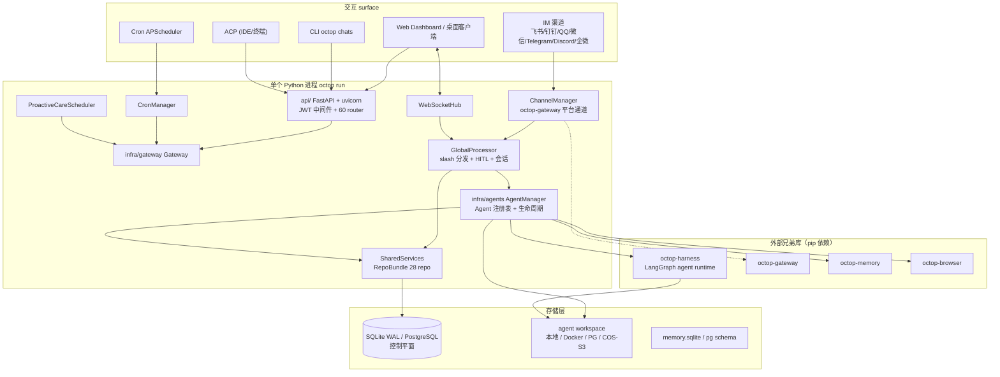
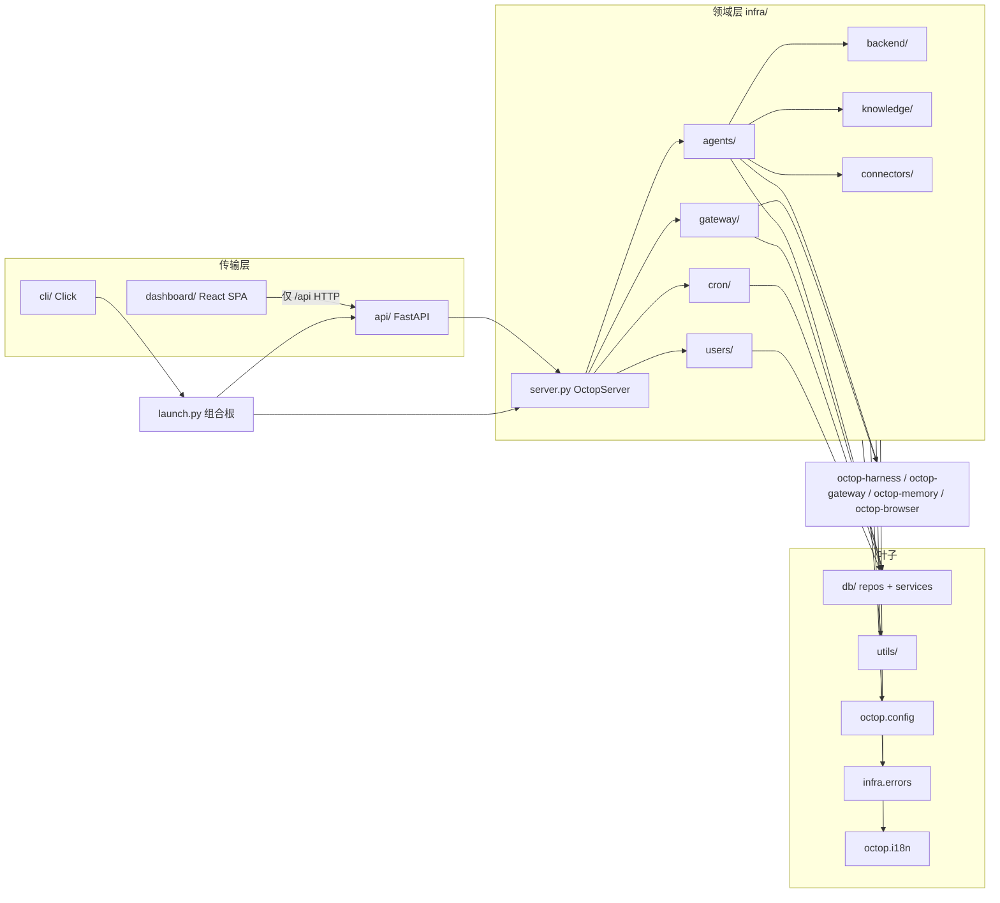
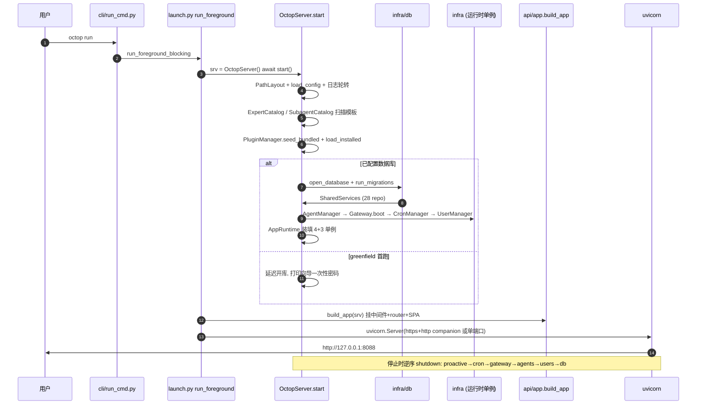
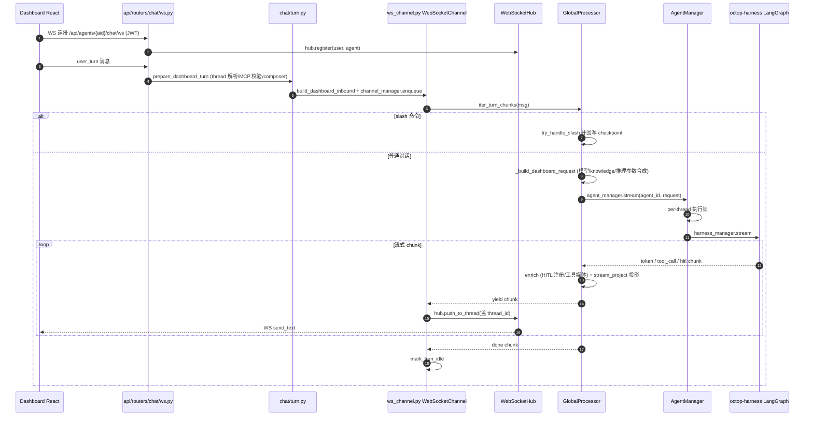
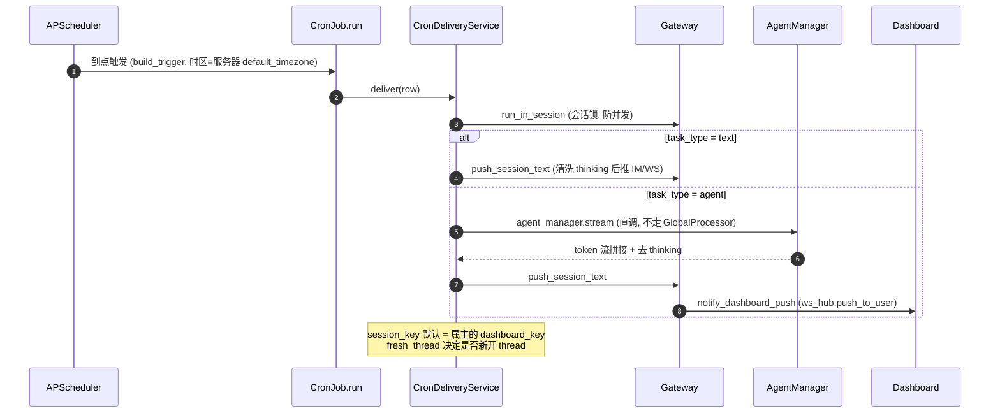

# TencentCloud/Octop 源码学习笔记

> 仓库地址：[TencentCloud/Octop](https://github.com/TencentCloud/Octop)
> 学习日期：2026-10-01（基于 v1.0.2b5，2026-09-29 发布）

---

> **以下为 AI 源码分析**
>
> ### 一句话概括
>
> Octop 是腾讯云开源的自托管多用户多 agent AI 助手平台：一个 Python 进程把 Web Dashboard、CLI、IM 渠道（飞书/钉钉/QQ/微信/Telegram/Discord/企微）和 cron 定时任务统一路由到进程内的 LangGraph agent runtime（octop-harness），全部状态落在 `~/.octop/` 的 SQLite/PostgreSQL 控制平面，无需外部队列或消息中间件。
>
> ### 要点速览
>
> | 模块 | 职责 | 关键文件 |
> |------|------|----------|
> | `launch.py` + `infra/server.py` | 组合根：`OctopServer.start()` 按依赖序装配全部单例，再挂 FastAPI/uvicorn | `launch.py:56`、`infra/server.py:283` |
> | `infra/agents/` | AgentManager 注册表：把 `agents` 表行组装成 HarnessAgent 运行时；专家模板、插件、人格、团队 | `infra/agents/manager.py:317` |
> | `infra/gateway/` | 统一消息管道：GlobalProcessor 同时消费 dashboard WS / IM / cron 三种 surface | `infra/gateway/process/processor.py:131` |
> | `infra/db/` | 双后端控制平面：SQLite(WAL) 或 PostgreSQL；28 个 repo 一一对应表 | `infra/db/services.py:37` |
> | `api/` | FastAPI HTTP 层：60+ router、JWT 鉴权、SSE/WS、Scalar 文档 | `api/app.py:101` |
> | `cli/` | Click 命令层：懒加载子命令，离线/嵌入式/外部三种传输模式 | `cli/main.py:57` |
> | `infra/backend/` | 可插拔 workspace 存储：本地/Docker/PG/COS/S3，named+composite spec 解析 | `infra/backend/resolver.py:79` |
> | `infra/connectors/` | 连接器生态：OAuth + MCP 网关 + 凭据加密 | `infra/connectors/service.py` |
> | `infra/knowledge/` | RAG 知识库：解析/分块/嵌入/检索/引用 | `infra/knowledge/index.py` |
> | `dashboard/` | React 18 + TypeScript + Vite 前端源码（构建产物打进 wheel） | `dashboard/src/` |

---

## 项目简介

Octop 面向家庭与小团队，定位是"自托管的数字生命体"：一个管理员账号 + 共享成员，每个用户可以创建多个"专家"（expert，即 agent），每个专家有独立的工作区、模型 provider、IM 通道绑定和 cron 任务。用户可以通过 Web Dashboard、桌面客户端、CLI、HTTP/SSE/WS API、八种 IM 渠道与专家对话，也可以让 AgentTeams 的主持专家（coordinator）调度多个成员专家协作完成多步任务。

核心价值主张是**本地优先的隐私模型**：所有对话、工作区、凭据都在用户自己的机器上（`~/.octop/`），单进程启动（`octop run`）即可获得完整能力，唯一的外部依赖是用户自己配置的 LLM provider。项目采用 MIT 协议，于 2026 年开源，目前迭代活跃（1.0.2b5 于 2026-09-29 发布，贡献者众多，曾登上 Trendshift 榜单）。

工程规模：`src/octop` 下 637 个 Python 文件，`tests/` 下 474 个测试文件，另有独立的 React 前端源码树。agent 执行能力本身不在此仓库实现，而是由四个兄弟仓库提供：octop-harness（LangGraph runtime）、octop-gateway（IM 渠道桥）、octop-memory（分层记忆）、octop-browser（CDP 浏览器自动化）。Octop 是它们的"组装层 + 控制平面"。

## 技术栈

| 类别 | 技术 |
|------|------|
| 语言 | Python 3.12+（后端）、TypeScript ~5.8（前端） |
| Web 框架 | FastAPI + uvicorn |
| 前端 | React 18 + Vite 6 + Ant Design 5 + i18next + react-router-dom 7 |
| Agent runtime | octop-harness（LangGraph，pip 依赖） |
| IM 网关 | octop-gateway（pip 依赖） |
| 控制平面 DB | SQLite（WAL，默认）/ PostgreSQL（psycopg3，可选） |
| 定时调度 | APScheduler 3.x（AsyncIOScheduler） |
| 认证 | PyJWT + argon2-cffi |
| 构建工具 | hatchling（wheel 内嵌 SPA 产物）+ Makefile |
| 依赖管理 | uv（PEP 735 dependency-groups） |
| 测试框架 | pytest + pytest-asyncio + pytest-xdist + pytest-testmon |
| 质量工具 | ruff（lint+format）、mypy --strict、ESLint/Prettier/tsc |

## 目录结构

```
octop/
├── pyproject.toml / uv.lock / mise.toml     # 包定义（octop = src/octop:cli）
├── Makefile                                  # make all = format-all+lint+typecheck+test
├── src/octop/
│   ├── config.py                             # config.json + 环境变量 → 冻结 dataclass
│   ├── launch.py                             # 组合根：OctopServer + build_app + uvicorn
│   ├── i18n/                                 # en/zh JSON 束 + tr() + 域助手
│   ├── infra/                                # 领域核心（约 20 个子包）
│   │   ├── server.py                         # OctopServer.start() 装配序
│   │   ├── agents/                           # manager.py(3344 行) + experts/teams/plugins/…
│   │   ├── gateway/                          # gateway.py + process/ + slash/ + ws/ + hitl/
│   │   ├── db/                               # pool/migrate/migrations(19 组成对 SQL)/repos(28)
│   │   ├── backend/                          # workspace 存储后端解析（named/composite）
│   │   ├── connectors/                       # OAuth + MCP 网关 + 凭据加密
│   │   ├── cron/                             # CronManager + CronJob + CronDeliveryService
│   │   ├── knowledge/                        # RAG 管道（parse→chunk→embed→retrieve）
│   │   ├── history/                          # 版本化历史 + trajectory 事件 + turn 投影
│   │   ├── users/ auth/ setup/ skills/       # 用户/SSO/首跑向导/技能包
│   │   ├── bridge/ browser/ desktop/ mobile/ voice/ proactive/ # 桥接/浏览器/桌面/移动端/语音/主动关怀
│   │   └── utils/                            # 纯助手（路径/ULID/locale…）
│   ├── api/                                  # FastAPI：app.py + routers/(60+ 模块) + middleware/
│   ├── cli/                                  # Click：main.py(懒加载) + *_cmd.py + support/
│   └── dashboard/                            # 已构建 SPA（wheel 产物，勿手改）
├── dashboard/                                # 前端源码（Vite，编辑这里）
├── desktop/ fnos/                            # 桌面客户端壳 / 飞牛 NAS 打包
├── docker/                                   # Compose + entrypoint + 构建脚本
├── docs/                                     # 人工文档：architecture.md、adr/、api.md…
├── scripts/                                  # 安装脚本（install.sh/ps1/bat）
└── tests/                                    # unit/ + integration/（-m live 单独门控）
```

## 架构设计

### 整体架构

设计思路可以概括为"**一个进程、一条管道、三层存储**"：

1. **一个进程**（ADR 001）：uvicorn 托管的单个 Python 进程同时承担 HTTP API、WebSocket、IM 长连接、APScheduler 调度。没有 worker 进程、没有 Redis/Celery，理由是自托管用户的运维成本最小化，且 agent 负载本质是 LLM I/O 等待，asyncio 足以扇出。进程重启时由 `OctopServer.start()` 从数据库重建整棵运行时树。
2. **一条管道**：dashboard WS、CLI、IM 渠道、cron 四种 surface 的消息全部收敛到 Gateway 下的 GlobalProcessor，再统一调 `AgentManager.stream()` 进入 harness agent；回复流经投影（stream_project）转成 `MessageEvent`/chunk 回推各 surface。
3. **三层存储**（ADR 002）：控制平面（用户/agent/通道/cron）在 SQLite 或 PostgreSQL；harness checkpoint 与 agent 记忆按 agent 隔离在各自 workspace；workspace 内容文件（SOUL.md、skills）经 BackendWorkspace 抽象可落在本地/Docker/PG/COS/S3。三者互不混淆。



启动序（详见流程一）由 `OctopServer.start()` 固化：路径 → 配置 → 开库迁移 → SharedServices → 专家目录扫描 → 插件播种 → AgentManager → Gateway → CronManager → UserManager → `AppRuntime`（四个存活单例的 dataclass，`infra/server.py:209`）。API 路由经 `server.app_runtime.<thing>` 触达这些单例，形成"HTTP 薄壳 + infra 领域层"的依赖倒置。

### 核心模块

#### 1. OctopServer / AppRuntime（进程装配）

`infra/server.py:244`。`start()`（:283）做五类事：环境（PATH/env_file/日志轮转，`SizeTimedRotatingFileHandler` 支持按天+按字节双触发并 gzip 压缩）、配置（`config.py` 的 `load_config`，env 覆盖 JSON）、数据（`open_database` + `run_migrations`，19 组 SQLite/PG 成对 SQL）、目录（ExpertCatalog/SubagentCatalog 扫描内置模板库，PluginManager 播种 27 个内置插件）、运行时（`_boot_runtime` :364 组装 AgentManager/Gateway/CronManager/ProactiveCare/UserManager/BridgeManager）。首跑场景支持"greenfield 延迟开库"（:318 `should_defer_control_plane_db`）：配置里没有 database 且用户数为 0 时先起 HTTP 等待 setup 向导选择后端，之后 `bind_control_plane`/`rebind_control_plane` 热换库——`AppRuntime.replace_services`（:222）把各单例逐一 `replace_*` 重定向到新 repo，这是仓库里少见的"运行时依赖重注入"。

#### 2. AgentManager（agent 注册表，`infra/agents/manager.py:317`，3344 行）

进程级单例，**不在内存缓存 DB 行**（每次直读 repo），但持有 harness 的 `HarnessAgentManager` 和全部运行中 HarnessAgent。关键字段：per-agent 生命周期锁、per-thread 执行锁（保证同一 thread 串行）、各 settings store（Langfuse/Security/ACP/ToolGuard/Provider）、MCP 工具缓存、TeamService。关键方法：`boot` :464（遍历 enabled 行调 `_start_agent`）、`create` :545、`start`/`stop` :887/:922（stop 先静默内存 GC 再 `aremove_agent`）、`stream` :1224（持 thread 锁后转 `harness_manager.stream`）、`resume_hitl` :1255、`reload` :1307（去抖合并的 `_reload_worker`）。

组装的核心是 `_build_harness_config`（:2978）：把 DB 行 + 各子系统集成点编译成一个 `HarnessAgentConfig`——workspace 目录、backend spec 解析、cron/knowledge/mobile 工具、插件工具、七层 LangGraph 中间件链（TokenQuota/Reasoning/KnowledgeHint/BrowserProfile/BinaryReadGuard/WorkspaceImage/OctopUiOffload，:3121-3138）、安全策略、ACP runner、MCP server 配置、skill 目录。然后 `harness_manager.acreate_agent(cfg)`（:2497）在 harness 内部真正实例化 agent，`_post_start_agent`（:2504）再注入 gateway 工具、同步内置/插件技能，最后置 `running`。

`infra/agents/` 其余子包：`experts/`（18 个内置专家模板 + 市场/发布链路）、`teams/`（团队主持人）、`plugins/`（插件宿主）、`subagents/`（中英文子代理模板库）、`providers/`（模型 provider 目录与 harness factory 同步）、`workspace/`、`settings/`、`security/`（策略 + HITL bypass）、`persona/`（16 型 MBTI 渲染 system prompt）、`memory/`、`middleware/`、`threads/`、`builtin_skills/`。

#### 3. Gateway / GlobalProcessor（统一消息管道）

`infra/gateway/gateway.py:94` 的 `Gateway` 是总装配器：`boot()`（:220）先建 `GlobalProcessor`（注入全部 repo + slash dispatcher + gateway 自引用），再建 `ChannelManager`（来自 octop-gateway，挂"停止时先抢占取消"钩子 :244），然后把 dashboard 虚拟通道 `WebSocketChannel`（`octop-dashboard`，`ws/ws_channel.py:29`）和 CLI 通道注册进去，最后按 DB 的 channel 行并发 `_register_channel`（:683）——按 kind 由 octop-gateway 工厂建飞书/钉钉/Telegram 等平台通道，team/QQ 强制流式 response mode。

`GlobalProcessor`（`process/processor.py:131`）实现**两种消费协议**：IM 走 `__call__(msg) -> AsyncIterator[MessageEvent]`（:605，octop-gateway 的 processor 协议：解析 agent → session key → HITL 审批/追问 → slash 分发 → 建 thread → `build_harness_request` → `project_stream`）；dashboard 走 `iter_turn_chunks(msg)`（:892，chunk 语义，支持回合中发 slash/compact，slash 回写 checkpoint）。两个协议最终都汇到 `agent_manager.stream()`。流式投影在 `process/stream_project.py:203`：token→delta、reasoning→thinking_delta、tool_call 累名→tool_start/tool_end、hitl_required→中断卡片。

会话路由靠 session key：`ThreadRegistry.make_key` = `agent_id:channel_type:subject_id:chat_type`（`infra/gateway/threads.py:31`），dashboard 请求在 `api/routers/chat/turn.py:317` 把显式 key 塞进 metadata，`process/message_keys.py:124` 优先取它。

#### 4. 数据层（`infra/db/`）

`DatabasePool` 协议 + `open_database()` 工厂（SQLite/PG 二选一）；`RepoBundle`（`services.py:37`）把 28 个"一表一 repo"聚合为冻结 dataclass，`SharedServices`（:100）再加 paths+config，构成进程级 DI 根。SQL 全部用 `?` 占位符，`PostgresPool` 在边界重写为 `%s`——这是双后端共库的关键技巧。迁移是 19 组成对文件 `NNN_*.sql` / `NNN_*.pg.sql`，`_schema_version` 是水位线而非 changelog；资源表统一"整数代理 PK + 公开字符串 ULID"双 id 约定。

#### 5. API 层（`api/`）

`build_app`（`app.py:101`）装配：异常处理器（`OctopError` → 本地化 envelope）、CORS、三层中间件（bridge proxy → JWT 认证 → setup lockdown，Starlette 后加先执行）、ACME challenge 路由、60+ router 挂载（`_mount_routers` 表驱动），最后 SPA fallback（:306，带路径穿越防护和 hash 资源 404 策略）。路由必须薄：校验 HTTP、调 infra、映射错误。聊天走 `POST /chat/stream` 的 SSE 已被双向 WS 取代，仅 HITL resume 还保留 SSE。

#### 6. CLI 层（`cli/`）

`_LazyCLI`（`main.py:57`）通过 `cli/registry.py` 的静态注册表懒加载子命令模块——`octop --help` 不 import 任何命令实现。命令分三种传输：**Offline**（直读写本地 SQLite）、**Embedded**（短命内嵌 `OctopServer`，如 `chats send`）、**External**（直接调 OS/子进程，如 WeChat 扫码绑定）。没有 `octop user login`——CLI 信任本地文件系统对 `~/.octop` 的访问。

#### 7. workspace 存储后端（`infra/backend/`）

`resolver.py:79` 递归解析 agent 的 backend spec：`named` 引用（查 `storage_backends` 表展开）与 `composite`（default + 按 prefix 路由到多个子后端）都可嵌套。默认 POSIX 走 harness 的 host-root 虚拟路径，Windows 特判把 `/` 根改写到 agent workspace（`windows_neutralize_host_root` :34）。服务层永不用 `Path.write_text` 直写 workspace 内容——统一走 `BackendWorkspace`（octop-harness），使远程后端（S3/COS）与本地行为一致。

#### 8. 连接器与知识库

`infra/connectors/`：连接器目录 + OAuth 注册表 + MCP 网关（把外部 MCP server 的工具代理进 agent）+ 凭据加密（`crypto.py`）。`infra/knowledge/`：RAG 管道 parse→chunk→embed（可选本地 ONNX fastembed）→retrieve→citations，支持部署内共享语料。

### 模块依赖关系

依赖方向被 AGENTS.md 固化为"**向内流动**"（transport 调 domain，domain 永不调 HTTP/CLI），并有硬性禁令：`infra/` 不得 import `api/`/`cli/`/`launch.py`；`launch.py` 是唯一可同时 import `infra/server` 和 `api/app` 的模块；`infra/db/repos/` 与 `infra/utils/` 是叶子，不得依赖其它 infra 子包。



## 核心流程

### 流程一：`octop run` 启动流程

从 CLI 到可服务请求的全链路。关键点：装配顺序是依赖序（先 DB 后 AgentManager，因为 agent 组装要读 repo）；greenfield 首跑可延迟开库等待向导；TLS 支持双端口（HTTPS + HTTP 伴生 app 做 ACME/重定向）。



各步关键实现：`launch.py:56`（`run_foreground`）、`infra/server.py:283`（`start`）、`infra/server.py:364`（`_boot_runtime` 组装 AgentManager :375、Gateway :416、CronManager :441、UserManager :482）、`api/app.py:101`（`build_app`）。AgentManager.boot（`manager.py:464`）遍历 enabled 的 `agents` 行逐个 `_start_agent`（:2472）→ `_agent_runtime_bundle`（:2855）→ `_build_harness_config`（:2978）→ `harness_manager.acreate_agent`（:2497）→ `_post_start_agent`（:2504）→ `set_state("running")`。

### 流程二：Dashboard WebSocket 对话链路

用户在网页输入一条消息到收到流式回复的完整调用链。这是最能体现"一条管道"设计的流程：dashboard 在 ChannelManager 里也是一个普通通道（`octop-dashboard` 虚拟通道），与 IM 渠道同构。



关键行号：WS 端点 `ws.py:33`（token 鉴权 :46、agent 校验 :65）、`turn.py:226`（`prepare_dashboard_turn`）、`ws_channel.py:90`（`handle_inbound`，重订阅 :135、`mark_turn_active` :146）、`processor.py:892`（`iter_turn_chunks`）、`processor.py:987/:1181`（`_build_dashboard_request`）、`processor.py:1030`（`agent_manager.stream` 调用点）、`manager.py:1224/:1237`（`stream` 持锁转 harness）、`stream_project.py:203`（投影）、`ws_hub.py:129/:135`（推送时盖 thread_id 防串线）。HITL（人工审批工具调用）中断当前回合后经 `POST /hitl/resume`（唯一保留 SSE 的路由）用 `iter_hitl_resume_chunks`（`processor.py:1117`）续跑。

### 流程三：Cron 定时任务触发链路

APScheduler 到点后如何驱动 agent 并把结果送达。cron 有两种 `task_type`：`text` 型只推文本不跑 agent（`_deliver_text`，dashboard 会话先补写消息）；`agent` 型绕过 GlobalProcessor 直调 `agent_manager.stream`（`delivery.py:143`），拼接 token、剥离 thinking 后经会话锁推送。



关键行号：`infra/cron/manager.py:50`（CronManager，`AsyncIOScheduler` :65，boot 时全量调度 :75，系统级任务如 TLS 续期/自动备份走 `schedule_system_job` :294 不入库）、`cron/job.py:78`（`CronJob.run`）、`cron/delivery.py:67/:83/:89/:132`（deliver → 会话锁 → text/agent 两种投递）。IM 渠道消息链路与流程二同构，只是入口换成平台长连接 → octop-gateway 归一化为 `InboundMessage` → `GlobalProcessor.__call__`（`processor.py:605`），且 invoke 模式的通道会先经 `response_mode.py:46` 的 `collapse_to_invoke_response` 折叠掉工具前旁白、一次性吐终稿。

## 关键设计亮点

### 1. 单进程无队列架构（ADR 001）

- **解决的问题**：自托管用户装 Redis + worker + supervisor 的运维成本，比"跑一个 `octop run`"高一个数量级。
- **实现方式**：全部并发交给 asyncio；agent 调用是 LLM-bound 的 I/O 等待，天然适合事件循环；重启语义极简——`OctopServer.start()` 从 SQLite 重建一切，无外部状态需要对账（`infra/server.py:283`）。阻塞调用强制 `run_in_executor`。
- **为什么值得学**：它用 ADR 明确写下代价（只能垂直扩展、重 CPU 会阻塞事件循环）而非只吹收益，并把未来水平扩展的"接缝"标在了 `infra/gateway/processor.py`——架构决策文档就该这么写。

### 2. 统一消息管道 + 双消费协议

- **解决的问题**：dashboard / IM / cron / CLI 四种 surface 的消息处理逻辑（slash、HITL、会话、投影）如果各自实现会四倍漂移。
- **实现方式**：dashboard 注册为 ChannelManager 里的虚拟通道（`ws/ws_channel.py:29`），与飞书/Telegram 通道同构；`GlobalProcessor` 对外暴露两个协议——IM 的 `__call__ -> AsyncIterator[MessageEvent]`（`processor.py:605`）与 dashboard 的 `iter_turn_chunks`（:892），共享 slash 分发、thread 状态机、HITL 协调器；cron 的 agent 型任务则刻意绕过 processor 直调 `agent_manager.stream`（`cron/delivery.py:143`），按需选择最短路径。
- **为什么值得学**：这是"统一但不强行统一"的示范——收敛公共逻辑，同时在 chunk/event 两种流语义、invoke/stream 两种回复模式上保留各 surface 的差异。

### 3. 三层存储分离（ADR 002）与双后端 SQL 兼容

- **解决的问题**：既要 SQLite 零摩擦默认，又要 PostgreSQL 合规选项；agent 记忆/checkpoint/workspace 又各有归属，容易混成一锅粥。
- **实现方式**：ADR 把三层归属写成铁律（控制平面=Octop 迁移、checkpoint=harness、memory DDL=octop-memory、workspace 文件=BackendWorkspace）；repo 层全部 `?` 占位符、`PostgresPool` 边界重写为 `%s`；迁移成对提交 `NNN_*.sql` + `NNN_*.pg.sql`；greenfield 热换库经 `AppRuntime.replace_services` 逐单例重注入（`infra/server.py:222`）；备份 manifest 记录 driver 并拒绝跨引擎恢复。
- **为什么值得学**：很多项目做"双数据库支持"做到一半烂尾，根因是 DDL 归属和占位符差异没在制度上固化。Octop 用"所有权表 + 成对迁移 + 拒绝跨引擎恢复"把模糊空间压到了零。

### 4. 机器可读的模块边界（AGENTS.md）

- **解决的问题**：637 文件的仓库，人和 AI 协作者都会越界写代码（infra 反向 import api、router 里写业务逻辑）。
- **实现方式**：仓库根 AGENTS.md 用表格逐层声明"Owns / May import / Must NOT import"，配硬性禁令清单（如 `infra/ → api/`、`launch.py` 是唯一可同时 import server+app 的模块）；文档与 `docs/architecture.md` 明确分工——前者 agent 面向、后者人类面向。
- **为什么值得学**：这是把"架构约束"从口头约定变成可执行文档的样本，CI 双平台（Linux+Windows）+ pre-commit `make all` 再把质量门固化到流程。

### 5. Agent 即普通表行 + Expert 模板生态

- **解决的问题**：多用户各自想要"不同性格/能力"的助手，从零配置成本高。
- **实现方式**：agent 就是一行 `agents` 表（`kind=expert`），运行时按需组装；18 个内置专家模板（`infra/agents/experts/library/`，从 `default`、`general-assistant` 到 `tencentcloud-api`、`stock-assistant`）+ 16 型 MBTI 人格模板；从模板建 agent 的链路是 `POST /api/experts/agents/from-expert/{id}` → `build_create_spec_from_expert`（`experts/catalog.py:892`）→ `AgentManager.create` → `seed_expert_directory` 把模板文件经 `aupload_many` 写进新 workspace。专家还可发布/分享给同部署其他用户。
- **为什么值得学**：模板不是代码级的"插件系统"，而是纯 Markdown + manifest 的数据资产，随 wheel 打包（pyproject 的 include 列表），复制成本低、可市场分发。

### 6. AgentTeams：用"特殊专家"实现多 agent 编排

- **解决的问题**：让一个 coordinator 调度多个专家协作，又不想引入新的实体类型和表结构。
- **实现方式**：团队主持人就是 `agents.kind = team` 的行（迁移 `016_agent_teams`），成员编制只存在主持人 workspace 的 `.octop/manifest.json` 里，没有成员表；主持人的工具被裁剪为 `agent_list` + 异步 `ask_agent`（`manager.py:3316` `_apply_team_host_config`，`peer_invoke_mode=async`），群聊房间 = 主持人 `thread_id`，成员 checkpoint 为 `主thread~成员id`；派工经 harness 的 inbox 按 callee 并发（同成员串行、不同成员并行），成员回叫唤醒主持人总结收工（`teams/team_manager.py:125/:319/:415`）。
- **为什么值得学**：把"编排"建模为对既有 agent 机制的约束（裁剪工具 + 改写派工 + 房间转播），而不是新造一套调度器——状态最小、可回退，`TeamJobTracker` 进程内幂等记账的取舍也写得清楚（重启锁消失即可改编制）。

## 未深入分析的部分

- `octop-harness` / `octop-gateway` / `octop-memory` / `octop-browser` 四个外部库的内部实现（LangGraph 图结构、IM 协议适配、记忆分层细节）——它们是独立仓库，本文只分析 Octop 对它们的组装方式。
- `desktop/`（Tauri/桌面壳）、`fnos/`（NAS 打包）、`docker/`、`scripts/`（安装器）等分发与运维层。
- `dashboard/src/` 前端页面级实现（仅确认了 api/pages/components 的分层约定）。
- `infra/voice/`、`infra/mobile/`（远程 Android）、`infra/bridge/`（Octop↔Octop 云桥）、`infra/desktop/`（远程桌面）、browser 自动化与 terminal AI 的运行时细节。
- `tests/` 的具体用例设计（仅梳理了 unit/integration 布局与 live/slow/postgresql 标记门控）。

## 学习收获小结

- **自托管产品的架构答案**：当你面向"家庭/小团队"用户，ADR 001 的单进程取舍（接受垂直扩展上限，换取零依赖部署）是值得默认的起点；扩展接缝应提前标注。
- **依赖注入可以很轻**：`SharedServices` + `RepoBundle` 两个冻结 dataclass 就完成了 28 个 repo 的 DI，路由经 `Depends(get_server)` 取用——不需要任何 DI 框架。
- **文档分层**：`README`（用户）→ `docs/architecture.md`（人类架构）→ `AGENTS.md`（AI 协作边界）→ `docs/adr/`（决策记录）四层各答各的问题，边界规则直接可执行，是这个仓库工程上最突出的优点。
- **一致性的价值**：一表一 repo、成对迁移、双 id 约定、i18n key 双端同步测试——全是"小约定 × 坚持执行"，换来 637 文件规模下仍有严格的 mypy --strict 通过。
