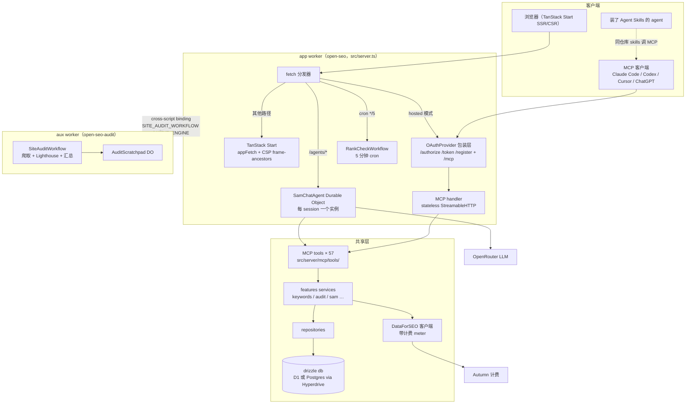
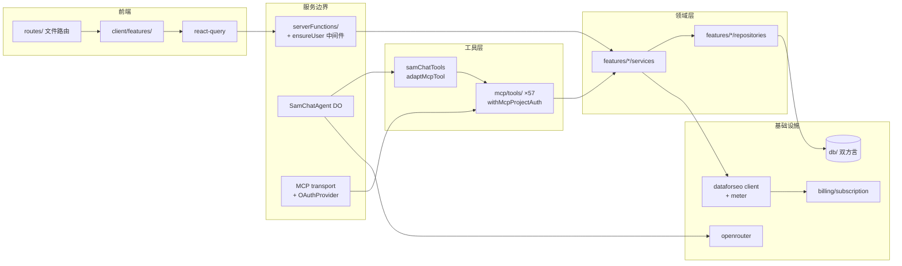
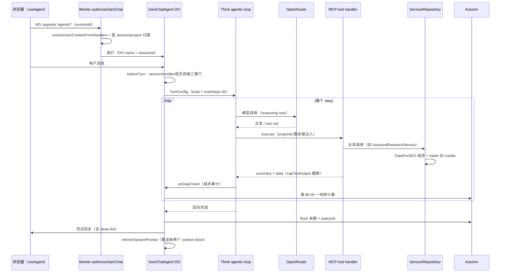
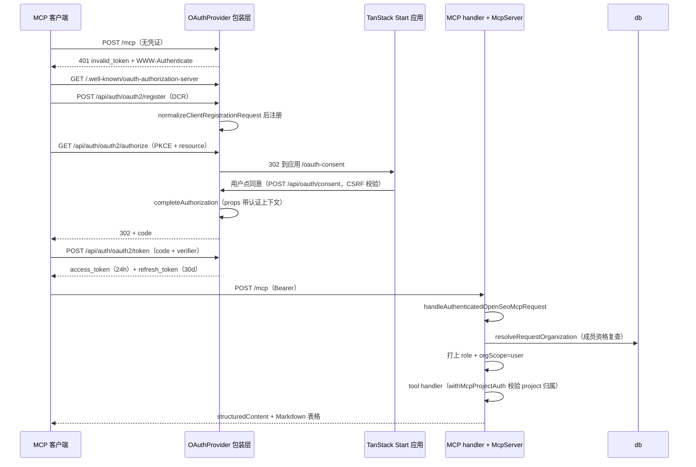

# open-seo 源码学习笔记

> 仓库地址：[open-seo](https://github.com/every-app/open-seo)
> 学习日期：2026-09-30

---

> **以下为 AI 源码分析**
>
> ### 一句话概括
>
> OpenSEO 是一个开源的 Semrush/Ahrefs 替代品：单仓库 TypeScript 全栈应用，跑在 Cloudflare Workers 上，把 SEO 数据（关键词、排名、外链、站内审计、GA4/GSC）通过 **MCP server + Agent Skills + in-app AI agent（SAM）三种形态**暴露给人类用户和 AI agent，数据统一来自 DataForSEO API 并按量计费。
>
> ### 要点速览
>
> | 模块 | 职责 | 关键文件 |
> |------|------|----------|
> | Worker 入口 | 请求分发：应用 / OAuth / MCP / SAM DO / cron | `src/server.ts` |
> | Web 应用 | TanStack Start + React 19 前后端一体 | `src/start.ts`、`src/routes/`、`src/serverFunctions/` |
> | MCP server | 57 个 SEO tool，OAuth 2.1 + DCR 授权 | `src/server/mcp/` |
> | SAM agent | in-app 聊天 agent，Cloudflare Think + Durable Object | `src/server/features/sam/SamChatAgent.ts` |
> | 业务 features | 16 个领域模块，service/repository 分层 | `src/server/features/` |
> | 数据层 | drizzle-orm，D1(SQLite)/Postgres 双方言 | `src/db/` |
> | DataForSEO 客户端 | SEO 数据统一出口 + 计费 meter | `src/server/lib/dataforseo/` |
> | 计费 | autumn-js credits，webhook 同步 | `src/server/billing/` |
> | Workflows | 排名检查（5 分钟 cron）+ 站内审计（独立 aux worker） | `src/server/workflows/` |
> | Agent Skills | 23 个 skill 单一真源，插件包多渠道分发 | `.agents/skills/`、`plugins/openseo/` |
> | IaC | Alchemy v2 按 stage 管理 Cloudflare 资源 | `alchemy.run.ts` |

---

## 项目简介

OpenSEO 自称 "open source alternative to Semrush and Ahrefs"，定位是 **"All-in-one SEO tool for you and your AI agent"**。它的差异化不在 SEO 数据本身（数据来自第三方 DataForSEO API，用户自带 key 或走托管加价 28%），而在于：

1. **为 AI agent 原生设计**：一个 MCP server 暴露 57 个 tool，配套 10 个面向用户的 Agent Skills（可 `npx skills add` 安装到 Claude Code / Codex / Cursor），外加一个跑在 Durable Object 里的 in-app 聊天 agent（SAM）——三种形态消费**同一份 tool 实现**，行为和计费不会漂移。
2. **按量付费而非订阅**：托管版 $10/月 + credits 按量；self-host 自带 DataForSEO key，成本直连。
3. **支付得起的基础设施**：整个产品跑在一个 Cloudflare Worker（免费档可用）+ 一个 aux worker 上，D1 或 Postgres（经 Hyperdrive）双数据库路径，部署用 Alchemy 做基础设施即代码。

核心 SEO 工作流：Keyword research、Rank tracking、Competitor Insights、Backlinks、Site Audits、AI Visibility。

## 技术栈

| 类别 | 技术 |
|------|------|
| 语言 | TypeScript 5.9（strict，`tsc --noEmit` 作为构建一部分） |
| 框架 | TanStack Start（React 19 + TanStack Router/Query/Form/Table）、Cloudflare Workers 运行时 |
| Agent 框架 | `@cloudflare/think` + `agents`（Cloudflare Agents SDK）、`@modelcontextprotocol/server` v2、Vercel AI SDK v6 + OpenRouter |
| 构建工具 | Vite 7 + `@cloudflare/vite-plugin`、自研 `vite-plugin-lean-worker-bundle.ts`（构建期断言 aux worker 依赖图精简） |
| 依赖管理 | pnpm 10（workspace 无子包，但配 `minimumReleaseAge` 供应链安全窗口 + GHSA overrides） |
| 测试框架 | Vitest（单测）+ Playwright（e2e，含 `badseo/` fixture 站点） |
| 部署 | wrangler（本地/Docker）+ Alchemy v2（预览/prod/self-host 三类 stage） |
| 其他 | better-auth（认证+API key）、drizzle-orm（D1/Postgres）、autumn-js（计费）、oxlint + prettier + knip、PostHog（遥测） |

## 目录结构

```
open-seo/
├── src/                       # 主应用（app worker）
│   ├── server.ts              # Worker 入口：fetch/scheduled 分发器
│   ├── start.ts               # TanStack Start 实例（CSRF + 全局中间件）
│   ├── audit-worker.ts        # aux worker "open-seo-audit" 入口（审计引擎）
│   ├── routes/                # 文件式路由（routeTree.gen.ts 自动生成）
│   │   ├── _app/              # 登录后应用 shell
│   │   ├── _project/p/$projectId/  # project 作用域页面（非阻塞守卫）
│   │   ├── api/               # 服务端 API 路由（auth、ga4、gsc、billing 回调）
│   │   ├── r/$reportId.ts     # 报告短链（raw Response + 严格 CSP）
│   │   └── s/$token/          # 公开分享页
│   ├── client/                # 前端：features/ 23 个模块、components/、tanstack-db/（react-query 配置）
│   ├── serverFunctions/       # TanStack server functions（每个领域一个文件）
│   ├── server/
│   │   ├── features/          # 16 个业务模块（services/ + repositories/）
│   │   │   └── sam/           # SAM in-app agent（SamChatAgent + 工具桥接）
│   │   ├── mcp/               # MCP server（server/transport/oauth-provider/tools×57）
│   │   ├── workflows/         # RankCheckWorkflow + SiteAuditWorkflow
│   │   ├── billing/           # autumn-js 集成 + webhook
│   │   └── lib/               # dataforseo 客户端、auth、openrouter 等横切设施
│   ├── db/                    # drizzle schema（11 个域 + d1/pg 双方言 + parity 测试）
│   ├── middleware/ensure-user/  # 三种 AUTH_MODE 的用户上下文解析
│   └── lib/                   # 前后端共享的 auth 配置
├── .agents/skills/            # 23 个 Agent Skills 单一真源（仅 SKILL.md）
├── plugins/openseo/           # 对外插件包（10 个用户向 skill 的实体拷贝 + 多平台 manifest）
├── web/                       # 营销/文档站（独立 TanStack Start 站点）
├── badseo/                    # 故意 SEO 很差的 fixture 站点（供 e2e 测试）
├── alchemy.run.ts             # IaC：按 stage 供给 Cloudflare 资源
├── wrangler.jsonc             # 本地 dev / Docker self-host 的运行时契约
└── docs/、maintainer-docs/、specs/  # 用户文档 / 维护者文档 / 设计记录
```

## 架构设计

### 整体架构

设计思路：**一个 Worker 入口按路径分发到五条完全独立的处理链**，认证模式（hosted OAuth / Cloudflare Access / local_noauth）决定走哪条链；重内存的任务（站内审计）隔离到第二个 worker；所有 AI 消费形态（外部 MCP 客户端、Agent Skills、in-app SAM）最终落到**同一组 tool handler → service → repository**。



关键分发逻辑（`src/server.ts:138-176` `handleFetch`）：

1. GDPR 数据擦除路径独立短路；
2. `/agents/*` 走 `routeAgentRequest`（Agents SDK），但 **WS 连接和每次 HTTP 请求都先过 Worker 层的 `authorizeSamChat`**——解析用户上下文、按 sessionId 查 session 行、校验 project 归属，DO 才能信任自己的 `name`；
3. hosted 模式下所有流量先进 `OAuthProvider` 包装层（OAuth 端点、`/mcp`、API key 路径），不命中再回落到应用；
4. self-host（`cloudflare_access` / `local_noauth`）的 `/mcp` 走无 OAuth 的直连 handler；
5. 其余交给 TanStack Start，出站 HTML 统一补 `frame-ancestors 'self'`（防 clickjacking，见 `appFetch` 注释）。

Cron（`scheduled`）：每 5 分钟跑排名检查 + 过期审计对账（watchdog 先跑但错误延后抛，防止饿死排名任务）；每天 03:17 清理 OAuth KV 孤儿 token 并补扫 Dub 分销佣金。

**双 worker 内存隔离**是重要决策：审计引擎的多 MB Lighthouse payload 会把接近内存上限的主 worker 打爆（OOM），所以 `SiteAuditWorkflow` + `AuditScratchpad` 整体搬进 `open-seo-audit` aux worker（`src/audit-worker.ts`），主 worker 经 cross-script binding（`SITE_AUDIT_WORKFLOW`、`AUDIT_ENGINE` service binding）启动和读取；自研 `vite-plugin-lean-worker-bundle.ts` 在构建期断言 aux worker 的 eager 依赖图保持精简（autumn-js、页面分析器必须留在 lazy boundary 后面）。

### 核心模块

#### 1. MCP server（`src/server/mcp/`）

- **`server.ts`**：`createOpenSeoMcpServer(authProps)` 用 MCP SDK v2 的 `registerTool` 注册 57 个 tool。统一注册封装 `registerOpenSeoTool` 做三件事：outputSchema 归一化为 looseObject（cached-client 兼容，有契约测试）、经 `instrumentMcpToolHandler` 包遥测、把 SDK 的调用上下文转换为业务 `ToolContext`。server `instructions` 里写明"超过 2000 credits 的批量操作先问用户"。
- **`context.ts`**：认证上下文模型。tool 的 `ToolAuthContext` 含 `userId/userEmail/organizationId/role/orgScope/scopes/clientId`。**`orgScope` 是精髓**：`"user"`（hosted 的 OAuth token 和 API key——project-scoped tool 按目标 project 的 org 现场校验成员资格，一个凭证跨所有 org 可用）vs `"pinned"`（self-host 和 SAM——org 固定）。`role` 永远按请求现场打上（从 member 行读取），**绝不烘焙进 token**。
- **`transport.ts`**：`handleAuthenticatedOpenSeoMcpRequest`（hosted）——每请求重新解析 `resolveRequestOrganization`：token 里的 organizationId 只是 fallback，成员资格失效就重绑到用户当前活跃 org，完全失效才 401 推客户端重走 OAuth。MCP 传输本身用 Agents SDK 的 `createMcpHandler`，**严格无状态**（`maxSubscriptions: 0`，防 SSE 长连接钉住 isolate 导致内存超限）；旧协议 JSON 请求走单独的 legacy 兼容 + host/origin 校验（防 DNS rebinding）。
- **`oauth-provider.ts`**：基于 `@cloudflare/workers-oauth-provider` 的完整 OAuth 2.1 + DCR（Dynamic Client Registration）：PKCE、自建 consent 页面（`/oauth-consent`）、access token 24h / refresh 30d / client 注册 365d、tokenExchangeCallback 强制 `mcp` scope。另有 API key 直连路径（`api-key-auth.ts`，better-auth API key）。
- **`tools/`**：57 个 tool 文件。每个 tool 的标准形状（以 `research-keywords.ts` 为例）：
  - `inputSchema`：raw Zod shape，字段带 `describe()`（schema 即文档，含**价格提示**："~30-100 credits each"）；
  - `handler` 包 `withMcpProjectAuth`（`project-auth.ts`）：解析 project → 校验调用者在该 project org 的角色 → 组装 `context.project` / `context.billing`；
  - 输出双通道：`structuredContent`（给程序化消费）+ Markdown 表格文本（给只读文本的 MCP 客户端），行数据刻意裁剪（12 个月 trend 数组占 80% 字节且没人读，移到 `get_keyword_metrics`）；
  - 批量友好设计：`research_keywords` 收 1-5 个 seed，**单个 seed 失败不影响批次**（`ok: false` 的 error 行）。

#### 2. SAM in-app agent（`src/server/features/sam/`）

`SamChatAgent extends Think`（`@cloudflare/think` 框架的 `AIChatAgent`）：一个 Durable Object 实例 = 一个聊天 session，**DO 实例名就是 sessionId**（客户端 `useAgent({ name: sessionId })` 设置，Worker 层授权后才放行）。Think 拥有 agentic loop（流式、持久化、可压缩历史、context blocks）；子类贡献模型、工具、计费门和项目记忆：

- **`beforeTurn`**（`SamChatAgent.ts:312`）：每个 turn 前依次做——session 存在性检查（不存在返回"免费"拒绝，见下）、hosted credits 门（余额耗尽拒绝，且**二次读确认**防误锁付费用户）、成员资格复查（WS 只在连接时授权，**每 turn 复查才是移除成员的真正撤销点**）、装配 `authContext`（`orgScope: "pinned"`）+ `buildSamMcpTools`。返回 `maxSteps: 40`、`maxOutputTokens: 16_000`。
- **拒绝零成本**：`refusalTurn` 用 `staticAssistantModel`（罐头模型）把拒绝文本按正常管道流回——不调 provider，脚本化滥用也不花钱（修复自 issue #161：真调 200 token 时推理 token 吃光了回复）。
- **计费**：`onStepFinish` 累计 OpenRouter 成本，按 **$0.05 一块**发给 Autumn（一个 $0.50 的 turn 约 10 次计费调用而不是每 step 一次），turn 结束 flush 余额——设计动机写在注释里：2026 年 9 月的一个事故中，被 DO 内存限制杀死的 turn **永远到不了 `onChatResponse`**，未计量花费烧掉约 $160/天。
- **`onChatRecovery` 返回 `{ continue: false }`**：Think 的恢复机制会在 DO 重置后自动重跑被中断的 turn，但内存杀死的 turn 每次重跑都死在同一点（实测跑到第 44 次重试，预算上限本是 10），所以**保留持久化的部分回复、永不自动重跑推理**，用户自己重发；配套 `continueLastTurn` 拦截历史遗留的 recovery-continue alarm。
- **上下文管理**：两个 context block——`soul`（`samSystemPrompt.ts` 生成的身份/纪律 prompt：绝不编造指标、付费调用前查 research log 30 天复用规则、intake 模式自己爬站推断业务画像而非盘问用户）+ `project_context`（项目共享记忆，**只读**，写要走 `update_project_context` tool——和 MCP 客户端、设置 UI 是同一份）。压缩策略：120k token 后 turn 间压缩，step 输入过 160k 主动压缩；**反应式溢出重跑被刻意关闭**（会重发所有 tool call = 二次 DataForSEO 扣费）。
- **`samChatTools.ts` 的工具桥接**：`adaptMcpTool` 把 MCP tool 定义（Zod raw shape + handler）适配成 AI SDK 的 `tool()`。核心技巧：**project-scoped tool 的 `projectId` 从模型可见 schema 里剥掉、调用时服务端注入**——模型不需要知道 id、不能瞄准别的 project、不能幻觉错 id。共享同一个 `instrumentMcpToolHandler`，所以遥测/计费与外部 MCP 完全一致。SAM 独有的免费工具：`map_links` / `read_pages`（自研爬虫，`src/server/lib/scrape.ts`）和 `get_product_info`（产品 fact sheet，按需加载避免系统 prompt 喋喋不休）。`get_audit_status` 被改造成**服务端轮询等待**（2 秒一读、最多 50 秒、进度变化即返回）——因为"聊天模型不能睡觉"，给它即时状态 tool 会自旋轮询且每次结果都进 transcript。
- 工具列表注释里有一句血泪："When the MCP server gains a tool, add it here too — this list drifted for six weeks once"。

#### 3. 服务端分层（`serverFunctions` → service → repository）

AGENTS.md 明文规定的默认分层，以 keywords 为例：

- **`src/serverFunctions/keywords.ts`**：`createServerFn({ method: "POST" }).middleware(requireProjectContext).validator(schema).handler(...)`——只做参数组装，不含 SQL/API 细节；
- **`KeywordResearchService`**（聚合 `services/research/` 下模块）：业务规则（来源 fallback 顺序、R2 缓存、diagnostics、计费 customer 传递）；
- **`KeywordResearchRepository`**：纯 drizzle 数据访问 + `runBatch` 原子写。

中间件链（`src/serverFunctions/middleware.ts`）：`globalServerFunctionMiddleware` = errorHandling + `ensureUser`；`ensureUser`（`src/middleware/ensureUser.ts`）按 `AUTH_MODE` 分派三种身份解析（`local_noauth` → 委托单用户 / hosted → better-auth session / `cloudflare_access` → JWT 断言），再按 `projectId` 做 org 级授权。所有 Service/Repository 是静态对象字面量而非 class。

#### 4. 数据层（`src/db/`）

- `schema.ts` 是 barrel：11 个域 schema（app / audit / billing / ga4 / gsc / reports / sam / telemetry / project-context / report-templates / better-auth），以 **SQLite 类型为准**；
- `provider.ts` 的 `getDatabaseProvider()` 读 `env.DATABASE_PROVIDER`（默认 d1），postgres 时切到 `pg/*.schema.ts` 的值整体 cast 回 SQLite 类型——**pg schema 是手写的**，`schema-parity.test.ts` 逐表逐列（notNull/dataType/default/PK/unique index）断言两套可互换，防漂移；
- `pg/client.ts` 用 `AsyncLocalStorage` + `withPgClient` 保证 per-request 连接（Workers 限制，Hyperdrive 是唯一 Postgres 通道）；`runBatch.ts` 抹平 D1 `db.batch` 与 pg `transaction` 差异（100 条分块）。

#### 5. DataForSEO 客户端（`src/server/lib/dataforseo/`）

`createDataforseoClient(billingCustomer)` 按领域分 section（`labs/serp/backlinks/google-ads/lighthouse/ai/business`），每个 fetcher 经 `meter()` 统一扣 credits（`assertUsageCreditsAvailable` 前置 + `trackUsageCreditSpend` 后置），`envelope.ts` 处理响应与 `DataforseoChargedTaskError`（按任务计费的特殊错误形态）。命名空间化调用：`dataforseo.keywords.related(...)`。

#### 6. Agent Skills 分发（`.agents/skills/` + `plugins/openseo/`）

- `.agents/skills/` 23 个 skill（每个只有 `SKILL.md`，frontmatter 仅 `name` + `description`）：10 个面向用户（keyword-research、seo-audit、seo-report 等）+ 13 个仓库工程类（merge-ready、papercuts、deslop 等）。SKILL.md 结构 = Goal → Required inputs → Workflow（指导调用哪些 MCP tool 的步骤序列）→ Output format → Guardrails（"禁止编造指标""排名需 live 验证""30 天内 research log 复用"）。
- `plugins/openseo/` 是对外发布包：10 个用户向 skill 的**实体拷贝**（`scripts/sync-plugin-skills.mjs` 用 `cpSync` dereference——因为 Codex 安装会跳过 symlink）+ Claude/Cursor/Codex 三平台的 plugin manifest + `mcp.json`（HTTP 指向 `https://app.openseo.so/mcp`）。CI（`ci:check`）重跑 sync 后 `git status` 必须干净，否则副本过期即失败。
- 三条安装路径：仓库本身当 marketplace（`.claude-plugin/marketplace.json`）、`npx skills add every-app/open-seo --skill xxx` 单装、插件包。
- SAM 的 `getSkills()` 返回 `buildSamSkillSource()`（`samSkills.ts`），把仓库 skill 内容注入 agent 的 skills 机制。

#### 7. IaC（`alchemy.run.ts`）

用 Alchemy v2（Effect 驱动）管理 SaaS 部署：非 `hosted-prod` stage 供给全新 stage 后缀资源（preview / selfhost）；`hosted-prod` 用 `--adopt` 收编**已存在的** openseo.so 生产资源。运行时契约（compat date/flags、crons、DO/Workflow 类）以 `wrangler.jsonc` 为唯一真源（zod 校验后消费），本文件只放 stage 相关值（名字、域名、env）。prod 附加 Hyperdrive（连接池，缓存关闭因无写失效）。**本地 dev 和 Docker self-host 完全不经过此文件**。

### 模块依赖关系



注意两条汇合点：**前端 serverFunctions 和 MCP/SAM 工具都终结于同一层 service**（所以 UI 和 agent 看到的业务规则一致）；**SAM 经 `SamAdapt` 复用 MCP tool 的原始定义**而非另写一套。

## 核心流程

### 流程一：SAM 聊天回合（含工具调用与计费）



文字说明：

1. **授权前置**：WS 连接和后续 HTTP（取历史、rewind）都在 Worker 层过 `authorizeChatAgent`，DO 内部才敢信任 `this.name` 即 session。
2. **beforeTurn 三重门**（`SamChatAgent.ts:312-395`）：session 不存在 → 免费拒绝；hosted credits 耗尽（二次读确认）→ 免费拒绝；成员资格失效 → 拒绝（这是移除成员后真正切断已建立 WS 的机制）。
3. **工具执行**（`samChatTools.ts:124-159`）：模型侧 schema 剥掉 `projectId`，执行时注入 session 的 project；handler 外再包 `withPgClient`（DO 的工具调用不在任何请求作用域内，需自备 PG client）；单工具失败返回 `{error}` 给模型而不是炸掉整个 turn。
4. **计费贯穿**：DataForSEO 成本在共享客户端 meter；LLM 成本按 step 计量、$0.05 分块上报、turn 结束 flush（`flushSpend` 用 `waitUntil` 保后台存活，覆盖 onChatError 路径）。
5. **回合后**：首轮消息派生会话标题、`refreshSystemPrompt` 让本 turn 写入的（或别的 session / MCP 客户端 / 设置 UI 写入的）project_context 下个 turn 就可见。

### 流程二：MCP 客户端 OAuth 授权与 tools/call



文字说明：

1. **首次 401 触发发现**：无凭证打 `/mcp` 是设计内的握手——客户端拿到 401 后走 `.well-known` 发现，`logOAuthError` 把这类 401 记为 debug 而非 error。
2. **授权决策在应用层**：`/authorize` 先要求登录（better-auth session），302 到自建 consent 页；consent 是普通 TanStack 页面，POST 回 `/api/oauth/consent` 时做 Origin CSRF 校验，scope 强制包含 `mcp`。
3. **token 里只存身份快照，不存权限**：access token 的 props 带 userId/org 快照，但**每个请求**都经 `resolveRequestOrganization`（`transport.ts:161`）重新校验成员资格——成员被移除后 token 自动重绑到用户其他活跃 org，直到一个都不剩才 401。
4. **tools/call 的双层授权**：transport 层校验 scope 和 org；tool 层的 `withMcpProjectAuth` 再按目标 project 的 org 校验调用者角色（`orgScope=user` 的意义就在此）。
5. **每请求新建 McpServer 实例**：严格无状态（`maxSubscriptions: 0`），legacy JSON 协议单独兼容（含 host/origin 防护与 CORS 镜像）。

## 关键设计亮点

### 1. 三种 AI 形态共享一份 tool 实现（防漂移的核心架构决策）

- **问题**：同一个产品要同时服务浏览器 UI、外部 MCP 客户端、in-app 聊天 agent，三套工具实现必然漂移（项目里真实发生过：SAM 的工具列表落后 MCP 六周，audit/GA4/rank-tracker 一度 MCP-only）。
- **实现**：tool 定义（`src/server/mcp/tools/*.ts` 导出的 `{ name, config, handler }`）是唯一真源。MCP server 用 `registerOpenSeoTool` 注册（`mcp/server.ts:116`）；SAM 用 `adaptMcpTool` 转成 AI SDK tool（`samChatTools.ts:124`）。两条路径共用 `instrumentMcpToolHandler`（遥测）和 handler 内部的计费逻辑。
- **为什么好**：把"agent 用什么工具"从协议问题降维成**适配器问题**——协议（MCP vs AI SDK function call）是壳，handler 是核。加 tool 只需写一份定义（虽然注册两处仍需手工同步，注释里的教训就是为此留的）。

### 2. 用 Durable Object 的生命周期语义做计费与安全，而不是只当状态存储

- **问题**：agentic loop 可能被基础设施杀死（DO 内存上限），死后 `onChatResponse` 永不触发；WS 只在连接时授权，成员被移除后 socket 还活着。
- **实现**：`SamChatAgent.ts` 的三个钩子各自对应一类风险——`onStepFinish` 分块计量（$0.05/块，`flushSpend` 经 `waitUntil` 兜底 error 路径）；`onChatRecovery` 返回 `{ continue: false }` 停掉自动重跑（OOM 死循环曾烧 $160/天，重试计数本身也会随 DO 死亡丢失）；`beforeTurn` 每回合复查成员资格（真正的撤销点）。
- **为什么好**：把"永远不信任回合会正常结束"变成代码结构——计费、授权、遥测都按 step 粒度推进，而不是按 turn 粒度。这是在受限 serverless 运行时上跑长任务的教科书式做法。

### 3. 双 Worker 内存隔离 + 构建期断言

- **问题**：Lighthouse 多 MB payload + 在途 HTML 批次把接近 128MB 上限的主 worker isolate 打爆，连带全站请求失败。
- **实现**：审计引擎（`SiteAuditWorkflow` + `AuditScratchpad` DO）整体迁到 `open-seo-audit` aux worker（`src/audit-worker.ts`），主 worker 用 cross-script binding（`SITE_AUDIT_WORKFLOW`）启动、共享 DB/KV 读结果、经 `AUDIT_ENGINE` service binding 触发删除/GDPR 擦除（因为 DO 类不能跨 worker 绑定）。自研 `vite-plugin-lean-worker-bundle.ts` 在**构建期**断言 aux worker 的 eager bundle 不含 autumn-js / 页面分析器（必须留在 lazy boundary 后）。
- **为什么好**：用部署拓扑解决运行时问题，且用构建期检查防止未来依赖悄悄膨胀——比事后 OOM 告警便宜得多。配套的 `reconcileStaleAudits` cron watchdog 兜住迁移瞬间的在途审计。

### 4. D1/Postgres 双方言以 SQLite 为 canonical + parity 测试防漂移

- **问题**：默认 D1（SQLite 方言，self-host 零成本）和规模化 Postgres（Hyperdrive）要共存，但 ORM 层不能写两份业务代码。
- **实现**：`src/db/schema.ts` 以 SQLite 类型为 canonical，`provider.ts` 运行时切值；pg schema **手写**在 `pg/*.schema.ts`，`schema-parity.test.ts` 逐表逐列断言结构等价；`runBatch.ts` 抹平 `db.batch`（D1）与 `transaction`（pg）的 API 差异；`withPgClient` 用 AsyncLocalStorage 管理请求级连接。
- **为什么好**：不依赖代码生成器（pg 生成路径已被放弃），而是用**测试锁住双份 schema 的一致性**——手写但不可漂移。这个模式适合任何"低成本默认 + 可升级路径"的 SaaS。

### 5. OAuth 权限的时效模型：token 存身份，权限永远现算

- **问题**：OAuth token 生命周期（24h/30d）天然长于组织成员资格（随时可撤销）；把 role/org 烘焙进 token 意味着移除成员后最长 30 天越权窗口。
- **实现**：`transport.ts` 每请求 `resolveRequestOrganization` 复查成员资格并现场打 role；`context.ts` 的 `orgScope` 区分 user-scoped 凭证（跨 org 现算）和 pinned 场景（self-host 单用户/SAM 绑定 session）；consent 时 organizationId 只是 fallback 快照。API key 路径同样按请求解析。
- **为什么好**：用最小权限现算换取零撤销延迟，代价只是每请求一次 DB 读（KV/缓存可再压）。对任何多租户 + OAuth 的系统都适用。

### 6. Skills 单一真源 + 构建同步 + CI 防漂移

- **问题**：skill 要面向 Claude Code / Codex / Cursor 三平台分发，其中 Codex 安装会跳过 symlink，无法直接用链接共享源。
- **实现**：`.agents/skills/` 是唯一真源（23 个）；`scripts/sync-plugin-skills.mjs` 把 10 个用户向 skill **整目录删除后 cpSync（dereference）**到 `plugins/openseo/skills/`；`ci:check` 末尾重跑 sync 并断言 `git status --porcelain` 为空——副本过期即 CI 红。
- **为什么好**：承认"必须存在两份"的现实，然后用**机器强制同步**代替文档叮嘱。与代码层的 tool 双注册（亮点 1）形成对照：一个靠适配器合并，一个靠 CI 同步。

---

*分析聚焦于架构与 AI agent 相关路径（MCP server、SAM、skills 分发、工作流、数据层）；未深入：`web/` 营销站、`badseo/` fixture 站、各 SEO 业务 feature 的领域算法细节（关键词聚类、外链分析等）、e2e 测试体系。*
