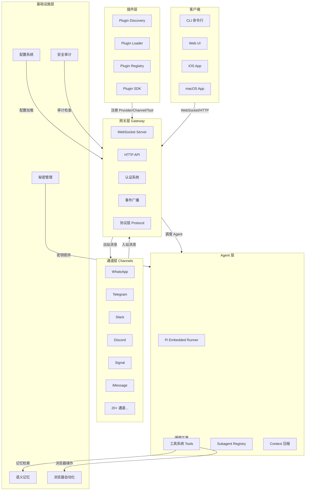
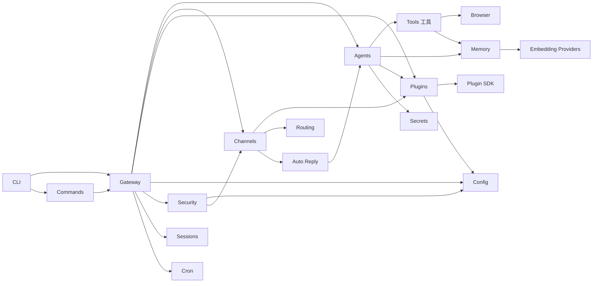
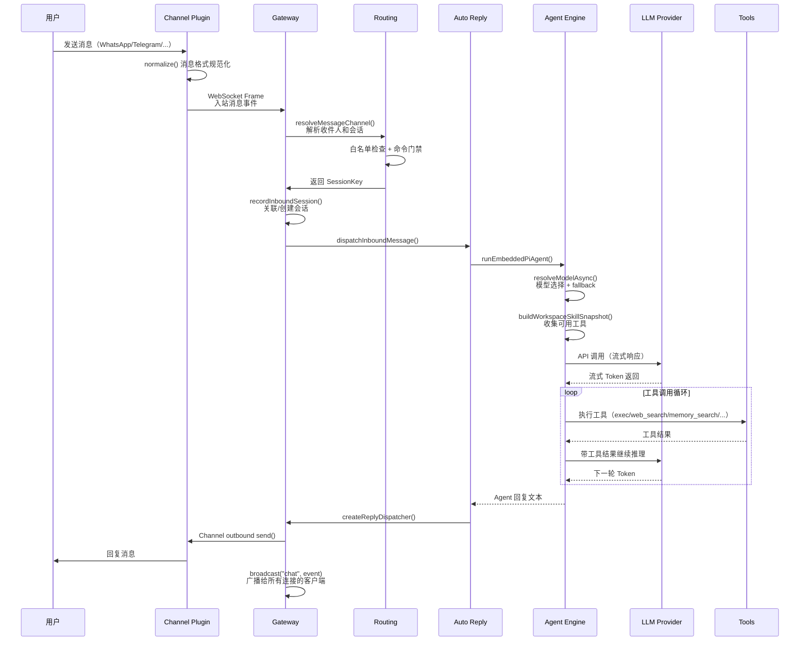
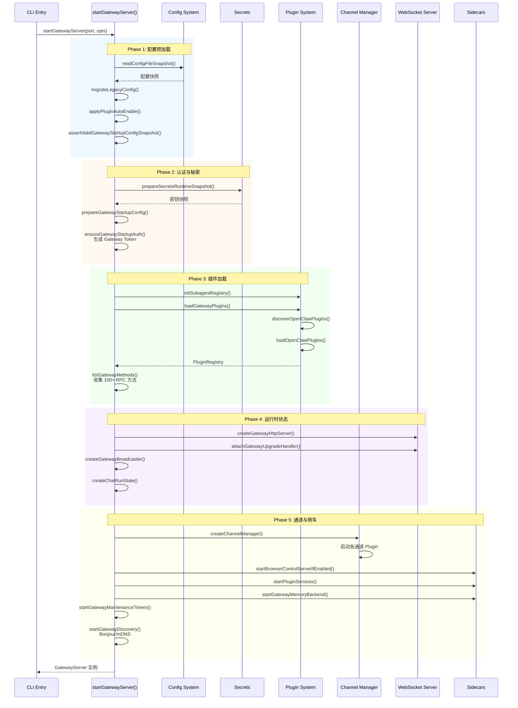

# openclaw 源码学习笔记

> 仓库地址：[openclaw](https://github.com/openclaw/openclaw)
> 学习日期：2026-03-22

---

> **以下为 AI 源码分析**
>
> ### 一句话概括
>
> OpenClaw 是一个可自托管的个人 AI 助手网关，通过统一的 Gateway 将 LLM 能力接入 WhatsApp、Telegram、Slack、Discord 等 20+ 消息通道，支持多 Agent 协作、浏览器自动化、语义记忆等能力。
>
> ### 要点速览
>
> | 核心模块 | 职责 | 关键文件 |
> |---------|------|---------|
> | Gateway | WebSocket/HTTP 控制面，消息路由与广播 | `src/gateway/server.impl.ts` |
> | Agents | AI Agent 执行引擎，LLM 调用与工具编排 | `src/agents/pi-embedded-runner/run.ts` |
> | Channels | 20+ 消息通道适配器，统一收发协议 | `src/channels/registry.ts` |
> | Plugins | 插件发现、加载与注册表 | `src/plugins/loader.ts` |
> | Memory | 向量 + FTS 混合语义记忆检索 | `src/memory/manager.ts` |
> | CLI | Commander 框架，14+ 核心命令懒加载 | `src/cli/run-main.ts` |
> | Security | 安全审计引擎，工具风险管控 | `src/security/audit.ts` |
> | Browser | Chrome CDP 自动化，HTTP Bridge | `src/browser/chrome.ts` |

---

## 项目简介

OpenClaw 是一个开源的**个人 AI 助手平台**，用户可在自有设备上运行。它的核心价值在于：将 LLM（支持 Anthropic Claude、OpenAI GPT、Google Gemini、Ollama 本地模型等）的能力，通过一个统一的 Gateway 控制面，无缝接入用户日常使用的消息应用（WhatsApp、Telegram、Slack、Discord、Signal、iMessage 等 20+ 通道）。用户只需在任意已连接的通道中发消息，即可与 AI 助手对话，助手可调用工具执行文件操作、浏览器自动化、Web 搜索等任务。项目还支持多 Agent 协作、语义记忆、插件扩展、Cron 定时任务、设备配对等高级功能。

## 技术栈

| 类别 | 技术 |
|------|------|
| 语言 | TypeScript (Node.js)、Swift (iOS/macOS 原生应用) |
| 框架 | Commander (CLI)、Express (HTTP Bridge)、WebSocket (Gateway 协议) |
| 构建工具 | pnpm、Vite (UI)、tsup/tsc (后端) |
| 依赖管理 | pnpm (Node)、Swift Package Manager (iOS/macOS) |
| 测试框架 | Vitest |

## 目录结构

```
openclaw/
├── openclaw.mjs              # CLI 启动入口（Node 版本检查 + dist/entry.js 加载）
├── src/                      # 核心源码
│   ├── entry.ts              # 主入口（进程初始化、CLI profile、respawn 逻辑）
│   ├── index.ts              # Library 导出入口（isMain 判断区分 CLI/库模式）
│   ├── cli/                  # CLI 框架（Commander 注册、命令路由、argv 解析）
│   ├── commands/             # 命令实现（agent、message、config 等 300+ 文件）
│   ├── gateway/              # Gateway 控制面（WebSocket 服务器、RPC 方法、协议定义）
│   ├── agents/               # Agent 执行引擎（LLM 调用、工具编排、Subagent 协作）
│   ├── channels/             # 消息通道适配器（统一接口、normalize、outbound）
│   ├── plugins/              # 插件系统（发现、加载、注册表、Provider 认证）
│   ├── plugin-sdk/           # 插件 SDK（频道适配、配置辅助、文件锁、Webhook 保护）
│   ├── memory/               # 语义记忆（SQLite + 向量/FTS 混合搜索、多 Embedding 后端）
│   ├── config/               # 配置系统（Zod Schema、路径解析、验证）
│   ├── security/             # 安全审计（配置/Channel/文件系统检查、危险工具管控）
│   ├── browser/              # 浏览器自动化（Chrome CDP、HTTP Bridge、截图/操作）
│   ├── infra/                # 基础设施（exec 安全、设备配对、Bonjour、环境变量）
│   ├── auto-reply/           # 自动回复调度（消息分发、回复生成）
│   ├── routing/              # 消息路由（收件人解析、白名单、命令门禁）
│   ├── secrets/              # 秘密管理（加密存储、运行时快照）
│   ├── sessions/             # 会话管理（Session Store、持久化）
│   ├── cron/                 # Cron 定时任务
│   ├── hooks/                # Hook 系统（生命周期事件触发）
│   ├── tts/                  # 文本转语音
│   ├── media/                # 媒体处理（图片、音频、视频）
│   ├── tui/                  # 终端 UI
│   └── wizard/               # 交互式设置向导
├── ui/                       # Web UI（Vite + TypeScript 前端）
├── apps/                     # 原生应用
│   ├── ios/                  # iOS 应用（Swift）
│   ├── macos/                # macOS 应用（Swift）
│   └── android/              # Android 应用
├── Swabble/                  # Swift 共享库（iOS/macOS 共用）
├── docs/                     # 文档站
├── skills/                   # 内置 Skills
├── test/                     # 测试套件
└── docker-compose.yml        # Docker 部署配置
```

## 架构设计

### 整体架构

OpenClaw 采用**Hub-and-Spoke（星形）架构**，Gateway 作为中心枢纽，所有消息通道、Agent 引擎、客户端 UI 都通过统一的 WebSocket/HTTP 协议与 Gateway 交互。这种设计使得 Gateway 成为唯一的"控制面"，而实际的 AI 推理和消息传输由各独立模块负责。

系统分为五层：
1. **通道层（Channel Layer）**：20+ 消息适配器，负责消息收发的协议转换
2. **网关层（Gateway Layer）**：WebSocket 服务器 + HTTP API，统一协议和认证
3. **Agent 层（Agent Layer）**：LLM 调用引擎、工具编排、多 Agent 协作
4. **插件层（Plugin Layer）**：Provider、Channel、Tool 的扩展机制
5. **基础设施层（Infra Layer）**：配置、安全、记忆、秘密管理



### 核心模块

#### 1. Gateway 模块 (`src/gateway/`)

**职责**：整个系统的控制面，提供 WebSocket 实时通信和 HTTP REST API，负责消息路由、认证、事件广播。

**核心文件**：
- `server.impl.ts` (~1200 行) - Gateway 启动核心，包含 `startGatewayServer()` 函数
- `server-http.ts` (~1100 行) - HTTP 请求路由和中间件
- `server/ws-connection/message-handler.ts` (~1100 行) - WebSocket 消息处理
- `protocol/index.ts` (~2000 行) - 协议定义、Frame Schema、版本控制
- `server-broadcast.ts` - 事件广播机制（Scope 权限检查、慢消费者处理）
- `auth.ts` - 认证决策引擎（token / password / device / bootstrap 四种模式）

**关键接口**：
- `startGatewayServer(port?, opts?)` - 启动 Gateway，返回 `GatewayServer` 实例
- `RequestFrame / ResponseFrame / EventFrame` - WebSocket 协议帧
- `GatewayRequestContext` - 请求上下文，携带 deps、broadcast、nodeRegistry 等
- 100+ RPC 方法：`chat.send`、`sessions.create`、`agent`、`config.get`、`node.invoke` 等

**与其他模块的关系**：Gateway 是中心枢纽，与 Agents（调度执行）、Channels（消息收发）、Plugins（注册方法）、Config（配置加载）均有直接交互。

#### 2. Agents 模块 (`src/agents/`)

**职责**：AI Agent 执行引擎，负责 LLM 调用、工具编排、Context Window 管理、多 Agent 协作。

**核心文件**：
- `agent-command.ts` (~43KB) - Agent 命令主入口 `runAgentCommand()`
- `pi-embedded-runner/run.ts` (~72KB) - 核心执行循环 `runEmbeddedPiAgent()`
- `pi-embedded-runner/compact.ts` (~50KB) - Session 压缩机制
- `pi-embedded-runner/model.ts` - 模型选择与 fallback
- `subagent-registry.ts` - Subagent 生命周期管理
- `tool-catalog.ts` - 工具目录（minimal / coding / messaging / full 四种 profile）

**关键接口**：
- `runEmbeddedPiAgent(params)` - 执行 Agent 回合
- `resolveModelAsync()` - 模型解析（支持 Anthropic、OpenAI、Google、OpenRouter 等）
- `SubagentRunRecord` - Subagent 运行记录（pending → started → yielded → completed）
- `ToolProfileId` - 工具集 profile 控制

**与其他模块的关系**：接受 Gateway 调度，调用 Tools 执行操作，通过 Channels 发送回复，使用 Memory 进行上下文增强。

#### 3. Channels 模块 (`src/channels/`)

**职责**：20+ 消息通道的统一适配层，通过 `ChannelPlugin` 接口规范化所有通道的消息收发。

**核心文件**：
- `registry.ts` - 通道注册表与元数据
- `session.ts` - 会话映射与录制 `recordInboundSession()`
- `run-state-machine.ts` - 运行状态机（活跃运行计数、忙碌状态）
- `plugins/types.core.ts` - 核心类型（`ChannelPlugin`、`ChannelMeta`、`ChannelAccountSnapshot`）
- `plugins/types.adapters.ts` - 适配器类型（messaging、outbound、setup、lifecycle 等）
- `plugins/normalize/` - 入站消息规范化（WhatsApp、Slack、Signal、iMessage）
- `plugins/outbound/` - 出站消息适配

**关键接口**：
- `ChannelPlugin` - 统一通道插件接口（messaging、outbound、setup、config、status、lifecycle）
- `ChannelMessagingAdapter` - 消息适配器（poll / handler）
- `ChannelOutboundAdapter` - 出站适配器（send）
- `ChannelAccountSnapshot` - 通道账户快照（50+ 状态字段）

**与其他模块的关系**：通过 Gateway 的 `createChannelManager()` 管理启停，接收 Agent 的回复消息并发送到目标通道。

#### 4. Plugins 模块 (`src/plugins/`)

**职责**：插件生态系统，支持 Provider（模型提供商）、Channel（通道）、Tool（工具）、Hook（钩子）四类扩展。

**核心文件**：
- `discovery.ts` - 插件发现（扫描 + 缓存机制）
- `loader.ts` - 插件加载（Jiti 动态加载，128 条缓存上限）
- `registry.ts` - 插件注册表（`PluginRegistry` 包含 Tool/CLI/HTTP/Channel/Provider/Hook/Service 七类注册）
- `manifest.ts` - 插件清单定义（`openclaw.plugin.json`）
- `config-state.ts` - 内置插件列表（30+ 默认启用的 Provider 插件）
- `provider-auth-storage.ts` - Provider 认证存储（20+ Provider 的 API Key 管理）

**关键接口**：
- `PluginManifest` - 插件清单（id、name、configSchema、enabledByDefault）
- `PluginRecord` - 注册记录（status、toolNames、hookNames）
- `OpenClawPluginApi` - 插件 API（config、tools、events、logging 等）

**与其他模块的关系**：Gateway 启动时加载插件注册表，Agent 通过插件获取 Provider 认证，Channel 扩展通过插件系统注册。

#### 5. Memory 模块 (`src/memory/`)

**职责**：语义记忆系统，使用 SQLite 存储，支持向量搜索 + 全文检索（FTS）的混合搜索。

**核心文件**：
- `manager.ts` - `MemoryIndexManager` 类（SQLite 后端，维护 vector/fts/cache 三张表）
- `manager-search.ts` - 搜索操作（`searchKeyword()` FTS、`searchVector()` 向量）
- `hybrid.ts` - 混合搜索（BM25 评分 + 向量相似度合并）
- `embeddings.ts` - Embedding Provider 抽象（openai、local、gemini、voyage、mistral、ollama）
- `prompt-section.ts` - 记忆注入 Agent Prompt

**关键接口**：
- `MemorySearchManager` - 搜索管理器（search、readFile、status、sync）
- `MemorySearchResult` - 搜索结果（path、score、snippet、source、citation）
- `EmbeddingProvider` - Embedding 提供者（embedQuery、embedBatch）

**与其他模块的关系**：Agent 通过 `memory_search` 工具检索记忆，Gateway 启动时初始化 Memory Backend。

#### 6. Security 模块 (`src/security/`)

**职责**：安全审计引擎，检查配置、通道、文件系统权限、插件信任链等风险。

**核心文件**：
- `audit.ts` (1318 行) - 主审计引擎 `runSecurityAudit()`
- `audit-extra.sync.ts` - 同步检查（硬编码秘密、HTTP 无认证、沙箱风险）
- `audit-extra.async.ts` - 异步检查（插件信任链、Skill 代码安全、文件系统权限）
- `dangerous-tools.ts` - 危险工具清单（exec、spawn、shell 等需要审批）

**关键接口**：
- `SecurityAuditReport` - 审计报告（summary + findings）
- `SecurityAuditFinding` - 审计发现（checkId、severity、title、detail、remediation）

### 模块依赖关系



## 核心流程

### 流程一：消息入站处理（Channel → Agent → Reply）

这是 OpenClaw 最核心的端到端流程：用户通过任意通道发送消息，经过 Gateway 路由到 Agent 处理，最终将 AI 回复发送回原通道。



**关键步骤说明**：

1. **消息规范化**：每个 Channel Plugin 的 `normalize/` 模块将平台特定消息格式转为统一的 `InboundEnvelope`
2. **路由解析**：`src/routing/` 根据发送者身份、白名单策略、命令门禁决定是否处理
3. **会话关联**：`recordInboundSession()` 在 `~/.openclaw/sessions/` 中维护会话持久化
4. **Agent 执行**：`runEmbeddedPiAgent()` 是核心循环——模型调用 → 工具执行 → 再次调用，直到 Agent 决定停止
5. **模型 Fallback**：`runWithModelFallback()` 在主模型失败时自动切换备用模型
6. **Context 压缩**：`compact.ts` 在 Context Window 接近上限时自动压缩历史消息

### 流程二：Gateway 启动流程

Gateway 启动是一个复杂的多阶段初始化过程，涉及配置加载、认证初始化、插件加载、通道启动等。



**阶段说明**：

1. **配置预加载**：读取 `~/.openclaw/config.json`，执行配置迁移和插件自动启用
2. **认证初始化**：加载加密的秘密存储，生成 Gateway 访问 Token
3. **插件加载**：扫描发现 30+ 内置插件 + 用户插件，构建 `PluginRegistry`
4. **运行时创建**：启动 HTTP/WebSocket 服务器，初始化事件广播和 Chat 状态管理
5. **侧车启动**：按需启动浏览器控制服务、插件服务、Memory Backend、Bonjour 发现

## 关键设计亮点

### 1. 统一的 Channel Plugin 适配器模式

**解决问题**：20+ 消息平台各有不同的 API 和消息格式，需要统一抽象。

**实现方式**：`ChannelPlugin` 接口定义了 8+ 适配器（messaging、outbound、setup、config、status、lifecycle、auth、security），每个通道只需实现相关适配器。入站消息通过 `normalize/` 转为统一格式，出站通过 `outbound/` 适配回平台格式。

**关键文件**：`src/channels/plugins/types.core.ts`、`src/channels/plugins/types.adapters.ts`

**设计优势**：新增通道只需实现 `ChannelPlugin` 接口，无需修改 Gateway 核心代码，真正做到了 Open/Closed Principle。

### 2. Agent 执行引擎的 Model Fallback 机制

**解决问题**：依赖单一 LLM Provider 时，API 限流或故障会导致助手完全不可用。

**实现方式**：`runWithModelFallback()` 函数实现级联降级——主模型调用失败时，自动按优先级尝试备用模型（如 Claude → GPT-4 → Gemini）。Fallback 历史保存在 Session 中，避免重复尝试已知失败的模型。同时 `resolveModelAsync()` 支持 Agent 级别和 Session 级别的模型覆盖。

**关键文件**：`src/agents/pi-embedded-runner/model.ts`、`src/agents/pi-embedded-runner/run.ts`

**设计优势**：保证助手的高可用性，用户无感知地在多个 Provider 间切换。

### 3. 混合语义记忆检索（Vector + FTS）

**解决问题**：纯向量搜索对精确关键词匹配弱，纯关键词搜索缺乏语义理解。

**实现方式**：`MemoryIndexManager` 在 SQLite 中同时维护 `chunks_vec`（向量表）和 `chunks_fts`（全文搜索表）。搜索时 `mergeHybridResults()` 将 BM25 评分和向量相似度通过加权方式合并。支持 6 种 Embedding Provider（OpenAI、Gemini、Voyage、Mistral、Ollama 本地、内置），可根据用户的模型订阅灵活选择。

**关键文件**：`src/memory/manager.ts`、`src/memory/hybrid.ts`、`src/memory/embeddings.ts`

**设计优势**：精确查询和模糊语义查询兼顾，且本地 SQLite 存储避免了外部向量数据库依赖。

### 4. 插件系统的懒加载与缓存机制

**解决问题**：30+ 内置插件全部同步加载会严重拖慢启动速度。

**实现方式**：插件发现（`discoverOpenClawPlugins()`）带有 1 秒缓存（`DEFAULT_DISCOVERY_CACHE_MS`），加载器（`loadOpenClawPlugins()`）使用 Jiti 动态模块加载并维护 128 条 LRU 缓存。CLI 命令注册也采用懒加载——`registerProgramCommands()` 只注册命令描述，实际的 `action()` handler 在命令被调用时才 `import()` 对应模块。

**关键文件**：`src/plugins/discovery.ts`、`src/plugins/loader.ts`、`src/cli/program/command-registry.ts`

**设计优势**：启动速度快，只加载实际需要的代码；缓存避免重复文件扫描。

### 5. WebSocket-First 协议设计与安全分层

**解决问题**：多客户端（CLI、Web UI、移动 App）需要实时通信，同时要保证安全。

**实现方式**：Gateway 定义了完整的 WebSocket 协议（`protocol/index.ts`），包含 `RequestFrame`、`ResponseFrame`、`EventFrame` 三种帧类型，21 个 Schema 文件验证消息格式。认证分为四层（token / password / device / bootstrap），每个 RPC 方法可指定角色（operator / node）和 Scope（admin / read / write / approvals / pairing）。事件广播时检查每个客户端的 Scope 权限，慢消费者会被自动降级或断开。

**关键文件**：`src/gateway/protocol/index.ts`、`src/gateway/auth.ts`、`src/gateway/server-broadcast.ts`

**设计优势**：类型安全的协议层确保客户端-服务器通信可靠；细粒度的 Scope 控制实现最小权限原则。
