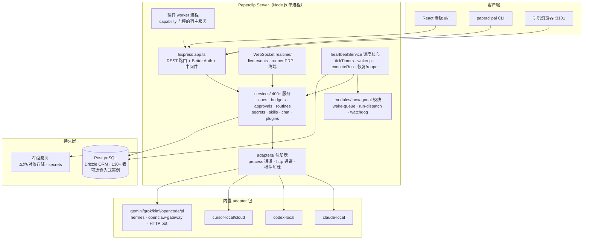
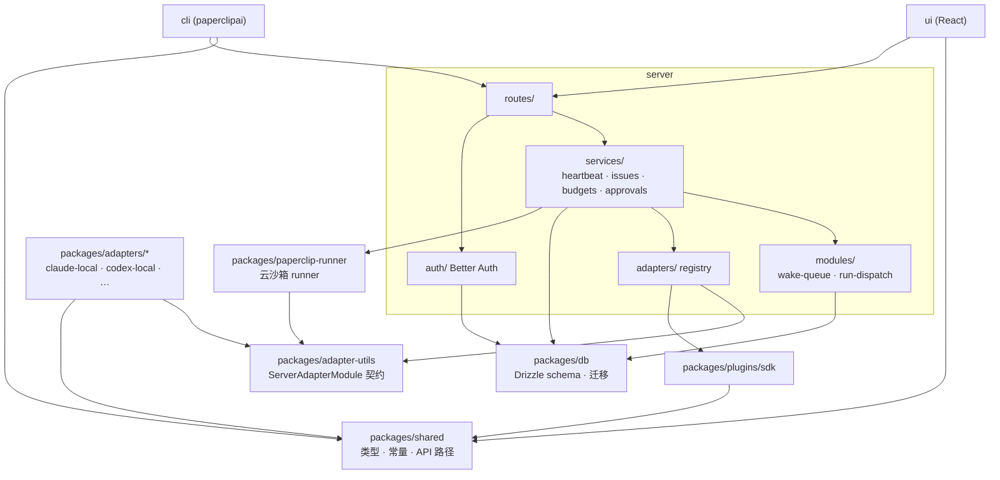
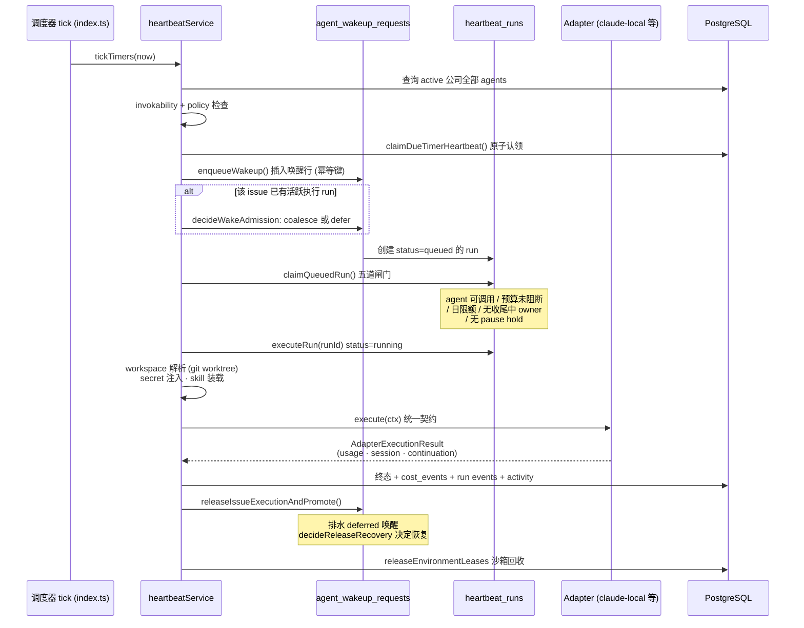
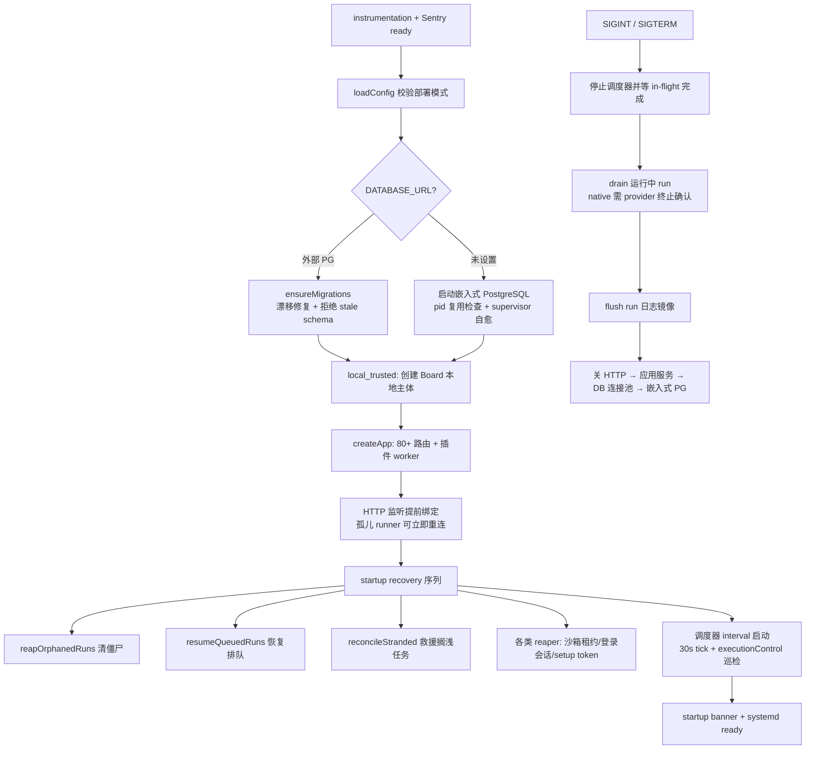

# paperclip 源码学习笔记

> 仓库地址：[paperclip](https://github.com/paperclipai/paperclip)
> 学习日期：2026-09-30

---

> **以下为 AI 源码分析**
>
> ### 一句话概括
>
> Paperclip 是一个开源的「AI Agent 公司控制平面」：用 Node.js + React 把一群异构 AI agent（Claude Code、Codex、Cursor、OpenClaw、HTTP bot）组织成一家有组织架构、预算、任务系统和治理审批的「公司」，核心引擎是 DB 持久化的心跳唤醒队列与运行调度器。
>
> ### 要点速览
>
> | 模块 | 职责 | 关键文件 |
> |------|------|----------|
> | `server/` | Express API + 全部编排服务（心跳、任务、预算、治理） | `src/index.ts`（启动）、`src/services/heartbeat.ts`（3 万行调度核心）、`src/routes/`（80+ 路由文件） |
> | `ui/` | React 19 看板界面（任务、agent、审批、成本） | `src/App.tsx`（路由）、`src/pages/`（147 个页面）、`src/components/` |
> | `packages/db/` | Drizzle schema + 迁移 + 嵌入式 PostgreSQL 管理 | `src/schema/`（130+ 表） |
> | `packages/adapters/*` | 12 个内置 agent adapter（claude-local、codex-local 等） | 每个包导出 `ServerAdapterModule` |
> | `packages/adapter-utils/` | adapter 共享契约与工具（类型、沙箱、登录、workspace 恢复） | `src/types.ts`（`AdapterRuntime`、`ServerAdapterModule`） |
> | `server/src/modules/` | 从 heartbeat.ts 抽出的 hexagonal 模块（wake-queue、run-dispatch、active-run-watchdog） | `domain/policy.ts`（纯决策函数） |
> | `cli/` | `paperclipai` 发布包（onboard、test-drive、服务安装） | `src/index.ts` |
> | `packages/plugins/*` | 进程外插件系统（SDK、示例、sandbox provider） | `sdk/` |
> | `doc/` | 产品规格与运维文档 | `SPEC.md`、`architecture/durable-continuation-scheduler.md` |

---

## 项目简介

Paperclip 的定位是「管理 AI agent 干活的应用」——官方口号：**如果 OpenClaw 是一名员工，Paperclip 就是这家公司**。用户定义组织使命（如「把 AI 笔记应用做到 $1M MRR」），然后"雇佣"CEO、CTO、工程师、设计师等 agent（任何 provider 的任何 bot），给每个 agent 设预算、上级和权限，任务以 ticket 形式流转，agent 通过周期性 heartbeat 醒来干活，治理层（Board）随时审批、暂停、终止任何 agent。

它解决的核心痛点：同时开 20 个 Claude Code 终端会失控——任务无追踪、重启丢上下文、token 花费失控、需要人肉串起多个 agent 的协作。Paperclip 的答案是：**把"公司运营"的完整语义（org chart、任务系统、预算、审计、审批）做成持久化控制平面，agent 本身只是可插拔的执行器**（"If it can receive a heartbeat, it's hired"）。

四根产品支柱：Agentic Task Manager（任务/审批/例程）、Org Chart for Agents（角色/权限/边界）、Agent Employee Training（Skill Studio/evals）、Agentic OS（跨 provider 运行时/沙箱/成本控制）。

## 技术栈

| 类别 | 技术 |
|------|------|
| 语言 | TypeScript（`typescript@^7.0.2`），Node.js >= 24.11 |
| 框架 | 后端 Express；前端 React 19 + React Router + Tailwind v4（CSS 变量 token，无 tailwind config）+ CodeMirror |
| 构建工具 | tsx（dev 直跑 TS）、esbuild、Vite（UI） |
| 依赖管理 | pnpm 9.15.4 workspace（`pnpm-workspace.yaml` 定义 packages/* + server + ui + cli），11 个 `patchedDependencies` 补丁 |
| 数据库 | PostgreSQL（Drizzle ORM；无 `DATABASE_URL` 时自动起 `embedded-postgres` 本地实例） |
| 测试框架 | Vitest（单元，`pnpm test`）、Playwright（E2E/视觉回归，`pnpm test:e2e`）、promptfoo（evals） |
| 可观测 | opt-in OpenTelemetry（traces）、Sentry（前后端）、自研 activity 审计日志 |

## 目录结构

```text
paperclip/
├── server/                     # 控制平面核心：Express API + 编排服务
│   └── src/
│       ├── index.ts            # startServer()：启动序列（DB→auth→app→WS→recovery→调度器）
│       ├── app.ts              # createApp()：组装 80+ 路由与中间件
│       ├── routes/             # REST 路由（issues/agents/approvals/budgets/...）
│       ├── services/           # 400+ 服务文件；heartbeat.ts 3 万行是运行引擎
│       ├── modules/            # hexagonal 模块（wake-queue/run-dispatch/active-run-watchdog）
│       ├── adapters/           # adapter 注册表 + process/http 两类执行通道
│       ├── realtime/           # WebSocket（live-events、runner PRP、终端）
│       └── auth/               # Better Auth（authenticated 模式）
├── ui/                         # React 看板（React Router 60+ 路由）
│   └── src/（pages 147 个、components、features、api、i18n）
├── cli/                        # paperclipai npm 包（onboard/test-drive/configure）
├── packages/
│   ├── db/                     # Drizzle schema（130+ 表）+ 迁移 + 嵌入式 PG 生命周期
│   ├── shared/                 # 跨端共享类型/常量/API 路径
│   ├── adapter-utils/          # adapter 契约（ServerAdapterModule 等 40+ 源文件）
│   ├── adapters/               # 12 个内置 adapter（claude-local、codex-local、cursor-*、
│   │                           #   gemini/grok/kimi/opencode/pi-local、hermes、openclaw-gateway）
│   ├── plugins/                # 插件 SDK + sandbox provider 插件 + 示例
│   ├── paperclip-runner/       # 云沙箱 runner（Daytona/e2b 等）
│   ├── skills-catalog/         # 随应用分发的 skill 目录
│   └── mcp-server/ 等          # 辅助 MCP server 包
├── skills/                     # Paperclip 自身的运行时/运维 skill（非用户目录）
├── doc/                        # SPEC、DEVELOPING、architecture/ 设计文档
└── docker/ · Dockerfile · scripts/   # 部署与发布自动化
```

## 架构设计

### 整体架构

整体是一个**单进程控制平面 + DB 持久化状态机**的架构。关键思想：**agent 进程是短命的，状态全部进数据库**——一个 heartbeat run 有明确生命周期（启动→执行→记录终态→退出），"还要继续干活"的意图以数据库行（wakeup request、continuation effect、scheduled retry）的形式存续，进程重启后由 startup reconciliation 修复。这让调度是 durable 的：没有常驻 agent 进程、没有内存队列，一切可恢复。

分层上：`ui/cli` 是客户端，`server` 承载 REST API 与编排服务，`packages/adapters/*` 把异构 agent 抽象成统一契约，`packages/db` 是唯一持久层。多组织（company）隔离是第一原则——所有实体都带 `companyId`，一套部署跑多个"公司"。



### 核心模块

#### 1. 运行引擎：`services/heartbeat.ts`（30,083 行）

整个系统的心脏，`heartbeatService(db, options)` 工厂返回一个巨大 API 对象。职责覆盖：

- **唤醒入队**：`wakeup()` / `enqueueWakeup()`（heartbeat.ts:26474）——所有"该干活了"的信号（定时器、任务指派、@-mention、评论、例程触发、恢复）都收敛为 `agent_wakeup_requests` 表的一行，带幂等键与 actor 归因。
- **定时调度**：`tickTimers()`（heartbeat.ts:29941）——遍历 active 公司的全部 agent，按 `agents.lastHeartbeatAt + intervalSec` 判定到期，`claimDueTimerHeartbeat()` 原子认领（防多实例重复唤醒）后入队。
- **原子认领与执行**：`claimQueuedRun()`（heartbeat.ts:17214）在事务里做五道闸门——agent 存活且 invokable、预算未阻断（`budgets.getInvocationBlock`）、心跳日限额未超、无同任务正在收尾的 native run、未被 subtree pause hold 挂起；`executeRun()`（heartbeat.ts:20094）负责真正的执行编排（workspace 解析、secret 注入、skill 装载、adapter 调用、进程/沙箱生命周期）。
- **两种运行时模式**：`runtimeMode = "legacy" | "native"`。legacy = 直接 spawn CLI 子进程（`adapters/process/execute.ts`，记录 `processPid/processGroupId`）；native = 走 ACP（Agent Client Protocol）长会话或云 runner（`services/native-runtime/`，带 session 续接、completion contract、native phase）。
- **恢复与自愈**：`reapOrphanedRuns`（清僵尸 run）、`resumeQueuedRuns`、`promoteDueScheduledRetries`、`reconcileStrandedAssignedIssues`（搁浅任务救援）、`recoverNativeRunsAfterRestart`、`scanSilentActiveRuns`（静默 run 看门狗）、`sweepStaleIssueLocks` 等——启动时和每个调度 tick 都跑。
- **取消与预算联动**：`cancelRunInternal` 处理运行中取消（native 需验证 provider 终止确认，legacy 杀进程组）；`cancelBudgetScopeWork` 在预算超限时按 company/agent/project/goal 范围取消运行和排队唤醒。

#### 2. 唤醒队列模块：`modules/wake-queue/`（hexagonal）

从 heartbeat.ts 抽出的第一个 feature module，解决"新唤醒到达时该任务已有一个活跃执行 run"的仲裁：

- `domain/policy.ts` 是纯决策函数集（无 IO、不读时钟、caller 传 facts 对象）：`decideWakeAdmission()` 返回 **coalesce**（并入当前 run，同 agent 同 actor 且允许合并）/ **defer**（排队为 `deferred_issue_execution`）/ **proceed**（无锁直行）；`decidePreDrain`、`decideQueuedCommentAction`、`decideWakeOutcome`、`decideReleaseRecovery` 构成释放锁后的延迟唤醒排水与恢复决策。
- `application/` 是 use case + ports；`adapters/postgres.ts` 持有释放事务；`index.ts` 组装并暴露唯一入口。
- 分层规则由 `pnpm check:module-boundaries` 强制：`domain` 禁止 import drizzle/Node IO；`application` 禁止 import 具体实现；外部只能 import 模块 `index.ts`。

#### 3. 运行分发模块：`modules/run-dispatch/`

调度重试的门禁与晋升：`evaluateScheduledRetryGate`（预算/pause hold/依赖阻断/处置修复等 Gate 决策）、`promoteDueScheduledRetries`（把 `scheduledRetryAt` 到期的 run 升回队列）、`cancelStaleQueuedRun`（陈旧排队清理）。同样三层结构，domain 决策纯函数化。

#### 4. Adapter 层：`packages/adapters/*` + `server/src/adapters/`

统一契约 `ServerAdapterModule`（adapter-utils/src/types.ts:456）：必选 `type` / `execute(ctx)` / `testEnvironment(ctx)`，可选 `listSkills`/`syncSkills`、`sessionCodec`、`sessionManagement`、`models`/`listModels`/`refreshModels`、`getQuotaWindows`、`onHireApproved`、ACP 描述符等。12 个内置 adapter 各自是独立 npm 包（如 `claude-local` 的 `agentConfigurationDoc` 直接暴露给 UI 生成配置表单），另有 `plugin-loader.ts` 支持外部 adapter 插件动态注册进 `registry.ts`（`registerServerAdapter` / `waitForExternalAdapters`）。执行通道分三类：`adapters/process/`（本地子进程 + Bubblewrap 文件系统/网络沙箱）、`adapters/http/`（HTTP/webhook bot，如 OpenClaw）、native runtime（ACP/云沙箱）。

#### 5. 数据层：`packages/db/`

130+ 表里最核心的六张：

- `companies`（多租户根）→ `agents`（org chart：`reportsTo` 自引用、`role`、`adapterType`、`budgetMonthlyCents`/`spentMonthlyCents`、`status`、`lastHeartbeatAt`）
- `agent_wakeup_requests`（唤醒队列：`status` = queued/deferred_issue_execution/claimed/running/succeeded/…，`coalescedCount`，幂等键上的部分唯一索引）
- `heartbeat_runs`（运行记录：`runtimeMode`、`nativeSessionId`、`processPid`、`scheduledRetryAt`、`livenessState`、`contextSnapshot` JSONB——含 `issueId` 表达式索引）
- `issues`（任务树：company/project/goal/parent 链、执行锁 `executionRunId`、blocker 依赖）
- `cost_events` + `budget_policies`（按 company/agent/project/goal/issue/provider/model 的成本与 hard-stop 预算）

迁移管理完善：`inspectMigrations`/`applyPendingMigrations`/`reconcilePendingMigrationHistory`（启动时修复漂移的迁移日志），还有 `check-migration-safety` 基线测试。

#### 6. 治理与插件

- `services/approvals.ts` + `decisions.ts`：Board 审批流（雇佣、策略变更），决策签名（`decision-signing.ts` 的 signing secret）与保留期。
- 插件系统：进程外 worker（`plugin-worker-manager.ts`），manifest 校验、capability 门控的宿主服务、job 调度、tool 暴露、UI 贡献点——不改 fork 就能扩展。

### 模块依赖关系



值得注意的边界纪律：server 不直接 import adapter 包内部，全部经 `adapters/registry.ts` 按 `adapterType` 字符串解析；`modules/` 禁止反向 import `services/`（检查脚本强制）；`ui` 只通过 `shared` 的 API 路径常量与 REST/WebSocket 通信。

## 核心流程

### 流程一：一次心跳运行的生命周期（定时器 → 唤醒 → 认领 → 执行 → 释放）

这是系统最核心的链路。入口在 `index.ts` 的调度器 interval（默认 30s，`HEARTBEAT_SCHEDULER_INTERVAL_MS`，下限 10s）：



关键逻辑说明：

1. **唤醒收敛**：定时器、任务指派（`issue-assignment-wakeup.ts`）、评论（`issue-comment-wakeup.ts`）、依赖解除、例程触发、chat 消息全部走同一个 `enqueueWakeup`，靠 `idempotencyKey`（表上的部分唯一索引）与 `coalescedCount` 去重合并。
2. **准入仲裁**（wake-queue 模块）：同 agent、同 durable actor 且允许 coalescing 时新唤醒并入现有 run；否则存为 `deferred_issue_execution`，等当前 run 释放锁时"排水"（drain）——`decidePreDrain` 先排除已释放/需阻塞通知/遗留执行的情形，`decideQueuedCommentAction` 处理排队评论失效（全部被丢弃则 `cancel_empty`），`decideWakeOutcome` 检查 agent 仍可调用且不被 pause hold 压制，最后 `decideReleaseRecovery` 决定是否要自动排恢复 run。
3. **预算硬停**：`claimQueuedRun` 里 `budgets.getInvocationBlock` 阻断 + `cancelBudgetScopeWork` 主动取消超预算范围的运行与排队——这是 README 宣称 "atomic execution, no runaway spend" 的实现位置。
4. **执行双模**：legacy 模式 spawn 子进程（Claude CLI 等，支持 Bubblewrap 文件系统/网络沙箱与代理 allowlist）；native 模式走 ACP 长会话（`--dangerously-skip-permissions`、session compaction、`warmHandleIdleMs` 温热复用）或云 runner（Daytona/e2b，workspace git 同步）。
5. **故障与恢复**：瞬态失败按 `computeBoundedTransientHeartbeatRetrySchedule` 有界退避排入 `scheduledRetryAt`；进程崩溃留下的孤儿 run 由 `reapOrphanedRuns`（5 分钟 staleness）终结并释放 issue 锁；被搁浅的已指派任务由 `reconcileStrandedAssignedIssues` 每 tick 救援。native run 重启恢复极为谨慎——PID 不能当所有权凭证（可能被 OS 回收），必须验证 provider 侧停止证据才允许"安全替换"。

### 流程二：服务器启动与优雅关闭（一切以可恢复为先）

`startServer()`（server/src/index.ts:191）体现了"fail-loud + 可恢复"的设计哲学：



关键点：

- **fail-closed 姿态**：认证公网部署缺 `DATABASE_URL` 直接拒启；`PAPERCLIP_MANAGED_CONFIG` JSON 损坏拒启（而非静默降级）；迁移未应用拒启并提示 `pnpm db:migrate`。区分"托管云预期的瞬态失败"（重启可恢复，不上报 Sentry）与真实配置错误。
- **监听先于恢复**：HTTP listener 在孤儿 reconciliation 之前绑定，因为崩溃中幸存的 runnerd 进程已经在重连这个地址——晚绑定会把健康进程变成重复 provider 风险。
- **优雅关闭顺序**（`shutdown.ts`）：调度器静止 → drain 运行中 run（含 hot-restart 跳过路径）→ flush 日志镜像 → 关 HTTP（服务还活着时排水在途请求）→ 应用服务 → DB 连接池 → 嵌入式 PG。注释里详细解释了为何 embedded-postgres 的 `async-exit-hook` 要被剥离（会与心跳快照查询竞争）。
- **两大部署模式**：`local_trusted`（回环免认证，快速上手）与 `authenticated`（Better Auth + 多用户 + 公网部署约束）。从 local_trusted 升级后遗留的 `local-board` 管理员需走一次性 Board Claim URL 认领所有权。

## 关键设计亮点

### 1. 持久化状态机取代常驻 agent 进程（durable continuation）

- **解决的问题**：agent 进程崩溃/重启后工作丢失、内存队列不可恢复、长任务无法跨心跳续接。
- **实现**：所有"意图"落库——`agent_wakeup_requests`（唤醒）、`scheduledRetryAt`（重试）、native continuation effect（`yielded` 结果带 kind/idempotency key，由 status arbiter 物化为唤醒行）、issue 执行锁。`doc/architecture/durable-continuation-scheduler.md` 明确阐述："Paperclip 不在 turn 之间保活 agent 进程；心跳 run 是有限的。要继续，就把意图写进数据库状态，等条件满足再造一个 run。"
- **为什么这样设计**：把可靠性从进程层上移到数据库层后，崩溃恢复变成"启动时跑一遍 reconciliation"这一件事，同时天然支持多实例与审计。代价是调度路径极其复杂（heartbeat.ts 3 万行、大量 reaper/sweeper），但换来了 24/7 无人值守运行所需的正确性。

### 2. 巨石服务的受控拆分：modules/ 的 hexagonal 契约 + 检查脚本强制

- **解决的问题**：heartbeat.ts 已经 3 万行，继续膨胀会失控，但一次性重写风险太大。
- **实现**：`server/src/modules/<name>/` 三层（`domain` 纯函数 → `application` use case + ports → `adapters` Postgres 实现），每层一条 import 规则，`scripts/check-module-boundaries.mjs`（`pnpm check:module-boundaries`）在 CI 强制执行，外部只能 import 模块 `index.ts`。domain 层的时钟也禁止直读——caller 必须传 `now`，这让全部决策可测试。`wake-queue` 的 `domain/policy.ts` 注释即合同："caller 读库并打包成 facts 对象，本文件只对 facts 分支。"
- **为什么这样设计**：绞杀者模式（strangler pattern）的纪律版——不靠 review 自觉靠工具强制，每个抽出的模块自带纯函数测试（policy.test.ts），既有代码可以增量迁移而不用大爆炸重写。对任何长命巨石服务都是可复用的方法。

### 3. "能收心跳就录用"的 adapter 插件契约

- **解决的问题**：agent 生态碎片化（CLI 工具、云沙箱、聊天 bot、HTTP webhook），每家配置/模型/会话语义都不同。
- **实现**：`ServerAdapterModule` 接口把差异封装到最小必选面（`execute` + `testEnvironment`），把可变面做成可选能力（skills 同步、model 发现、配额查询、session compaction、hire 回调、配置文档字符串）。adapter 是独立 npm 包可单独发版；`registry.ts` 支持运行时插件注册（`registerServerAdapter` + 启动时 `waitForExternalAdapters`）。`claude-local` 的 `agentConfigurationDoc` 是一段 Markdown，直接被 UI 渲染为配置说明——配置文档即代码。
- **为什么这样设计**：控制平面与执行器彻底解耦。Paperclip 不构建 agent（"Not an agent framework"），只编排它们；新 provider 只需实现契约的一个子集即可接入整个任务/预算/治理体系。sandbox 策略（`filesystemScope`/`networkScope` Bubblewrap 沙箱、allowlist 代理）作为 adapter config 字段声明式下发，安全边界与业务配置同层表达。

### 4. 原子性作为产品卖点（claim → budget → lock 全在事务闸门里）

- **解决的问题**：多个唤醒同时到达时重复干活（double-work）、预算超限后 run 还在烧钱（runaway spend）。
- **实现**：`claimDueTimerHeartbeat`（防调度器双跳）、`claimQueuedRun`（五道闸门串行校验：invokability → 预算阻断 → 日限额 → 同任务收尾中的 native owner → pause hold）、issue 执行锁（`issues.executionRunId`）+ `wake-queue` 的准入/释放事务。预算 hard-stop 在两个方向生效：入口阻断（`getInvocationBlock`）与运行中取消（`cancelBudgetScopeWork` 按 company/agent/project/goal 范围批量取消）。
- **为什么这样设计**：README 把 "Atomic execution" 列为第一卖点，这不是营销——代码里每个 claim 都是"检查 + 条件更新"的数据库事务模式（`WHERE status = ...` 条件写），配合 `controllerBootId`/controller lease 防跨容器重复控制，代价是代码可读性下降（大量防御性检查），收益是 20 个 agent 并发时零重复执行。

### 5. 运维级工程细节：嵌入式数据库的进程监督与多租户隔离

- **解决的问题**：自托管用户"零配置跑起来"（无 Postgres 安装）与生产部署（外部 PG + 公网认证）是两种截然不同的形态。
- **实现**：无 `DATABASE_URL` 时用 `embedded-postgres` 起本地集群——复用已有进程（校验 `postmaster.pid` 与 data dir 归属，拒绝错误的复用）、自建 supervisor 处理意外退出（拒绝在数据目录报告活进程时恢复、恢复耗尽则 SIGTERM 自身）、`embedded-postgres-owner.ts` 校验端口归属；`packages/db` 同时是 schema、迁移执行器与嵌入式 PG 生命周期的唯一管理者。多组织隔离则是 schema 层原则：所有表带 `companyId`，唤醒/运行/成本/活动全部 company-scoped，公司可整体导出导入（secret 脱敏 + 冲突处理）。
- **为什么这样设计**：本地单进程体验（npx 即用）与云多租户（"one deployment, many companies"）共享同一代码路径，靠 config 分叉而非代码分叉；嵌入式 PG 的坑（异步 exit hook、stale pid 文件、端口漂移）全部以显式恢复逻辑处理而非假设不出错——这是"产品级"与"demo 级"自托管软件的分水岭。

---

*学习备注：本仓库规模极大（server/src/services 一个目录 400+ 文件、schema 130+ 表），本笔记聚焦控制平面主干——唤醒调度、运行执行、adapter 契约、恢复机制。未深入的部分：chat 渠道集成（Slack/Discord/Telegram/Teams/GitHub 各有一组 publication/receipt/modal 服务）、插件系统内部、MCP 工具网关、pipeline/cases、evals、skills-catalog 内容、UI 组件层。若需深入某条线，`doc/` 目录有对应的专题文档（如 `doc/architecture/native-status-arbitration.md`、`doc/execution-semantics.md`、`doc/TASK-WATCHDOG.md`）。*
