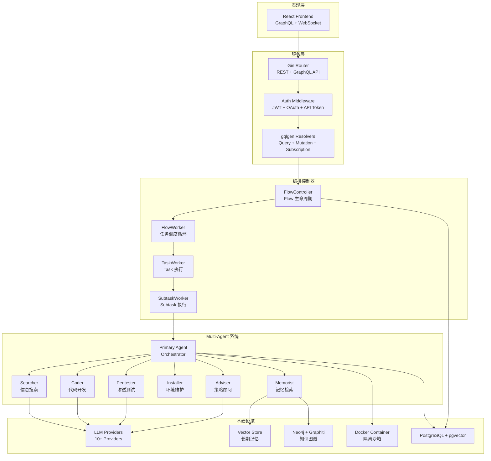
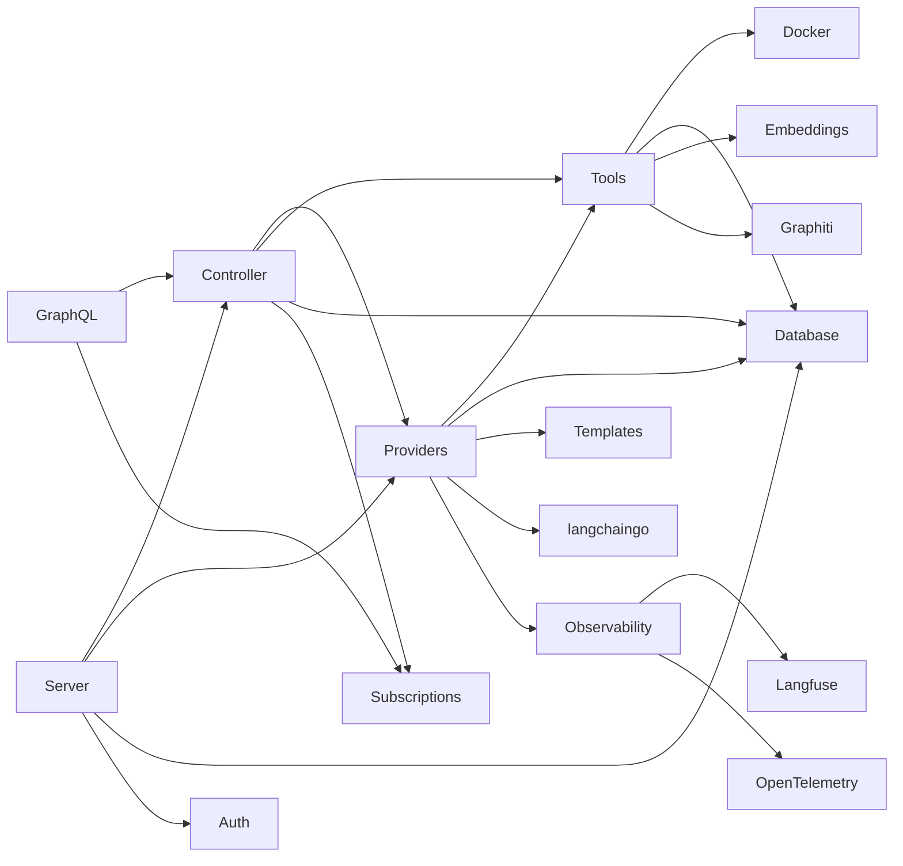
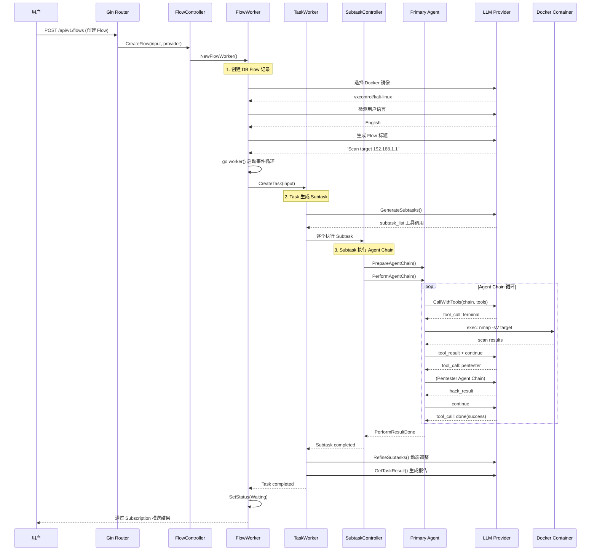
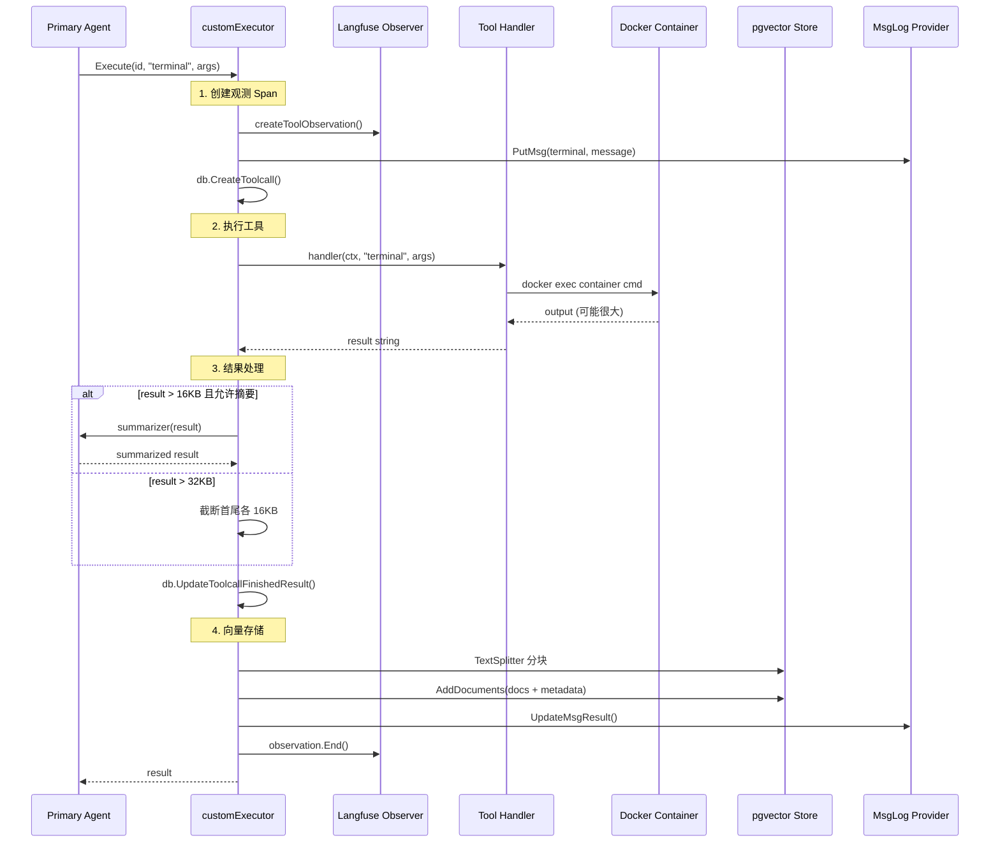

# PentAGI 源码学习笔记

> 仓库地址：[PentAGI](https://github.com/vxcontrol/pentagi)
> 学习日期：2026-04-05

---

> **以下为 AI 源码分析**
>
> ### 一句话概括
>
> PentAGI 是一个基于 Multi-Agent 架构的自主渗透测试系统，通过 LLM 驱动的 Agent 团队协作，在隔离 Docker 容器中自动执行安全测试任务。
>
> ### 要点速览
>
> | 核心模块 | 职责 | 关键文件 |
> |---------|------|---------|
> | Controller | Flow/Task/Subtask 生命周期管理 | `backend/pkg/controller/flow.go`, `task.go`, `subtask.go` |
> | Providers | LLM Provider 抽象与 Agent 执行引擎 | `backend/pkg/providers/provider.go`, `providers.go`, `handlers.go` |
> | Tools | Agent 可用工具注册与执行 | `backend/pkg/tools/registry.go`, `executor.go`, `tools.go` |
> | Server | REST/GraphQL API 路由与认证 | `backend/pkg/server/router.go`, `auth/` |
> | Database | PostgreSQL + pgvector 数据持久化 | `backend/pkg/database/` |
> | Frontend | React Web UI 交互界面 | `frontend/src/` |

---

## 项目简介

PentAGI（Penetration testing Artificial General Intelligence）是一个创新的自动化安全测试工具，利用前沿 AI 技术为信息安全专业人员提供强大灵活的渗透测试解决方案。系统采用 Multi-Agent 架构，由一个 Primary Agent（Orchestrator）协调多个专业 Agent（Researcher、Developer、Pentester、Installer 等）协作完成渗透测试任务。所有操作在隔离的 Docker 容器中执行，支持 10+ LLM Provider，内置 20+ 专业安全工具，配备向量记忆系统和知识图谱，可自动生成详细的漏洞报告。

## 技术栈

| 类别 | 技术 |
|------|------|
| 语言 | Go 1.24（Backend）、TypeScript（Frontend） |
| 框架 | Gin（HTTP）、gqlgen（GraphQL）、React 19 + Vite 7 |
| 构建工具 | Docker multi-stage build、Go build |
| 依赖管理 | Go Modules、npm |
| 测试框架 | Go testing、Vitest |
| 数据库 | PostgreSQL + pgvector（向量存储）、Neo4j（知识图谱） |
| 可观测性 | Langfuse（LLM 分析）、OpenTelemetry、Grafana、Jaeger |
| LLM 集成 | langchaingo（Go 版 LangChain）支持 OpenAI/Anthropic/Gemini/Bedrock/Ollama/DeepSeek 等 |

## 目录结构

```
pentagi/
├── backend/
│   ├── cmd/
│   │   ├── pentagi/          # 主服务入口
│   │   ├── installer/        # TUI 安装向导
│   │   ├── ctester/          # LLM Provider 兼容性测试
│   │   ├── etester/          # Embedding 测试工具
│   │   └── ftester/          # Function Calling 测试
│   ├── migrations/           # 数据库迁移（goose + embed）
│   └── pkg/
│       ├── cast/             # 对话链 AST 解析与摘要
│       ├── config/           # 环境变量配置加载
│       ├── controller/       # Flow → Task → Subtask 编排控制器
│       ├── csum/             # Chain Summarization 对话压缩
│       ├── database/         # sqlc 生成的 DB 查询层
│       ├── docker/           # Docker 容器生命周期管理
│       ├── graph/            # GraphQL schema 与 resolver
│       ├── graphiti/         # Graphiti 知识图谱客户端
│       ├── observability/    # Langfuse + OpenTelemetry 可观测
│       ├── providers/        # LLM Provider 适配层（10+ Provider）
│       ├── queue/            # 异步任务队列
│       ├── schema/           # JSON Schema 工具
│       ├── server/           # Gin HTTP 服务、认证、OAuth
│       ├── templates/        # Prompt 模板引擎
│       ├── terminal/         # 终端输出处理
│       ├── tools/            # Agent 工具注册表与执行器
│       └── version/          # 版本信息
├── frontend/
│   └── src/
│       ├── components/       # UI 组件（Radix UI + Tailwind）
│       ├── features/         # 业务功能模块（flows、authentication）
│       ├── graphql/          # GraphQL 类型与 codegen
│       ├── hooks/            # 自定义 React Hooks
│       ├── lib/              # 工具库（Apollo、Axios）
│       ├── pages/            # 页面路由
│       └── providers/        # React Context Providers
├── docker-compose.yml        # 主编排文件
├── Dockerfile                # 多阶段构建
├── observability/            # Grafana/Prometheus/Loki 配置
└── scripts/                  # 部署脚本
```

## 架构设计

### 整体架构

PentAGI 采用经典的三层架构 + Multi-Agent 系统设计：

1. **表现层**：React SPA 通过 GraphQL Subscriptions 实时展示 Agent 执行状态
2. **服务层**：Go Backend 提供 REST + GraphQL API，管理 Flow 生命周期
3. **Agent 层**：基于 LLM 的多 Agent 协作系统，在 Docker 沙箱中执行安全操作

核心设计理念是 **Flow → Task → Subtask** 三级任务分解，配合 **Primary Agent + Specialist Agents** 的委派模式。



### 核心模块

#### 1. Controller — Flow/Task/Subtask 编排控制器

**职责**：管理渗透测试任务的完整生命周期，从用户输入到 Agent 执行结果产出。

**核心文件**：
- `backend/pkg/controller/flow.go` — `FlowWorker` 接口与实现，Flow 级别的 goroutine 调度
- `backend/pkg/controller/task.go` — `TaskWorker` 管理 Task 生命周期
- `backend/pkg/controller/subtask.go` — `SubtaskWorker` 封装单个 Agent Chain 执行
- `backend/pkg/controller/context.go` — `FlowContext`/`TaskContext`/`SubtaskContext` 层级上下文

**关键接口**：
- `FlowController` — 管理所有活跃 Flow，处理创建/加载/删除
- `FlowWorker` — 单个 Flow 的 worker goroutine，监听用户输入并派发 Task
- `TaskWorker` — 生成 Subtask 列表、逐个执行、收集结果
- `SubtaskWorker` — 封装 Primary Agent 的消息链执行

**设计要点**：`FlowWorker.worker()` 方法是核心事件循环，通过 channel 接收用户输入，创建或恢复 Task，支持 `ask_user` 中断等待。

#### 2. Providers — LLM Provider 抽象与 Agent 执行引擎

**职责**：统一 10+ LLM Provider 的调用接口，实现各类 Agent 的 LLM 交互逻辑。

**核心文件**：
- `backend/pkg/providers/providers.go` — `ProviderController` 工厂，管理 Provider 实例化
- `backend/pkg/providers/provider.go` — `FlowProvider` 接口，定义 Agent 链操作
- `backend/pkg/providers/handlers.go` — 各 Agent Handler 实现（Adviser、Coder、Pentester 等）
- `backend/pkg/providers/performer.go` — Agent Chain 执行引擎
- `backend/pkg/providers/openai/`、`anthropic/` 等 — 各 Provider 适配器

**关键接口**：
- `ProviderController` — Provider 工厂，支持创建/加载/测试 Provider
- `FlowProvider` — Flow 级 Agent 操作（GenerateSubtasks、PrepareAgentChain、PerformAgentChain）
- `FlowProviderHandlers` — 8 种 Agent Handler（Adviser、Coder、Installer、Memorist、Pentester、Searcher 等）
- `provider.Provider` — 底层 LLM 调用抽象（Call、CallWithTools）

**设计要点**：采用 **闭包（Closure）模式** 构建 Handler — 每个 Handler 工厂方法返回 `ExecutorHandler` 闭包，闭包内捕获执行上下文（execution context）和 Prompt 模板，实现了状态隔离与懒加载。

#### 3. Tools — Agent 工具注册表与执行器

**职责**：注册所有 Agent 可调用的工具（Function Calling），统一执行、日志记录和向量存储。

**核心文件**：
- `backend/pkg/tools/registry.go` — 工具注册表，30+ 工具定义与分类
- `backend/pkg/tools/executor.go` — `customExecutor` 工具执行器，统一处理日志/观测/存储
- `backend/pkg/tools/tools.go` — 工具接口、FlowToolsExecutor 定义
- `backend/pkg/tools/terminal.go` — Docker 容器终端命令执行
- `backend/pkg/tools/browser.go` — Web Scraper 浏览器工具
- `backend/pkg/tools/memory.go` — 向量记忆存储与检索
- `backend/pkg/tools/search.go`、`tavily.go`、`google.go` 等 — 搜索引擎集成

**工具分类体系**（6 种 ToolType）：
- `EnvironmentToolType` — 环境操作（terminal、file）
- `SearchNetworkToolType` — 网络搜索（google、tavily、browser 等）
- `SearchVectorDbToolType` — 向量检索（search_in_memory、search_guide 等）
- `AgentToolType` — Agent 委派（search、coder、pentester 等）
- `StoreAgentResultToolType` — 结果存储
- `BarrierToolType` — 终止屏障（done、ask）

#### 4. Server — HTTP 服务与认证

**职责**：提供 REST API + GraphQL 端点 + 前端静态文件服务。

**核心文件**：
- `backend/pkg/server/router.go` — 路由注册，20+ 资源组
- `backend/pkg/server/auth/` — JWT + OAuth（Google/GitHub）+ API Token + Session 认证
- `backend/pkg/server/services/` — CRUD 业务 Service 层
- `backend/pkg/graph/` — gqlgen GraphQL 实现，支持 Subscriptions

#### 5. Chain Summarization — 对话上下文压缩

**职责**：管理 LLM 对话链长度，在不丢失关键信息的前提下压缩历史消息。

**核心文件**：
- `backend/pkg/cast/chain_ast.go` — 对话链 AST 解析器
- `backend/pkg/csum/chain_summary.go` — 摘要算法实现

**设计要点**：将消息链解析为 AST 结构，按 Section 和 QA Pair 进行选择性摘要，支持保留最后一个 Section 不压缩。

### 模块依赖关系



## 核心流程

### 流程一：渗透测试任务执行（Flow → Task → Subtask → Agent）

这是 PentAGI 最核心的业务流程，展示了从用户输入到 Agent 自主执行的完整调用链。



**关键逻辑说明**：

1. **Flow 创建**（`controller/flow.go:110`）：创建 DB 记录后，LLM 自动选择最合适的 Docker 镜像（通常为 `vxcontrol/kali-linux`），检测输入语言并生成标题。
2. **Subtask 生成**（`providers/provider.go:282`）：LLM 通过 `subtask_list` 工具调用返回结构化的子任务列表，最多 15 个。
3. **Agent Chain**（`providers/provider.go:629`）：Primary Agent 在消息链中循环调用工具，支持委派给 Specialist Agent（Pentester、Coder 等），通过 `done` Barrier Tool 终止。
4. **Subtask 细化**（`providers/provider.go:363`）：每个 Subtask 完成后，`RefineSubtasks()` 根据执行结果动态调整后续子任务计划。

### 流程二：Agent 工具执行与向量记忆

展示单次工具调用的完整处理链路，包括 Langfuse 观测、结果摘要和向量存储。



**关键逻辑说明**：

1. **观测分类**（`tools/executor.go:260`）：根据 ToolType 创建不同类型的 Langfuse Observation（Tool/Agent/Span），实现细粒度的 LLM 调用追踪。
2. **结果摘要**（`tools/executor.go:320`）：大于 16KB 的终端输出和浏览器结果自动通过 LLM 摘要，使用专门的 Summarize Prompt 模板。
3. **向量存储**（`tools/executor.go:537`）：允许存储的工具结果（terminal、file、search 等）被 RecursiveCharacterTextSplitter 分块后存入 pgvector，附带 flow_id/task_id/subtask_id 元数据。

## 关键设计亮点

### 1. Multi-Agent 委派模式（Delegation Pattern）

**解决的问题**：单个 LLM Agent 难以同时精通搜索、编码、渗透测试等多种技能。

**实现方式**：Primary Agent 通过 Function Calling 委派任务给 Specialist Agent。每个 Specialist 拥有独立的 System Prompt、工具集和消息链。委派通过 `AgentToolType` 类工具实现：

- `search` → Searcher Agent（多搜索引擎聚合）
- `coder` → Coder Agent（代码编写，可访问 terminal/file）
- `pentester` → Pentester Agent（渗透测试，带安全工具指南）
- `maintenance` → Installer Agent（环境配置）
- `advice` → Adviser Agent（先经 Enricher 增强问题上下文）
- `memorist` → Memorist Agent（长期记忆检索）

关键代码在 `backend/pkg/providers/handlers.go`，每个 Handler 工厂返回闭包，闭包内构建 Agent 专属的 Prompt 模板和执行链。

### 2. Chain Summarization 对话压缩算法

**解决的问题**：长时间运行的 Agent Chain 会超过 LLM Token 限制。

**实现方式**（`backend/pkg/cast/chain_ast.go` + `backend/pkg/csum/chain_summary.go`）：
- 将消息链解析为 **ChainAST** 树结构，保留 Tool Call 的结构化信息
- 按 Section/QA Pair 进行分层摘要
- 可配置保留最后 N 个 Section 不压缩（`SUMMARIZER_PRESERVE_LAST`）
- 超大 Body Pair 单独截断处理
- Agent 和 Assistant 使用不同的摘要参数

**为什么这样设计**：纯截断会丢失关键上下文，而全量摘要开销太大。分层摘要在信息保留和 Token 节省之间取得平衡。

### 3. Execution Monitor 执行监控（Beta）

**解决的问题**：小参数 LLM（< 32B）容易陷入重复工具调用的死循环。

**实现方式**：
- 监控相同工具连续调用次数（阈值默认 5）和总调用次数（阈值默认 10）
- 达到阈值时自动触发 Adviser Agent（Mentor 角色）介入分析
- Mentor 将 `<original_result>` 和 `<mentor_analysis>` 组合注入工具响应
- Reflector Agent 在 LLM 连续 3 次未产生工具调用时自动纠正

**为什么这样设计**：硬终止会浪费前序工作，而 Mentor 介入可以引导 Agent 切换策略。测试表明对 Qwen3.5-27B 模型带来 2x 质量提升。

### 4. Docker 沙箱隔离执行

**解决的问题**：渗透测试工具（nmap、metasploit、sqlmap）需要在受控环境中运行。

**实现方式**（`backend/pkg/docker/client.go`）：
- 每个 Flow 创建独立 Docker 容器（默认镜像 `vxcontrol/kali-linux`）
- LLM 根据任务内容自动选择最合适的 Docker 镜像
- 容器加入专用 `pentagi-network` 网络，可访问目标但与宿主隔离
- 终端命令执行有 1200s 硬限制和 60s 最优超时
- Flow 结束时自动清理容器资源

### 5. Barrier Tool 模式实现 Agent 生命周期控制

**解决的问题**：需要优雅地控制 Agent Chain 的终止和用户交互。

**实现方式**（`backend/pkg/tools/registry.go`、`providers/provider.go:726`）：
- 定义 `BarrierToolType` 类型工具：`done`（任务完成）和 `ask`（向用户提问）
- Agent Chain 循环通过 `IsBarrierFunction()` 检测到 Barrier Tool 后中断循环
- `done` 工具携带 `success: bool` 和 `result: string`，直接写入 Subtask Result
- `ask` 工具将 Flow 状态置为 `Waiting`，等待用户通过 `PutInput()` 响应
- 响应后通过 `PutInputToAgentChain()` 更新消息链，继续执行

**为什么这样设计**：将 Agent 的控制流（完成/等待/失败）统一建模为 Tool Call，复用了 Function Calling 基础设施，避免了额外的控制协议。
