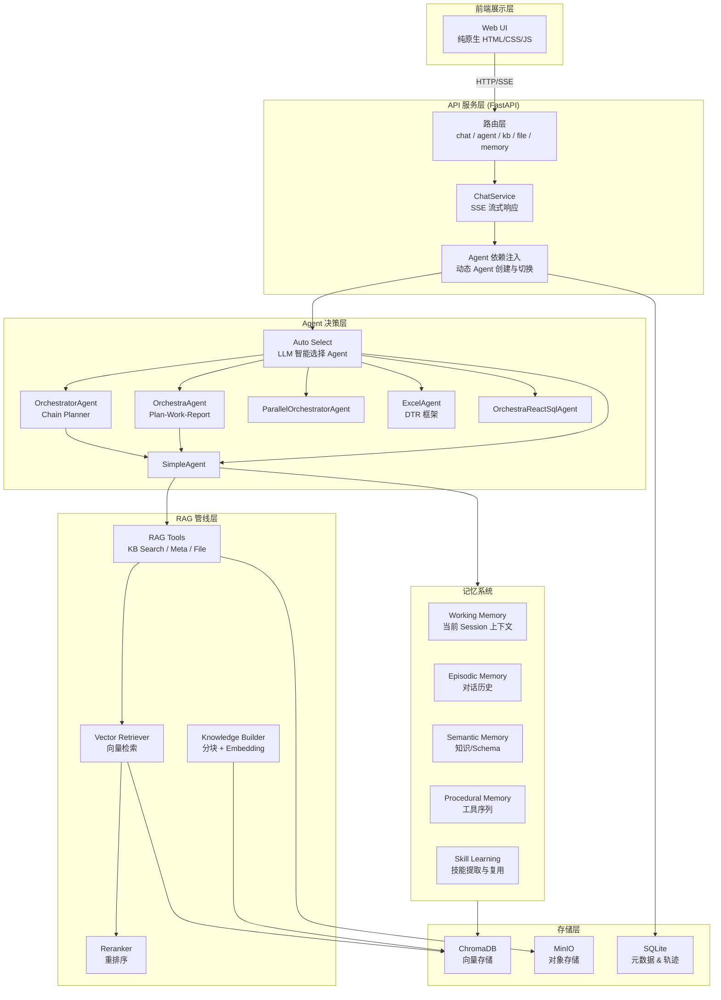
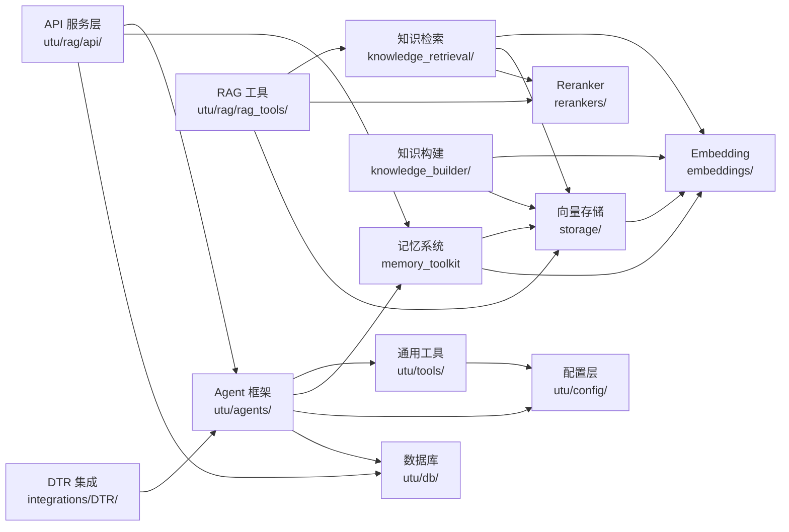
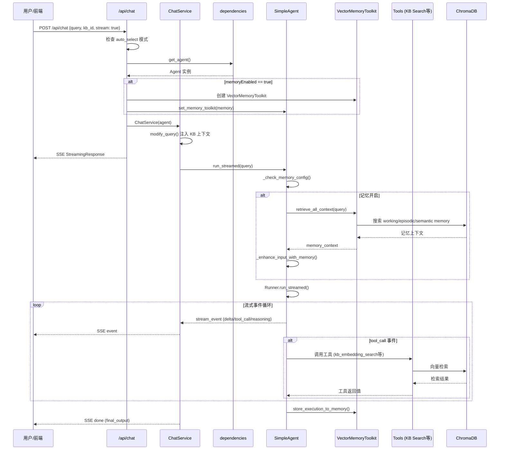
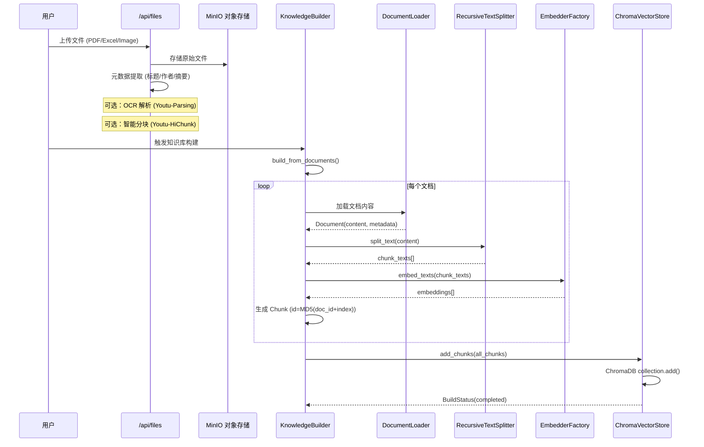

# youtu-rag 源码学习笔记

> 仓库地址：[youtu-rag](https://github.com/TencentCloudADP/youtu-rag)
> 学习日期：2026-03-23

---

> **以下为 AI 源码分析**
>
> ### 一句话概括
>
> Youtu-RAG 是腾讯优图实验室开源的新一代 Agentic RAG 系统，基于"本地部署 + 自主决策 + 记忆驱动"范式，集成多种 AI Agent、双层记忆机制和自适应检索引擎，实现个人本地知识库的智能问答与管理。
>
> ### 要点速览
>
> | 核心模块 | 职责 | 关键文件 |
> |---------|------|---------|
> | API 服务层 | FastAPI 应用入口、路由、SSE 流式响应 | `utu/rag/api/main.py`, `routes/chat.py` |
> | Agent 框架 | 6 种 Agent 类型，支持简单/编排/并行执行 | `utu/agents/simple_agent.py`, `orchestrator_agent.py` |
> | RAG 管线 | 知识构建、向量检索、Rerank 重排序 | `utu/rag/knowledge_builder/`, `knowledge_retrieval/` |
> | 记忆系统 | 四层记忆（episodic/procedural/semantic/working）+ 技能学习 | `utu/tools/memory_toolkit.py` |
> | 工具体系 | 20+ 工具集，支持搜索、代码执行、SQL、MCP | `utu/tools/`, `utu/rag/rag_tools/` |
> | 向量存储 | ChromaDB 持久化向量存储 | `utu/rag/storage/implementations/chroma_store.py` |
> | 前端 UI | 纯原生 HTML/CSS/JS，零依赖 | `frontend/rag_webui/` |

---

## 项目简介

Youtu-RAG 是一个面向个人和企业的本地知识库管理与智能问答系统。传统 RAG 系统采用固定的"离线分块 → 向量检索 → 拼接生成"流水线，存在隐私风险、记忆丢失和检索僵化等瓶颈。Youtu-RAG 将系统从被动检索工具升级为具备自主决策和记忆学习能力的智能检索增强生成系统。

核心价值：
- **本地部署**：所有组件支持本地部署，数据不出域，集成 MinIO 对象存储
- **自主决策**：Agent 自主判断是否检索、如何检索、何时调用记忆，根据问题类型选择最优策略
- **记忆驱动**：双层记忆机制（短期对话记忆 + 长期知识积累），支持 Q&A 经验学习和技能提取

## 技术栈

| 类别 | 技术 |
|------|------|
| 语言 | Python 3.12+ |
| 框架 | FastAPI + OpenAI Agents SDK (`openai-agents==0.3.3`) |
| 构建工具 | hatchling |
| 依赖管理 | uv |
| 测试框架 | pytest + pytest-asyncio |
| 向量数据库 | ChromaDB |
| 对象存储 | MinIO |
| LLM 集成 | OpenAI-compatible API（默认 DeepSeek） |
| Embedding | Youtu-Embedding（自研中文向量模型） |
| Reranker | Jina Reranker / TI-ONE |
| 配置管理 | Hydra + YAML |
| 可观测性 | Arize Phoenix (OpenTelemetry) |
| 前端 | 纯原生 HTML + CSS + JavaScript（零框架依赖） |

## 目录结构

```
youtu-rag/
├── utu/                          # 核心源码包
│   ├── agents/                   # Agent 框架层：6 种 Agent 类型实现
│   │   ├── simple_agent.py       #   基础 Agent，封装 OpenAI Agents SDK
│   │   ├── orchestra_agent.py    #   编排 Agent（Plan → Work → Report）
│   │   ├── orchestrator_agent.py #   链式编排 Agent（支持多轮对话）
│   │   ├── parallel_orchestrator_agent.py  # 并行编排 Agent
│   │   ├── workforce_agent.py    #   劳动力 Agent（复杂多 Worker 协作）
│   │   ├── orchestra/            #   Orchestra 子模块（planner/reporter/worker）
│   │   └── orchestrator/         #   Orchestrator 子模块（chain/parallel）
│   ├── rag/                      # RAG 核心层
│   │   ├── api/                  #   FastAPI 应用（路由/服务/模型/工具）
│   │   │   ├── main.py           #     应用入口 & 路由注册
│   │   │   ├── routes/           #     API 路由（chat/agent/kb/file/memory 等）
│   │   │   ├── services/         #     业务服务（ChatService 流式响应）
│   │   │   └── models/           #     Pydantic 数据模型
│   │   ├── knowledge_builder/    #   知识构建（分块/Embedding/元数据提取）
│   │   ├── knowledge_retrieval/  #   知识检索（向量检索/混合检索/Rerank）
│   │   ├── storage/              #   向量存储抽象（ChromaDB/FAISS/Memory）
│   │   ├── embeddings/           #   Embedding 工厂（Service/OpenAI 后端）
│   │   ├── rerankers/            #   Reranker 工厂（Jina/OpenAI/TI-ONE）
│   │   ├── document_loaders/     #   文档加载器（PDF/Word/Excel/Image OCR）
│   │   ├── rag_tools/            #   RAG 专用工具（KB 搜索/元数据检索/Text2SQL）
│   │   ├── rag_agents/           #   RAG 专用 Agent（Text2SQL ReAct）
│   │   └── monitoring/           #   监控（ChromaDB/MinIO/MySQL 健康检查）
│   ├── tools/                    # 通用工具层（20+ 工具集）
│   │   ├── base.py               #   AsyncBaseToolkit 基类 & @register_tool
│   │   ├── memory_toolkit.py     #   记忆工具（四层记忆 + 技能学习）
│   │   ├── search_toolkit.py     #   搜索工具（Google/Baidu/Jina/DuckDuckGo）
│   │   ├── python_executor_toolkit.py  # Python 代码执行
│   │   ├── text2sql/             #   Text2SQL 工具（SQLite/MySQL）
│   │   └── ...                   #   arxiv/audio/bash/document/github 等
│   ├── config/                   # 配置层（YAML 加载 & 数据模型）
│   ├── context/                  # 上下文管理（对话历史截断）
│   ├── db/                       # 数据库层（SQLModel/轨迹记录）
│   ├── tracing/                  # 链路追踪（Phoenix OpenTelemetry）
│   ├── models/                   # ReAct 模型转换器
│   └── utils/                    # 工具函数（OpenAI 客户端/日志/Token 计数）
├── configs/                      # YAML 配置文件
│   ├── agents/                   #   Agent 配置（simple/orchestra/ragref 等）
│   ├── rag/                      #   RAG 配置（default/frontend_agents/tools）
│   ├── tools/                    #   工具配置（search/bash/mcp 等）
│   └── model/                    #   模型配置
├── integrations/DTR/             # Excel 深度分析集成（DTR 框架）
├── frontend/rag_webui/           # 前端 Web UI（纯原生 HTML/CSS/JS）
├── scripts/                      # 脚本工具（CLI/评测/数据处理）
├── tests/                        # 测试套件
└── docs/                         # 文档站（Next.js + Fumadocs）
```

## 架构设计

### 整体架构

Youtu-RAG 采用分层架构设计，自顶向下分为：前端展示层、API 服务层、Agent 决策层、RAG 管线层、存储层。Agent 决策层是系统的核心，负责根据用户问题自主选择检索策略和工具调用。记忆系统贯穿整个 Agent 执行过程，实现跨 Session 的知识积累和经验复用。



### 核心模块

#### 1. Agent 框架层 (`utu/agents/`)

Agent 框架是系统的决策中枢，基于 OpenAI Agents SDK 封装，提供 6 种 Agent 类型：

- **SimpleAgent** (`simple_agent.py`): 基础 Agent，封装 `agents.Runner` 的 `run_streamed` 接口，支持工具加载（builtin/customized/MCP 三种模式）、记忆注入、流式事件和轨迹记录。是所有其他 Agent 的 Worker 基础。
  - 关键方法：`build()` 初始化环境和工具 → `run_streamed()` 流式执行 → `_start_streaming()` 核心循环
  - 记忆集成：通过 `set_memory_toolkit()` 注入，执行时自动检索并增强 prompt

- **OrchestraAgent** (`orchestra_agent.py`): Plan → Work → Report 三阶段编排模式。PlannerAgent 分解任务，多个 SimpleWorkerAgent 并行执行子任务，ReporterAgent 汇总结果。

- **OrchestratorAgent** (`orchestrator_agent.py`): 链式编排器，ChainPlanner 逐步分配任务给不同 Worker，支持多轮对话历史传递。自动添加 ChitchatAgent 处理闲聊。

- **ParallelOrchestratorAgent**: 并行执行多个 Agent，智能融合结果。

- **ExcelAgent** (`integrations/DTR/`): 独立的 Excel 深度分析框架（DTR），支持 MCTS 规划、多 Sheet 加载、Schema Linking 和代码执行反思。

- **OrchestraReactSqlAgent**: Text2SQL 专用 Agent，结合 ReAct 模式进行 SQL 生成和执行。

Agent 类型选择由 `configs/rag/frontend_agents.yaml` 配置，运行时通过 `_create_agent_instance()` 工厂方法动态创建。

#### 2. RAG 管线层 (`utu/rag/`)

RAG 管线负责知识的构建、存储和检索，核心子模块：

- **Knowledge Builder** (`knowledge_builder/base_builder.py`):
  - `KnowledgeBuilder.build_from_documents()`: 文档 → `RecursiveTextSplitter` 分块 → `EmbedderFactory` 生成向量 → `ChromaVectorStore` 存储
  - 支持层次化分块（基于 Markdown 标题结构）和元数据提取

- **Knowledge Retrieval** (`knowledge_retrieval/base_retriever.py`):
  - `VectorRetriever`: 向量语义检索，支持 metadata filters 和 similarity threshold
  - `HybridRetriever`: 混合检索（当前委托给 VectorRetriever，预留 BM25 扩展）
  - 两阶段检索策略：先用 `recall_multiplier` 倍召回候选，再用 Reranker 精排

- **RAG Tools** (`rag_tools/`):
  - `KBSearchToolkit`: 提供 `kb_embedding_search`（向量搜索）、`kb_rerank`（重排序）、`kb_file_search`（文件级搜索）三个工具
  - `MetaRetrievalToolkit`: 元数据检索，支持意图解析和时效性/热度偏好
  - `FileToolkit`: 文件内容读取与处理
  - `HTMLToolkit`: 网页内容抓取

- **Document Loaders** (`document_loaders/`): 支持 PDF（PyMuPDF）、Word（python-docx）、Excel（openpyxl）、Image OCR（Youtu-Parsing）等格式

- **Embeddings** (`embeddings/factory.py`): 工厂模式，支持 `ServiceEmbedder`（本地 HTTP 服务）和 `OpenAIEmbedder`（API 调用）

- **Rerankers** (`rerankers/factory.py`): 工厂模式，支持 Jina、OpenAI-compatible、TI-ONE 三种后端

#### 3. 记忆系统 (`utu/tools/memory_toolkit.py`)

记忆系统是 Youtu-RAG 的核心创新，基于 ChromaDB 实现四层记忆：

- **Working Memory**: 当前 Session 的对话上下文，按时间排序，支持最大 turn 数限制
- **Episodic Memory**: 跨 Session 的 Q&A 对话历史，支持语义搜索和重要性评分
- **Semantic Memory**: 知识/事实/Schema 定义，支持分类和实体标注
- **Procedural Memory**: 工具调用序列，记录成功率和平均延迟

**技能学习机制**（`SkillExtractor`）：
- 从成功的 Agent 执行轨迹中自动提取可复用技能
- 使用 LLM 分析工具调用序列，生成 `SkillMemory`（技能名/描述/触发模式/工具链）
- 检索时综合语义相似度（40%）、重要性（30%）、成功率（20%）、时效性（10%）加权排序
- 支持成功率追踪和过期清理

**记忆检索统一入口** `retrieve_all_context()`：一次调用检索所有类型记忆，自动组装为 prompt 上下文。

#### 4. 工具体系 (`utu/tools/`)

基于 `AsyncBaseToolkit` 基类构建，通过 `@register_tool` 装饰器注册工具方法，自动转换为 OpenAI Agents SDK 的 `FunctionTool`。

支持三种工具加载模式：
- **builtin**: 内置工具集（search/bash/python_executor 等）
- **customized**: 用户自定义工具（通过文件路径和类名动态加载）
- **mcp**: MCP 协议工具服务器（stdio/SSE/StreamableHTTP）

核心工具集包括：搜索（Google/Baidu/Jina/DuckDuckGo）、Python 代码执行、Bash 命令、文档处理、arXiv 论文、GitHub、音视频处理、Text2SQL（SQLite/MySQL）等 20+ 工具。

#### 5. API 服务层 (`utu/rag/api/`)

FastAPI 应用，核心路由：
- `/api/chat`: 聊天接口，支持流式/非流式，`auto_select` 模式自动选择 Agent
- `/api/agent`: Agent 管理（切换/列表）
- `/api/knowledge`: 知识库 CRUD
- `/api/knowledge-base`: 文件管理（上传/删除/搜索）
- `/api/embedding` & `/api/reranker`: Embedding 和 Reranker 服务代理
- `/api/memory`: 记忆管理 API
- `/monitor`: 监控仪表板

`ChatService` 是聊天的核心服务，负责：
1. 根据 Agent 类型修改查询（注入 kb_id/文件名等上下文）
2. 将 Agent 流式事件转换为 SSE 格式（delta/thinking/tool_call/workflow_update 等）
3. 处理多种 Agent 事件类型（RawResponsesStreamEvent/RunItemStreamEvent/ExcelAgentStreamEvent/ParallelOrchestratorEvent）

### 模块依赖关系



## 核心流程

### 流程一：聊天请求处理（Chat Request Flow）

这是系统最核心的用户交互流程，从用户发送消息到 Agent 流式返回结果。



**关键逻辑说明：**
1. **Agent 切换**：通过 `dependencies.py` 管理全局 Agent 实例，`set_current_agent_config()` 切换时会重建 Agent
2. **Query 改写**：`ChatService.modify_query()` 根据 Agent 类型注入不同上下文——KB Search Agent 注入 `metadata_filters`，File QA Agent 注入文件名，Excel Agent 设置 `FILE_PATH` 环境变量
3. **记忆增强**：将检索到的记忆上下文以 `# 相关历史上下文\n{context}\n---\n# 当前问题\n{query}` 格式注入 prompt
4. **流式转换**：`ChatService.stream_response()` 将 OpenAI Agents SDK 的底层事件（`RawResponsesStreamEvent`）转换为前端可消费的 SSE 事件类型

### 流程二：知识库构建与向量化

从文件上传到知识库可用于检索的完整构建流程。



**关键逻辑说明：**
1. **分块策略**：`RecursiveTextSplitter` 默认 chunk_size=1000、overlap=100，对 Markdown 文件自动使用层次化分块（基于 `#` 和 `##` 标题结构）
2. **Embedding**：支持本地 HTTP 服务（Youtu-Embedding）和 OpenAI-compatible API 两种后端，batch_size=16
3. **向量存储**：ChromaDB 使用 cosine 距离度量，支持持久化存储，collection 按知识库 ID 命名
4. **索引类型**：除了常规 chunk 索引，还会创建 `index_summary` 类型的文件级摘要索引，用于文件发现

## 关键设计亮点

### 1. 多 Agent 编排模式与自动选择

**解决的问题**：不同类型的问题需要不同的处理策略——简单问答只需 LLM，知识库检索需要向量搜索，表格分析需要代码执行，复杂问题需要多 Agent 协作。

**实现方式**：
- `configs/rag/frontend_agents.yaml` 配置了 9 种 Agent（Chat/Web Search/KB Search/Meta Retrieval/File QA/Excel/Text2SQL 等）
- Auto Select 模式（`routes/chat.py:auto_select_and_stream()`）使用 LLM 根据问题特征自动选择最合适的 Agent
- `dependencies.py` 中的 `_create_agent_instance()` 工厂方法统一创建不同类型 Agent

**为什么这样设计**：将 Agent 选择从硬编码规则升级为 LLM 驱动的智能决策，同时保留手动选择的灵活性。编排模式（Orchestra/Orchestrator/Parallel）为复杂任务提供了从串行到并行的完整解决方案。

### 2. 四层记忆 + 技能学习机制

**解决的问题**：传统 RAG 系统每次对话从零开始，无法积累经验。重复类似问题时不能复用之前成功的工具调用策略。

**实现方式**（`utu/tools/memory_toolkit.py`）：
- **Working Memory**：ChromaDB 存储，按 session_id 隔离，支持多轮对话上下文
- **Episodic Memory**：Q&A 对自动存入，语义搜索时综合 similarity(50%) + importance(30%) + recency(20%) 加权排序
- **Skill Learning**：`SkillExtractor` 使用 LLM 从执行轨迹中抽取技能 → `SkillMemory`（包含 tool_sequence/trigger_patterns/success_rate）→ 相似问题时优先复用
- 时效性衰减：`_calculate_recency_score()` 使用 24 小时半衰期指数衰减

**为什么这样设计**：借鉴认知科学的记忆分类，episodic 记忆回答"发生过什么"，procedural/skill 记忆回答"怎么做"，semantic 记忆回答"是什么"。技能学习实现了从成功经验中自我进化的闭环。

### 3. 两阶段检索策略（Recall + Rerank）

**解决的问题**：单纯向量检索的 Top-K 结果质量有限，尤其在大规模知识库中召回率和精确率难以兼顾。

**实现方式**（`utu/rag/rag_tools/kb_search_toolkit.py`）：
- Stage 1（Recall）：用 `top_k * recall_multiplier`（默认 3 倍）从 ChromaDB 召回候选
- Stage 2（Rerank）：Reranker 模型（Jina/TI-ONE）对候选进行语义精排，选出最终 top_k
- `kb_file_search` 提供文件级发现 → `kb_embedding_search` 进行 chunk 级精准检索的两级检索链
- 支持 metadata_filters 进行源文件/时间/作者等维度的过滤

**为什么这样设计**：两阶段检索在保证召回率的同时提升精确率，`recall_multiplier` 参数化设计允许在成本和质量间灵活调整。文件级 + chunk 级的两级检索解决了"先找到正确的文档，再找到正确的段落"的问题。

### 4. 统一工具注册与多协议支持

**解决的问题**：Agent 需要调用多种工具，而不同工具可能来自内置代码、用户自定义或外部 MCP 服务，需要统一的注册和调用机制。

**实现方式**（`utu/tools/base.py`）：
- `AsyncBaseToolkit` 基类 + `@register_tool` 装饰器：方法级别的工具注册，自动收集为 `tools_map`
- `get_tools_in_agents()`: 转换为 OpenAI Agents SDK 的 `FunctionTool`
- `get_tools_in_openai()`: 转换为 OpenAI Chat Completions 格式
- `get_tools_in_mcp()`: 转换为 MCP 协议格式
- 三种加载模式：`builtin`（TOOLKIT_MAP 注册）、`customized`（文件路径动态导入）、`mcp`（MCP Server 连接）
- YAML 配置驱动：`configs/tools/` 下每个工具一个 YAML 文件，通过 `activated_tools` 控制激活哪些方法

**为什么这样设计**：统一的工具抽象让同一个工具实现可以无缝运行在不同的 Agent 框架中。MCP 协议支持使得 Youtu-RAG 可以接入外部工具生态。YAML 配置化避免了工具注册的硬编码。

### 5. SSE 流式事件架构

**解决的问题**：Agent 执行过程包含推理、工具调用、中间结果等多种事件，前端需要实时展示这些过程以提升用户体验。

**实现方式**（`utu/rag/api/services/chat_service.py`）：
- `ChatService.stream_response()` 将 OpenAI Agents SDK 的底层事件映射为 7 种 SSE 事件类型：`start`/`delta`/`reasoning`/`tool_call`/`tool_output`/`workflow_update`/`done`
- 支持 5 种 Agent 事件源：`RawResponsesStreamEvent`（LLM 原始流）、`RunItemStreamEvent`（运行项）、`ExcelAgentStreamEvent`、`ParallelOrchestratorEvent`、`OrchestratorStreamEvent`
- `TaskRecorder` 使用 `asyncio.Queue` 在 Agent 执行协程和 SSE 生成器之间传递事件
- 前端通过 EventSource 接收，支持 thinking 展示、工具调用参数流式渲染、代码高亮

**为什么这样设计**：Agent 的执行天然是异步流式的（LLM 生成 token → 工具调用 → 再次生成），SSE 将这个过程完整透传给前端，让用户能够观察 Agent 的"思考过程"。`TaskRecorder` 的队列设计解耦了 Agent 执行和响应生成。
