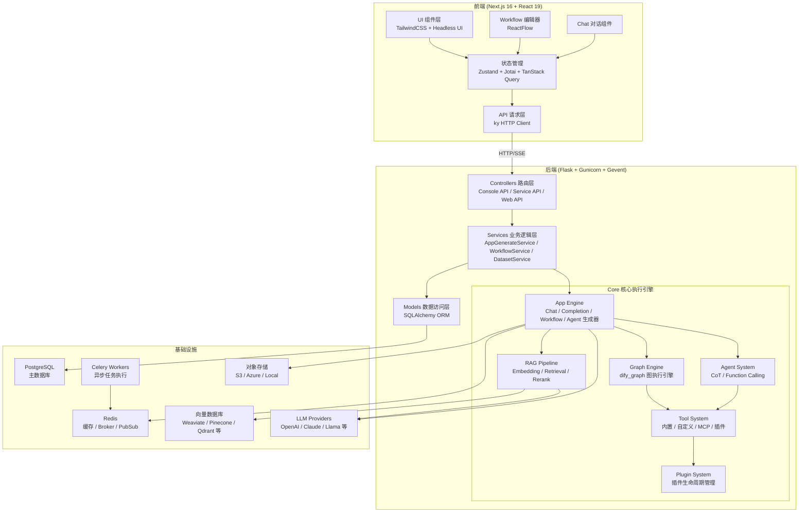
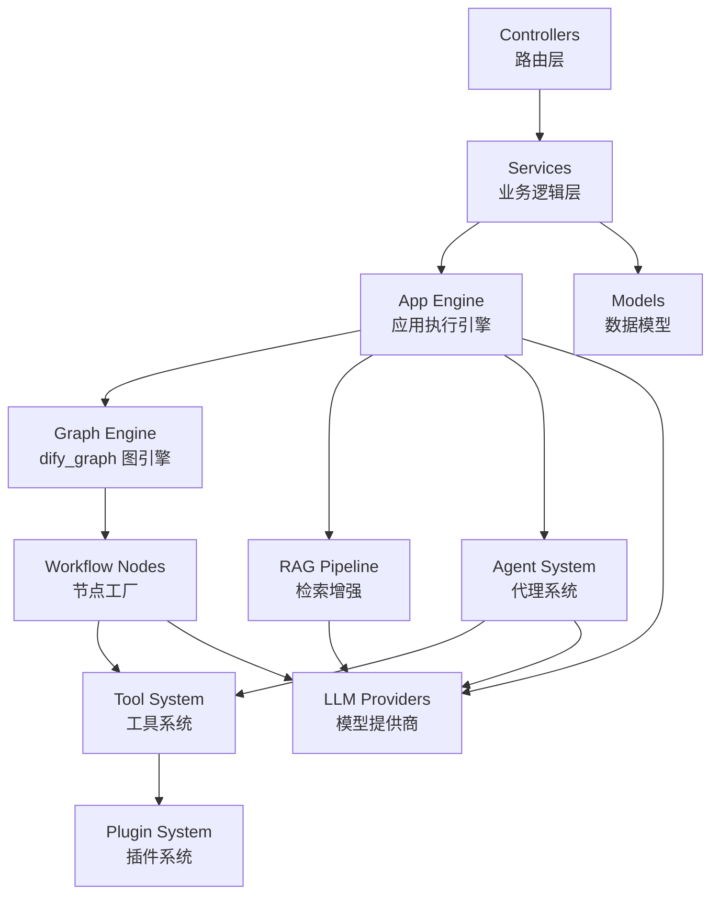
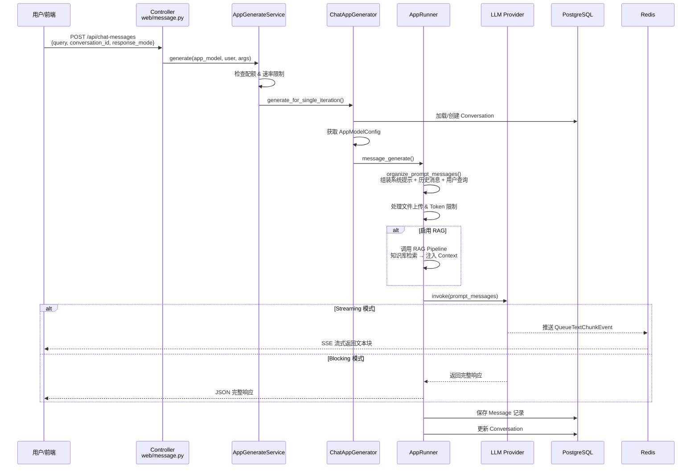
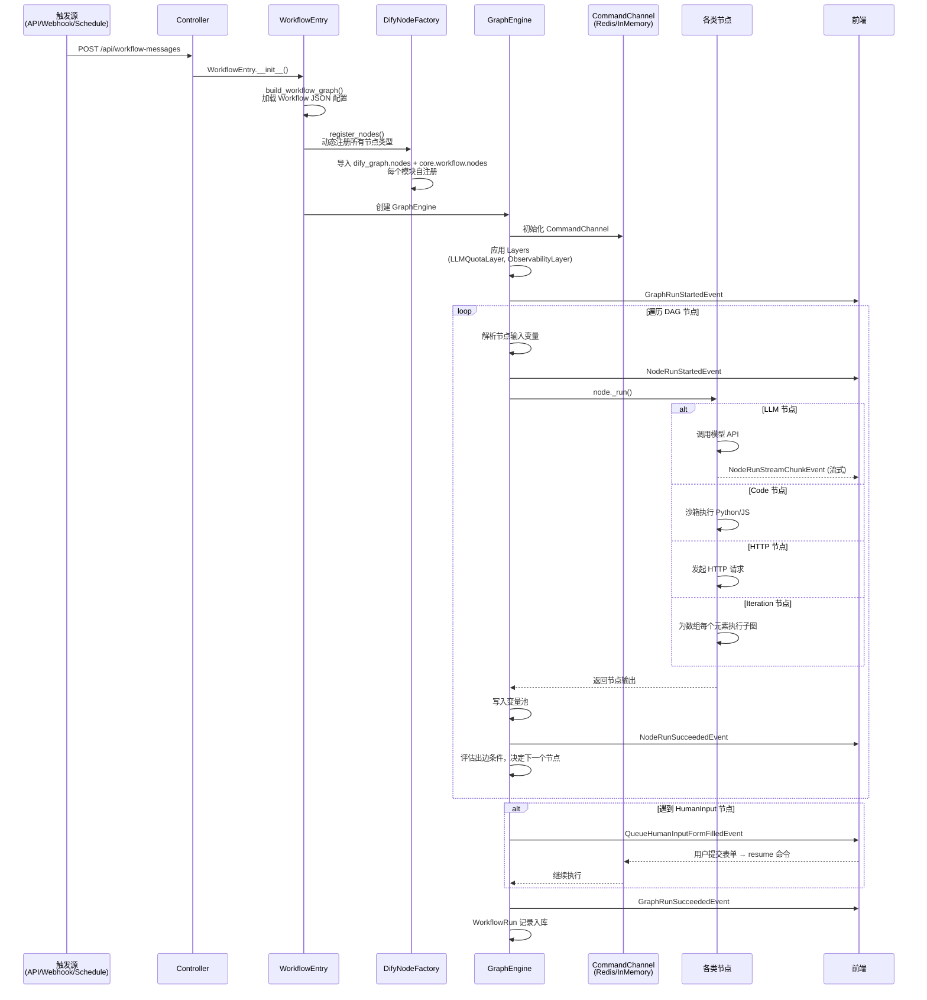

# Dify 源码学习笔记

> 仓库地址：[dify](https://github.com/langgenius/dify)
> 学习日期：2026-03-22

---

> **以下为 AI 源码分析**
>
> ### 一句话概括
>
> Dify 是一个开源 LLM 应用开发平台，提供可视化 Workflow 编排、RAG 知识库、Agent 代理、模型管理等能力，让开发者快速从原型到生产。
>
> ### 要点速览
>
> | 核心模块 | 职责 | 关键文件 |
> |---------|------|---------|
> | App Engine | 应用执行引擎，支持 Chat/Completion/Workflow/Agent 四种模式 | `api/core/app/apps/` |
> | Workflow Engine | 基于 DAG 的可视化工作流引擎，支持 36+ 节点类型 | `api/dify_graph/`, `api/core/workflow/` |
> | RAG Pipeline | 知识库检索增强生成管线，支持多种向量数据库 | `api/core/rag/` |
> | Agent System | 支持 Function Calling 和 Chain-of-Thought 两种 Agent 模式 | `api/core/agent/` |
> | Tool System | 工具管理系统，支持内置/自定义/MCP/插件工具 | `api/core/tools/` |
> | Plugin System | 插件生命周期管理，支持反向调用 Dify API | `api/core/plugin/` |
> | Web Frontend | 基于 Next.js 的管理后台与分享页面 | `web/app/components/` |
> | API Layer | 三套 API（Console/Service/Web），基于 Flask | `api/controllers/` |

---

## 项目简介

Dify 是由 LangGenius 团队开发的开源 LLM 应用开发平台（v1.13.2）。它提供了直观的可视化界面，将 AI Workflow 编排、RAG Pipeline、Agent 能力、模型管理和可观测性（支持 Langfuse、Opik、Arize Phoenix）等功能整合在一起。开发者可以通过拖拽式 Workflow 编辑器快速构建复杂的 AI 应用，也可以通过 API 将 Dify 作为 Backend-as-a-Service 集成到自有业务中。项目支持数百种 LLM 模型、50+ 内置工具，并提供企业级特性如多租户、审计日志、License 管理等。

## 技术栈

| 类别 | 技术 |
|------|------|
| 语言 | Python 3.11+, TypeScript |
| 后端框架 | Flask 3.1 + Gunicorn + Gevent |
| 前端框架 | Next.js 16 (App Router) + React 19 |
| ORM | SQLAlchemy 2.0 + Flask-Migrate |
| 数据库 | PostgreSQL (主库) + Redis (缓存/消息队列) |
| 异步任务 | Celery 5.6 (Redis Broker) |
| 状态管理 | Zustand 5 + Jotai + TanStack Query 5 |
| 可视化编辑 | ReactFlow 11 (Workflow DAG 编辑器) |
| CSS | TailwindCSS 3.4 |
| 依赖管理 | uv (Python) / pnpm 10 (Node.js) |
| 构建工具 | Docker Compose / Makefile |
| 测试框架 | pytest (后端) / Vitest (前端) |
| 可观测性 | OpenTelemetry + Sentry |

## 目录结构

```
dify/
├── api/                          # 后端 API 服务（Python/Flask）
│   ├── app.py                    #   Flask 应用入口
│   ├── app_factory.py            #   应用工厂，初始化所有扩展
│   ├── celery_entrypoint.py      #   Celery Worker 入口
│   ├── controllers/              #   API 路由层
│   │   ├── console/              #     管理后台 API（/console/api/）
│   │   ├── service_api/          #     第三方服务 API（/v1/）
│   │   ├── web/                  #     前端/嵌入式 API（/api/）
│   │   └── inner_api/            #     内部调用 API
│   ├── services/                 #   业务逻辑层
│   ├── core/                     #   核心执行引擎
│   │   ├── app/                  #     应用执行器（Chat/Completion/Workflow/Agent）
│   │   ├── rag/                  #     RAG 检索增强生成管线
│   │   ├── workflow/             #     Workflow 节点工厂与入口
│   │   ├── agent/                #     Agent 系统（CoT/FC）
│   │   ├── tools/                #     工具管理与执行
│   │   ├── plugin/               #     插件系统
│   │   └── prompt/               #     Prompt 模板管理
│   ├── dify_graph/               #   图执行引擎（自研）
│   │   ├── graph_engine/         #     编排引擎、命令通道、可扩展层
│   │   ├── nodes/                #     节点实现（LLM/HTTP/Code/迭代/循环等）
│   │   ├── variables/            #     变量池管理
│   │   └── events/               #     事件系统
│   ├── models/                   #   SQLAlchemy ORM 模型
│   ├── migrations/               #   数据库迁移（168 个版本）
│   ├── tasks/                    #   Celery 异步任务
│   ├── extensions/               #   Flask 扩展（Redis/Storage/OTel 等）
│   └── configs/                  #   配置管理
├── web/                          # 前端应用（Next.js/React）
│   ├── app/                      #   Next.js App Router
│   │   ├── (commonLayout)/       #     管理后台布局
│   │   ├── (shareLayout)/        #     分享页面布局
│   │   └── components/           #     核心组件
│   │       ├── workflow/         #       Workflow 可视化编辑器（ReactFlow）
│   │       ├── base/chat/        #       Chat 对话组件族
│   │       ├── app/              #       应用配置组件
│   │       └── datasets/         #       知识库管理组件
│   ├── service/                  #   API 请求层（基于 ky）
│   ├── context/                  #   React Context Providers
│   ├── i18n/                     #   25 种语言翻译
│   └── hooks/                    #   自定义 React Hooks
├── docker/                       # Docker Compose 部署配置
├── sdks/                         # 客户端 SDK（PHP/Node.js）
└── dev/                          # 开发工具和脚本
```

## 架构设计

### 整体架构

Dify 采用经典的**前后端分离 + 分层架构**设计。后端以 Flask 为基础，分为 Controllers（路由层）、Services（业务逻辑层）、Core（核心执行引擎层）、Models（数据访问层）四个层次。核心引擎层包含应用执行器、图执行引擎（dify_graph）、RAG Pipeline、Agent 系统、Tool 系统等关键模块。异步任务通过 Celery + Redis 实现分布式处理。前端基于 Next.js App Router，通过 Zustand 管理复杂状态，ReactFlow 实现可视化 Workflow 编排。



### 核心模块

#### 1. App Engine — 应用执行引擎

**职责**：根据不同应用模式（Chat/Completion/Workflow/Agent）分发执行请求，管理消息生命周期，处理流式响应。

**核心文件**：
- `api/core/app/apps/chat/app_generator.py` — Chat 应用生成器
- `api/core/app/apps/completion/app_generator.py` — Completion 应用生成器
- `api/core/app/apps/advanced_chat/app_generator.py` — 高级聊天（含 RAG）生成器
- `api/core/app/apps/agent_chat/app_generator.py` — Agent 聊天生成器
- `api/core/app/apps/workflow/app_generator.py` — Workflow 应用生成器
- `api/core/app/apps/base_app_runner.py` — 基础运行器（组织 Prompt、调用 LLM）

**关键类/函数**：
- `AppGenerateService.generate()` — 应用生成主入口，根据 `AppMode` 分发
- `ChatAppGenerator.generate_for_single_iteration()` — Chat 模式执行
- `MessageBasedAppGenerator.message_generate()` — 消息生成核心逻辑
- `AppRunner.organize_prompt_messages()` — Prompt 组装（系统提示 + 历史消息 + 用户查询）
- `AppQueueManager` — 应用事件队列管理

**与其他模块关系**：调用 Graph Engine 执行 Workflow、调用 RAG Pipeline 检索知识库、调用 Agent System 执行推理。

#### 2. Graph Engine — 图执行引擎 (dify_graph)

**职责**：Dify 自研的 Workflow 执行引擎，基于 DAG 图结构，采用队列消息驱动的分布式执行模型，支持暂停/恢复/停止控制。

**核心文件**：
- `api/dify_graph/graph_engine/orchestration.py` — 图编排主引擎
- `api/dify_graph/graph_engine/command_channels/` — 控制通道（InMemory/Redis）
- `api/dify_graph/graph_engine/layers/` — 可插拔中间件层
- `api/dify_graph/graph_engine/worker/` — 节点执行运行时
- `api/dify_graph/nodes/` — 节点实现（LLM/HTTP/Code/Iteration/Loop 等）
- `api/dify_graph/variables/` — 命名空间隔离的变量池
- `api/dify_graph/events/` — 事件系统

**关键设计**：
- **CommandChannel 模式** — 通过 Redis/InMemory 通道支持 stop/pause/resume 控制命令
- **Layer 中间件** — DebugLoggingLayer、ExecutionLimitsLayer 等可插拔层
- **事件驱动** — NodeRunStartedEvent、NodeRunSucceededEvent 等贯穿执行全程
- **导入分层规则** — `graph_engine → graph_events → graph → nodes → node_events → entities`

**与其他模块关系**：被 App Engine 的 WorkflowAppGenerator 调用；内部各节点调用 Tool System、LLM Providers。

#### 3. RAG Pipeline — 检索增强生成

**职责**：完整的知识库管理和检索管线，覆盖文档摄入、文本提取、分割、向量化、存储、检索、重排序全流程。

**核心文件**：
- `api/core/rag/retrieval/dataset_retrieval.py`（84KB）— 核心检索管道
- `api/core/rag/embedding/` — 向量嵌入模块
- `api/core/rag/extractor/` — 文本提取器（19 个模块，支持 PDF/PPT/CSV 等）
- `api/core/rag/splitter/` — 文本分割器
- `api/core/rag/rerank/` — 重排序模块
- `api/core/rag/index_processor/` — 索引处理器
- `api/core/rag/data_post_processor/` — 数据后处理

**检索模式**：支持 semantic（语义）、keyword（关键词）、hybrid（混合）三种检索方式，可配合 Rerank 模型进行结果重排序。

**与其他模块关系**：被 App Engine 在 Advanced Chat 模式下调用；依赖外部向量数据库（Weaviate/Pinecone/Qdrant 等）和嵌入模型。

#### 4. Agent System — 代理系统

**职责**：实现 LLM Agent 的推理循环，支持多轮工具调用和思考链。

**核心文件**：
- `api/core/agent/base_agent_runner.py`（21KB）— Agent 基类
- `api/core/agent/cot_agent_runner.py`（18KB）— Chain-of-Thought 代理
- `api/core/agent/fc_agent_runner.py`（19KB）— Function Calling 代理
- `api/core/agent/strategy/` — 策略模式实现
- `api/core/agent/prompt/` — Agent Prompt 模板

**与其他模块关系**：调用 Tool System 执行工具；被 App Engine 的 AgentChatAppGenerator 调用。

#### 5. Tool System — 工具系统

**职责**：统一管理各类工具的注册、配置、签名和执行。

**核心文件**：
- `api/core/tools/tool_manager.py`（44KB）— 核心工具管理器
- `api/core/tools/tool_engine.py` — 工具执行引擎
- `api/core/tools/__base/` — 工具基类
- `api/core/tools/builtin_tool/` — 内置工具
- `api/core/tools/custom_tool/` — 自定义工具（OpenAPI Schema）
- `api/core/tools/mcp_tool/` — MCP 协议工具
- `api/core/tools/plugin_tool/` — 插件工具
- `api/core/tools/workflow_as_tool/` — Workflow 作为工具

**与其他模块关系**：被 Agent System 和 Graph Engine 的工具节点调用。

#### 6. Frontend Workflow Editor — 前端工作流编辑器

**职责**：基于 ReactFlow 的可视化 DAG 编辑器，支持 36+ 节点类型的拖拽编排、实时运行预览。

**核心文件**：
- `web/app/components/workflow/index.tsx`（16.3KB）— 编辑器主入口
- `web/app/components/workflow/store/workflow/index.ts` — Zustand 多 Slice 状态存储（12 个 Slice）
- `web/app/components/workflow/hooks/use-nodes-interactions.ts`（74KB）— 节点交互逻辑
- `web/app/components/workflow/hooks/use-edges-interactions.ts` — 边交互逻辑
- `web/app/components/workflow/hooks/use-workflow-run-event/` — 运行事件处理
- `web/app/components/workflow/nodes/` — 36 个节点类型组件
- `web/app/components/workflow/panel/` — 右侧配置面板

**状态 Slice 组成**：ChatVariableSlice、EnvVariableSlice、FormSlice、HelpLineSlice、HistorySlice、NodeSlice、PanelSlice、ToolSlice、VersionSlice、WorkflowDraftSlice、WorkflowSlice、LayoutSlice。

### 模块依赖关系



## 核心流程

### 流程一：Chat 对话请求的完整调用链

一条 Chat 消息从用户输入到 AI 回复的完整路径，涵盖路由分发、应用模式选择、Prompt 组装、LLM 调用和流式响应。



**关键步骤说明**：

1. **路由入口** — `controllers/web/message.py` 接收请求，校验参数后调用 `AppGenerateService.generate()`
2. **模式分发** — `AppGenerateService` 根据 `app_model.mode`（CHAT/COMPLETION/ADVANCED_CHAT/AGENT_CHAT/WORKFLOW）选择对应的 Generator
3. **Prompt 组装** — `AppRunner.organize_prompt_messages()` 将系统提示、历史对话、RAG Context、用户查询组装为完整的 Prompt Messages
4. **LLM 调用** — 通过 `ModelManager` 获取对应 Provider 的模型实例，发起调用
5. **流式响应** — Streaming 模式下，通过 Redis PubSub 推送 `QueueTextChunkEvent`，前端通过 SSE 实时接收

### 流程二：Workflow 工作流执行

一个 Workflow 从触发到所有节点执行完成的全过程，展示了 Graph Engine 的编排机制。



**关键步骤说明**：

1. **节点工厂** — `DifyNodeFactory.register_nodes()` 在启动时动态扫描并注册 36+ 节点类型（LLM/HTTP/Code/Iteration/Loop/Agent 等）
2. **CommandChannel** — 通过 Redis 或 InMemory 通道接收外部控制命令（stop/pause/resume），实现运行时控制
3. **Layer 中间件** — 在节点执行前后插入 LLM 配额检查、可观测性追踪、执行结果持久化等逻辑
4. **变量池** — 命名空间隔离的变量存储，每个节点的输出写入变量池，下游节点通过变量引用读取
5. **HumanInput** — 遇到人工输入节点时暂停执行，等待用户通过 Web 表单提交数据后继续

## 关键设计亮点

### 1. 多 Slice 状态架构（Workflow Editor）

**解决的问题**：Workflow 编辑器需要管理节点、边、面板、历史、版本、变量等大量异构状态，单一 Store 会导致代码臃肿和性能问题。

**实现方式**：采用 Zustand 的 Slice 模式（`web/app/components/workflow/store/workflow/index.ts`），将状态拆分为 12 个独立 Slice（NodeSlice、PanelSlice、WorkflowDraftSlice 等），并通过 `injectWorkflowStoreSliceFn` 支持动态注入，便于 RAG Pipeline 等扩展模块扩展 Store。配合 `useShallow` 实现细粒度订阅。

**为什么这样设计**：Slice 模式让每个业务关注点独立维护，新增功能（如 RAG Pipeline 编辑器）只需注入新 Slice，不影响现有代码。

### 2. Graph Engine 的 Layer 中间件设计

**解决的问题**：Workflow 执行需要在不同环节插入配额检查、可观测性追踪、结果持久化等横切关注点，硬编码会导致引擎代码膨胀且难以扩展。

**实现方式**：`dify_graph/graph_engine/layers/` 定义了可插拔的中间件层接口，包括 `DebugLoggingLayer`、`ExecutionLimitsLayer`、`LLMQuotaLayer`、`ObservabilityLayer`、`PersistenceLayer` 等。每个 Layer 在节点执行前后拦截事件，执行特定逻辑。

**为什么这样设计**：参考 Web 框架中间件模式，将横切关注点解耦，新增监控或限流策略只需添加新 Layer，符合开闭原则。

### 3. CommandChannel 实现运行时控制

**解决的问题**：长时间运行的 Workflow 需要支持外部 stop/pause/resume 控制，且需在分布式环境下工作。

**实现方式**：`dify_graph/graph_engine/command_channels/` 提供两种实现：`InMemoryCommandChannel`（单进程）和 `RedisCommandChannel`（分布式）。Graph Engine 在每个节点执行前检查通道中的控制命令，据此暂停或终止执行。

**为什么这样设计**：抽象通道接口让引擎与通信方式解耦，开发环境用 InMemory（零依赖），生产环境切换 Redis（支持多 Worker 协调），无需改动引擎代码。

### 4. 三套 API + 蓝图隔离

**解决的问题**：Dify 需要同时服务管理后台、第三方开发者和终端用户，三者的认证方式、权限模型和 CORS 策略完全不同。

**实现方式**：`api/extensions/ext_blueprints.py` 注册三套独立的 Flask Blueprint：
- **Console API**（`/console/api/`）— 管理后台，使用 Flask-Login Session 认证
- **Service API**（`/v1/`）— 第三方服务，使用 API Key 认证
- **Web API**（`/api/`）— 前端/嵌入式，使用 Token + Share Code 认证

**为什么这样设计**：蓝图隔离让每套 API 拥有独立的认证中间件、CORS 配置和路由命名空间，避免权限泄漏，便于独立演进。

### 5. Workflow-as-Tool 工具复用

**解决的问题**：用户构建的 Workflow 往往封装了复杂的业务逻辑，如何让其他应用或 Agent 直接复用这些逻辑？

**实现方式**：`api/core/tools/workflow_as_tool/` 将发布的 Workflow 包装为标准的 Tool 接口，Agent 或其他 Workflow 可以像调用内置工具一样调用它。工具签名从 Workflow 的 Start 节点输入变量和 End 节点输出变量自动生成。

**为什么这样设计**：复用已有 Workflow 避免重复构建，同时保持工具接口的统一性，Agent 无需感知底层是内置工具还是 Workflow。
