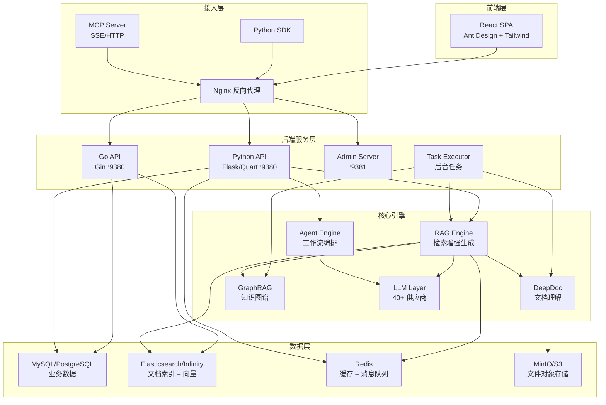
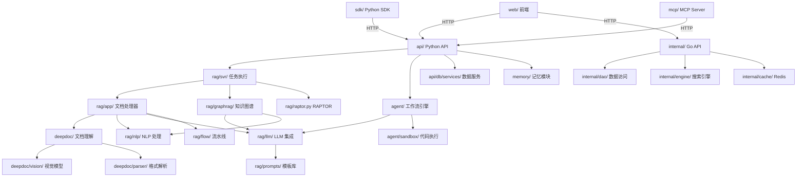
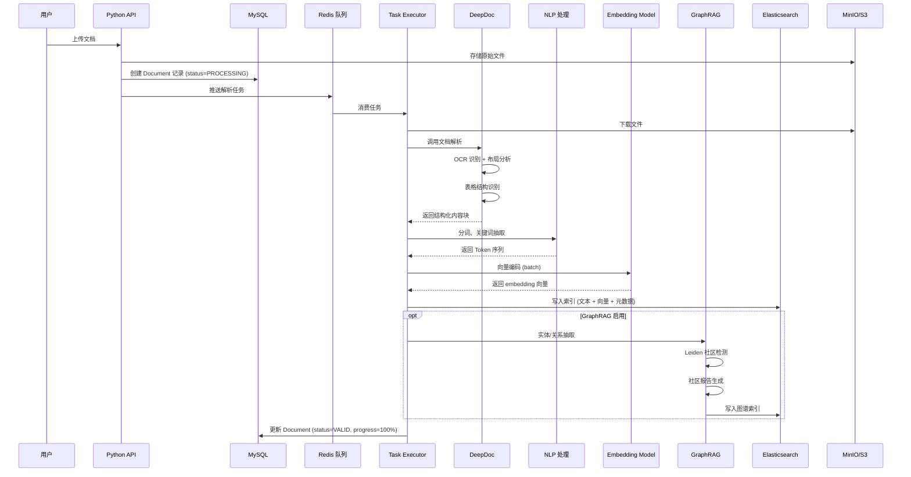
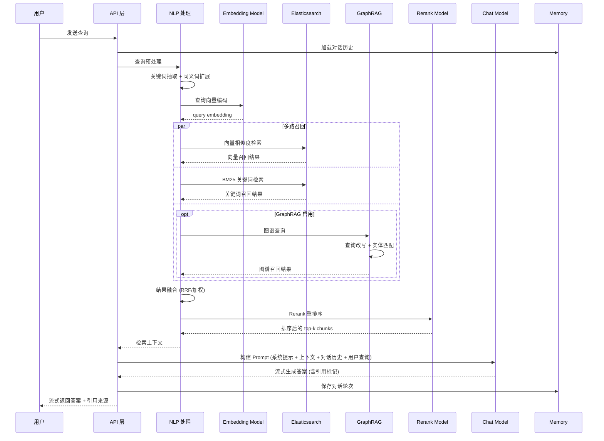

# RAGFlow 源码学习笔记

> 仓库地址：[ragflow](https://github.com/infiniflow/ragflow)
> 学习日期：2026-03-22

---

> **以下为 AI 源码分析**
>
> ### 一句话概括
>
> RAGFlow 是一个基于深度文档理解的开源 RAG 引擎，融合 Agent 编排能力，为 LLM 提供高质量的上下文检索层，支持从文档解析、知识库管理到对话生成的端到端流程。
>
> ### 要点速览
>
> | 核心模块 | 职责 | 关键文件/目录 |
> |---------|------|-------------|
> | **rag/** | RAG 核心引擎：文档处理、LLM 集成、检索、GraphRAG | `rag/app/`, `rag/llm/`, `rag/nlp/`, `rag/graphrag/` |
> | **deepdoc/** | 深度文档理解：OCR、布局识别、多格式解析 | `deepdoc/vision/`, `deepdoc/parser/` |
> | **api/** | Python Flask/Quart 异步 API 层 | `api/apps/`, `api/db/` |
> | **internal/** | Go 高性能内部服务（四层架构） | `internal/handler/`, `internal/service/`, `internal/dao/` |
> | **agent/** | Agent 工作流引擎：Canvas DSL + 24 种组件 | `agent/component/`, `agent/canvas.py` |
> | **web/** | React + TypeScript 前端 | `web/src/pages/`, `web/src/services/` |
> | **sdk/** | Python SDK 客户端 | `sdk/python/ragflow_sdk/` |
> | **mcp/** | Model Context Protocol 集成 | `mcp/server/`, `mcp/client/` |
> | **memory/** | 对话记忆模块 | `memory/services/`, `memory/utils/` |

---

## 项目简介

RAGFlow 是由 InfiniFlow 开源的检索增强生成（RAG）引擎，核心定位是为企业级 AI 应用提供高质量的知识检索与上下文管理能力。项目解决了传统 RAG 系统中文档解析质量差、检索精度低、工程化困难的问题。其核心价值在于：1）基于深度文档理解（DeepDoc）的高质量知识抽取，支持 PDF、Word、Excel 等复杂格式；2）融合向量检索、关键词检索和 GraphRAG 的多路召回机制；3）可视化的 Agent 工作流编排引擎；4）支持 40+ LLM 供应商的统一接入层。项目采用 Python + Go 双语言架构，Python 负责 RAG 核心逻辑和 Agent 编排，Go 负责高性能 API 服务。

## 技术栈

| 类别 | 技术 |
|------|------|
| 语言 | Python 3.12+, Go 1.25, TypeScript 5.9 |
| 框架 | Flask/Quart (Python API), Gin (Go API), React 18 (前端) |
| 构建工具 | Docker, Vite (前端), Go build |
| 依赖管理 | uv/pip (Python), Go Modules (Go), npm (前端) |
| 测试框架 | pytest (Python), Jest (前端), Playwright (E2E) |
| 数据存储 | MySQL/PostgreSQL, Elasticsearch/OpenSearch/Infinity, Redis, MinIO/S3 |
| AI/ML | ONNX Runtime, XGBoost, OpenCV, HuggingFace, LiteLLM |

## 目录结构

```
ragflow/
├── api/                    # Python API 层（Flask/Quart 异步框架）
│   ├── apps/               #   路由和业务处理（13+ 蓝图模块）
│   ├── db/                 #   数据模型和服务层（Peewee ORM）
│   └── utils/              #   工具函数（认证、文件、加密）
├── internal/               # Go 内部服务（高性能 API）
│   ├── handler/            #   HTTP 处理层（18 个 Handler）
│   ├── service/            #   业务逻辑层
│   ├── dao/                #   数据访问层（GORM）
│   ├── router/             #   路由定义（Gin）
│   ├── engine/             #   文档搜索引擎（ES/Infinity）
│   ├── cache/              #   Redis 缓存
│   └── tokenizer/          #   分词器（C++ 绑定）
├── rag/                    # RAG 核心引擎
│   ├── app/                #   文档类型处理器（14+ 种格式）
│   ├── llm/                #   LLM 集成层（40+ 供应商）
│   ├── nlp/                #   NLP 处理（分词、检索、权重）
│   ├── flow/               #   处理流水线（Pipeline DSL）
│   ├── graphrag/           #   GraphRAG 知识图谱（general/light）
│   ├── prompts/            #   Prompt 模板库（49 个模板）
│   ├── svr/                #   后台任务执行器
│   └── utils/              #   存储连接（ES、Redis、S3）
├── deepdoc/                # 深度文档理解
│   ├── vision/             #   计算机视觉（OCR、布局识别、表格识别）
│   └── parser/             #   多格式解析器（PDF、Word、Excel 等）
├── agent/                  # Agent 工作流引擎
│   ├── component/          #   24 种可编排组件
│   ├── templates/          #   26 个行业模板
│   ├── sandbox/            #   代码安全执行（gVisor）
│   └── canvas.py           #   Canvas 画布编排核心
├── web/                    # React 前端
│   └── src/
│       ├── pages/          #   20+ 页面（知识库、Agent、聊天等）
│       ├── services/       #   13 个 API 服务
│       ├── hooks/          #   26 个 React Hooks
│       └── components/     #   99+ UI 组件
├── sdk/                    # Python SDK
│   └── python/ragflow_sdk/ #   面向对象的客户端库
├── mcp/                    # MCP 协议集成
│   ├── server/             #   MCP 服务器（SSE/HTTP 流传输）
│   └── client/             #   MCP 客户端
├── memory/                 # 对话记忆模块
│   ├── services/           #   消息存储和查询服务
│   └── utils/              #   多后端连接（ES、Infinity、OceanBase）
├── conf/                   # 配置文件
│   ├── service_conf.yaml   #   主服务配置
│   ├── llm_factories.json  #   LLM 模型定义（230KB）
│   └── mapping.json        #   索引映射
├── cmd/                    # Go 程序入口
│   ├── server_main.go      #   API 服务入口
│   └── admin_server.go     #   管理后台入口
├── docker/                 # Docker 部署配置
│   ├── docker-compose.yml  #   编排文件
│   └── nginx/              #   Nginx 反向代理
└── admin/                  # 管理后台（前端 + 后端）
```

## 架构设计

### 整体架构

RAGFlow 采用**前后端分离 + 双语言后端**的架构设计。前端使用 React + TypeScript 构建单页应用，通过 Nginx 反向代理统一入口。后端分为两部分：Python 服务负责 RAG 核心逻辑（文档解析、LLM 调用、Agent 编排）和传统 Web API，Go 服务提供高性能的数据查询和管理 API。数据层采用多存储引擎策略：MySQL/PostgreSQL 存储业务数据，Elasticsearch/Infinity 存储文档索引和向量，Redis 做缓存和消息队列，MinIO/S3 存储文件对象。



### 核心模块

#### 1. RAG 核心引擎 (`rag/`)

**职责**：提供从文档处理到答案生成的完整 RAG 流水线。

**核心文件**：
- `rag/app/naive.py` - 基础文档处理引擎，调用 DeepDoc 解析
- `rag/llm/chat_model.py` (75KB) - 对话模型核心，支持流式/非流式、Function Call 和 ReAct 模式
- `rag/llm/__init__.py` - LLM 工厂，动态注册 40+ 供应商
- `rag/nlp/search.py` (30KB) - `Dealer` 类，混合检索（向量 + 关键词）和 Rerank
- `rag/flow/pipeline.py` - DSL 驱动的处理流水线编排
- `rag/svr/task_executor.py` (60KB) - 后台任务执行，编排整个文档处理链

**关键接口**：
- `ChatModel.chat()` / `chat_streamly()` - LLM 调用
- `EmbeddingModel.encode()` - 文本向量化
- `RerankModel.similarity()` - 重排序评分
- `Dealer.search()` - 混合检索
- `Pipeline.run()` - 流水线执行

**与其他模块关系**：依赖 `deepdoc/` 做文档解析，被 `api/` 和 `agent/` 调用。

#### 2. 深度文档理解 (`deepdoc/`)

**职责**：将非结构化文档转换为结构化的文本块。

**核心文件**：
- `deepdoc/vision/ocr.py` (28KB) - 多语言 OCR 识别
- `deepdoc/vision/layout_recognizer.py` (17KB) - 10 类布局元素识别（Text、Title、Table、Figure 等）
- `deepdoc/vision/table_structure_recognizer.py` (23KB) - 表格行列结构识别
- `deepdoc/parser/pdf_parser.py` (84KB) - PDF 深度解析（项目最复杂的解析器）
- `deepdoc/parser/docx_parser.py` - Word 解析
- `deepdoc/parser/excel_parser.py` - Excel 解析

**关键技术**：基于 ONNX 模型的视觉检测（YOLOv10）、XGBoost 块聚类、多模态融合。

#### 3. Agent 工作流引擎 (`agent/`)

**职责**：提供可视化的 Agent 编排能力，支持复杂业务流程自动化。

**核心文件**：
- `agent/canvas.py` (34KB) - `Graph` 类，Canvas 画布核心，加载 JSON DSL 并执行工作流
- `agent/component/base.py` (21KB) - `ComponentBase` 和 `ComponentParamBase` 基类
- `agent/component/` 下 24 种组件：`Begin`, `LLM`, `Retrieval`, `Generate`, `Switch`, `Loop`, `AgentWithTools` 等
- `agent/sandbox/` - 安全代码执行环境（gVisor + seccomp）

**设计模式**：组件模式 + DSL 驱动，每个组件定义输入/输出和执行逻辑，通过 JSON Graph 描述拓扑关系。

#### 4. Python API 层 (`api/`)

**职责**：处理 HTTP 请求，提供业务接口，管理认证和授权。

**核心文件**：
- `api/apps/__init__.py` - 应用初始化，注册蓝图和中间件
- `api/apps/document_app.py` - 文档上传和管理
- `api/apps/canvas_app.py` - Agent Canvas CRUD 和执行
- `api/apps/conversation_app.py` - 多轮对话
- `api/db/db_models.py` (76KB) - 数据模型定义（Peewee ORM）
- `api/db/services/` (26 个服务) - `DocumentService`, `DialogService`, `KnowledgebaseService` 等

**认证机制**：JWT Token + API Token 双模式，通过 `_load_user()` 中间件实现。

#### 5. Go 内部服务 (`internal/`)

**职责**：提供高性能的数据查询和管理 API。

**核心文件**：
- `cmd/server_main.go` - 服务启动入口，初始化顺序：Logger → Config → DB → DocEngine → Redis → Storage → Tokenizer → Server
- `internal/router/router.go` - 路由定义，AuthMiddleware 保护所有需要认证的路由
- `internal/handler/` - 18 个 Handler：`auth.go`, `document.go`, `kb.go`, `chat_session.go` 等
- `internal/service/` - 业务层：`DocumentService`, `ChatSessionService`, `SearchService` 等
- `internal/dao/` - 数据访问层（GORM）
- `internal/engine/` - 文档搜索引擎接口（`DocEngine` interface），支持 Elasticsearch 和 Infinity

**架构模式**：标准四层架构 Handler → Service → DAO → Database。

#### 6. 前端 (`web/`)

**职责**：提供用户交互界面。

**关键技术选型**：
- React 18 + TypeScript + Vite
- Ant Design + Radix UI + Tailwind CSS
- TanStack React Query（异步状态管理）
- AntV G6（Agent Canvas 图形编辑）
- i18next（18 种语言国际化）
- Monaco Editor（代码编辑）

**核心页面**：知识库管理、Agent 编排设计器、聊天对话、搜索、用户设置、管理后台。

### 模块依赖关系



## 核心流程

### 流程一：文档解析与入库

用户上传文档后，系统经过解析、分块、向量化、图谱构建等步骤将文档转化为可检索的知识。



**关键逻辑说明**：
1. **文档解析** (`deepdoc/`)：PDF 使用 pdfplumber 提取页面 → ONNX 模型识别布局 → OCR 提取文字 → 表格结构重组 → XGBoost 块聚类
2. **分块策略** (`rag/flow/splitter/`)：支持按 token 数切分（默认 512），可配置分隔符和重叠百分比
3. **GraphRAG** (`rag/graphrag/`)：使用 LLM 抽取实体和关系 → 编辑距离 + LLM 实体消歧 → Leiden 算法检测社区 → 生成社区摘要报告
4. **任务执行器** (`rag/svr/task_executor.py`) 是整个流程的编排核心，协调所有子模块

### 流程二：RAG 检索与对话生成

用户发起提问后，系统通过多路召回、重排序和 LLM 生成返回带引用的答案。



**关键逻辑说明**：
1. **混合检索** (`rag/nlp/search.py` `Dealer` 类)：同时执行向量检索和关键词检索，通过 RRF（Reciprocal Rank Fusion）融合结果
2. **查询优化**：关键词权重计算（TF-IDF）、同义词扩展、多查询生成
3. **Rerank** (`rag/llm/rerank_model.py`)：使用专用重排序模型对候选结果精排，支持 Jina、BAAI 等模型
4. **LLM 生成** (`rag/llm/chat_model.py`)：支持流式输出，自动处理不同供应商的 API 差异，包含错误重试和速率限制
5. **引用追踪**：答案中标注引用来源的 chunk ID，前端可高亮展示原文

## 关键设计亮点

### 1. 深度文档理解的多模态融合

**解决的问题**：传统 RAG 系统依赖简单的文本抽取，对 PDF 扫描件、复杂表格、混合排版文档处理效果差。

**实现方式**：`deepdoc/vision/` 模块将视觉模型（布局识别 YOLOv10、表格结构识别 TSR）与 OCR 融合。`deepdoc/parser/pdf_parser.py`（84KB）实现了完整的流水线：页面图像提取 → 布局检测（10 类元素）→ 表格结构识别（5 类标签）→ OCR 文字识别 → XGBoost 块聚类 → 结构化输出。

**设计原因**：文档理解是 RAG 质量的源头，"Quality in, quality out"。通过视觉信息补充纯文本的不足，特别是对表格、图片说明、多栏排版等复杂场景，显著提升了知识抽取的质量。

### 2. LLM 工厂的统一抽象层

**解决的问题**：需要支持 40+ LLM 供应商，每家 API 格式、认证方式、错误处理都不同。

**实现方式**：`rag/llm/__init__.py` 实现了工厂模式，维护 `FACTORY_DEFAULT_BASE_URL` 映射表和 `SupportedLiteLLMProvider` 枚举，动态注册模型类。`rag/llm/chat_model.py` 中 `_apply_model_family_policies()` 为不同模型族应用特殊策略。统一的 `ChatModel`、`EmbeddingModel`、`RerankModel`、`CVModel` 基类屏蔽了底层差异。

**设计原因**：LLM 生态快速演进，新模型和供应商不断出现。工厂模式 + 策略模式使得添加新供应商只需注册配置，无需修改核心代码。

### 3. Canvas DSL 驱动的 Agent 编排

**解决的问题**：复杂的 AI 工作流需要灵活的编排能力，硬编码无法满足多样化业务需求。

**实现方式**：`agent/canvas.py` 中 `Graph` 类加载 JSON DSL 定义的有向图，`agent/component/` 提供 24 种标准化组件（Begin、LLM、Retrieval、Generate、Switch、Loop 等），每个组件继承 `ComponentBase`，定义 `run()` 方法。DSL 描述节点拓扑（upstream/downstream）和参数配置，运行时按拓扑序执行。`agent/templates/` 提供 26 个行业模板。

**设计原因**：组件化 + DSL 实现了关注点分离——业务人员通过可视化 Canvas 编排流程，开发者通过扩展组件增加能力，两者解耦。

### 4. Python + Go 双语言分层架构

**解决的问题**：RAG 引擎需要 Python 丰富的 AI/ML 生态（模型推理、文档解析），同时需要高性能的 API 服务层处理高并发请求。

**实现方式**：Python（Flask/Quart）处理 RAG 核心逻辑、Agent 编排、LLM 调用等 AI 密集型任务；Go（Gin + GORM）处理数据库 CRUD、文件管理等 I/O 密集型任务。两者共享 MySQL 数据库和 Elasticsearch 索引，通过 Nginx 统一路由。Go 服务采用标准四层架构（Handler → Service → DAO → Database），初始化链路清晰（`cmd/server_main.go`）。

**设计原因**：取两种语言之长——Python 的 AI 生态成熟度 + Go 的并发性能和部署简便性，在同一项目中实现互补。

### 5. 多存储引擎的可插拔设计

**解决的问题**：不同企业的基础设施和规模不同，需要适配多种存储后端。

**实现方式**：文档索引支持 3 种引擎：Elasticsearch、OpenSearch、Infinity（自研向量库），通过 `internal/engine/` 的 `DocEngine` 接口抽象；对象存储支持 MinIO、S3、OSS、Azure Blob 等，通过 `internal/storage/` 工厂模式切换；关系数据库支持 MySQL 和 PostgreSQL。`conf/` 下维护各引擎的索引映射文件（`mapping.json`、`os_mapping.json`、`infinity_mapping.json`）。字段命名约定（`*_kwd` 关键词、`*_ltks` 分词文本、`*_vec` 向量）统一了不同引擎的字段语义。

**设计原因**：企业级产品必须适配客户已有基础设施，可插拔设计降低了迁移成本，同时允许针对不同场景选择最优存储方案。
