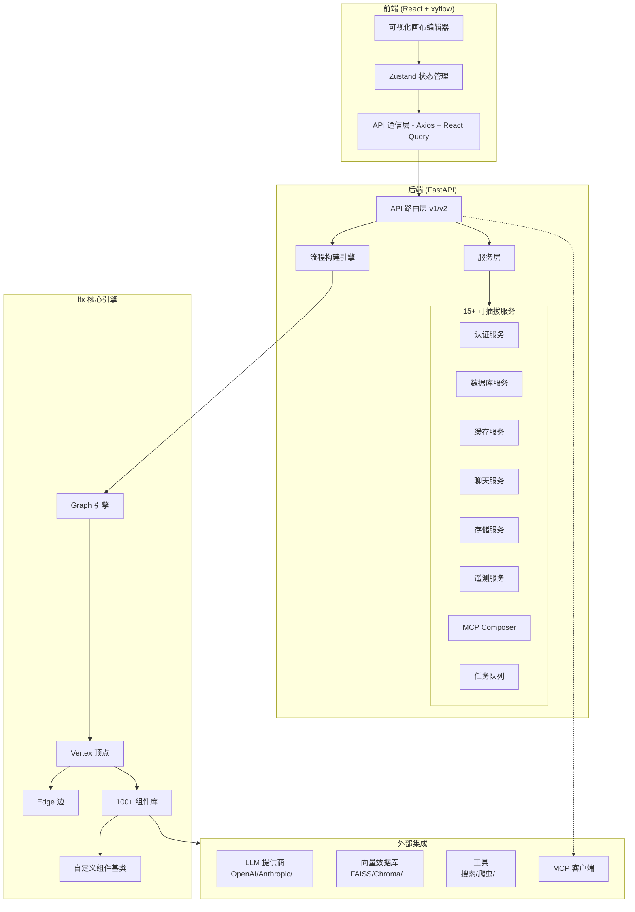
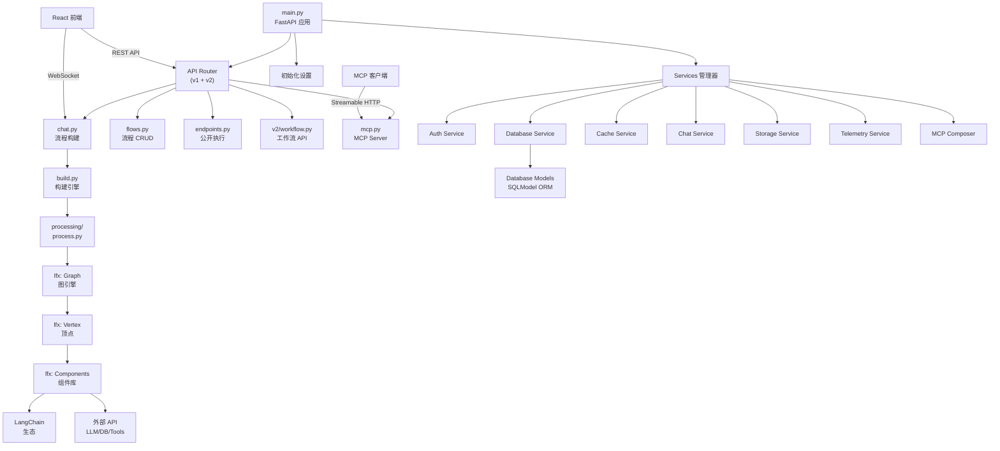
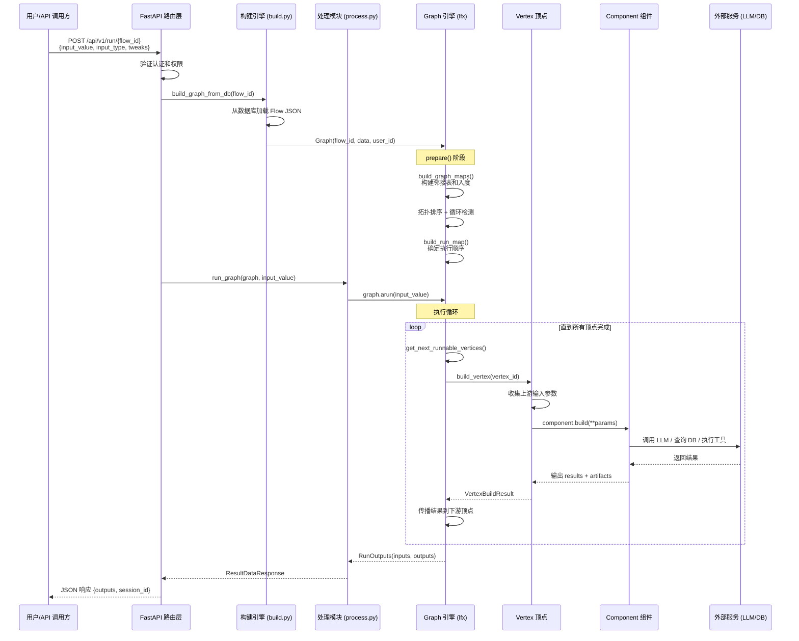
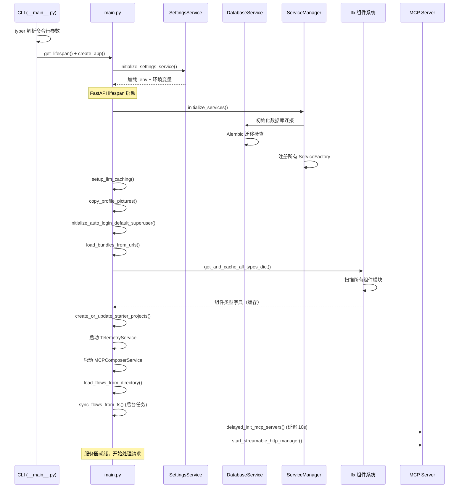

# langflow 源码学习笔记

> 仓库地址：[langflow](https://github.com/langflow-ai/langflow)
> 学习日期：2026-03-22

---

> **以下为 AI 源码分析**
>
> ### 一句话概括
>
> Langflow 是一个可视化 AI 工作流编排平台，通过拖拽式画布构建 LLM Agent 和 RAG 流程，并将其部署为 API 或 MCP Server。
>
> ### 要点速览
>
> | 核心模块 | 职责 | 关键文件 |
> |---------|------|---------|
> | Graph 引擎 (lfx) | 工作流图的构建、拓扑排序和异步执行 | `src/lfx/src/lfx/graph/graph/base.py` |
> | API 路由层 | RESTful API，处理流程 CRUD 和执行请求 | `src/backend/base/langflow/api/` |
> | Services 服务层 | 15+ 可插拔服务（认证、数据库、缓存等） | `src/backend/base/langflow/services/` |
> | 组件系统 | 100+ 预建组件（LLM、向量库、工具等） | `src/lfx/src/lfx/components/` |
> | 前端画布 | React + xyflow 可视化流程编辑器 | `src/frontend/src/` |
> | MCP 集成 | 将 flow 暴露为 MCP Server 工具 | `src/backend/base/langflow/api/v1/mcp*.py` |

---

## 项目简介

Langflow 是一个开源的低代码 AI 应用构建平台，让开发者通过可视化拖拽界面快速构建和部署 AI Agent、RAG 管道、多模型编排等复杂工作流。它的核心价值在于将 LangChain 生态的组件（LLM、Embeddings、向量数据库、工具等）封装为可视化节点，用户通过连线定义数据流向，平台自动完成拓扑排序和异步执行。构建好的 flow 可直接部署为 REST API 端点或 MCP Server，无缝集成到任何应用中。

## 技术栈

| 类别 | 技术 |
|------|------|
| 语言 | Python 3.10-3.13（后端）、TypeScript（前端） |
| 框架 | FastAPI（后端）、React 19 + xyflow（前端） |
| 构建工具 | uv（Python）、Vite 7（前端） |
| 依赖管理 | uv / pyproject.toml（后端）、npm / package.json（前端） |
| 测试框架 | pytest（后端）、Jest + Playwright（前端） |
| 数据库 | SQLModel（ORM），支持 SQLite / PostgreSQL |
| 状态管理 | Zustand（前端） |
| UI 组件库 | Radix UI + Tailwind CSS（shadcn-ui） |

## 目录结构

```
langflow/
├── src/
│   ├── backend/                    # 后端服务
│   │   ├── base/
│   │   │   ├── langflow/
│   │   │   │   ├── main.py         # FastAPI 应用入口
│   │   │   │   ├── __main__.py     # CLI 启动入口
│   │   │   │   ├── api/            # API 路由层（v1/v2）
│   │   │   │   ├── services/       # 15+ 可插拔服务
│   │   │   │   ├── graph/          # Graph 引擎（转发到 lfx）
│   │   │   │   ├── components/     # 组件系统（转发到 lfx）
│   │   │   │   ├── processing/     # 流程执行处理
│   │   │   │   ├── cli/            # 命令行工具
│   │   │   │   ├── initial_setup/  # 初始化和启动项目
│   │   │   │   └── alembic/        # 数据库迁移
│   │   │   └── pyproject.toml      # Python 依赖配置
│   │   └── tests/                  # 后端测试
│   ├── frontend/                   # 前端应用
│   │   ├── src/
│   │   │   ├── App.tsx             # React 应用入口
│   │   │   ├── routes.tsx          # 路由配置
│   │   │   ├── pages/             # 页面组件
│   │   │   ├── stores/            # Zustand 状态管理
│   │   │   ├── components/        # 可复用 UI 组件
│   │   │   ├── CustomNodes/       # 画布节点组件
│   │   │   ├── CustomEdges/       # 画布边组件
│   │   │   ├── controllers/       # API 通信层
│   │   │   └── types/             # TypeScript 类型定义
│   │   └── package.json
│   └── lfx/                       # 核心引擎库
│       └── src/lfx/
│           ├── graph/             # Graph/Vertex/Edge 核心实现
│           ├── components/        # 100+ 预建组件
│           ├── custom/            # 自定义组件基类
│           ├── services/          # 服务层接口和协议
│           ├── interface/         # 组件发现和加载
│           ├── schema/            # 数据模型（Message/Data/DataFrame）
│           └── template/          # 字段类型和模板系统
├── docs/                          # 文档站点
├── docker/                        # Docker 配置
├── scripts/                       # 部署脚本（AWS/GCP）
└── Makefile                       # 开发命令
```

## 架构设计

### 整体架构

Langflow 采用前后端分离的三层架构，后端通过 FastAPI 提供 API，前端使用 React 构建可视化编辑器。核心执行引擎 `lfx` 作为独立库，负责工作流图的构建和执行。



### 核心模块

#### 1. Graph 引擎（lfx 库）

**职责**：工作流图的核心计算引擎，负责拓扑排序、并发执行和状态管理。

**核心文件**：
- `src/lfx/src/lfx/graph/graph/base.py` — `Graph` 类（2400+ 行），图的核心实现
- `src/lfx/src/lfx/graph/vertex/base.py` — `Vertex` 类，计算节点
- `src/lfx/src/lfx/graph/edge/base.py` — `Edge` 类，数据流连接
- `src/lfx/src/lfx/graph/schema.py` — 图数据结构定义

**关键接口**：
- `Graph.arun()` — 异步执行完整图，返回 `RunOutputs`
- `Graph.astep()` — 单步执行，用于流式输出和调试
- `Graph.build_vertex()` — 构建单个顶点，调用组件 `build()` 方法
- `Graph.prepare()` — 初始化图结构：构建邻接表、拓扑排序、检测循环
- `Vertex._build()` — 收集输入参数 → 执行组件逻辑 → 捕获输出
- `Edge.validate_edge()` — 验证源/目标类型兼容性

**核心数据结构**：
- `vertex_map: dict[str, Vertex]` — 顶点 ID 到对象的映射
- `predecessor_map / successor_map` — 前驱/后继邻接表
- `run_manager: RunnableVerticesManager` — 管理可运行顶点的并发调度
- `conditionally_excluded_vertices` — 条件路由排除的顶点集

#### 2. API 路由层

**职责**：提供 RESTful API，处理前端请求和第三方集成。

**核心文件**：
- `src/backend/base/langflow/api/router.py` — 路由聚合器，挂载 v1/v2 路由
- `src/backend/base/langflow/api/v1/chat.py` — 流程构建和执行端点
- `src/backend/base/langflow/api/v1/flows.py` — 流程 CRUD
- `src/backend/base/langflow/api/v1/endpoints.py` — 公开 API 端点执行
- `src/backend/base/langflow/api/v2/workflow.py` — v2 工作流 API（同步/流式/后台模式）
- `src/backend/base/langflow/api/v1/mcp.py` — MCP Server 端点
- `src/backend/base/langflow/api/v1/mcp_projects.py` — 项目级 MCP Server 管理
- `src/backend/base/langflow/api/build.py` — 流程构建引擎：`start_flow_build()`、`cancel_flow_build()`

**关键端点**：
- `POST /api/v1/build/{flow_id}/vertices` — 构建流程顶点
- `POST /api/v1/run/{flow_id}` — 执行流程
- `POST /api/v2/workflow` — v2 工作流执行
- `GET /api/v1/flows` — 获取流程列表
- `POST /api/v1/mcp` — MCP Server Streamable HTTP

#### 3. Services 服务层

**职责**：通过依赖注入提供 15+ 可插拔服务，实现关注点分离。

**核心文件**：
- `src/backend/base/langflow/services/schema.py` — `ServiceType` 枚举定义
- `src/backend/base/langflow/services/base.py` — `Service` 抽象基类
- `src/backend/base/langflow/services/factory.py` — `ServiceFactory` 工厂模式
- `src/backend/base/langflow/services/manager.py` — `ServiceManager` 管理器
- `src/backend/base/langflow/services/deps.py` — 依赖注入函数

**核心服务**：

| 服务 | 文件 | 职责 |
|------|------|------|
| `AuthService` | `services/auth/service.py` | JWT 认证、权限检查、API Key 验证 |
| `DatabaseService` | `services/database/service.py` | 数据库连接池、Alembic 迁移、ORM 会话管理 |
| `CacheService` | `services/cache/service.py` | 内存/Redis 缓存 |
| `ChatService` | `services/chat/service.py` | 对话历史管理、会话缓存 |
| `StorageService` | `services/storage/service.py` | 本地/S3 文件存储 |
| `VariableService` | `services/variable/service.py` | 全局变量（密钥、配置）管理 |
| `JobQueueService` | `services/job_queue/service.py` | 异步任务队列 |
| `TelemetryService` | `services/telemetry/service.py` | OpenTelemetry 遥测和 Prometheus 指标 |
| `TracingService` | `services/tracing/service.py` | 链路追踪（LangSmith、LangFuse 集成） |
| `MCPComposerService` | lfx 库提供 | MCP Server 生命周期管理 |

**依赖注入模式**：
```python
# 通过 get_service() 获取服务实例
settings = get_settings_service()
db = get_database_service()
# 通过 FastAPI Depends 注入
async def endpoint(session=Depends(session_scope)):
    ...
```

#### 4. 组件系统

**职责**：提供 100+ 预建组件，支持用户自定义 Python 组件。

**核心文件**：
- `src/lfx/src/lfx/custom/custom_component/component.py` — `Component` 通用基类
- `src/lfx/src/lfx/custom/custom_component/custom_component.py` — `CustomComponent` 自定义组件类
- `src/lfx/src/lfx/custom/custom_component/base_component.py` — `BaseComponent` 基类
- `src/lfx/src/lfx/components/` — 所有预建组件

**组件继承层级**：
```
BaseComponent（代码解析、模板构建）
  └── CustomComponent（运行时属性、状态管理）
      └── Component（inputs/outputs 定义、build() 执行）
```

**组件分类**：

| 分类 | 示例组件 | 数量 |
|------|---------|------|
| Input/Output | `ChatInput`, `ChatOutput`, `TextInput`, `Webhook` | 6+ |
| LLM Models | `OpenAIModel`, `AnthropicModel`, `GroqModel` | 10+ |
| Embeddings | `OpenAIEmbeddings`, `CohereEmbeddings` | 8+ |
| Vector Stores | `FAISS`, `Chroma`, `Pinecone`, `Qdrant`, `Weaviate` | 12+ |
| Processing | `TextOperations`, `CombineText`, `ParseDataFrame` | 10+ |
| Flow Controls | `ConditionalRouter`, `Loop`, `SubFlow`, `RunFlow` | 5+ |
| Tools | `SearchAPI`, `Calculator`, `PythonREPL` | 15+ |
| Document Loaders | `PDFLoader`, `WebLoader`, `FileLoader` | 10+ |

**组件注册流程**：
1. 组件类定义 `inputs` 和 `outputs` 列表
2. `interface/listing.py` 扫描所有组件模块
3. `get_and_cache_all_types_dict()` 缓存组件类型字典
4. 前端通过 `/api/v1/types` 获取可用组件列表

#### 5. 前端画布编辑器

**职责**：可视化工作流编辑、参数配置、实时执行和结果展示。

**核心文件**：
- `src/frontend/src/pages/FlowPage/` — 流程编辑器主页面
- `src/frontend/src/CustomNodes/GenericNode/` — 通用组件节点渲染
- `src/frontend/src/CustomEdges/index.tsx` — 自定义边（Bezier 曲线）
- `src/frontend/src/stores/flowStore.ts` — 画布状态（节点、边、选择、构建状态）
- `src/frontend/src/stores/flowsManagerStore.ts` — 流程管理（撤销/重做、自动保存）
- `src/frontend/src/controllers/API/` — Axios + React Query API 层

**前端状态管理**：
- `flowStore` — 画布节点/边状态、构建状态（核心 Store）
- `flowsManagerStore` — 多流程管理、版本控制、撤销重做
- `authStore` — 用户认证、Token 管理
- `typesStore` — 组件类型字典缓存
- `messagesStore` — 聊天消息和会话历史

**画布渲染流程**：
```
FlowPage 加载 → API 获取 flow 数据 → 初始化 flowStore
→ xyflow 渲染 Canvas → GenericNode 渲染节点 → DefaultEdge 渲染边
→ 用户拖拽/连线 → flowStore 更新 → 自动保存到后端
```

#### 6. 数据库模型层

**职责**：定义所有业务实体的 ORM 模型。

**核心模型**（`services/database/models/`）：

| 模型 | 文件 | 关键字段 |
|------|------|---------|
| `User` | `user/model.py` | `id`, `username`, `password`, `is_superuser` |
| `Flow` | `flow/model.py` | `id`, `name`, `data`(JSON), `endpoint_name`, `mcp_enabled` |
| `FlowVersion` | `flow_version/model.py` | 流程版本快照 |
| `Folder` | `folder/model.py` | 层级文件夹组织 |
| `Message` | `message/model.py` | 聊天消息存储 |
| `Variable` | `variable/model.py` | 全局变量（加密存储） |
| `ApiKey` | `api_key/model.py` | API 密钥管理 |
| `VertexBuild` | `vertex_builds/model.py` | 顶点构建记录 |

### 模块依赖关系



## 核心流程

### 流程一：工作流执行（Flow Execution）

这是 Langflow 最核心的流程——用户触发一个 flow 的执行，系统完成图构建、拓扑排序、逐节点执行并返回结果。



**关键步骤说明**：
1. **图构建**：从数据库加载 Flow 的 JSON 数据，实例化 `Graph` 对象
2. **prepare() 阶段**：构建邻接表（predecessor_map/successor_map），计算入度，进行拓扑排序，检测循环边
3. **执行循环**：`RunnableVerticesManager` 选择所有入度为 0 的顶点并发执行
4. **顶点构建**：收集上游传递的输入参数，调用组件的 `build()` 方法
5. **结果传播**：顶点执行完成后，将输出传递给下游顶点，更新其输入参数

### 流程二：应用启动（Application Startup）

Langflow 的启动流程涉及服务初始化、数据库迁移、组件缓存等多个阶段。



**关键阶段**：
1. **CLI 解析**：通过 `typer` 解析 `--host`、`--port`、`--workers` 等参数
2. **服务初始化**：按依赖顺序注册 15+ 个服务工厂，通过 `ServiceManager` 管理
3. **组件缓存**：扫描 lfx 库中所有组件类，构建类型字典并缓存，供前端使用
4. **启动项目**：使用 `FileLock` 防止多 worker 重复创建示例项目
5. **MCP 延迟启动**：等待 10 秒后初始化 MCP Server，避免与启动项目创建产生竞态

## 关键设计亮点

### 1. 图执行引擎的拓扑排序 + 条件路由

**解决的问题**：工作流中节点存在复杂依赖关系，需要自动确定执行顺序，同时支持条件分支和循环。

**实现方式**：
- `Graph.build_graph_maps()` 构建前驱/后继邻接表和入度映射
- `RunnableVerticesManager` 基于入度为 0 的规则选择可并发执行的顶点
- `ConditionalRouter` 组件通过 `conditionally_excluded_vertices` 动态排除不执行的分支
- `CycleEdge` 支持循环边，`find_cycle_vertices()` 检测循环节点

**为什么这样设计**：DAG 拓扑排序是经典解法，但 AI 工作流需要支持条件路由（if-else 分支）和循环（Agent 迭代），因此引入了条件排除机制和循环边检测，在保持拓扑排序基础上扩展了表达能力。

### 2. 可插拔服务架构（Service Factory + DI）

**解决的问题**：15+ 个服务（认证、数据库、缓存、遥测等）存在复杂的依赖关系，需要支持灵活替换和测试 mock。

**实现方式**：
- `ServiceFactory` 工厂模式创建服务实例，支持依赖注入
- `ServiceManager` 统一管理所有服务的生命周期（启动、就绪、销毁）
- `ServiceType` 枚举定义服务类型，`get_service()` 按类型获取实例
- lfx 使用 Python `Protocol` 定义服务接口，支持替换实现（如 `NoopDatabaseService`）

**为什么这样设计**：服务层解耦使得 lfx 引擎可以独立于 Langflow 运行（使用 Noop 实现），同时支持在测试中轻松 mock 任何服务。

### 3. 组件系统的代理模式 + 动态发现

**解决的问题**：100+ 组件需要统一管理、注册和前端展示，同时支持用户自定义 Python 组件。

**实现方式**：
- `langflow.components` 通过 `__getattr__` 代理到 `lfx.components`，实现透明转发
- 组件继承层级：`BaseComponent` → `CustomComponent` → `Component`
- `interface/listing.py` 使用 `importlib` 动态扫描组件模块
- `build_custom_component_template()` 解析 Python 代码生成前端渲染模板
- 用户自定义组件通过 `CodeParser` 解析代码树，提取 `inputs`/`outputs` 定义

**为什么这样设计**：代理模式让 langflow 和 lfx 的组件系统保持一致性，动态发现机制使得添加新组件只需要放入对应目录即可自动注册，降低了扩展成本。

### 4. 前端 Zustand 多 Store 分治

**解决的问题**：前端状态复杂（画布节点、流程管理、认证、消息、设置等），需要避免单一 Store 的性能问题和维护困难。

**实现方式**：
- 按业务领域拆分为 15+ 个独立 Zustand Store
- `flowStore` 管理画布节点/边状态，通过 `useShallow` 优化选择性订阅
- `flowsManagerStore` 管理多流程切换、撤销重做、自动保存（防抖）
- React Query 处理服务端状态（API 缓存、自动重试、轮询）

**为什么这样设计**：Zustand 的轻量性和选择性订阅机制避免了 Redux 的样板代码，多 Store 分治让每个 Store 职责单一、可独立测试，配合 React Query 实现了客户端/服务端状态的清晰分离。

### 5. MCP Server 集成——Flow 即工具

**解决的问题**：构建好的 AI 工作流需要被其他 AI 系统调用，MCP（Model Context Protocol）是新兴的标准协议。

**实现方式**：
- Flow 模型新增 `mcp_enabled` 和 `action_name` 字段
- `api/v1/mcp.py` 实现 Streamable HTTP 传输的 MCP Server
- `api/v1/mcp_projects.py` 管理项目级 MCP Server 的生命周期
- 启动时延迟 10 秒初始化 MCP Server（`delayed_init_mcp_servers()`），等待启动项目创建完成
- 支持 Agentic MCP 模式：自动将启用的 flow 注册为 MCP 工具

**为什么这样设计**：将 flow 暴露为 MCP 工具使得 Langflow 构建的工作流可以被任何支持 MCP 协议的 AI 客户端（如 Claude Desktop、Cursor 等）直接调用，极大扩展了平台的互操作性。
