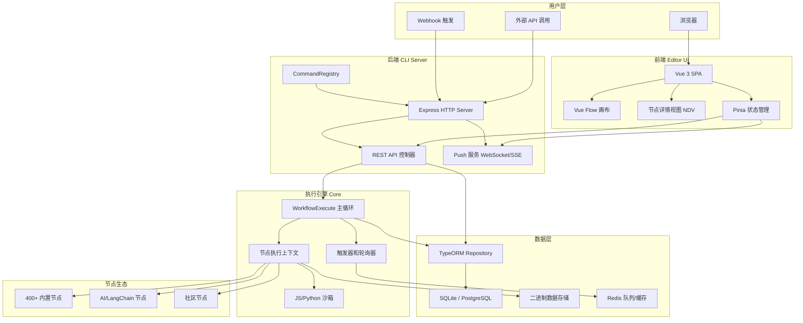
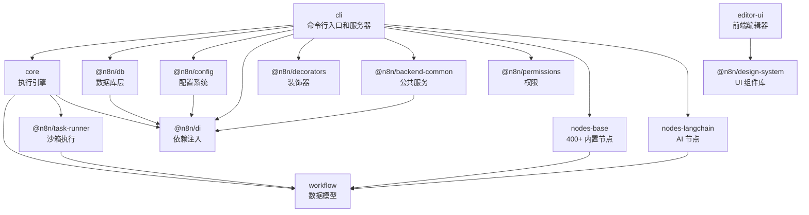
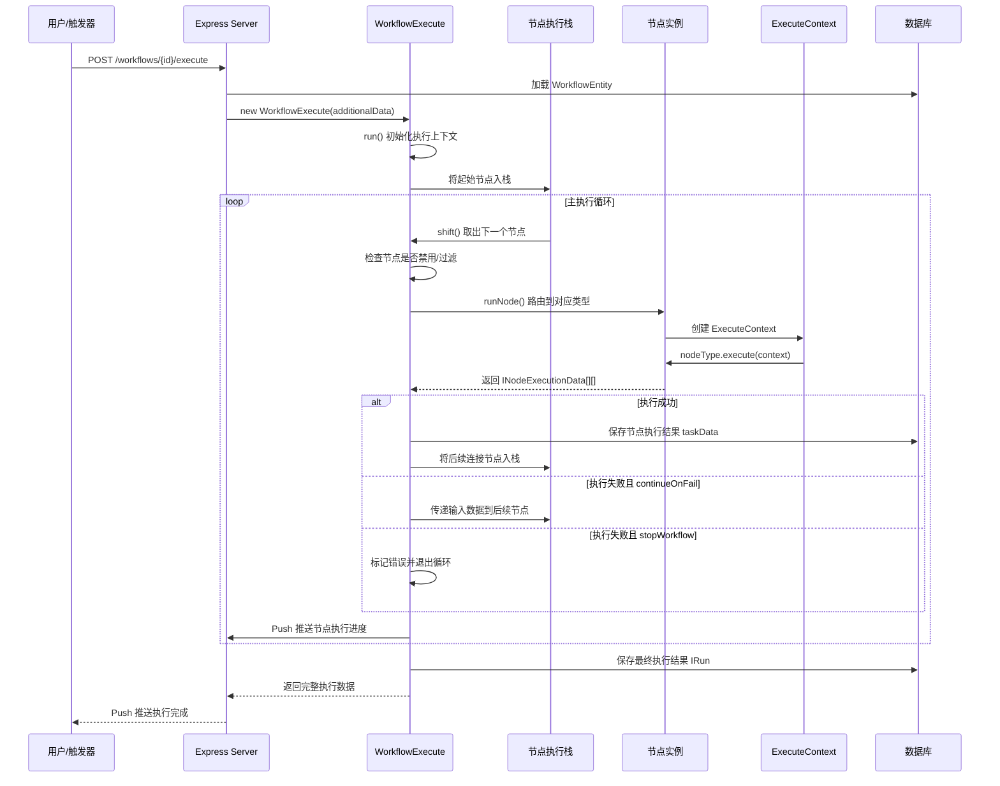
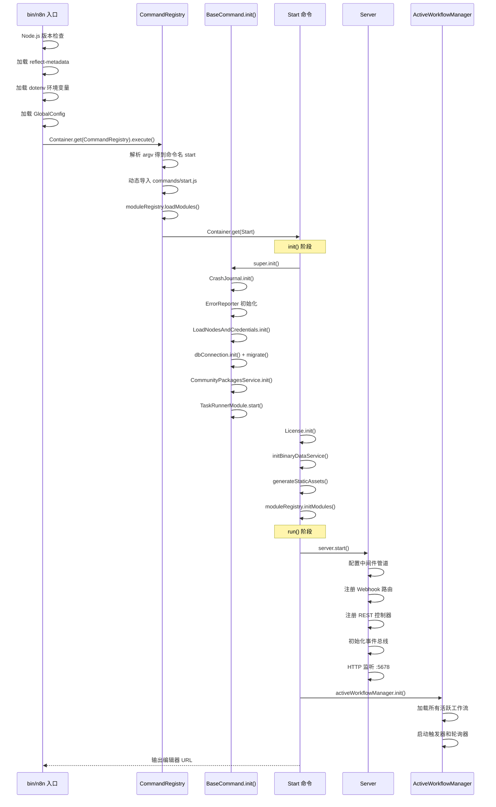

# n8n 源码学习笔记

> 仓库地址：[n8n](https://github.com/n8n-io/n8n)
> 学习日期：2026-03-22

---

> **以下为 AI 源码分析**
>
> ### 一句话概括
>
> n8n 是一个基于 Node.js 的开源工作流自动化平台，通过可视化节点编辑器和 400+ 集成连接器，让技术团队以低代码/无代码方式构建自动化流程。
>
> ### 要点速览
>
> | 核心模块 | 职责 | 关键路径 |
> |---------|------|---------|
> | CLI (`packages/cli`) | 命令行入口、HTTP 服务器、启动编排 | `bin/n8n`, `src/server.ts`, `src/commands/start.ts` |
> | Core (`packages/core`) | 工作流执行引擎、节点执行上下文 | `src/execution-engine/workflow-execute.ts` |
> | Workflow (`packages/workflow`) | 工作流/节点数据模型、表达式引擎 | `src/workflow.ts`, `src/expression.ts` |
> | Editor UI (`packages/frontend/editor-ui`) | Vue 3 可视化编辑器 SPA | `src/main.ts`, `src/features/workflows/canvas/` |
> | Nodes Base (`packages/nodes-base`) | 400+ 内置集成节点 | `nodes/HttpRequest/`, `nodes/Code/`, `nodes/If/` |
> | Nodes LangChain (`packages/@n8n/nodes-langchain`) | AI/LLM 节点（20+ 模型） | `nodes/llms/`, `nodes/agents/`, `nodes/chains/` |
> | DB (`packages/@n8n/db`) | 数据库实体、Repository、迁移 | `src/entities/`, `src/repositories/`, `src/migrations/` |
> | DI (`packages/@n8n/di`) | 依赖注入容器 | `src/di.ts` |
> | Config (`packages/@n8n/config`) | 装饰器驱动的配置系统 | `src/index.ts` (GlobalConfig) |

---

## 项目简介

n8n（发音 n-eight-n，取自 "nodemation"）是一个面向技术团队的工作流自动化平台。它采用 fair-code 许可，既可自托管也提供云服务。n8n 的核心价值在于：通过可视化的节点编辑器让用户拖拽构建自动化流程，同时保留 JavaScript/Python 代码能力，在"低代码便捷性"和"代码灵活性"之间取得平衡。支持 400+ 第三方服务集成、原生 AI/LangChain 工作流、企业级权限管理和多实例部署。

## 技术栈

| 类别 | 技术 |
|------|------|
| 语言 | TypeScript (全栈) |
| 后端框架 | Express.js + 自研 DI 容器 (`@n8n/di`) |
| 前端框架 | Vue 3 + Pinia + Vue Flow |
| 构建工具 | Turborepo + Vite + tsc |
| 依赖管理 | pnpm (Monorepo workspace) |
| 测试框架 | Jest (后端) + Vitest (前端) + Playwright (E2E) |
| 数据库 | SQLite (默认) / PostgreSQL (生产) via TypeORM |
| 实时通信 | WebSocket / EventSource (Push) |
| AI 框架 | LangChain.js |

## 目录结构

```
n8n/
├── packages/
│   ├── cli/                        # 主服务入口：CLI 命令、HTTP 服务器、启动编排
│   │   ├── bin/n8n                  #   可执行入口脚本
│   │   └── src/
│   │       ├── commands/            #   CLI 命令（start、worker、webhook 等）
│   │       ├── server.ts            #   Express HTTP(S) 服务器
│   │       └── services/            #   后端业务服务
│   ├── core/                        # 执行引擎：节点执行、触发器、轮询器
│   │   └── src/execution-engine/
│   │       ├── workflow-execute.ts   #   工作流主执行循环
│   │       ├── routing-node.ts      #   声明式 REST API 节点执行
│   │       └── node-execution-context/ # 节点执行上下文
│   ├── workflow/                    # 数据模型：Workflow、Node、Connection、Expression
│   ├── nodes-base/                  # 400+ 内置集成节点和凭证定义
│   │   ├── nodes/                   #   按服务分类的节点实现
│   │   └── credentials/             #   390+ 凭证类型定义
│   ├── frontend/
│   │   ├── editor-ui/               # 主前端 SPA：工作流编辑器
│   │   │   └── src/
│   │   │       ├── app/             #     路由、Store、全局组件
│   │   │       └── features/        #     功能模块（canvas、ndv 等）
│   │   └── @n8n/
│   │       ├── design-system/       #   96 个 UI 组件库
│   │       ├── stores/              #   共享 Pinia Store
│   │       └── rest-api-client/     #   REST API 客户端
│   ├── extensions/                  # 表达式扩展函数
│   └── @n8n/
│       ├── di/                      # 依赖注入容器
│       ├── db/                      # 数据库实体、Repository、迁移
│       ├── config/                  # 装饰器驱动的全局配置
│       ├── decorators/              # @Command、@RestController 等装饰器
│       ├── nodes-langchain/         # AI/LangChain 节点（20+ LLM）
│       ├── task-runner/             # JS 代码沙箱隔离执行
│       ├── permissions/             # RBAC 权限模型
│       └── backend-common/          # 日志、模块注册等公共服务
├── docker/                          # Docker 构建配置
├── scripts/                         # 构建和工具脚本
└── turbo.json                       # Turborepo 任务编排配置
```

## 架构设计

### 整体架构

n8n 采用 **Monorepo + 分层架构** 设计。后端以 Express.js 为 HTTP 层，自研 DI 容器管理服务生命周期；核心执行引擎基于**栈式执行模型**遍历工作流节点图；前端使用 Vue 3 + Vue Flow 构建可视化节点编辑器，通过 REST API + WebSocket Push 与后端通信。



### 核心模块

#### 1. CLI 服务模块 (`packages/cli`)

**职责**：作为 n8n 的主入口，负责 CLI 命令解析、HTTP 服务器启动、所有后端服务的编排初始化。

**核心文件**：
- `bin/n8n` — 可执行入口，加载 reflect-metadata、环境变量、GlobalConfig，启动 DI 容器
- `src/command-registry.ts` — 命令注册中心，动态加载命令模块，解析参数，执行生命周期
- `src/commands/start.ts` — `start` 命令，编排完整启动流程（数据库、许可证、工作流激活、HTTP 监听）
- `src/commands/base-command.ts` — 命令基类，封装数据库连接、错误报告、节点加载等通用初始化
- `src/server.ts` — Express 服务器，注册控制器、中间件、Webhook 路由、公共 API
- `src/abstract-server.ts` — 服务器抽象基类，创建 HTTP(S) 实例、健康检查、中间件管道

**关键类**：
- `CommandRegistry` — `@Service()` 单例，`execute()` 方法是 CLI 入口
- `Start` — `@Command({ name: 'start' })` 装饰，`init()` → `run()` 启动流程
- `Server` extends `AbstractServer` — 配置 Express 应用

#### 2. 执行引擎 (`packages/core`)

**职责**：工作流的实际执行器，实现栈式节点遍历、数据流转、触发/轮询、沙箱隔离。

**核心文件**：
- `src/execution-engine/workflow-execute.ts` — 主执行类，`run()` 返回 `PCancelable<IRun>`
- `src/execution-engine/routing-node.ts` — 声明式 REST API 节点执行器
- `src/execution-engine/triggers-and-pollers.ts` — 触发器 `runTrigger()` 和轮询器 `runPoll()`
- `src/execution-engine/node-execution-context/` — `ExecuteContext`、`ExecuteSingleContext` 等执行上下文

**关键接口**：
- `WorkflowExecute.processRunExecutionData()` — 主循环：从栈取节点 → 执行 → 输出入栈后续节点
- `runNode()` — 节点类型路由（execute / poll / trigger / declarative）
- `addNodeToBeExecuted()` — 多输入等待聚合逻辑

#### 3. 工作流模型 (`packages/workflow`)

**职责**：定义工作流、节点、连接的数据结构，提供表达式引擎。

**核心数据结构**：
- `Workflow` — `id`、`name`、`nodes: INodes`、`connectionsBySourceNode`、`settings`、`staticData`
- `INode` — `id`、`name`、`type`、`typeVersion`、`parameters`、`credentials`、`continueOnFail`
- `IConnection` — `node`（目标）、`type`（连接类型）、`index`
- `INodeExecutionData` — `json: IDataObject`、`binary`、`pairedItem`（数据血缘追踪）

#### 4. 前端编辑器 (`packages/frontend/editor-ui`)

**职责**：Vue 3 SPA，提供可视化工作流编辑、节点配置、执行监控。

**核心文件**：
- `src/main.ts` — 应用入口，加载 Vue Flow、Pinia、Router、i18n 等插件
- `src/features/workflows/canvas/Canvas.vue` — 基于 Vue Flow 的工作流画布
- `src/features/ndv/` — 节点详情视图（Node Details View），参数编辑、执行数据查看
- `src/app/stores/` — 42+ Pinia Store 管理全局状态

**前后端通信**：
- REST API — 工作流 CRUD、凭证管理、执行历史
- WebSocket / EventSource — Push 实时推送执行进度、节点状态更新

#### 5. 节点系统 (`packages/nodes-base` + `packages/@n8n/nodes-langchain`)

**职责**：提供 400+ 内置集成和 AI 节点。

**节点定义模式**：所有节点实现 `INodeType` 接口
- `description: INodeTypeDescription` — 声明式元数据（名称、图标、参数、凭证）
- `execute()` / `trigger()` / `poll()` — 执行函数
- `VersionedNodeType` — 多版本管理（如 Set v1-v3.4）

**AI 节点分类**：
- `llms/` — 20+ LLM 模型（OpenAI、Anthropic、Gemini、Ollama 等）
- `agents/` — ReAct 智能体（Agent v1-v3）
- `chains/` — 预定义链（RAG、摘要、分类、情感分析）
- `tools/` — 10+ 工具（代码执行、HTTP、搜索、维基百科等）
- `memory/` / `embeddings/` / `vector_store/` — 记忆、嵌入、向量存储

#### 6. 数据库层 (`packages/@n8n/db`)

**职责**：基于 TypeORM 的数据持久化，支持 SQLite 和 PostgreSQL。

**核心实体**：
- `WorkflowEntity` — 工作流定义（nodes、connections 存为 JSON 列）
- `ExecutionEntity` — 执行记录（状态、时间戳、重试关系）
- `CredentialsEntity` — 加密凭证存储
- `User` — 用户（支持 MFA、SSO、RBAC）
- `SharedWorkflow` / `SharedCredentials` — 权限共享模型

**特点**：Mixin 组合模式（`WithTimestampsAndStringId`）、45+ Repository、100+ 迁移文件

#### 7. 依赖注入 (`packages/@n8n/di`)

**职责**：轻量级 DI 容器，基于 reflect-metadata 自动解析构造函数依赖。

**核心 API**：
- `@Service()` — 标记可注入类
- `Container.get(Type)` — 获取/创建实例（自动递归解析依赖，循环检测）
- `Container.set(Type, instance)` — 手动注册实例

### 模块依赖关系



## 核心流程

### 流程一：工作流执行（从触发到完成）

这是 n8n 最核心的流程——用户手动执行或触发器自动触发一个工作流后，引擎如何遍历节点图、执行每个节点、传递数据。



**关键步骤说明**：

1. **入栈初始化**：将工作流的起始节点（通常是触发器节点）放入 `nodeExecutionStack`
2. **主循环**：`while (nodeExecutionStack.length > 0)` 不断从栈中取出节点执行
3. **节点路由**：`runNode()` 根据节点类型分发到 `executeNode()`（普通节点）、`RoutingNode`（声明式 API 节点）、触发器/轮询节点
4. **数据传递**：节点输出 `INodeExecutionData[][]`（二维数组：第一维是输出端口，第二维是数据项），通过 `connectionsBySourceNode` 找到下游节点入栈
5. **多输入等待**：当节点有多个输入时，`addNodeToBeExecuted()` 将数据暂存于 `waitingExecution`，等所有输入就绪后才入栈
6. **错误处理**：支持重试（`retryOnFail`，最多 5 次）、继续执行（`continueOnFail`）、错误输出路由（`onError: 'continueErrorOutput'`）

### 流程二：应用启动（从 CLI 到服务就绪）

n8n 的启动过程涉及大量服务初始化，理解这个流程有助于把握系统全貌。



**关键步骤说明**：

1. **入口脚本** (`bin/n8n`)：验证 Node.js 版本 (>=22.16)，加载元数据反射、环境变量、全局配置
2. **命令分发**：`CommandRegistry` 从 `process.argv[2]` 解析命令名（默认 `start`），动态 import 命令模块
3. **BaseCommand.init()**：通用初始化——崩溃日志、错误报告、节点/凭证加载、数据库连接和迁移
4. **Start.init()**：特定初始化——许可证、二进制数据服务、静态资产生成、模块初始化
5. **Server.start()**：Express 配置——中间件（压缩、CORS、body-parser）、Webhook 路由、REST 控制器注册、HTTP(S) 监听
6. **ActiveWorkflowManager.init()**：加载数据库中所有 `active: true` 的工作流，启动各触发器和定时轮询器

## 关键设计亮点

### 1. 装饰器驱动的依赖注入 + 命令系统

**解决的问题**：大型 TypeScript 后端服务中，手动管理服务实例和命令注册容易出错且耦合严重。

**实现方式**：
- `@n8n/di` 包实现了轻量级 DI 容器，基于 `reflect-metadata` 自动解析构造函数参数类型，递归创建依赖，内置循环依赖检测
- `@n8n/decorators` 提供 `@Command({ name, description, flagsSchema })` 装饰器，将命令元数据注册到全局 `CommandMetadata`，同时自动标记为 `@Service()` 使其可注入
- 命令的 flagsSchema 使用 Zod 验证，实现类型安全的参数解析

**为什么这样设计**：相比 oclif 等重量级 CLI 框架，自研方案更贴合 n8n 的 DI 生态，所有服务统一通过 `Container.get()` 获取，测试时可轻松替换为 mock。

### 2. 声明式节点定义模式

**解决的问题**：400+ 集成节点需要统一的开发范式，既要降低开发门槛，又要保证 UI 动态渲染能力。

**实现方式**：
- 每个节点通过 `INodeTypeDescription` 声明式定义参数（`properties: INodeProperties[]`）、凭证需求、输入/输出端口
- 参数支持条件显示（`displayOptions`）、动态选项（`listSearch`）、表达式绑定
- `VersionedNodeType` 支持多版本共存（如 Set v1、v3、v3.1-v3.4），用户升级无感知
- `RoutingNode` 专为声明式 REST API 节点优化，通过 `requestDefaults` 配置即可自动处理 HTTP 请求、分页、错误处理

**为什么这样设计**：参数驱动使前端能自动渲染节点配置面板，无需为每个节点写专属 UI；多版本机制允许渐进式升级而不破坏现有工作流。

### 3. 栈式工作流执行 + 多输入等待聚合

**解决的问题**：工作流是一个有向图（可能有分支、合并、循环），需要正确处理数据流转和多分支合并。

**实现方式**：
- `WorkflowExecute` 维护 `nodeExecutionStack`（待执行栈）和 `waitingExecution`（等待中节点）
- 单输入节点直接入栈执行；多输入节点（如 Merge 节点）先暂存到 `waitingExecution[nodeName][runIndex]`
- 当某输入端口收到数据，填充对应索引位置；检查所有输入是否就绪，全部就绪才从等待队列移到执行栈
- `pairedItem` 追踪每条数据的来源节点和索引，实现数据血缘关系

**为什么这样设计**：栈式模型天然支持深度优先遍历，配合等待队列实现了广度优先的合并语义。`pairedItem` 让错误追踪和数据关联成为可能，用户可以在 UI 中点击某条输出精确定位到输入来源。

### 4. 装饰器驱动的配置系统（@Config + @Env + Zod）

**解决的问题**：n8n 有 40+ 个配置模块、数百个环境变量，需要类型安全、验证、嵌套支持且易于扩展。

**实现方式**：
- `@Config` 装饰器标记配置类并自动注册到 DI 容器
- `@Env('ENV_NAME', zodSchema)` 绑定环境变量，支持类型自动转换（Number、Boolean、Date）和 Zod 验证
- `@Nested` 支持配置嵌套，递归解析子配置对象
- 支持 `_FILE` 后缀从文件读取敏感配置（如 `DB_PASSWORD_FILE=/run/secrets/db-pass`）
- `GlobalConfig` 作为顶层配置树，通过 DI 全局可访问

**为什么这样设计**：与传统的 convict/dotenv 方案相比，装饰器方案让配置定义和类型声明合一，IDE 可直接跳转和自动补全。Zod 验证在启动时就能发现配置错误，避免运行时故障。

### 5. 沙箱隔离的代码执行（Task Runner）

**解决的问题**：用户可以在 Code 节点中编写任意 JavaScript/Python 代码，必须防止原型污染、RCE 等安全攻击。

**实现方式**：
- `@n8n/task-runner` 包中的 `JsTaskRunner` 使用 Node.js `vm` 模块创建隔离上下文
- 冻结全局对象原型，禁用 `Object.defineProperty`、`setPrototypeOf` 等危险方法
- 白名单控制允许加载的内置模块（`allowedBuiltInModules`）和外部包（`allowedExternalModules`）
- 阻止 V8 堆栈跟踪 RCE 攻击（拦截 `Error.prepareStackTrace`）
- 超时保护和内存限制防止资源滥用
- Python 代码通过 `@n8n/task-runner-python` 在独立进程中执行

**为什么这样设计**：低代码平台允许用户执行代码是核心卖点，但安全隔离必不可少。VM 沙箱 + 原型冻结 + 白名单模块的多层防护，在灵活性和安全性之间取得了平衡。
