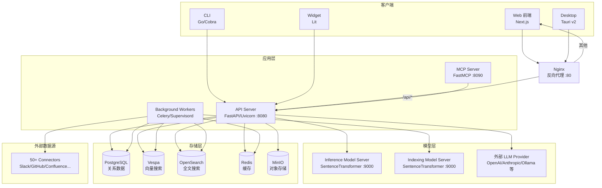
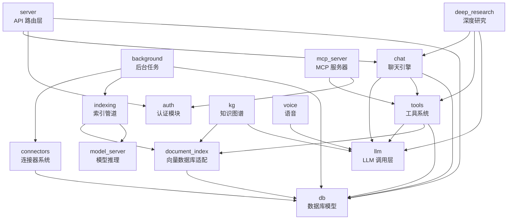
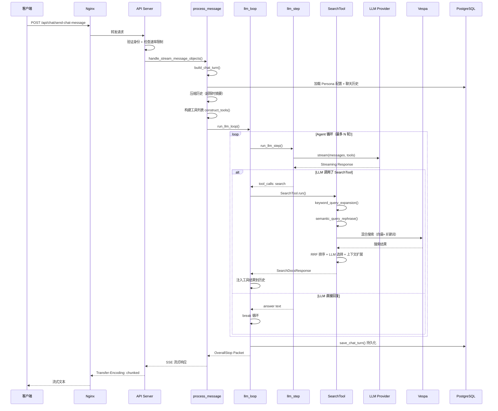
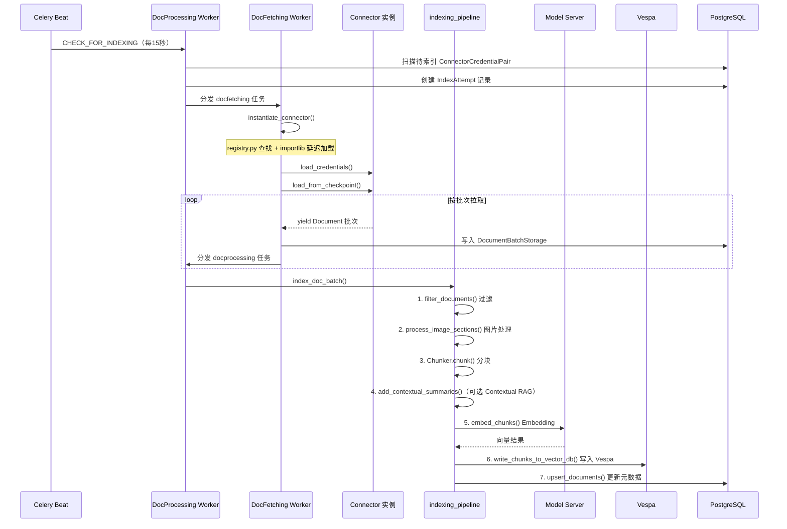
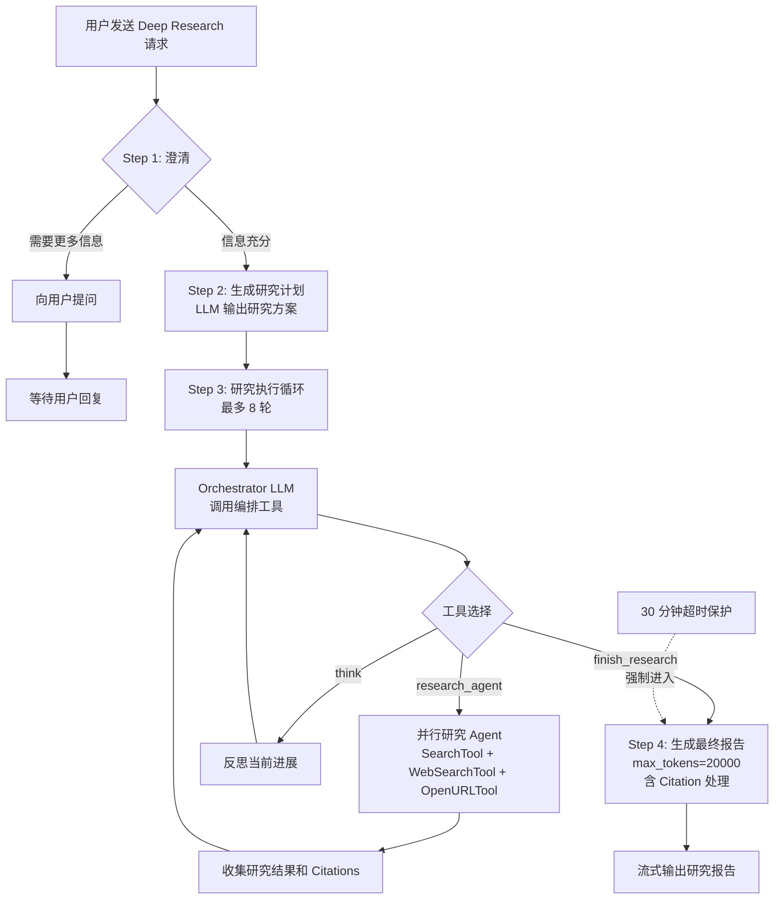

# Onyx 源码学习笔记

> 仓库地址：[onyx](https://github.com/onyx-dot-app/onyx)
> 学习日期：2026-04-05

---

> **以下为 AI 源码分析**
>
> ### 一句话概括
>
> Onyx 是一个开源的 AI 应用层平台，围绕 LLM 构建了包含 Agentic RAG、Deep Research、50+ 数据源 Connector、MCP、代码执行、语音等完整能力的对话式 AI 系统。
>
> ### 要点速览
>
> | 核心模块 | 职责 | 关键文件/目录 |
> |---------|------|--------------|
> | API Server | FastAPI 主服务，60+ 路由端点 | `backend/onyx/main.py`, `backend/onyx/server/` |
> | Chat Engine | 聊天消息处理、Agent 循环、LLM 调用 | `backend/onyx/chat/process_message.py`, `llm_loop.py` |
> | Connector System | 40+ 数据源插件化连接器 | `backend/onyx/connectors/`, `registry.py` |
> | Indexing Pipeline | 文档分块、Embedding、向量入库 | `backend/onyx/indexing/indexing_pipeline.py` |
> | Deep Research | 多步骤研究编排（计划→并行研究→报告）| `backend/onyx/deep_research/dr_loop.py` |
> | Tool System | 10+ 内置工具（搜索、Web、代码等）| `backend/onyx/tools/tool_implementations/` |
> | Background Workers | Celery 7 组 Worker，后台索引/同步 | `backend/onyx/background/celery/` |
> | Web Frontend | Next.js App Router + Zustand 状态管理 | `web/src/` |
> | Desktop App | Tauri v2 桌面客户端 | `desktop/src-tauri/` |
> | CLI | Go + Cobra 命令行工具 | `cli/cmd/` |
> | Widget | Lit Web Components 嵌入式组件 | `widget/src/` |

---

## 项目简介

Onyx 是一个**开源 AI 应用层平台**，为 LLM 提供功能丰富的交互界面。它解决的核心问题是：如何让企业和个人用户以统一入口使用各种 LLM 的能力，并安全地连接到组织内部的知识源。

核心价值：
- **Agentic RAG**：通过混合索引（Vespa 向量 + OpenSearch 关键词）+ AI Agent 实现高质量信息检索与回答
- **Deep Research**：多步骤研究流程，自动规划、并行检索、生成深度报告
- **50+ Connectors**：开箱即用的数据源连接器（Slack、GitHub、Confluence、Google Drive、Notion 等）+ MCP 协议扩展
- **多端覆盖**：Web、Desktop、CLI、可嵌入 Widget 四端支持
- **企业级特性**：SSO/RBAC/审计/白标/多租户
- **双版本发布**：CE（MIT 开源）+ EE（企业增强）

## 技术栈

| 类别 | 技术 |
|------|------|
| 语言 | Python 3.11 (后端), TypeScript (前端), Go (CLI), Rust (桌面) |
| 后端框架 | FastAPI + Uvicorn, Celery + Supervisord |
| 前端框架 | Next.js (App Router), Tailwind CSS, Zustand, SWR |
| 桌面框架 | Tauri v2 |
| Widget 框架 | Lit (Web Components) |
| LLM 调用 | LiteLLM（统一调用 OpenAI/Anthropic/Bedrock/Ollama 等） |
| 向量数据库 | Vespa (主), OpenSearch (辅) |
| 关系数据库 | PostgreSQL 15 |
| 缓存 | Redis 7.4 |
| 对象存储 | MinIO (S3 兼容) |
| 模型服务 | SentenceTransformer (embedding) |
| 构建/部署 | Docker Compose, Helm, Terraform |
| 依赖管理 | uv (Python), npm (JS), Go Modules |
| 测试框架 | pytest (后端), Jest + Playwright (前端) |

## 目录结构

```
onyx/
├── backend/                    # Python 后端（FastAPI + Celery）
│   ├── onyx/                   # 核心业务代码
│   │   ├── main.py             # FastAPI 入口，60+ 路由注册
│   │   ├── server/             # API 路由层（query_and_chat, documents, manage 等）
│   │   ├── chat/               # 聊天引擎（process_message, llm_loop, llm_step）
│   │   ├── llm/                # LLM 调用封装（LiteLLM 统一接口）
│   │   ├── connectors/         # 40+ 数据源连接器（插件化架构）
│   │   ├── indexing/           # 索引管道（分块→Embedding→写入向量库）
│   │   ├── document_index/     # 向量数据库适配层（Vespa/OpenSearch）
│   │   ├── deep_research/      # 深度研究引擎
│   │   ├── tools/              # 工具系统（搜索/Web/代码/图片/MCP 等）
│   │   ├── background/         # 后台任务（Celery workers + beat）
│   │   ├── db/                 # 数据库模型（100+ SQLAlchemy 模型）
│   │   ├── auth/               # 认证（Basic/OAuth/OIDC/SAML）
│   │   ├── mcp_server/         # MCP 协议服务器
│   │   ├── kg/                 # Knowledge Graph 知识图谱
│   │   ├── voice/              # 语音功能（TTS/STT）
│   │   └── prompts/            # LLM Prompt 模板
│   ├── model_server/           # 独立 Embedding 模型服务器
│   ├── ee/                     # Enterprise Edition 覆盖层
│   ├── alembic/                # 数据库迁移
│   └── tests/                  # 测试
├── web/                        # Next.js 前端
│   └── src/
│       ├── app/                # App Router 页面（chat, admin, auth, agents）
│       ├── components/         # UI 组件库
│       ├── sections/           # 页面区块（sidebar, chat, input, actions）
│       ├── providers/          # 全局 Provider（App, User, Settings）
│       ├── hooks/              # React Hooks（useChatController 等）
│       └── lib/                # 工具库和 API 调用层
├── desktop/                    # Tauri v2 桌面应用
│   ├── src/                    # Web 前端（配置页面）
│   └── src-tauri/              # Rust 后端（系统托盘/窗口管理）
├── cli/                        # Go CLI 工具
│   ├── cmd/                    # Cobra 命令（chat, ask, agents, configure）
│   └── internal/               # 内部包（api, config, version）
├── widget/                     # Lit Web Components 聊天组件
│   └── src/                    # 主组件 + API 服务层
└── deployment/                 # 部署配置
    ├── docker_compose/         # Docker Compose（标准/Lite/生产/开发）
    ├── helm/                   # Helm Charts
    └── terraform/              # Terraform 配置
```

## 架构设计

### 整体架构

Onyx 采用**前后端分离 + 微服务**架构。前端通过 Nginx 反向代理与后端通信，后端分为 API 服务器（在线请求）和后台任务进程（异步处理），共享同一 Docker 镜像。模型推理服务独立部署，通过 HTTP API 提供 Embedding 能力。存储层采用四件套：PostgreSQL（关系数据）+ Vespa（向量搜索）+ OpenSearch（全文搜索）+ Redis（缓存）+ MinIO（对象存储）。



### 核心模块

#### 1. Chat Engine（聊天引擎）

**职责**：处理用户聊天消息，编排 LLM 调用和工具执行的 Agent 循环，支持流式响应。

**核心文件**：
- `backend/onyx/chat/process_message.py` — 消息处理主入口，`_stream_chat_turn()` 编排完整聊天回合
- `backend/onyx/chat/llm_loop.py` — `run_llm_loop()` 实现 ReAct-style Agent 循环（调用 LLM → 解析 tool call → 执行工具 → 注入结果 → 重新调用）
- `backend/onyx/chat/llm_step.py` — `run_llm_step()` 封装单步 LLM 调用（含 streaming 解析、tool call 提取）
- `backend/onyx/chat/chat_state.py` — `ChatStateContainer` 线程安全状态容器
- `backend/onyx/chat/emitter.py` — `Emitter` 类，将 Packet 写入共享队列
- `backend/onyx/chat/compression.py` — 聊天历史压缩（超出 token 限制时自动摘要）

**关键接口**：
- `handle_stream_message_objects()` — 单模型流式处理入口
- `handle_multi_model_stream()` — 多模型并行流式入口
- `build_chat_turn()` — 构建聊天回合的 Generator，加载 Persona、历史、文件等上下文

#### 2. LLM 调用层

**职责**：统一封装各种 LLM Provider 的调用接口。

**核心文件**：
- `backend/onyx/llm/interfaces.py` — `LLM` 抽象基类，定义 `invoke()` / `stream()` 核心方法
- `backend/onyx/llm/multi_llm.py` — `LitellmLLM` 唯一具体实现，基于 LiteLLM 统一调用所有 Provider
- `backend/onyx/llm/factory.py` — 工厂模块：`get_default_llm()`, `get_llm_for_persona()`, `get_llm()`

#### 3. Connector System（连接器系统）

**职责**：以插件化架构从 40+ 外部数据源拉取文档。

**核心文件**：
- `backend/onyx/connectors/interfaces.py` — Connector 接口体系：`BaseConnector`, `LoadConnector`, `PollConnector`, `CheckpointedConnector`, `SlimConnector`
- `backend/onyx/connectors/registry.py` — `CONNECTOR_CLASS_MAP` 注册表，映射 `DocumentSource` 枚举到 Connector 类
- `backend/onyx/connectors/factory.py` — `instantiate_connector()` 工厂函数，延迟加载 + 凭证注入

**关键设计**：新增 Connector 只需 3 步 —— 添加枚举值 → 实现接口 → 注册到 Map。运行时通过 `importlib.import_module()` 延迟加载。

#### 4. Indexing Pipeline（索引管道）

**职责**：将 Connector 拉取的文档经过分块、Embedding、写入向量数据库。

**核心文件**：
- `backend/onyx/indexing/indexing_pipeline.py` — `index_doc_batch()` 主函数，串联 Filter → Chunk → Embed → Write
- `backend/onyx/indexing/chunker.py` — 文档分块器
- `backend/onyx/indexing/embedder.py` — Embedding 批处理（调用 Model Server）

#### 5. Document Index（文档索引适配层）

**职责**：抽象向量数据库交互，支持多后端切换。

**核心文件**：
- `backend/onyx/document_index/interfaces.py` — `DocumentIndex` 抽象接口
- `backend/onyx/document_index/vespa/` — Vespa 实现（主力生产后端）
- `backend/onyx/document_index/opensearch/` — OpenSearch 实现
- `backend/onyx/document_index/factory.py` — 工厂函数

#### 6. Tool System（工具系统）

**职责**：为 Agent 循环提供可调用的工具集。

**核心文件**：
- `backend/onyx/tools/interface.py` — `Tool` 抽象基类，`tool_definition()` / `run()` 方法
- `backend/onyx/tools/tool_constructor.py` — `construct_tools()` 根据 Persona 配置构建工具列表
- `backend/onyx/tools/tool_implementations/search/` — `SearchTool` RAG 搜索（多查询扩展 → 混合搜索 → RRF → LLM 选择）
- `backend/onyx/tools/tool_implementations/web_search/` — `WebSearchTool` 互联网搜索
- `backend/onyx/tools/tool_implementations/python/` — `PythonTool` 代码解释器
- `backend/onyx/tools/tool_implementations/mcp/` — `MCPTool` MCP 协议工具
- `backend/onyx/tools/tool_implementations/images/` — `ImageGenerationTool` 图像生成

#### 7. Deep Research（深度研究引擎）

**职责**：实现多步骤研究编排——澄清→计划→并行研究→报告。

**核心文件**：
- `backend/onyx/deep_research/dr_loop.py` — `run_deep_research_llm_loop()` 主循环
- `backend/onyx/prompts/deep_research/` — 研究相关 Prompt 模板

#### 8. Background Workers（后台任务）

**职责**：通过 Celery 异步处理文档索引、权限同步、连接器修剪等任务。

**核心文件**：
- `backend/onyx/background/celery/versioned_apps/` — 7 个独立 Celery App（primary, light, heavy, docprocessing, docfetching, user_file_processing, monitoring）
- `backend/onyx/background/celery/tasks/beat_schedule.py` — 周期任务定义（15-60 秒间隔）
- `backend/onyx/background/indexing/run_docfetching.py` — 文档拉取执行逻辑
- `backend/supervisord.conf` — 进程管理配置

### 模块依赖关系



## 核心流程

### 流程一：聊天请求处理（含 RAG 检索）

这是 Onyx 最核心的业务流程，从用户发送消息到获得 AI 回复的完整链路。



**关键逻辑说明**：
1. **Agent 循环**：`run_llm_loop()` 实现 ReAct-style 循环，每轮调用 LLM 后检查是否有 tool call，有则执行工具并将结果注入历史继续循环
2. **RAG 搜索**（`SearchTool.run()`）：5 步流程 —— 多查询扩展（关键词 + 语义改写）→ Vespa 混合搜索 → RRF 排序 → LLM 选择最相关段落 → 上下文扩展
3. **流式输出**：全链路 Generator + Queue + SSE，从 LLM 到客户端无缓冲

### 流程二：文档索引

从外部数据源拉取文档并建立检索索引的完整异步流程。



**关键逻辑说明**：
1. **两阶段异步**：文档拉取（docfetching）和文档处理（docprocessing）分别由不同 Worker 执行，解耦 I/O 和 CPU 密集型任务
2. **Connector 热加载**：通过 `registry.py` + `importlib` 实现延迟加载，新增数据源只需注册映射
3. **Contextual RAG**（可选）：使用 LLM 为每个 chunk 添加上下文摘要，提升检索准确性
4. **检查点机制**：`CheckpointedConnector` 支持断点续传，避免大规模重复拉取

### 流程三：Deep Research

多步骤研究编排流程，支持并行研究分支。



**关键逻辑说明**：
1. **Orchestrator 模式**：研究 LLM 作为编排者，通过"假工具"（`research_agent`, `think`, `finish_research`）控制研究流程
2. **并行分支**：每轮可触发多个 `research_agent` 并行执行，通过 `TopLevelBranching` 协议实现流式分支输出
3. **超时保护**：30 分钟后强制进入报告生成阶段
4. **最低要求**：使用 Deep Research 的 LLM 需支持 `max_input_tokens >= 50,000`

## 关键设计亮点

### 1. CE/EE 版本运行时分发

**解决问题**：如何在同一代码库中维护 Community Edition 和 Enterprise Edition，且运行时无缝切换。

**实现方式**：`backend/onyx/utils/variable_functionality.py` 中的 `fetch_versioned_implementation(module, attribute)` 函数——根据环境变量 `NEXT_PUBLIC_CLOUD_ENABLED` 决定优先从 `ee/` 目录加载 EE 模块，找不到则回退到 CE 版本。整个 `ee/` 目录是 CE 的覆盖层。

**为什么这样设计**：避免了 if/else 满天飞的版本判断，EE 特性通过模块覆盖注入，CE 版本零感知。新增 EE 功能只需在 `ee/` 对应路径放置同名文件即可。

### 2. Connector 插件化热加载

**解决问题**：40+ 数据源连接器的可扩展性——不能启动时加载所有连接器模块（太重），也要方便新增。

**实现方式**：
- `backend/onyx/connectors/registry.py`：`CONNECTOR_CLASS_MAP` 字典仅存储模块路径字符串和类名，不实际 import
- `backend/onyx/connectors/factory.py`：`_load_connector_class()` 通过 `importlib.import_module()` 在首次使用时才加载对应模块，并缓存结果

**为什么这样设计**：延迟加载减少启动时间和内存占用；注册表模式让新增连接器仅需 3 步（枚举值 + 实现类 + 注册映射），符合开闭原则。

### 3. 7 组 Celery Worker 按职责隔离

**解决问题**：后台任务类型多样（文档拉取、索引处理、权限同步、监控），如何避免慢任务阻塞快任务。

**实现方式**：`backend/supervisord.conf` 定义 7 个独立 Celery Worker 进程，每个监听不同队列：
- `docfetching`：I/O 密集型文档拉取
- `docprocessing`：CPU 密集型文档处理/Embedding
- `light`：快速元数据同步
- `heavy`：耗时的修剪/权限同步
- `primary`：通用任务
- `user_file_processing`：用户上传文件
- `monitoring`：系统监控

**为什么这样设计**：按任务特性分配独立 Worker 和队列，避免慢操作（如大规模索引）饿死快操作（如 Vespa 元数据同步），同时便于独立扩容。

### 4. Lite 模式：PostgreSQL "一库走天下"

**解决问题**：完整部署需要 6+ 个外部服务（PostgreSQL, Vespa, OpenSearch, Redis, MinIO, Model Server），对个人用户和快速体验门槛太高。

**实现方式**：`deployment/docker_compose/docker-compose.onyx-lite.yml` 通过 Docker Compose profiles 将非核心服务设为可选，同时设置环境变量：
- `FILE_STORE_BACKEND=postgres` 替代 MinIO
- `CACHE_BACKEND=postgres` 替代 Redis
- `DISABLE_VECTOR_DB=true` 禁用向量搜索

**为什么这样设计**：用 PostgreSQL 兼任缓存和文件存储，将部署依赖降到仅一个数据库，资源占用 < 1GB，30 秒即可体验核心聊天功能。

### 5. Agent 循环 + 工具系统的 function calling 架构

**解决问题**：如何让 LLM 根据用户意图动态选择和执行工具（搜索、代码执行、Web 搜索等），并支持多轮交互。

**实现方式**：
- `backend/onyx/chat/llm_loop.py`：`run_llm_loop()` 实现 ReAct-style 循环——每次 LLM 调用返回后，检查是否有 tool call，有则执行对应工具、将结果注入对话历史、继续调用 LLM
- `backend/onyx/tools/interface.py`：统一的 `Tool` 抽象基类，`tool_definition()` 返回 OpenAI function calling 格式定义
- `backend/onyx/tools/tool_constructor.py`：根据 Persona 配置动态构建可用工具列表

**为什么这样设计**：Tool 接口标准化让新工具（自定义 HTTP、MCP 等）可以即插即用；Agent 循环的最大轮次限制防止无限递归；工具结果直接注入对话历史让 LLM 拥有完整上下文。
