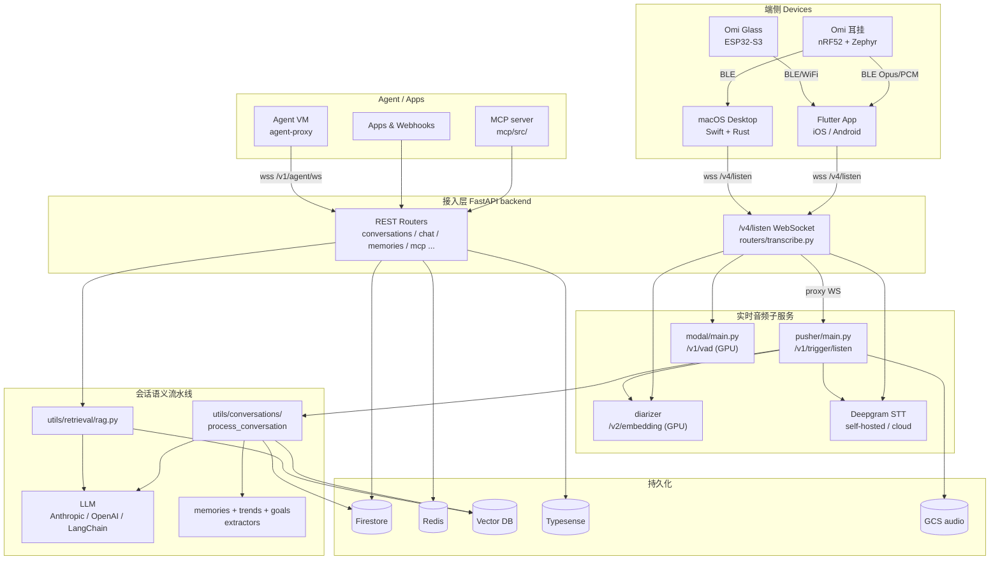
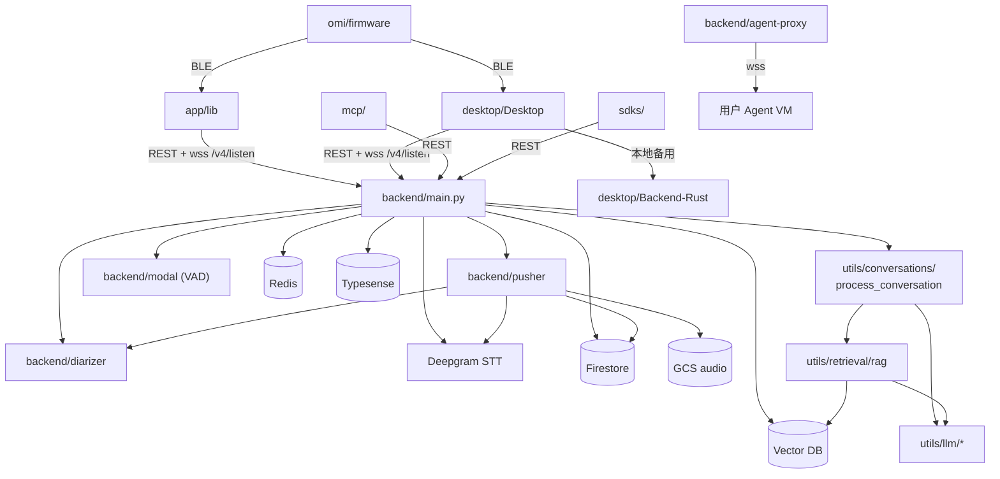
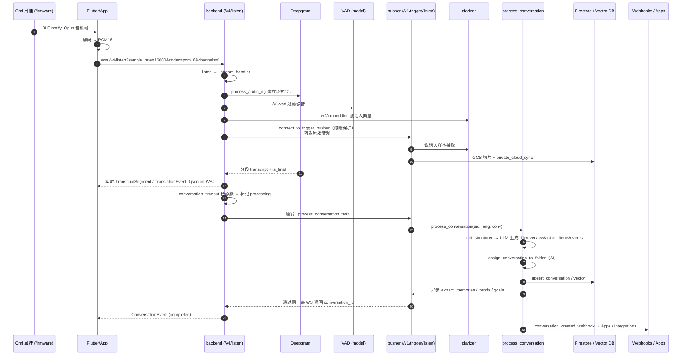
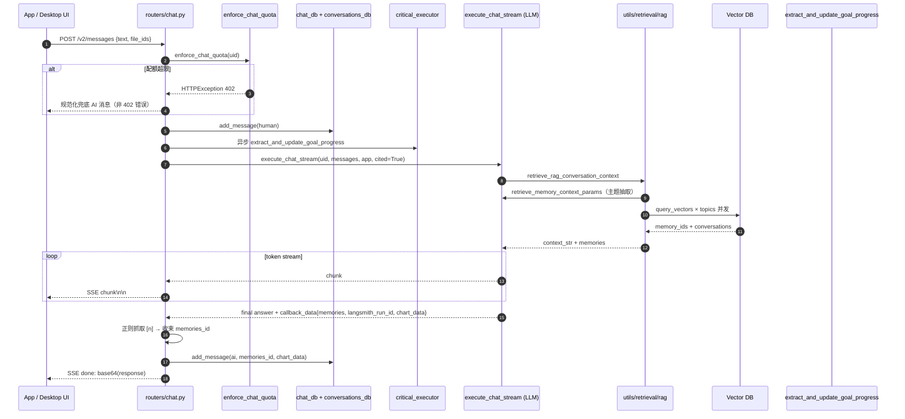

# omi 源码学习笔记

> 仓库地址：[omi](https://github.com/BasedHardware/omi)
> 学习日期：2026-04-21

---

> **以下为 AI 源码分析**
>
> ### 一句话概括
>
> omi 是一套开源的「第二大脑」可穿戴 AI 系统——BLE 耳挂硬件（nRF52 + Zephyr）与 ESP32-S3 眼镜负责持续采集音频/图像，Flutter/Swift 客户端把音频流到 FastAPI 后端，backend / pusher / diarizer / vad / deepgram 五个微服务协作完成实时转录、说话人识别、记忆抽取、RAG 聊天。
>
> ### 要点速览
>
> | 模块 | 职责 | 关键入口 |
> |------|------|---------|
> | `omi/firmware/` | 穿戴固件（nRF52、Zephyr RTOS），采 PDM 麦克风、Opus/Mu-law 编码、通过 BLE GATT 广播音频 | `omi/firmware/omi/src/main.c`、`devkit/src/transport.c` |
> | `app/` | Flutter 移动端，BLE 扫描/连接、音频上行 WebSocket、Provider 状态管理、全 l10n 33 语种 | `app/lib/main.dart`、`app/lib/providers/capture_provider.dart`、`app/lib/services/sockets/pure_socket.dart` |
> | `desktop/` | macOS 原生客户端（Swift + SwiftUI + Rust 子后端），系统音频捕获 + BLE + 屏幕录制 | `desktop/Desktop/Sources/OmiApp.swift`、`AudioCaptureService.swift`、`Backend-Rust/` |
> | `backend/` | FastAPI 主服务（`main.py`），REST + `/v4/listen` WebSocket，路由分 30+ 模块 | `backend/main.py`、`backend/routers/transcribe.py` |
> | `backend/pusher/` | 独立 FastAPI 进程，接收 backend 代理的音频，触发 conversation 生成和实时 webhook | `backend/pusher/main.py`、`backend/routers/pusher.py` |
> | `backend/diarizer/` | GPU 服务，`/v2/embedding` 产出说话人向量，由 backend + pusher 共同调用 | `backend/diarizer/main.py` |
> | `backend/modal/` | Modal.com 部署的 VAD + 说话人识别 + 通知 cron job | `backend/modal/main.py`、`modal/job.py` |
> | `backend/utils/conversations/` | 转录 → 结构化总结 → 向量入库 → 记忆抽取 → 行为抽取的流水线 | `process_conversation.py`、`utils/retrieval/rag.py` |
> | `mcp/` | Omi 的 MCP server，把 memories/conversations 暴露给外部 AI Agent | `mcp/src/mcp_server_omi/` |
> | `sdks/`、`plugins/`、`web/` | Python/Swift/RN SDK、第三方 app 插件样例、Next.js "AI personas" | - |

---

## 项目简介

omi 是 BasedHardware 开源的「可信第二大脑」——硬件（耳挂 Omi 设备 + 眼镜 Omi Glass）全天候捕获屏幕和对话音频，后端实时转录、按说话人分离、生成总结和行动项，并提供一个拥有完整历史的 AI 聊天。与纯软件的笔记/会议转录工具不同，omi 同时开源了固件设计、云端 pipeline、跨平台客户端（iOS/Android/macOS/Web）以及用于把记忆反向喂给其他 Agent 的 MCP server。目标用户是专业人士、开发者和硬件爱好者，官方声称已有 30 万+活跃用户。

## 技术栈

| 类别 | 技术 |
|------|------|
| 固件语言 | C（Zephyr RTOS、nRF Connect SDK，nRF52840；omiGlass 用 C + ESP-IDF/ESP32-S3） |
| 移动端 | Flutter 3.x（Dart >=3.0 <4.0），Provider 状态管理，`flutter_blue_plus`，`opus_dart`，Firebase Auth/Crashlytics/Messaging，Awesome Notifications |
| 桌面端 | Swift + SwiftUI（macOS 14+），Swift Package（`xcrun swift build`），内嵌 Rust 本地子后端（`desktop/Backend-Rust/`） |
| 后端语言 | Python 3.x（FastAPI + Uvicorn） |
| AI / STT | Deepgram（流式 + 离线）、Soniox、自研 VAD（Silero），`anthropic`>=0.52、`langchain`、`langsmith`、`langgraph`、OpenAI、Pinecone/向量库 |
| 数据 | Firebase Firestore（主库）、Redis（缓存 + pubsub）、Typesense（搜索）、GCS（音频存储） |
| 基础设施 | GKE + Helm charts（`backend/charts/{backend-listen,pusher,diarizer,vad,...}`），Modal.com（GPU/Cron），Docker，Codemagic CI |
| 构建工具 | `swift build`（desktop）、`flutter build` / `flutter gen-l10n`（app）、`pip` + `uv`（python）、`west`/CMake（固件） |
| 代码规范 | Python `black --line-length 120`，Dart `dart format --line-length 120`，C `clang-format`，pre-commit hook 在 `scripts/pre-commit` |
| 测试 | `pytest`（`backend/test.sh`、`backend/test-preflight.sh`），Dart `flutter_test`，Swift `xctest`，E2E 工具 `agent-flutter` / `agent-swift`（accessibility 驱动） |

## 目录结构

```text
omi/
├── omi/                        # 可穿戴设备固件
│   ├── firmware/
│   │   ├── devkit/src/         # DevKit v1/v2 nRF52 固件（mic、codec、transport、sdcard）
│   │   └── omi/src/            # 消费级 Omi 固件（main.c、imu、battery、haptic、led、codec）
│   └── hardware/               # PCB / 硬件设计
├── omiGlass/                   # ESP32-S3 眼镜固件 + React Native demo（App.tsx）
├── app/                        # Flutter 移动端（iOS/Android）
│   └── lib/
│       ├── main.dart           # 启动入口：Firebase + Provider 树 + 前台服务
│       ├── providers/          # Provider 状态层（capture/device/conversation/chat 等 30+）
│       ├── services/
│       │   ├── sockets/        # PureSocket / composite STT / on-device Whisper / Apple STT
│       │   ├── devices/        # 各硬件连接实现（omi/friend/frame/pendant/apple_watch）
│       │   ├── audio_sources/  # BLE 源 vs. 手机麦克风源
│       │   └── bridges/        # pigeon 原生桥
│       ├── backend/http/       # REST 客户端（auth headers、retry）
│       └── l10n/               # 33 语种 ARB
├── desktop/                    # macOS 客户端
│   ├── Desktop/Sources/        # Swift 主工程（300+ 源文件，SwiftUI + AppKit）
│   │   ├── OmiApp.swift        # @main 入口
│   │   ├── Audio/              # AudioCapture / AudioMixer / AudioCodecDecoder
│   │   ├── Bluetooth/          # BluetoothManager + Connections + Transports
│   │   ├── MainWindow/、Chat/  # SwiftUI 界面
│   │   └── Providers/、Stores/ # VM/ObservableObject 数据层
│   ├── Backend-Rust/           # 本地 Rust 子后端（STT fallback / 音频处理）
│   ├── Auth-Python/、acp-bridge/、agent-cloud/  # 配套子服务
│   └── run.sh / dev.sh         # 一键构建 + 后端 + tunnel + app
├── backend/                    # Python 主后端
│   ├── main.py                 # FastAPI 聚合 30+ router + middleware
│   ├── routers/                # API & WebSocket 端点（transcribe/conversations/chat/mcp/...）
│   ├── utils/
│   │   ├── stt/                # Deepgram streaming、pre-recorded、VAD gate、speaker embedding
│   │   ├── conversations/      # 会话后处理流水线
│   │   ├── llm/、llms/         # LLM 封装（chat/memories/trends/knowledge_graph/persona）
│   │   ├── retrieval/          # RAG + agentic + graph 检索、tools
│   │   └── pusher.py           # 到 pusher 子服务的熔断客户端
│   ├── database/               # Firestore / Redis / Vector DB / Typesense 适配
│   ├── models/                 # Pydantic schema（conversation/memory/user/structured）
│   ├── pusher/                 # 独立 FastAPI 进程，含 /v1/trigger/listen WebSocket
│   ├── diarizer/               # GPU 说话人向量服务
│   ├── modal/                  # Modal 部署的 VAD / speaker-id / 通知 cron
│   ├── agent-proxy/            # 用户 Agent VM 的 WebSocket 代理
│   └── charts/                 # 每个子服务一套 Helm chart
├── mcp/src/mcp_server_omi/     # Omi 的 MCP server（memories/conversations 工具）
├── sdks/                       # Python / Swift / React Native / Expo SDK
├── plugins/                    # 第三方 app 插件样例
├── web/                        # 官网 + personas 开源版（Next.js）
├── scripts/                    # pre-commit、release 辅助脚本
└── docs/                       # Mintlify 文档工程
```

每个顶层目录都是独立可部署单元——固件 / 移动端 / 桌面端 / 后端 / MCP / SDK 没有内部代码复用，接口层为 BLE GATT + HTTP/WebSocket + Firestore schema。

## 架构设计

### 整体架构

omi 是一套典型的「端-边-云-Agent」分层系统，沿音频→文本→语义→记忆→对话五个阶段推进：

1. **采集层**：Omi 耳挂 / Omi Glass 通过蓝牙向手机 / macOS 广播 Opus 编码的 PCM；desktop 也可直接捕获系统音频。
2. **接入层**：客户端通过 `wss://…/v4/listen?sample_rate=…&codec=…` 把音频帧 push 给 backend。
3. **实时链路**：`backend.main` 接收 WS → 调用 Deepgram/Soniox 流式 STT → 同时把原始音频代理到 `pusher` 子服务做离线持久化 + 实时 webhook；VAD / diarizer 做 speech gating 与说话人向量。
4. **会话合成**：用户停顿 `conversation_timeout` 秒后，`pusher._process_conversation_task` 触发 `utils/conversations/process_conversation.py::process_conversation`，用 LLM 生成标题/概述/action items/事件，并异步抽取 memories、trends、goals，向量入库。
5. **检索 / 对话层**：`routers/chat.py` 的 `/v2/messages` 流式 SSE 接口通过 `utils/retrieval/rag.py::retrieve_rag_conversation_context` 从向量库找相关 memories，交给 LLM 生成带引用的回答，并记录 LangSmith trace。
6. **外部暴露**：MCP server、Apps 插件系统、OAuth、webhooks、Integrations 把 memories / action items 同步到 Linear / Asana / Google Tasks / Apple Reminders / Slack 等。



### 核心模块

#### 1. `omi/firmware/` — 穿戴固件

- **职责**：驱动 PDM 麦克风、LED、震动、电池、NFC、SD 卡；通过 BLE GATT 广播音频与控制字；支持离线音频存储（SD 卡 / flash）。
- **关键文件**：
  - `omi/firmware/omi/src/main.c`：启动 `button / codec / feedback / haptic / led / battery / mic / transport`，注册 `mic_handler` 与 `codec_handler`。
  - `omi/firmware/devkit/src/transport.c`：GATT 服务定义，`audio_data_write_handler`、`audio_ccc_config_changed_handler`；MTU / packaging 管理。
  - `omi/firmware/devkit/src/codec.c`：mu-law / Opus 编码后把帧交给 `broadcast_audio_packets`。
- **对外接口**：BLE 音频 characteristic（特征值 UUID 定义在 Flutter `app/lib/services/devices/` 和 Swift `desktop/Desktop/Sources/Bluetooth/DeviceUUIDs.swift`）。

#### 2. `app/` — Flutter 移动端

- **职责**：BLE 扫描/连接多品牌设备（omi / friend / frame / pendant / plaud / fieldy / limitless / apple_watch / omiGlass），本地 Opus 解码，打开 `/v4/listen` WebSocket 上行音频；同时是 UI、Provider 状态层和通知中心。
- **关键文件**：
  - `app/lib/main.dart`：Firebase + Provider 树 + `flutter_foreground_task` 保活。
  - `app/lib/providers/capture_provider.dart`：音频采集总控，连接 socket、管理 transcript segments。
  - `app/lib/providers/device_provider.dart`：BLE 生命周期。
  - `app/lib/services/sockets/pure_socket.dart`：通用 WebSocket 抽象（`IPureSocket` + `IPureSocketListener`）。
  - `app/lib/services/sockets/composite_transcription_socket.dart`：在云 STT 与本地 Whisper / Apple STT 之间切换。
  - `app/lib/services/devices/omi_connection.dart` 等：每个硬件一个 `DeviceConnection` 子类。
  - `app/lib/l10n/`：33 语种 ARB，`context.l10n.keyName` 统一引用。
- **关系**：Provider 层监听 Service 层事件；Service 层通过 `backend/http/` 与 FastAPI 通信；BLE 音频最终进入 `capture_provider → pure_socket → backend /v4/listen`。

#### 3. `desktop/` — macOS 客户端

- **职责**：原生 SwiftUI 应用，承担系统音频捕获、BLE、屏幕录制、本地 Rust 子后端（离线 STT/备用 pipeline）、Agent 自动化（`DesktopAutomationBridge`、`agent-swift`）。
- **关键文件**：
  - `desktop/Desktop/Sources/OmiApp.swift`：`@main`。
  - `AudioCaptureService.swift` / `AudioMixer.swift` / `SystemAudioCaptureService.swift`：CoreAudio + ScreenCaptureKit 组合抓取。
  - `Bluetooth/BluetoothManager.swift`：与 Flutter 共享的 BLE 协议。
  - `TranscriptionService.swift` / `TranscriptionRetryService.swift`：上行 `/v4/listen` WS，失败重试 + 指数退避。
  - `ProactiveAssistants/`、`Rewind/`、`LiveNotes/`：桌面特色功能目录。
  - `desktop/Backend-Rust/`：Rust crate，本地服务，作为 backend 不可用时的备胎。
  - `desktop/run.sh`：构建 + tunnel + 后端 + app 一体化脚本；命名 bundle 规则在 `CLAUDE.md` 强制规定。

#### 4. `backend/main.py` + `routers/` — API 主入口

- **职责**：FastAPI 聚合所有 HTTP / WebSocket 路由，挂载 `TimeoutMiddleware` 与 `BYOKMiddleware`（让用户自带 API key），在 `SERVICE_ACCOUNT_JSON` 存在时用注入式凭据初始化 Firebase，shutdown 时 `close_all_clients()` 关闭全局 `httpx.AsyncClient` 池。
- **强制导入层级**（见 `backend/CLAUDE.md`）：`database/` → `utils/` → `routers/` → `main.py`，禁止上层向下层之外的方向 import，禁止函数内 import。
- **关键路由**：
  - `routers/transcribe.py:2824`：`@router.websocket("/v4/listen")` — 主音频入口，支持 `pcm8/16`、`opus`、`aac`、`lc3`，可指定 `channels`（含 `desktop` / `phone_call` 多声道映射，见 `build_channel_config`）。`web_listen_handler` 通过首条消息里的 Firebase Token 做 web 鉴权。
  - `routers/pusher.py:625`：`@router.websocket("/v1/trigger/listen")` — 内部接口，只给 backend 主服务调用。
  - `routers/conversations.py`：会话 CRUD + 重处理 + 搜索 + 合并。
  - `routers/chat.py:150`：`/v2/messages` — SSE 流式聊天，集成配额、BYOK、LangSmith 追踪、引用清洗。
  - `routers/mcp.py` / `routers/mcp_sse.py`：对外 MCP SSE 端点。
  - `routers/firmware.py`、`routers/updates.py`：固件 OTA。

#### 5. `backend/utils/stt/` — STT + VAD

- **职责**：封装 Deepgram 流式（`streaming.py`）与预录（`pre_recorded.py`）客户端，VAD gating 避免把静音送给 STT 烧钱，说话人向量提取（`speaker_embedding.py`）。
- **关键点**：
  - `streaming.py:168` 预创建两个全局 `DeepgramClient`（self-hosted + cloud）；`_deepgram_client_for_request` 根据 BYOK key 动态切换。
  - `safe_socket.py::SafeDeepgramSocket` 做 keepalive / 重连，`vad_gate.py::GatedDeepgramSocket` 把 VAD 结果包在最外层。
  - `process_audio_dg`（`routers/transcribe.py:959`、`:1001`）是 backend 侧唯一启动流式 STT 的工厂。

#### 6. `backend/pusher/` 与 `backend/diarizer/` — 独立子服务

- `pusher/main.py`：最小 FastAPI，只加载 `routers/pusher.py` + `routers/metrics.py`。`_process_conversation_task` 是它唯一的重头——从 backend 接收已完整的 transcript 后执行 `process_conversation`，结果通过同一条 WebSocket 回推到 backend。
- `diarizer/main.py`：GPU 服务，`/v2/embedding` 输入音频返回向量；backend / pusher 通过 `HOSTED_SPEAKER_EMBEDDING_API_URL` 访问。
- `modal/main.py`、`modal/vad_modal.py`、`modal/speech_profile_modal.py`：Modal.com serverless GPU，`/v1/vad` 与 `/v1/speaker-identification`。
- `agent-proxy/main.py`：GKE 上的 WS 代理，校验 Firebase ID Token，把前端请求代理到用户私有 IP 的 Agent VM（`ws://<ip>:8080/ws`），Omi 自身不保存 VM 凭据。

#### 7. `backend/utils/conversations/` + `utils/llm/` + `utils/retrieval/` — 语义流水线

- `process_conversation.py::process_conversation`（第 631 行）：后处理总调度——
  1. 读取 meeting 上下文（Firestore）、people（用户联系人）
  2. `_get_structured` 调用 LLM 产出 `Structured{title, overview, action_items, category, events}`
  3. `assign_conversation_to_folder`：AI 打标签到用户文件夹
  4. 异步推一堆任务到 `critical_executor`：`save_structured_vector`、`_extract_memories`、`_extract_trends`、`_save_action_items`、`_update_goal_progress`、`conversation_created_webhook`、`update_personas_async`
  5. `private_cloud_sync_enabled` 时把音频切片回存为 audio files
  6. 写回 Firestore `completed` 状态
- `utils/retrieval/rag.py::retrieve_rag_conversation_context`：先用 LLM 抽主题（`retrieve_memory_context_params`），再并发 `query_vectors`，按引用次数排序，必要时对长会话做 `chunk_extraction` 摘要压缩。
- `utils/llm/conversation_processing.py`：承载 `get_transcript_structure` / `extract_action_items` / `should_discard_conversation` 等 prompt。

#### 8. `mcp/`、`sdks/`、`plugins/` — 外部面

- `mcp/src/mcp_server_omi/`：暴露 `get_memories / create_memory / edit_memory / delete_memory / get_conversations / ...`，底层是对 backend REST 的包装。
- `sdks/python/`、`sdks/swift/`、`sdks/react-native/`、`sdks/omi-expo/`：面向第三方开发者。
- `plugins/`：Apps 插件样例（Slack / GitHub / OmiMentor 等）。

### 模块依赖关系



## 核心流程

### 流程一：实时音频转录 → 对话生成

从耳挂说话到 Firestore 里长出一条 `Conversation` 记录、触发 webhook 与行动项同步。



关键细节：
- backend 与 pusher 之间是**内网 WebSocket**，在 `utils/pusher.py::connect_to_trigger_pusher`（第 131 行）外包了熔断器 + 指数退避，状态机见 `routers/transcribe.py` 的 `PusherReconnectState`（`CONNECTED / RECONNECT_BACKOFF / DEGRADED / HALF_OPEN_PROBE`），超时与阈值都是常量，防止 pusher 抖动时打爆 backend。
- **多声道映射**：`desktop` 源把 `0x01 mic` 当用户声、`0x02 system_audio` 当远端声；`phone_call` 源 `mic / remote`。`mix_n_channel_buffers` 按样本级求和再 clamp，确保任意声道数都可收敛到单声道供 STT。
- **限流 / 免费额度**：`FAIR_USE_*` 常量、`get_remaining_transcription_seconds`、`FREEMIUM_THRESHOLD_SECONDS=180` 在即将耗尽时推送静默提醒，突破上限后降级到用户本地 STT（`FREEMIUM_ACTION_SETUP_ON_DEVICE_STT`）。
- **日志脱敏**：`utils/log_sanitizer.py` 的 `sanitize()`/`sanitize_pii()` 强制用在 `response.text`、用户文本上，`uid`、IP、状态码明文保留便于排查。这是 `CLAUDE.md` 显式安全规则。

### 流程二：基于 RAG 的 AI 聊天（/v2/messages 流式）

从用户提问到带 [引用] 的 SSE 流式回答，把所有相关 memories/conversations 拼进 prompt。



关键细节：
- **引用合并**：LLM 被要求在回答里写 `[n]`，路由层用 `re.findall(r'\[(\d+)\]', response)` 还原被引用的 memory，并把前 5 条挂回 `ai_message.memories`（`routers/chat.py:237`）。
- **BYOK**：若用户在 Settings 提供自己的 LLM key，`utils/byok.py::BYOKMiddleware` 在中间件层塞进 context，`set_byok_keys` / `get_byok_keys` 让下游 STT / LLM 客户端透明切换。
- **Usage tracking**：`with track_usage(uid, Features.CHAT)`（通过 `set_usage_context(uid, Features.CHAT)` + `reset_usage_context`）把一次流式会话内的 token 数绑定到 Feature，避免分散计费。
- **热文件附件**：带 `file_ids` 的消息必须先 `acquire_chat_session` 确保有 session，随后 `chat_db.get_chat_files` 把实际 `FileChat` 绑到 `Message.files`，clear 聊天时用 `FileChatTool(uid, session_id).cleanup()` 清理。
- **前端侧**：Flutter 走 `app/lib/services/agent_chat_service.dart`；desktop 走 `desktop/.../Chat/`。两端都按 `chunk.replace("\n","__CRLF__")` 解码换行，再在 `done:` 行解析 base64 的 `ResponseMessage` 以拿完整 metadata。

## 关键设计亮点

1. **按"服务边界"而非"代码仓库"拆分的多进程 FastAPI**
   - 问题：STT 是高连接、低 CPU，会话后处理是短连接、高 LLM token 开销，说话人识别又需要 GPU。把它们塞进一个进程必然互相牵制。
   - 实现：`backend/main.py`、`backend/pusher/main.py`、`backend/diarizer/main.py`、`backend/modal/main.py`、`backend/agent-proxy/main.py` 五个独立 FastAPI，各自带自己的 `Dockerfile`、`requirements.txt` 以及 `backend/charts/<name>/` Helm chart；调用关系强制单向（在 `backend/CLAUDE.md` 的 "Service Map" 段落被写成合同）。
   - 价值：任一子服务挂掉只让对应能力降级，不整体宕机；`utils/pusher.py` 里的熔断器与 `PusherReconnectState` 状态机确保 backend 在 pusher 异常时仍能出 transcript，最多牺牲持久化与 webhook。

2. **严格的导入层级 + 禁止函数内 import，以及 async 阻塞 linter**
   - 问题：Python + FastAPI 在 async handler 里一旦出现 `requests.*` 或 `time.sleep()` 就会偷偷阻塞事件循环，大流量下 socket 堵死。
   - 实现：`backend/CLAUDE.md` 把 `database → utils → routers → main` 写成硬规则；`utils/http_client.py` 负责构造全局 `httpx.AsyncClient` 池，shutdown 时统一 `close_all_clients`；专门的 `python scripts/lint_async_blockers.py` 在 pre-commit 扫描 `requests`、`Thread().start().join()`、`time.sleep` 等违禁模式。
   - 价值：写法约束被 CI 捕获，新人不容易悄悄引入偶发阻塞。

3. **BYOK（Bring Your Own Key）做成中间件而非业务分支**
   - 问题：既要向付费用户提供 Omi 托管能力，也要允许免费用户接入自己 LLM / STT key，业务层反复 `if byok else default` 会迅速失控。
   - 实现：`utils/byok.py::BYOKMiddleware` 把用户 key 从请求头解密并写进 `contextvars`，下游 STT（`_deepgram_client_for_request`）、LLM 和 pusher 都通过 `get_byok_key()` 读取；客户端跨 WebSocket 边界时 pusher 侧会 `set_byok_keys(byok_keys)` 再执行后处理。
   - 价值：业务代码对"用谁的 key"无感，同时把付费 / 免费成本路径解耦。

4. **RAG 主题化检索 + LLM 级别 chunk 压缩**
   - 问题：会话动辄几千 token，全量拼进 prompt 浪费上下文也降准确率。
   - 实现：`utils/retrieval/rag.py` 先让 LLM 从本次会话中抽出 ≤5 个 topic（`retrieve_memory_context_params`），对每个 topic 并发做向量检索（`critical_executor` + `futures.result()`），再对超过 250 token 的候选会话调用 `chunk_extraction`（`utils/llm/chat.py`）做面向 topic 的二次摘要。最终按命中次数排序、截断 top-10。
   - 价值：上下文精度与 token 成本同时受控，检索缺失时还有个 fallback（去掉时间范围再跑一次）。

5. **`CLAUDE.md` / `AGENTS.md` 作为机器可执行的协作合同**
   - 问题：多语言、多客户端、多 agent 并行开发时，协作规范（命名 bundle、l10n、脱敏、pre-commit hook、禁止 `flutterfire configure`）几乎没法靠 code review 保证。
   - 实现：顶层 `CLAUDE.md`（Claude）和 `AGENTS.md`（Codex）同步内容；`app/CLAUDE.md`、`backend/CLAUDE.md`、`desktop/CLAUDE.md` 做分域细化；`desktop/CLAUDE.md` 里还嵌了 `agent-swift` 验证脚本，`app/CLAUDE.md` 嵌 `agent-flutter` 脚本，构成"改完必须程序化验证"的闭环。
   - 价值：把"不让 agent 误操作 prod 桌面 app / 禁止覆盖生产 Firebase 配置 / l10n 必须全 33 语种"这类隐藏雷区变成可被 AI 读到的规则，显著压低事故概率。
