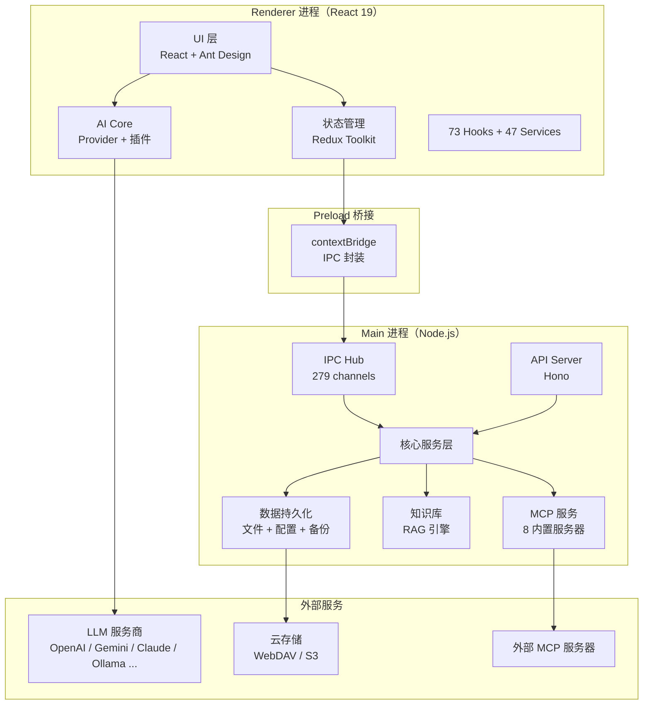
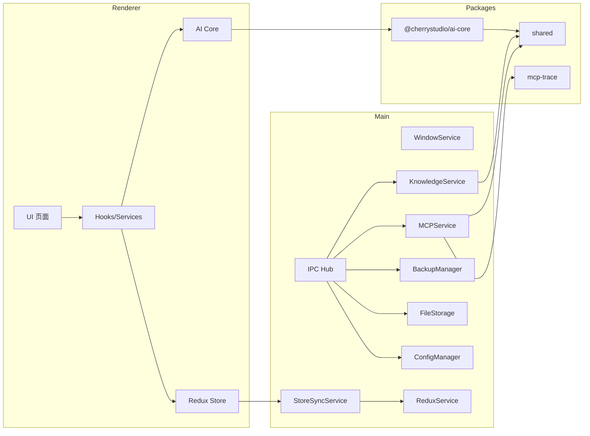
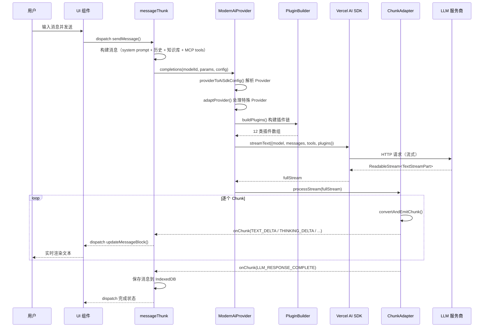
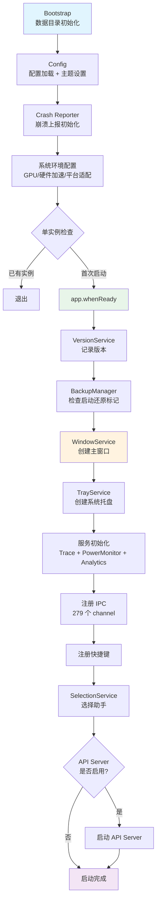

# Cherry Studio 源码学习笔记

> 仓库地址：[Cherry Studio](https://github.com/CherryHQ/cherry-studio)
> 学习日期：2026-03-22

---

> **以下为 AI 源码分析**
>
> ### 一句话概括
>
> Cherry Studio 是一个基于 Electron 的跨平台 AI 桌面客户端，通过插件化 Provider 抽象层统一接入 20+ LLM 服务商，支持 MCP 协议、知识库 RAG、多模型并行对话等高级功能。
>
> ### 要点速览
>
> | 核心模块 | 职责 | 关键文件 |
> |---------|------|---------|
> | Main 进程 | 应用生命周期、IPC 通信、系统服务 | `src/main/index.ts`, `src/main/ipc.ts` |
> | Renderer 进程 | UI 渲染、状态管理、用户交互 | `src/renderer/src/App.tsx`, `src/renderer/src/Router.tsx` |
> | AI Core | 统一的 LLM 调用抽象层、插件系统 | `packages/aiCore/src/`, `src/renderer/src/aiCore/` |
> | MCP 服务 | Model Context Protocol 服务器管理与工具调用 | `src/main/services/MCPService.ts`, `src/main/mcpServers/` |
> | 知识库 | RAG 检索增强生成（Embedding + 向量搜索） | `src/main/services/KnowledgeService.ts`, `src/main/knowledge/` |
> | 数据持久化 | 文件存储、配置管理、备份恢复 | `src/main/services/FileStorage.ts`, `src/main/services/BackupManager.ts` |
> | Preload 桥接 | 安全暴露主进程 API 给渲染进程 | `src/preload/index.ts` |

---

## 项目简介

Cherry Studio 是一个支持多 LLM 服务商的 AI 桌面客户端，可在 Windows、Mac 和 Linux 上运行。它解决了用户需要在多个 AI 服务之间切换的痛点，提供统一的对话界面接入 OpenAI、Gemini、Anthropic、Ollama 等 20+ 主流 LLM 服务商。核心价值在于：开箱即用的多模型管理、内置 300+ AI 助手预设、MCP 协议扩展能力、知识库 RAG 检索、以及完善的数据备份同步方案。项目基于 AGPL-3.0 开源协议，当前版本为 v1.8.2。

## 技术栈

| 类别 | 技术 |
|------|------|
| 语言 | TypeScript ~5.8.3 |
| 框架 | Electron 40.8.0 + React 19.2.0 |
| 构建工具 | electron-vite (rolldown-vite 7.3.0) |
| 依赖管理 | pnpm (monorepo) |
| 测试框架 | Vitest 3.2.4 + Playwright (E2E) |
| 状态管理 | Redux Toolkit 2.2.5 + redux-persist |
| UI 框架 | Ant Design 5.27.0 + styled-components 6.1.11 + TailwindCSS |
| 数据库 | Dexie (IndexedDB) + libsql (SQLite, 知识库向量存储) |
| AI SDK | Vercel AI SDK (@ai-sdk/*) |
| 代码规范 | Biome + ESLint + oxlint |

## 目录结构

```
cherry-studio/
├── src/
│   ├── main/                          # Electron 主进程
│   │   ├── index.ts                   # 应用入口，生命周期管理
│   │   ├── bootstrap.ts               # 最早期初始化（数据目录）
│   │   ├── ipc.ts                     # 279 个 IPC channel 注册
│   │   ├── config.ts                  # 全局配置初始化
│   │   ├── services/                  # 核心服务层（40+ 服务）
│   │   │   ├── WindowService.ts       # 窗口管理
│   │   │   ├── MCPService.ts          # MCP 协议服务
│   │   │   ├── KnowledgeService.ts    # 知识库 RAG 服务
│   │   │   ├── BackupManager.ts       # 备份恢复管理
│   │   │   ├── FileStorage.ts         # 文件存储管理
│   │   │   ├── ConfigManager.ts       # 配置管理（electron-store）
│   │   │   └── ...                    # 更多服务
│   │   ├── mcpServers/                # 内置 MCP 服务器
│   │   │   ├── factory.ts             # MCP 工厂
│   │   │   ├── memory.ts             # 知识图谱服务器
│   │   │   ├── hub/                   # Hub 聚合服务器
│   │   │   ├── browser/              # 浏览器自动化
│   │   │   └── ...                    # 更多内置服务器
│   │   ├── knowledge/                 # 知识库核心（Embedding、Loader、Reranker）
│   │   ├── apiServer/                 # 内置 API 服务器（Hono）
│   │   └── utils/                     # 工具函数
│   ├── preload/
│   │   └── index.ts                   # Preload 脚本，contextBridge 桥接
│   └── renderer/
│       └── src/
│           ├── App.tsx                # React 应用入口
│           ├── Router.tsx             # 路由配置（12 个页面）
│           ├── aiCore/                # AI 对话核心（Provider + 插件）
│           ├── pages/                 # 页面组件
│           │   ├── home/             # 主聊天页面（核心）
│           │   ├── settings/         # 设置页面
│           │   ├── agents/           # Agent 管理
│           │   ├── knowledge/        # 知识库管理
│           │   └── ...               # 更多页面
│           ├── store/                 # Redux 状态管理（22 个 slice）
│           ├── hooks/                 # 73 个自定义 hooks
│           ├── services/              # 47 个前端服务
│           └── context/               # 6 个 Context Provider
├── packages/                          # Monorepo 子包
│   ├── aiCore/                        # AI 核心库（@cherrystudio/ai-core）
│   ├── ai-sdk-provider/              # 自定义 AI SDK Provider
│   ├── shared/                        # 共享类型和工具
│   ├── mcp-trace/                     # MCP 追踪工具
│   └── extension-table-plus/         # 表格扩展
├── resources/                         # 静态资源和脚本
├── build/                             # 构建资源
└── electron-builder.yml               # 打包配置
```

## 架构设计

### 整体架构

Cherry Studio 采用经典的 Electron 三层架构（Main Process + Preload + Renderer Process），结合 Monorepo 管理多个子包。Main 进程负责系统级服务（MCP、知识库、文件管理、备份），Renderer 进程负责 UI 渲染和用户交互，Preload 脚本通过 `contextBridge` 安全桥接两端。AI 对话核心基于 Vercel AI SDK，通过自研的插件系统实现对 20+ LLM 服务商的统一抽象。



### 核心模块

#### 1. AI Core（AI 对话核心）

**职责**：统一封装多 LLM 服务商的对话调用，提供流式响应、插件扩展、工具调用等能力。

**核心文件**：
- `src/renderer/src/aiCore/index_new.ts` — ModernAiProvider，新版统一入口
- `src/renderer/src/aiCore/chunk/AiSdkToChunkAdapter.ts` — 流式 Chunk 适配器
- `packages/aiCore/src/core/providers/` — Provider 配置工厂
- `packages/aiCore/src/core/plugins/` — 插件引擎（PluginEngine）

**关键接口**：
- `ModernAiProvider.completions()` — 对话请求入口
- `PluginBuilder.buildPlugins()` — 动态构建插件链（12 类内置插件）
- `AiSdkToChunkAdapter.processStream()` — AI SDK 流转 Cherry Studio Chunk
- `ProviderConfigFactory.fromProvider()` — Provider 配置构建

**Provider 三层映射机制**：
1. 静态映射（gemini→google, grok→xai 等）
2. Provider 配置工厂（URL 标准化、认证适配）
3. AI SDK Provider ID 解析（别名、fallback）

#### 2. Main 进程服务层

**职责**：管理应用生命周期、系统级服务、IPC 通信。

**核心文件**：
- `src/main/index.ts` — 应用入口，启动流程编排
- `src/main/ipc.ts` — 279 个 IPC channel 注册
- `src/main/services/WindowService.ts` — 主窗口 + Mini 窗口管理

**关键服务**（40+ 服务）：
- `ConfigManager` — 基于 electron-store 的配置管理
- `WindowService` — 窗口创建、状态持久化、崩溃恢复
- `TrayService` — 系统托盘
- `AppUpdater` — 自动更新
- `ProxyManager` — 代理配置
- `ShortcutService` — 全局快捷键
- `SelectionService` — 选择助手工具栏

#### 3. MCP 服务

**职责**：实现 Model Context Protocol，管理内置和外部 MCP 服务器的生命周期、工具调用。

**核心文件**：
- `src/main/services/MCPService.ts` — MCP 客户端管理（连接池 + 缓存）
- `src/main/mcpServers/factory.ts` — 内置服务器工厂

**8 个内置 MCP 服务器**：

| 服务器 | 职责 | Transport |
|--------|------|-----------|
| Memory | 知识图谱（Entity-Relation） | InMemory |
| Sequential Thinking | 思维链推理 | InMemory |
| Browser | 浏览器自动化（CDP） | InMemory |
| Fetch | 网络内容获取 | InMemory |
| FileSystem | 文件系统操作 | InMemory |
| Hub | 聚合所有工具的 meta 服务器 | InMemory |
| Brave Search | 网络搜索 | InMemory |
| Python | Python 代码执行（Pyodide） | InMemory |

#### 4. 知识库（RAG）

**职责**：文档向量化、存储和语义检索。

**核心文件**：
- `src/main/services/KnowledgeService.ts` — 知识库管理（任务队列 + 工作负载均衡）
- `src/main/knowledge/embedjs/` — Embedding 和 Loader
- `src/main/knowledge/reranker/` — 检索结果重排

**支持的数据源**：PDF、Word、Excel、EPUB、URL、Sitemap、Note、HTML、JSON 等。

#### 5. 数据持久化

**职责**：多层数据存储和云同步。

**核心文件**：
- `src/main/services/FileStorage.ts` — 文件存储（2037 行）
- `src/main/services/BackupManager.ts` — 备份恢复（1262 行）
- `src/main/services/WebDav.ts` — WebDAV 同步
- `src/main/services/S3Storage.ts` — S3 兼容存储

**三层存储方案**：
1. ConfigManager（electron-store）— 应用配置
2. IndexedDB + Local Storage — 结构化业务数据
3. FileStorage — 文件和目录管理

#### 6. Renderer 状态管理

**职责**：全局状态管理和跨窗口同步。

**核心文件**：
- `src/renderer/src/store/index.ts` — Redux 根配置
- `src/renderer/src/store/thunk/messageThunk.ts` — 消息业务逻辑（71KB）

**22 个 Redux Slice**：assistants、settings、llm、runtime、messages、messageBlocks、tabs、mcp、knowledge、memory 等。

### 模块依赖关系



## 核心流程

### 流程一：AI 对话请求（流式响应）

这是 Cherry Studio 最核心的业务流程，从用户输入到模型回复的完整调用链。



**关键逻辑说明**：

1. **消息构建**：messageThunk 负责组装完整的请求参数，包括 system prompt、对话历史、知识库检索结果、MCP 工具定义等
2. **Provider 解析**：ModernAiProvider 通过三层映射将 Cherry Studio 的 Provider 配置转换为 AI SDK 格式，支持 URL 标准化和认证适配
3. **插件链**：PluginBuilder 根据当前上下文动态构建 12 类插件（PDF 兼容、推理提取、流式模拟、缓存控制、Web 搜索等）
4. **流式转换**：AiSdkToChunkAdapter 将 AI SDK 的 TextStreamPart 逐个转换为 Cherry Studio 的 ChunkType，支持文本增量、思考过程、工具调用、图像生成等
5. **时序统计**：记录 `time_first_token_millsec` 和 `time_completion_millsec`，用于性能监控

### 流程二：应用启动流程

Cherry Studio 的启动流程分为多个阶段，确保服务有序初始化。



**关键阶段说明**：

1. **Bootstrap 阶段**（Import 时立即执行）：初始化应用数据目录，Windows 上处理被占用的目录文件
2. **App Ready 前**：配置 Crash Reporter、禁用硬件加速（如配置）、设置 GPU 优化标志
3. **单实例锁**：`app.requestSingleInstanceLock()` 确保只有一个实例运行
4. **App Ready 后**：依次执行版本记录→备份还原检查→窗口创建→服务初始化→IPC 注册
5. **异步任务**：API Server 启动使用 `runAsyncFunction()`，不阻塞主流程
6. **生命周期事件**：监听 `before-quit`（设置退出标志）、`will-quit`（清理 MCP/OVMS/API Server）

## 关键设计亮点

### 1. 插件化 AI Provider 抽象

**解决的问题**：统一接入 20+ LLM 服务商（OpenAI、Gemini、Anthropic、Ollama 等），每个服务商有不同的 API 格式、认证方式和特殊参数。

**实现方式**：
- **三层 Provider 映射**：静态映射 → Provider 配置工厂 → AI SDK Provider ID 解析（`packages/aiCore/src/core/providers/`）
- **12 类内置插件**：通过 `PluginBuilder` 动态组合插件链，每个插件可在请求前/后拦截和转换参数
- **PluginEngine 执行引擎**：支持 `enforce: 'pre'/'post'` 执行顺序、`transformStream` 流转换、递归调用

**为什么这样设计**：将 Provider 差异封装在配置层和插件层，新增 Provider 只需添加配置映射和少量适配代码，无需修改核心流程。

### 2. 流式 Chunk 适配器

**解决的问题**：AI SDK 的 `TextStreamPart` 类型与 Cherry Studio 的 UI 渲染需求不匹配，需要统一的流式数据格式。

**实现方式**：`AiSdkToChunkAdapter`（`src/renderer/src/aiCore/chunk/AiSdkToChunkAdapter.ts`）逐个读取 AI SDK fullStream，转换为 15+ 种 ChunkType（TEXT_DELTA、THINKING_DELTA、TOOL_CALL、IMAGE_COMPLETE 等），并处理文本累积策略（增量 vs 替换）。

**为什么这样设计**：解耦了 AI SDK 和 UI 渲染层，使得 UI 组件只需关心 ChunkType 而不需要了解底层 SDK 细节。同时支持不同模型的文本传输差异（部分模型不支持增量 delta）。

### 3. MCP 连接池 + 缓存机制

**解决的问题**：MCP 服务器连接开销大，频繁的工具列表/资源查询需要缓存。

**实现方式**：
- **连接池**：`MCPService` 使用 `clients` Map 缓存连接，`pendingClients` Map 防止并发初始化（`src/main/services/MCPService.ts`）
- **智能 ping 检查**：复用连接前通过 1s 超时的 ping 验证有效性
- **多级 TTL 缓存**：工具列表 5 分钟、资源 30 分钟、Prompts 60 分钟
- **通知驱动失效**：监听 `ToolListChangedNotification` 等事件自动清除缓存

**为什么这样设计**：平衡了连接复用效率和数据新鲜度，避免了不必要的 MCP 重连开销。

### 4. 原子化备份恢复

**解决的问题**：Electron 应用的数据目录复杂（IndexedDB + Local Storage + 自定义文件），恢复过程中断可能导致数据不一致。

**实现方式**：
- **标记文件机制**：恢复时先写入 `.restore` 后缀的临时目录，启动时 `BackupManager.handleStartupRestore()` 检查标记并原子重命名（`src/main/services/BackupManager.ts`）
- **多目标同步**：支持 WebDAV、S3、LAN Transfer 和本地目录
- **失败隔离**：恢复失败自动清理标记，不影响应用启动

**为什么这样设计**：通过 "写临时目录 + 启动时原子替换" 的两阶段提交策略，确保恢复操作要么完全成功，要么不影响原有数据。

### 5. 跨窗口 Redux 状态同步

**解决的问题**：Cherry Studio 支持多窗口（主窗口 + Mini 快速助手），需要保持状态一致。

**实现方式**：
- `StoreSyncService`（`src/main/services/StoreSyncService.ts`）在主进程维护订阅列表
- 渲染进程 dispatch action 时，主进程接收并广播给所有其他窗口
- **防循环元数据**：同步 action 携带 `{ fromSync: true, source: windowId }`，接收方跳过来自自身的更新
- `ReduxService`（`src/main/services/ReduxService.ts`）允许主进程直接读写渲染进程 Redux Store

**为什么这样设计**：利用主进程作为状态同步中枢，避免渲染进程间直接通信的复杂性。`fromSync` 标记优雅地解决了事件循环问题。
