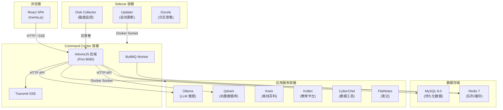
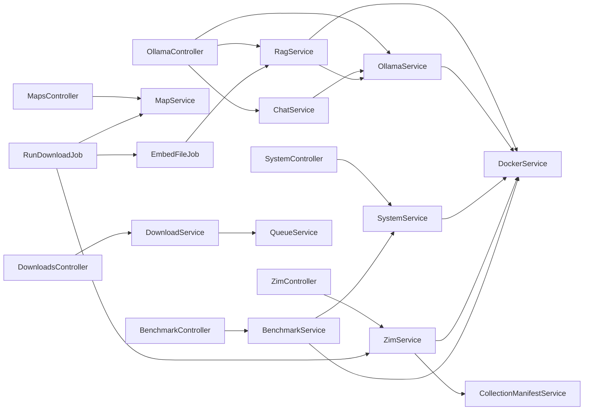
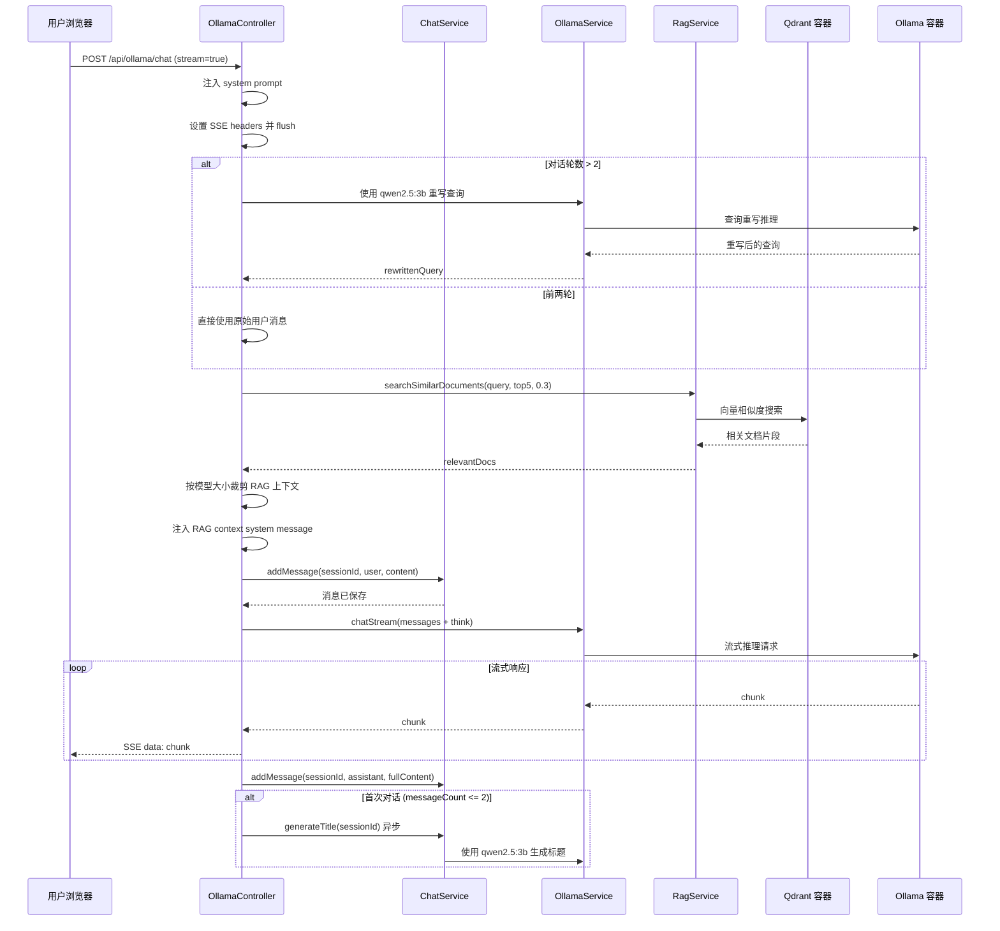
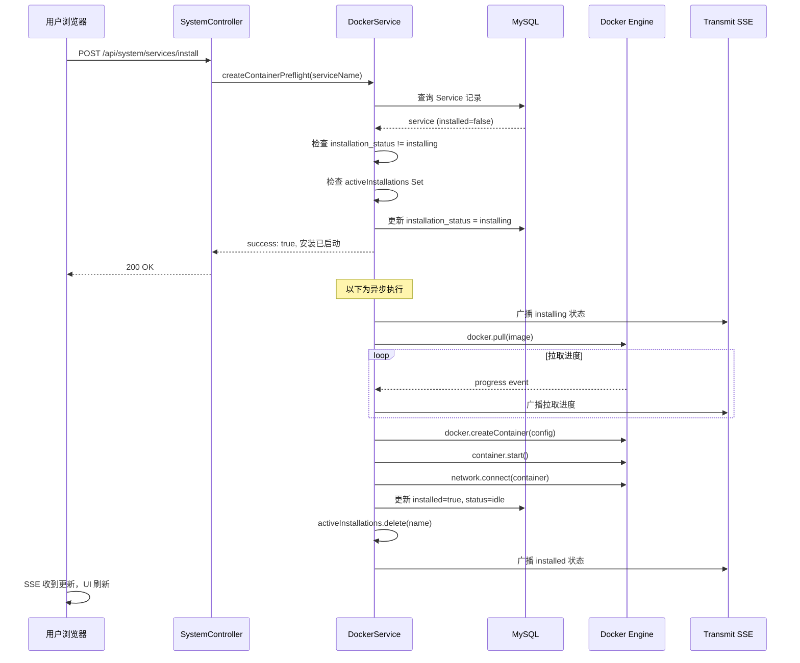

# project-nomad 源码学习笔记

> 仓库地址：[project-nomad](https://github.com/Crosstalk-Solutions/project-nomad)
> 学习日期：2026-03-29

---

> **以下为 AI 源码分析**
>
> ### 一句话概括
>
> Project N.O.M.A.D.（Node for Offline Media, Archives, and Data）是一个自托管的离线优先知识与教育服务器，通过 Docker 编排集成了 AI 聊天、离线百科、教育平台、离线地图等多种工具。
>
> ### 要点速览
>
> | 模块 | 职责 | 关键文件 |
> |------|------|----------|
> | Command Center (Admin) | Web 管理界面，编排所有容器化服务 | `admin/` 整个目录 |
> | Docker Service | 容器生命周期管理（安装/启停/更新） | `app/services/docker_service.ts` |
> | Ollama Service | 本地 LLM 模型管理与推理 | `app/services/ollama_service.ts` |
> | RAG Service | 知识库文档嵌入与语义搜索 | `app/services/rag_service.ts` |
> | ZIM Service | Kiwix 离线内容（Wikipedia 等）管理 | `app/services/zim_service.ts` |
> | Map Service | ProtoMaps 离线地图下载与服务 | `app/services/map_service.ts` |
> | Queue System | BullMQ 异步任务队列（下载/嵌入/基准测试） | `app/services/queue_service.ts`, `app/jobs/` |
> | Benchmark Service | 硬件评测与社区排行榜 | `app/services/benchmark_service.ts` |
> | Frontend (Inertia/React) | React SPA 前端，通过 Inertia.js 与后端桥接 | `inertia/` 整个目录 |

---

## 项目简介

Project N.O.M.A.D. 是一个面向离线场景的自托管知识服务器。它的核心价值在于：将 AI 聊天（Ollama + Qdrant RAG）、离线百科（Kiwix）、教育平台（Kolibri）、离线地图（ProtoMaps）、数据工具（CyberChef）、笔记（FlatNotes）等多种开源工具统一到一个管理平台（"Command Center"）下，通过 Docker 容器编排实现一键安装、配置和更新。用户只需一台 Debian 设备和一次联网安装，之后即可完全离线使用所有功能——适用于应急准备、偏远地区教育、野外考察等断网场景。

## 技术栈

| 类别 | 技术 |
|------|------|
| 语言 | TypeScript (全栈) |
| 后端框架 | AdonisJS 6 (Node.js) |
| 前端框架 | React 19 + Inertia.js |
| UI 样式 | Tailwind CSS 4 |
| 数据库 | MySQL 8.0 (Lucid ORM) |
| 队列系统 | BullMQ + Redis 7 |
| 实时通信 | AdonisJS Transmit (SSE) |
| 容器编排 | Docker (Dockerode SDK) |
| AI 推理 | Ollama (本地 LLM) |
| 向量数据库 | Qdrant (RAG 语义搜索) |
| 构建工具 | Vite 6, SWC |
| 依赖管理 | npm |
| 测试框架 | Japa |

## 目录结构

```
project-nomad/
├── admin/                          # Command Center 应用（核心）
│   ├── app/
│   │   ├── controllers/            # HTTP 控制器（14 个）
│   │   ├── services/               # 业务服务层（16 个）
│   │   ├── models/                 # Lucid ORM 数据模型
│   │   ├── jobs/                   # BullMQ 异步任务
│   │   ├── middleware/             # HTTP 中间件
│   │   ├── validators/             # VineJS 请求验证
│   │   ├── exceptions/             # 异常处理
│   │   └── utils/                  # 工具函数
│   ├── inertia/                    # React 前端
│   │   ├── app/                    # 应用入口 (app.tsx)
│   │   ├── pages/                  # 页面组件
│   │   ├── components/             # 公共组件
│   │   ├── layouts/                # 布局组件
│   │   ├── hooks/                  # 自定义 Hooks
│   │   ├── lib/                    # 前端工具库
│   │   ├── providers/              # Context Provider
│   │   └── context/                # React Context 定义
│   ├── config/                     # AdonisJS 配置
│   ├── constants/                  # 常量定义
│   ├── database/
│   │   ├── migrations/             # 数据库迁移
│   │   └── seeders/                # 种子数据
│   ├── types/                      # TypeScript 类型定义
│   ├── start/                      # 启动文件（路由/内核/环境）
│   ├── commands/                   # Ace CLI 命令
│   └── providers/                  # 自定义服务提供者
├── install/                        # 安装/更新/卸载脚本
│   ├── install_nomad.sh            # 一键安装脚本
│   ├── management_compose.yaml     # Docker Compose 编排
│   ├── sidecar-updater/            # 自更新 Sidecar 容器
│   └── sidecar-disk-collector/     # 磁盘信息采集 Sidecar
├── collections/                    # 策划内容集合定义 (JSON)
├── Dockerfile                      # 多阶段构建 Docker 镜像
└── package.json                    # 项目版本管理 (semantic-release)
```

## 架构设计

### 整体架构

Project N.O.M.A.D. 采用**中心管理 + 容器编排**架构。Command Center 作为核心管理节点，通过 Docker Socket 直接控制宿主机上的所有容器化服务。架构分为三层：

1. **展示层**：React + Inertia.js SPA，通过 SSE (Transmit) 获取实时状态更新
2. **业务层**：AdonisJS 后端，包含服务编排、AI 推理代理、内容管理等核心逻辑
3. **基础设施层**：Docker 容器（Ollama / Kiwix / Qdrant / Kolibri 等）+ MySQL + Redis



### 核心模块

#### 1. DockerService — 容器生命周期管理

- **职责**：通过 Docker Socket 管理所有容器化服务的安装、启动、停止、重启、更新、卸载
- **核心文件**：`app/services/docker_service.ts`
- **关键方法**：
  - `affectContainer(serviceName, action)` — 控制容器启停
  - `getServicesStatus()` — 获取所有 `nomad_` 前缀容器的运行状态
  - `getServiceURL(serviceName)` — 解析服务的内部访问 URL
  - `createContainerPreflight(serviceName)` — 安装前检查 + 异步创建容器
- **设计特点**：使用 `Dockerode` SDK 直接操作 Docker Socket，支持 Linux 和 Windows（Docker Desktop）双平台；维护 `activeInstallations` Set 防止重复安装竞态

#### 2. OllamaService — LLM 模型管理

- **职责**：与 Ollama 容器通信，管理模型的下载/删除/列表查询/推理调用
- **核心文件**：`app/services/ollama_service.ts`
- **关键方法**：
  - `downloadModel(model)` — 流式下载模型并广播进度
  - `chat(chatRequest)` / `chatStream(chatRequest)` — 同步/流式 AI 对话
  - `getAvailableModels()` — 从 Nomad API 获取可用模型列表（带 24h 缓存）
  - `checkModelHasThinking(modelName)` — 检测模型是否支持 thinking 能力
- **依赖**：通过 `DockerService.getServiceURL()` 动态发现 Ollama 容器地址

#### 3. RagService — 知识库 RAG

- **职责**：文档上传、文本提取（PDF/图片 OCR/ZIM）、分块嵌入、语义搜索
- **核心文件**：`app/services/rag_service.ts`
- **关键技术**：
  - **向量存储**：Qdrant (Cosine 距离, 768 维 nomic-embed-text)
  - **文本分块**：`@chonkiejs/core` TokenChunker，按 1700 token 分块
  - **嵌入模型**：`nomic-embed-text:v1.5`，带 `search_document:` / `search_query:` 前缀
  - **PDF 处理**：`pdf-parse` + `pdf2pic` + `tesseract.js` (OCR)
  - **ZIM 处理**：`@openzim/libzim` + `ZIMExtractionService` 批量提取文章

#### 4. ChatService — 聊天会话管理

- **职责**：管理聊天会话的 CRUD 和消息存储，自动生成会话标题
- **核心文件**：`app/services/chat_service.ts`
- **设计特点**：
  - 使用轻量模型 (`qwen2.5:3b`) 自动生成会话标题和查询重写
  - 首次对话后异步生成标题，不阻塞响应
  - 提供 AI 生成的聊天建议（使用最大的已安装模型）

#### 5. SystemService — 系统信息与配置

- **职责**：系统硬件信息采集、服务状态同步、版本更新检查、KV 配置管理
- **核心文件**：`app/services/system_service.ts`
- **关键功能**：
  - GPU 检测：先查 Docker Runtime → nvidia-smi → si.graphics() 层层回退
  - 数据库与容器状态同步：`_syncContainersWithDatabase()` 确保 DB 记录与实际容器一致
  - 版本检查：GitHub Releases API + KVStore 缓存 + Early Access 支持

#### 6. QueueService + Jobs — 异步任务系统

- **职责**：管理 BullMQ 队列，处理长时间运行的下载、嵌入、基准测试任务
- **核心文件**：`app/services/queue_service.ts`, `app/jobs/*.ts`
- **队列列表**：
  - `downloads` — 文件下载（ZIM / 地图 / 基础资源）
  - `model-downloads` — Ollama 模型下载
  - `benchmarks` — 硬件基准测试
- **Job 类型**：
  - `RunDownloadJob` — 可恢复的文件下载，支持重试 (3次指数退避)
  - `DownloadModelJob` — Ollama 模型拉取
  - `EmbedFileJob` — 文档嵌入到 Qdrant
  - `RunBenchmarkJob` — 系统 + AI 性能测试

### 模块依赖关系



## 核心流程

### 流程一：AI 聊天（RAG 增强）

这是 N.O.M.A.D. 最核心的用户交互流程，涉及查询重写、知识库检索、流式推理等多个环节。



**关键设计决策**：
1. **自适应 RAG 上下文**：根据模型参数量动态调整注入的知识库上下文大小（1-3B 模型最多 1000 token，13B+ 不限制）
2. **查询重写**：前两轮直接使用原始消息，第三轮起用小模型重写查询以提高检索质量
3. **Thinking 支持**：自动检测模型是否支持 `thinking` 能力（如 DeepSeek-R1），启用更深度的推理

### 流程二：服务安装（Docker 容器创建）

N.O.M.A.D. 通过 Docker Socket 实现应用的一键安装，包括镜像拉取、容器创建、网络配置和状态同步。



**关键设计决策**：
1. **异步安装**：`createContainerPreflight()` 立即返回，实际安装在后台异步执行
2. **双重竞态保护**：数据库 `installation_status` + 内存 `activeInstallations` Set 双层防护
3. **SSE 实时通知**：通过 Transmit 广播安装进度，前端实时更新 UI
4. **失败清理**：`_cleanupFailedInstallation()` 确保失败后恢复干净状态

## 关键设计亮点

### 1. Docker Socket 直控 — 容器即服务

**解决的问题**：如何让一个 Web 应用管理同一台宿主机上的多个独立容器服务？

**实现方式**：Command Center 容器挂载宿主机的 `/var/run/docker.sock`，通过 `Dockerode` SDK 直接调用 Docker Engine API。每个可安装的服务在数据库 `services` 表中维护一条记录（含 `container_config` JSON），安装时根据配置动态创建容器。

**为什么这样设计**：避免了复杂的容器编排工具（如 K8s），保持单机部署的简洁性。`_syncContainersWithDatabase()` 在每次查询前同步容器实际状态和数据库记录，确保即使用户手动删除容器，UI 也能正确反映。

> 关键文件：`app/services/docker_service.ts`

### 2. 自适应 RAG 管线 — 小模型也能用

**解决的问题**：在资源受限的设备上（可能只有 1-3B 参数模型），如何让 RAG 有效工作而不溢出上下文窗口？

**实现方式**：`RAG_CONTEXT_LIMITS` 根据模型参数量定义三档上下文限制：
- 1-3B 模型：最多 2 条结果，1000 token
- 4-8B 模型：最多 4 条结果，2500 token
- 13B+ 模型：最多 5 条结果，不限 token

`OllamaController` 从模型名称中提取参数量（如 `llama3.2:3b` → 3B），动态裁剪 RAG 上下文。同时始终保留最相关的第一条结果。

**为什么这样设计**：N.O.M.A.D. 的核心场景是离线环境的低端硬件设备，必须适配从 1B 到 70B 的各种模型。固定的上下文大小会导致小模型被淹没或大模型未充分利用。

> 关键文件：`app/controllers/ollama_controller.ts`, `constants/ollama.ts`

### 3. 查询重写 + 语义搜索双阶段检索

**解决的问题**：多轮对话中，用户的后续问题往往缺乏上下文（如"它能持续多久？"），直接拿去做语义搜索效果很差。

**实现方式**：`OllamaController.rewriteQueryWithContext()` 在第三轮对话后启用，使用轻量模型 `qwen2.5:3b` 将用户的省略化问题重写为完整的独立查询。前两轮跳过重写以减少延迟。重写后的查询再送入 Qdrant 做向量搜索。

**为什么这样设计**：两阶段设计在检索质量和延迟之间取得平衡。前两轮对话问题通常完整无需重写；后续轮次引入重写开销（~100ms on 3B model）换取显著更好的检索结果。

> 关键文件：`app/controllers/ollama_controller.ts`

### 4. Sidecar 架构 — 容器自更新 + 磁盘监控

**解决的问题**：Docker 容器如何更新自身？容器内如何获取宿主机的真实磁盘信息？

**实现方式**：
- **Updater Sidecar**：独立容器 `nomad_updater` 挂载 Docker Socket 和 compose 文件目录，当 Command Center 请求更新时，由 Sidecar 拉取新镜像并重建容器（避免"自己重启自己"的死锁）
- **Disk Collector Sidecar**：`nomad_disk_collector` 以只读方式挂载宿主机 `/` 文件系统，定期采集磁盘信息写入共享卷 `nomad-disk-info.json`，Command Center 读取该文件展示真实磁盘用量

**为什么这样设计**：容器隔离使其无法直接访问宿主机信息或操控自身。Sidecar 模式将特权操作隔离到最小权限容器中，既解决了功能需求又遵循安全最小化原则。

> 关键文件：`install/management_compose.yaml`, `install/sidecar-updater/`, `install/sidecar-disk-collector/`

### 5. Inertia.js 桥接 — 全栈 TypeScript 无 API 边界

**解决的问题**：如何在保持 SPA 体验的同时避免前后端数据契约的维护负担？

**实现方式**：使用 Inertia.js 将 AdonisJS 后端和 React 前端桥接。控制器直接返回 `inertia.render('page', { data })` 传递类型化 props，无需手写 REST API + 前端 fetch 层。SSE (Transmit) 用于实时数据推送（下载进度、安装状态、聊天流式响应等），`@tanstack/react-query` 管理客户端缓存和异步状态。

**为什么这样设计**：N.O.M.A.D. 是一个管理型应用，页面数量有限但数据流转复杂。Inertia.js 消除了前后端分离架构中最大的开销——API 层的设计与维护——同时保留了 React 的组件化优势和 SPA 路由体验。

> 关键文件：`inertia/app/app.tsx`, `config/inertia.ts`, `admin/views/inertia_layout.edge`
