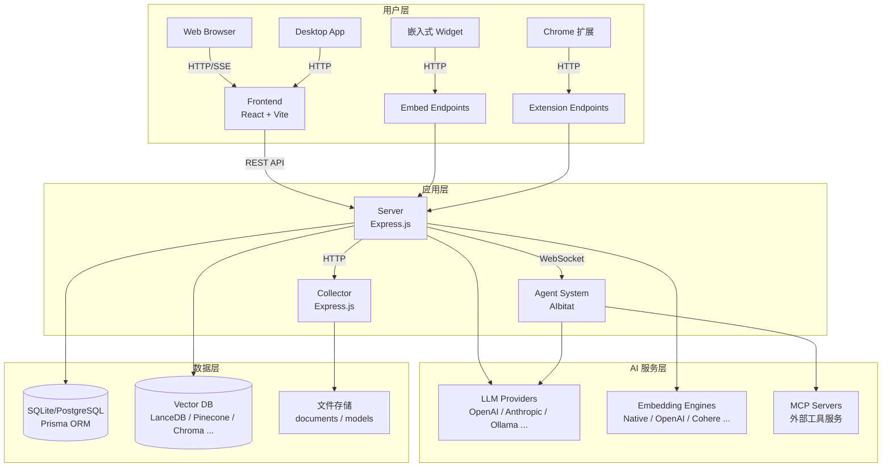
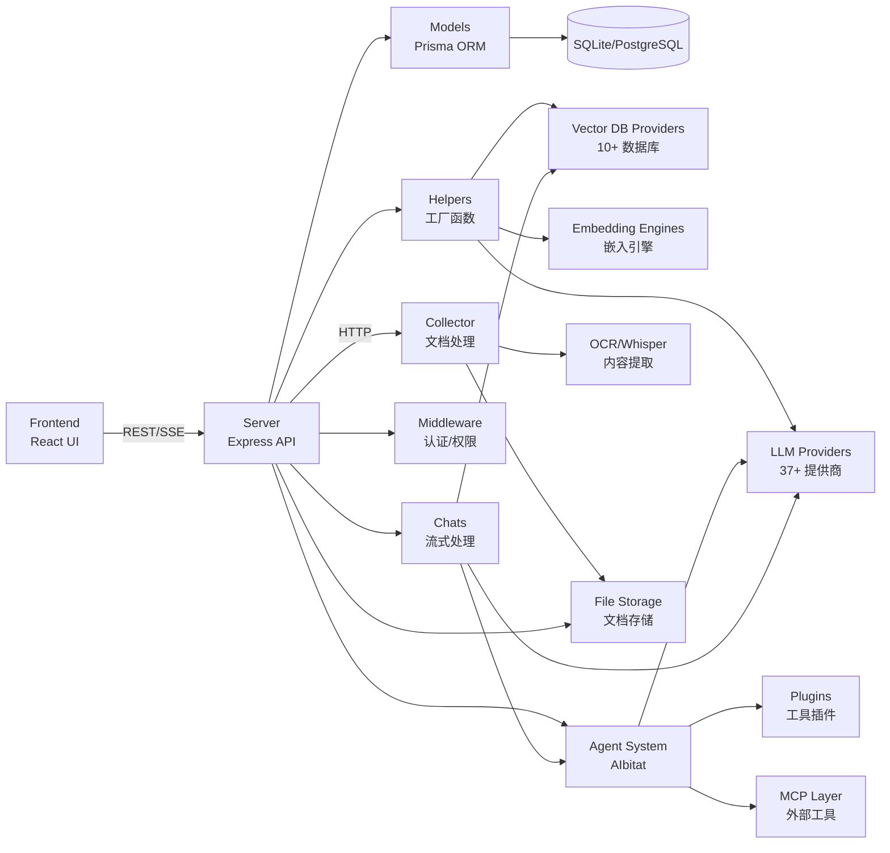
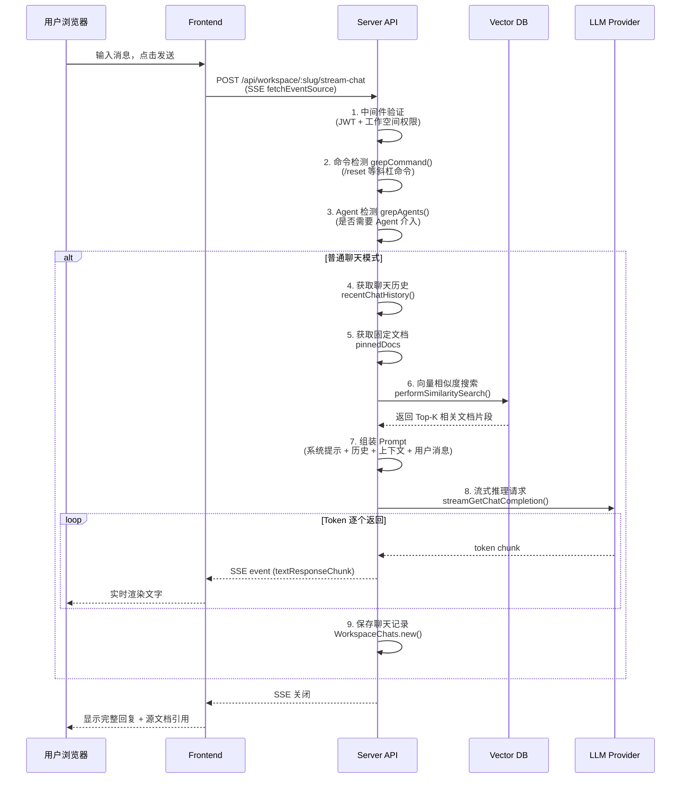
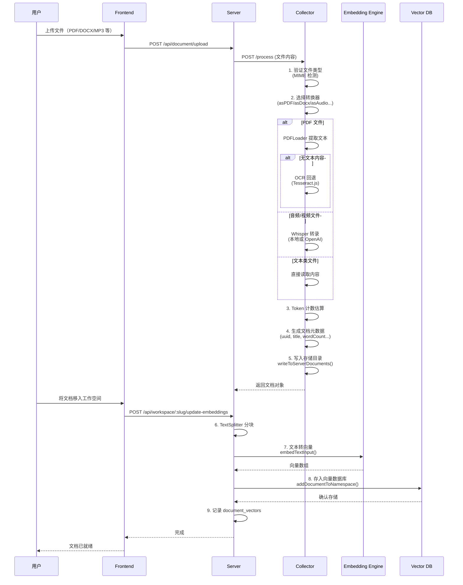

# AnythingLLM 源码学习笔记

> 仓库地址：[AnythingLLM](https://github.com/Mintplex-Labs/anything-llm)
> 学习日期：2026-03-22

---

> **以下为 AI 源码分析**
>
> ### 一句话概括
>
> AnythingLLM 是一个全功能的私有化 AI 应用平台，支持 37+ LLM 提供商和 10+ 向量数据库，集成 RAG 检索、Agent 系统和 MCP 协议，让用户在本地或云端快速构建一个可与文档对话的私有 ChatGPT。
>
> ### 要点速览
>
> | 核心模块 | 职责 | 关键文件/目录 |
> |---------|------|-------------|
> | **server** | 后端 API 服务，处理聊天、向量检索、Agent 执行、用户权限 | `server/index.js`、`server/endpoints/`、`server/utils/` |
> | **frontend** | React 前端 UI，聊天界面、工作空间管理、设置面板 | `frontend/src/pages/`、`frontend/src/components/` |
> | **collector** | 文档收集与处理服务，支持 20+ 文件格式和多种数据源 | `collector/processSingleFile/`、`collector/extensions/` |
> | **docker** | Docker 构建与部署配置 | `docker/` |
> | **embed** | 可嵌入网页的聊天 Widget（子模块） | `embed/` |
> | **browser-extension** | Chrome 浏览器扩展（子模块） | `browser-extension/` |

---

## 项目简介

AnythingLLM 是由 Mintplex Labs 开发的开源一站式 AI 应用平台。它解决了企业和个人在搭建私有化 RAG（检索增强生成）系统时面临的复杂性问题——无需深入了解底层技术，只需简单配置即可连接喜欢的 LLM（本地或云端）、导入文档、开始对话。项目的核心价值在于：极低的部署门槛、高度可配置的多提供商支持、完善的多用户权限体系，以及内置的 Agent 系统和 MCP 协议兼容，真正做到开箱即用的私有 ChatGPT。

## 技术栈

| 类别 | 技术 |
|------|------|
| 语言 | JavaScript (Node.js 18+) |
| 框架 | Express.js (后端)、React 18 + Vite 4 (前端) |
| 构建工具 | Vite (前端)、nodemon (后端开发)、Docker (生产部署) |
| 依赖管理 | Yarn |
| 测试框架 | Jest |
| 数据库 | SQLite (默认) / PostgreSQL，Prisma ORM |
| 样式 | TailwindCSS 3 |
| 国际化 | react-i18next |

## 目录结构

```
anything-llm/
├── server/                     # 后端 API 服务 (Express.js)
│   ├── index.js                #   应用入口，路由注册
│   ├── endpoints/              #   API 端点层（24 个模块）
│   │   ├── chat.js             #     聊天流式响应
│   │   ├── workspaces.js       #     工作空间 CRUD
│   │   ├── system.js           #     系统管理
│   │   ├── agentWebsocket.js   #     Agent WebSocket 通信
│   │   ├── agentFlows.js       #     Agent 流程编排
│   │   ├── mcpServers.js       #     MCP 服务器管理
│   │   └── api/                #     对外开发者 API
│   ├── models/                 #   数据模型层（30 个模型）
│   ├── utils/                  #   工具层
│   │   ├── AiProviders/        #     37+ LLM 提供商适配
│   │   ├── vectorDbProviders/  #     10+ 向量数据库适配
│   │   ├── agents/             #     AIbitat Agent 编排引擎
│   │   ├── chats/              #     聊天处理（流式、命令、Agent）
│   │   ├── helpers/            #     工厂函数、Token 管理
│   │   ├── middleware/         #     认证、权限中间件
│   │   ├── EmbeddingEngines/   #     嵌入向量引擎
│   │   ├── MCP/                #     Model Context Protocol 兼容层
│   │   └── boot/               #     HTTP/HTTPS 启动逻辑
│   ├── prisma/                 #   数据库 Schema 和迁移
│   └── storage/                #   文件存储（向量缓存、模型等）
├── frontend/                   # 前端 UI (React + Vite)
│   ├── src/
│   │   ├── main.jsx            #   路由配置入口
│   │   ├── pages/              #   页面组件
│   │   │   ├── WorkspaceChat/  #     聊天主界面
│   │   │   └── GeneralSettings/#     设置页面集
│   │   ├── components/         #   共享组件
│   │   │   ├── WorkspaceChat/  #     聊天容器、消息列表
│   │   │   ├── Sidebar/        #     侧边栏导航
│   │   │   └── Modals/         #     各类弹窗
│   │   ├── models/             #   API 调用层
│   │   │   ├── system.js       #     系统 API
│   │   │   └── workspace.js    #     工作空间和聊天 API
│   │   ├── hooks/              #   自定义 React Hooks
│   │   └── locales/            #   多语言文件
│   └── vite.config.js          #   Vite 构建配置（含 WASM 支持）
├── collector/                  # 文档收集器服务 (Express.js, 端口 8888)
│   ├── index.js                #   入口，API 路由
│   ├── processSingleFile/      #   单文件处理（PDF、DOCX、音频等）
│   ├── processLink/            #   URL/网页处理
│   ├── extensions/             #   扩展加载器（GitHub、YouTube 等）
│   └── utils/                  #   OCR、Whisper、加密、Token 化
├── docker/                     # Docker 构建配置
├── cloud-deployments/          # 云部署模板（AWS、GCP、DO 等）
├── embed/                      # 嵌入式聊天 Widget（子模块）
├── browser-extension/          # Chrome 扩展（子模块）
└── package.json                # Monorepo 根配置
```

## 架构设计

### 整体架构

AnythingLLM 采用经典的 **Monorepo 三层微服务架构**：前端 UI 负责用户交互，后端 Server 作为核心枢纽处理业务逻辑和 AI 推理，Collector 服务专职文档收集与预处理。三个服务通过 HTTP API 通信，Server 作为中心节点同时对接外部 LLM 提供商、向量数据库和 MCP 服务器。

架构的核心设计理念是 **"可插拔"**：通过工厂模式和策略模式，LLM 提供商、向量数据库、Embedding 引擎都可以热切换，用户只需修改环境变量即可完成迁移。



### 核心模块

#### 1. Server - 后端 API 服务

**职责**：整个系统的核心枢纽，处理用户认证、聊天推理、向量检索、Agent 执行、文档管理、系统配置等所有核心业务逻辑。

**核心文件**：
- `server/index.js` — 应用入口，注册 24 个端点模块
- `server/endpoints/chat.js` — 聊天流式响应端点
- `server/utils/chats/stream.js` — `streamChatWithWorkspace()` 聊天核心逻辑
- `server/utils/helpers/index.js` — `getLLMProvider()`、`getVectorDbClass()` 工厂函数
- `server/utils/agents/index.js` — `AgentHandler` Agent 主控制器

**关键接口/函数**：
- `streamChatWithWorkspace(response, workspace, message, chatMode, user, thread)` — 流式聊天主函数，串联命令解析、Agent 检测、向量检索、LLM 推理
- `getLLMProvider({ provider, model })` — LLM 提供商工厂，37 个 switch case
- `getVectorDbClass()` — 向量数据库工厂，10 个 switch case
- `AgentHandler.init()` / `createAIbitat()` / `startAgentCluster()` — Agent 执行生命周期

**与其他模块的关系**：向前端提供 REST API，调用 Collector 处理文档，对接外部 LLM 和向量数据库。

#### 2. Frontend - 前端 UI

**职责**：提供用户交互界面，包括聊天界面、工作空间管理、系统设置、Agent 构建器等。

**核心文件**：
- `frontend/src/main.jsx` — 路由配置，定义公开/私有/管理员路由
- `frontend/src/models/workspace.js` — 工作空间 API 层，`streamChat()` 使用 SSE
- `frontend/src/models/system.js` — 系统 API 层
- `frontend/src/AuthContext.jsx` — 认证状态管理（JWT Token）
- `frontend/src/pages/WorkspaceChat/index.jsx` — 聊天主页面
- `frontend/src/components/Sidebar/index.jsx` — 侧边栏导航

**关键接口/函数**：
- `Workspace.streamChat({ slug }, message, handleChat, attachments)` — 使用 `fetchEventSource` 实现 SSE 流式聊天
- `System.checkAuth(token)` — 认证检查（5 分钟缓存）
- 路由守卫：`PrivateRoute`（登录）、`AdminRoute`（管理员）、`ManagerRoute`（经理）

**与其他模块的关系**：通过 REST API 和 SSE 与 Server 通信，不直接访问 Collector 或数据库。

#### 3. Collector - 文档收集器

**职责**：接收前端上传的文件或 URL，解析为结构化文档，支持 20+ 种文件格式和多种外部数据源。

**核心文件**：
- `collector/index.js` — 入口，端口 8888，注册处理端点
- `collector/processSingleFile/index.js` — 文件处理主入口，动态加载转换器
- `collector/processLink/index.js` — URL/网页处理
- `collector/extensions/index.js` — 扩展加载器（GitHub、YouTube、Confluence 等）
- `collector/utils/constants.js` — 支持的文件类型和 MIME 映射

**关键接口/函数**：
- `POST /process` — 处理单个文件（自动选择转换器：`asTxt`、`asPDF`、`asDocx`、`asAudio` 等）
- `POST /process-link` — 处理 URL，使用 `scrapeGenericUrl()` 提取内容
- `POST /ext/:platform-repo` — 仓库加载器（GitHub/GitLab）
- OCR 回退：PDF 无文本时自动调用 Tesseract.js
- Whisper 转录：本地 `@xenova/transformers` 或 OpenAI API

**与其他模块的关系**：由 Server 调用，处理完的文档写入共享存储目录，Server 再将文档向量化入库。

#### 4. Agent 系统 (AIbitat)

**职责**：基于 AIbitat 编排引擎实现多轮 Agent 执行，支持工具链调用、MCP 集成和自定义插件。

**核心文件**：
- `server/utils/agents/index.js` — `AgentHandler` 主控制器（210 行）
- `server/utils/agents/aibitat/` — AIbitat 引擎核心
- `server/utils/agents/aibitat/plugins/` — 工具插件（chat-history、web-scraping、sql-agent 等）
- `server/utils/MCP/` — `MCPCompatibilityLayer` 单例，适配 MCP 服务器为 Agent 插件
- `server/utils/agentFlows/` — Agent 流程编排

**关键接口/函数**：
- `AgentHandler.init(uuid)` — 初始化 Agent 会话
- `AgentHandler.createAIbitat()` — 创建编排实例，加载插件和 MCP 工具
- `MCPCompatibilityLayer.convertServerToolsToPlugins()` — MCP 工具转 Agent 插件
- 通过 WebSocket `/agent-invocation/:uuid` 实时通信

**与其他模块的关系**：Agent 复用 LLM Provider 进行推理，通过插件访问向量数据库、外部 API、MCP 服务器等。

### 模块依赖关系



## 核心流程

### 流程一：用户聊天（RAG 流式响应）

这是 AnythingLLM 最核心的业务流程，从用户发送消息到收到 AI 回复的完整链路。



**关键逻辑说明**：
1. 前端使用 `@microsoft/fetch-event-source` 建立 SSE 连接，支持 `AbortController` 中断
2. 服务端 `streamChatWithWorkspace()` 是核心函数，依次执行命令解析 → Agent 检测 → 向量检索 → LLM 推理
3. Token 分配策略：历史消息 15%、系统提示 15%、用户消息+上下文 70%，自动压缩以适应上下文窗口
4. 向量检索使用工作空间配置的相似度阈值（默认 0.25）和 Top-N（默认 4）
5. 聊天记录持久化到 `workspace_chats` 表，包含用户消息、AI 回复和源文档引用

### 流程二：文档处理与向量化

从用户上传文件到文档被向量化入库的完整流程，是 RAG 系统的基础。



**关键逻辑说明**：
1. Collector 服务根据文件 MIME 类型动态加载转换器，支持 PDF、DOCX、XLSX、MP3、PNG 等 20+ 种格式
2. PDF 处理有智能 OCR 回退：先尝试文本提取，如无文本自动调用 Tesseract.js 进行 OCR
3. 音频/视频文件使用 Whisper 转录，支持本地模型（`@xenova/transformers`，250MB-1.56GB）或 OpenAI API
4. 文档分块使用 TextSplitter，向量化使用配置的 Embedding 引擎（默认 Native，可选 OpenAI/Cohere 等）
5. 向量存入工作空间对应的 namespace，实现工作空间级数据隔离

## 关键设计亮点

### 1. 多提供商工厂模式 — 极致的可插拔性

**解决的问题**：支持 37+ LLM 和 10+ 向量数据库，用户可随时切换，无需改代码。

**实现方式**：`server/utils/helpers/index.js` 中的 `getLLMProvider()` 和 `getVectorDbClass()` 工厂函数，根据环境变量动态实例化对应的 Provider。每个 Provider 实现统一接口（`getChatCompletion()`、`streamGetChatCompletion()`、`promptWindowLimit()` 等），新增提供商只需添加一个目录和一个 switch case。

**为什么这样设计**：RAG 领域技术迭代极快，新模型和数据库层出不穷。工厂+策略模式让添加新提供商的成本降到最低（一个文件 + 一行配置），同时保证运行时切换零停机。

### 2. Agent 插件化架构 — AIbitat 编排引擎

**解决的问题**：Agent 需要调用各种工具（网页搜索、SQL 查询、文件操作等），且需支持 MCP 协议的外部工具服务器。

**实现方式**：`server/utils/agents/` 基于 AIbitat 引擎实现，工具以插件形式注册（`aibitat.function({ name, handler })`）。`MCPCompatibilityLayer`（`server/utils/MCP/`）是单例模式，自动将 MCP 服务器暴露的工具转换为 Agent 可调用的插件，实现了 MCP 协议的无缝集成。

**为什么这样设计**：插件化让工具扩展极为简单（一个文件即一个工具），MCP 适配层让 AnythingLLM 能接入整个 MCP 生态，无需为每个外部工具单独开发。

### 3. SSE 流式聊天 — 实时响应体验

**解决的问题**：LLM 推理耗时长，用户等待完整响应体验差。

**实现方式**：前端 `frontend/src/models/workspace.js` 使用 `@microsoft/fetch-event-source` 建立 SSE 连接；后端 `server/utils/chats/stream.js` 逐 token 写入响应（`writeResponseChunk()`），支持 `AbortController` 随时中断。Agent 模式通过 WebSocket（`server/endpoints/agentWebsocket.js`）实现双向实时通信。

**为什么这样设计**：SSE 比 WebSocket 更轻量（单向流），对于聊天这种 "请求-响应" 模式足够。Agent 执行需要双向交互（工具调用状态推送）才使用 WebSocket，两种方案按需选择。

### 4. Collector 独立服务 — 关注点分离

**解决的问题**：文档处理（OCR、Whisper 转录、网页爬取）是 CPU/内存密集型操作，不能阻塞主服务。

**实现方式**：`collector/` 作为独立 Express 服务运行在端口 8888，通过 `verifyIntegrity` 中间件（AES-256-CBC 签名）与 Server 安全通信。文件处理采用转换器模式：`processSingleFile/convert/` 下每种格式一个转换器文件，主入口根据 MIME 类型动态 require。

**为什么这样设计**：独立服务让文档处理可独立扩缩容，不影响聊天响应性能。加密通信确保内部服务间安全，防止未授权的文档注入。

### 5. 工作空间隔离的多租户架构

**解决的问题**：多用户场景下，不同团队/项目的文档和对话需要严格隔离。

**实现方式**：`server/models/workspace.js` 是核心模型，每个 Workspace 拥有独立的向量数据库 namespace、聊天历史、文档集合和配置（LLM 选择、系统提示、温度参数等）。权限通过 `workspace_users` 关联表和三级角色体系（admin / manager / default）控制，中间件 `server/utils/middleware/` 在每个请求中验证用户对工作空间的访问权限。

**为什么这样设计**：工作空间作为一等公民，天然适合团队协作场景。向量 namespace 隔离确保 RAG 检索精准，不会跨工作空间泄露信息。三级角色足够覆盖企业常见的管理需求又不至于过于复杂。
