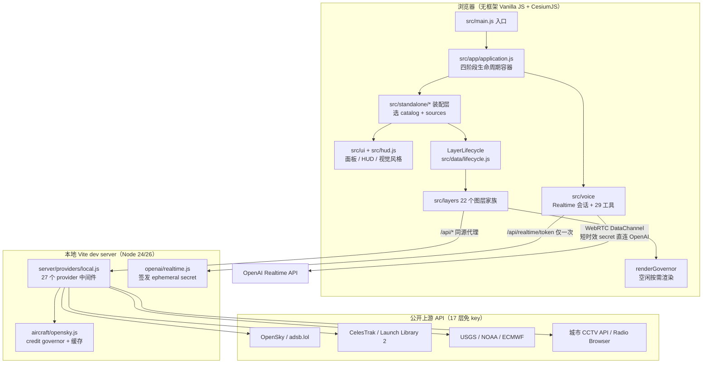
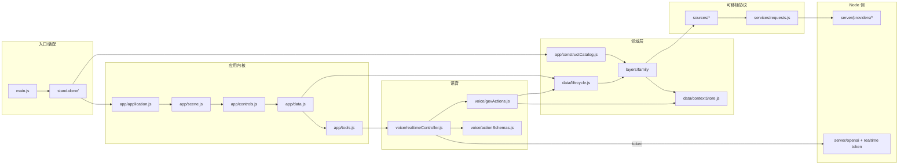
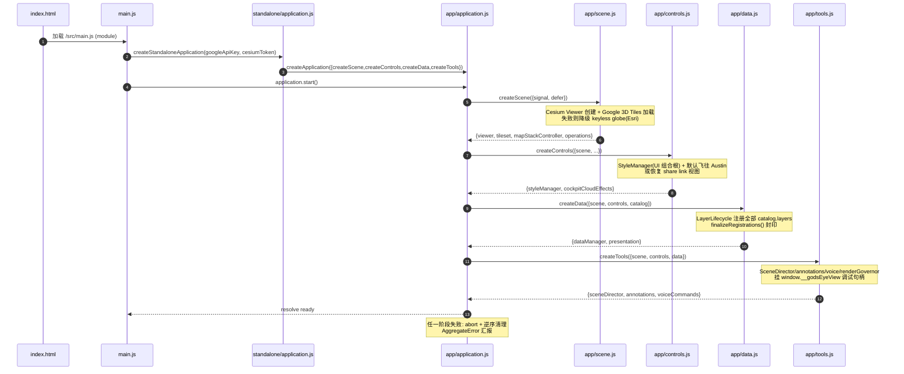
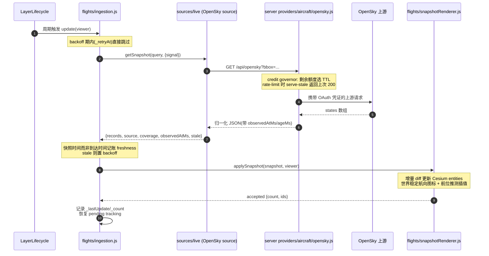
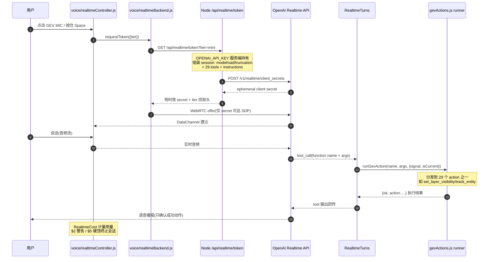

# gods-eye-view 源码学习笔记

> 仓库地址：[gods-eye-view](https://github.com/bilawalsidhu/gods-eye-view)
> 学习日期：2026-09-30

---

> **以下为 AI 源码分析**
>
> ### 一句话概括
>
> 一个完全跑在浏览器里的"卫星之眼"实时地理情报控制台：Vanilla JS + CesiumJS 渲染摄影级 3D 地球，将全球航班、船舶、卫星、地震、CCTV、天气等公开数据源聚合为可叠加的实时图层，并通过 OpenAI Realtime API 提供语音操控——所有涉密 API key 全部由本地 Node 代理持有，浏览器只见到短时效凭证。
>
> ### 要点速览
>
> | 模块 | 职责 | 关键文件 |
> |------|------|----------|
> | `src/app/` | 四阶段应用生命周期容器（scene→controls→data→tools） | `application.js`、`scene.js`、`controls.js`、`data.js`、`tools.js` |
> | `src/standalone/` | 单页装配层：选 catalog、选 source、启动 chrome | `application.js`、`catalog.js`、`layerSources.js` |
> | `src/data/` | 层生命周期管理器 + 上下文存储 + 各层领域逻辑 | `lifecycle.js`、`contextStore.js`、`layerState.js` |
> | `src/layers/<family>/` | 每个数据图层的家族模块（source/records/ingestion/rendering 分离） | `flights/index.js`、`satellites/orbits.js` 等 |
> | `src/sources/` | 可移植数据源协议层（禁止 import Node/Cesium/DOM） | `live/aircraft.js`、`overpassFeatures.js` |
> | `src/voice/` | OpenAI Realtime 语音会话 + 29 个语音工具执行器 | `realtimeController.js`、`gevActions.js`、`actionSchemas.js` |
> | `server/providers/` | Node 侧 provider 代理（密钥、缓存、限流、SSRF 防护） | `local.js`、`aircraft/opensky.js`、`openai/realtime.js` |
> | `src/maps/` + `src/mapStackController.js` | basemap 栈切换（Google 3D/Bing/Esri/OSM） | `maps/catalog.js`、`mapStackController.js` |
> | `src/renderGovernor.js` | 空闲渲染治理器（按需渲染，省 60% GPU） | 单文件模块 |
> | `scripts/` | 边界检查 + 90+ 个 Puppeteer QA 脚本 + 自研单测 runner | `check-import-directions.mjs`、`run-unit-tests.mjs` |

---

## 项目简介

God's Eye View 由 Bilawal Sidhu 与 Sameh Khamis（Halfpixel）开源（MIT），是同名病毒式传播的"上帝视角"视频系列的官方客户端。它把飞行应答机（ADS-B）、船舶信标（AIS）、轨道根数（TLE）、地震仪、公共摄像头等**公开实时信号**聚合到一个可探索的 3D 地球上，并叠加 OpenAI Realtime 语音 agent，让用户用自然语言驾驶相机、切换图层、标注世界。它解决的核心问题是：把分散在全球各处的公开地理数据源，统一到同一个"可对话、可扩展、可审查"的本地优先界面——所有代码可检查，所有密钥不出本地。仓库定位是"快速可改造的基础"，鼓励社区添加自己的城市包、数据源、视觉风格和语音工具。

## 技术栈

| 类别 | 技术 |
|------|------|
| 语言 | JavaScript（ESM，无 TypeScript、无 JSX） |
| 框架 | 无前端框架（Vanilla JS）+ CesiumJS 1.124（3D 地球引擎） |
| 构建工具 | Vite 6 + vite-plugin-cesium；dev server 内嵌 Node provider 中间件 |
| 依赖管理 | npm（`engines` 锁定 Node 24.14+ 或 26.x，25 已 EOL） |
| 测试框架 | 自研单测 runner（`node scripts/run-unit-tests.mjs`，`.test.mjs` 与源码同目录）+ 90+ 个 Puppeteer QA 脚本（`scripts/qa-*.mjs`） |
| 关键运行库 | `satellite.js`（SGP4 轨道传播）、`hls.js`（CCTV 直播流）、`@mapbox/vector-tile`+`pbf`（矢量瓦片）、`@meri-imperiumi/eccodes-wasm`（GRIB 风场解码）、`egm96-universal`（高程基准）、`mgrs`（军事格网坐标） |
| 语音 | OpenAI Realtime API（WebRTC DataChannel） |
| 分发 | 源码运行 + Pinokio 一键安装（Windows/macOS/Linux） |

## 目录结构

```text
gods-eye-view/
├── index.html                  # 单页入口：模板占位注释 + /src/main.js
├── vite.config.js              # re-export server/standalone/vite.config.js
├── server/                     # Node 侧（密钥与上游代理的唯一所在）
│   ├── providers/              # 27 个 provider 中间件工厂，按域分目录
│   │   ├── aircraft/           #   OpenSky 状态/富化/轨迹回填 + adsb.lol 军航
│   │   ├── vessels/            #   AISStream WebSocket + 记录存储
│   │   ├── openai/             #   Realtime token 签发 + HUD 摘要
│   │   └── ...
│   └── standalone/             # vite.config.js、Provider Settings、密钥落盘
├── src/
│   ├── main.js                 # 浏览器入口：读 env key → createStandaloneApplication
│   ├── app/                    # 可复用的应用生命周期（不含 standalone 选择）
│   ├── standalone/             # 单页装配：catalog、sources、controls、tools
│   ├── ui/                     # 运行时 UI：面板、HUD、样式、导航
│   ├── data/                   # LayerLifecycle + 全部领域逻辑（近 200 个文件）
│   ├── layers/                 # 22 个图层家族目录（flights/satellites/cctv/...）
│   ├── sources/                # 可移植数据源协议（禁止 Node/Cesium/DOM）
│   ├── services/               # /api/* 请求服务封装
│   ├── voice/                  # Realtime 会话控制 + 29 个 action
│   ├── maps/                   # basemap 栈目录/切换
│   ├── annotations/            # 语音白板（边界多边形/测距/路线）
│   ├── director/ + scenes/     # 电影化场景导演与回放
│   └── overlays/ + sdr/        # 世界文字标签 overlay；WebRTL-SDR 本地接收
├── scripts/                    # 边界门禁 + QA 矩阵 + 构建/格式化工具
├── build/                      # 共享 Vite 构建配置（Node-only export）
├── docs/                       # 架构文档：CURRENT-STATE / CODE-BOUNDARIES / APPLICATION 等
└── pinokio/                    # Pinokio 安装器脚本与 ENVIRONMENT 存储
```

## 架构设计

### 整体架构

整体是**三段式本地优先架构**：浏览器（渲染与交互）→ 本地 Node dev server（密钥代理 + 数据聚合）→ 公开上游 API。安全边界清晰：`OPENAI_API_KEY`、`AISSTREAM_API_KEY` 等涉密凭证只存在于 server 进程，浏览器仅持有 Google Maps / Cesium ion 两个本身就需要前端化的 key（要求在 provider 侧做 URL 限制）。浏览器所有数据请求统一走 `/api/*` 同源端点，由 Vite dev server 挂载的 27 个 provider 中间件分别转发到上游。



前端的控制流与数据流是分离的：控制流从 `main.js` 经装配层进入四阶段容器后即结束；数据流则由 `LayerLifecycle` 按图层驱动"source → ingestion → renderer"管道，与 UI 解耦。

### 核心模块

**1. 应用生命周期容器（`src/app/application.js`，152 行）**

`createApplication({createScene, createControls, createData, createTools})` 是整个前端的中枢。它本身不知道任何 provider、env、endpoint，只做三件事：

- 按固定顺序 `scene → controls → data → tools` 逐阶段构造，每阶段拿到**前面所有阶段的组件** + `signal`（AbortSignal）+ `defer(cleanup)`；
- `defer()` 只在构造期内接受注册（`acceptingCleanup` 标志），强制"资源一到手、清理先登记、之后才 await"的所有权纪律；
- 失败时 `controller.abort()` + 逆序清理（`tools → controls → data → scene`），清理错误不阻断后续回调，最终聚合成 `AggregateError`。

状态机（`created/starting/ready/destroying/destroyed/failed`）通过 `subscribe()` 发布冻结快照，`start()`/`destroy()` 幂等返回同一 promise。这是教科书级的"组合根 + 资源确定性释放"实现。

**2. standalone 装配层（`src/standalone/`）**

`createStandaloneApplication()`（application.js:14）是该容器在"单页应用"场景的具体实现：构造 `placeSearch`（搜索降级链：坐标/内置 POI → Google → Photon → Nominatim）、scene（Cesium viewer + Google 3D tiles + MapStackController）、catalog（`createStandaloneCatalog` = `constructCatalog` + `createStandaloneLayerSources()`），再依次装配 controls/data/tools。用模块级 `constructed` 标志保证一页一应用，销毁后只能 reload。

**3. 层生命周期管理器（`src/data/lifecycle.js`，2328 行）**

`LayerLifecycle` 是所有数据图层的运行时宿主，维护 `Map<id, {module, enabled, lifecycleState, ...}>`。它把"层的可见性"做成**事务**：

- `enabled` 是权威的已结算状态，而 `lifecycleState`（`disabled/enabling/…`）单独汇报在途的生命周期工作；
- 每次 `setEnabled()` 持有单调 `visibilityIntentEpoch`，新意图可中止在途工作，旧排队请求因 epoch 过期不再启动（源码注释称之为 intent lane）；
- 注册期结束调用 `finalizeRegistrations()` 封印，之后 `register()` 直接抛错；dev 模式开 `allowQaRegistration` 提供 QA 注入缝（`window.__gevQaRegisterLayer`）。

**4. 图层家族（`src/layers/<family>/`，22 个目录）**

每个图层是"由多个 part 组合的单个 layer 对象"的模式。以 flights 为例（`src/layers/flights/index.js`）：

```text
state → rendering → motion → tracking → controller → enrichment
      → lifecycle → evidence → testing → queries → ingestion
```

所有 part 共享一个 `context = {flightState, services, parts, layer}`，最终 `Object.assign(layer, queries.methods, lifecycle.methods, ingestion.methods)` 收敛成一个模块对象。`ingestion.js` 只管获取/退避/新鲜度，`snapshotRenderer.js` 把快照落到 Cesium 实体，渲染与获取彻底分离。卫星层（`satellites/orbits.js`）用 `satellite.js` 的 `propagate + gstime` 做 SGP4 实时传播，轨道环烘焙后用 `deltaGmst = gstime(now) - gmstAtBake` 重对齐，保证轨道环与卫星不漂移。

**5. 可移植源协议（`src/sources/`）**

`contract.js` 提供记录准入原语（`admitRecords/coordinates/epoch/finite`），`live/aircraft.js` 把 OpenSky 的 state-vector 数组和 readsb 的对象两种上游格式归一化为同一种记录形状。这一层被 import 门禁强制为"纯"：不得 import Node、Cesium、不得引用 `window/document`，因此同一归一化代码可以同时被浏览器层和 Node provider 复用。

**6. 语音子系统（`src/voice/`）**

`GevRealtimeController`（realtimeController.js:56）继承 `RealtimeFacade`，但把职责拆给八个协作对象：`RealtimeConnection`（WebRTC/SDP）、`RealtimeTurns`（轮次与工具调用分发）、`RealtimeViewport`（视觉接地截图）、`RealtimeDiagnostics`、`RealtimeRadio`（广播电台交接）、`RealtimeCost`（$2 警告 / $5 硬顶）、`RealtimeInput`（麦克风与 push-to-talk）。控制器自身只持有状态机（`idle/connecting/listening/executing/error`）和资源编排。工具执行器 `createGevActionRunner`（gevActions.js:328，4473 行）是一个按 `name` 分发的 action runner，29 个工具 schema 定义在 `actionSchemas.js`，由 server 端 token 接口注入会话。

**7. server provider 代理（`server/providers/`）**

`localProviderPlugins()`（local.js:30）按固定顺序挂载 27 个中间件到 Vite dev/preview server。每个 provider 是独立工厂（import 时不启动获取），自带进程级缓存与 `configureServer`/`configurePreviewServer` 双挂载。安全基线：SSRF 防护、响应体上限、错误信息脱敏、可选 per-IP 限流（`GEV_RATELIMIT_*`）。

**8. 上下文存储（`src/data/contextStore.js`，200 行）**

挂在 `window.__gevContextStore` 的选中实体单槽：`registerEntityContext/selectEntityContext/getSelectedEntityContext`。语音工具的 `scope:'selected'` 与 Cockpit 的目标查找都读同一个槽，保证"点击的、语音问答的、驾驶舱跟随的"是同一实体。追踪型图层用独立的发布车道（`selectTrackedSubjectContext`，不派发选中事件避免与 readout 争抢）。

### 模块依赖关系



两条静态门禁保证这张图不会腐化：`scripts/check-import-directions.mjs` 解析全部运行时 JS 的 import 边（含字面量动态 import 与 re-export），拒绝 browser 图触达 Node、可移植图触达 Cesium/DOM；`scripts/check-package-boundaries.mjs` 按 `package.json` 的 200+ 条 exports 逐条独立构建。`npm run check:boundaries` 是 CI 门禁。

## 核心流程

### 流程一：应用启动（四阶段确定性构造）



关键逻辑：`scene.js` 中每一步资源（credits 容器、viewer、tileset、MapStackController）都在 `await` 之前先 `defer(cleanup)`（scene.js:34-116）；Google 3D Tiles 加载失败不打断启动，而是切到 `esri-imagery` 并保留错误详情显示在 loading screen 上。

### 流程二：航班数据流（从上游到 Cesium 实体）



关键逻辑：`server/providers/aircraft/opensky.js` 的 credit governor（2026-07-06 修复）有三根杠杆——按剩余日额度选缓存 TTL、尊重上游 retry-after（30s–30min）、rate-limit 期间继续提供 last-good 数据（`rate_limited_serving_stale`）。浏览器侧 `ingestion.js` 的 freshness 记的是**源快照时间**（ingestion.js:56 注释：缓存命中的 200 也算旧），退避用 `ERROR_BACKOFF_INTERVAL`。

### 流程三：语音指令（密钥不进浏览器）



关键逻辑：`isCurrent()` 防止被更新语音轮次取代的旧工具继续执行；session ending 后**在途工具跑完不回滚**（realtimeController.js:337 注释：半撤销的相机/图层状态比完成更糟），只保证不再派发新工具；`fatalError` 先拆传输再翻 ERROR 状态，避免"ERROR 状态下热麦克风"（H8）。

## 关键设计亮点

**1. 四阶段生命周期容器 + defer 所有权纪律**

问题：前端应用启动涉及数十个有资源副作用的对象（viewer、tileset、监听器、window 句柄），中途失败容易泄漏或留下半初始化状态。实现：`src/app/application.js` 的 `createApplication` 把构造参数化为四个工厂，用 `START_ORDER/STOP_ORDER` 双序表 + `defer()` 注册窗口 + AbortSignal 贯穿，把"谁创建、谁清理、何时清理"变成编译期可检查的结构（构造器内不 `defer` 直接抛 TypeError）。值得学习的原因：它让"启动失败"变成可恢复的普通路径，而不是留给用户 reload 的死局；且容器本身零领域知识，`docs/APPLICATION.md` 把它作为可独立复用的 `gods-eye-view/application` 导出。

**2. 空闲渲染治理器（renderGovernor）**

问题：Cesium 默认每 vsync 重绘，空场景静止相机也烧掉 ~60% GPU。实现：`src/renderGovernor.js` 单文件，二值模式切换——`requestRenderMode` 由**身份键 Set 的 holds** 驱动（不是计数器，双 release 无法腐化模式）。每个逐帧动画者（fleet 插值、交通模拟、卫星、跟踪相机、样式渐变）注册一个 hold；离散变更者调 `governorRequestRender()` 请求单帧。治理器自身 O(1) 无逐帧成本，配套 `getRenderGovernorDiagnostics()` 输出可读的 holds 列表与最近请求轨迹。此外 tab 隐藏时直接停掉渲染循环（app/tools.js:120 的 `syncVisibilitySuspension`）。这是"在没有框架的代码库里做系统性性能治理"的范本。

**3. 密钥的信任边界设计**

问题：浏览器应用要接 6 家带密钥的 provider，其中 OpenAI Realtime 还要长连接。实现：分层——(a) 只有 Google Maps/Cesium ion 两枚"本就该前端化"的 key 进浏览器（要求 provider 侧 URL 限制）；(b) 其余全部由 `server/providers/*` 中间件代理，`build/vite.js` 还用 `server.fs.deny` 挡住 `.env`/证书文件被 dev server 静态读到；(c) 语音连接用 `server/providers/openai/realtime.js` 换取 **ephemeral client secret**，浏览器 WebRTC 直连 OpenAI 但永远拿不到主 key，secret 短时效、重启即换；(d) LAN 共享时 Provider Settings 面板自动禁用。为什么值得学：它没有用"本地工具所以无所谓"当借口，而是把企业级的 secret broker 模式压缩进了单个 Vite 插件。

**4. 用静态分析治理 import 边界（无框架的"模块系统纪律"）**

问题：无框架大代码库最怕分层腐化——今天 sources 里 import 一个 Cesium，明天 renderer 被 Node 构建。实现：`scripts/check-import-directions.mjs` 用 `git ls-files` 枚举**所有**运行时文件（不管 bundler 是否可达），解析 import/动态 import/re-export 三种边，按 entry/source/renderer/test 分类执行规则（browser 不可达 Node、portable 不可达 Cesium/DOM 全局、provider 不可 import 应用模块），只留两条白名单兼容边；`check-package-boundaries.mjs` 再按 package exports 逐条独立构建。`docs/CODE-BOUNDARIES.md` 把每个 export 的所有权写成表。这相当于给 Vanilla JS 项目自建了"模块边界 + 构建隔离"两级门禁，是框架代码库里由打包器/编译器承担的职责的手工等价物。

**5. 上游配额的自我保护（OpenSky credit governor）**

问题：OpenSky 匿名/低额度账号被 429 后图层整个死掉，48 小时不可用（真实事故驱动）。实现：`server/providers/aircraft/opensky.js` 的三杠杆——按剩余日预算动态选缓存 TTL（客户端 30s 轮询下，≤30s 的 TTL 成本相同所以直接取该档）、尊重并钳制 retry-after、rate-limit 期间 **serve-stale**（返回 last-good 数据 + 200 + `rate_limited_serving_stale` reason，浏览器可显示"数据滞后"而不是空图层）。设计哲学是"上次的好数据胜过一个死掉的层"。同样的模式还出现在卫星 TLE 磁盘缓存、TomTom 日瓦片预算上。

**6. 选中实体的单槽上下文存储**

问题：点击、语音问答、驾驶舱跟随三条交互路径需要"当前目标"的一致视图，各自为政会导致答非所问。实现：`src/data/contextStore.js` 挂 window 的极简 Map + 单选中槽，`registerEntityContext` 给实体打 `__gevContextId`，`getSelectedEntityContext` 带活性校验（实体隐藏、图层关闭即失效并清槽）。追踪型图层（每轮刷新都在换载体）用独立车道 `selectTrackedSubjectContext`，刻意不派发选中事件避免与 readout 面板争抢。200 行解决了一个在大型前端项目里通常会演化成全局状态管理器的需求。

---

## 未深入分析的部分

- `src/sdr/`（WebRTL-SDR 本地无线电接收）与 `local-adsb` 层——硬件相关，需要实际 RTL-SDR 设备
- `src/director/` 场景导演的时间轴编排细节（DIRECTOR-*.md 五份文档未逐一展开）
- `src/scenes/` Nepal 洪水场景的数据包结构
- `pinokio/` 安装器的版本协商逻辑
- 90+ 个 QA 脚本的逐个分析（模式统一：Puppeteer 启动、断言 DOM/场景状态、`window.__godsEyeView` 调试句柄）
- `docs/CURRENT-STATE.md`（4838 行权威运行时参考）仅采样阅读
