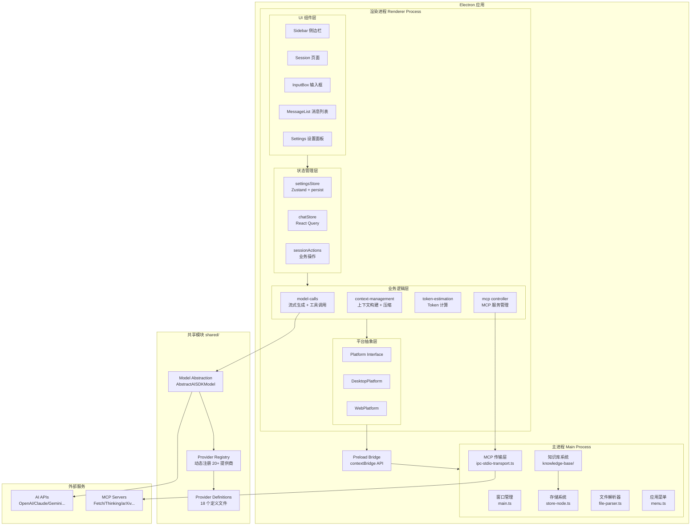
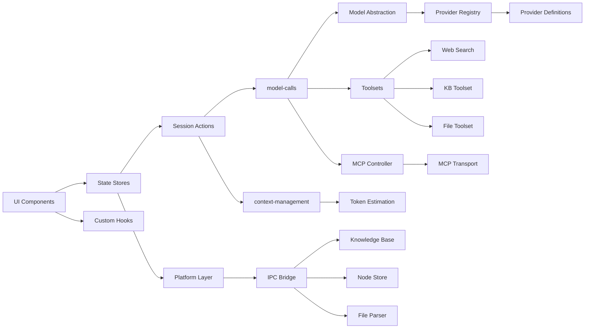
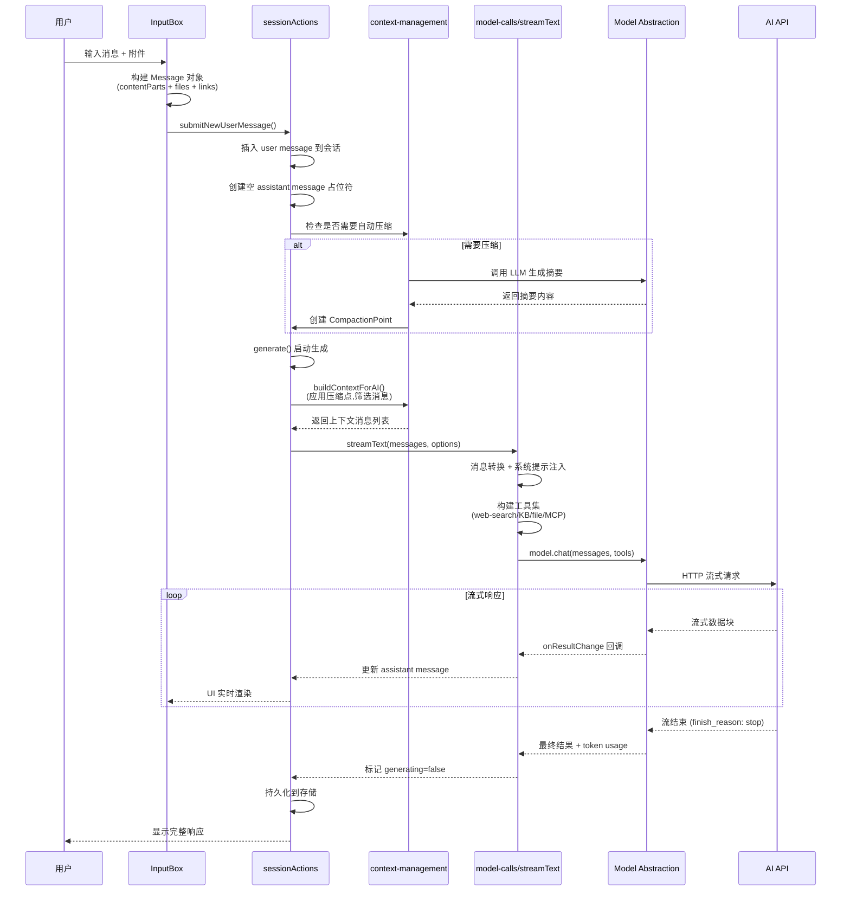
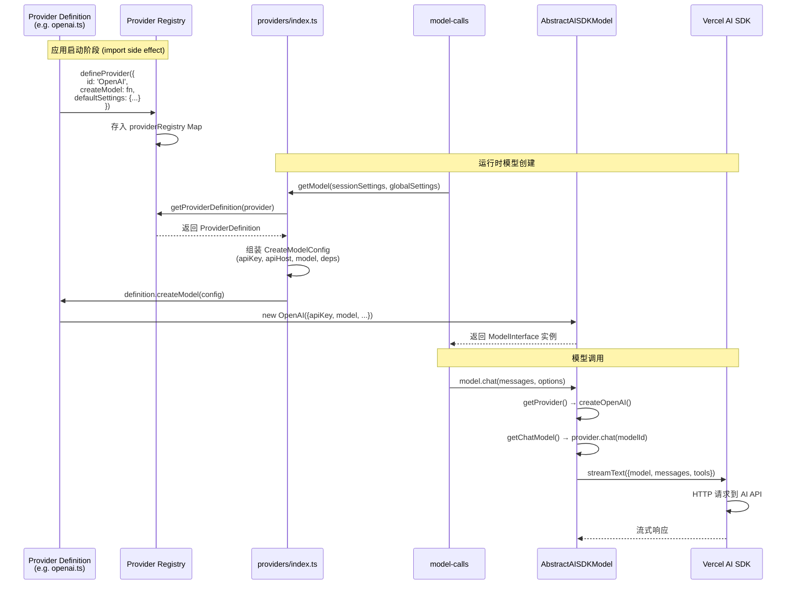

# chatbox 源码学习笔记

> 仓库地址：[chatbox](https://github.com/chatboxai/chatbox)
> 学习日期：2026-03-22

---

> **以下为 AI 源码分析**
>
> ### 一句话概括
>
> Chatbox 是一个基于 Electron + React 的跨平台 AI 聊天桌面客户端，通过插件化的 Provider Registry 架构统一接入 OpenAI、Claude、Gemini 等 20+ LLM 服务商，支持流式对话、工具调用、知识库 RAG、MCP 协议扩展等高级特性。
>
> ### 要点速览
>
> | 核心模块 | 职责 | 关键文件 |
> |---------|------|---------|
> | Provider Registry | 动态注册和管理 LLM 提供商 | `src/shared/providers/registry.ts` |
> | Model Abstraction | 统一的模型调用抽象层（基于 Vercel AI SDK） | `src/shared/models/abstract-ai-sdk.ts` |
> | Chat Store | 会话和消息的数据管理（React Query + Zustand） | `src/renderer/stores/chatStore.ts` |
> | Context Management | 上下文构建、自动压缩和 Token 管理 | `src/renderer/packages/context-management/` |
> | MCP Controller | Model Context Protocol 工具扩展 | `src/renderer/packages/mcp/controller.ts` |
> | Knowledge Base | 基于向量搜索的本地知识库 RAG | `src/main/knowledge-base/` |
> | Platform Abstraction | 跨平台适配层（Desktop/Web/Mobile） | `src/renderer/platform/` |
> | Main Process | Electron 主进程、窗口管理、IPC 调度 | `src/main/main.ts` |

---

## 项目简介

Chatbox 是一款开源的 AI 桌面客户端（Community Edition，GPLv3 协议），支持 Windows、macOS、Linux 桌面端以及 iOS/Android 移动端。它的核心价值在于让用户通过一个统一的界面接入多种 LLM 服务（OpenAI、Claude、Gemini、DeepSeek、Ollama 等 20+ 提供商），所有数据本地存储，保护用户隐私。项目采用插件化的 Provider 架构，新增 LLM 提供商只需添加一个定义文件即可完成接入，无需修改核心逻辑。

## 技术栈

| 类别 | 技术 |
|------|------|
| 语言 | TypeScript |
| 框架 | Electron 26 + React 18 |
| 构建工具 | electron-vite + Vite 7 |
| 依赖管理 | pnpm 10 |
| 测试框架 | Vitest + Testing Library |
| 状态管理 | Zustand + Jotai + React Query (TanStack Query) |
| UI 库 | Mantine 7 + Material-UI 5 + Tailwind CSS 3 |
| AI SDK | Vercel AI SDK (@ai-sdk/*) |
| 路由 | TanStack Router |
| 国际化 | i18next + react-i18next |
| 移动端 | Capacitor (iOS/Android) |
| 知识库 | Mastra RAG + LibSQL 向量存储 |
| 代码规范 | Biome (lint + format) |

## 目录结构

```
chatbox/
├── src/
│   ├── main/                          # Electron 主进程
│   │   ├── main.ts                    # 应用入口，窗口管理，IPC 注册
│   │   ├── menu.ts                    # 应用菜单（跨平台适配）
│   │   ├── store-node.ts             # Node 端存储（electron-store + 自动备份）
│   │   ├── file-parser.ts            # 文件解析（Office/EPUB/文本，编码检测）
│   │   ├── knowledge-base/           # 知识库系统
│   │   │   ├── index.ts              # 初始化协调（DB + 向量存储 + Worker）
│   │   │   ├── ipc-handlers.ts       # 知识库 CRUD IPC 接口
│   │   │   ├── db.ts                 # LibSQL 数据库管理
│   │   │   └── model-providers.ts    # Embedding/Rerank 模型提供
│   │   └── mcp/                      # MCP 传输层
│   │       └── ipc-stdio-transport.ts # stdio 子进程管理
│   ├── preload/
│   │   └── index.ts                  # contextBridge 安全暴露 API
│   ├── renderer/                      # 渲染进程（React 应用）
│   │   ├── index.tsx                  # 应用入口，初始化流程
│   │   ├── router.tsx                 # TanStack Router 配置
│   │   ├── Sidebar.tsx                # 侧边栏导航
│   │   ├── stores/                    # 状态管理层
│   │   │   ├── settingsStore.ts       # 全局设置（Zustand + persist）
│   │   │   ├── chatStore.ts           # 会话/消息数据（React Query）
│   │   │   └── session/               # 会话操作模块
│   │   │       ├── generation.ts      # 消息生成 orchestration
│   │   │       ├── messages.ts        # 消息 CRUD
│   │   │       └── threads.ts         # 线程管理
│   │   ├── packages/                  # 核心业务包
│   │   │   ├── model-calls/           # 模型调用层
│   │   │   │   ├── stream-text.ts     # 流式文本生成核心
│   │   │   │   ├── message-utils.ts   # 消息格式转换
│   │   │   │   └── toolsets/          # 工具集（file/web-search/kb）
│   │   │   ├── context-management/    # 上下文管理
│   │   │   │   ├── context-builder.ts # 上下文构建
│   │   │   │   ├── compaction.ts      # 自动上下文压缩
│   │   │   │   └── context-tokens.ts  # Token 缓存
│   │   │   ├── mcp/                   # MCP 客户端
│   │   │   │   └── controller.ts      # MCP 服务管理
│   │   │   └── token-estimation/      # Token 估计系统
│   │   ├── components/                # UI 组件
│   │   │   ├── InputBox/              # 消息输入组件
│   │   │   ├── chat/                  # 聊天消息展示
│   │   │   ├── settings/              # 设置面板
│   │   │   └── knowledge-base/        # 知识库 UI
│   │   ├── platform/                  # 平台抽象层
│   │   │   ├── interfaces.ts          # Platform 接口定义
│   │   │   ├── desktop_platform.ts    # Electron 桌面实现
│   │   │   └── web_platform.ts        # Web 浏览器实现
│   │   └── routes/                    # 页面路由
│   │       ├── session/               # 聊天会话页
│   │       ├── settings/              # 设置页
│   │       └── copilots.tsx           # Copilots 页
│   └── shared/                        # 主进程/渲染进程共享代码
│       ├── types.ts                   # 核心类型定义（Zod schema）
│       ├── providers/                 # Provider 注册系统
│       │   ├── registry.ts            # Provider Registry（Map 存储）
│       │   ├── types.ts               # ProviderDefinition 接口
│       │   └── definitions/           # 18 个 Provider 定义文件
│       ├── models/                    # 模型抽象层
│       │   ├── abstract-ai-sdk.ts     # AI SDK 抽象基类
│       │   ├── openai-compatible.ts   # OpenAI 兼容实现
│       │   └── types.ts               # ModelInterface 接口
│       ├── constants.ts               # 常量
│       └── defaults.ts                # 默认配置
├── electron.vite.config.ts            # Vite 构建配置（main/preload/renderer）
├── electron-builder.yml               # Electron 打包配置
└── package.json                       # 项目依赖和脚本
```

## 架构设计

### 整体架构

Chatbox 采用经典的 **Electron 三层架构**（Main Process + Preload + Renderer），结合 **Provider Registry 插件化模式** 实现 LLM 服务的动态扩展。渲染进程内部遵循 **分层架构**：UI 组件层 → 状态管理层 → 业务逻辑层 → 模型抽象层 → AI SDK 适配层。



### 核心模块

#### 1. Provider Registry 系统

**职责**：管理所有 LLM 提供商的注册、查询和模型创建

**核心文件**：
- `src/shared/providers/registry.ts` — Registry Map 和 API
- `src/shared/providers/types.ts` — `ProviderDefinition` 接口
- `src/shared/providers/definitions/` — 18 个具体 Provider 定义

**关键接口**：
- `defineProvider(definition)` — 注册 Provider 到全局 Map
- `getProviderDefinition(id)` — 按 ID 查询
- `getAllProviders()` — 获取全部已注册 Provider
- `ProviderDefinition.createModel(config)` — 工厂方法创建模型实例

**与其他模块的关系**：被 `getModel()` 工厂函数调用，为 model-calls 层提供具体的 ModelInterface 实例。Settings UI 通过 `getAllProviders()` 展示提供商列表。

#### 2. Model Abstraction 层

**职责**：统一不同 LLM API 的调用接口，处理流式响应、工具调用、重试

**核心文件**：
- `src/shared/models/abstract-ai-sdk.ts` — 抽象基类
- `src/shared/models/openai-compatible.ts` — OpenAI 兼容实现
- `src/shared/models/types.ts` — `ModelInterface` 接口
- `src/shared/providers/definitions/models/` — 具体模型实现（OpenAI、Claude、Gemini 等）

**关键函数**：
- `chat(messages, options)` — 流式聊天完成，支持工具调用链
- `isSupportVision()` / `isSupportToolUse()` / `isSupportReasoning()` — 能力检测
- `handleStreamingCompletion()` — 流式块处理（text/reasoning/tool-call/image）

**设计模式**：Template Method — `AbstractAISDKModel` 定义处理流程骨架，子类实现 `getProvider()`、`getChatModel()` 等具体方法。5xx 错误自动指数退避重试（最多 5 次）。

#### 3. Context Management 模块

**职责**：构建 AI 请求上下文、自动压缩长对话、管理 Token 缓存

**核心文件**：
- `src/renderer/packages/context-management/context-builder.ts` — 上下文构建
- `src/renderer/packages/context-management/compaction.ts` — 自动压缩
- `src/renderer/packages/context-management/context-tokens.ts` — 三层 Token 缓存

**关键函数**：
- `buildContextForAI(messages, compactionPoints)` — 根据压缩点筛选有效消息
- `runCompaction()` — 调用 LLM 生成摘要，创建 CompactionPoint
- Token 缓存系统：L1（消息级）→ L2（查询缓存）→ L3（localStorage）

#### 4. MCP Controller

**职责**：管理 Model Context Protocol 服务器的生命周期和工具调用

**核心文件**：
- `src/renderer/packages/mcp/controller.ts` — 全局控制器单例
- `src/renderer/packages/mcp/builtin.ts` — 5 个内置 MCP 服务器
- `src/main/mcp/ipc-stdio-transport.ts` — 主进程 stdio 传输

**内置服务器**：Fetch（网页抓取）、Sequential Thinking（结构化思维）、EdgeOne Pages（HTML 部署）、arXiv（论文检索）、Context7（库文档）

**工具名称规范**：`mcp__[server-name]__[tool-name]`，防止跨服务器工具名冲突

#### 5. Knowledge Base 系统

**职责**：本地知识库的文件管理、向量索引、语义搜索（RAG）

**核心文件**：
- `src/main/knowledge-base/index.ts` — 初始化协调
- `src/main/knowledge-base/ipc-handlers.ts` — CRUD + 搜索 IPC 接口
- `src/main/knowledge-base/db.ts` — LibSQL 数据库
- `src/main/knowledge-base/model-providers.ts` — Embedding/Rerank 模型

**工作流**：文件上传 → 文本提取 → 分块 → Embedding 向量化 → LibSQL 向量存储 → 语义搜索 → Rerank 排序

#### 6. Platform Abstraction 层

**职责**：抽象跨平台差异，统一 Desktop/Web/Mobile 的系统 API

**核心文件**：
- `src/renderer/platform/interfaces.ts` — Platform 接口（存储、文件、窗口、日志）
- `src/renderer/platform/desktop_platform.ts` — Electron IPC 实现
- `src/renderer/platform/web_platform.ts` — 浏览器实现

**工厂选择逻辑**：测试环境 → TestPlatform；`window.electronAPI` 存在 → DesktopPlatform；其他 → WebPlatform

### 模块依赖关系



## 核心流程

### 流程一：用户发送消息到 AI 响应完成

这是 Chatbox 最核心的业务流程，涵盖从用户输入到流式 AI 响应的完整链路。



**关键细节**：
1. **消息构建阶段**：InputBox 将文本、图片（base64）、文件（预处理后存 IndexedDB）、链接组装为 `Message` 对象
2. **上下文构建阶段**：`buildContextForAI()` 查找最新 CompactionPoint，只包含压缩点之后的消息 + 摘要，清理旧工具调用
3. **工具调用阶段**：根据模型能力决定策略 — 支持 tool_use 则使用工具调用，否则退化为 prompt engineering 方式
4. **流式更新阶段**：每收到一个块更新消息缓存，每 2 秒批量持久化一次（性能优化）
5. **错误处理**：5xx 错误自动指数退避重试，其他错误写入 message.error 并上报 Sentry

### 流程二：Provider 注册与模型创建

这是 Chatbox 可扩展性的核心 — 如何将 20+ LLM 提供商统一到一个模型调用接口。



**关键设计**：
1. **注册时机**：Provider 定义文件通过 ES Module 的 import 副作用自动注册，`providers/index.ts` 按优先级导入所有定义
2. **工厂方法**：每个 `ProviderDefinition` 提供 `createModel()` 工厂，负责实例化具体的 Model 类
3. **配置分层**：`CreateModelConfig` 聚合了 SessionSettings（温度/topP）、GlobalSettings（代理）、ProviderSettings（apiKey/apiHost）三层配置
4. **继承体系**：`ModelInterface` ← `AbstractAISDKModel` ← `OpenAICompatible` ← 具体实现（OpenAI/Claude/Gemini）
5. **能力声明**：每个模型在 `defaultSettings.models` 中声明 capabilities（vision/reasoning/tool_use），运行时通过 `isSupportXxx()` 查询

## 关键设计亮点

### 1. Provider Registry 插件化架构

**解决的问题**：如何在不修改核心代码的情况下支持 20+ LLM 提供商的接入和管理

**具体实现**：
- `src/shared/providers/registry.ts` 使用 `Map<string, ProviderDefinition>` 存储所有注册的提供商
- 每个 Provider 只需在 `definitions/` 目录下创建一个文件，调用 `defineProvider()` 即可完成注册
- `providers/index.ts` 通过 import 副作用按优先级顺序注册所有 Provider

**为什么这样设计**：相比传统的 switch-case 或 if-else 分发，Registry 模式实现了完全的 Open-Closed 原则 — 新增提供商不需要修改任何已有文件，只需添加一个新定义文件。同时 `clearProviderRegistry()` 方便测试隔离。

### 2. 三层上下文压缩策略

**解决的问题**：长对话场景下 Token 消耗快速增长，容易超出模型上下文窗口限制

**具体实现**：
- `src/renderer/packages/context-management/compaction.ts` 检测 Token 使用量超过阈值时自动触发
- 调用 LLM 对历史消息生成摘要，创建 `CompactionPoint`（记录边界消息 ID + 摘要消息 ID）
- `context-builder.ts` 在构建上下文时只包含压缩点之后的消息 + 摘要
- Token 缓存采用 L1（消息级）→ L2（查询缓存）→ L3（localStorage）三层架构

**为什么这样设计**：压缩点机制比简单截断更智能 — 保留了完整的对话语义，同时大幅减少 Token 消耗。三层缓存避免重复计算 Token 数量，支持实时显示输入框中的 Token 估计。

### 3. 平台抽象层的工厂模式

**解决的问题**：同一份 React 代码需要运行在 Electron Desktop、Web 浏览器、Capacitor Mobile 三种环境

**具体实现**：
- `src/renderer/platform/interfaces.ts` 定义了 `Platform` 接口（存储、系统信息、文件操作、窗口控制）
- `src/renderer/platform/index.ts` 通过工厂函数根据运行环境自动选择实现
- DesktopPlatform 通过 IPC 与主进程通信，WebPlatform 使用浏览器 API
- IPC 缓存策略（5 分钟 TTL）减少进程间通信开销

**为什么这样设计**：业务代码只依赖 `Platform` 接口，完全不感知底层环境差异。DesktopPlatform 的分层存储策略（关键配置存文件 + 大数据存 IndexedDB）兼顾了可靠性和性能。

### 4. 基于 Vercel AI SDK 的统一流式处理

**解决的问题**：不同 LLM API 的流式响应格式差异大，工具调用协议不统一

**具体实现**：
- `src/shared/models/abstract-ai-sdk.ts` 基于 Vercel AI SDK 封装统一的流式处理逻辑
- 支持 text、reasoning、tool-call、image 四种内容类型的流式更新
- Reasoning 处理记录 startTime 和 duration，用于 UI 展示思考过程
- 工具调用链自动管理（call → result/error → 下一步）

**为什么这样设计**：Vercel AI SDK 本身提供了跨 Provider 的统一接口，但 Chatbox 在此基础上增加了 reasoning 时间追踪、自动重试（5xx 指数退避）、Sentry 错误上报等生产级特性。`AbstractAISDKModel` 的 Template Method 模式让每个 Provider 只需实现 `getProvider()` 和 `getChatModel()` 两个方法。

### 5. 智能工具调用降级策略

**解决的问题**：不是所有模型都支持 tool_use 能力，但用户可能需要网络搜索或知识库查询

**具体实现**：
- `src/renderer/packages/model-calls/stream-text.ts` 在调用前检测模型的 `isSupportToolUse()` 能力
- 支持 tool_use 的模型：使用标准工具调用协议（web_search、query_knowledge_base 等）
- 不支持 tool_use 的模型：退化为 prompt engineering 策略 — 先执行搜索，将结果注入到系统提示中
- `src/renderer/packages/model-calls/tools.ts` 实现了基于提示词的搜索工具（`getPromptEngineeringSearchTool`）

**为什么这样设计**：保证了功能的普适性 — 即使用户选择了不支持工具调用的低端模型（如早期 GPT-3.5），仍然可以使用网络搜索和知识库功能。两套策略无缝切换，对用户完全透明。
