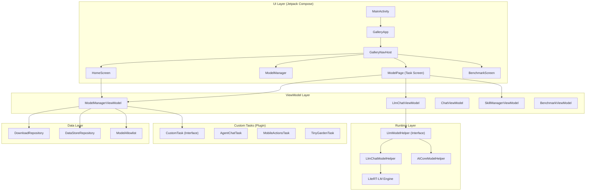
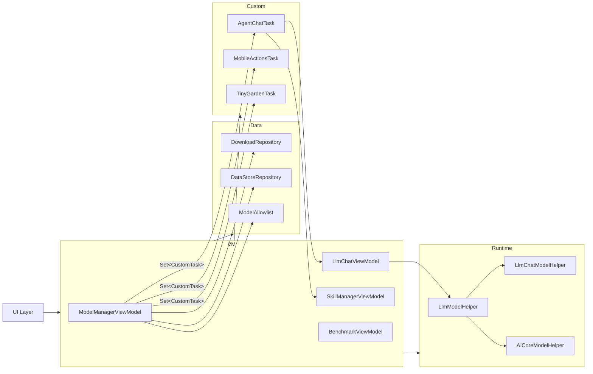
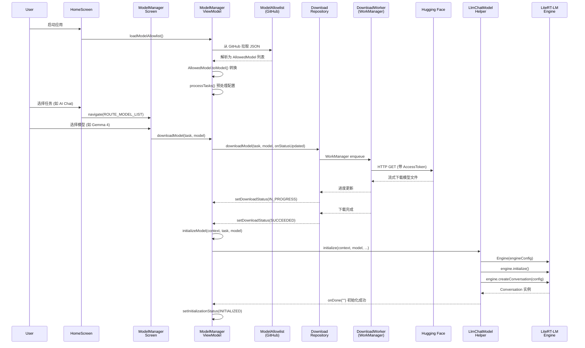
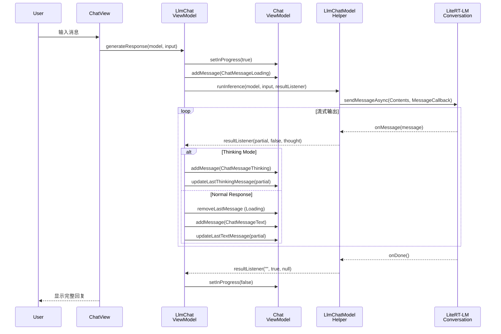
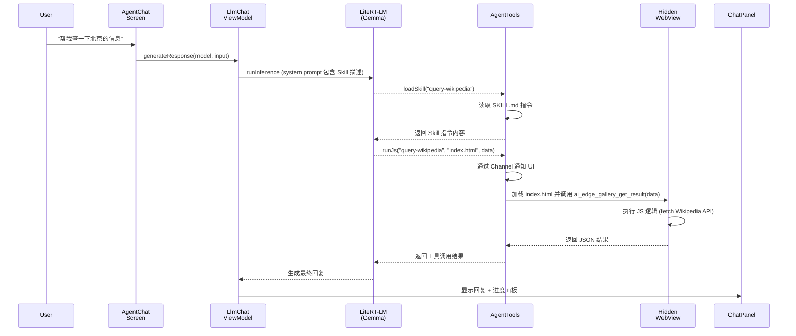

# gallery 源码学习笔记

> 仓库地址：[gallery](https://github.com/google-ai-edge/gallery)
> 学习日期：2026/04/14

---

> **以下为 AI 源码分析**
>
> ### 一句话概括
>
> Google 官方开源的 Android 端侧 AI 应用，让用户在移动设备上完全离线运行 LLM（如 Gemma 4）进行对话、图片理解、语音转写、Agent Skills 等多种 AI 任务。
>
> ### 要点速览
>
> | 核心模块 | 职责 | 关键文件 |
> |---------|------|---------|
> | Navigation | 页面路由与导航管理 | `GalleryNavGraph.kt` |
> | Model Manager | 模型下载、生命周期、初始化 | `ModelManagerViewModel.kt`, `DownloadRepository.kt` |
> | Runtime Layer | LLM 推理引擎抽象层 | `LlmModelHelper.kt`, `LlmChatModelHelper.kt`, `AICoreModelHelper.kt` |
> | Chat UI | 聊天界面与消息管理 | `ChatViewModel.kt`, `ChatPanel.kt`, `ChatView.kt` |
> | Custom Tasks | 可插拔任务系统 | `CustomTask.kt`, `CustomTaskData.kt` |
> | Agent Skills | LLM 技能扩展框架 | `AgentTools.kt`, `SkillManagerViewModel.kt` |
> | LLM Chat | 多轮对话 / 图片 / 音频 | `LlmChatViewModel.kt`, `LlmChatScreen.kt` |

---

## 项目简介

AI Edge Gallery 是 Google AI Edge 团队开源的移动端 AI 示范应用，核心目标是让用户在 Android 设备上完全离线运行开源 LLM 模型。它集成了 LiteRT（原 TFLite）和 LiteRT-LM 推理引擎，支持从 Hugging Face 一键下载模型，提供多轮对话、图片理解、语音转写、Agent Skills（技能扩展）、Prompt Lab、模型 Benchmark 等丰富功能。项目采用 Jetpack Compose + Hilt + MVVM 架构，代码质量高，是学习 Android 端侧 AI 应用架构的极佳参考。

## 技术栈

| 类别 | 技术 |
|------|------|
| 语言 | Kotlin |
| 框架 | Jetpack Compose, Android (minSdk 31, targetSdk 35) |
| 构建工具 | Gradle (Kotlin DSL), Version Catalogs |
| 依赖注入 | Hilt (Dagger) |
| 数据持久化 | DataStore (Protobuf), SharedPreferences |
| 推理引擎 | LiteRT-LM, AICore, TFLite |
| 模型来源 | Hugging Face (OAuth via AppAuth) |
| 后台任务 | WorkManager (模型下载) |
| 序列化 | Gson, Moshi, Protobuf, Kotlin Serialization |
| 其他 | Firebase Analytics/FCM, CameraX, CommonMark, WebKit |

## 目录结构

```
gallery/
├── Android/src/                    # Android 项目根目录
│   ├── app/
│   │   ├── build.gradle.kts        # 应用构建配置与依赖声明
│   │   └── src/main/
│   │       ├── AndroidManifest.xml
│   │       ├── assets/skills/      # 内置 Agent Skills (HTML/JS/Markdown)
│   │       └── java/.../gallery/
│   │           ├── MainActivity.kt             # 应用入口 Activity
│   │           ├── GalleryApplication.kt       # Application 初始化 (Hilt, Firebase, Theme)
│   │           ├── GalleryApp.kt               # 顶层 Composable 入口
│   │           ├── data/                       # 数据层：模型定义、任务、下载、持久化
│   │           │   ├── Model.kt                # Model 数据类
│   │           │   ├── Tasks.kt                # Task 数据类与内置任务 ID
│   │           │   ├── Config.kt               # 模型配置系统
│   │           │   ├── ModelAllowlist.kt        # 模型白名单解析
│   │           │   ├── DownloadRepository.kt    # 模型下载 (WorkManager)
│   │           │   └── DataStoreRepository.kt   # DataStore 持久化
│   │           ├── runtime/                    # 推理运行时抽象层
│   │           │   ├── LlmModelHelper.kt       # LLM 推理接口
│   │           │   ├── ModelHelperExt.kt        # Model 扩展属性 (运行时路由)
│   │           │   └── aicore/                 # AICore 运行时实现
│   │           ├── ui/                         # UI 层
│   │           │   ├── navigation/GalleryNavGraph.kt  # 导航图
│   │           │   ├── home/HomeScreen.kt       # 主页
│   │           │   ├── llmchat/                 # LLM 对话模块
│   │           │   ├── llmsingleturn/           # Prompt Lab 单轮模块
│   │           │   ├── modelmanager/            # 模型管理模块
│   │           │   ├── benchmark/               # 性能基准测试
│   │           │   ├── common/chat/             # 通用聊天 UI 组件
│   │           │   └── theme/                   # Material3 主题
│   │           ├── customtasks/                 # 可插拔自定义任务
│   │           │   ├── common/CustomTask.kt     # CustomTask 接口
│   │           │   ├── agentchat/               # Agent Skills 聊天
│   │           │   ├── mobileactions/           # Mobile Actions 任务
│   │           │   ├── tinygarden/              # Tiny Garden 小游戏
│   │           │   └── examplecustomtask/       # 自定义任务示例
│   │           ├── di/AppModule.kt              # Hilt DI 模块
│   │           └── worker/DownloadWorker.kt     # 后台下载 Worker
│   ├── build.gradle.kts            # 顶层构建配置
│   └── settings.gradle.kts         # 项目设置
├── model_allowlist.json            # 当前版本模型白名单
├── model_allowlists/               # 历史版本白名单存档
├── skills/                         # Agent Skills 文档与示例
└── DEVELOPMENT.md                  # 开发指南
```

## 架构设计

### 整体架构

项目采用 **MVVM + Clean Architecture** 分层设计，通过 Hilt 依赖注入将各层解耦。核心思路是：UI 层只关心展示与交互，ViewModel 管理状态与业务逻辑，Data 层负责模型下载与持久化，Runtime 层封装推理引擎差异。

特别值得注意的是**可插拔任务系统（CustomTask）**：通过 Hilt 的 `@IntoSet` 机制，各个任务模块（Agent Chat、Mobile Actions、Tiny Garden 等）以插件形式注册到应用中，无需修改核心导航和模型管理代码。



### 核心模块

#### 1. Model Manager 模块

**职责**：管理模型的全生命周期——白名单加载、下载、删除、初始化、清理。是整个应用最核心的 ViewModel。

**核心文件**：
- `ModelManagerViewModel.kt` — 中央状态管理，维护 `ModelManagerUiState`
- `DownloadRepository.kt` — 基于 WorkManager 的模型后台下载
- `ModelAllowlist.kt` — 从 GitHub 远程拉取模型白名单 JSON 并解析为 `Model` 对象
- `Model.kt` — 模型数据类，包含名称、URL、大小、配置、运行时类型等所有元数据

**关键接口/类**：
- `ModelManagerViewModel`: 全局单例 ViewModel，通过 `@HiltViewModel` 注入，管理 `tasks`, `modelDownloadStatus`, `modelInitializationStatus`, `selectedModel` 等状态
- `DownloadRepository.downloadModel()`: 创建 `DownloadWorker` 并通过 WorkManager 调度后台下载
- `AllowedModel.toModel()`: 将 JSON 白名单条目转换为运行时 `Model` 对象，处理 SoC 特定模型文件、Accelerator 配置等

#### 2. Runtime 抽象层

**职责**：屏蔽不同推理引擎差异，提供统一的模型初始化、对话管理、推理执行接口。

**核心文件**：
- `LlmModelHelper.kt` — 定义 `LlmModelHelper` 接口
- `LlmChatModelHelper.kt` — 基于 LiteRT-LM 的实现（支持 CPU/GPU/NPU）
- `AICoreModelHelper.kt` — 基于 Google AICore 的实现
- `ModelHelperExt.kt` — `Model.runtimeHelper` 扩展属性，根据 `RuntimeType` 路由到对应实现

**关键接口**：
```kotlin
interface LlmModelHelper {
    fun initialize(context, model, supportImage, supportAudio, onDone, ...)
    fun resetConversation(model, supportImage, supportAudio, ...)
    fun runInference(model, input, resultListener, cleanUpListener, ...)
    fun stopResponse(model)
    fun cleanUp(model, onDone)
}
```

**设计要点**：`LlmChatModelHelper` 封装了 `Engine` + `Conversation` 两层抽象。`Engine` 负责加载模型文件和硬件后端，`Conversation` 负责维护多轮对话上下文并执行流式推理。

#### 3. Custom Task 插件系统

**职责**：允许以插件方式添加新的 AI 任务类型，无需修改核心代码。

**核心文件**：
- `CustomTask.kt` — 定义 `CustomTask` 接口
- `CustomTaskData.kt` — 任务数据载体
- `agentchat/AgentChatTaskModule.kt` — Agent Chat 任务的 Hilt 注册
- `mobileactions/MobileActionsModule.kt` — Mobile Actions 任务的 Hilt 注册
- `tinygarden/TinyGardenTaskModule.kt` — Tiny Garden 任务的 Hilt 注册

**注册机制**：
```kotlin
// 通过 Hilt @IntoSet 将 CustomTask 实现自动注入到 ModelManagerViewModel
@Provides @IntoSet
fun provideAgentChatTask(): CustomTask = AgentChatTask(...)
```

`ModelManagerViewModel` 通过 `Set<CustomTask>` 获取所有已注册的任务，自动出现在首页。

#### 4. Agent Skills 系统

**职责**：为 LLM 提供可扩展的工具调用能力，支持三种 Skill 类型：Text-Only、JavaScript、Native Intent。

**核心文件**：
- `AgentTools.kt` — 定义 `@Tool` 注解的工具函数（`loadSkill`, `runJs`, `runIntent`）
- `SkillManagerViewModel.kt` — Skill 加载、管理、URL 解析
- `IntentHandler.kt` — 原生 Android Intent 处理

**工作原理**：
1. 用户进入 Agent Skills 聊天界面，选择要启用的 Skills
2. Skill 的 `SKILL.md` 元数据附加到 LLM 的 system prompt
3. LLM 根据用户请求自动调用 `loadSkill` → `runJs` / `runIntent`
4. `AgentTools` 通过 `Channel<AgentAction>` 异步协调 UI 层（如弹出密钥输入对话框、显示 WebView 结果）

#### 5. Chat UI 模块

**职责**：提供可复用的聊天界面组件，支持多种消息类型（文本、图片、音频、思考过程、进度面板、Benchmark 结果等）。

**核心文件**：
- `ChatViewModel.kt` — 抽象基类，管理 `messagesByModel` 状态
- `ChatMessage.kt` — 定义 `ChatMessage` 类型体系
- `ChatPanel.kt`, `ChatView.kt` — 聊天面板 Composable
- `MessageBodyText.kt`, `MessageBodyThinking.kt` 等 — 各类消息体渲染

**消息类型体系**：TEXT, IMAGE, LOADING, ERROR, WARNING, THINKING, BENCHMARK, AUDIO_CLIP, COLLAPSABLE_PROGRESS_PANEL, CONFIG_UPDATE, PROMPT_TEMPLATES 等。

### 模块依赖关系



## 核心流程

### 流程一：模型下载与初始化

这是用户首次使用模型的完整流程，从发现模型到运行推理。



**关键逻辑说明**：

1. **白名单加载**：应用启动时从 `github.com/.../model_allowlists` 拉取最新的模型白名单 JSON，按 `versionCode` 匹配。如网络不可用则使用本地打包的 `model_allowlist.json`
2. **SoC 适配**：`AllowedModel.toModel()` 会根据 `Build.SOC_MODEL` 选择设备特定的模型文件（如针对特定芯片优化的版本）
3. **下载管理**：使用 WorkManager 的 `OneTimeWorkRequest` 实现后台下载，支持断点续传、通知栏进度、应用切后台继续下载
4. **运行时路由**：通过 `Model.runtimeHelper` 扩展属性，根据 `RuntimeType`（LITERT_LM / AICORE）自动选择对应的推理引擎实现

### 流程二：LLM 多轮对话推理

用户在聊天界面与 LLM 交互的完整流程，包含 Thinking Mode 支持。



**关键逻辑说明**：

1. **消息状态管理**：`ChatViewModel` 维护 `messagesByModel: Map<String, MutableList<ChatMessage>>`，每个模型有独立的消息历史
2. **流式更新**：LiteRT-LM 的 `sendMessageAsync` 通过 `MessageCallback` 异步回调，ViewModel 逐 token 更新最后一条消息的内容
3. **Thinking Mode**：当 `message.channels["thought"]` 非空时，说明模型正在"思考"。UI 先显示思考过程（可折叠），思考结束后切换到正式回复
4. **错误恢复**：推理出错时，`handleError()` 会自动清理模型实例并重新初始化会话，添加"Session re-initialized"警告

### 流程三：Agent Skills 工具调用

LLM 自动识别并调用 Skill 的完整流程。



## 关键设计亮点

### 1. 可插拔的 CustomTask 系统

**解决的问题**：如何在不修改核心框架代码的情况下，灵活添加新的 AI 任务类型。

**实现方式**：定义 `CustomTask` 接口，每个任务实现该接口并通过 Hilt `@IntoSet` 自动注册。`ModelManagerViewModel` 通过 `Set<CustomTask>` 接收所有任务，首页自动展示。

```
CustomTask 接口:
├── task: Task              → 任务元数据 (ID, 标签, 分类, 模型列表)
├── initializeModelFn()     → 模型初始化逻辑
├── cleanUpModelFn()        → 模型清理逻辑
└── MainScreen()            → 任务专属 UI (Composable)
```

**为什么这样设计**：采用 Hilt 多绑定（Multibinding）让新任务的注册完全在自己的模块内完成，实现真正的"添加不修改"。框架只需遍历 `Set<CustomTask>` 即可发现所有任务。参见 `customtasks/agentchat/AgentChatTaskModule.kt`。

### 2. 运行时抽象与策略路由

**解决的问题**：项目需要支持多种推理后端（LiteRT-LM 的 CPU/GPU/NPU、Google AICore），且未来可能继续扩展。

**实现方式**：通过 `LlmModelHelper` 接口统一 `initialize / runInference / resetConversation / cleanUp` 等操作，`ModelHelperExt.kt` 中的 `Model.runtimeHelper` 扩展属性根据 `RuntimeType` 动态路由。

**为什么这样设计**：策略模式 + Kotlin 扩展属性，让调用方只写 `model.runtimeHelper.runInference(...)` 即可透明切换后端，消除了大量 if-else 分支。参见 `runtime/ModelHelperExt.kt`。

### 3. Channel 驱动的 Agent 工具调用协调

**解决的问题**：LLM 的工具调用（Tool Call）是在推理线程中同步执行的，但某些操作（如弹出对话框让用户输入 API Key、在 WebView 中执行 JS）需要与 UI 线程交互。

**实现方式**：`AgentTools` 使用 `Channel<AgentAction>` 作为推理线程与 UI 线程之间的通信桥梁。工具函数通过 `runBlocking` 发送 Action 到 Channel，UI 层消费 Action 并通过 `CompletableDeferred` 返回结果。

```
推理线程:  runJs() → _actionChannel.send(CallJsAgentAction) → action.result.await()
UI 线程:   actionChannel.receive() → 执行 WebView → action.result.complete(result)
```

**为什么这样设计**：LiteRT-LM 的 Tool Call 机制要求工具函数同步返回结果，但 Android 的 UI 操作（WebView、Dialog）必须在主线程异步执行。Channel + CompletableDeferred 优雅地桥接了两个执行上下文。参见 `customtasks/agentchat/AgentTools.kt`。

### 4. 模型白名单远程动态更新

**解决的问题**：支持的模型列表需要频繁更新（新模型发布、修复兼容性），但不能每次都发布新版 APK。

**实现方式**：模型白名单以 JSON 文件存放在 GitHub 仓库的 `model_allowlists/` 目录下，按 `versionCode` 命名（如 `1_0_11.json`）。应用启动时通过 `ALLOWLIST_BASE_URL` 拉取对应版本的白名单。每个 `AllowedModel` 条目包含 HF 仓库 ID、文件名、commit hash、默认配置、支持的任务类型等完整信息，`toModel()` 方法负责转换为运行时 `Model` 对象。

**为什么这样设计**：将模型配置从代码中解耦，实现"服务端"（GitHub 仓库）动态下发模型列表。同时保留本地 `model_allowlist.json` 作为 fallback，确保离线可用。参见 `data/ModelAllowlist.kt`。

### 5. 丰富的 ChatMessage 类型系统

**解决的问题**：AI 对话场景中的消息远不止纯文本，需要支持图片、音频、思考过程、工具调用进度、配置变更通知、Benchmark 结果等多种消息类型。

**实现方式**：定义 `ChatMessage` 基类和丰富的子类型体系（`ChatMessageText`, `ChatMessageThinking`, `ChatMessageImage`, `ChatMessageAudioClip`, `ChatMessageCollapsableProgressPanel`, `ChatMessageBenchmark`, `ChatMessageError` 等），每种类型对应独立的 `MessageBody*` Composable 渲染组件。`ChatViewModel` 提供通用的消息增删改查操作。

**为什么这样设计**：面向对象的消息类型体系让新增消息类型只需添加新的数据类和渲染组件，不影响已有逻辑。同时 `updateLastTextMessageContentIncrementally()` 等方法专门为流式 LLM 输出优化，避免每次 token 更新时重建整个消息列表。参见 `ui/common/chat/ChatMessage.kt` 和 `ui/common/chat/ChatViewModel.kt`。
