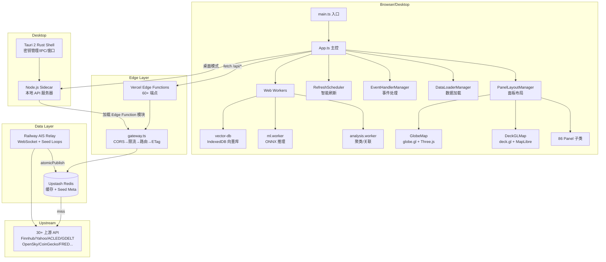
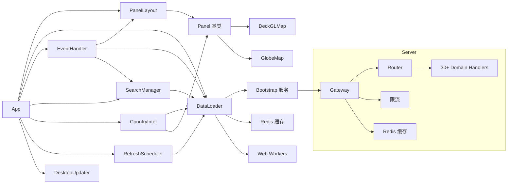
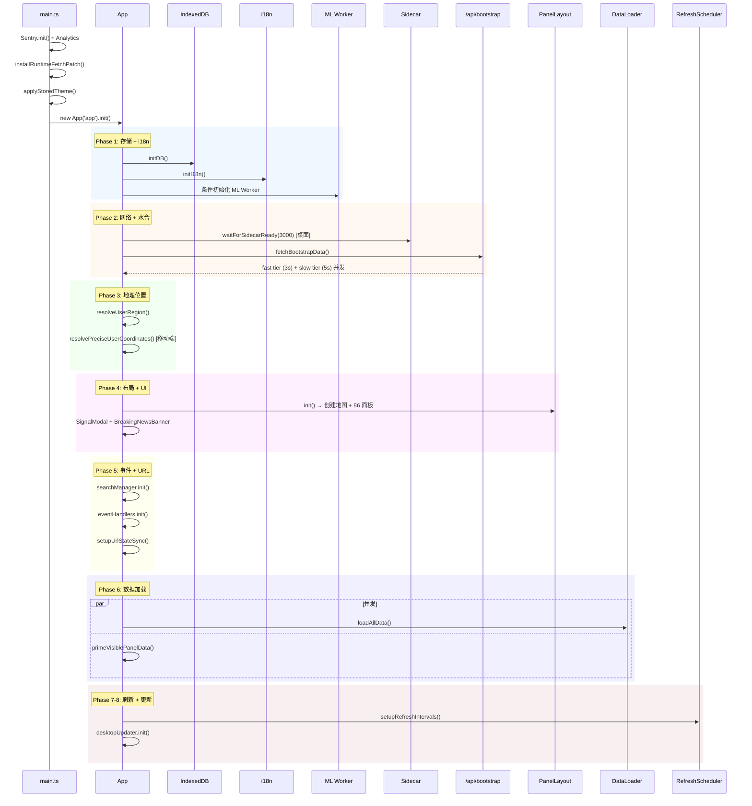
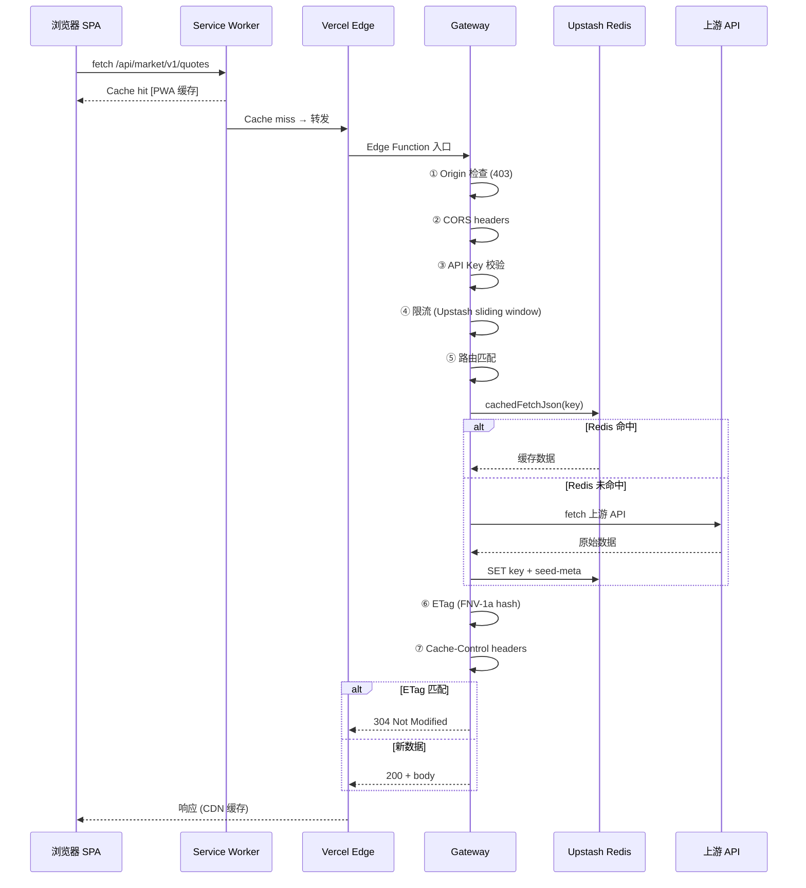

# worldmonitor 源码学习笔记

> 仓库地址：[worldmonitor](https://github.com/koala73/worldmonitor)
> 学习日期：2026-03-22

---

> **以下为 AI 源码分析**
>
> ### 一句话概括
>
> 一个 AI 驱动的实时全球情报仪表盘，聚合 435+ 新闻源、金融市场、军事追踪、气候灾害等 30+ 数据源，通过双地图引擎（3D 地球 + WebGL 平面图）和 86 个专业面板提供统一态势感知。
>
> ### 要点速览
>
> | 核心模块 | 职责 | 关键文件 |
> |---------|------|---------|
> | App 主控 | 8 阶段初始化、生命周期管理 | `src/App.ts`, `src/main.ts` |
> | 面板系统 | 86 个数据面板的基类与子类 | `src/components/Panel.ts`, `src/components/` |
> | 双地图引擎 | deck.gl 平面图 + globe.gl 3D 地球 | `src/components/DeckGLMap.ts`, `src/components/GlobeMap.ts` |
> | API 网关 | Edge Functions 网关、路由、缓存 | `server/gateway.ts`, `server/router.ts` |
> | 数据管线 | Bootstrap 水合、Seed 脚本、Redis 缓存 | `api/bootstrap.js`, `scripts/seed-*.mjs` |
> | ML Worker | 浏览器端 ONNX 推理（嵌入/情感/摘要） | `src/workers/ml.worker.ts` |
> | 桌面应用 | Tauri 2 + Node.js Sidecar | `src-tauri/`, `src/services/runtime.ts` |

---

## 项目简介

World Monitor 是一个实时全球情报仪表盘，将地缘政治、军事活动、金融市场、网络威胁、气候事件、海上追踪、航空监控等多维数据聚合为统一的操作画面。它使用 AI（Ollama/Groq/OpenRouter + 浏览器端 Transformers.js）对 435+ 新闻源进行智能摘要和关联分析，通过双地图引擎（deck.gl WebGL 平面图 + globe.gl 3D 地球）和 45 个数据层渲染全球态势。项目支持 5 个站点变体（world/tech/finance/commodity/happy）从同一代码库构建，并提供 macOS/Windows/Linux 原生桌面应用（Tauri 2）。

## 技术栈

| 类别 | 技术 |
|------|------|
| 语言 | TypeScript (前端/API), Rust (Tauri 桌面壳) |
| 框架 | Vanilla TypeScript SPA, Preact (局部), Vite |
| 地图引擎 | deck.gl + MapLibre GL (平面图), globe.gl + Three.js (3D 地球) |
| AI/ML | Ollama / Groq / OpenRouter, @xenova/transformers (浏览器端 ONNX) |
| API 契约 | Protocol Buffers (sebuf 框架, 92 protos, 22 services) |
| 部署 | Vercel Edge Functions (60+), Railway (AIS Relay), Tauri 2, Docker, PWA |
| 缓存 | Upstash Redis, 4 层缓存架构, CDN, Service Worker |
| 测试 | node:test (单元/集成), Playwright (E2E), Biome (lint) |
| 构建工具 | Vite, esbuild, tsc |
| 依赖管理 | npm |

## 目录结构

```
.
├── api/                      # Vercel Edge Functions（自包含 JS，不可导入 src/ 或 server/）
│   ├── _*.js                 # 共享 helpers（CORS、限流、API Key、Relay 代理）
│   └── <domain>/             # 按领域组织端点（aviation/、climate/、conflict/ 等）
├── server/                   # 服务端代码（打包进 Edge Functions）
│   ├── gateway.ts            # Domain Gateway 工厂（CORS → 限流 → 路由 → ETag）
│   ├── router.ts             # 路由匹配器（静态 Map O(1) + 动态扫描）
│   ├── _shared/              # Redis 缓存、限流、LLM 工具
│   └── worldmonitor/         # 30+ 数据域 handler（mirrors proto 结构）
├── src/                      # 浏览器 SPA（TypeScript）
│   ├── main.ts               # 入口：Sentry、Analytics、fetch patch、App 实例化
│   ├── App.ts                # 核心 App 类，8 阶段 init()
│   ├── app/                  # 管理器模块（布局、数据加载、事件、搜索、刷新等）
│   ├── components/           # Panel 基类 + 86 个面板子类 + 地图组件
│   ├── config/               # 变体配置、面板定义、地图层定义、市场配置
│   ├── generated/            # Proto 生成的 client/server stubs（禁止手动编辑）
│   ├── locales/              # 21 语言 i18n 翻译文件
│   ├── services/             # 业务逻辑（bootstrap、i18n、runtime、analytics 等）
│   ├── workers/              # Web Workers（分析聚类、ML 推理、向量数据库）
│   └── utils/                # 工具函数（circuit-breaker、theme、URL state）
├── src-tauri/                # Tauri 2 桌面壳（Rust）
│   ├── src/main.rs           # Rust 主进程（密钥管理、IPC、窗口管理）
│   └── sidecar/              # Node.js Sidecar API 服务器
├── proto/                    # Protobuf 服务定义（sebuf 框架）
├── scripts/                  # Seed 脚本、构建工具、AIS Relay 服务
├── shared/                   # 跨平台 JSON 配置（市场符号、RSS 域名）
├── tests/                    # 单元/集成测试（node:test）
├── e2e/                      # Playwright E2E 测试
├── data/                     # 静态数据文件（conservation、renewable、happiness）
├── blog-site/                # 静态博客（构建产物进入 public/blog/）
├── docs/                     # Mintlify 文档站
└── docker/                   # Docker 配置 + nginx（Railway 部署）
```

## 架构设计

### 整体架构

World Monitor 采用**前端重、后端轻**的架构策略。前端是一个功能丰富的 TypeScript SPA，承担了数据渲染、ML 推理、聚类分析等重计算；后端由 60+ Vercel Edge Functions 组成，作为上游 API 的缓存代理层，不持有业务状态。数据通过 Railway 上的 AIS Relay 服务持续 Seed 到 Upstash Redis，前端通过 Bootstrap 端点一次性水合，后续通过智能轮询刷新。



### 核心模块

#### 1. App 主控（`src/App.ts`）

**职责**：应用生命周期管理、8 阶段初始化编排、模块协调

- **核心类**: `App` 类持有 `AppContext`（中央可变状态对象）和所有管理器实例
- **关键方法**: `init()` — 8 阶段异步初始化；`destroy()` — 清理所有模块
- **模块注册**: 通过 `AppModule` 接口 (`init()`, `destroy()`) 统一管理生命周期

#### 2. 面板系统（`src/components/Panel.ts` + 86 个子类）

**职责**：所有数据面板的基类，提供统一的渲染、状态管理、交互模式

- **基类能力**: `setContent(html)` 防抖渲染(150ms)、拖拽调整大小（行跨度 1-4、列跨度 1-3）、加载/错误/锁定状态切换、项目计数动画、自动重试退避
- **关键子类**: NewsPanel（40+ 新闻源聚合）、MarketPanel（股票/加密/商品）、CIIPanel（复合不稳定指数）、StrategicPosturePanel（军事态势评估）、SatelliteFiresPanel（卫星火灾检测）

#### 3. 双地图引擎

**DeckGLMap**（`src/components/DeckGLMap.ts`）：
- deck.gl + MapLibre GL 的 WebGL 高性能渲染
- 支持 ScatterplotLayer、GeoJsonLayer、PathLayer、IconLayer、HeatmapLayer、H3HexagonLayer 等
- Supercluster 标记聚类、PMTiles 自托管底图

**GlobeMap**（`src/components/GlobeMap.ts`）：
- globe.gl 3D 交互地球
- 统一 `htmlElementsData` 数组 + `_kind` 判别器
- 地形纹理、大气着色器、60 秒无操作自动旋转

#### 4. API 网关层（`server/gateway.ts`）

**职责**：Vercel Edge Functions 的统一入口管线

- **10 步管线**: Origin 检查 → CORS → Preflight → API Key → 限流 → 路由匹配 → POST→GET 兼容 → Handler → ETag(FNV-1a) → Cache Header
- **6 级缓存**: fast(300s) / medium(600s) / slow(1800s) / static(7200s) / daily(86400s) / no-store(0)
- **路由匹配**: 静态 Map O(1) 查找 + 动态 `{param}` 线性扫描

#### 5. 数据管线

**Bootstrap 水合**（`api/bootstrap.js` + `src/services/bootstrap.ts`）：
- 首次加载通过 `/api/bootstrap` 批量读取 Redis 缓存键
- 两级并发：fast(3s 超时) + slow(5s 超时)，独立 AbortController
- 面板按需消费 `getHydratedData(key)`

**Seed 脚本**（`scripts/seed-*.mjs`）：
- `atomicPublish()`: Redis 锁(SET NX) → 数据校验 → 写缓存键 → 写 `seed-meta:<key>` → 释放锁
- Railway Relay 持续运行 Seed Loop（市场、航空、GPSJAM、风险评分等）

#### 6. Web Workers

| Worker | 文件 | 职责 |
|--------|------|------|
| analysis.worker | `src/workers/analysis.worker.ts` | Jaccard 聚类 O(n²)、跨域关联检测、信号去重(30min TTL) |
| ml.worker | `src/workers/ml.worker.ts` | ONNX 推理(@xenova/transformers): 嵌入、情感、摘要、NER |
| vector-db | `src/workers/vector-db.ts` | IndexedDB 向量存储(最大 5000)、语义搜索 |

#### 7. 桌面应用（`src-tauri/`）

- **Tauri 2 Rust Shell**: 平台密钥管理(macOS Keychain/Windows Credential Manager)、IPC 命令、窗口管理
- **Node.js Sidecar**: 动态加载 Edge Function 模块、monkey-patch fetch 强制 IPv4、密钥注入
- **Fetch Patch**: 桌面端 `window.fetch` 拦截，`/api/*` 路由到 Sidecar，失败回退云 API

### 模块依赖关系



## 核心流程

### 流程一：应用 8 阶段初始化



**Phase 1** 初始化 IndexedDB、加载 i18n 翻译、条件启动 ML Worker（根据 AI Flow 设置）。

**Phase 2** 桌面端等待 Sidecar 就绪后，从 `/api/bootstrap` 两级并发水合 Redis 缓存到内存（fast tier 3s 超时 + slow tier 5s 超时，独立 AbortController）。

**Phase 3** 并行解析用户地理区域和精确坐标（仅移动端且无 URL 坐标参数时）。

**Phase 4** `PanelLayoutManager.init()` 创建地图容器和所有启用的面板实例，设置拖拽调整大小，渲染关键地缘政治横幅。

**Phase 5** 启动全局搜索（Cmd+K）、事件监听、双向 URL ↔ 状态同步，并捕获深层链接参数。

**Phase 6** `loadAllData()` 和 `primeVisiblePanelData()` **并发**运行，分别加载全量数据和视口内面板的优先数据。

**Phase 7-8** 注册所有定期刷新任务（带条件轮询：面板是否在视口内、标签是否可见），桌面端启动更新检查。

### 流程二：数据请求与 4 层缓存



**4 层缓存层级**：
1. **Bootstrap Seed**：Railway Relay 定期写入 Redis（`atomicPublish` 带锁）
2. **Vercel 实例内存**：每个 Edge Function 实例短 TTL 缓存
3. **Redis（Upstash）**：跨实例共享缓存，`cachedFetchJson()` 合并并发请求
4. **上游 API Fetch**：缓存未命中时请求上游，结果写回 Redis + `seed-meta`

**防踩踏（Stampede Protection）**：当多个并发请求同时缓存未命中时，`cachedFetchJson()` 确保只有一个请求实际访问上游 API，其余等待共享结果。

## 关键设计亮点

### 1. 智能刷新调度（RefreshScheduler）

**解决的问题**：86 个面板的数据需要不同频率刷新，同时避免隐藏标签页的无用请求和标签切回时的刷新风暴。

**实现方式**（`src/app/refresh-scheduler.ts`）：
- **条件轮询**：每个刷新任务绑定 `shouldRefresh()` 条件函数，只有面板在视口附近 400px 内时才执行
- **标签暂停**：`visibilitychange` 事件触发暂停/恢复，记录 `hiddenSince` 时间戳
- **错开恢复**：标签切回时按间隔升序排列过期任务，前 4 个间隔 100ms，其余 300ms，防止瞬时请求洪峰
- **指数退避**：失败时自动 backoff（最大 4x），成功后重置

**为什么这样设计**：全局 setInterval 会导致隐藏标签累积大量无用请求，切回时同时触发造成 API 过载。条件 + 错开策略将峰值请求量降低数个量级。

### 2. Bootstrap 两级并发水合

**解决的问题**：首次加载需要从 Redis 获取大量缓存键，单一请求超时风险高。

**实现方式**（`api/bootstrap.js` + `src/services/bootstrap.ts`）：
- 将缓存键分为 fast tier 和 slow tier
- 两组独立 AbortController，分别设置 3s 和 5s 超时
- `Promise.all` 并发请求，任一组超时不影响另一组
- 水合数据通过 `getHydratedData(key)` 按需消费
- 支持 IndexedDB 离线缓存回退（`source: 'cached' | 'live' | 'mixed'`）

**为什么这样设计**：将关键数据（市场报价、突发新闻）放入 fast tier 确保首屏速度，低优先级数据（历史分析、参考数据）放入 slow tier 允许更长加载时间，避免一个慢键拖垮整体体验。

### 3. Edge Function 自包含约束

**解决的问题**：Vercel Edge Functions 运行在独立 V8 Isolate 中，不能共享运行时状态，跨目录导入会导致部署失败。

**实现方式**：
- `api/*.js` 文件**禁止**导入 `../src/` 或 `../server/`，只允许同目录 `_*.js` helpers 和 npm 包
- `tests/edge-functions.test.mjs` 自动扫描所有 Edge Function 检测违规导入
- pre-push hook 运行 esbuild bundle check 确保每个端点可独立打包
- `server/` 代码通过 `createDomainGateway()` 工厂函数打包进 Edge Function

**为什么这样设计**：严格的导入边界确保每个 Edge Function 在 Vercel 的无状态 V8 Isolate 中独立运行，避免因意外依赖导致的部署失败或运行时错误。

### 4. Tauri 桌面端 Fetch Patch 与 Sidecar 架构

**解决的问题**：桌面应用需要绕过浏览器 CORS 限制直接访问上游 API，同时复用 Edge Function 的全部逻辑。

**实现方式**（`src/services/runtime.ts` + `src-tauri/sidecar/local-api-server.mjs`）：
- `installRuntimeFetchPatch()` 替换 `window.fetch`，将 `/api/*` 请求路由到本地 Sidecar
- Sidecar 是 Node.js 进程，动态加载 `api/` 目录的 Edge Function 模块
- 密钥通过 Tauri IPC 从平台 Keyring 注入 Sidecar 环境变量
- monkey-patch `globalThis.fetch` 强制 IPv4（许多政府 API 的 IPv6 不可用）
- 失败自动回退到云 API

**为什么这样设计**：复用同一套 Edge Function 代码避免维护两套 API 实现；Sidecar 架构让密钥永远不暴露给渲染进程；IPv4 强制解决了实际部署中的兼容性问题。

### 5. Proto/RPC 契约驱动开发

**解决的问题**：30+ 数据域、92 个 Proto 定义、前后端类型一致性。

**实现方式**（`proto/` + `Makefile`）：
- 使用 sebuf 框架扩展 Protocol Buffers，`(sebuf.http.config)` 注解映射 RPC 到 HTTP 路径
- `buf generate` 同时生成 TypeScript client stubs（`src/generated/client/`）和 server types（`src/generated/server/`）
- CI 工作流 `proto-check.yml` 确保生成代码与提交代码一致
- 22 个 service 定义覆盖所有数据域的完整 API 契约

**为什么这样设计**：单一数据源定义（Proto）自动生成前后端代码，消除手动同步的类型不一致风险，CI 强制执行确保不会漂移。
