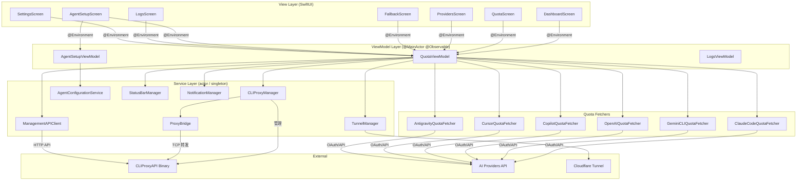
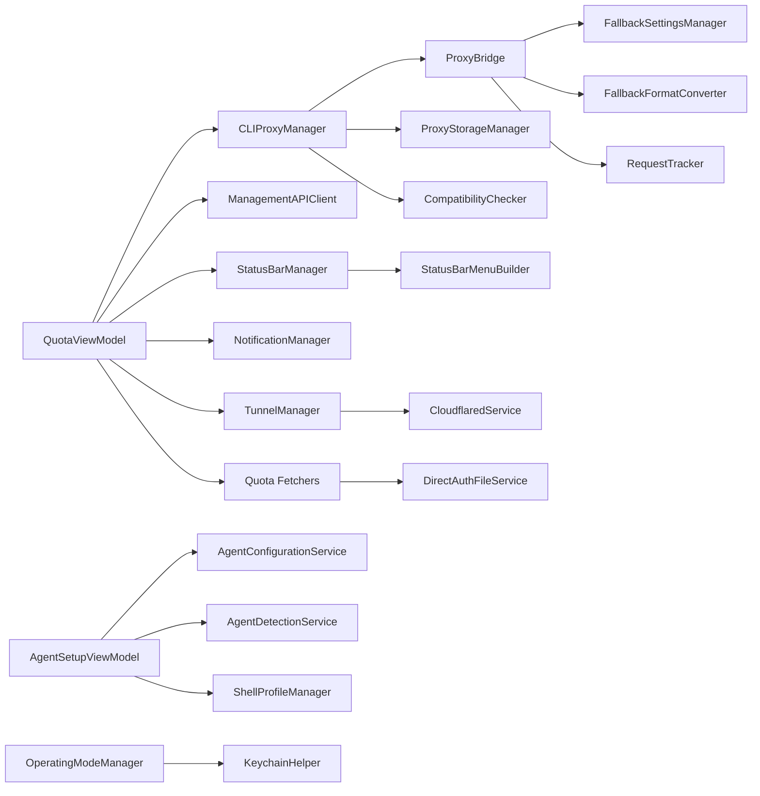
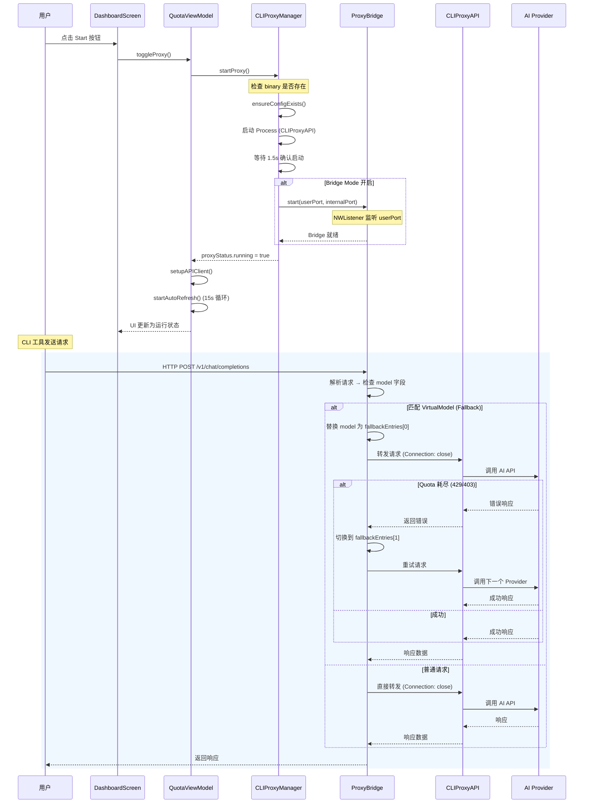
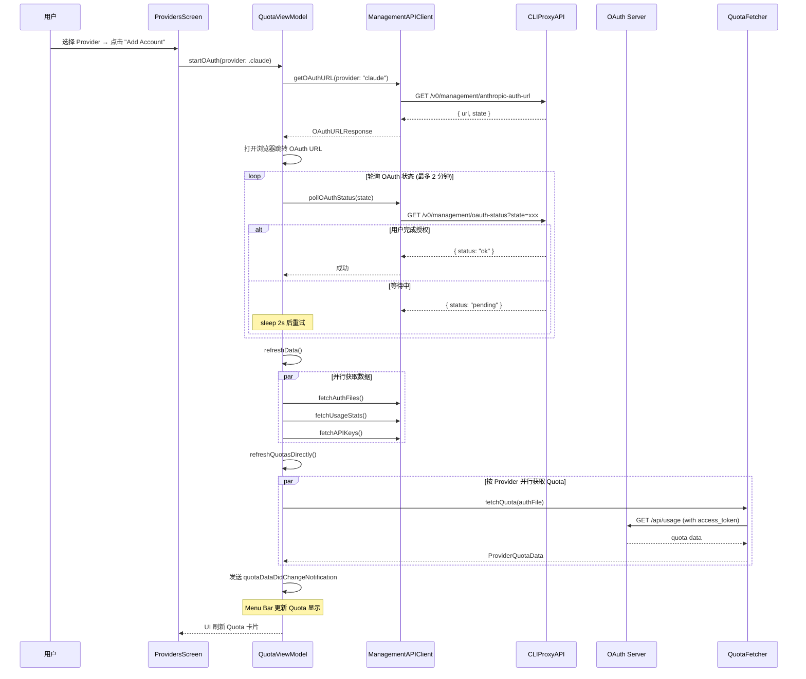

# quotio 源码学习笔记

> 仓库地址：[quotio](https://github.com/nguyenphutrong/quotio)
> 学习日期：2026-03-22

---

> **以下为 AI 源码分析**
>
> ### 一句话概括
>
> Quotio 是一个 macOS 原生应用，作为本地 AI 代理代理服务器（CLIProxyAPI）的统一管理前端，帮助用户集中管理多个 AI Provider 账户、追踪 Quota 用量、配置 CLI 工具，并提供智能 Model Fallback 路由。
>
> ### 要点速览
>
> | 核心模块 | 职责 | 关键文件 |
> |---------|------|---------|
> | 应用入口 & 引导 | App 生命周期、Onboarding、Menu Bar 初始化 | `QuotioApp.swift` |
> | Proxy 管理 | CLIProxyAPI 二进制的下载/启动/停止/升级 | `CLIProxyManager.swift` |
> | ProxyBridge | TCP 中间层代理，解决 keep-alive 连接过期问题 + Model Fallback | `ProxyBridge.swift` |
> | Management API | 与 CLIProxyAPI 管理端口通信的 actor 客户端 | `ManagementAPIClient.swift` |
> | Quota Fetchers | 各 Provider 的 Quota 抓取（OAuth / CLI / 浏览器 Cookie） | `QuotaFetchers/*.swift` |
> | Agent 配置 | 一键配置 Claude Code / Codex / Gemini 等 CLI 工具 | `AgentConfigurationService.swift` |
> | Menu Bar | macOS 状态栏 Quota 展示 + Native NSMenu | `StatusBarManager.swift`, `StatusBarMenuBuilder.swift` |
> | Tunnel | Cloudflare Tunnel 集成，远程访问代理 | `TunnelManager.swift`, `CloudflaredService.swift` |
> | ViewModel | MVVM 核心状态管理，驱动所有 UI 界面 | `QuotaViewModel.swift` |

---

## 项目简介

Quotio 是一个面向 macOS 的原生 SwiftUI 应用（最低支持 macOS 14.0 Sonoma），充当 **CLIProxyAPI** 的 GUI 管理前端。CLIProxyAPI 是一个本地 HTTP 代理服务器，能够聚合多个 AI Provider（Gemini、Claude、OpenAI Codex、Qwen、Vertex AI、Copilot 等）的认证凭据，对外暴露统一的 OpenAI 兼容 API 端点。

Quotio 解决的核心问题是：**AI 编程助手用户通常同时拥有多个 Provider 的多个账户，手动管理认证文件、追踪各账户 Quota 用量、在 Quota 耗尽时切换账户，非常繁琐**。Quotio 通过 GUI 界面实现一键 OAuth 登录、实时 Quota 监控、智能路由策略（Round Robin / Fill First）、Model Fallback 自动重试、以及对 Claude Code / Codex CLI / Gemini CLI 等工具的一键代理配置。

## 技术栈

| 类别 | 技术 |
|------|------|
| 语言 | Swift 6.0 (Strict Concurrency) |
| 框架 | SwiftUI + AppKit (Menu Bar) |
| 构建工具 | Xcode / xcodebuild |
| 依赖管理 | 无外部包管理器，Sparkle 通过 Xcode SPM 集成 |
| 测试框架 | 无自动化测试（手动测试） |
| 并发模型 | Swift Concurrency (async/await, actor, @MainActor) |
| 更新机制 | Sparkle (auto-update) + Atom Feed 轮询 |
| 本地存储 | UserDefaults + Keychain (KeychainHelper) + 文件系统 |

## 目录结构

```
Quotio/
├── QuotioApp.swift                 # 应用入口、AppBootstrap、AppDelegate、ContentView
├── Models/                         # 数据模型层
│   ├── Models.swift                # 核心类型：AIProvider、AuthFile、ProxyStatus、UsageStats
│   ├── AgentModels.swift           # CLI Agent 类型定义与配置模型
│   ├── FallbackModels.swift        # Model Fallback：VirtualModel、FallbackEntry
│   ├── OperatingMode.swift         # 三种运行模式：Monitor / LocalProxy / RemoteProxy
│   ├── Constants.swift             # 全局常量
│   ├── MenuBarSettings.swift       # Menu Bar 展示配置
│   ├── TunnelModels.swift          # Cloudflare Tunnel 状态模型
│   ├── CustomProviderModels.swift  # 自定义 Provider 配置
│   └── RequestLog.swift            # 请求日志模型
├── ViewModels/                     # MVVM ViewModel 层
│   ├── QuotaViewModel.swift        # 主 ViewModel：Quota 刷新、Proxy 控制、OAuth 流程
│   ├── LogsViewModel.swift         # 日志查看 ViewModel
│   └── AgentSetupViewModel.swift   # Agent 配置 ViewModel
├── Services/                       # 服务层（业务逻辑与外部交互）
│   ├── Proxy/
│   │   ├── CLIProxyManager.swift   # Proxy 生命周期：下载/启动/停止/升级/健康检查
│   │   ├── ProxyBridge.swift       # NWListener TCP 中间代理 + Fallback 处理
│   │   ├── FallbackFormatConverter.swift # Fallback 请求体格式转换
│   │   └── ProxyStorageManager.swift     # 版本化二进制存储管理
│   ├── ManagementAPIClient.swift   # actor：与 CLIProxyAPI Management API 通信
│   ├── AgentConfigurationService.swift   # 生成各 CLI Agent 的配置文件
│   ├── AgentDetectionService.swift       # 检测已安装的 CLI Agent
│   ├── StatusBarManager.swift      # NSStatusBar + NSMenu 管理
│   ├── StatusBarMenuBuilder.swift  # Native Menu 构建器
│   ├── NotificationManager.swift   # 系统通知（低 Quota 告警等）
│   ├── DirectAuthFileService.swift # 直接扫描文件系统获取认证文件
│   ├── KeychainHelper.swift        # Keychain 存取工具
│   ├── QuotaFetchers/              # 各 Provider 的 Quota 获取器
│   │   ├── ClaudeCodeQuotaFetcher.swift
│   │   ├── CodexCLIQuotaFetcher.swift
│   │   ├── GeminiCLIQuotaFetcher.swift
│   │   ├── CopilotQuotaFetcher.swift
│   │   ├── CursorQuotaFetcher.swift
│   │   ├── TraeQuotaFetcher.swift
│   │   ├── KiroQuotaFetcher.swift
│   │   └── OpenAIQuotaFetcher.swift
│   ├── Antigravity/                # Antigravity Provider 专用服务
│   │   ├── AntigravityAccountSwitcher.swift
│   │   ├── AntigravityDatabaseService.swift
│   │   ├── AntigravityProtobufHandler.swift
│   │   └── AntigravityProcessManager.swift
│   ├── Tunnel/                     # Cloudflare Tunnel 集成
│   │   ├── TunnelManager.swift
│   │   └── CloudflaredService.swift
│   └── ...                         # 其他服务（更新、国际化、Shell Profile 等）
├── Views/
│   ├── Screens/                    # 主要页面
│   │   ├── DashboardScreen.swift   # 仪表盘：流量统计、快速操作
│   │   ├── QuotaScreen.swift       # Quota 监控：各 Provider 用量展示
│   │   ├── ProvidersScreen.swift   # Provider 管理：OAuth 登录、账户列表
│   │   ├── FallbackScreen.swift    # Fallback 配置：Virtual Model 管理
│   │   ├── AgentSetupScreen.swift  # Agent 配置：一键配置 CLI 工具
│   │   ├── APIKeysScreen.swift     # API Key 管理
│   │   ├── LogsScreen.swift        # 请求日志查看
│   │   └── SettingsScreen.swift    # 设置
│   ├── Components/                 # 可复用 UI 组件
│   │   ├── QuotaCard.swift, QuotaProgressBar.swift, RingProgressView.swift
│   │   ├── AccountRow.swift, ProviderIcon.swift, ProviderDisclosureGroup.swift
│   │   ├── AgentCard.swift, AgentConfigSheet.swift
│   │   ├── FallbackSheets.swift, SidebarView.swift
│   │   └── ...
│   └── Onboarding/                 # 引导流程
│       ├── OnboardingFlow.swift
│       ├── WelcomeStep.swift, ModeSelectionStep.swift
│       ├── ProviderStep.swift, RemoteSetupStep.swift
│       └── CompletionStep.swift
├── Config/                         # Xcode 构建配置
│   ├── Debug.xcconfig
│   ├── Release.xcconfig
│   └── Local.xcconfig.example
└── scripts/                        # 构建/发布脚本
    ├── build.sh, release.sh, package.sh, notarize.sh
    └── bump-version.sh, generate-appcast.sh
```

## 架构设计

### 整体架构

Quotio 采用 **MVVM + Service Layer** 架构，充分利用 Swift 6 的并发特性（`@Observable`、`actor`、`async/await`）实现线程安全的响应式 UI。

核心设计思路：
1. **View 层**使用 SwiftUI 声明式 UI，通过 `@Environment` 注入 ViewModel
2. **ViewModel 层**用 `@MainActor @Observable` 保证 UI 线程安全
3. **Service 层**使用 `actor` 实现并发安全的网络/IO 操作
4. **两层代理架构**：ProxyBridge（进程内 NWListener）作为 CLI 工具与 CLIProxyAPI 之间的中间层



### 核心模块

#### 1. AppBootstrap - 应用引导模块

**职责**：管理应用启动生命周期，确保在无窗口模式（开机启动）下也能正确初始化服务。

**核心文件**：`QuotioApp.swift`

**关键设计**：
- `AppBootstrap` 是 Singleton，由 `AppDelegate.applicationDidFinishLaunching` 和 SwiftUI Window `.task` 双重触发，内部使用 `hasInitialized` 标志确保幂等
- 支持 Onboarding 延迟初始化：首次安装时等待用户选择运行模式后再初始化
- 监听 `quotaDataDidChangeNotification` 更新 Menu Bar，实现窗口关闭后仍能实时更新状态栏

#### 2. CLIProxyManager - 代理生命周期管理

**职责**：管理 CLIProxyAPI 二进制的下载、安装、启动、停止、版本升级、健康检查。

**核心文件**：`Services/Proxy/CLIProxyManager.swift`

**关键接口**：
- `start() async` / `stop()` - 启停 CLIProxyAPI 进程
- `downloadBinary() async` - 从 GitHub Release 下载二进制
- `terminateProxyOnShutdown()` - 应用退出时通过端口号查杀进程（`lsof -ti`）
- 健康检查：每 30 秒探测 proxy，连续 3 次失败自动重启

**与其他模块关系**：
- 被 `QuotaViewModel` 持有并驱动
- 内含 `ProxyBridge` 实例
- 通过 `ProxyStorageManager` 管理版本化二进制存储

#### 3. ProxyBridge - TCP 中间代理

**职责**：解决 HTTP keep-alive 连接在空闲后变 stale 的问题，同时实现 Model Fallback 自动重试。

**核心文件**：`Services/Proxy/ProxyBridge.swift`

**架构**：
```
CLI Tools → ProxyBridge (user port, NWListener) → CLIProxyAPI (internal port)
```

**关键设计**：
- 基于 Apple `Network.framework` 的 `NWListener`，在进程内运行
- 强制所有请求添加 `Connection: close` 头，防止 stale connection
- 解析请求体中的 model 字段，匹配 VirtualModel 后按优先级链尝试 Fallback
- 使用 `FallbackContext` 值类型追踪重试状态（immutable + copy-on-write 模式）

#### 4. ManagementAPIClient - 管理 API 客户端

**职责**：与 CLIProxyAPI 的 Management API（`/v0/management/*`）通信，获取 auth files、usage stats、API keys 等。

**核心文件**：`Services/ManagementAPIClient.swift`

**关键设计**：
- 使用 Swift `actor` 保证线程安全
- 区分 local / remote 两种连接模式，超时和重试策略不同
- Local：15s 请求超时，4 次重试（带指数退避）
- Remote：30s 请求超时，5 次重试

#### 5. QuotaViewModel - 主 ViewModel

**职责**：应用的核心状态容器，协调所有数据获取、UI 状态、Proxy 控制。

**核心文件**：`ViewModels/QuotaViewModel.swift`

**关键设计**：
- `@MainActor @Observable` 确保所有属性变更自动通知 SwiftUI
- 持有十多个 `@ObservationIgnored` 的 Quota Fetcher 实例，每个对应一个 Provider
- `refreshData()` 使用 `async let` 并行请求多个 API
- 定时自动刷新（15 秒间隔的 `Task` 循环），支持取消
- 发布 `quotaDataDidChangeNotification` 通知 Menu Bar 更新

#### 6. OperatingModeManager - 运行模式管理

**职责**：管理三种运行模式的切换与持久化。

**核心文件**：`Models/OperatingMode.swift`

**三种模式**：
- **Monitor** (Quota-Only)：仅追踪 Quota，不运行代理
- **LocalProxy**：运行本地 CLIProxyAPI，完整功能
- **RemoteProxy**：连接远程 CLIProxyAPI 实例

包含从旧版 `AppMode + ConnectionMode` 的自动迁移逻辑。

#### 7. Quota Fetchers - Provider Quota 获取

**职责**：各 Provider 的 Quota 用量获取，策略各不相同。

**核心文件**：`Services/QuotaFetchers/*.swift`

| Provider | 获取方式 |
|----------|---------|
| Claude Code | 读取 `~/.cli-proxy-api/` 下的认证文件，调用 Anthropic OAuth API |
| Gemini CLI | 类似，调用 Google API |
| OpenAI Codex | 调用 OpenAI API |
| Copilot | GitHub API |
| Cursor / Trae | 读取本地应用数据库（浏览器 Session） |
| Antigravity | SQLite 数据库 + Protobuf 解码 |

### 模块依赖关系



## 核心流程

### 流程一：Proxy 启动与请求处理

这是 Quotio 最核心的流程，展示了从用户点击 "Start" 到 CLI 工具请求被代理转发的完整链路。



**关键逻辑说明**：

1. **启动阶段**：`CLIProxyManager` 使用 `Process` API 启动 CLIProxyAPI 二进制，等待 1.5 秒后检查进程是否存活
2. **Bridge 模式**：当开启时，CLIProxyAPI 绑定到 `internalPort`（用户端口 + 1000），ProxyBridge 的 NWListener 监听 `userPort` 并转发
3. **Fallback 机制**：ProxyBridge 解析 HTTP 请求体中的 `model` 字段，匹配 `FallbackConfiguration` 中的 VirtualModel，按优先级链自动重试
4. **健康检查**：启动后每 30 秒检查一次，连续 3 次失败自动重启 proxy

### 流程二：OAuth 登录与 Quota 获取

展示用户添加 AI Provider 账户并获取 Quota 数据的流程。



**关键逻辑说明**：

1. **OAuth 流程**：通过 CLIProxyAPI 的 Management API 获取 OAuth URL，打开浏览器让用户授权，然后轮询状态（2 秒间隔，最多 60 次）
2. **Quota 获取策略**：不同 Provider 使用不同的 Fetcher，Claude 通过 OAuth API 获取、Cursor/Trae 通过读取本地数据库获取
3. **并行刷新**：使用 `async let` 并行请求 auth files、usage stats、API keys，最大化刷新效率
4. **通知机制**：Quota 数据变化后发送 `NSNotification`，Menu Bar 监听并更新状态栏显示

## 关键设计亮点

### 1. 两层代理架构解决 Stale Connection 问题

**问题**：CLI 工具使用 HTTP keep-alive 连接到代理，但长时间空闲后连接会 stale，导致请求超时。

**实现方式**：在 CLIProxyAPI 前面加了一层 `ProxyBridge`（`Services/Proxy/ProxyBridge.swift`），基于 Apple `Network.framework` 的 `NWListener` 实现进程内 TCP 代理。强制每个请求添加 `Connection: close` 头，消除 keep-alive stale 问题。

**为什么这样设计**：不修改 CLIProxyAPI（外部二进制），而是在应用层添加透明代理。进程内运行避免了额外的进程管理复杂度，`NWListener` 性能优秀且原生支持 macOS。

### 2. VirtualModel + FallbackEntry 的弹性路由机制

**问题**：单个 AI Provider 的 Quota 耗尽后需要手动切换到其他 Provider。

**实现方式**：`FallbackModels.swift` 定义了 `VirtualModel` 概念 — 一个虚拟模型名映射到多个真实的 Provider + Model 组合（`FallbackEntry`），按优先级排序。ProxyBridge 在转发请求时检测到虚拟模型名后，自动按链尝试，Quota 耗尽（429/403）时切换到下一个。

**为什么这样设计**：对 CLI 工具完全透明，用户只需配置一个虚拟模型名（如 `quotio-opus-4-6-thinking`），Quotio 自动处理跨 Provider 的 Fallback。`FallbackContext` 采用不可变值类型 + copy-on-write，确保并发安全。

### 3. 三种运行模式的统一抽象

**问题**：不同用户有不同需求 — 有人只想看 Quota，有人需要完整代理，有人需要远程连接。

**实现方式**：`OperatingMode` enum（`OperatingMode.swift`）统一了 Monitor / LocalProxy / RemoteProxy 三种模式，每种模式定义了可见页面、支持的功能、Feature 列表。`OperatingModeManager` Singleton 管理模式切换和持久化，包含从旧版 `AppMode + ConnectionMode` 的自动迁移。

**为什么这样设计**：原始设计使用两层枚举（AppMode + ConnectionMode），组合爆炸且难以维护。重构为单一 `OperatingMode` 后，每个模式的能力边界清晰，UI 可以直接查询 `mode.supportsProxy` 等属性，避免了复杂的 if-else 判断。

### 4. AppBootstrap 的双触发幂等初始化

**问题**：macOS App 可能在无窗口状态下启动（开机自启 + 隐藏 Dock），需要确保 Menu Bar 和 Proxy 正常初始化。

**实现方式**：`AppBootstrap`（`QuotioApp.swift`）使用 Singleton 模式，同时被 `AppDelegate.applicationDidFinishLaunching` 和 SwiftUI Window `.task` 触发。内部 `hasInitialized` 标志确保只执行一次。

**为什么这样设计**：SwiftUI 的 `WindowGroup` 只在窗口可见时才执行 `.task`，但用户可能设置了 `showInDock=false`（无窗口启动）。通过 AppDelegate 提前初始化，确保 Proxy auto-start 和 Menu Bar 在任何启动方式下都能工作。

### 5. 多策略 Quota Fetcher 的统一聚合

**问题**：各 AI Provider 的 Quota 查询方式完全不同（OAuth API / CLI 命令 / 浏览器 Cookie / SQLite 数据库 / Protobuf）。

**实现方式**：每个 Provider 有独立的 `actor` Fetcher（`QuotaFetchers/*.swift`），各自封装获取逻辑。`QuotaViewModel` 持有所有 Fetcher 实例，通过 `refreshQuotasDirectly()` 按 Provider 并行调用，结果统一为 `ProviderQuotaData` 存入 `providerQuotas` 字典。

**为什么这样设计**：各 Provider 的认证和 API 差异巨大（Antigravity 甚至需要 Protobuf 解码 + SQLite 数据库操作），强行统一接口反而增加复杂度。让每个 Fetcher 各自为政，在 ViewModel 层做聚合，既保持了灵活性又实现了统一展示。每个 Fetcher 使用 `actor` 隔离确保线程安全。
