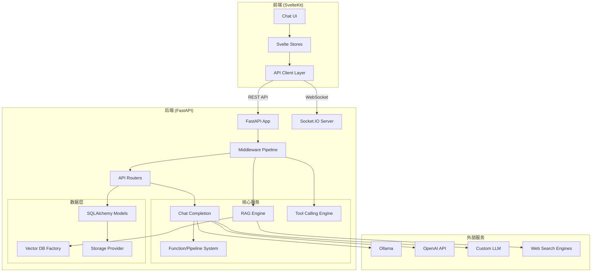
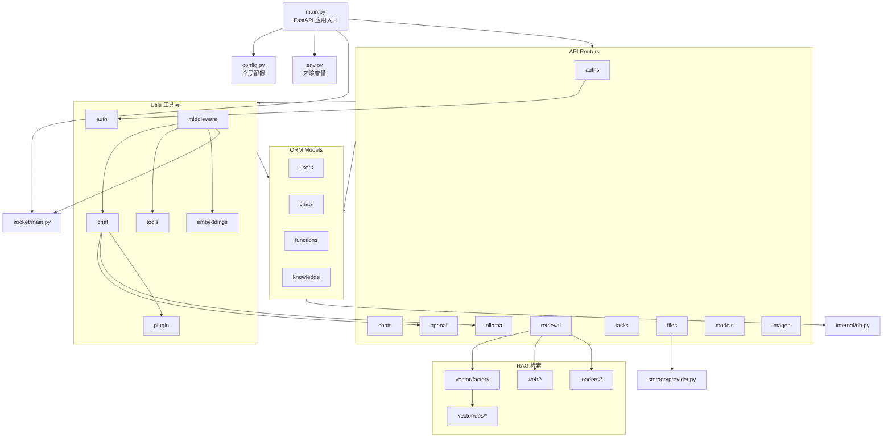
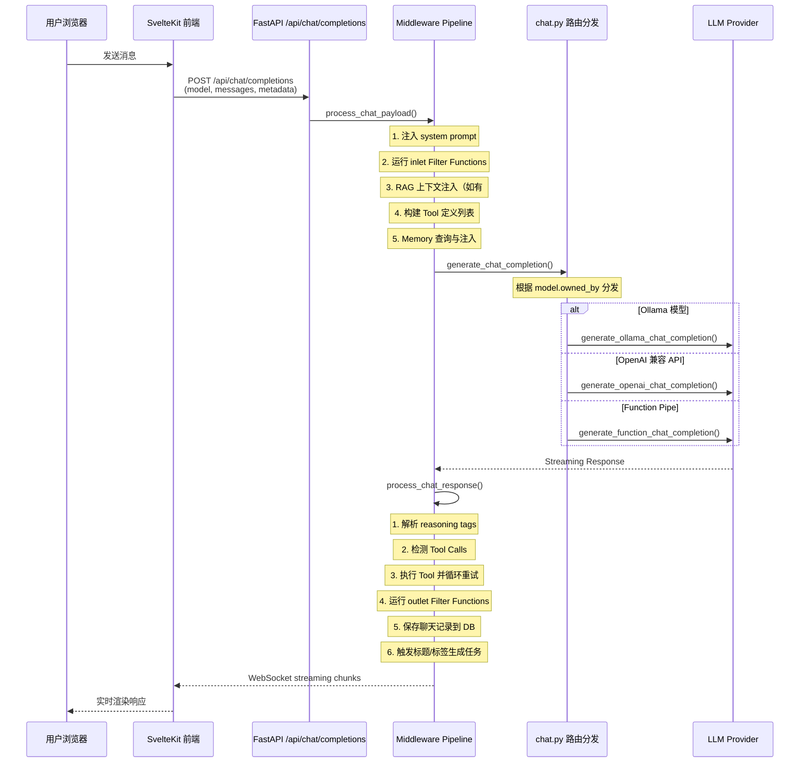
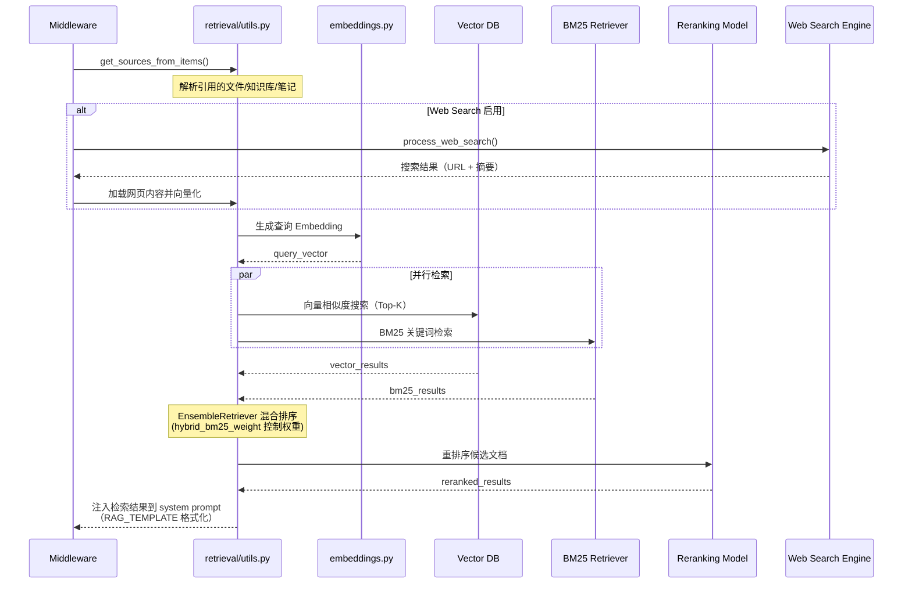

# open-webui 源码学习笔记

> 仓库地址：[open-webui](https://github.com/open-webui/open-webui)
> 学习日期：2026-03-22

---

> **以下为 AI 源码分析**
>
> ### 一句话概括
>
> Open WebUI 是一个功能丰富的自托管 AI 平台，提供类 ChatGPT 的 Web 界面，支持 Ollama、OpenAI 等多种 LLM 后端，内置 RAG、Tool Calling、图片生成等高级功能。
>
> ### 要点速览
>
> | 核心模块 | 职责 | 关键文件 |
> |---------|------|---------|
> | FastAPI 后端 | REST API + WebSocket 服务 | `backend/open_webui/main.py` |
> | SvelteKit 前端 | 响应式聊天 UI | `src/routes/(app)/+page.svelte` |
> | 模型代理层 | 统一 Ollama / OpenAI / 自定义模型接口 | `routers/ollama.py`, `routers/openai.py` |
> | RAG 检索系统 | 文档向量化、混合检索与重排序 | `retrieval/` 目录 |
> | 中间件管道 | Chat 请求预处理 / 后处理 / Tool Calling | `utils/middleware.py` |
> | WebSocket 实时通信 | 推送 streaming 响应与协同编辑 | `socket/main.py` |
> | 插件系统 | Function / Tool / Pipeline 动态加载 | `functions.py`, `utils/plugin.py` |
> | 认证与权限 | JWT + OAuth + LDAP + RBAC | `utils/auth.py`, `routers/auths.py` |

---

## 项目简介

Open WebUI 是一个可扩展的、自托管 AI 平台，设计为完全离线运行。它提供了类似 ChatGPT 的 Web 聊天界面，但支持接入多种 LLM 后端（Ollama、OpenAI 兼容 API、自定义 Pipeline），并内置了 RAG（检索增强生成）、Tool Calling、图片生成、语音交互、代码执行等企业级功能。项目采用前后端分离架构，后端基于 Python FastAPI，前端基于 SvelteKit，通过 WebSocket 实现实时 streaming 响应。

## 技术栈

| 类别 | 技术 |
|------|------|
| 语言 | Python 3.11+, TypeScript |
| 框架 | FastAPI (后端), SvelteKit + Svelte 5 (前端) |
| 构建工具 | Vite (前端), Hatch (Python 打包), Docker |
| 依赖管理 | pip / uv (Python), npm (Node.js) |
| 测试框架 | pytest (后端), Vitest (前端), Cypress (E2E), Playwright |
| 数据库 | SQLite / PostgreSQL / MariaDB (SQLAlchemy + Alembic) |
| 向量数据库 | ChromaDB, PGVector, Qdrant, Milvus, Elasticsearch, Pinecone 等 12 种 |
| 实时通信 | Socket.IO (支持 Redis 多节点) |
| 样式 | TailwindCSS v4 |

## 目录结构

```
open-webui/
├── backend/                        # Python 后端
│   └── open_webui/
│       ├── main.py                 # FastAPI 应用入口，路由注册与生命周期管理
│       ├── config.py               # 全局配置管理（Alembic 迁移 + AppConfig）
│       ├── env.py                  # 环境变量读取
│       ├── constants.py            # 错误消息等常量
│       ├── functions.py            # Function Pipe 模型的加载与调用
│       ├── tasks.py                # 后台异步任务管理（Redis 支持）
│       ├── routers/                # API 路由层（20+ 模块）
│       │   ├── auths.py            #   认证 API
│       │   ├── chats.py            #   聊天 CRUD
│       │   ├── openai.py           #   OpenAI 兼容 API 代理
│       │   ├── ollama.py           #   Ollama API 代理
│       │   ├── retrieval.py        #   RAG 检索 API
│       │   ├── tasks.py            #   任务生成（标题/标签/搜索查询）
│       │   └── ...                 #   images, audio, files, models 等
│       ├── models/                 # SQLAlchemy ORM 数据模型
│       │   ├── users.py            #   用户模型
│       │   ├── chats.py            #   聊天记录
│       │   ├── knowledge.py        #   知识库
│       │   └── ...                 #   functions, tools, prompts 等
│       ├── utils/                  # 工具层
│       │   ├── middleware.py        #   Chat 请求处理管道（核心）
│       │   ├── chat.py             #   Chat completion 路由分发
│       │   ├── auth.py             #   JWT 认证与权限校验
│       │   ├── tools.py            #   Tool Calling 执行引擎
│       │   ├── plugin.py           #   插件动态加载
│       │   └── ...                 #   embeddings, oauth, webhook 等
│       ├── retrieval/              # RAG 检索子系统
│       │   ├── utils.py            #   检索核心工具
│       │   ├── vector/             #   向量数据库抽象层
│       │   │   ├── factory.py      #     工厂模式创建 DB 客户端
│       │   │   └── dbs/            #     12 种向量 DB 适配器
│       │   ├── web/                #   Web 搜索引擎集成（15+ 提供商）
│       │   └── loaders/            #   文档加载器（YouTube, Tika, Docling 等）
│       ├── storage/                # 文件存储抽象（Local / S3 / GCS / Azure）
│       ├── socket/                 # WebSocket 服务层
│       │   ├── main.py             #   Socket.IO 服务端
│       │   └── utils.py            #   RedisDict, YdocManager
│       └── internal/               # 数据库引擎与迁移
│           └── db.py               #   SQLAlchemy 引擎初始化
├── src/                            # SvelteKit 前端
│   ├── routes/                     # 页面路由
│   │   ├── (app)/                  #   主应用（受认证保护）
│   │   │   ├── +page.svelte        #     聊天主页
│   │   │   ├── c/[id]/             #     指定聊天
│   │   │   ├── admin/              #     管理后台
│   │   │   ├── workspace/          #     工作空间（模型/知识库/工具/Prompt）
│   │   │   └── playground/         #     Playground（Completions / Images）
│   │   ├── auth/                   #   登录/注册页
│   │   └── s/[id]/                 #   分享聊天页
│   └── lib/
│       ├── apis/                   # 后端 API 调用层（与 routers 一一对应）
│       ├── stores/index.ts         # Svelte Store 状态管理
│       ├── components/             # UI 组件
│       │   ├── chat/               #   聊天核心组件
│       │   ├── admin/              #   管理页组件
│       │   ├── workspace/          #   工作空间组件
│       │   └── common/             #   通用组件
│       ├── utils/                  # 前端工具函数
│       └── i18n/                   # 国际化
├── pyproject.toml                  # Python 项目配置
├── package.json                    # Node.js 项目配置
├── Dockerfile                      # 多阶段构建（前端 + 后端）
└── docker-compose.yaml             # Docker Compose 编排
```

## 架构设计

### 整体架构

Open WebUI 采用经典的前后端分离架构，后端作为 API Gateway 统一代理多种 LLM 提供商的 API，并在请求链路上嵌入 Filter / Tool / Pipeline 等扩展机制。前端通过 SvelteKit 构建 SPA 应用，通过 REST API + WebSocket 与后端通信。



### 核心模块

#### 1. Chat Completion 路由分发 (`utils/chat.py`)

**职责**：接收前端 chat completion 请求，根据模型类型分发到不同的后端处理器。

**核心逻辑**：
- `generate_chat_completion()` — 主入口函数
- 根据 model 的 `owned_by` 属性判断是 Ollama 模型、OpenAI 兼容模型还是 Function Pipe 模型
- 对 Ollama 调用走 `generate_ollama_chat_completion()`
- 对 OpenAI 兼容 API 走 `generate_openai_chat_completion()`
- 对自定义 Function Pipe 走 `generate_function_chat_completion()`

#### 2. Middleware Pipeline (`utils/middleware.py`)

**职责**：Chat 请求的预处理和后处理管道，是整个系统最复杂的模块。

**核心文件**：`backend/open_webui/utils/middleware.py`

**关键函数**：
- `process_chat_payload()` — 请求预处理：注入 system prompt、RAG 上下文、Tool 定义、Filter 处理
- `process_chat_response()` — 响应后处理：处理 streaming 数据、提取 Tool Calls、执行代码解释器、保存聊天记录
- `build_chat_response_context()` — 构建响应上下文，管理 reasoning tags 解析

**关键设计**：
- 支持多轮 Tool Calling 循环（最多 `CHAT_RESPONSE_MAX_TOOL_CALL_RETRIES` 次）
- 处理 reasoning tags（`<think>`, `<thinking>` 等）的解析和分离
- 实时通过 WebSocket 推送 streaming chunks 给前端

#### 3. RAG 检索子系统 (`retrieval/`)

**职责**：实现文档的向量化存储、检索、重排序，支持混合搜索（向量 + BM25）。

**核心文件**：
- `retrieval/utils.py` — 检索主逻辑
- `retrieval/vector/factory.py` — 向量数据库工厂
- `retrieval/vector/dbs/` — 12 种向量数据库适配器
- `retrieval/web/` — 15+ Web 搜索引擎集成
- `retrieval/loaders/` — 文档加载器（YouTube, Tika, Docling, Mistral OCR 等）

**架构特点**：
- 工厂模式（`Vector.get_vector()`）实现向量数据库的可插拔
- 支持混合检索（向量检索 + BM25）通过 LangChain `EnsembleRetriever`
- 支持 Contextual Compression 和 Reranking

#### 4. 插件系统 (`functions.py` + `utils/plugin.py`)

**职责**：支持三种类型的插件扩展 —— Function Pipe（自定义模型）、Filter（请求/响应过滤）、Tool（工具调用）。

**核心文件**：
- `functions.py` — Function Pipe 模型的管理和调用
- `utils/plugin.py` — 插件模块的动态加载（`load_function_module_by_id()`）
- `utils/tools.py` — Tool 的注册、执行与权限校验

**插件机制**：
- 用户可在 Web 界面编写 Python 代码定义自定义 Function/Tool
- 系统通过 `RestrictedPython` 进行代码沙箱执行
- 每个 Function/Tool 支持 `Valves`（配置旋钮）用于动态参数调整
- 内置工具包括 `search_web`、`query_knowledge_files`、`fetch_url` 等

#### 5. WebSocket 实时通信层 (`socket/`)

**职责**：提供实时双向通信，用于 streaming 响应推送、在线状态管理、协同编辑。

**核心文件**：
- `socket/main.py` — Socket.IO 服务端，事件处理
- `socket/utils.py` — `RedisDict`（分布式状态）、`YdocManager`（Yjs 协同编辑）

**关键特性**：
- 支持 Redis 作为消息中间件实现多节点 WebSocket
- 使用 `pycrdt`（Yjs CRDT）实现笔记协同编辑
- 管理用户在线状态、活跃聊天、使用量池

#### 6. 认证与权限 (`utils/auth.py` + `routers/auths.py`)

**职责**：多种认证方式支持和细粒度权限控制。

**核心实现**：
- JWT Token（HS256）实现 Session 管理
- OAuth 2.0 / OIDC（支持 Google, GitHub, Microsoft 等）
- LDAP / Active Directory 集成
- SCIM 2.0 自动化用户配置
- Trusted Header 认证（反向代理场景）
- RBAC 角色权限（admin / user / pending）
- 用户组权限细分

### 模块依赖关系



## 核心流程

### 流程一：Chat Completion 请求处理

这是 Open WebUI 最核心的业务流程，覆盖了从用户输入到 LLM 响应的完整链路。



**关键步骤说明**：

1. **请求预处理**（`process_chat_payload`）：注入 system prompt、通过 Filter Functions 修改请求、查询相关文档注入 RAG 上下文、构建可用 Tool 列表
2. **路由分发**（`generate_chat_completion`）：根据模型元数据决定调用 Ollama、OpenAI API 还是自定义 Function Pipe
3. **响应后处理**（`process_chat_response`）：处理 streaming 数据流，解析 `<think>` reasoning 标签，检测并执行 Tool Calls（支持多轮循环），运行 outlet Filter，保存聊天记录
4. **异步任务**：Chat 完成后异步生成标题、标签、后续问题建议

### 流程二：RAG 文档检索

当用户在聊天中引用文档（通过 `#` 命令）或启用 Web Search 时触发的检索流程。



**关键设计**：
- **混合检索**：同时使用向量语义检索和 BM25 关键词检索，通过 `EnsembleRetriever` 合并结果，`RAG_HYBRID_BM25_WEIGHT` 控制权重
- **Reranking**：支持本地模型（ColBERT）和外部 API 重排序
- **向量数据库工厂模式**：`Vector.get_vector(VECTOR_DB)` 根据配置自动实例化对应的向量数据库客户端
- **Web Search**：支持 15+ 搜索引擎，结果可选择绕过 Embedding 直接注入

## 关键设计亮点

### 1. 统一模型代理层

**解决的问题**：不同 LLM 提供商的 API 格式差异大（Ollama vs OpenAI vs 自定义），需要对前端暴露统一接口。

**实现方式**：
- `utils/chat.py` 中的 `generate_chat_completion()` 作为统一入口
- `utils/payload.py` 提供 `convert_payload_openai_to_ollama()` 格式转换
- `utils/response.py` 提供 `convert_response_ollama_to_openai()` 响应格式统一
- Function Pipe 机制允许用户编写 Python 代码对接任意 LLM API

**为什么这样设计**：前端只需对接 OpenAI 格式的 API，后端自动处理协议转换，新增 LLM 提供商只需增加一个代理适配器。

### 2. 工厂模式的向量数据库抽象

**解决的问题**：支持 12 种向量数据库，需要避免代码耦合且支持运行时切换。

**实现方式**（`retrieval/vector/factory.py`）：
- `VectorDBBase` 定义统一抽象接口
- `Vector.get_vector()` 使用 Python `match/case` 根据 `VECTOR_DB` 配置动态导入对应实现
- 延迟导入（lazy import）避免未安装的可选依赖引发启动错误

**为什么这样设计**：用户只需修改一个环境变量即可切换向量数据库，零代码改动。

### 3. 可插拔的 Filter/Tool/Pipe 插件系统

**解决的问题**：用户需要自定义 Chat 行为（如内容过滤、外部 API 调用、自定义模型），但不想修改源码。

**实现方式**（`functions.py` + `utils/plugin.py`）：
- 用户在 Web UI 编写 Python 代码，存入数据库
- `load_function_module_by_id()` 动态加载并缓存模块
- 三种类型：Pipe（自定义模型）、Filter（inlet/outlet 钩子）、Tool（函数调用）
- 每个插件支持 `Valves` 类定义可配置参数
- 通过 `RestrictedPython` 提供安全沙箱

**为什么这样设计**：让非开发者也能通过 UI 扩展系统能力，同时通过沙箱机制保障安全性。

### 4. Middleware Pipeline 的流式处理

**解决的问题**：Chat 响应需要实时推送给用户，同时需要在流中检测 Tool Calls、reasoning tags 等结构化信息。

**实现方式**（`utils/middleware.py`）：
- `process_chat_response()` 逐 chunk 处理 streaming 响应
- 使用有限状态机解析 `<think>`/`</think>` 等 reasoning 标签
- 检测到完整 Tool Call 后暂停流、执行工具、将结果注入上下文后重新请求 LLM
- 通过 WebSocket `get_event_emitter()` 实时推送给对应用户 session

**为什么这样设计**：平衡了用户体验（实时看到响应）与功能需求（Tool Calling 需要完整响应才能执行），通过 chunk-level 状态机实现了优雅的流式中间件。

### 5. Redis 支持的水平扩展架构

**解决的问题**：单机部署无法满足企业级高可用需求，需要支持多节点部署。

**实现方式**：
- `socket/main.py` — Socket.IO 支持 `AsyncRedisManager` 实现多节点 WebSocket
- `socket/utils.py` — `RedisDict` 实现分布式状态存储（用户在线状态、活跃聊天等）
- `starsessions[redis]` — Session 存储到 Redis
- `tasks.py` — 任务命令通过 Redis Pub/Sub 跨节点分发
- 配置支持 Redis Sentinel 和 Cluster 模式

**为什么这样设计**：通过 Redis 作为共享状态中间件，各节点无需直接通信，实现了透明的水平扩展。
