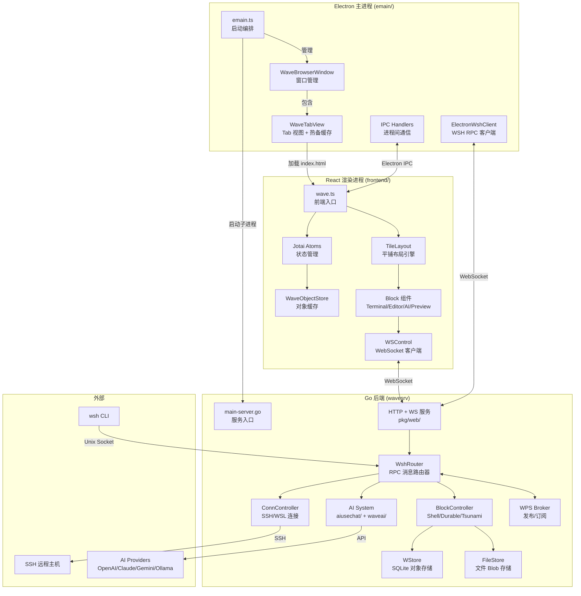
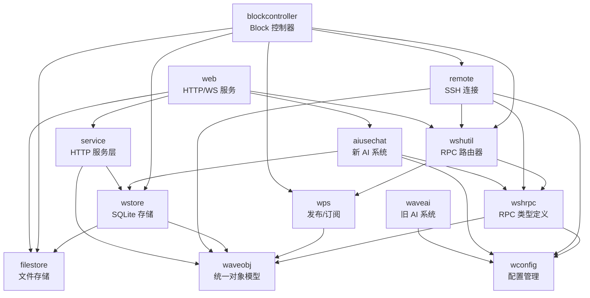
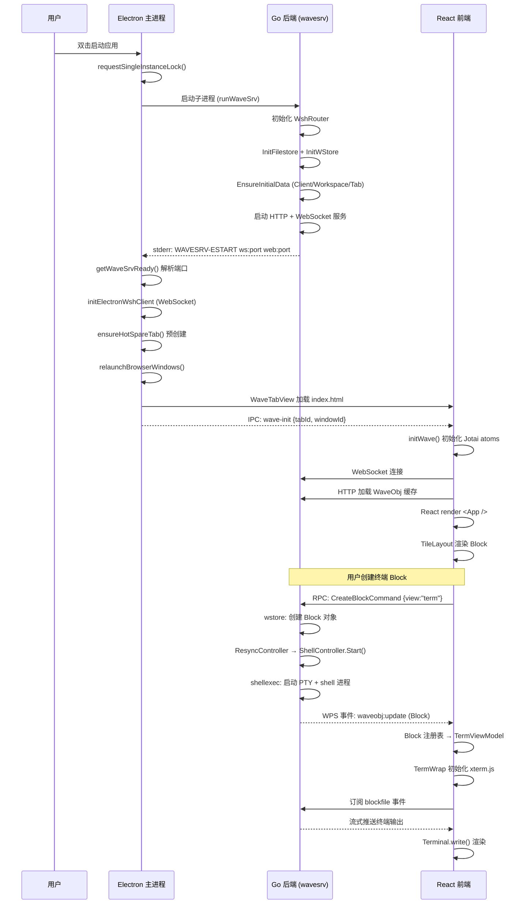
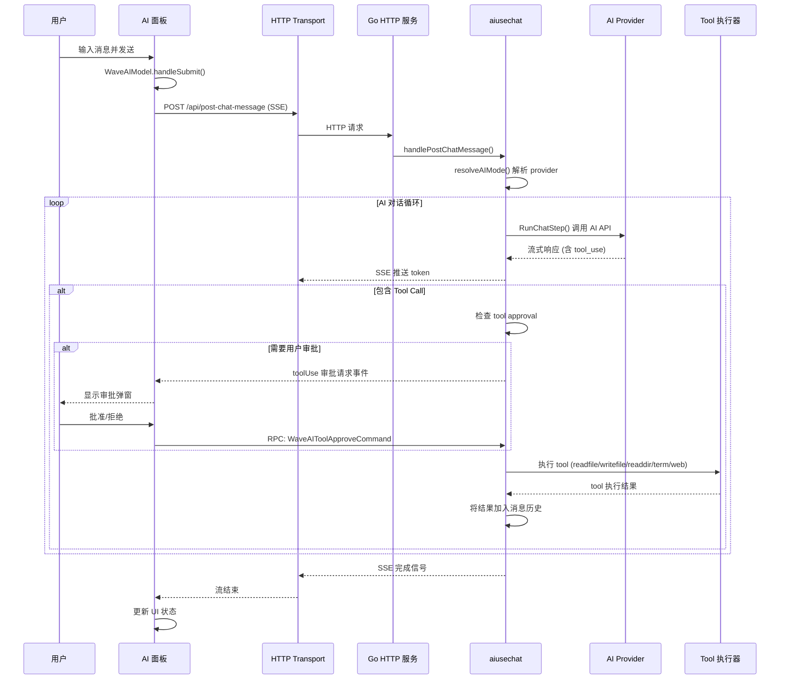

# waveterm 源码学习笔记

> 仓库地址：[waveterm](https://github.com/wavetermdev/waveterm)
> 学习日期：2026-04-05

---

> **以下为 AI 源码分析**
>
> ### 一句话概括
>
> Wave Terminal 是一款开源的 AI 原生终端模拟器，采用 Electron + Go 双进程架构，通过自研的 RPC 路由系统和 Block 化 UI 将终端、编辑器、文件预览、AI 对话等功能统一在可拖拽的平铺布局中。
>
> ### 要点速览
>
> | 核心模块 | 职责 | 关键文件 |
> |---------|------|---------|
> | wavesrv (Go) | 后端服务：数据存储、SSH 连接、AI 集成、进程管理 | `cmd/server/main-server.go` |
> | emain (Electron) | 主进程：窗口管理、Tab 视图、菜单、IPC | `emain/emain.ts` |
> | frontend (React) | 渲染进程：Block 组件、布局引擎、状态管理 | `frontend/wave.ts` |
> | wsh (Go CLI) | 命令行工具：通过 RPC 与后端交互控制终端 | `cmd/wsh/main-wsh.go` |
> | wshrpc | 自研 RPC 框架：消息路由、跨进程通信 | `pkg/wshrpc/`, `pkg/wshutil/` |
> | TileLayout | 自研平铺布局引擎：树形拆分、拖拽、放大 | `frontend/layout/` |
> | Tsunami | Widget/Extension 系统：Go 编写自定义 widget | `tsunami/` |

---

## 项目简介

Wave Terminal 是一款面向 macOS、Linux 和 Windows 的开源 AI 集成终端。它解决了传统终端"纯文本"的局限性，将终端会话、代码编辑器、文件预览、网页浏览和 AI 对话助手融合在统一的图形界面中。用户可以通过拖拽方式自由组合多种 Block（终端、编辑器、预览器、AI 等），实现灵活的多面板工作区布局。Wave 还提供持久化 SSH 会话（支持断线重连）、内置 AI 助手（支持 OpenAI/Claude/Gemini/Ollama 等多种模型）、以及 `wsh` 命令行工具用于从终端内部控制整个工作区。

## 技术栈

| 类别 | 技术 |
|------|------|
| 语言 | Go 1.25 + TypeScript 5.9 |
| 框架 | Electron 41 + React 19 + Jotai 2.9 |
| 构建工具 | Taskfile + electron-vite + Vite 6 |
| 依赖管理 | npm + Go Modules |
| 测试框架 | Vitest + Go testing |
| 终端引擎 | xterm.js 6 (WebGL) |
| 编辑器 | Monaco Editor 0.55 |
| 数据库 | SQLite (WAL mode) + golang-migrate |
| CSS | Tailwind CSS 4 + SCSS |

## 目录结构

```
waveterm/
├── cmd/                        # Go 命令行入口
│   ├── server/                 #   wavesrv 后端服务入口
│   ├── wsh/                    #   wsh CLI 工具入口
│   │   └── cmd/                #     47+ 个子命令实现
│   ├── generatets/             #   TypeScript 类型生成器
│   ├── generatego/             #   Go 代码生成器
│   └── generateschema/         #   JSON Schema 生成器
├── pkg/                        # Go 核心库
│   ├── waveobj/                #   统一对象模型 (ORef, WaveObj)
│   ├── wshrpc/                 #   RPC 类型定义和接口
│   │   ├── wshclient/          #     客户端 stub（自动生成）
│   │   ├── wshserver/          #     服务端实现
│   │   └── wshremote/          #     远程端实现
│   ├── wshutil/                #   RPC 路由器和消息传输
│   ├── wps/                    #   发布/订阅事件系统
│   ├── wstore/                 #   SQLite 对象存储
│   ├── wconfig/                #   配置管理和文件监听
│   ├── blockcontroller/        #   Block 控制器（Shell/Durable/Tsunami）
│   ├── remote/                 #   SSH/WSL 连接管理
│   │   └── conncontroller/     #     连接生命周期控制器
│   ├── web/                    #   HTTP + WebSocket 服务
│   ├── filestore/              #   文件 Blob 存储（终端输出等）
│   ├── aiusechat/              #   新 AI 系统（tool calling, 多 provider）
│   ├── waveai/                 #   旧 AI 系统（流式补全）
│   └── service/                #   HTTP 服务层
├── emain/                      # Electron 主进程
│   ├── emain.ts                #   应用入口和启动编排
│   ├── emain-window.ts         #   WaveBrowserWindow 窗口类
│   ├── emain-tabview.ts        #   WaveTabView + 热备 Tab 缓存
│   ├── emain-ipc.ts            #   IPC Handler 注册
│   ├── emain-wsh.ts            #   WSH RPC 客户端
│   ├── emain-menu.ts           #   菜单和 Dock 管理
│   └── preload.ts              #   contextBridge API 暴露
├── frontend/                   # React 前端
│   ├── wave.ts                 #   前端入口（初始化 + React 挂载）
│   ├── app/
│   │   ├── store/              #     Jotai atoms + WOS 缓存 + WebSocket
│   │   ├── block/              #     Block 系统（注册表 + 框架）
│   │   ├── view/               #     视图组件（term/editor/web/preview/ai）
│   │   ├── aipanel/            #     AI 对话面板
│   │   ├── workspace/          #     Workspace 布局模型
│   │   ├── tab/                #     Tab 栏和切换
│   │   ├── hook/               #     自定义 React Hooks
│   │   └── modals/             #     模态对话框
│   ├── layout/                 #     自研 TileLayout 布局引擎
│   ├── types/                  #     TypeScript 类型（部分自动生成）
│   └── util/                   #     工具函数
├── tsunami/                    # Widget/Extension 系统
│   ├── engine/                 #   VDOM 渲染引擎 + React-style hooks
│   ├── vdom/                   #   Virtual DOM 实现
│   ├── ui/                     #   Go UI 组件库
│   ├── frontend/               #   Tsunami 前端资源
│   ├── demo/                   #   示例应用（todo, pomodoro 等）
│   └── templates/              #   应用模板
├── db/                         # 数据库迁移脚本
│   ├── migrations-wstore/      #   对象存储迁移（11 次）
│   └── migrations-filestore/   #   文件存储迁移
├── schema/                     # JSON Schema 定义
└── docs/                       # 文档站点（Docusaurus）
```

## 架构设计

### 整体架构

Wave Terminal 采用经典的 **Electron 双进程 + Go 后端** 三层架构。Electron 主进程负责窗口和 Tab 管理，渲染进程运行 React 前端 UI，Go 后端 (`wavesrv`) 作为子进程处理所有核心逻辑（数据持久化、SSH 连接、AI 调用、进程管理）。三层之间通过自研的 WSH RPC 路由系统进行双向通信，使用 WebSocket 实现实时推送。



### 核心模块

#### 1. 统一对象模型 (`pkg/waveobj/`)

Wave 的所有持久化实体（Client、Window、Workspace、Tab、Block、LayoutState、Job）都实现 `WaveObj` 接口，使用统一的 `ORef`（`otype:oid`）引用机制。每个对象都携带 `MetaMapType` (`map[string]any`) 作为灵活的元数据存储。

- **核心文件**：`wtype.go`（对象类型定义）、`waveobj.go`（ORef、序列化）
- **关键接口**：`WaveObj` interface（要求 `GetOType()` 方法）
- **注册系统**：`RegisterType[T]()` 通过反射验证类型必须包含 `OID`, `Version`, `Meta` 字段
- **对象层级**：`Client → Window → Workspace → Tab → Block → SubBlock`

#### 2. RPC 通信系统 (`pkg/wshrpc/` + `pkg/wshutil/`)

自研的 RPC 框架，支持四种调用模式：单响应 (`Call`)、流式响应 (`ResponseStream`)、流式请求 (`StreamingRequest`)、双向流 (`Complex`)。

- **核心文件**：
  - `wshrpctypes.go` — `WshRpcInterface` 定义 200+ 行 RPC 方法签名
  - `wshrouter.go` — 消息路由器，类似网络交换机
  - `wshserver/wshserver.go` — 服务端实现
  - `wshclient/` — 自动生成的客户端 stub
- **路由前缀**：`conn:`, `controller:`, `proc:`, `tab:`, `feblock:`, `builder:`, `job:`, `link:`, `bare:`, 以及特殊路由 `wavesrv`, `electron`, `$control`
- **传输层**：WebSocket（前端↔后端）、Unix Domain Socket（wsh CLI↔后端）、SSH（远程 wsh↔后端）

#### 3. Block 控制器 (`pkg/blockcontroller/`)

每个 UI Block 可以关联一个控制器，管理其后台进程。

- **核心文件**：`blockcontroller.go`（注册表和公共逻辑）
- **三种实现**：
  - `ShellController`（`shellcontroller.go`）— 传统 shell 会话，支持 local/SSH/WSL
  - `DurableShellController`（`durableshellcontroller.go`）— 持久化 shell，基于 Job 系统，进程可跨重连存活
  - `TsunamiController`（`tsunamicontroller.go`）— Widget 运行器，编译执行 Go 二进制
- **关键函数**：`ResyncController()` 根据 block meta 的 `controller` 字段决定创建哪种控制器

#### 4. 前端 Block 系统 (`frontend/app/block/`)

Block 是 Wave 的核心 UI 单元，每种视图类型注册一个 ViewModel。

- **核心文件**：`blockregistry.ts`（注册表）、`blockframe.tsx`（通用框架）
- **注册的视图类型**：`term`（终端）、`preview`（预览）、`web`（浏览器）、`waveai`（AI）、`cpuplot`（CPU 图表）、`vdom`（VDOM）、`tsunami`（Tsunami Widget）、`launcher`（启动器）等 15+ 种
- **渲染链**：`<Block> → makeViewModel(blockId, blockView) → <BlockFrame> → viewModel.viewComponent`

#### 5. TileLayout 布局引擎 (`frontend/layout/`)

自研的树形平铺布局系统，支持水平/垂直拆分、拖拽重排、节点放大等操作。

- **核心文件**：`layoutModel.ts`（布局模型类）、`TileLayout.tsx`（渲染组件）、`layoutTree.ts`（纯函数式树操作）
- **关键操作**：`insertNode`, `deleteNode`, `moveNode`, `resizeNode`, `swapNode`, `splitHorizontal/Vertical`, `magnifyNodeToggle`
- **状态持久化**：布局状态作为 `LayoutState` WaveObj 存储在后端

#### 6. 状态管理 (`frontend/app/store/`)

使用 Jotai 构建细粒度响应式状态，配合 WOS (WaveObjectStore) 实现服务端对象的本地缓存和实时同步。

- **核心文件**：`global-atoms.ts`（全局 atoms）、`jotaiStore.ts`（全局 store）、`wos.ts`（WaveObjectStore）、`ws.ts`（WebSocket 管理）
- **关键 atoms**：`windowIdAtom`, `staticTabIdAtom`, `fullConfigAtom`, `settingsAtom`, `allConnStatus`
- **WOS 机制**：`waveObjectValueCache` 缓存所有 WaveObj，每个对象有独立的 `dataAtom`，通过 `wpsSubscribeToObject` 订阅更新事件

#### 7. AI 系统 (`pkg/aiusechat/` + `pkg/waveai/`)

双层 AI 系统——旧系统（`waveai/`）提供基础流式补全，新系统（`aiusechat/`）支持 tool calling 和多步对话。

- **新系统核心文件**：
  - `usechat-backend.go` — `UseChatBackend` 接口，四个后端实现（OpenAI Responses/Completions、Anthropic、Gemini）
  - `usechat-mode.go` — AI Mode 系统，支持 10+ 种 provider 的自动配置
  - `tools_*.go` — AI Tool 实现：读写文件、读目录、终端交互、网页搜索、截图
  - `toolapproval.go` — Tool 执行审批流程
- **通信方式**：`POST /api/post-chat-message` SSE 流式响应

### 模块依赖关系



## 核心流程

### 流程一：应用启动与终端会话创建

从用户双击应用图标到看到终端的完整流程，涉及 Electron 主进程、Go 后端、React 前端三层协作。



**关键步骤说明**：

1. **Go 后端启动协议**：wavesrv 通过 stderr 输出 `WAVESRV-ESTART ws:<port> web:<port>` 格式的启动信号，Electron 解析后获取通信端口
2. **热备 Tab**：`ensureHotSpareTab()` 预创建一个未绑定的 `WaveTabView`，后续创建/切换 Tab 时直接复用，减少 WebContentsView 创建延迟
3. **Block 控制器分派**：`ResyncController()` 根据 block meta 中的 `controller` 字段选择 `ShellController`、`DurableShellController` 或 `TsunamiController`
4. **终端数据流**：Go PTY → filestore blockfile → WPS 事件 → 前端 `TermWrap.mainFileSubject` → `xterm.js Terminal.write()`

### 流程二：AI 对话与 Tool Calling

用户在 AI 面板发送消息，后端调用 AI API 并执行 tool calling 的完整流程。



**关键步骤说明**：

1. **AI Mode 解析**：`resolveAIMode()` 根据配置中的 mode name 查找对应的 provider 配置（Wave/OpenAI/Anthropic/Gemini/Ollama 等），自动填充 endpoint、API type 等默认值
2. **SSE 流式传输**：前端通过 `DefaultChatTransport` 发起 `POST /api/post-chat-message`，后端以 Server-Sent Events 格式流式推送 AI 响应的每个 token
3. **Tool 审批机制**：`toolapproval.go` 实现了分级审批——读操作（readfile/readdir）可自动通过，写操作（writefile）需用户确认
4. **多 Provider 适配**：`UseChatBackend` 接口有四种实现（OpenAI Responses、OpenAI Completions、Anthropic Messages、Gemini），每种 provider 的 tool calling 协议差异在后端层被屏蔽

## 关键设计亮点

### 1. WSH RPC 路由器——统一的跨进程通信总线

**解决的问题**：Wave 有多个通信端点（前端 Tab、Electron 主进程、Go 后端、SSH 远程 wsh、本地 wsh CLI），需要一套统一的消息路由机制。

**实现方式**（`pkg/wshutil/wshrouter.go`）：

`WshRouter` 设计类似网络交换机，维护 `routeMap`（路由 ID → Link ID）和 `linkMap`（Link ID → 连接元数据）。每条消息携带 `Source` 和 `Dest` 路由地址（如 `tab:uuid`, `conn:ssh-host`, `wavesrv`），路由器根据前缀规则分发消息。支持上游转发（前端 → 后端 → 远程）、广播、以及 `$control` 控制面消息。

**为什么这样设计**：避免了点对点的 N^2 连接问题，所有组件只需连接到路由器即可与任意其他组件通信。路由器的前缀规则（`conn:`, `controller:`, `tab:` 等）使得消息寻址语义清晰，新增组件类型只需注册新前缀。

### 2. One-Tab-Per-WebContentsView + 热备缓存

**解决的问题**：传统 Electron 应用用单个 `BrowserWindow` 的 SPA 实现多 Tab，但 Tab 间的终端实例（xterm.js）和 Monaco Editor 实例会相互干扰，且切换 Tab 需要卸载/重建 DOM。

**实现方式**（`emain/emain-tabview.ts`）：

每个 Tab 是独立的 `WebContentsView`（而非单 SPA 中的 React 组件），加载相同的 `index.html` 但通过 `wave-init` 事件传递不同的 `tabId`。`wcvCache` 维护一个 LRU 缓存（最多 10 个 Tab 视图），`HotSpareTab` 机制预创建一个未绑定的 Tab 视图，切换时直接复用。

**为什么这样设计**：每个 Tab 有独立的渲染进程内存空间，xterm.js 和 Monaco 的 WebGL 上下文不会冲突；Tab 切换是视图切换而非 DOM 重建，保留了所有终端滚动位置和编辑器状态。热备缓存将新 Tab 的创建延迟从 ~500ms 降低到接近 0。

### 3. 统一对象模型 + JSON 文档存储

**解决的问题**：Wave 有多种实体类型（Client、Window、Workspace、Tab、Block、LayoutState、Job），它们的 schema 频繁变化，传统关系型建模会导致大量迁移脚本。

**实现方式**（`pkg/waveobj/` + `pkg/wstore/`）：

所有对象存储在 SQLite 中，使用统一的 `(oid, version, data)` 三列模式，`data` 列以 JSON 格式存储。通过 `RegisterType[T]()` 泛型注册类型，`DBGet[T]()`/`DBInsert[T]()` 等泛型 CRUD 操作自动处理序列化/反序列化。对象变更通过 `WPS Broker` 实时推送到所有订阅者。

**为什么这样设计**：JSON 文档模式使得新增字段无需数据库迁移，`MetaMapType` 提供了 schema-less 的扩展能力。单连接模型（`MaxOpenConns(1)`）配合 WAL mode 保证了写操作的串行化，同时不阻塞读取。OTA (Over-The-Air) 更新机制在事务提交时批量推送变更，减少了事件风暴。

### 4. Block 控制器模式——可插拔的后台进程管理

**解决的问题**：不同类型的 Block（终端、持久化终端、Tsunami widget）需要不同的后台进程管理策略，但前端 UI 框架应保持统一。

**实现方式**（`pkg/blockcontroller/`）：

定义 `Controller` 接口（`Start`, `Stop`, `GetRuntimeStatus`, `SendInput`），三种实现通过 `ResyncController()` 根据 block meta 的 `controller` 字段动态分派：
- `ShellController`：管理本地/远程 PTY 进程
- `DurableShellController`：基于 Job 系统的持久化 shell，进程独立于 Block 生命周期
- `TsunamiController`：编译运行 Go widget 二进制，通过 HTTP 端口通信

**为什么这样设计**：控制器模式将"UI 单元"和"后台进程"解耦。Block 可以在不同连接间迁移（SSH 断线重连后 `DurableShellController` 自动恢复），Tsunami widget 可以独立进程运行避免 crash 传播。注册表 (`controllerRegistry`) 支持运行时查询所有活跃控制器的状态。

### 5. 代码生成保证前后端类型一致性

**解决的问题**：Go 后端和 TypeScript 前端之间有大量共享的数据类型和 RPC 接口定义，手动同步容易出错。

**实现方式**（`cmd/generatets/` + `cmd/generatego/`）：

Go 工具通过反射扫描所有注册的 `WaveObj` 类型和 `WshRpcInterface` 方法签名，自动生成：
- `frontend/types/gotypes.d.ts` — 2200+ 行 TypeScript 类型声明
- `frontend/types/waveevent.d.ts` — 事件类型
- `frontend/app/store/services.ts` — HTTP 服务客户端
- `frontend/app/store/wshclientapi.ts` — RPC 客户端 API
- `pkg/wshrpc/wshclient/` — Go RPC 客户端 stub

构建流程中 `task generate` 在编译前自动运行这些生成器。

**为什么这样设计**：单一数据源（Go struct tags + interface 定义）驱动全栈类型，编译时即可发现类型不匹配。生成的客户端 stub 包含了完整的 RPC 调用模式（Call/Stream/Complex），开发者只需关注业务逻辑。
