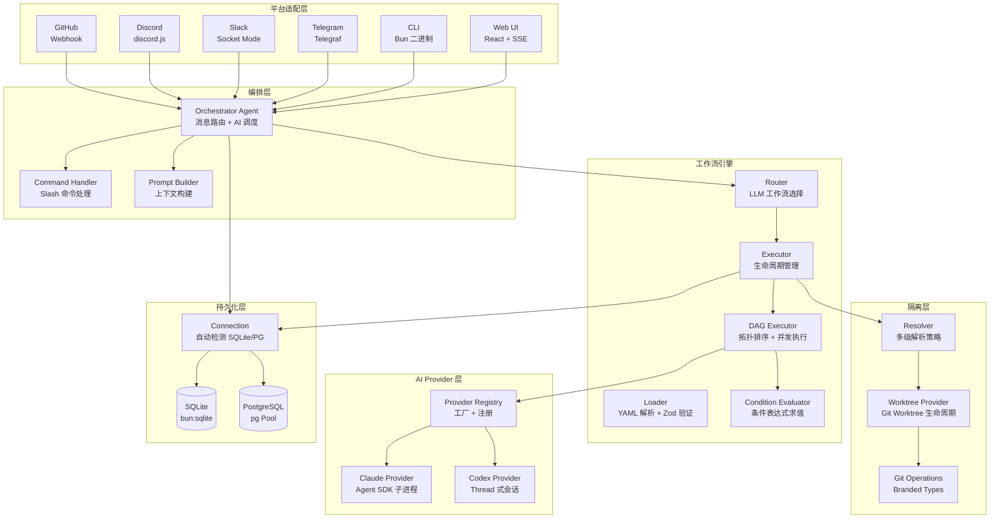
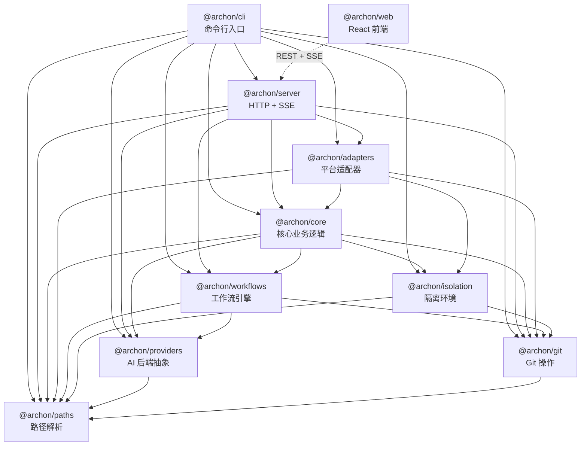
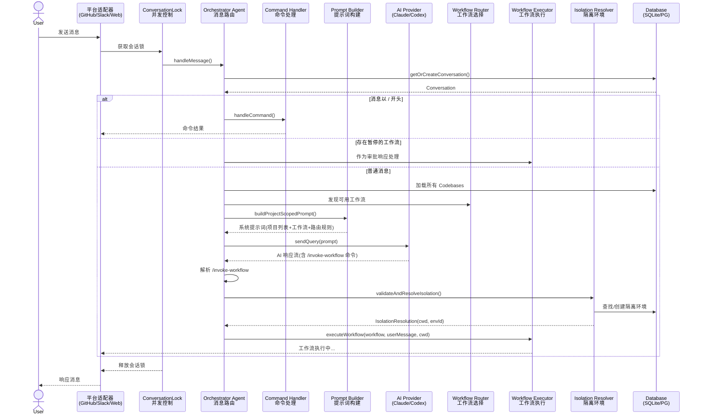
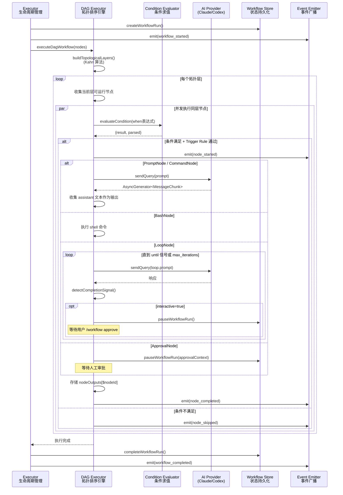

# Archon 源码学习笔记

> 仓库地址：[Archon](https://github.com/coleam00/Archon)
> 学习日期：2026/04/14

---

> **以下为 AI 源码分析**
>
> ### 一句话概括
>
> Archon 是一个开源的 AI 编码工作流引擎，将开发流程（规划、实现、验证、代码评审、PR 创建）定义为 YAML DAG 工作流，通过多平台适配器（Web UI、CLI、Telegram、Slack、Discord、GitHub）统一驱动 Claude/Codex 等 AI 编码代理，实现确定性、可重复的自动化软件开发。
>
> ### 要点速览
>
> | 核心模块 | 职责 | 关键包/文件 |
> |---------|------|------------|
> | Orchestrator | 消息路由、会话管理、AI 提示词构建 | `@archon/core` / `orchestrator-agent.ts` |
> | Workflow Engine | YAML DAG 解析、拓扑排序执行、循环节点 | `@archon/workflows` / `executor.ts`, `dag-executor.ts` |
> | Providers | AI 后端抽象（Claude SDK、Codex SDK） | `@archon/providers` / `claude/provider.ts` |
> | Adapters | 多平台消息收发（GitHub Webhook、Slack、Telegram） | `@archon/adapters` / `forge/`, `chat/` |
> | Isolation | Git Worktree 隔离环境管理 | `@archon/isolation` / `resolver.ts`, `worktree.ts` |
> | Server | Hono HTTP API + SSE 实时推送 | `@archon/server` / `index.ts`, `routes/api.ts` |
> | CLI | 命令行入口（chat、workflow、serve） | `@archon/cli` / `cli.ts` |
> | Web UI | React 仪表盘（聊天、工作流可视化） | `@archon/web` / `ChatPage.tsx`, `DashboardPage.tsx` |
> | Git | Git 操作封装（Worktree、Branch、Clone） | `@archon/git` / `worktree.ts`, `repo.ts` |
> | Paths | 跨平台路径解析（Docker/本地兼容） | `@archon/paths` / `archon-paths.ts` |

---

## 项目简介

Archon 是首个开源的 AI 编码 Harness Builder（工具编排框架）。它解决的核心问题是：当你让 AI 代理"修复这个 bug"时，每次执行的过程和结果都不可预测——可能跳过规划、忘记跑测试、或者 PR 描述不符合模板。Archon 通过将开发流程编码为 YAML 工作流来解决这个问题：工作流定义阶段、验证门禁和产物，AI 在每个步骤填充智能，但整体结构是确定性的、由开发者控制的。

类比来说，Dockerfile 之于基础设施、GitHub Actions 之于 CI/CD，Archon 之于 AI 编码工作流。它像 n8n，但专为软件开发场景设计。

## 技术栈

| 类别 | 技术 |
|------|------|
| 语言 | TypeScript (strict mode) |
| 运行时 | Bun |
| 前端框架 | React 19 + Vite 6 + Tailwind CSS 4 |
| 后端框架 | Hono (OpenAPI) |
| 状态管理 | Zustand 5 + React Query 5 |
| 数据库 | SQLite (bun:sqlite) / PostgreSQL (pg) |
| AI SDK | @anthropic-ai/claude-agent-sdk, @openai/codex-sdk |
| 平台集成 | Telegraf, @slack/bolt, discord.js, @octokit/rest |
| 构建/测试 | Bun workspaces, bun test, ESLint, Prettier, Husky |
| 部署 | Docker (multi-stage build), Homebrew |

## 目录结构

```
Archon/
├── packages/                    # Bun Monorepo 工作区
│   ├── core/                    # 核心业务逻辑（Orchestrator、DB、Config）
│   │   └── src/
│   │       ├── orchestrator/    # 消息路由和 AI 调度中枢
│   │       ├── handlers/        # Slash 命令处理和仓库克隆
│   │       ├── db/              # 数据库层（SQLite/PostgreSQL 适配器）
│   │       ├── config/          # YAML 配置加载（全局 + 仓库级）
│   │       ├── operations/      # 工作流/隔离环境操作
│   │       ├── services/        # 清理服务、标题生成
│   │       ├── state/           # Session 状态机
│   │       └── types/           # 核心类型定义
│   ├── workflows/               # 工作流引擎（加载、DAG 执行、路由）
│   │   └── src/
│   │       ├── schemas/         # Zod Schema（DagNode、WorkflowRun 等）
│   │       ├── executor.ts      # 工作流执行入口
│   │       ├── dag-executor.ts  # DAG 拓扑排序 + 并发执行
│   │       ├── loader.ts        # YAML 解析与三级验证
│   │       ├── router.ts        # LLM 驱动的工作流选择
│   │       └── condition-evaluator.ts  # $nodeId.output 条件表达式求值
│   ├── providers/               # AI 后端抽象层
│   │   └── src/
│   │       ├── claude/          # Claude SDK Provider（子进程 + 流式响应）
│   │       ├── codex/           # Codex SDK Provider（线程式会话）
│   │       └── registry.ts      # Provider 注册表（单例 + 工厂模式）
│   ├── adapters/                # 平台适配器
│   │   └── src/
│   │       ├── forge/github/    # GitHub Webhook 适配器
│   │       ├── chat/slack/      # Slack Socket Mode 适配器
│   │       ├── chat/telegram/   # Telegram 长轮询适配器
│   │       └── community/       # 社区贡献（Discord、Gitea、GitLab）
│   ├── isolation/               # Worktree 隔离环境
│   │   └── src/
│   │       ├── resolver.ts      # 多级环境解析策略
│   │       ├── providers/worktree.ts  # Worktree 生命周期管理
│   │       └── factory.ts       # Provider 工厂（单例）
│   ├── git/                     # Git 操作封装
│   │   └── src/
│   │       ├── worktree.ts      # Worktree CRUD + 所有权验证
│   │       ├── repo.ts          # Clone、Sync、远程 URL 解析
│   │       └── branch.ts        # 分支操作 + 默认分支检测
│   ├── server/                  # HTTP 服务器
│   │   └── src/
│   │       ├── index.ts         # Hono 启动 + 平台适配器初始化
│   │       ├── routes/api.ts    # REST API + SSE 端点
│   │       └── adapters/web/    # WebSocket 传输 + 消息持久化
│   ├── cli/                     # 命令行工具
│   │   └── src/
│   │       ├── cli.ts           # 入口 + 命令路由
│   │       ├── commands/        # chat、workflow、serve、setup 等命令
│   │       └── bundled-skill.ts # 编译进二进制的 Skill 文件
│   ├── web/                     # React 前端
│   │   └── src/
│   │       ├── routes/          # ChatPage、DashboardPage、WorkflowBuilder
│   │       ├── stores/          # Zustand（workflow-store）
│   │       ├── hooks/           # useSSE（SSE 实时通信）
│   │       └── lib/             # API 客户端、工具函数
│   ├── paths/                   # 路径解析（Docker/本地兼容）
│   └── docs-web/               # Astro 文档站
├── migrations/                  # SQL 迁移脚本（001-021）
├── .archon/                     # 默认工作流和配置
│   ├── workflows/               # 内置 YAML 工作流定义
│   ├── commands/                # 内置 Slash 命令
│   └── config.yaml              # 默认配置
├── .claude/                     # Claude Code 集成（agents、skills、commands）
├── deploy/                      # Docker Compose 部署配置
└── scripts/                     # 构建脚本（Homebrew、安装、校验）
```

## 架构设计

### 整体架构

Archon 采用**分层 + 适配器**架构，核心设计思想是将 AI 编码工作流的编排与具体平台、AI 后端解耦：

- **平台适配层**：各平台通过统一的 `IPlatformAdapter` 接口接入，实现消息收发
- **编排层（Orchestrator）**：中枢路由，将用户消息分派到 Slash 命令处理器或 AI 路由
- **工作流引擎**：解析 YAML 定义的 DAG 工作流，按拓扑序并发执行节点
- **AI Provider 层**：通过 Registry 模式抽象 Claude/Codex 等后端
- **隔离层**：每个工作流运行在独立的 Git Worktree 中，避免并发冲突
- **持久化层**：SQLite/PostgreSQL 双适配器，存储会话、工作流状态、消息历史



### 核心模块

#### 1. Orchestrator（编排器）

**职责**：所有平台消息的统一入口，负责会话管理、命令分派、AI 路由和工作流调度。

**核心文件**：
- `packages/core/src/orchestrator/orchestrator-agent.ts` — 主消息处理器 `handleMessage()`
- `packages/core/src/orchestrator/orchestrator.ts` — 隔离环境解析、后台工作流分派
- `packages/core/src/orchestrator/prompt-builder.ts` — AI 系统提示词构建

**关键接口/函数**：
- `handleMessage(platform, conversationId, message, context)` — 单一入口，处理所有平台消息
- `validateAndResolveIsolation()` — 解析或创建 Worktree 隔离环境
- `dispatchBackgroundWorkflow()` — 在后台 Worker 会话中启动工作流
- `buildOrchestratorPrompt()` / `buildProjectScopedPrompt()` — 构建包含项目列表和工作流信息的 AI 提示词

**消息处理流程**：
1. 获取/创建 Conversation（支持线程继承父级 codebase_id）
2. 检测 Slash 命令 → 确定性处理（`/help`, `/workflow`, `/register-project` 等）
3. 检查暂停的工作流 → 将消息作为审批响应
4. 加载 Codebase 列表、发现可用工作流
5. 构建 AI 系统提示词 → 发送给 Provider
6. 解析 AI 响应中的编排命令（`/invoke-workflow`, `/register-project`）
7. 执行工作流调度或项目注册

**流式模式**：支持 `stream`（实时推送文本块）和 `batch`（累积后过滤工具指示符再发送）两种模式。

#### 2. Workflow Engine（工作流引擎）

**职责**：YAML 工作流的完整生命周期——加载、验证、路由选择、DAG 执行、状态持久化。

**核心文件**：
- `packages/workflows/src/loader.ts` — 三级验证（YAML 解析 → Zod Schema → 资源检查）
- `packages/workflows/src/dag-executor.ts` — Kahn 算法拓扑排序 + 并发层级执行
- `packages/workflows/src/executor.ts` — 工作流执行入口（配置解析、并发检查、断点续跑）
- `packages/workflows/src/router.ts` — LLM 驱动的工作流选择
- `packages/workflows/src/condition-evaluator.ts` — `$nodeId.output` 条件表达式求值
- `packages/workflows/src/event-emitter.ts` — 工作流事件广播（15 种事件类型）

**7 种节点类型**（互斥）：

| 类型 | 字段 | 用途 | AI 驱动 |
|------|------|------|---------|
| PromptNode | `prompt` | 内联 AI 提示 | 是 |
| CommandNode | `command` | 加载 `.archon/commands/` 的 Markdown 命令 | 是 |
| BashNode | `bash` | Shell 脚本执行 | 否 |
| ScriptNode | `script` + `runtime` | TypeScript/Python 脚本 | 否 |
| LoopNode | `loop` | 迭代 AI 执行直到条件满足 | 是 |
| ApprovalNode | `approval` | 人工审批门禁 | 否 |
| CancelNode | `cancel` | 终止工作流 | 否 |

**关键设计**：
- **DAG 并发执行**：同一拓扑层的独立节点通过 `Promise.allSettled()` 并行运行
- **条件执行**：支持 `when: "$classify.output == 'bug'"` 表达式，fail-closed（表达式无效则跳过节点）
- **Trigger Rule**：`all_success`、`one_success`、`none_failed_min_one_success`、`all_done` 控制节点触发条件
- **变量替换**：`$WORKFLOW_ID`、`$ARGUMENTS`、`$nodeId.output`、`$ISSUE_CONTEXT` 等
- **断点续跑**：加载已完成节点输出，跳过已完成节点

#### 3. Providers（AI 后端）

**职责**：抽象 Claude/Codex 等 AI 后端，提供统一的 `IAgentProvider` 接口。

**核心文件**：
- `packages/providers/src/registry.ts` — 懒初始化单例注册表
- `packages/providers/src/claude/provider.ts` — Claude Agent SDK 子进程封装
- `packages/providers/src/codex/provider.ts` — Codex SDK Thread 式会话封装
- `packages/providers/src/types.ts` — Provider 接口和 MessageChunk 类型

**关键接口**：
```typescript
interface IAgentProvider {
  sendQuery(prompt, cwd, resumeSessionId?, options?): AsyncGenerator<MessageChunk>;
  getType(): string;
  getCapabilities(): ProviderCapabilities;
}
```

**MessageChunk 判别联合**：`assistant`（文本）、`thinking`（推理）、`tool`（工具调用）、`tool_result`（工具结果）、`system`（系统消息）、`rate_limit`（限流）、`result`（最终结果）。

**Claude Provider 特性**：MCP 服务器配置加载、YAML Hook 构建、Skill 包装、工具捕获（PostToolUse SDK Hook）、重试逻辑（3 次指数退避）、首事件超时保护（60s）。

**Codex Provider 特性**：Thread 生命周期管理、事件归一化（agent_message、command_execution 等）、结构化输出。

#### 4. Adapters（平台适配器）

**职责**：桥接平台特定 API 与统一的 `IPlatformAdapter` 接口。

**核心文件**：
- `packages/adapters/src/forge/github/adapter.ts` — GitHub Webhook（HMAC-SHA256 签名验证）
- `packages/adapters/src/chat/slack/adapter.ts` — Slack Socket Mode
- `packages/adapters/src/chat/telegram/adapter.ts` — Telegram 长轮询
- `packages/adapters/src/community/chat/discord/adapter.ts` — Discord 消息处理

**GitHub Adapter 关键流程**：
1. Webhook 签名验证（`timingSafeEqual`）
2. 事件分类：`issue_comment.created`（@mention → Slash 命令或富上下文消息）、`issues.closed`/`pull_request.closed`（Worktree 清理）
3. 消息发送：自动分段（>65KB 按段落拆分）、隐藏标记防自循环
4. 隔离提示传递：workflowType、prBranch、prSha、linkedIssues

**Chat vs Forge 适配器**：
- **Chat 适配器**（Slack、Telegram、Discord）：双向聊天，支持 stream/batch 模式
- **Forge 适配器**（GitHub、Gitea、GitLab）：Webhook 事件驱动，处理 Issue/PR 评论和生命周期事件

#### 5. Isolation（隔离环境）

**职责**：为每个工作流运行创建独立的 Git Worktree，实现并发任务互不干扰。

**核心文件**：
- `packages/isolation/src/resolver.ts` — 多级环境解析策略
- `packages/isolation/src/providers/worktree.ts` — Worktree 创建/销毁/收养
- `packages/isolation/src/factory.ts` — Provider 工厂（单例 + 配置注入）

**环境解析策略**（优先级递减）：
1. **复用已有**：Conversation 已关联环境 → 验证并复用（检查 baseBranch 一致性）
2. **工作流复用**：同 codebase + 同 workflowType + 同 workflowId → 共享 Worktree
3. **关联 Issue 共享**：通过 linkedIssues 复用相关 Issue 的 Worktree
4. **PR 分支收养**：查找匹配 PR 分支的已有 Worktree
5. **新建**：创建全新 Worktree

**分支命名策略**：
- Issue：`archon/issue-{id}`
- Same-repo PR：使用实际分支名 `{prBranch}`
- Fork PR：`archon/pr-{id}-review`（合成分支）
- Thread：`archon/thread-{hash(id)}`
- Task：`archon/task-{slugify(id)}`

#### 6. Database Layer（数据库层）

**职责**：通过适配器模式支持 SQLite 和 PostgreSQL 两种后端。

**核心文件**：
- `packages/core/src/db/connection.ts` — 自动检测（`DATABASE_URL` 存在 → PG，否则 → SQLite）
- `packages/core/src/db/adapters/sqlite.ts` — bun:sqlite 嵌入式数据库（WAL 模式）
- `packages/core/src/db/adapters/postgres.ts` — pg Pool 连接池（max 10）

**核心接口**：
```typescript
interface IDatabase {
  query<T>(sql, params?): Promise<QueryResult<T>>;
  withTransaction<T>(fn): Promise<T>;
  close(): Promise<void>;
  readonly dialect: 'postgres' | 'sqlite';
  readonly sql: SqlDialect;  // 方言差异抽象（UUID 生成、NOW()、JSON 合并等）
}
```

**数据表**（9 张）：`codebases`、`conversations`、`sessions`、`workflow_runs`、`workflow_events`、`isolation_environments`、`messages`、`workflow_run_outputs`、`env_vars`。

### 模块依赖关系



## 核心流程

### 流程一：消息处理与工作流调度

这是 Archon 最核心的端到端流程——从用户在任意平台发送消息，到 AI 选择并执行工作流的完整调用链。



**关键细节**：
1. **ConversationLockManager** 保证同一会话同时只有一个消息在处理，最大并发会话数默认 10
2. **AI 路由**：Orchestrator 将所有已注册项目和可用工作流信息注入 AI 系统提示词，AI 返回 `/invoke-workflow {name} --project {project} --prompt "{task}"` 格式的编排命令
3. **隔离解析**：根据工作流类型（Issue/PR/Task）选择复用或新建 Worktree
4. **后台调度**：非交互式工作流在后台 Worker 会话中运行，前台立即返回

### 流程二：DAG 工作流执行

YAML 工作流内部的 DAG（有向无环图）节点执行流程，展示拓扑排序、并发执行和循环节点的工作方式。



**关键细节**：
1. **拓扑排序**：使用 Kahn 算法构建层级，每层内的节点通过 `Promise.allSettled()` 并发执行
2. **变量替换**：节点 prompt 中的 `$nodeId.output` 在执行前替换为上游节点的实际输出
3. **条件执行**：`when` 表达式支持 `==`、`!=`、`<`、`>`、`&&`、`||`，fail-closed 设计
4. **循环节点**：支持 AI 循环（`fresh_context: true` 每轮新建会话）和人工审批循环（`interactive: true`）
5. **断点续跑**：`findResumableRun()` 查找失败/暂停的运行，加载已完成节点输出后跳过

## 关键设计亮点

### 1. DAG-First 工作流架构 + 拓扑排序并发

**解决的问题**：AI 编码任务通常包含多个阶段（规划、实现、测试、评审），有些可以并行，有些必须串行。简单的线性流水线无法充分利用并发性。

**具体实现**：
- `packages/workflows/src/dag-executor.ts` 中的 `buildTopologicalLayers()` 使用 Kahn 算法将 DAG 节点分层
- 每层内的独立节点通过 `Promise.allSettled()` 并发执行
- 7 种互斥节点类型（Prompt、Command、Bash、Script、Loop、Approval、Cancel）通过 Zod 判别联合确保类型安全
- `trigger_rule` 允许灵活控制节点触发条件（`all_success`、`one_success`、`all_done` 等）

**设计理由**：DAG 模型比线性流水线更灵活，比自由形式的图更安全（无环保证终止性）。通过拓扑排序自动计算最大并行度，开发者只需声明依赖关系即可获得最优执行顺序。

### 2. Provider Registry + Capability Flags

**解决的问题**：不同 AI 后端（Claude、Codex）能力差异巨大（Claude 支持 MCP、Hooks、Skills；Codex 不支持），工作流引擎需要根据 Provider 能力自适应调整行为。

**具体实现**：
- `packages/providers/src/registry.ts` 实现懒初始化单例注册表，支持 `registerProvider()` 和 `getAgentProvider()` 工厂方法
- `ProviderCapabilities` 接口定义 12 项能力标志（`sessionResume`、`mcp`、`hooks`、`skills`、`toolRestrictions`、`structuredOutput`、`effortControl` 等）
- `packages/workflows/src/dag-executor.ts` 的 `buildNodeOptions()` 根据能力标志动态调整节点配置
- Model 路由：Claude 别名（sonnet、opus、haiku、claude-*）vs Codex 回退

**设计理由**：能力标志比硬编码的 Provider 类型检查更具扩展性。新增 Provider 只需实现 `IAgentProvider` 接口并声明能力，工作流引擎无需修改。

### 3. 多级 Worktree 隔离解析策略

**解决的问题**：并发工作流需要隔离的文件系统，但不能每次都创建全新 Worktree（浪费资源），也不能盲目复用（可能冲突）。需要一种智能的环境解析策略。

**具体实现**：
- `packages/isolation/src/resolver.ts` 实现 6 级优先级的解析策略：已有环境 → 无 codebase → 工作流复用 → 关联 Issue 共享 → PR 分支收养 → 新建
- **跨克隆守卫**（`verifyWorktreeOwnership()`）：防止不同 clone 之间的 Worktree 误收养
- **陈旧检测**：14 天未活跃的环境标记为 destroyed 并自动清理
- **PR 分支收养**：对于 same-repo PR，自动查找匹配分支名的已有 Worktree，避免重复创建

**设计理由**：多级解析策略在资源效率和隔离安全之间取得平衡。"收养"机制允许用户手动创建的 Worktree 被 Archon 接管，实现平滑的手动→自动化过渡。

### 4. SQLite/PostgreSQL 双适配器 + SQL 方言抽象

**解决的问题**：CLI 用户需要零配置的嵌入式数据库（SQLite），服务器部署需要生产级数据库（PostgreSQL），但业务逻辑不应关心底层差异。

**具体实现**：
- `packages/core/src/db/adapters/types.ts` 定义 `IDatabase` 接口和 `SqlDialect` 方言对象
- `SqlDialect` 抽象了 UUID 生成（`gen_random_uuid()` vs 手动生成）、时间函数（`NOW()` vs `datetime('now')`）、JSON 操作（`||` vs `MERGE`）等差异
- `packages/core/src/db/connection.ts` 的 `getDatabase()` 通过 `DATABASE_URL` 环境变量自动选择
- SQLite 适配器将 `$1, $2` 占位符转换为 `?`，并重新排列参数顺序

**设计理由**：SQL 方言抽象比 ORM 更轻量，保留了手写 SQL 的性能和灵活性，同时消除了方言差异。所有业务代码只与 `IDatabase` 接口交互。

### 5. SSE + 消息分段持久化的实时通信架构

**解决的问题**：Web UI 需要实时展示 AI 响应、工具调用、工作流进度，同时保证消息在断线重连后不丢失，且数据库写入不能成为瓶颈。

**具体实现**：
- `packages/server/src/adapters/web/transport.ts` 的 `SSETransport` 管理双向 SSE 通信，支持事件缓冲（500 条/60s TTL）和断线重播
- `packages/server/src/adapters/web/persistence.ts` 的 `MessagePersistence` 将相关工具调用和文本分组为"段"（Segments），30 秒周期性刷入数据库
- `packages/server/src/adapters/web/workflow-bridge.ts` 将 15 种 `WorkflowEmitterEvent` 映射为 SSE JSON，同时多路复用到会话流和 Dashboard 全局流
- 前端 `packages/web/src/hooks/useSSE.ts` 实现 50ms 文本批处理，减少渲染抖动

**设计理由**：SSE 比 WebSocket 更简单（单向推送足够）、对代理/负载均衡更友好。消息分段持久化将相关操作聚合为逻辑单元，前端渲染和数据库查询都受益于这种结构化存储。
