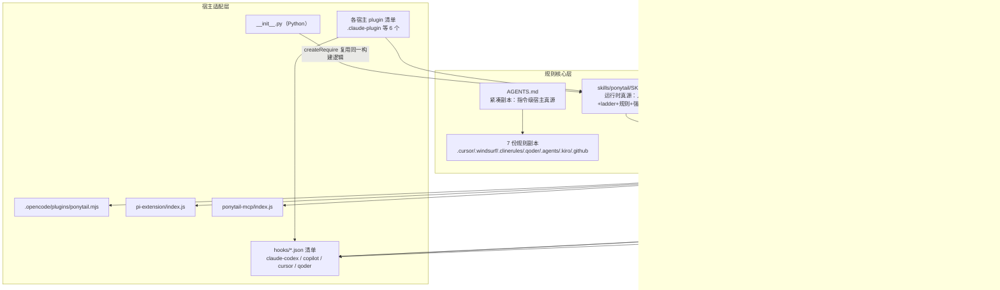
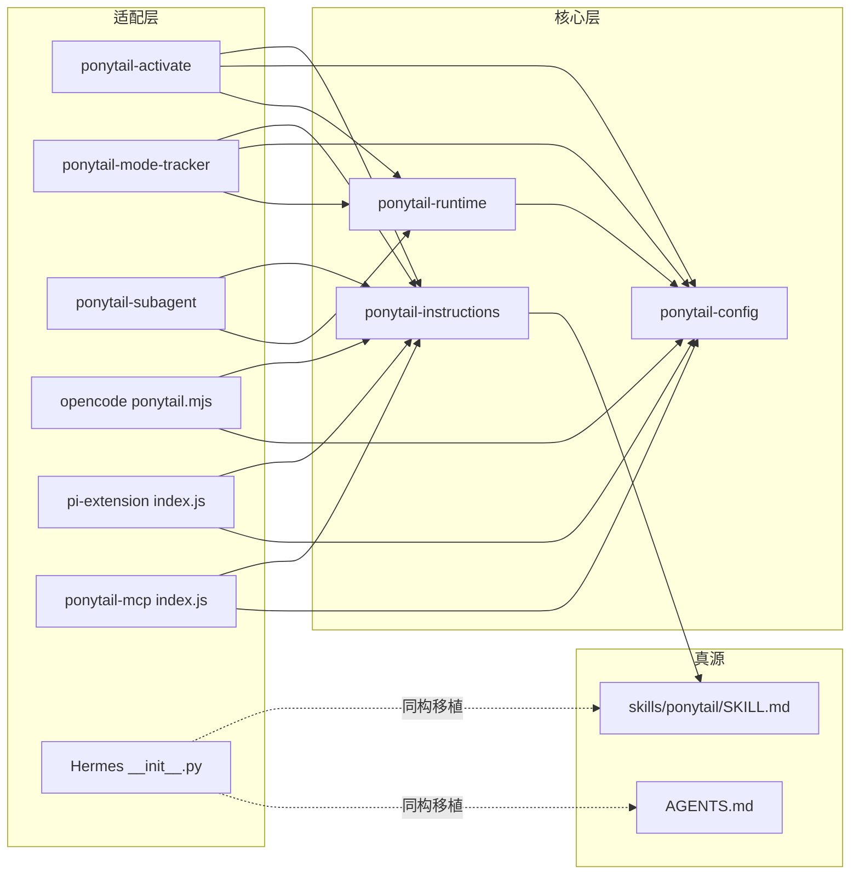
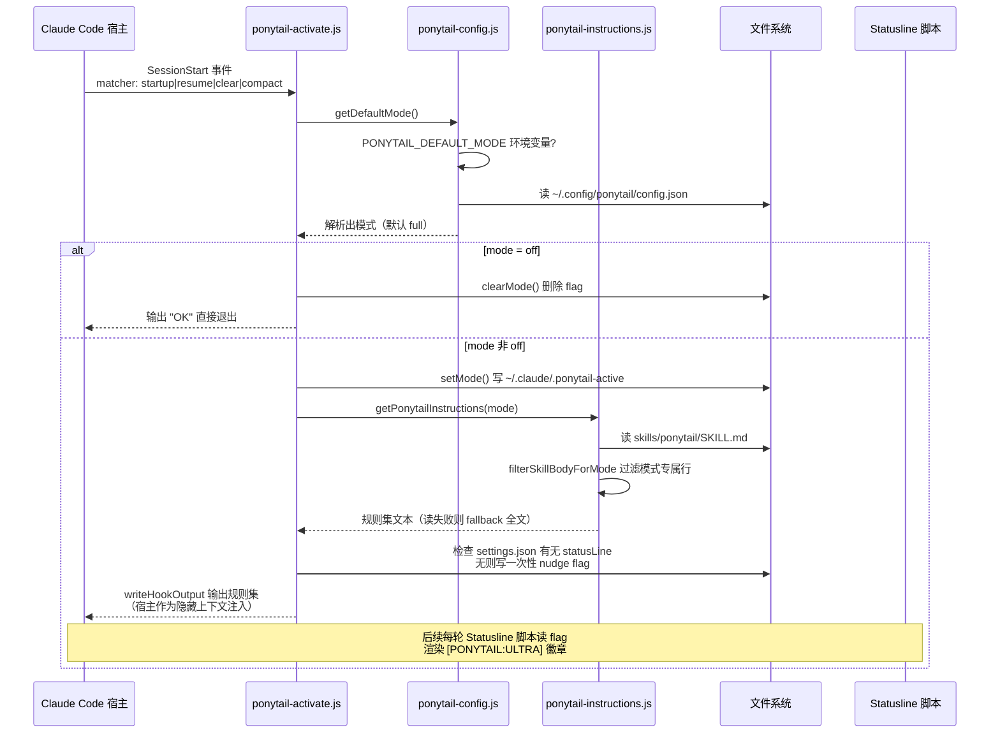
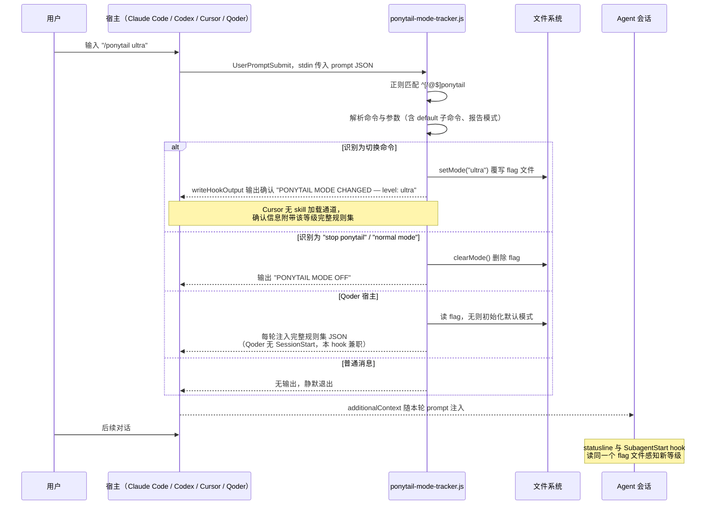

# ponytail 源码学习笔记

> 仓库地址：[DietrichGebert/ponytail](https://github.com/DietrichGebert/ponytail)
> 学习日期：2026-09-30
> 版本：v4.10.0（HEAD: e3ba2aa，MIT License）

---

> **以下为 AI 源码分析**
>
> ### 一句话概括
>
> ponytail 是一个给 AI coding agent 注入"懒资深工程师"人格的规则集分发项目：用一个 7 级决策阶梯（YAGNI → 复用已有 → stdlib → 平台原生 → 已装依赖 → 一行 → 最少实现）逼 agent 写最少但正确的代码，并以"单一规则源 + 薄适配器"的架构把同一套规则分发到 20+ 个 agent 宿主（Claude Code、Codex、Copilot、OpenCode、Gemini、Qoder、Cursor……）。
>
> ### 要点速览
>
> | 模块 | 职责 | 关键文件 |
> |------|------|---------|
> | 规则核心（唯一真源） | 懒资深工程师人格 + 7 级 ladder + 安全底线 | `skills/ponytail/SKILL.md`、`AGENTS.md` |
> | 指令构建器 | 按模式过滤 SKILL.md 正文，生成注入文本 | `hooks/ponytail-instructions.js` |
> | 配置解析 | 模式解析、默认模式三级回退、去活短语识别 | `hooks/ponytail-config.js` |
> | 宿主运行时 | 探测 5 类宿主、维护 flag 状态文件、适配 5 种输出协议 | `hooks/ponytail-runtime.js` |
> | 生命周期 hooks | SessionStart 激活 / UserPromptSubmit 模式跟踪 / Subagent 注入 | `hooks/ponytail-activate.js`、`hooks/ponytail-mode-tracker.js`、`hooks/ponytail-subagent.js` |
> | 状态栏 | 读取 flag 文件渲染 `[PONYTAIL:ULTRA]` 徽章 | `hooks/ponytail-statusline.sh` / `.ps1` |
> | 6 个 skills | 主 skill + review / audit / debt / gain / help | `skills/*/SKILL.md` |
> | OpenCode 插件 | 系统提示词逐轮追加规则集 + 命令注册 | `.opencode/plugins/ponytail.mjs` |
> | Pi 扩展 | `before_agent_start` 注入 + 状态栏 + 会话级模式持久化 | `pi-extension/index.js` |
> | Hermes 插件 | Python 实现，`pre_llm_call` 注入 + 网关命令重写 | `__init__.py` |
> | MCP server | 以 prompt + tool 两种原语对外提供规则集 | `ponytail-mcp/index.js`、`ponytail-mcp/instructions.js` |
> | 规则副本对齐 | 字节级校验 7 份副本 + 8 条规则不变量 | `scripts/check-rule-copies.js` |
> | 基准测试 | single-shot promptfoo + agentic 无头会话双基准 | `benchmarks/` |
> | 测试 | 16 个测试文件，`node --test` 原生测试器 | `tests/*.test.js` |

---

## 项目简介

ponytail 解决的问题是 AI coding agent 的"过度建设癖"：你让它加一个日期选择器，它装 flatpickr、写包装组件、加样式表、还要跟你讨论时区。ponytail 的答案是 `<input type="date">` 一行。

它的产品形态不是传统应用，而是一套**可分发的 prompt 工程资产**：一个"懒资深工程师"人格定义（ladder 决策阶梯 + 行为规则 + 安全底线），通过各 agent 宿主的 hooks / system prompt 注入 / 规则文件 / skills / MCP 等机制，在每次会话、每轮对话、每个 subagent 中强制生效。基准测试（无头 Claude Code 会话编辑真实 FastAPI + React 仓库）显示代码量均值 -54%、成本 -20%、耗时 -27%，且安全性不降——因为规则明确禁止砍掉信任边界校验、防数据丢失的错误处理、安全和无障碍。

项目的核心张力是"跨 20+ 宿主分发同一套行为"：宿主能力差异极大（有的支持 hooks，有的只读一个规则文件，有的只有 MCP prompt 菜单）。ponytail 的解法是单源多适配：`skills/ponytail/SKILL.md` 是运行时真源，`AGENTS.md` 是紧凑副本，所有宿主文件都是指向这两者的薄适配器。

## 技术栈

| 类别 | 技术 |
|------|------|
| 语言 | JavaScript（CommonJS + ESM 双形态）、Python（Hermes 适配器）、TOML（命令定义）、bash / PowerShell（statusline） |
| 框架 | 无 Web 框架；`@modelcontextprotocol/sdk`（仅 `ponytail-mcp/`）+ `zod` |
| 构建工具 | 无构建步骤；`scripts/build-openclaw-skills.js` 生成 `.openclaw/skills/`（唯一"编译"产物） |
| 依赖管理 | npm（运行时零依赖，npm 包 `@dietrichgebert/ponytail`） |
| 测试框架 | Node.js 原生 `node --test`（16 个文件）+ pi-extension / ponytail-mcp 子包测试 |
| 基准工具 | promptfoo（single-shot）、自研 Python harness（agentic 无头会话） |

## 目录结构

```text
ponytail/
├── AGENTS.md                    # 紧凑规则副本：无 skill 能力宿主的指令级真源
├── package.json                 # npm 包 @dietrichgebert/ponytail，主入口指向 OpenCode 插件
├── plugin.json / plugin.yaml    # Grok（JSON）/ Hermes（YAML）插件清单
├── __init__.py                  # Hermes Agent Python 插件（约 220 行）
├── gemini-extension.json        # Gemini CLI 扩展清单，contextFileName 指向 AGENTS.md
├── opencode.json                # OpenCode 配置，加载 .opencode/plugins/ponytail.mjs
├── skills/                      # ★ 六个 skill，运行时行为唯一真源
│   ├── ponytail/SKILL.md        #   主 skill：人格 + ladder + 规则 + 强度分级
│   ├── ponytail-review/         #   diff 级过度建设审查（只列不删）
│   ├── ponytail-audit/          #   全仓库过度建设审计
│   ├── ponytail-debt/           #   收割 `ponytail:` 注释为债务台账
│   ├── ponytail-gain/           #   展示基准测试记分板
│   └── ponytail-help/           #   命令速查卡
├── hooks/                       # ★ Node.js 生命周期 hooks（核心运行时）
│   ├── ponytail-config.js       #   配置解析（env > config.json > full）
│   ├── ponytail-runtime.js      #   宿主探测 + 状态文件 + 输出协议适配
│   ├── ponytail-instructions.js #   指令构建器（按模式过滤 SKILL.md）
│   ├── ponytail-activate.js     #   SessionStart 激活
│   ├── ponytail-mode-tracker.js #   UserPromptSubmit 模式跟踪
│   ├── ponytail-subagent.js     #   SubagentStart 规则注入（带 matcher）
│   ├── ponytail-statusline.sh/.ps1  # 状态栏徽章
│   └── *.json                   #   四个宿主的 hooks 清单（claude-codex/copilot/cursor/qoder）
├── commands/                    # 六个 .toml 命令（Gemini / Codex 斜杠命令）
├── .opencode/                   # OpenCode 适配：plugins/ponytail.mjs + command/*.md
├── pi-extension/                # Pi agent harness 扩展（含独立测试）
├── ponytail-mcp/                # MCP server（prompt + tool 双原语，含独立测试）
├── scripts/                     # 开发工具：副本对齐 / 版本检查 / OpenClaw 构建 / 卸载
├── benchmarks/                  # 双基准：promptfoo single-shot + agentic 无头会话
├── tests/                       # 16 个 node --test 文件（hooks 为核心）
├── docs/                        # agent-portability / cursor-hooks / platform-native
└── .claude-plugin/ .codex-plugin/ .grok-plugin/ .devin-plugin/ .qoder-plugin/
    .cursor/ .windsurf/ .clinerules/ .kiro/ .agents/ .openclaw/ .github/
    .qoder/                      # 各宿主的清单与规则副本（均为薄适配器）
```

## 架构设计

### 整体架构

三层结构：**规则核心层**（写什么）→ **运行时层**（何时注入、注入给谁）→ **宿主适配层**（用什么协议落地）。整个项目刻意保持"无构建、运行时零依赖、单源多适配"：所有适配器都薄到只是把 `getPonytailInstructions(mode)` 的返回值搬进宿主各自的注入通道。



关键设计决策：

- **指令构建器只有一份**（`hooks/ponytail-instructions.js`），ESM 宿主（OpenCode/Pi/MCP）通过 `createRequire()` 桥接复用 CommonJS 构建器，Hermes 的 Python 实现则逐行移植过滤逻辑——README 明言"every host emits identical rules"。
- **模式即一切**：全项目只有 off / lite / full / ultra 四个运行时模式（review 是会话专属）。模式决定 (1) SKILL.md 哪些行被注入、(2) flag 文件内容、(3) statusline 徽章。
- **状态外置**：模式存在 flag 文件（如 `~/.claude/.ponytail-active`）而不是各宿主进程内存里，statusline 等"另一个进程"才能读到。

### 核心模块

**1. `hooks/ponytail-instructions.js` —— 指令构建器（98 行）**

- `getPonytailInstructions(mode)`：读 `skills/ponytail/SKILL.md`，剥掉 frontmatter，交给 `filterSkillBodyForMode` 过滤后加 `PONYTAIL MODE ACTIVE — level: x` 头；读文件失败时回退到 `getFallbackInstructions()` 内置全文（硬编码的规则摘要）。
- `filterSkillBodyForMode(body, mode)`：逐行过滤，只裁剪两类"模式专属"行——Intensity 表中以 `| **lite** |` 等模式名标注的表格行、形如 `- lite: "..."` 的带引号 worked example。注释明确解释了为什么要求 worked example 必须带引号：否则普通规则行 `- Full: ...` 会被误杀。
- 关键接口：`getPonytailInstructions` / `getFallbackInstructions` / `filterSkillBodyForMode`（后两个被 Pi 扩展直接导出复用）。

**2. `hooks/ponytail-config.js` —— 配置解析（169 行）**

- 默认模式三级回退：`PONYTAIL_DEFAULT_MODE` 环境变量 > `~/.config/ponytail/config.json` 的 `defaultMode`（兼容 XDG / Windows APPDATA，读时剥 BOM）> `'full'`。
- `RUNTIME_MODES` 与 `VALID_MODES` 分离：config 可接受 `review`，但默认值只允许运行时档位（#377："review 不能当默认"）。
- `isDeactivationCommand(text)`：只把整条消息等于 `"stop ponytail"` / `"normal mode"` 视为去活命令——教训是"消息里任意位置匹配"会误伤 `add a normal mode toggle` 这类普通请求。
- `isShellSafe(p)`：路径白名单校验（`/^[A-Za-z0-9 _.\-:/\\~]+$/`），用于决定 statusline 安装提示能否直接内嵌路径（#200 命令注入防护）。

**3. `hooks/ponytail-runtime.js` —— 宿主探测与输出协议（144 行）**

- 宿主指纹（互斥、按序判定）：`COPILOT_PLUGIN_DATA` 或 `CLAUDE_PLUGIN_ROOT` 含 `agent-plugins`+`.vscode`（VS Code Copilot 特例，#528）→ Copilot；`PLUGIN_DATA` → Codex；`QODER_SESSION_ID` → Qoder；`CURSOR_VERSION` → Cursor（#817：该变量只在 Cursor 的 hook 进程环境里出现，不会泄漏到 Cursor 终端里跑的 Claude Code）；否则为原生 Claude Code。
- 状态文件路径按宿主分家：`~/.claude` / `PLUGIN_DATA` / `~/.qoder` / `~/.cursor`。
- `writeHookOutput(event, mode, context)`：同一份 context 按宿主输出成 5 种 JSON 形态——Copilot 只在 SessionStart 输出 `additionalContext`；Codex 输出 `systemMessage` + `hookSpecificOutput`（#573：顶层 additionalContext 会破坏 Codex）；Qoder 输出 `hookSpecificOutput`；Cursor 输出 `additional_context` 且 `UserPromptSubmit` 要带 `continue: true`；原生 Claude 在 SessionStart 直接输出裸文本，但 SubagentStart 必须 JSON 形态否则 context 被丢弃。
- Cursor 冲突调解：`cursorRulePath()` 检测工作区存在 `.cursor/rules/ponytail.mdc` 时（规则无法被 hook 关闭，会与注入的等级矛盾），hooks 退位，只发一条 `cursorRuleNotice` 提示。

**4. 三个生命周期 hooks**

- `ponytail-activate.js`（SessionStart，115 行）：off 直接清 flag 退出；否则 `setMode` 写 flag → 生成规则集 → Claude 宿主附加一次性 statusline 安装提示（nudge，用 `.ponytail-statusline-nudged` flag 保证只提示一次）。
- `ponytail-mode-tracker.js`（UserPromptSubmit，155 行）：从 stdin JSON 读 `prompt`，解析 `/ponytail`、`@ponytail`、`$ponytail` 三种前缀的命令（含 `default <mode>` 持久化子命令）与去活短语；Qoder 无 SessionStart 事件，此 hook 兼职"首 prompt 激活 + 每轮注入"。
- `ponytail-subagent.js`（SubagentStart / PreToolUse，77 行）：SessionStart 上下文到不了 subagent（#252），此 hook 把规则注入每个 subagent；`PONYTAIL_SUBAGENT_MATCHER` 正则（不锚定、大小写不敏感）可限定注入范围，坏正则/缺 agent_type/超时全部"fail open 继续注入"，防止范围配置静默丢人格。

**5. 宿主插件适配器**

- `.opencode/plugins/ponytail.mjs`（99 行）：`config` 钩子注册 6 个斜杠命令（frontmatter 用独立的 `.cjs` 解析器，注释解释了为什么拆文件：OpenCode 旧加载器把模块里每个导出的函数都当插件调用）；`experimental.chat.system.transform` 每轮把规则追加到系统提示词末尾；`command.execute.before` 持久化模式切换（注释承认"模式下轮生效，够用"）。状态文件放 `~/.config/opencode/.ponytail-active`。
- `pi-extension/index.js`（211 行）：`before_agent_start` 把规则拼进 `systemPrompt`（守 null，#439/#440）；`session_start` 从会话分支的 `ponytail-mode` entry 恢复模式（`resolveSessionMode` 倒序找最近一次）；`input` 事件监听去活短语；状态栏用主题色渲染 `● 🐴 ponytail: ⚡ FULL`。
- `__init__.py`（Hermes，约 220 行）：`pre_llm_call` 注入 context；`pre_gateway_dispatch` 把网关层的 `/ponytail-*` 斜杠命令重写为普通 agent prompt（尊重 Hermes 的 slash 命令访问控制）；`_filter_skill_body_for_mode` 是指令构建器的 Python 移植版。
- `ponytail-mcp/`（52+26 行）：把规则包成 MCP prompt（用户手动调用）和 tool（宿主按需拉取）。`instructions.js` 特意不 import SDK 以保持可单测，`index.js` 只做薄接线。README 明确定位：MCP 没有"逐轮注入"的可移植原语，所以它不是 always-on 适配器的替代品（#70）。

**6. `scripts/check-rule-copies.js` —— 规则防漂移（76 行）**

7 份紧凑副本与 `AGENTS.md` 剥掉 frontmatter 与自指段落后做**字节级相等**比较；SKILL.md 与 AGENTS.md 因长短不同无法全等比较，改为断言 8 条 load-bearing 规则短语（"input validation at trust boundaries"、"ONE runnable check" 等）在两个文件中都逐字存在——canary 式防漂移。

### 模块依赖关系



依赖关系的两个特征值得注意：一是所有适配器都只依赖 `instructions / config / runtime` 三个模块，从不直接读 SKILL.md（MCP 的 `instructions.js` 也经 `getPonytailInstructions` 间接读）；二是 Hermes（Python）是唯一不走 JS 依赖链的适配器，靠"逐行移植 + 不变量测试"保持同构——这是跨语言单源的现实妥协。

## 核心流程

### 流程一：Claude Code SessionStart 激活与规则注入



关键逻辑：

1. **每个 hook 都是独立 Node 进程**，通过 `${CLAUDE_PLUGIN_ROOT}/hooks/ponytail-activate.js` 命令行启动（见 `hooks/claude-codex-hooks.json`，timeout 5 秒）。宿主间靠环境变量指纹区分（流程图中 Claude Code 分支只是 `writeHookOutput` 的默认分支）。
2. **注入即上下文**：SessionStart 的 stdout 对原生 Claude 是隐藏上下文，agent 之后每一轮都在这个人格下行事——这就是"always-on"的全部实现，没有常驻进程、没有网络、没有数据库。
3. **一切失败都静默**：写 flag 失败、读 SKILL.md 失败、stdout EPIPE 都 catch 掉（"best-effort, don't block the hook"），最坏情况回退到内置 fallback 规则全文，人格永不缺席。

### 流程二：`/ponytail ultra` 模式切换（UserPromptSubmit）



关键逻辑：

1. **模式切换是"写文件 + 下一轮生效"的协作**：mode-tracker 写 flag，后续 `ponytail-subagent.js`（SubagentStart/PreToolUse）与 statusline 各自读 flag 感知，三个 hook 之间零通信。
2. **正则容错面**：同时接受 `/ponytail`、`@ponytail`（Codex）、`$ponytail`（Swival）与 `ponytail:ponytail` 命名空间形式；未知参数静默回默认模式而不是报错。
3. **Windows 防挂死**（#443，两处 hook 同款防御）：Claude Code 在 Windows 用 PowerShell `if {}` 包裹 hook 时可能吞掉管道 EOF，导致 `stdin 'end'` 永不触发、会话冻结。对策是 `process.stdin.on('error')` 兜底 + `setTimeout(..., 1000).unref()` 超时回收——"never block the session" 是所有生命周期 hook 的硬合同。

## 关键设计亮点

**1. 单源多适配：一份规则，二十个宿主**

- 问题：20+ 宿主的注入机制互不兼容（hooks 事件名、JSON 形态、规则文件路径、skill 系统全不一样），朴素做法是每个宿主维护一份拷贝，必然漂移。
- 实现：`skills/ponytail/SKILL.md` 是唯一运行时真源；`hooks/ponytail-instructions.js` 是唯一构建器；所有适配器（含 ESM 的 OpenCode/Pi/MCP 和 Python 的 Hermes）都汇到这两个点。ESM 用 `createRequire()` 桥接 CJS（`.opencode/plugins/ponytail.mjs:21`、`ponytail-mcp/instructions.js:4`）。`docs/agent-portability.md` 把这条写成明文规则："Keep adapters thin"。
- 为什么好：改一行规则，全宿主生效；漂移风险由 `scripts/check-rule-copies.js` 的字节级比较 + 8 条不变量 canary 兜底（`npm test` 强制跑）。

**2. 一个函数适配五种输出协议（`writeHookOutput`）**

- 问题：同一个"注入规则集"动作，Copilot/Codex/Qoder/Cursor/Claude 要求五种不同的 JSON 形态，错一个字段就是静默丢失（比如 #573：Codex 顶层 `additionalContext` 无效；SubagentStart 必须用 JSON 形态否则 context 被丢）。
- 实现：`hooks/ponytail-runtime.js:80-131` 的 `writeHookOutput(event, mode, context)` 集中所有分支，宿主判定也集中在同文件顶部（含 #528 VS Code Copilot 不设 `COPILOT_PLUGIN_DATA` 只设 `CLAUDE_PLUGIN_ROOT` 的坑、#817 `CURSOR_VERSION` 只在 hook 进程环境出现的坑）。
- 为什么好：宿主兼容性知识集中一处、每条都有 issue 编号注释回溯，新增宿主只加一个分支而不是改散落各处的输出代码。

**3. "永不阻塞宿主"的防御性 hook 契约**

- 问题：hook 是寄生在用户会话关键路径上的外部进程——挂死等于冻结宿主（#443 真实发生过：Windows PowerShell 包裹导致 stdin EOF 丢失）。
- 实现三层防御：所有 IO 包 try/catch 静默失败；`setTimeout(..., 1000).unref()` 兜底回收（`ponytail-mode-tracker.js:155`、`ponytail-subagent.js:77`）；subagent matcher 一切异常 fail open 继续注入（`ponytail-subagent.js:52-70`）。每个 hook 退出码恒为 0。
- 为什么好：把"插件可以坏，但不能拖死宿主"变成代码层的硬约束，注释里写明这是"the best-effort, never-block contract"。

**4. 规则不变量测试（canary 式防漂移）**

- 问题：SKILL.md（120 行，含 intensity 分级）与 AGENTS.md（32 行紧凑版）长短不同无法字节比较，规则改 wording 时容易只改一处。
- 实现：`scripts/check-rule-copies.js:44-58` 定义 8 条 load-bearing 短语（四条安全底线各占一条：`input validation at trust boundaries` / `prevents data loss` / `security` / `accessibility`），断言两份真源都逐字包含；7 份宿主副本则与 AGENTS.md 全等比较。注释诚实标注局限并给出升级路径："generate the copies from SKILL.md if this ever misses a real drift"。
- 为什么好：把"规则文本的语义完整性"变成 CI 可执行的断言，安全底线永远不会在翻译成某个宿主格式时被静默丢掉。

**5. 安全底线是产品承诺而不只是口号**

- 问题：让 agent"写更少代码"最大的风险是砍掉校验、错误处理、安全和无障碍——裸的"写一行"提示词基准测试里安全性掉到 95%，ponytail 保持 100%。
- 实现在三个层面：规则文本把"NOT lazy about"清单写死并进不变量测试；SKILL.md 强制非平凡逻辑留"ONE runnable check"（最小可失败检查，禁框架禁 fixtures）；基准测试单设 7 项对抗性 safety tier（路径穿越、SQL 注入、HMAC 篡改、rate-limit DoS 等，确定性 stdlib-only 校验），安全与 LOC 分开计分。
- 为什么好：可度量的安全边界让"少写代码"从赌运气变成可审计的工程决策；`ponytail:` 注释约定 + `/ponytail-debt` 台账把"故意砍的角落"显性化为可追踪债务，堵住"later 变成 never"的口子。

**6. 项目吃自己的狗粮**

- 仓库本身就用 ponytail 规则开发（AGENTS.md 末尾自指），源码注释里大量 `ponytail: ...` 标记的自觉妥协——例如 `ponytail-instructions.js:29` 标注"first workspace root only, a rule in a secondary folder of a multi-root workspace goes undetected"，`ponytail.mjs:86` 标注"mode applies from the next message, not the current one"。核心 hooks 共约 700 行、全仓运行时零依赖，是这套哲学的自证。

## 未深入分析的部分

- `benchmarks/agentic/`（run.py / judge.py / tasks.py）与 promptfoo 配置：基准 harness 的具体实现细节（评分代码、任务种子、对抗用例的构造方式）未逐行分析，只读了 README 的方法论。
- `docs/cursor-hooks.md`（196 行）与 `docs/platform-native.md`（211 行）：Cursor hooks 的完整验证记录与平台原生特性对照表未逐行精读。
- `scripts/build-openclaw-skills.js` / `publish-openclaw-skills.js` / `cursor-hooks.js` / `uninstall.js`：分发与安装脚本的边界处理（合并用户已有 hooks.json、状态清理）只看了职责说明。
- tests/ 下 16 个测试文件：只精读了 `tests/hooks.test.js` 的前 80 行（宿主环境清理与 Codex 分支断言模式）。
