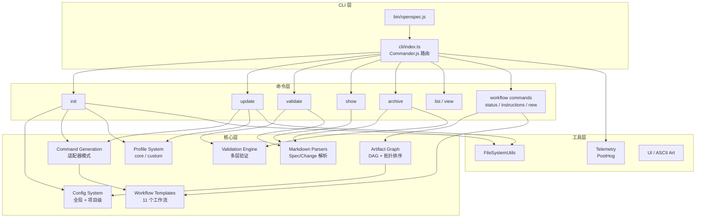
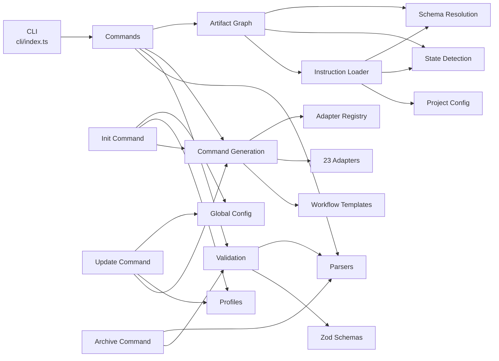
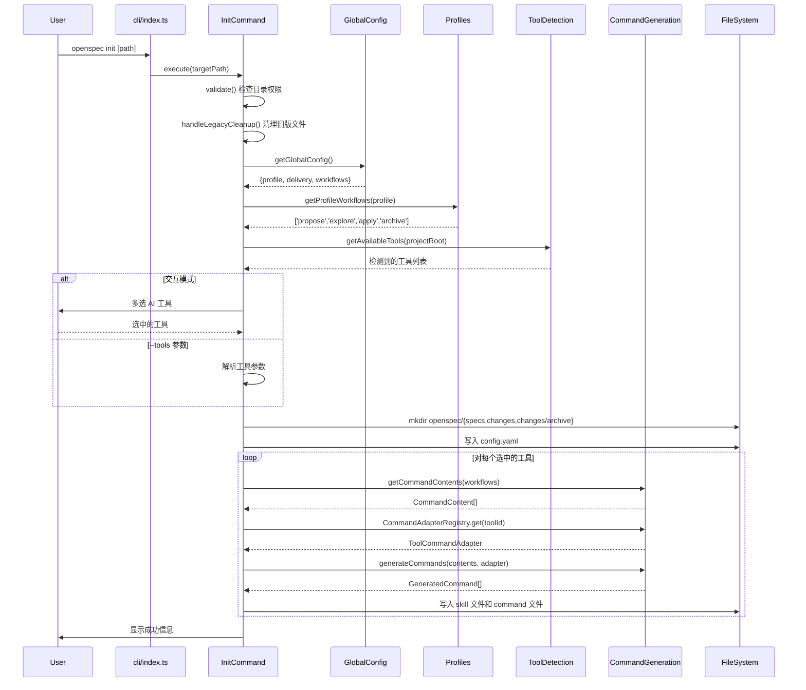
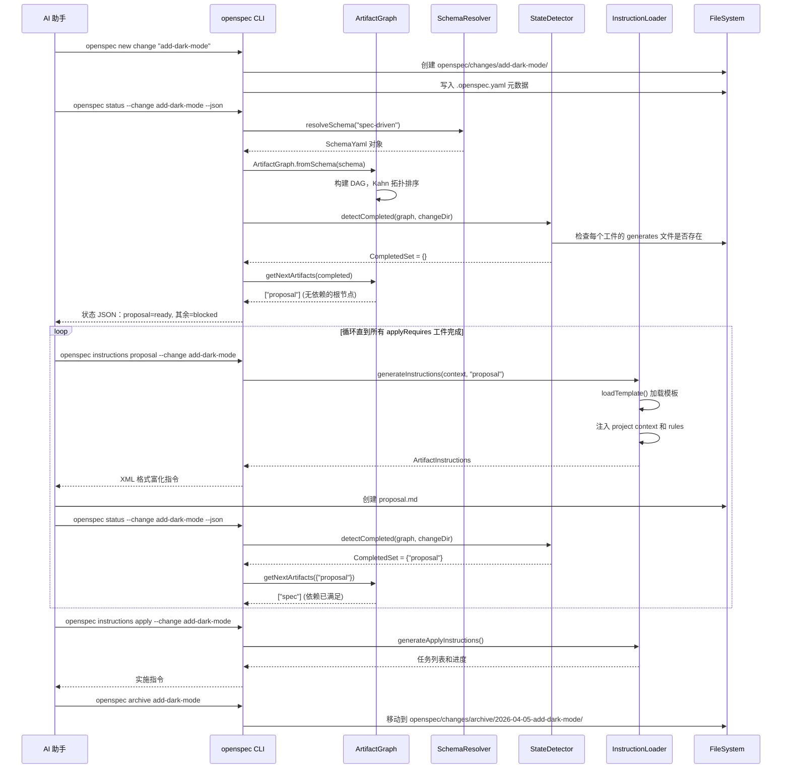

# OpenSpec 源码学习笔记

> 仓库地址：[OpenSpec](https://github.com/Fission-AI/OpenSpec)
> 学习日期：2026-04-05

---

> **以下为 AI 源码分析**
>
> ### 一句话概括
>
> OpenSpec 是一个 AI 原生的 spec-driven 开发框架，通过在 AI 编码助手和开发者之间建立轻量级的规格说明层，让双方在写代码前先达成共识。
>
> ### 要点速览
>
> | 核心模块 | 职责 | 关键文件 |
> |---------|------|---------|
> | CLI 入口 | 命令注册与路由分发 | `src/cli/index.ts` |
> | Artifact Graph | DAG 依赖图、拓扑排序、状态追踪 | `src/core/artifact-graph/` |
> | Command Generation | 多工具适配器模式生成 slash commands | `src/core/command-generation/` |
> | Workflow Templates | 11 个工作流模板（propose, apply, archive 等） | `src/core/templates/workflows/` |
> | Validation | 多层级 Spec/Change 验证引擎 | `src/core/validation/` |
> | Config System | 双层配置（全局 + 项目级）+ Profile 系统 | `src/core/config.ts`, `global-config.ts` |
> | Parsers | Markdown 解析器，提取 Spec 结构化数据 | `src/core/parsers/` |

---

## 项目简介

OpenSpec 是一个面向 AI 编码助手的 spec-driven 开发系统。它解决的核心问题是：当需求仅存在于聊天记录中时，AI 编码助手的输出不可预测。OpenSpec 引入一个轻量级的规格说明层，让人类和 AI 在写代码前先对齐需求。每个变更（change）拥有独立的文件夹，包含 proposal（提案）、specs（规格说明）、design（设计方案）和 tasks（任务清单）。工作流灵活迭代，支持 20+ 种 AI 工具集成，适用于从个人项目到企业级的各种场景。

## 技术栈

| 类别 | 技术 |
|------|------|
| 语言 | TypeScript (ES2022, strict mode) |
| 框架 | Node.js (ESM, NodeNext module) |
| 构建工具 | tsc (TypeScript Compiler，自定义 `build.js` 脚本) |
| 依赖管理 | pnpm |
| 测试框架 | Vitest |
| CLI 框架 | Commander.js |
| Schema 验证 | Zod |
| YAML 解析 | yaml |
| 交互式提示 | @inquirer/prompts |
| 遥测 | PostHog (posthog-node) |

## 目录结构

```
src/
├── cli/                          # CLI 入口，Commander.js 命令注册
│   └── index.ts                  # 主程序，所有命令的注册与路由
├── commands/                     # 命令实现层
│   ├── change.ts                 # change show/list/validate 子命令
│   ├── completion.ts             # shell 补全管理
│   ├── config.ts                 # 配置管理命令
│   ├── feedback.ts               # 用户反馈提交
│   ├── schema.ts                 # schema 管理命令
│   ├── show.ts                   # 统一 show 命令（change/spec 路由）
│   ├── spec.ts                   # spec show/validate 子命令
│   ├── validate.ts               # 统一 validate 命令
│   └── workflow/                 # 工作流命令组
│       ├── index.ts              # barrel 导出
│       ├── instructions.ts       # 生成 AI 可消费的工件指令
│       ├── new-change.ts         # 创建新 change
│       ├── schemas.ts            # 列出可用 schemas
│       ├── shared.ts             # 共享类型和工具函数
│       ├── status.ts             # 工件完成状态展示
│       └── templates.ts          # 模板路径解析
├── core/                         # 核心业务逻辑
│   ├── artifact-graph/           # DAG 工件依赖图系统
│   │   ├── graph.ts              # ArtifactGraph 类，拓扑排序
│   │   ├── resolver.ts           # 三级 schema 解析（项目>用户>包）
│   │   ├── schema.ts             # YAML schema 解析与验证
│   │   ├── state.ts              # 文件系统完成状态检测
│   │   ├── instruction-loader.ts # 工件指令加载与上下文富化
│   │   └── types.ts              # Zod schema 和类型定义
│   ├── command-generation/       # 多工具命令生成系统
│   │   ├── adapters/             # 23+ 工具适配器
│   │   ├── generator.ts          # 命令生成器
│   │   ├── registry.ts           # 适配器注册表
│   │   └── types.ts              # CommandContent, ToolCommandAdapter
│   ├── completions/              # Shell 补全生成/安装（bash/zsh/fish/pwsh）
│   ├── parsers/                  # Markdown 解析器
│   │   ├── markdown-parser.ts    # 基础 Spec/Change 解析
│   │   └── change-parser.ts      # 扩展 delta spec 解析
│   ├── shared/                   # 共享工具
│   │   ├── skill-generation.ts   # Skill 模板生成
│   │   └── tool-detection.ts     # 工具检测与版本追踪
│   ├── templates/                # 工作流模板
│   │   ├── workflows/            # 11 个工作流模板实现
│   │   └── skill-templates.ts    # 模板门面导出
│   ├── validation/               # 验证引擎
│   │   ├── validator.ts          # 多层级验证器
│   │   ├── types.ts              # ValidationReport, ValidationIssue
│   │   └── constants.ts          # 验证阈值和消息
│   ├── archive.ts                # Change 归档
│   ├── config.ts                 # AI 工具定义常量
│   ├── config-schema.ts          # 全局配置 schema
│   ├── global-config.ts          # 全局配置管理（XDG 兼容）
│   ├── init.ts                   # 初始化命令
│   ├── list.ts                   # 列表命令
│   ├── profiles.ts               # Profile 系统（core/custom）
│   ├── project-config.ts         # 项目级配置解析
│   ├── update.ts                 # 更新命令
│   └── view.ts                   # 仪表盘视图
├── prompts/                      # 交互式 UI 组件
├── telemetry/                    # 匿名遥测
├── ui/                           # ASCII 艺术和欢迎屏幕
└── utils/                        # 通用工具函数
    ├── file-system.ts            # 跨平台文件操作
    ├── change-utils.ts           # Change 创建与名称验证
    └── ...                       # 其他工具
```

## 架构设计

### 整体架构

OpenSpec 采用分层架构设计，从上到下分为 CLI 层、命令层、核心层和工具层。核心创新在于 **Artifact Graph（工件依赖图）** 系统，通过 DAG 拓扑排序驱动 spec-driven 开发流程，以及 **Adapter Pattern（适配器模式）** 实现对 23+ AI 工具的统一支持。



### 核心模块

#### 1. Artifact Graph（工件依赖图系统）

工件依赖图是 OpenSpec 的核心引擎，基于 DAG（有向无环图）管理工件间的依赖关系，通过 Kahn 拓扑排序算法确定构建顺序。

**核心文件：**
- `src/core/artifact-graph/graph.ts` — `ArtifactGraph` 类，实现 Kahn 拓扑排序
- `src/core/artifact-graph/schema.ts` — YAML schema 解析，包含环检测（DFS）
- `src/core/artifact-graph/resolver.ts` — 三级 schema 解析：项目 > 用户 > 包
- `src/core/artifact-graph/state.ts` — 文件系统完成状态检测（支持 glob）
- `src/core/artifact-graph/instruction-loader.ts` — 上下文富化的指令生成

**关键接口：**
- `ArtifactGraph.getBuildOrder()` — Kahn 拓扑排序，O(V+E) 复杂度
- `ArtifactGraph.getNextArtifacts(completed)` — 返回当前可执行的工件
- `ArtifactGraph.getBlocked(completed)` — 返回被阻塞的工件及未满足依赖
- `detectCompleted(graph, changeDir)` — 扫描文件系统检测完成状态
- `resolveSchema(name, projectRoot)` — 三级优先级 schema 解析

#### 2. Command Generation（多工具命令生成系统）

采用适配器模式实现对 23+ AI 工具的统一命令生成，将工具无关的内容（`CommandContent`）与工具特定的格式化（`ToolCommandAdapter`）分离。

**核心文件：**
- `src/core/command-generation/types.ts` — `CommandContent`, `ToolCommandAdapter` 接口
- `src/core/command-generation/registry.ts` — `CommandAdapterRegistry` 静态注册表
- `src/core/command-generation/generator.ts` — `generateCommand()` 生成管线
- `src/core/command-generation/adapters/` — 23 个工具适配器

**支持的工具（部分）：** Claude, Cursor, GitHub Copilot, Codex, Gemini, Windsurf, Cline, RooCode, Amazon Q, Kiro 等。

**适配器差异示例：**
- Claude: `.claude/commands/opsx/<id>.md`，frontmatter 含 `name`, `description`, `category`, `tags`
- Cursor: `.cursor/commands/opsx-<id>.md`，frontmatter 含 `/opsx-<id>` 格式的 name 和显式 `id`
- Factory: `.factory/commands/opsx-<id>.md`，仅 `description` 和 `argument-hint`

#### 3. Validation Engine（验证引擎）

多层级验证系统，覆盖 Spec、Change 和 Delta Spec 的完整验证流程。

**核心文件：**
- `src/core/validation/validator.ts` — `Validator` 类
- `src/core/validation/types.ts` — `ValidationReport`, `ValidationIssue`
- `src/core/validation/constants.ts` — 验证阈值和消息模板

**验证管线：** Markdown 解析 → Zod Schema 验证 → 业务规则检查 → ValidationReport

**业务规则：**
- Spec: Purpose 最少 50 字符，Requirement 须含 SHALL/MUST，须有 Scenario
- Change: Delta 描述最少 10 字符
- Delta Spec: 跨区段冲突检测（ADDED/REMOVED/MODIFIED/RENAMED 互斥性）

#### 4. Config System（配置系统）

双层配置架构：全局配置（用户级）+ 项目配置（仓库级），通过 Profile 系统控制功能范围。

**核心文件：**
- `src/core/global-config.ts` — XDG 兼容的全局配置（`~/.config/openspec/config.json`）
- `src/core/project-config.ts` — 项目级 `openspec/config.yaml`
- `src/core/profiles.ts` — Profile 系统：`core`（4 个工作流）/ `custom`（11 个工作流）
- `src/core/config.ts` — 25 个 AI 工具定义常量

**Profile 机制：**
- `core` Profile: 4 个核心工作流 — propose, explore, apply, archive
- `custom` Profile: 全部 11 个工作流，含 new, continue, ff, sync, bulk-archive, verify, onboard

#### 5. Markdown Parsers（解析器）

基于正则和层级提取的 Markdown 解析系统，将非结构化的 Markdown 文本转为结构化的 Spec/Change 对象。

**核心文件：**
- `src/core/parsers/markdown-parser.ts` — `MarkdownParser` 基类
- `src/core/parsers/change-parser.ts` — `ChangeParser` 扩展类，处理 delta spec

**解析能力：**
- 层级 section 提取（按标题级别递归）
- Requirement 提取（含 Scenario）
- Delta 操作识别（ADDED / REMOVED / MODIFIED / RENAMED）
- Rename pair 解析（FROM → TO）

### 模块依赖关系



## 核心流程

### 流程一：openspec init 初始化流程

`openspec init` 是用户的第一个入口命令，负责在项目中初始化 OpenSpec 环境，包括检测/选择 AI 工具、生成 skill 文件和 slash commands。



**关键逻辑：**
1. 首先验证目标目录合法性和权限
2. 检测并清理旧版 OpenSpec 遗留文件（legacy cleanup）
3. 从全局配置读取 Profile（core/custom）决定启用哪些工作流
4. 自动检测项目中已有的 AI 工具（如 `.claude/`、`.cursor/` 目录）
5. 对每个选中的工具，通过适配器模式生成对应格式的 skill 和 command 文件
6. 创建 `openspec/config.yaml` 指定默认 schema（`spec-driven`）

### 流程二：Artifact Graph 驱动的工件创建流程

这是 OpenSpec 的核心工作流程——AI 助手使用 `/opsx:propose` 创建 change 后，通过 Artifact Graph 的 DAG 拓扑排序逐步生成所有工件（proposal → specs → design → tasks）。



**关键逻辑：**
1. `ArtifactGraph.fromSchema()` 构建 DAG，通过 Kahn 算法确定拓扑序
2. `detectCompleted()` 扫描文件系统判断哪些工件已完成
3. `getNextArtifacts()` 返回所有依赖已满足的工件（可并行创建）
4. `generateInstructions()` 将模板、项目上下文、规则和依赖信息组装成 AI 可消费的富化指令
5. 循环直到 `applyRequires` 指定的所有前置工件就绪，进入 apply 阶段
6. apply 阶段读取 `tasks.md` 的 checkbox 列表追踪实施进度

## 关键设计亮点

### 1. Adapter Pattern 实现 23+ 工具统一支持

**解决的问题：** 23+ 种 AI 工具（Claude, Cursor, Copilot, Codex 等）各自有不同的 slash command 文件格式、目录结构和 frontmatter 规范，如何用单一代码库生成所有工具的命令文件。

**具体实现：**
- `ToolCommandAdapter` 接口定义 `getFilePath()` 和 `formatFile()` 两个方法（`src/core/command-generation/types.ts`）
- `CommandAdapterRegistry` 静态注册表在类加载时注册全部 23 个适配器（`src/core/command-generation/registry.ts`）
- `generateCommand()` 函数将工具无关的 `CommandContent` 通过适配器转化为工具特定格式（`src/core/command-generation/generator.ts`）
- 新增工具只需实现一个适配器文件并注册，无需修改核心逻辑

**为什么这样设计：** 开放-封闭原则——对扩展开放（新增适配器），对修改封闭（核心生成逻辑不变）。支持的工具数量从项目初期到现在翻了数倍，适配器模式使得这种增长几乎零成本。

### 2. DAG 拓扑排序驱动工件生成顺序

**解决的问题：** 工件之间有依赖关系（如 design 依赖 proposal 和 specs），需要确保按正确顺序生成，且支持增量式进展（完成一部分后中断，下次继续）。

**具体实现：**
- `ArtifactGraph` 使用 Kahn 算法实现拓扑排序（`src/core/artifact-graph/graph.ts`）
- `schema.ts` 在解析阶段进行环检测（DFS），保证图是 DAG
- `state.ts` 通过文件系统扫描检测完成状态，支持 glob 模式匹配
- `getNextArtifacts(completed)` 返回当前可执行工件，天然支持并行

**为什么这样设计：** 文件系统作为状态存储使得工作流天然支持断点续传——AI 助手可以随时中断，重新查询状态后继续。排序的确定性（通过 ID 字典序打破平局）保证了可重现性。

### 3. 三级 Schema 解析机制

**解决的问题：** 用户需要从包默认 schema、全局自定义 schema 和项目专属 schema 中灵活选择，且高优先级能覆盖低优先级。

**具体实现：**
- `resolveSchema()` 按 项目级 → 用户级 → 包级 的顺序查找（`src/core/artifact-graph/resolver.ts`）
- 项目级：`<projectRoot>/openspec/schemas/<name>/schema.yaml`
- 用户级：`$XDG_DATA_HOME/openspec/schemas/<name>/schema.yaml`
- 包级：`<package>/schemas/<name>/schema.yaml`

**为什么这样设计：** 遵循 XDG Base Directory 规范，与 Linux/macOS 生态一致。三级覆盖机制让企业可以在包级提供标准模板，团队在用户级定制，项目可以进一步特化——类似 Git 的配置层级理念。

### 4. Markdown-as-Spec 的结构化解析

**解决的问题：** Spec 以 Markdown 格式编写（对人友好），但系统需要结构化数据进行验证和操作。

**具体实现：**
- `MarkdownParser` 按标题级别递归提取 section 树（`src/core/parsers/markdown-parser.ts`）
- `ChangeParser` 扩展基类，增加 delta spec 解析能力，支持 ADDED/REMOVED/MODIFIED/RENAMED 四种操作（`src/core/parsers/change-parser.ts`）
- 解析结果通过 Zod schema 验证后用于验证引擎和归档流程

**为什么这样设计：** Markdown 是 AI 工具和开发者的通用语言，无需学习新格式。解析器将"人类友好"的输入转化为"机器可处理"的结构，避免了引入 DSL 的认知开销。

### 5. Profile + Delivery 的正交配置维度

**解决的问题：** 不同用户需要不同级别的工作流功能（新手 vs 高级用户），且不同 AI 工具对 skill 和 command 的支持程度不同。

**具体实现：**
- **Profile** 决定 WHICH（哪些工作流）：`core`（4 个）/ `custom`（自选最多 11 个）（`src/core/profiles.ts`）
- **Delivery** 决定 HOW（如何交付）：`skills`（skill 文件）/ `commands`（slash command 文件）/ `both`（`src/core/global-config.ts`）
- 两个维度正交组合，在 init/update 时联合决定生成什么文件

**为什么这样设计：** 正交维度让配置简洁而强大。新手使用 `core` + `both` 即可开箱即用，高级用户可以精确控制每个维度。update 命令通过版本追踪和配置比对实现智能增量更新，避免不必要的文件重写。
