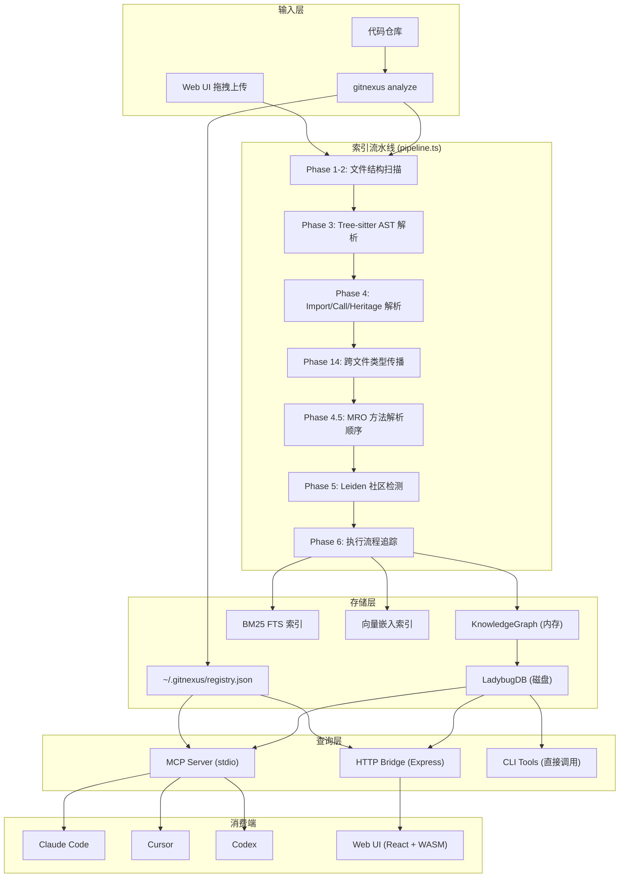
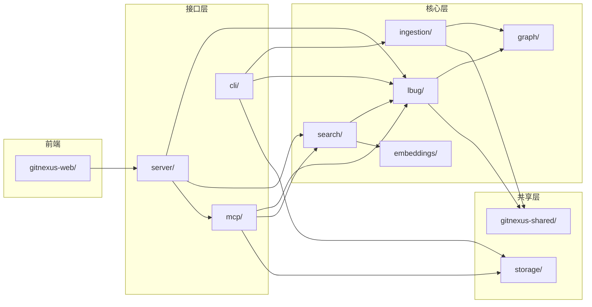
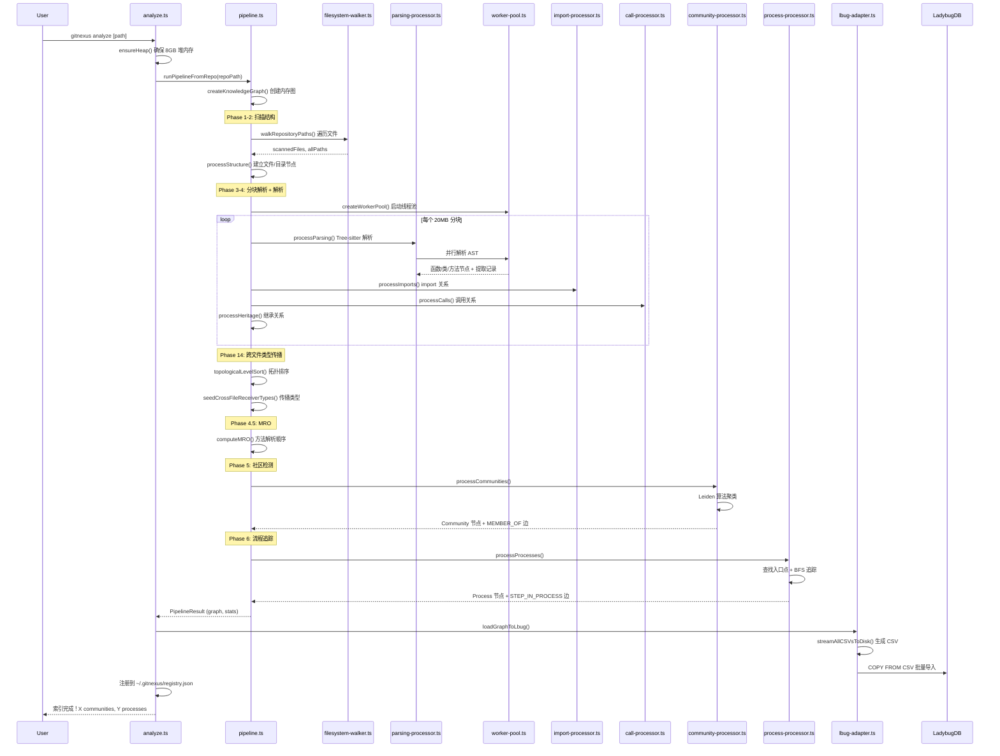
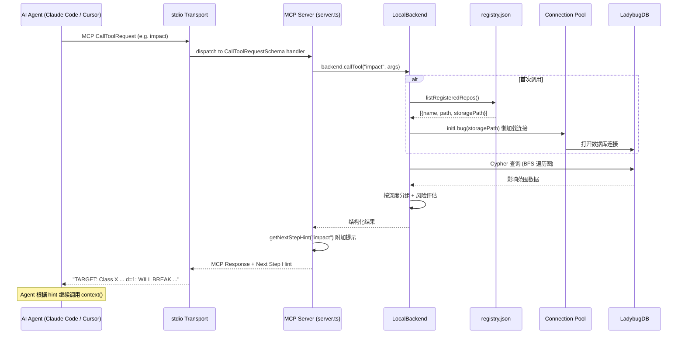

# GitNexus 源码学习笔记

> 仓库地址：[GitNexus](https://github.com/abhigyanpatwari/GitNexus)
> 学习日期：2026-04-05

---

> **以下为 AI 源码分析**
>
> ### 一句话概括
>
> GitNexus 是一个将代码库索引为知识图谱的工具，通过 MCP 协议为 AI Agent 提供深度代码感知能力（依赖追踪、调用链分析、影响范围评估），让 AI 编码工具不再"盲编"。
>
> ### 要点速览
>
> | 核心模块 | 职责 | 关键文件 |
> |---------|------|---------|
> | CLI 入口 | 命令行解析、子命令分发 | `gitnexus/src/cli/index.ts` |
> | Ingestion Pipeline | 多阶段索引流水线（结构→解析→解析→社区→流程） | `gitnexus/src/core/ingestion/pipeline.ts` |
> | Knowledge Graph | 内存知识图谱数据结构（节点 + 关系） | `gitnexus/src/core/graph/graph.ts` |
> | LadybugDB 持久化 | 图数据库存储、Schema 定义、CSV 批量导入 | `gitnexus/src/core/lbug/` |
> | MCP Server | Model Context Protocol 服务端，暴露 16 个 Tool | `gitnexus/src/mcp/server.ts` |
> | LocalBackend | 工具实现层，连接注册表与图数据库 | `gitnexus/src/mcp/local/local-backend.ts` |
> | HTTP Bridge | Express REST API，供 Web UI 连接 | `gitnexus/src/server/api.ts` |
> | Web UI | 浏览器端图探索 + AI 对话（WASM） | `gitnexus-web/src/` |

---

## 项目简介

GitNexus 旨在解决 AI 编码工具（Cursor、Claude Code、Codex 等）缺乏代码结构感知的核心痛点。当 AI Agent 修改一个函数时，它往往不知道有多少其他函数依赖于它的返回类型，导致破坏性变更被忽略。

GitNexus 的做法是：在索引阶段通过 Tree-sitter 解析 AST，构建一个完整的代码知识图谱——包含每个函数、类、接口的定义，以及它们之间的调用、导入、继承、实现关系。然后通过 Leiden 社区检测算法识别功能模块，通过 BFS 追踪检测执行流程。最终通过 MCP 协议将这些预计算的结构化智能暴露给 AI Agent，使其能一次调用就获得完整的上下文，而无需多轮查询。

核心创新点是 **预计算关系智能（Precomputed Relational Intelligence）**：在索引阶段完成聚类、追踪和评分，而非让 LLM 在运行时探索原始图边。

## 技术栈

| 类别 | 技术 |
|------|------|
| 语言 | TypeScript (ES Module) |
| 框架 | CLI: Commander.js / Web: React 18 + Vite |
| 构建工具 | esbuild (自定义 `scripts/build.js`) / Vite |
| 依赖管理 | npm (monorepo, workspace 引用) |
| 测试框架 | Vitest |
| AST 解析 | Tree-sitter (native bindings + WASM) |
| 图数据库 | LadybugDB (嵌入式，支持 Cypher 查询) |
| 向量搜索 | HuggingFace transformers.js + ONNX Runtime |
| 图算法 | Graphology (Leiden 社区检测) |
| Agent 协议 | Model Context Protocol (MCP) |
| 可视化 | Sigma.js + Graphology (WebGL) |
| AI Chat (Web) | LangChain ReAct Agent (支持 OpenAI/Gemini/Anthropic/Ollama) |

## 目录结构

```
GitNexus/
├── gitnexus/                    # 核心 npm 包：CLI + MCP + 索引引擎
│   ├── src/
│   │   ├── cli/                 # 命令行入口和子命令实现
│   │   │   ├── index.ts         # Commander 程序入口，注册所有子命令
│   │   │   ├── analyze.ts       # analyze 命令：索引仓库
│   │   │   ├── mcp.ts           # mcp 命令：启动 MCP stdio 服务
│   │   │   ├── serve.ts         # serve 命令：启动 HTTP bridge
│   │   │   ├── setup.ts         # setup 命令：配置编辑器 MCP
│   │   │   ├── tool.ts          # query/context/impact/cypher 直接调用
│   │   │   └── wiki.ts          # wiki 命令：LLM 驱动文档生成
│   │   ├── core/
│   │   │   ├── ingestion/       # 索引流水线核心（最复杂的模块）
│   │   │   │   ├── pipeline.ts          # 多阶段流水线编排
│   │   │   │   ├── structure-processor.ts # Phase 1-2: 文件/目录结构
│   │   │   │   ├── parsing-processor.ts   # Phase 3: Tree-sitter AST 解析
│   │   │   │   ├── import-processor.ts    # Phase 3: 跨文件 import 解析
│   │   │   │   ├── call-processor.ts      # Phase 4: 函数调用关系
│   │   │   │   ├── heritage-processor.ts  # 继承/实现关系处理
│   │   │   │   ├── community-processor.ts # Phase 5: Leiden 社区检测
│   │   │   │   ├── process-processor.ts   # Phase 6: 执行流程追踪
│   │   │   │   ├── import-resolvers/      # 14 种语言的 import 解析器
│   │   │   │   ├── type-extractors/       # 类型注解提取器
│   │   │   │   ├── field-extractors/      # 字段/属性提取器
│   │   │   │   ├── languages/             # 每种语言的 Tree-sitter 配置
│   │   │   │   └── workers/               # Worker 线程并发解析
│   │   │   ├── graph/           # 内存知识图谱数据结构
│   │   │   ├── lbug/            # LadybugDB 适配层（Schema + 读写）
│   │   │   ├── search/          # 混合搜索（BM25 + 向量 + RRF）
│   │   │   ├── embeddings/      # 向量嵌入生成
│   │   │   ├── group/           # 多仓库组管理（跨仓库合约匹配）
│   │   │   └── wiki/            # Wiki 文档生成（LLM 驱动）
│   │   ├── mcp/                 # MCP 服务端
│   │   │   ├── server.ts        # MCP 协议处理 + next-step hints
│   │   │   ├── tools.ts         # 16 个 Tool 定义（schema）
│   │   │   ├── resources.ts     # MCP Resource 定义
│   │   │   └── local/
│   │   │       └── local-backend.ts  # 工具实现：连接注册表 → LadybugDB
│   │   ├── server/              # HTTP Bridge（供 Web UI 连接）
│   │   │   ├── api.ts           # Express REST + CORS
│   │   │   └── mcp-http.ts      # MCP over StreamableHTTP
│   │   └── storage/
│   │       ├── repo-manager.ts  # 仓库注册表管理（~/.gitnexus/registry.json）
│   │       └── git.ts           # Git 操作工具
│   └── test/                    # 单元测试 + 集成测试
├── gitnexus-web/                # 浏览器端 Web UI
│   └── src/
│       ├── components/          # React 组件（图画布、面板、设置等）
│       ├── core/llm/            # LangChain ReAct Agent + 多 LLM Provider
│       ├── hooks/               # React Hooks（状态管理、Backend 连接）
│       └── services/            # Backend HTTP Client
├── gitnexus-shared/             # 共享类型和常量
│   └── src/
│       ├── graph/types.ts       # GraphNode/GraphRelationship 类型定义
│       ├── languages.ts         # 支持语言枚举
│       └── lbug/schema-constants.ts  # DB Schema 常量
├── gitnexus-claude-plugin/      # Claude Code 插件（skills + hooks）
├── gitnexus-cursor-integration/ # Cursor 编辑器集成（skills）
└── eval/                        # 评估基准测试
```

## 架构设计

### 整体架构

GitNexus 采用经典的 **索引-存储-查询** 三层架构。在索引阶段，通过多阶段流水线将源码转化为知识图谱；存储层使用嵌入式图数据库 LadybugDB 持久化；查询层通过 MCP 协议或 HTTP API 对外暴露工具。整个系统的核心设计理念是"重索引、轻查询"——将计算密集的分析工作前置到索引阶段完成。



### 核心模块

#### 1. Ingestion Pipeline（索引流水线）

**职责**：将源码仓库转化为完整的代码知识图谱。

**核心文件**：
- `pipeline.ts` — 流水线编排，定义 6 个核心阶段 + 多个子阶段
- `parsing-processor.ts` — Tree-sitter AST 解析，提取函数/类/方法/接口等符号
- `import-processor.ts` — 跨文件 import 关系解析
- `call-processor.ts` — 函数调用关系建立，含 receiver type 解析
- `heritage-processor.ts` — 继承（extends）和实现（implements）关系
- `community-processor.ts` — Leiden 社区检测算法
- `process-processor.ts` — 执行流程追踪（BFS 从入口到终端）

**关键设计**：
- **分块解析**（Chunked Parse）：20MB 内存预算限制，避免大型仓库 OOM
- **拓扑排序并行化**（`topologicalLevelSort`）：按依赖层级排序文件，同层文件可安全并行
- **Worker 线程池**：通过 `worker-pool.ts` 和 `parse-worker.ts` 实现多线程 AST 解析
- **14 种语言支持**：每种语言有独立的 import resolver、type extractor、field extractor

#### 2. Knowledge Graph（知识图谱）

**职责**：内存中的图数据结构，作为流水线各阶段的共享状态。

**核心文件**：
- `graph/graph.ts` — `createKnowledgeGraph()` 工厂函数，基于双 Map 实现
- `graph/types.ts` — `KnowledgeGraph` 接口定义

**关键接口**：
- `addNode(node: GraphNode)` / `addRelationship(rel: GraphRelationship)` — 插入
- `getNode(id: string)` — O(1) 查找
- `removeNodesByFile(filePath: string)` — 按文件批量删除（增量索引）
- `forEachNode()` / `forEachRelationship()` — 遍历（避免创建临时数组）

**节点类型**：File, Folder, Function, Class, Interface, Method, CodeElement, Community, Process, Route, Tool, Property, Struct, Enum, Trait, Impl 等

**关系类型**（统一为 `CodeRelation` 表）：CALLS, IMPORTS, EXTENDS, IMPLEMENTS, HAS_METHOD, HAS_PROPERTY, ACCESSES, MEMBER_OF, STEP_IN_PROCESS, HANDLES_ROUTE, FETCHES 等

#### 3. LadybugDB 持久化层

**职责**：将内存知识图谱持久化到嵌入式图数据库，支持 Cypher 查询。

**核心文件**：
- `lbug/schema.ts` — DDL 定义（所有节点表 + CodeRelation 关系表）
- `lbug/lbug-adapter.ts` — 数据库连接、CSV 批量导入、查询执行
- `lbug/csv-generator.ts` — 将图数据流式写入 CSV（用于批量导入）
- `lbug/pool-adapter.ts` — 连接池适配（MCP 多仓库场景）

**Schema 设计**：采用"混合 Schema"——每种节点类型单独建表（`File`, `Function`, `Class`...），但所有关系统一到一张 `CodeRelation` 表，通过 `type` 属性区分关系类型。这让 LLM 能写出自然的 Cypher 查询。

#### 4. MCP Server

**职责**：通过 Model Context Protocol 暴露知识图谱工具给 AI Agent。

**核心文件**：
- `mcp/server.ts` — `createMCPServer()` / `startMCPServer()`，注册 Tool/Resource/Prompt Handler
- `mcp/tools.ts` — 16 个 Tool 的 Schema 定义
- `mcp/resources.ts` — 7 个 Resource 定义
- `mcp/local/local-backend.ts` — 工具实现，连接注册表到 LadybugDB

**亮点设计**：`getNextStepHint()` 函数在每个 Tool 响应末尾附加下一步提示（如"调用完 `query` 后建议用 `context` 深入"），引导 Agent 形成自驱工作流，无需 hook 介入。

#### 5. Hybrid Search（混合搜索）

**职责**：结合关键词搜索和语义搜索，实现高质量代码检索。

**核心文件**：
- `search/bm25-index.ts` — BM25 关键词搜索（基于 LadybugDB FTS）
- `search/hybrid-search.ts` — Reciprocal Rank Fusion (RRF) 融合

**算法**：BM25 和向量搜索各自返回排名列表，通过 RRF（常数 k=60）合并排名，无需分数归一化。这是 Elasticsearch 和 Pinecone 等生产搜索系统使用的标准方法。

#### 6. Web UI

**职责**：浏览器端的图探索器 + AI 对话，全客户端运行（WASM）。

**核心文件**：
- `gitnexus-web/src/App.tsx` — 应用根组件
- `gitnexus-web/src/components/GraphCanvas.tsx` — Sigma.js WebGL 图渲染
- `gitnexus-web/src/core/llm/agent.ts` — LangChain ReAct Agent
- `gitnexus-web/src/core/llm/tools.ts` — Web 端的 Graph RAG 工具
- `gitnexus-web/src/services/backend-client.ts` — Backend HTTP Client

### 模块依赖关系



## 核心流程

### 流程一：代码索引流水线（`gitnexus analyze`）

这是 GitNexus 最核心的流程，将源码仓库转化为知识图谱。整个流水线分 6 个主阶段 + 多个子阶段。



**关键实现细节**：
1. **堆内存保障**：`analyze.ts` 的 `ensureHeap()` 检测堆大小，不足 8GB 时自动 re-exec 进程
2. **分块策略**：`CHUNK_BYTE_BUDGET = 20MB`，每块的源码 + AST + 提取记录同时驻留内存，约占 200-400MB
3. **拓扑排序**：`topologicalLevelSort()` 使用 Kahn 算法将文件按导入依赖分层，同层无互相依赖，可并行处理；循环依赖的文件放入最后一组
4. **跨文件类型传播**：Phase 14 在所有文件解析完成后，沿拓扑顺序传播 receiver type，使 `this.service.method()` 类调用能正确解析到目标方法

### 流程二：MCP 工具调用（AI Agent 查询知识图谱）

这是 GitNexus 的核心价值交付路径——AI Agent 通过 MCP 协议查询代码知识。



**关键实现细节**：
1. **懒加载连接**：LadybugDB 连接在首次查询时才打开，空闲 5 分钟后驱逐，最多 5 个并发连接
2. **多仓库支持**：注册表 (`~/.gitnexus/registry.json`) 记录所有已索引仓库，MCP Server 启动后读取注册表即可服务所有仓库
3. **Next-Step Hints**：每个工具响应末尾附加下一步操作建议，引导 Agent 形成 `query → context → impact` 的自然工作流
4. **stdout 安全**：MCP 使用 stdio，但 LadybugDB 可能输出日志到 stdout。通过 Proxy 拦截 `process.stdout.write`，确保只有 MCP 消息经过 stdout

## 关键设计亮点

### 1. 预计算关系智能 vs 传统 Graph RAG

**问题**：传统 Graph RAG 将原始图边交给 LLM，让它自行探索，通常需要 4+ 次查询才能理解一个函数的全貌。

**实现**：GitNexus 在索引阶段预计算社区（Leiden 聚类）、执行流程（BFS 追踪）、影响范围（深度分组 + 置信度评分），工具返回的是已结构化的完整上下文。一次 `impact()` 调用就返回所有深度的影响符号、受影响的执行流程和风险级别。

**为什么**：这使得较小的模型也能获得完整的架构上下文（"Model Democratization"），同时大幅减少 token 消耗。

*关键文件*：`community-processor.ts`、`process-processor.ts`、`local-backend.ts`

### 2. 分块拓扑并行化的索引策略

**问题**：大型代码库可能有数万个文件，全部加载到内存会 OOM；文件间存在导入依赖，简单并行会导致类型解析失败。

**实现**：
- `CHUNK_BYTE_BUDGET = 20MB` 限制每次加载的源码量
- `topologicalLevelSort()` 使用 Kahn 算法按导入依赖分层
- Worker 线程池并行解析同层文件的 AST
- Phase 14 在所有文件解析完成后，沿拓扑顺序执行跨文件 receiver type 传播

**为什么**：在内存安全的前提下最大化并行度。拓扑排序保证类型信息按依赖顺序传播，Worker 线程池利用多核加速 AST 解析。

*关键文件*：`pipeline.ts`（`topologicalLevelSort`, `CHUNK_BYTE_BUDGET`）、`workers/worker-pool.ts`

### 3. 混合 Schema 设计（节点分表 + 关系单表）

**问题**：LLM 需要写 Cypher 查询来查询图数据库，过于复杂的 Schema 会导致查询出错。

**实现**：节点按类型分表（`File`, `Function`, `Class`, `Method`...），但所有关系统一为一张 `CodeRelation` 表，通过 `type` 属性（`CALLS`, `IMPORTS`, `EXTENDS`...）区分。

**为什么**：LLM 只需记住一种关系写法 `[:CodeRelation {type: 'CALLS'}]`，大幅降低查询出错率。同时节点分表保留了类型标签过滤的能力（`MATCH (f:Function)`）。

*关键文件*：`lbug/schema.ts`

### 4. Next-Step Hints 引导 Agent 工作流

**问题**：AI Agent 调用一次工具后常常停下来，不知道接下来该做什么。

**实现**：`server.ts` 中的 `getNextStepHint()` 函数在每个工具响应末尾附加结构化的下一步建议。例如 `context()` 后建议"如果要修改，用 `impact()` 检查影响范围"；`impact()` 后建议"先检查 d=1 的直接依赖"。

**为什么**：无需 hook 或额外配置，通过工具响应本身就能引导 Agent 形成 `query → context → impact` 的分析工作流。这是一种轻量级的 Agent 行为引导模式。

*关键文件*：`mcp/server.ts`（`getNextStepHint` 函数）

### 5. 统一的多语言 Provider 抽象

**问题**：支持 14 种语言，每种语言的 import 语义、导出检测、类型提取逻辑各不相同。

**实现**：`LanguageProvider` 接口统一抽象，每种语言实现自己的 `importSemantics`（`named` / `wildcard` / `namespace`）、Tree-sitter query patterns、type extractor 和 import resolver。流水线通过 `getProviderForFile()` 按文件扩展名获取对应 provider，无需硬编码语言判断。

**为什么**：新增语言支持只需实现一个 Provider + 对应的 resolver/extractor，不需要修改流水线核心逻辑。`isWildcardImportLanguage()` 和 `needsSynthesis()` 等辅助函数也从 Provider 的 `importSemantics` 派生，而非硬编码语言列表。

*关键文件*：`ingestion/language-provider.ts`、`ingestion/languages/index.ts`、`ingestion/import-resolvers/`
