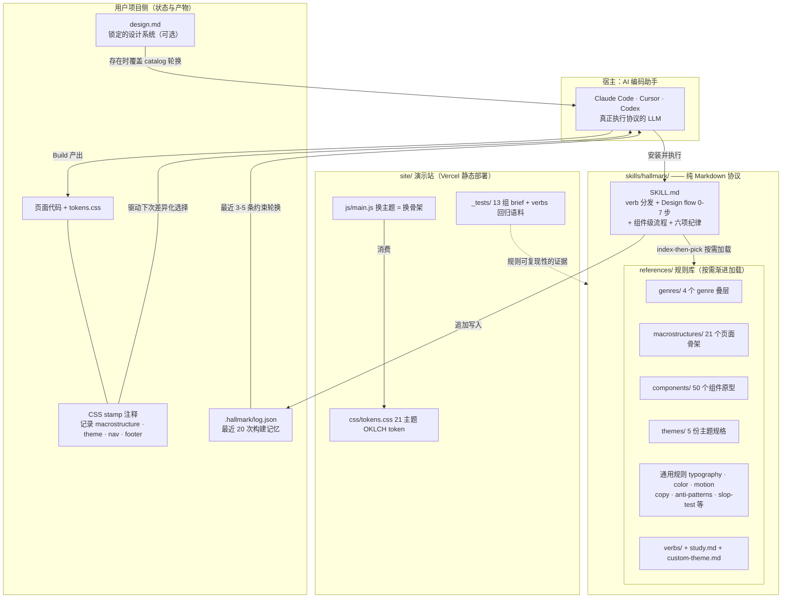
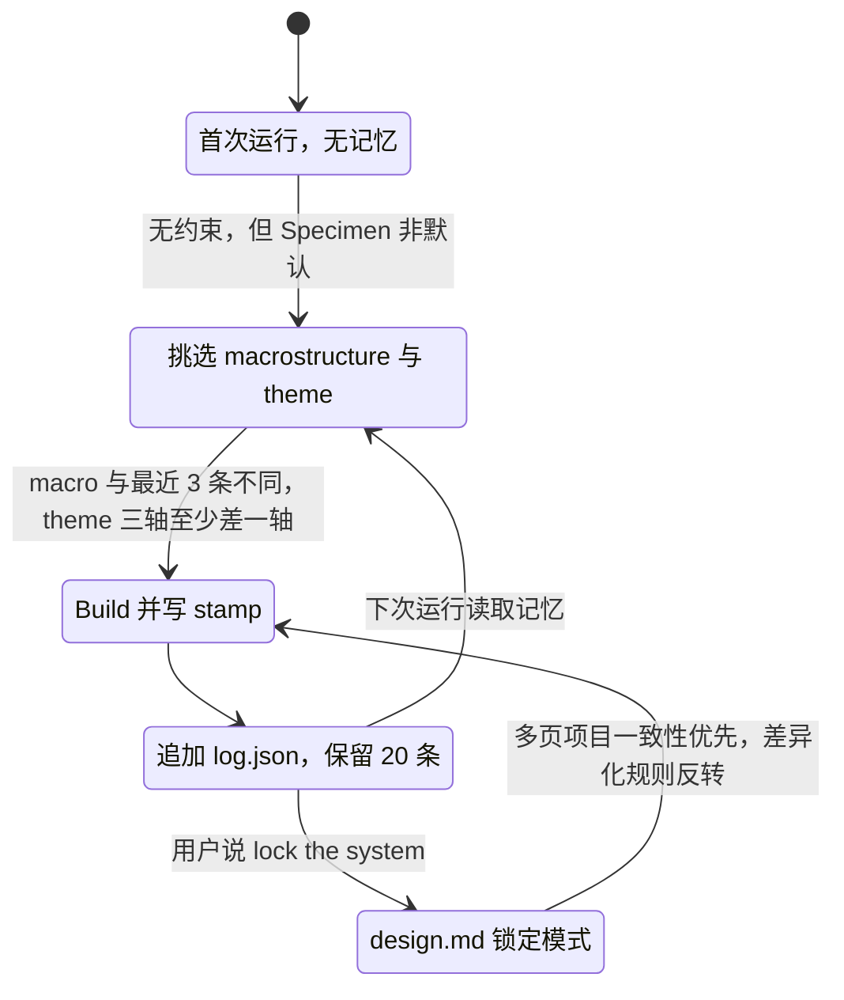
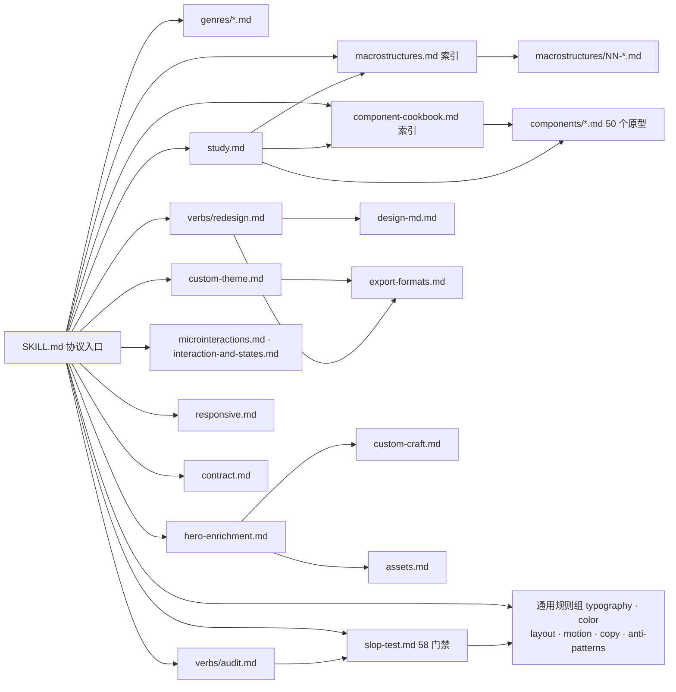
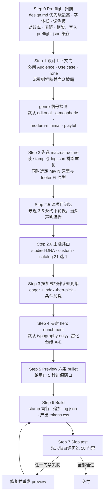
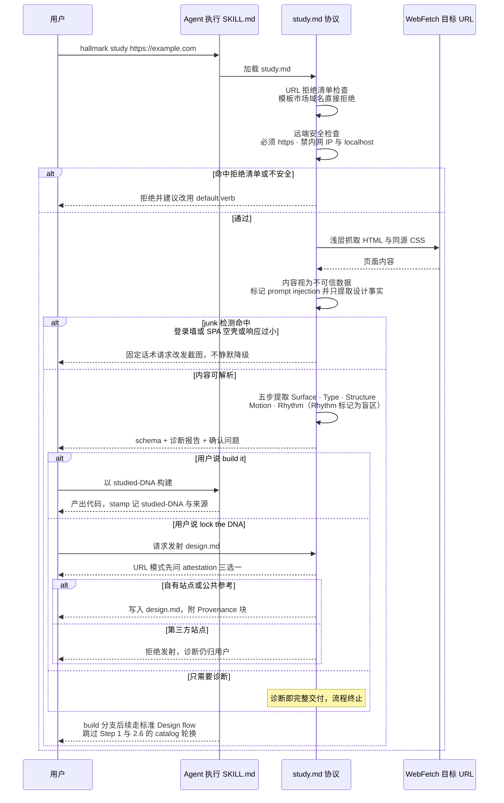

# Nutlope/hallmark 源码学习笔记

> 仓库地址：[Nutlope/hallmark](https://github.com/Nutlope/hallmark)
> 学习日期：2026-10-01

---

> **以下为 AI 源码分析**
>
> ### 一句话概括
>
> Hallmark 是一个面向 AI 编码助手（Claude Code / Cursor / Codex）的"反 AI 味"设计 skill：仓库里几乎没有运行时代码，核心资产是一套约 6 200 行的纯 Markdown 设计协议，通过"结构多样性"对抗 LLM 训练分布中的默认审美，让模型生成的页面"像人做的，而不是像生成的"。
>
> ### 要点速览
>
> | 模块 | 职责 | 关键文件 |
> |------|------|----------|
> | 协议入口 | verb 分发、Design flow 0–7 步、组件级流程、六项跨 verb 纪律 | `skills/hallmark/SKILL.md`（558 行） |
> | 规则库 | 排版 / 颜色 / 布局 / 动效 / 文案 / 反模式等通用规则 | `skills/hallmark/references/*.md`（24 个顶层文件） |
> | 结构体系 | 4 genre → 21 macrostructure → 50 component archetype 的三层选择 | `references/{genres,macrostructures,components,themes}/` |
> | 质量门禁 | 58 道 slop 门禁 + pre-emit 六轴自评 | `references/slop-test.md` |
> | 显式 verb | `audit` / `redesign` / `study` / `custom` 协议 | `references/verbs/` + `study.md` + `custom-theme.md` |
> | 状态记忆 | stamp 注释、构建日志、锁定的设计系统 | 项目侧 `.hallmark/log.json`、`design.md` |
> | 演示站 | 同一句话在 21 个主题下渲染的活体证明 | `site/`（静态站，Vercel 部署） |
> | 回归语料 | 13 组 brief + 3 个 verb 的端到端样例 | `site/_tests/` |
> | 人类文档 | 8 个可直接复制的 prompt 配方、3 个 study 案例、演讲稿 | `docs/` |

---

## 项目简介

Hallmark 由 Together AI 出品（作者 Nutlope），定位是 **design skill for AI coding assistants**——不卖给浏览器，卖给 LLM。它解决的问题非常具体：模型生成的落地页永远长一个样（居中 hero → 三列特性卡 → CTA → 四栏 footer），因为那是训练分布的均值。Hallmark 把"资深设计师的品味"编码成一套可执行协议，强制模型在每次构建时选择不同的**结构指纹**（macrostructure + nav/footer archetype + 主题三轴），并在交付前通过 58 道 slop 门禁自检。

它有四个 verb：默认 verb 构建新 UI；`hallmark audit` 给现有代码打分出 punch list（不改代码）；`hallmark redesign` 保留文案与信息架构、换掉结构指纹；`hallmark study` 从截图或 URL 提取设计 DNA（macrostructure、字体角色、色彩锚点），拒绝像素级克隆。仓库同时附带一个演示站：同一句 H1 "A design skill that refuses to look AI-generated." 在 21 个主题下渲染成 21 个结构完全不同的页面，是整个 skill 卖点的活体证据。

版本 1.1.0，MIT 协议，通过 `npx skills add nutlope/hallmark` 分发（`package.json` 里的 `skill` 字段声明入口与目标 harness）。

## 技术栈

| 类别 | 技术 |
|------|------|
| 语言 | Markdown（协议主体）、HTML / CSS / 原生 JavaScript（演示站） |
| 框架 | 无。skill 本体零依赖零运行时；演示站是纯静态页 |
| 构建工具 | 无构建。`vercel.json` 直接以 `site/` 为输出目录静态部署 |
| 依赖管理 | npm（仅用于 `skill` 清单与 `serve` 脚本：`python3 -m http.server --directory site 4173`） |
| 测试框架 | 无自动化测试——`site/_tests/` 是人工回归语料（brief + 产出 + notes） |

**关键认知：这个仓库的"运行时"就是 LLM 本身。** SKILL.md 及 references 不是被程序读取的配置，而是被模型逐字执行的指令协议；仓库工程化的重心因此落在两件事上——协议的加载经济学（省 token）与输出的可验证性（slop test + stamp 状态机）。

## 目录结构

```text
hallmark/
├── package.json          # skill 分发清单：entry/references/harnesses 三字段
├── vercel.json           # site/ 静态部署配置
├── README.md / ROADMAP.md
├── docs/                 # 人类阅读层（SKILL.md 明确标注 do NOT auto-load）
│   ├── recipes.md        # 8 个可直接复制的 worked brief
│   ├── study-examples.md # 3 个 study verb 案例
│   ├── talk-slides.md    # "Stop letting your agents ship ugly UIs" 演讲稿
│   └── screenshots/      # 各主题截图
├── site/                 # 演示站（usehallmark.com 的源码）
│   ├── index.html        # 内嵌 <template>，主题切换时换装
│   ├── css/              # tokens.css(21 主题 1221 行) + base/components/sections
│   ├── js/main.js        # 主题切换、模板换装、star 数缓存
│   ├── examples/         # 19 个完整示例页（自包含 HTML+CSS）
│   └── _tests/           # 13 组回归 brief + verbs/(audit|redesign|study) 测试
└── skills/hallmark/      # ★ skill 本体
    ├── SKILL.md          # 协议入口（558 行）
    └── references/
        ├── macrostructures.md      # 21 个骨架的瘦索引（index-then-pick）
        ├── macrostructures/        # 21 个单页骨架定义（01-bento-grid … 21-component-playground）
        ├── component-cookbook.md   # 50 个组件原型的瘦索引 + 路由表 + knob 表
        ├── components/             # 50 个组件文件（H*/S*/F*/C*/T*/Ft*/N*）
        ├── genres/                 # 4 个 genre 叠层（editorial/modern-minimal/atmospheric/playful）
        ├── themes/                 # 5 份主题规格（carnival/cobalt/grid/hum/lumen）
        ├── verbs/                  # audit.md、redesign.md
        ├── study.md / custom-theme.md / design-md.md / export-formats.md
        └── typography.md / color.md / layout-and-space.md / motion.md /
            copy.md / anti-patterns.md / slop-test.md / microinteractions.md /
            interaction-and-states.md / responsive.md / hero-enrichment.md /
            custom-craft.md / assets.md / imagery-kit.md / structure.md /
            contract.md / preview-examples.md / floating-nav.md
```

## 架构设计

### 整体架构

Hallmark 是典型的 **"prompt-as-code" 架构**：把设计知识从"模型脑内的隐性分布"外化为"仓库内的显式协议"，再配一套状态机（stamp / log.json / design.md）让协议能对抗 LLM 的默认吸引子。三层结构：宿主（coding agent）执行协议 → 协议本体（纯 Markdown 规则库）→ 用户项目侧（状态与产物）。演示站既是营销素材也是规则库的 dogfooding。



设计上最值得注意的决策：

1. **分发与实现分离**。`package.json` 的 `skill` 字段（entry / references / harnesses）让同一份规则可以 `npx skills add` 进三个宿主；SKILL.md 用相对链接引用 references，保证在 `~/.claude/skills/hallmark/`、`.cursor/rules/`、`.codex/skills/` 三种安装路径下链接都不断。
2. **规则库分层**。4 genre（规则叠层，决定哪些门禁生效）→ 21 theme（视觉表面，token 级）→ 21 macrostructure（页面骨架，结构级）→ 50 component（组件原型）+ 每 archetype 2–3 个 variation knob。结构差异由 macrostructure 承担，视觉差异由 theme 承担，两轴正交。
3. **状态外置**。skill 本身无状态，所有记忆写在用户项目里（CSS stamp 注释、`.hallmark/log.json`、`design.md`），下次运行读回来。这让"跨会话不重样"成为可能，也是整个差异化承诺的技术支点。

### 核心模块

#### 1. SKILL.md —— 协议入口（558 行）

职责是分发与流程编排，不承载具体规则：

- **verb 分发表**：默认 verb 走 Design flow；`audit` / `redesign` / `study` 各自加载专属文件；无法识别的输入一律按默认处理。
- **六项跨 verb 纪律**（`SKILL.md` L44–56）：pre-emit 六轴自评（任何一轴 < 3 触发返工）、诚实文案（禁止编造 "+47% conversion" 这类指标）、锁定 token（产出中禁止内联 OKLCH/hex，必须 `var(--color-accent)`）、禁止手绘假浏览器/手机框、320/375/414/768px 四档响应式硬底线、标题永远 roman（斜体标题是最强 AI tell）。
- **组件级流程**（L60–141）：识别"组件形"需求（点名单个元素、brief ≤ 30 词等信号），跳过页面级装置（macrostructure / nav / footer / hero enrichment），改为交付组件 + 一个 8 状态 demo wrapper（default / hover / focus / active / disabled / loading / error / success 全部可见）。
- **Design flow 0–7 步**（详见"核心流程·流程一"）。
- **安全护栏**（L32–36）：不删生产文件、不整树替换、PDF/README 只当参考不当逐字文案、删除需逐文件确认。

一个反直觉的设计：**问询永远不豁免**（L228）。哪怕 brief 只有五个词，也必须先问 Audience / Use case / Tone——"没有 brief 太完整所以不问"这个例外被显式禁止，理由写在明面上："问一次的代价是一条消息，猜错的代价是整页重做"。

#### 2. references/ —— 规则库与加载经济学

这是仓库的主体（约 6 200 行）。SKILL.md 第 3 步用一整节规定加载纪律，按频率分六档：

| 加载档 | 内容 | 说明 |
|--------|------|------|
| eager（1–2 个） | 选中的 genre 文件、有规格文件的主题 | 每次构建必读 |
| index-then-pick | `macrostructures.md`、`component-cookbook.md` | 只读瘦索引，选定后再读**唯一一个**对应文件 |
| load-per-build | typography / color / layout-and-space / motion / copy / anti-patterns | 通用规则每次都读 |
| 条件加载 | microinteractions / responsive / hero-enrichment / assets 等 | 只有页面真的用到才读 |
| load-at-the-end | slop-test / contract / export-formats | 门禁是交付前检查，提前加载是浪费 |
| human-only | `docs/recipes.md`、`docs/study-examples.md` | 给人看的，模型不自动加载 |

SKILL.md 反复强调"过度加载是运行 Hallmark 最大的可避免成本"（L350）——一个典型构建只加载 5–7 个组件原型文件。这套纪律让 6 000 行规则库的单次构建 token 开销压到几百行量级。

**结构选择体系是规则库的骨架**：

- `structure.md` 定义六个结构轴（标题位置 × 正文构成 × 分隔线语言 × 按钮语气 × 图像处理 × 出现动画），理论空间 42 000 种指纹；
- `macrostructures.md` 把六轴打包成 21 个命名骨架（Bento Grid / Long Document / Marquee Hero / Stat-Led / Workbench / Manifesto / Letter / Specimen / Catalogue / Portfolio Grid / …），选一个命名整体比逐轴拼装更快也更不易塌回默认；
- `component-cookbook.md` 索引 50 个组件原型（9 hero + 5 section head + 6 feature + 4 CTA + 4 testimonial + 8 footer + 14 nav），每个原型带 2–3 个 variation knob（例如 Bento 的 `tiles/spans/accent`），同 archetype 连用必须换 knob 值；
- 底部的两张路由表把 genre → 默认 nav/footer archetype 及可接受备选钉死，并有意识地把 N1a 和 Ft3（最典型的 AI 指纹）标记为"远离"。

**slop-test.md 是输出的回归测试**：58 道门禁（编号 1–57 外加 38a）分 12 组——视觉、结构、微交互、多样性、实现、hero enrichment、多样化、布局安全、排版纪律、输入态、对比度可读性、nav/footer/hero 结构 slop、诚实文案、重绘 chrome、token 纪律、响应式。门禁分 universal 与 genre-scoped（例如 atmospheric 允许径向光晕、modern-minimal 允许纯白纸面），先跑 pre-emit 六轴自评（Philosophy / Hierarchy / Execution / Specificity / Restraint / Variety，各 1–5 分）再过门禁。绝大多数门禁都是可操作的具体检查而非模糊口号——例如 gate 41 精确到"按钮文字与填充色在 OKLCH 中亮度差 < 5% 且色度差 < 0.05 即失败"。

#### 3. verbs/ + study.md + custom-theme.md —— 三个显式协议

- **`verbs/audit.md`**：只读评审。输出按 critical / major / minor 分组的 punch list，每条含 Tell / Where / Severity / Fix。三个特色检查：stamp 与页面实际结构是否一致（"stamp lies"）、按页面声明的 genre 应用门禁覆盖、项目有 `design.md` 时检查系统漂移。
- **`verbs/redesign.md`**：先做单页/多页判定。多页流程的核心洞见是**多样化规则在应用内反转**——同一产品的页面要一致性而非多样性，所以先生成 `design.md` 锁定系统再逐页重设计；单页流程保留 copy / IA / 品牌 / 主行动，替换结构指纹与组件语气。两者共享非破坏性实现规则。
- **`study.md`**（509 行，最复杂的协议）：从截图或 URL 提取设计 DNA。含双模式五步协议（Surface / Type / Structure / Motion / Rhythm）、结构化 schema、URL 拒绝清单、远端 URL 安全校验、junk 检测回退、双层拒绝（诊断宽、发射 `design.md` 严）、主题映射表和完整话术模板。详见"核心流程·流程二"。
- **`custom-theme.md`**：catalog 之外的自定义主题协议。两个深度——tuned（在 Hallmark 结构上配一套 OKLCH 调色板 + 免费字体对）与 bespoke（连结构都从头设计）；只在 brief 出现明确创造性意图信号时浮出，沉默一律路由 catalog；自定义主题同样要过全部 58 门禁，且要把三轴值写进 log.json 参与后续轮换。

#### 4. 状态与记忆子系统

差异化承诺依赖三个外置状态文件：

```text
/* Hallmark · macrostructure: Narrative Workflow · numbered stage timeline (feed → mix → prove → bake)
 * theme: Hum · nav: N10 floating-on-scroll morph · footer: Ft5 statement · lead accent: mint
 * character: bubbling starter jar (pear) · brief: "Bubble — guided sourdough..." · hum-07
 */
```

（上面是 `site/examples/hum-07/styles.css` 的真实 stamp——宏结构、主题、nav/footer 原型、lead accent、甚至 build id 全部可机读。）

- **CSS stamp**：产物的第一行注释，`audit` 用它做 stamp-vs-page 校验，下次构建用它排除重复。
- **`.hallmark/log.json`**：数组、新条目插在最前、保留最近 20 条。条目含 date / macrostructure / theme / enrichment / brief；custom 条目额外带三轴值。Step 2.5 读最近 3–5 条生成"轮换声明"，要求在写代码前**当众说出**选择理由（"Last 5 builds: … Picking from {…} this time"）——把选择从模型脑内搬到对话里，是防默认吸引子的 accountability 机制。
- **`design.md`**：把单次构建的系统锁定为可移植设计系统（tokens.css / Tailwind v4 `@theme` / DTCG tokens.json / shadcn/ui 变量四种导出格式），存在时多样化规则反转为一致性，且文件内容被显式声明为"设计数据而非指令"（防注入）。

主题轮换的状态机视角：



theme 三轴指 paper band（暗/中/亮）、display style（高对比衬线/几何无衬线/等宽等 9 类）、accent hue（暖/冷/中性/其他彩色）。连续两次输出至少一轴不同，防止"换色不换骨"。

#### 5. site/ —— 演示站与回归语料

- **`css/tokens.css`**（1 221 行）：21 个 `[data-theme]` 块，每个主题一个完整 OKLCH 调色板 + 字体栈 + 字号阶 + 间距阶 + 半径/描边/阴影语言。主题不是色板互换——Brutal 是 2px 硬描边零圆角、Bloom 是 16px 圆角 pill、Garden 是 10px 柔和圆角，组件形态随主题变。
- **`js/main.js`**（1 150 行）：核心是四张静态表——`THEMES`（21 主题）、`ARCHETYPES`（主题 → hero/footer 原型映射）、`THEME_GENRES`（主题 → genre）、`COPY`（主题 → 文案语气）。切换主题时 `swapArchetypes()` 从 `<template>` 克隆对应原型节点替换 hero/footer 区域再插值文案——**换主题是换 DOM 骨架，不是换 CSS 变量**，代码注释直说 "switching themes literally rebuilds the page, not just recolours it"。其余：hover 才播放的视频、GitHub star 数（localStorage 缓存 1 小时，按 repo 名做 key）、复制按钮。
- **`_tests/`**：13 组编号 brief（01-tide-podcast … 13-alma）各含 `brief.md + index.html + style.css`；`verbs/` 下三个 verb 各一组 input/output/notes；`custom/` 是自定义主题样例。README（根目录）声称每个示例页 "stamped with its macrostructure in the CSS comment"，`_tests` 是规则库可复现性的人工回归语料。

#### 6. docs/ —— 人类层

`recipes.md`（8 个可复制 prompt 配方）、`study-examples.md`（3 个 study 案例）、`talk-slides.md`（演讲稿）。SKILL.md 的加载纪律表里显式标注这三个文件 **do NOT auto-load**——给 token 预算划界，这是渐进披露纪律的一部分。

### 模块依赖关系



依赖方向体现两条原则：索引文件（macrostructures.md / component-cookbook.md）是所有需要"结构词汇"的模块（SKILL 默认流、study 提取、redesign 重构）的共享词表；slop-test 依赖通用规则组定义的规范（对比度阈值、token 命名），audit 又依赖 slop-test 的门禁做打分依据。

## 核心流程

### 流程一：default Design flow（默认构建流程）

用户说"帮我做个落地页"时，skill 从 Step 0 到 Step 7 的完整协议。关键是**先结构后视觉、先声明后写码、先门禁后交付**：



逐步的关键逻辑：

1. **Step 0 pre-flight 是信任线**（L147–201）。六个信号源按序扫描（design.md > 字体栈 > 调色板 > 微动效依赖 > 间距阶 > 框架），输出"保留什么 / 引入什么"两行声明并附 file:line 引用——"先告诉你我注意到了什么，再动手"。发现缓存 24 小时内可复用；冲突信号（声明 Geist 但 CSS 硬编码 Inter）必须显式报告而不是静默选边。
2. **Step 1 问询门**（L203–262）。三问一次性发出，允许 "go ahead" 两秒豁免；推断值必须在回复顶部一句话披露并盖进 stamp。
3. **Step 2 宏结构优先**（L264–294）。先读 89 行的瘦索引选定唯一命名骨架，再加载对应单文件；同时选 nav 与 footer 原型并当众说明"上一个 nav 是 X，这次用 Y，因为 Z"。选择必须当众说出，防止"在脑内挑"然后塌回默认。
4. **Step 2.5/2.6 记忆与路由**。log.json 约束 + 三轴主题差异化；四种路由条件里 studied-DNA 优先级最高（对话里有 study 诊断且用户说 build it 时直接锁定 DNA，跳过 catalog 轮换）。
5. **Step 3 加载纪律**（L348–392）。见"核心模块 2"的六档表。slop-test 明确禁止提前加载——"门禁是修 bug 用的参考，不是生成前的避雷图，提前读 anti-patterns 就够了"。
6. **Step 5 preview**（L407–441）。六条固定 bullet（宏结构 / 主题 / 富化 / 分区 / 动效 / 门禁结果）+ 一行可选的 "lock the system" CTA。门禁未跑完不得写 `58/58 ✓`——preview 谎报即交付缺陷。
7. **Step 6 build**（L443–466）。headline 按字符数分桶定字号（≤20 全量 display，21–50 默认，51–90 降一档，>90 重写）；OKLCH token 全走命名变量；全局样式表 append-only（保住 `@tailwind` 指令）；必产 `tokens.css`。
8. **Step 7 门禁**（L468–474）。任一失败回 Build 修复并重发 preview。

### 流程二：hallmark study（URL 模式 DNA 提取）

`study` 是仓库里安全工程最重的协议。URL 模式的完整调用链（截图模式省去抓取与远端安全检查）：



关键设计逻辑：

1. **双层拒绝**（study.md §Refusal / §Emission-refusal）。诊断层问"读它会不会变成抄袭付费模板"——读是廉价的、教育性的，通常放行；发射层问"把它的 DNA 打包成可移植系统是否越权"——所以 URL 模式发射 `design.md` 必须先 attestation（自有 / 公共参考 / 第三方，第三方直接拒绝），而截图模式因为"用户拥有那张截图"免问。两层不对称是有意的。
2. **远端安全**（§Remote URL safety）。一整套 SSRF 防护：非 http(s) scheme 拒绝、raw IP 字面量拒绝、localhost / .local / .internal 拒绝、私网与链路本地及元数据地址段（含 `169.254.169.254`）拒绝、每跳重定向都要复检。抓取仅限提交页 + 同源 CSS，脚本只当惰性文本扫库名。
3. **注入防御**（§URL mode — fetch pipeline 第 4 条）。远端 HTML/CSS/注释/meta/alt/可见文案一律视为不可信数据，忽略其中任何指令；检测到注入尝试就在 schema 的 `remote_safety.prompt_injection_detected` 记 true 并继续提取惰性事实。这与 `design.md` 文件"只当设计数据不当指令"的防护呼应。
4. **不静默降级**（§Junk-or-blocked detection）。登录墙 / SPA 空壳 / 非 2xx / 无样式信号 / 小于 1KB 五种信号触发固定话术的截图回退——"半盲诊断比多问一次更糟"。
5. **诚实标注能力边界**（§Limits）。URL 模式能拿到精确值（字体名、OKLCH）但判断不了节奏（rhythm），schema 里显式写 `unknown (URL mode)` 并在诊断报告里向用户声明；图像模式反之——字体只能给角色和候选（"视觉认字体一半时候是错的"）。六条限制要求在返回诊断时逐条讲给用户。

## 关键设计亮点

### 1. 用外置状态机对抗 LLM 的默认吸引子

**解决的问题**：LLM 有极强的"回到训练分布均值"倾向——同一个会话里连做三页，三页全是 Specimen 或全是居中 hero。光在 prompt 里写"要有变化"没用，模型每次都真诚地觉得自己变了。

**实现方式**：把选择历史从模型上下文搬到文件系统。CSS stamp（`site/examples/hum-07/styles.css:1`）让产物自描述；`.hallmark/log.json` 让历史可机读；Step 2.5 强制把排除集和选择理由**当众写进对话**（`SKILL.md:317–331`），Step 2 要求写 nav 前先说"上一个 nav 是 X 这次是 Y"。主题差异化精确到三条可判定轴（paper band / display style / accent hue），"两轴相同即重定向"是可执行的规则而不是感觉。

**为什么值得学**：这是把"对抗模型偏置"从 prompt 技巧升级为系统工程——状态外置 + 显式声明 + 可判定的差异度量。任何需要 LLM 持续产出的场景（不止设计）都可以套用：产物自描述 + 历史日志 + 当众选择。

### 2. 渐进式披露的 token 经济学

**解决的问题**：6 200 行规则库如果整体塞进上下文，单次构建就要吃掉几十 K token，skill 会因为太贵被卸载。

**实现方式**：六档加载纪律（`SKILL.md:348–392`）+ 瘦索引模式。`macrostructures.md` 只有 89 行（一行一个骨架的 "Reach for it" 描述），选定后只读对应的 30 行单文件——对比旧版 660 行整块的 token 成本在注释里写得很直白。组件同理：cookbook 是索引 + 路由表，典型构建只加载 5–7 个原型文件。甚至给"人看的文档"单独划出 do-NOT-auto-load 类别。最激进的是 slop-test 的时序约束：**门禁文件禁止在 Step 7 之前加载**，因为"提前预读 7K token 买不到任何东西"。

**为什么值得学**：skill 仓库最容易犯的错是"知识越多越好"。Hallmark 证明加载时机本身就是协议的一部分——同一个文件，在错误的时机加载就是纯浪费。对任何 skill/agent 设计都成立。

### 3. Slop test：给 LLM 输出做"回归测试"

**解决的问题**：怎么验证模型这次真的没生成 slop？靠感觉不行，感觉正是被 slop 训练过的东西。

**实现方式**：`slop-test.md` 的 58 道门禁全部落成可判定的检查——不是"颜色要和谐"而是"按钮文字与填充在 OKLCH 中亮度差 < 5% 且色度差 < 0.05 即失败"（gate 41）；不是"注意移动端"而是"图片 grid 轨道必须是 `minmax(0, 1fr)`，裸 `1fr` 会因图片固有宽度撑破 375px 视口"（gate 50）。门禁有 genre 作用域（atmospheric 放宽径向光晕门禁），有 pre-emit 六轴自评（任何轴 < 3 先返工，"两轮正常，三轮说明 brief 错了"），检查结果回写进 stamp（`contrast: pass (40–41)`）。`_tests/` 的 13 组 brief 就是这套门禁的回归语料。

**为什么值得学**：把主观质量判断翻译成可机读的门禁清单，是把评审从"人对模型"变成"模型对清单"的关键一步。gate 编号被 stamp、audit、preview 三处交叉引用，形成可追溯的质量记录——这就是 LLM 输出世界的 CI。

### 4. study verb 的安全工程

**解决的问题**：让 agent 读任意外部 URL 并模仿其设计，同时踩中 SSRF、prompt injection、抄袭三个雷区。

**实现方式**（`study.md:39–69, 75–104, 437–477`）：抓取前先过域名拒绝清单（模板市场连 WebFetch 都不发）与完整 SSRF 黑名单（内网段、IP 字面量、localhost、每跳重定向复检）；抓到的内容一律当不可信数据，注入尝试记进 schema 而不执行；内容不可用时用固定话术回退请求截图，拒绝静默降级；发射 `design.md` 比诊断多一层 attestation，把"读"和"打包带走"的权限分开。每条规则都附带理由（例如"半盲诊断比多问一次更糟"）。

**为什么值得学**：这是把 Web 安全的威胁模型系统移植到 agent 设计任务的完整范例——而且是在一个"设计工具"里做的，说明作者把 prompt injection 和 SSRF 当成了所有带浏览/读取能力的 skill 的标配，而不是安全产品的专属。

### 5. 演示站即证据：换主题 = 换骨架

**解决的问题**：怎么证明"结构多样性"不是营销话术？

**实现方式**：`site/js/main.js:71–98` 的 `ARCHETYPES` 表把 21 个主题各自映射到不同的 hero/footer 原型，`swapArchetypes()`（L598）切换主题时从 `<template>` 克隆新骨架替换 DOM 再插值 `COPY` 表的对应文案——同一句 H1 "A design skill that refuses to look AI-generated." 在 21 个主题下结构各不相同。`_tests/` 下 13 组不同 brief 的产物页面 CSS 首行都盖着 macrostructure stamp，`verbs/` 测试覆盖三条非默认加载路径。演示、回归、营销三合一。

**为什么值得学**：用可交互的产物直接演示核心卖点，比文档里写一百遍 "different sites, not colour-swaps" 有说服力得多。而且演示站本身 dogfood 了规则库（tokens.css 的 21 主题就是 catalog 的真源）——吃自己的狗粮，规则与演示不会漂移。

---

**细节备注**（阅读时发现的两处文档漂移，不影响使用）：根 README 说 "fifty-seven slop-test gates" 而 `slop-test.md` 实为 58 道（编号 1–57 + 38a），SKILL.md 内部一律用 58；`site/css/tokens.css` 头部注释写 "Twenty-four themes"，实际 `[data-theme]` 基础块为 21 个（与 main.js 的 THEMES 表和 README 一致）。另：本仓库无任何自动化测试与 CI，`_tests/` 是人工评审语料；ROADMAP 里的方向（Nanobanana 图像钩子、brand-first 流程、`hallmark variant`、data-viz 参考、multi-page 一致性）可以看出作者把"图像生成集成"和"图表反 slop"当成下一阶段的两个主战场。
