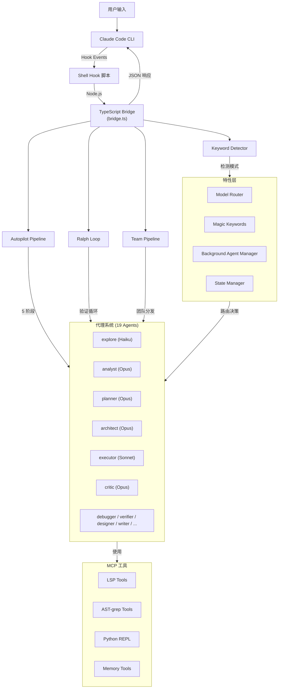
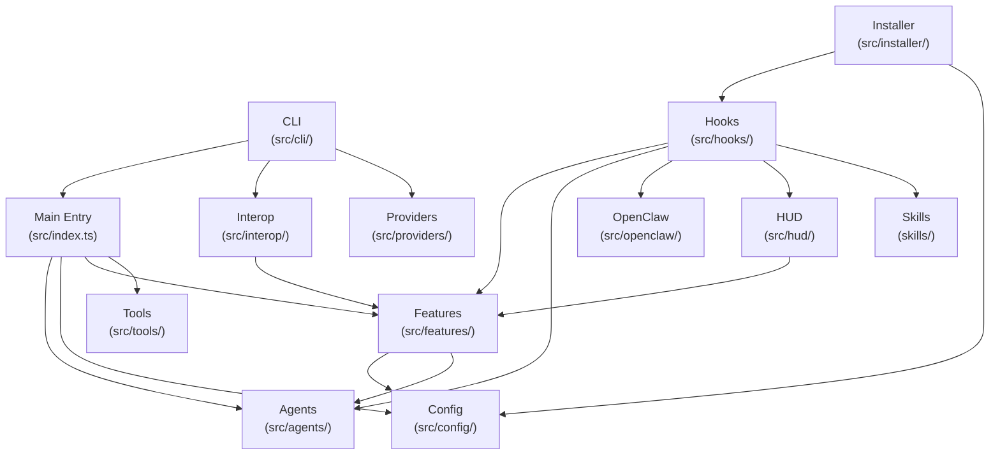
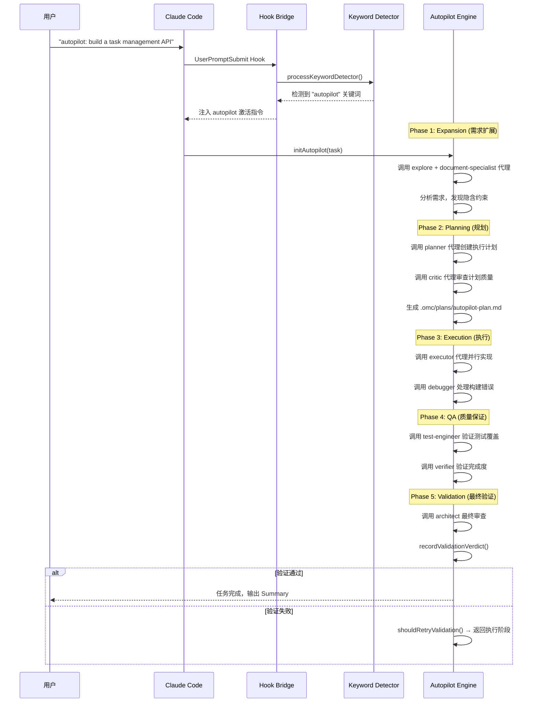
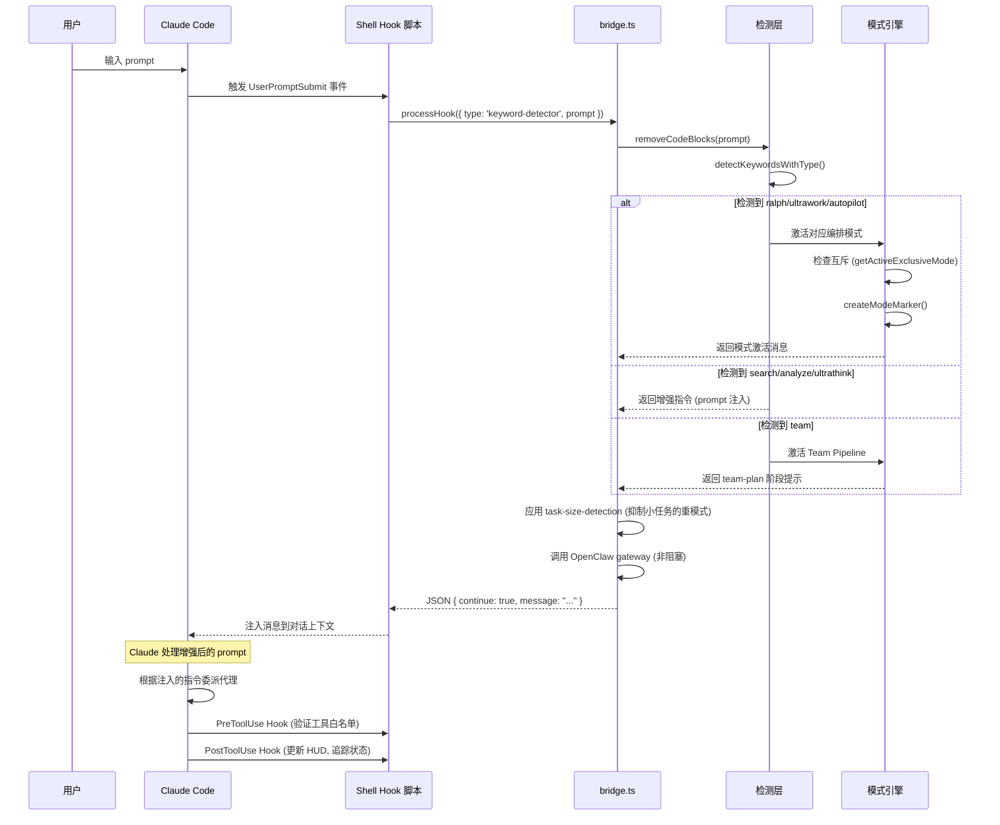

# oh-my-claudecode 源码学习笔记

> 仓库地址：[oh-my-claudecode](https://github.com/Yeachan-Heo/oh-my-claudecode)
> 学习日期：2026-04-05

---

> **以下为 AI 源码分析**
>
> ### 一句话概括
>
> oh-my-claudecode（OMC）是一个面向 Claude Code 的多智能体编排系统，通过 19 个专业化代理、Hook 事件驱动架构和智能模型路由，实现零配置的自动化并行任务执行与协调。
>
> ### 要点速览
>
> | 核心模块 | 职责 | 关键文件 |
> |---------|------|---------|
> | Agents | 19 个专业代理定义与管理 | `src/agents/definitions.ts` |
> | Hooks | 事件驱动的 Claude Code 集成 | `src/hooks/bridge.ts` |
> | Features | 模型路由、Magic Keywords、状态管理 | `src/features/` |
> | CLI | 命令行入口与 tmux 集成 | `src/cli/index.ts`, `src/cli/launch.ts` |
> | Tools | LSP/AST/Python REPL 等 MCP 工具 | `src/tools/` |
> | HUD | 实时状态栏可视化 | `src/hud/render.ts` |
> | Skills | 50+ 可复用 Markdown 技能文件 | `skills/` |
> | OpenClaw | 外部网关集成（Discord/Telegram/Slack） | `src/openclaw/` |

---

## 项目简介

oh-my-claudecode（简称 OMC）是一个为 Claude Code CLI 设计的多智能体编排插件系统。它的核心价值是**零学习曲线**地为 Claude Code 注入多代理协调能力：用户只需输入自然语言指令（如 `autopilot: build a REST API`），OMC 就会自动将任务分解、分配给 19 个专业化代理并行执行，并通过验证循环确保任务 100% 完成。

OMC 解决的核心问题是：单一 LLM 会话在处理复杂软件工程任务时，缺乏任务分解、并行执行、专业化分工和持久化执行的能力。通过插件式架构与 Claude Code 的 Hook 系统深度集成，OMC 无需修改 Claude Code 本身即可提供强大的编排能力。

## 技术栈

| 类别 | 技术 |
|------|------|
| 语言 | TypeScript (ESM) |
| 框架 | Claude Agent SDK (`@anthropic-ai/claude-agent-sdk`) |
| 构建工具 | TypeScript Compiler (`tsc`) + esbuild |
| 依赖管理 | npm |
| 测试框架 | Vitest |
| 运行时 | Node.js >= 20.0.0 |
| 协议 | MCP (Model Context Protocol) |
| 终端集成 | tmux |
| 数据库 | better-sqlite3（HUD 状态存储） |
| Schema 验证 | Zod + Ajv |

## 目录结构

```
oh-my-claudecode/
├── src/                          # TypeScript 源码
│   ├── index.ts                  # 主入口 - createOmcSession()
│   ├── agents/                   # 19 个专业代理定义
│   │   ├── definitions.ts        # 代理注册表和 OMC 系统提示
│   │   ├── types.ts              # AgentConfig, AgentPromptMetadata 等类型
│   │   ├── utils.ts              # loadAgentPrompt(), 安全工具
│   │   ├── architect.ts          # 架构师代理 (Opus)
│   │   ├── executor.ts           # 执行器代理 (Sonnet)
│   │   ├── explore.ts            # 探索代理 (Haiku)
│   │   └── ...                   # planner, analyst, critic 等
│   ├── hooks/                    # 事件驱动的 Hook 系统
│   │   ├── bridge.ts             # 核心 Shell-TypeScript 桥接 (~2400 行)
│   │   ├── autopilot/            # 自动驾驶模式 (5 阶段流水线)
│   │   ├── ralph/                # 持久化执行模式 (验证循环)
│   │   ├── learner/              # 技能自动学习提取
│   │   ├── team-pipeline/        # Team 编排流水线
│   │   ├── keyword-detector/     # Magic Keyword 检测
│   │   └── ...                   # 30+ 个 Hook 模块
│   ├── features/                 # 核心特性模块
│   │   ├── magic-keywords.ts     # 魔法关键词处理器
│   │   ├── model-routing/        # 智能模型路由 (Haiku/Sonnet/Opus)
│   │   ├── background-agent/     # 后台代理并发管理
│   │   ├── boulder-state/        # 活跃工作计划状态
│   │   ├── context-injector/     # 上下文自动注入
│   │   └── ...
│   ├── cli/                      # CLI 命令系统
│   │   ├── index.ts              # Commander.js 命令注册
│   │   ├── launch.ts             # 三阶段启动 (preLaunch→run→post)
│   │   ├── commands/team.ts      # Team 命令 (tmux worker 管理)
│   │   └── commands/wait.ts      # 速率限制等待守护进程
│   ├── tools/                    # MCP 工具实现
│   │   ├── lsp-tools.ts          # LSP 工具 (诊断/悬停/跳转)
│   │   ├── ast-tools.ts          # AST-grep 代码搜索
│   │   └── python-repl/          # Python REPL 沙箱
│   ├── hud/                      # 实时状态栏系统
│   │   ├── render.ts             # tmux 状态栏渲染
│   │   ├── state.ts              # SQLite 状态存储
│   │   └── elements/             # 20+ 可组合 HUD 元素
│   ├── config/                   # 配置加载与合并
│   ├── openclaw/                 # OpenClaw 外部网关集成
│   ├── providers/                # Git 平台适配 (GitHub/GitLab/...)
│   ├── interop/                  # 跨 CLI 工具状态共享
│   └── installer/                # 安装与 Hook 注册
├── skills/                       # 50+ Markdown 技能文件
│   ├── autopilot/SKILL.md        # 自动驾驶技能
│   ├── team/SKILL.md             # Team 编排技能
│   ├── ralph/SKILL.md            # 持久模式技能
│   └── ...
├── agents/                       # 代理 Markdown 提示模板
├── hooks/                        # Shell Hook 脚本配置
├── bridge/                       # CJS 入口桥接文件
│   ├── cli.cjs                   # CLI 入口
│   └── mcp-server.cjs            # MCP 服务器入口
├── scripts/                      # 构建和运维脚本
├── benchmark/                    # 性能基准测试
└── dist/                         # 编译输出
```

## 架构设计

### 整体架构

oh-my-claudecode 采用**事件驱动 + 多代理编排**的分层架构。系统通过 Claude Code 的 Hook 事件机制与宿主进程通信，Shell 脚本调用 Node.js Bridge 处理复杂逻辑，Bridge 返回 JSON 指令控制 Claude Code 的行为。

核心设计哲学是"**不修改 Claude Code，只增强 Claude Code**"——通过 Hook、MCP 工具和 CLAUDE.md 注入三种非侵入式手段，为 Claude Code 注入多代理协调能力。



### 核心模块

#### 1. 代理系统 (`src/agents/`)

**职责**：定义 19 个专业化代理，每个代理有独立的系统提示、模型配置和工具限制。

**核心文件**：
- `definitions.ts` — 代理注册表，`getAgentDefinitions()` 返回完整代理配置
- `types.ts` — 核心类型：`AgentConfig`、`AgentPromptMetadata`、`ModelType`、`AgentCost`
- `utils.ts` — `loadAgentPrompt(name)` 从 Markdown 文件动态加载提示，含路径遍历防护

**代理分层**：

| 分层 | 代理 | 模型 | 成本 | 职责 |
|------|------|------|------|------|
| Build/Analysis | explore | Haiku | FREE | 代码搜索、项目结构发现 |
| Build/Analysis | analyst | Opus | EXPENSIVE | 隐藏需求分析、边界情况识别 |
| Build/Analysis | planner | Opus | EXPENSIVE | 任务规划、执行计划创建 |
| Build/Analysis | architect | Opus | EXPENSIVE | 系统设计、架构决策 |
| Build/Analysis | debugger | Sonnet | CHEAP | 根因分析、回归隔离 |
| Build/Analysis | executor | Sonnet | CHEAP | 代码实现、Bug 修复 |
| Build/Analysis | verifier | Sonnet | CHEAP | 完成度验证、测试充分性 |
| Build/Analysis | tracer | Sonnet | EXPENSIVE | 因果追踪、假设竞争排名 |
| Review | security-reviewer | Sonnet | CHEAP | 安全漏洞、OWASP 检测 |
| Review | code-reviewer | Opus | EXPENSIVE | 全面代码审查 |
| Specialist | test-engineer | Sonnet | CHEAP | 测试策略、覆盖率分析 |
| Specialist | designer | Sonnet | CHEAP | UI/UX 架构、交互设计 |
| Specialist | writer | Haiku | FREE | 文档编写 |
| Specialist | qa-tester | Sonnet | CHEAP | tmux CLI 交互测试 |
| Specialist | scientist | Sonnet | CHEAP | 数据分析、统计研究 |
| Specialist | git-master | Sonnet | CHEAP | Git 操作、原子提交 |
| Specialist | document-specialist | Sonnet | CHEAP | 外部文档查找 |
| Specialist | code-simplifier | Opus | EXPENSIVE | 代码简化重构 |
| Coordination | critic | Opus | EXPENSIVE | 计划审查、差距分析 |

**标准编排流程**：
```
explore → analyst → planner → critic → executor → architect (verify)
```

#### 2. Hook 系统 (`src/hooks/`)

**职责**：通过 Claude Code 的原生 Hook 事件（UserPromptSubmit、Stop、PreToolUse、PostToolUse 等），拦截和增强 Claude Code 的行为。

**核心文件**：
- `bridge.ts` — 核心桥接，`processHook()` 函数处理所有 Hook 事件分发（~2400 行）
- `index.ts` — 模块统一导出（~825 行），包含 30+ 个 Hook 的所有公开 API

**关键 Hook 模块**：

| Hook | 触发事件 | 核心功能 |
|------|---------|---------|
| keyword-detector | UserPromptSubmit | 检测 Magic Keywords，激活编排模式 |
| autopilot | 多个事件 | 5 阶段自动执行流水线 |
| ralph | Stop | 持久化执行循环，确保任务完成 |
| team-pipeline | 多个事件 | Team 模式阶段转换 |
| learner | PostToolUse | 自动提取可复用技能 |
| ultrawork | 多个事件 | 最大并行执行模式 |
| think-mode | UserPromptSubmit | Extended Thinking 激活 |
| recovery | 多个事件 | 上下文窗口/编辑错误自动恢复 |
| preemptive-compaction | PostToolUse | 上下文使用率监控与压缩 |
| omc-orchestrator | PreToolUse/PostToolUse | 编排器行为约束 |

**事件分发表（bridge.ts `processHook()` switch 语句）**：

```
processHook() 入口
├─ keyword-detector    → processKeywordDetector()
├─ stop-continuation   → processPersistentMode()
├─ ralph/persistent    → processPersistentMode()
├─ session-start       → processSessionStart()      [异步]
├─ pre-tool-use        → processPreToolUse()         [同步]
├─ post-tool-use       → processPostToolUse()        [异步]
├─ autopilot           → processAutopilot()
├─ session-end         → handleSessionEnd()          [动态 import]
├─ subagent-start/stop → processSubagent*()          [动态 import]
├─ pre-compact         → processPreCompact()         [动态 import]
├─ permission-request  → handlePermissionRequest()   [动态 import]
└─ code-simplifier     → processCodeSimplifier()     [动态 import]
```

#### 3. 特性层 (`src/features/`)

**职责**：提供编排系统的核心决策和管理能力。

**Model Routing（智能模型路由）**：
- `router.ts` — 路由引擎，根据任务复杂度选择 Haiku/Sonnet/Opus
- `scorer.ts` — 复杂度评分器，从词法/结构/上下文三个维度评估
- `rules.ts` — 显式路由规则（如特定代理强制使用特定模型）
- `signals.ts` — 信号提取器（词数、关键词密度、子任务数等）
- 评分流程：Signal Extraction → Score Calculation → Rule Evaluation → Tier Selection → Model Assignment

**Magic Keywords（魔法关键词）**：
- `magic-keywords.ts` — 4 个内置增强：ultrawork、search、analyze、ultrathink
- 支持多语言检测（英、中、日、韩、越南语）
- `hasActionableTrigger()` 区分"信息查询"和"执行指令"上下文
- `createMagicKeywordProcessor()` 返回可配置的 prompt 处理器

**其他关键特性**：
- `background-agent/` — 后台代理并发管理，限制最大并发数
- `boulder-state/` — 活跃工作计划的持久化状态
- `context-injector/` — 优先级队列式上下文注入（CRITICAL > HIGH > MEDIUM > LOW）
- `state-manager/` — 带 TTL 缓存的全局状态管理（5 秒 TTL，200 条上限）
- `task-decomposer/` — 任务自动分解
- `verification/` — 验证协议（BUILD/TEST/LINT/FUNCTIONALITY 等 7 项检查）

#### 4. CLI 系统 (`src/cli/`)

**职责**：提供 `omc` 命令行入口，管理 Claude Code 启动流程和 tmux 集成。

**核心文件**：
- `index.ts` — Commander.js 命令注册（ask、team、hud、wait、launch 等）
- `launch.ts` — **三阶段启动模型**：`preLaunch()` → `runClaude()` → `postLaunch()`
- `tmux-utils.ts` — tmux 集成工具，`resolveLaunchPolicy()` 决策启动方式

**启动策略**：

| 策略 | 条件 | 行为 |
|------|------|------|
| inside-tmux | 已在 tmux 会话中 | 直接在当前 tmux 中运行 |
| outside-tmux | 不在 tmux 中 | 创建新 tmux 会话后运行 |
| direct | 不需要 tmux | 直接作为子进程运行 |

**Team 命令**（`commands/team.ts`）：
- `startTeamJob()` — 启动 tmux worker 面板
- 支持多种 provider：`claude`、`codex`、`gemini`
- 管理 worker 生命周期：spawn → monitor → shutdown

#### 5. MCP 工具 (`src/tools/`)

**职责**：为代理提供 IDE 级能力，通过 MCP 协议暴露。

| 工具 | 文件 | 功能 |
|------|------|------|
| LSP | `lsp-tools.ts` | 代码诊断、悬停信息、定义跳转、引用查找 |
| AST | `ast-tools.ts` | ast-grep 结构化代码搜索 |
| Python REPL | `python-repl/` | 安全的 Python 沙箱执行（Unix socket 通信） |
| Memory | `memory-tools.ts` | 项目记忆读写（.omc/memory/） |
| State | `state-tools.ts` | 编排状态管理 |
| Skills | `skills-tools.ts` | 技能文件 CRUD |
| Notepad | `notepad-tools.ts` | 压缩弹性记忆（跨 compaction 持久化） |
| Trace | `trace-tools.ts` | 代理执行追踪 |
| Session History | `session-history-tools.ts` | 历史会话搜索 |

#### 6. HUD 系统 (`src/hud/`)

**职责**：在 tmux 状态栏实时展示编排指标。

- `render.ts` — 核心渲染引擎，`renderHud()` 组合 20+ 元素生成状态栏字符串
- `state.ts` — SQLite 状态存储，支持 HUD 数据持久化
- `elements/` — 可组合元素：agents、autopilot、token-usage、context、git、model 等
- 支持多种预设布局：focused、detailed、minimal

### 模块依赖关系



## 核心流程

### 流程一：Autopilot 自动执行流水线

Autopilot 是 OMC 最核心的编排模式，将用户请求转化为**五阶段流水线**自动执行：



**关键状态管理**：
- `initAutopilot()` 初始化状态文件（`.omc/state/autopilot.json`）
- `transitionPhase()` 驱动阶段转换，每个转换返回 `TransitionResult`
- 每个阶段有对应的 prompt 生成器：`getExpansionPrompt()`、`getExecutionPrompt()` 等
- `cancelAutopilot()` / `resumeAutopilot()` 支持中断与恢复

### 流程二：Hook 事件处理流程（从用户输入到代理分发）



**关键决策点**：
1. **keyword-detector** 区分"信息查询"和"执行指令"（`isInformationalKeywordContext()`）
2. **task-size-detection** 对小任务自动抑制 ultrawork/ralph 等重量级模式
3. **ralplan 门控** 优先进入规划阶段再执行
4. **互斥模式管理** 同一时间只能激活一个排他模式（ralph/ultrawork/autopilot/autoresearch）

## 关键设计亮点

### 1. 非侵入式插件架构

**解决的问题**：如何在不修改 Claude Code 源码的情况下注入多代理编排能力。

**实现方式**：通过三种非侵入手段集成：
- **Hook 脚本**（`hooks/hooks.json`）→ 拦截 Claude Code 的生命周期事件
- **MCP 工具服务器**（`bridge/mcp-server.cjs`）→ 为代理注入 LSP/AST 等工具
- **CLAUDE.md 注入**（安装器写入）→ 改变 Claude Code 的默认行为

**为什么这样设计**：Claude Code 的 Hook 系统允许在 `UserPromptSubmit`、`Stop`、`PreToolUse`、`PostToolUse` 等事件上注册 Shell 脚本。OMC 利用这一机制，通过 Shell 脚本调用 Node.js Bridge 处理复杂逻辑，再将 JSON 指令返回给 Claude Code。这种"Shell 薄壳 + TypeScript 厚核"的设计既遵循了 Claude Code 的插件规范，又能利用 TypeScript 的类型安全和丰富生态。

### 2. 智能模型路由（Model Routing）

**解决的问题**：不同复杂度的子任务使用同一模型会导致成本浪费或质量不足。

**实现方式**（`src/features/model-routing/`）：
- **信号提取**（`signals.ts`）：从词法（词数、关键词密度）、结构（子任务数、领域类型）、上下文（代理类型、历史）三个维度提取特征
- **复杂度评分**（`scorer.ts`）：加权求和得到 0-1 范围分数
- **规则评估**（`rules.ts`）：显式规则优先于评分（如 architect 代理强制 Opus）
- **模型映射**：LOW → Haiku（免费快速）、MEDIUM → Sonnet（平衡）、HIGH → Opus（深度推理）

**为什么这样设计**：通过三层决策（信号→评分→规则），实现了 30-50% 的 token 成本节省，同时保证复杂任务使用高端模型。评分与规则分离使得系统既有默认智能行为，又允许用户精确控制。

### 3. 持久化执行模式（Ralph Loop）

**解决的问题**：LLM 在复杂任务中容易"半途而废"，声称完成但实际未验证。

**实现方式**（`src/hooks/ralph/`）：
- **循环驱动**（`loop.ts`）：Ralph 通过 `Stop` Hook 拦截 Claude Code 的停止行为
- `incrementRalphIteration()` 递增迭代计数
- `shouldCompleteByPrd()` 检查 PRD（Product Requirements Document）完成状态
- 只有当 `detectArchitectApproval()` 返回 true 时才允许停止
- **验证器**（`verifier.ts`）：调用 architect 代理进行独立验证
- **进度追踪**（`progress.ts`）：记录每次迭代的学习和模式

**为什么这样设计**：Ralph 的名字来自"西西弗斯"——永不放弃。通过在 Stop 事件上设置门控，强制 Claude Code 在任务真正完成前继续工作。Architecture Verification Loop 确保不是 Claude 自己说"完成了"就算完成，而是由独立的 architect 代理进行交叉验证。

### 4. 事件驱动的 Hook Bridge 架构

**解决的问题**：Shell Hook 脚本能力有限，无法处理复杂的状态管理和决策逻辑。

**实现方式**（`src/hooks/bridge.ts`）：
- Shell 脚本作为薄壳，将事件 JSON 传递给 `node bridge.ts`
- `processHook()` 函数通过 switch-case 分发到 16+ 个处理函数
- 大型模块使用 **动态 `import()`** 延迟加载（如 session-end、pre-compact），提升启动性能
- `bridgeNormalize()` 统一不同 Hook 事件的输入格式
- 输出标准化为 `{ continue: boolean, message?: string }` JSON

**为什么这样设计**：将所有 Hook 处理集中到一个 Bridge 入口，避免了每个 Hook 都需要独立的 Node.js 进程启动开销。动态 import 确保只加载当前事件所需的模块。标准化的输入输出格式使得新 Hook 的添加非常简单。

### 5. 技能自动学习（Learner）

**解决的问题**：调试和解决问题的经验散落在会话历史中，无法复用。

**实现方式**（`src/hooks/learner/`）：
- `detectExtractableMoment()` 分析代理响应，识别"值得提取"的经验
- `processResponseForDetection()` 评估技能质量分数（`MIN_QUALITY_SCORE` 门槛）
- `writeSkill()` 将提取的技能写入 `.omc/skills/` 或 `~/.omc/skills/`
- `findMatchingSkills()` 在后续会话中，根据触发器自动注入匹配的技能
- 支持 trigger 关键词匹配、质量验证、去重检查

**为什么这样设计**：这实现了"学习一次，永远复用"的知识管理理念。通过质量门控（`MIN_QUALITY_SCORE`）确保只保存高价值经验，通过触发器匹配实现无感知的自动注入。项目级和用户级两层作用域支持团队共享和个人积累。
