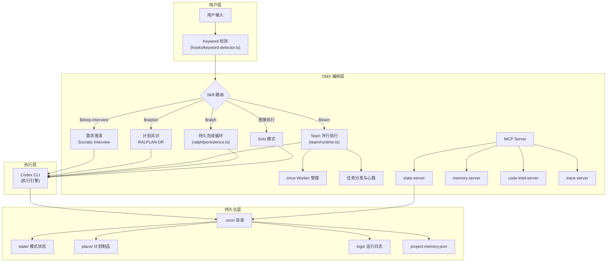
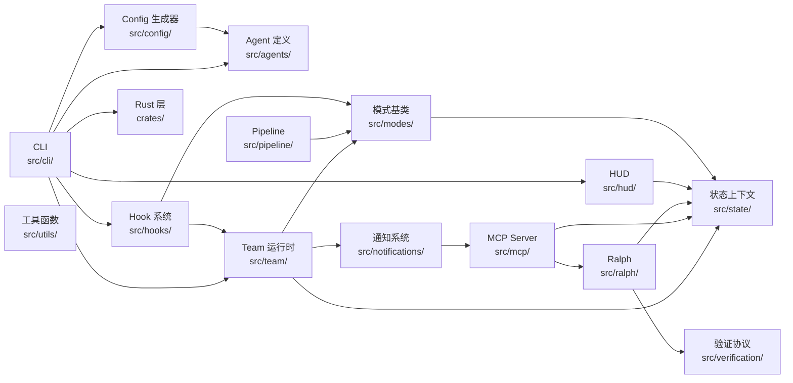
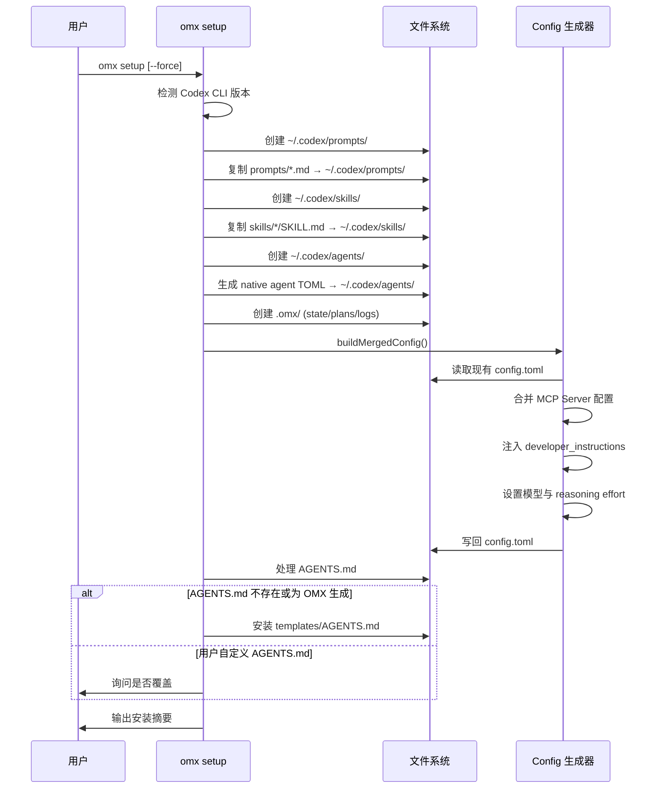
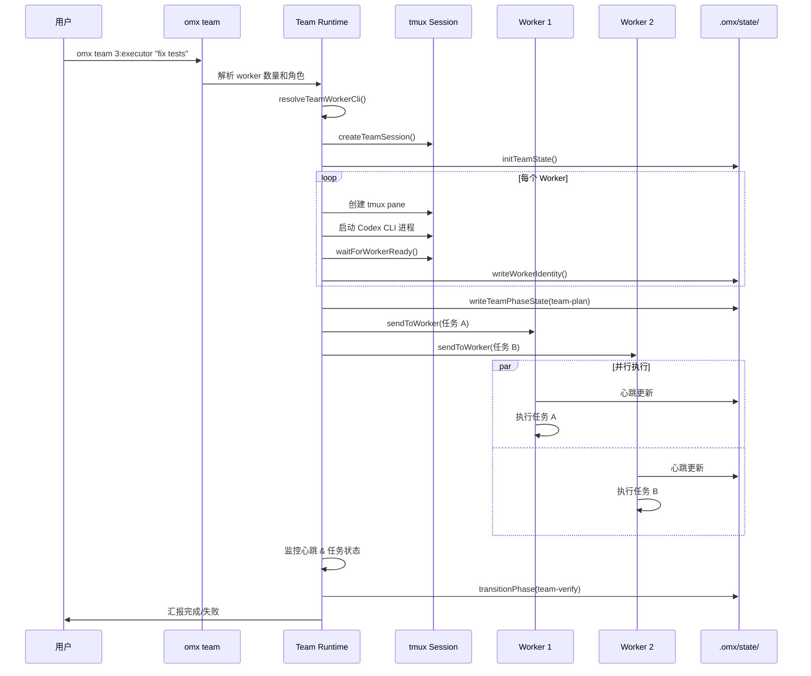

# oh-my-codex 源码学习笔记

> 仓库地址：[oh-my-codex](https://github.com/Yeachan-Heo/oh-my-codex)
> 学习日期：2026-04-05

---

> **以下为 AI 源码分析**
>
> ### 一句话概括
>
> oh-my-codex (OMX) 是 OpenAI Codex CLI 的多 Agent 编排增强层，通过角色路由、工作流 Skill、Team 协作运行时和持久化状态管理，为 Codex 提供从需求澄清到并行执行再到验证完成的完整工程工作流。
>
> ### 要点速览
>
> | 核心模块 | 职责 | 关键文件 |
> |---------|------|---------|
> | CLI 入口 | 命令解析、子命令分发、Codex 进程启动 | `src/cli/index.ts`, `src/cli/omx.ts` |
> | Agent 定义 | 30+ 角色定义与路由元数据 | `src/agents/definitions.ts`, `prompts/*.md` |
> | Config 生成 | 合并 MCP、模型、特性开关到 Codex config.toml | `src/config/generator.ts` |
> | Team 运行时 | tmux 多 Worker 编排、任务分发、心跳监控 | `src/team/runtime.ts`, `src/team/orchestrator.ts` |
> | Keyword 检测 | 用户输入关键词路由到对应 Skill | `src/hooks/keyword-detector.ts` |
> | MCP Server | 状态、记忆、代码索引、Trace 四类 MCP 服务 | `src/mcp/state-server.ts`, `src/mcp/memory-server.ts` |
> | HUD 状态栏 | tmux 状态栏实时渲染工作流状态 | `src/hud/render.ts`, `src/hud/index.ts` |
> | Pipeline 编排 | autopilot 模式的多阶段流水线 | `src/pipeline/orchestrator.ts` |
> | Rust 性能层 | explore 安全沙箱、运行时核心、SparkShell | `crates/omx-explore/`, `crates/omx-runtime-core/` |

---

## 项目简介

oh-my-codex (OMX) 是一个围绕 OpenAI Codex CLI 构建的工作流增强层（workflow layer）。它不替换 Codex，而是在其之上提供多 Agent 编排能力。核心价值在于：将零散的 AI 编程交互升级为结构化的端到端工程工作流——从需求澄清（deep-interview）、计划共识（ralplan）、并行执行（team）到持久化完成循环（ralph），每个阶段都有专门的 Agent 角色和 Skill 驱动。项目状态持久化在 `.omx/` 目录下，支持跨会话恢复和多渠道通知。

## 技术栈

| 类别 | 技术 |
|------|------|
| 语言 | TypeScript (主体) + Rust (性能关键路径) |
| 框架 | Node.js 20+ (ESM), MCP SDK (`@modelcontextprotocol/sdk`) |
| 构建工具 | `tsc` (TypeScript), `cargo` (Rust), GitHub Actions CI |
| 依赖管理 | npm + Cargo workspace |
| 测试框架 | Node.js 内置 `node --test` + `c8` 覆盖率 + `cargo test` |

## 目录结构

```
oh-my-codex/
├── src/                          # TypeScript 源码（核心）
│   ├── cli/                      # CLI 入口与子命令（omx setup/team/explore/...）
│   ├── agents/                   # Agent 角色定义与 native config 生成
│   ├── config/                   # Codex config.toml 合并生成器
│   ├── team/                     # Team 多 Worker 编排运行时（tmux）
│   ├── mcp/                      # MCP Server（state/memory/code-intel/trace/team）
│   ├── hooks/                    # Hook 系统（keyword 检测、session、codebase-map）
│   ├── modes/                    # 工作流模式基类（autopilot/ralph/team/...）
│   ├── pipeline/                 # autopilot 流水线编排器
│   ├── ralph/                    # ralph 持久化完成循环的状态契约
│   ├── hud/                      # HUD 状态栏渲染（tmux statusline）
│   ├── notifications/            # 通知系统（桌面/Discord/Telegram）
│   ├── verification/             # 任务完成验证协议
│   ├── openclaw/                 # OpenClaw 通知网关集成
│   ├── planning/                 # 计划制品管理（PRD/test-spec）
│   ├── visual/                   # 视觉验证（screenshot verdict）
│   ├── autoresearch/             # 自动研究模式
│   ├── ralplan/                  # RALPLAN 共识计划运行时
│   ├── state/                    # 模式状态上下文
│   ├── utils/                    # 工具函数（路径、JSON、平台命令）
│   └── scripts/                  # 构建脚本、hook 引擎、eval 工具
├── crates/                       # Rust workspace（5 个 crate）
│   ├── omx-explore/              # explore 安全沙箱 harness（白名单命令）
│   ├── omx-mux/                  # 多路复用层
│   ├── omx-runtime-core/         # 运行时核心（锁、状态、JSON）
│   ├── omx-runtime/              # 运行时适配器
│   └── omx-sparkshell/           # SparkShell 轻量执行器
├── prompts/                      # 30+ Agent 角色 prompt markdown 文件
├── skills/                       # 39+ Skill 工作流（每个含 SKILL.md）
├── templates/                    # AGENTS.md 编排模板
├── missions/                     # 任务定义（用于开发/测试）
├── playground/                   # 演示项目（BayesOpt、排序优化等）
├── docs/                         # 文档（发版说明、契约、QA、集成指南）
└── .github/                      # CI/CD workflow
```

## 架构设计

### 整体架构

OMX 采用**分层编排架构**：最底层是 OpenAI Codex CLI 作为执行引擎，中间层是 OMX 的 TypeScript 编排逻辑（CLI + MCP Server + Hook 系统），最上层是用户通过 `$skill` 关键词驱动的工作流。Rust 层以可选的性能扩展形式存在，为 explore 和 sparkshell 提供安全沙箱。



### 核心模块

#### 1. CLI 入口 (`src/cli/`)

CLI 是 OMX 的主入口，通过 `omx` 命令提供所有功能。

- **核心文件**: `index.ts`（主分发器，约 600+ 行）, `omx.ts`（入口 shim）, `constants.ts`（命令行 flag 定义）
- **关键函数**: `main()` 解析 argv 并分发到 `setup`/`team`/`explore`/`ralph`/`hud` 等子命令
- **启动模式**: `--madmax`（自动审批绕过）, `--high`/`--xhigh`（高推理）, `--spark`（轻量模型）
- **关系**: 依赖 `config/generator` 生成配置，调用 `team/runtime` 启动 Team 模式

#### 2. Agent 定义系统 (`src/agents/`)

定义了 30+ 个专业化 Agent 角色，每个角色有明确的路由元数据。

- **核心文件**: `definitions.ts`（角色注册表）, `native-config.ts`（生成 Codex native agent TOML）
- **关键接口**: `AgentDefinition` 包含 `reasoningEffort`、`posture`（frontier-orchestrator/deep-worker/fast-lane）、`modelClass`、`routingRole`、`tools` 访问模式
- **分类**: Build（explore/planner/executor/verifier）、Review（style/quality/security/api）、Domain（test-engineer/designer/writer）、Product（PM/UX）、Coordination（critic/vision）
- **关系**: `prompts/*.md` 存储实际 prompt 内容，运行时按名称加载

#### 3. Config 生成器 (`src/config/`)

将 OMX 的 MCP Server、模型设置、特性开关合并到 Codex 的 `config.toml`。

- **核心文件**: `generator.ts`（TOML 合并逻辑）, `models.ts`（默认模型定义）, `mcp-registry.ts`（MCP 注册表）
- **关键函数**: `buildMergedConfig()` 执行配置合并，`getOmxTopLevelLines()` 生成 OMX 级配置
- **设计要点**: 严格按 TOML 规范将 root-level key 放在 `[table]` 之前，支持 MCP 共享注册表同步

#### 4. Team 运行时 (`src/team/`)

最复杂的模块，实现 tmux 多 Worker 编排。

- **核心文件**: `runtime.ts`（运行时主逻辑）, `orchestrator.ts`（阶段状态机）, `tmux-session.ts`（tmux 会话管理）, `team-ops.ts`（文件系统状态操作）
- **Team 流水线**: `team-plan → team-prd → team-exec → team-verify → team-fix (循环)`
- **状态机**: `TeamPhase` 类型定义严格的阶段转换规则，`transitionPhase()` 验证合法性
- **角色分配**: 每个阶段有推荐角色——plan 用 analyst+planner，exec 用 executor+designer+test-engineer，verify 用 verifier+quality-reviewer
- **Worker 管理**: 通过 tmux pane 隔离 Worker 进程，支持心跳检测、任务 claim/release、mailbox 通信

#### 5. Keyword 检测引擎 (`src/hooks/`)

将用户自然语言输入路由到对应的 Skill 工作流。

- **核心文件**: `keyword-detector.ts`（检测引擎）, `keyword-registry.ts`（关键词注册表）, `task-size-detector.ts`（任务规模分类）
- **检测策略**: 优先识别显式 `$skill` 调用（左到右），然后按优先级匹配隐式关键词
- **Ralplan Gate**: 当执行模式（ralph/team/autopilot）遇到不充分的 prompt 时，自动降级为 ralplan 先做计划
- **任务规模过滤**: 小任务自动抑制重编排模式，避免过度编排

#### 6. MCP Server (`src/mcp/`)

通过 MCP 协议为 Codex 提供状态管理、项目记忆、代码索引和 Trace 能力。

- **核心文件**: `state-server.ts`, `memory-server.ts`, `code-intel-server.ts`, `trace-server.ts`, `team-server.ts`, `bootstrap.ts`
- **状态服务器**: 提供 `state_read`/`state_write`/`state_clear`/`state_list_active` 工具，支持 7 种模式（autopilot/team/ralph/ultrawork/ultraqa/ralplan/deep-interview）
- **引导机制**: `autoStartStdioMcpServer()` 通过 stdio transport 自动启动，支持环境变量禁用

#### 7. Rust 性能层 (`crates/`)

5 个 Rust crate 提供安全沙箱和性能关键路径。

- **omx-explore**: 安全沙箱 harness，白名单命令（rg/grep/ls/find/cat/head/tail 等），防止 explore 模式执行危险操作
- **omx-runtime-core**: 运行时核心功能（文件锁 `fs2`、状态 JSON 序列化 `serde`）
- **omx-mux**: 多路复用层
- **omx-sparkshell**: 轻量 Shell 执行器
- **omx-runtime**: 运行时适配器

### 模块依赖关系



## 核心流程

### 流程一：omx setup 安装流程

setup 是用户首次使用 OMX 的入口，它将所有组件安装到 Codex 环境中。



**关键逻辑**:
- `setup.ts` 支持 `user`（全局）和 `project`（项目级）两种安装范围
- `generator.ts` 的 `buildMergedConfig()` 小心地在 TOML root-level 和 `[table]` 之间正确排列
- 自动检测并同步统一 MCP 注册表（`mcp-registry.ts`）

### 流程二：Team 模式并行执行

Team 模式是 OMX 最复杂的工作流，通过 tmux 实现多 Worker 并行编排。



**关键逻辑**:
- `runtime.ts` 管理 Worker 生命周期：创建、心跳检测、任务分发、回收
- `orchestrator.ts` 的状态机确保阶段转换合法：plan→prd→exec→verify→fix(循环)
- `tmux-session.ts` 封装了 tmux 操作：session 创建/销毁、pane 管理、Worker 进程控制
- `team-ops.ts` 通过文件系统实现 Worker 间通信（inbox/mailbox/heartbeat/task claim）
- fix 循环有最大重试次数（默认 3），超限自动转为 `failed` 终态

## 关键设计亮点

### 1. Ralplan Gate — 智能执行准入

**问题**: 用户可能用模糊指令直接触发重型编排（如 `ralph fix it`），导致浪费资源。

**实现**: `keyword-detector.ts` 中的 `applyRalplanGate()` 函数检测执行关键词（ralph/autopilot/team/ultrawork），若 prompt 不够具体（`isUnderspecifiedForExecution()`），自动将其降级为 `ralplan` 先做计划。具体性判断通过 `WELL_SPECIFIED_SIGNALS` 正则数组（文件路径、函数名、issue 编号、代码块等）实现。

**设计原因**: 避免在需求不清时启动昂贵的多 Agent 编排，强制"先计划再执行"的工程纪律。

### 2. 文件系统作为 IPC — Team 通信机制

**问题**: 多个 Codex Worker 进程需要协调通信，但它们运行在独立的 tmux pane 中。

**实现**: `team-ops.ts` 将 `.omx/state/team/` 目录作为共享文件系统 IPC：Worker 身份（`worker-{id}.json`）、心跳（`heartbeat-{id}.json`）、任务（`task-{id}.json` + claim 文件）、inbox（`inbox-{id}.json`）、mailbox（`mailbox-{id}-{seq}.json`）。`state-server.ts` 使用 `withStateWriteLock()` 保证并发写安全。

**设计原因**: 避免引入额外的 IPC 机制（如 socket/Redis），利用文件系统的天然持久性实现跨会话恢复，同时 JSON 格式便于调试和检查。

### 3. Agent 角色路由元数据

**问题**: 30+ Agent 角色需要根据任务复杂度和类型智能分配。

**实现**: `definitions.ts` 中每个 `AgentDefinition` 携带多维路由元数据——`posture`（frontier-orchestrator/deep-worker/fast-lane）决定工作姿态，`modelClass`（frontier/standard/fast）决定模型选择，`reasoningEffort`（low/medium/high）决定推理深度，`tools` 决定工具访问权限，`routingRole`（leader/specialist/executor）决定协作角色。

**设计原因**: 将角色选择从硬编码提升为数据驱动，让 AGENTS.md 编排引擎根据任务形状自动匹配最优角色组合。

### 4. Explore 安全沙箱（Rust）

**问题**: explore 模式需要执行 shell 命令搜索代码，但必须防止意外执行危险操作。

**实现**: `crates/omx-explore/src/main.rs` 用 Rust 实现白名单沙箱，仅允许 `rg`/`grep`/`ls`/`find`/`wc`/`cat`/`head`/`tail`/`pwd`/`printf` 这些只读命令。通过 `--internal-allowlist-direct` 和 `--internal-allowlist-shell` 内部 flag 区分直接命令和 shell 包装命令。

**设计原因**: Rust 提供零开销安全保证，白名单模式比黑名单更安全，确保 explore 模式的只读语义。

### 5. 分层模式生命周期管理

**问题**: 8 种工作流模式（autopilot/ralph/team/ultrawork/ultraqa/ralplan/deep-interview/autoresearch）需要统一的生命周期管理。

**实现**: `modes/base.ts` 提供统一的 `ModeState` 接口和 `startMode()`/`readModeState()`/`updateModeState()`/`cancelMode()` 生命周期函数。独占模式（autopilot/autoresearch/ralph/ultrawork）通过 `assertModeStartAllowed()` 互斥，已废弃模式（ultrapilot/pipeline/ecomode）提供迁移提示。所有状态持久化在 `.omx/state/{mode}-state.json`。

**设计原因**: 统一的基类避免每种模式重复实现状态管理逻辑，互斥机制防止模式冲突，废弃提示保证平滑迁移。
